# ChatGPT-Next-Web 后端API接口文档

<cite>
**本文档中引用的文件**
- [app/api/[provider]/[...path]/route.ts](file://app/api/[provider]/[...path]/route.ts)
- [app/api/artifacts/route.ts](file://app/api/artifacts/route.ts)
- [app/api/config/route.ts](file://app/api/config/route.ts)
- [app/api/tencent/route.ts](file://app/api/tencent/route.ts)
- [app/api/upstash/[action]/[...key]/route.ts](file://app/api/upstash/[action]/[...key]/route.ts)
- [app/api/webdav/[...path]/route.ts](file://app/api/webdav/[...path]/route.ts)
- [app/api/openai.ts](file://app/api/openai.ts)
- [app/api/proxy.ts](file://app/api/proxy.ts)
- [app/api/auth.ts](file://app/api/auth.ts)
- [app/api/common.ts](file://app/api/common.ts)
- [app/utils/cloud/upstash.ts](file://app/utils/cloud/upstash.ts)
- [app/constant.ts](file://app/constant.ts)
- [app/config/server.ts](file://app/config/server.ts)
</cite>

## 目录
1. [简介](#简介)
2. [项目结构](#项目结构)
3. [核心组件](#核心组件)
4. [架构概览](#架构概览)
5. [详细组件分析](#详细组件分析)
6. [依赖关系分析](#依赖关系分析)
7. [性能考虑](#性能考虑)
8. [故障排除指南](#故障排除指南)
9. [结论](#结论)

## 简介

ChatGPT-Next-Web的后端API接口系统是一个基于Next.js 13+的现代化API网关，采用Edge Runtime部署，提供了完整的AI服务代理和数据同步功能。该系统通过动态路由机制实现了对多个AI提供商的统一接入，并提供了专门的数据同步和配置管理接口。

### 主要特性

- **动态路由支持**：基于Next.js的`[provider]/[...path]`泛型路由设计
- **多提供商代理**：统一代理OpenAI、Azure、Google、Anthropic等多个AI服务
- **数据同步功能**：通过Upstash Redis和WebDAV实现远程数据同步
- **安全认证**：基于访问码和API密钥的双重认证机制
- **边缘计算优化**：利用Cloudflare Workers和Vercel Edge Functions

## 项目结构

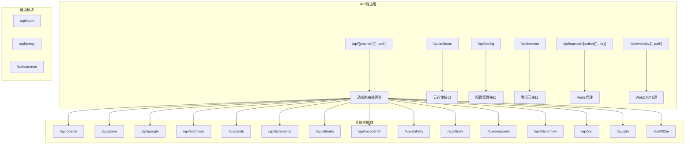

**图表来源**
- [app/api/[provider]/[...path]/route.ts](file://app/api/[provider]/[...path]/route.ts#L20-L86)
- [app/api/artifacts/route.ts](file://app/api/artifacts/route.ts#L1-L74)
- [app/api/config/route.ts](file://app/api/config/route.ts#L1-L32)

**章节来源**
- [app/api/[provider]/[...path]/route.ts](file://app/api/[provider]/[...path]/route.ts#L1-L86)
- [app/api/artifacts/route.ts](file://app/api/artifacts/route.ts#L1-L74)
- [app/api/config/route.ts](file://app/api/config/route.ts#L1-L32)

## 核心组件

### 动态路由系统

动态路由系统是整个API架构的核心，它通过`[provider]/[...path]`模式实现了对多个AI提供商的统一接入。

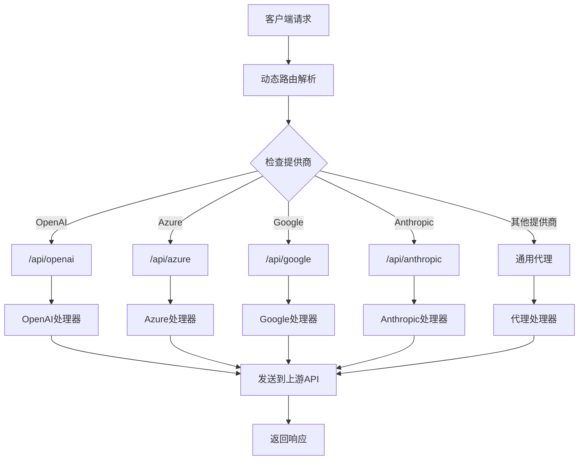

**图表来源**
- [app/api/[provider]/[...path]/route.ts](file://app/api/[provider]/[...path]/route.ts#L26-L58)

### 认证与授权系统

认证系统采用双重验证机制，支持访问码和用户API密钥两种认证方式。

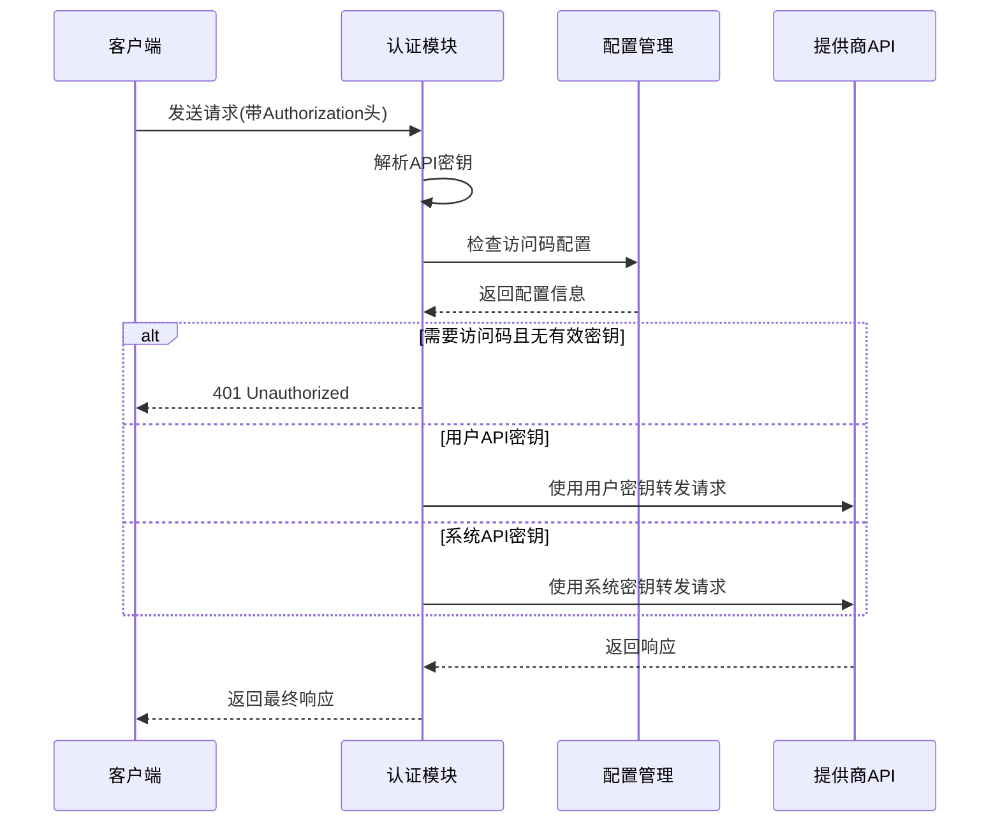

**图表来源**
- [app/api/auth.ts](file://app/api/auth.ts#L27-L129)

**章节来源**
- [app/api/[provider]/[...path]/route.ts](file://app/api/[provider]/[...path]/route.ts#L20-L86)
- [app/api/auth.ts](file://app/api/auth.ts#L1-L130)

## 架构概览

### 整体架构设计

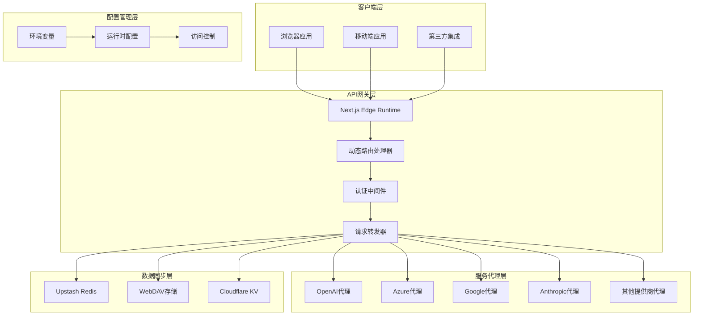

**图表来源**
- [app/api/[provider]/[...path]/route.ts](file://app/api/[provider]/[...path]/route.ts#L63-L86)
- [app/api/proxy.ts](file://app/api/proxy.ts#L1-L90)

## 详细组件分析

### [provider]/[...path] 泛型路由

这是系统的核心动态路由机制，支持所有主流AI提供商的统一接入。

#### 设计原理

动态路由通过Next.js的文件系统路由自动生成，支持以下模式：
- `[provider]`: AI提供商标识符（如openai、azure、google等）
- `[...path]`: 可变路径参数，用于传递原始API路径

#### 请求处理流程

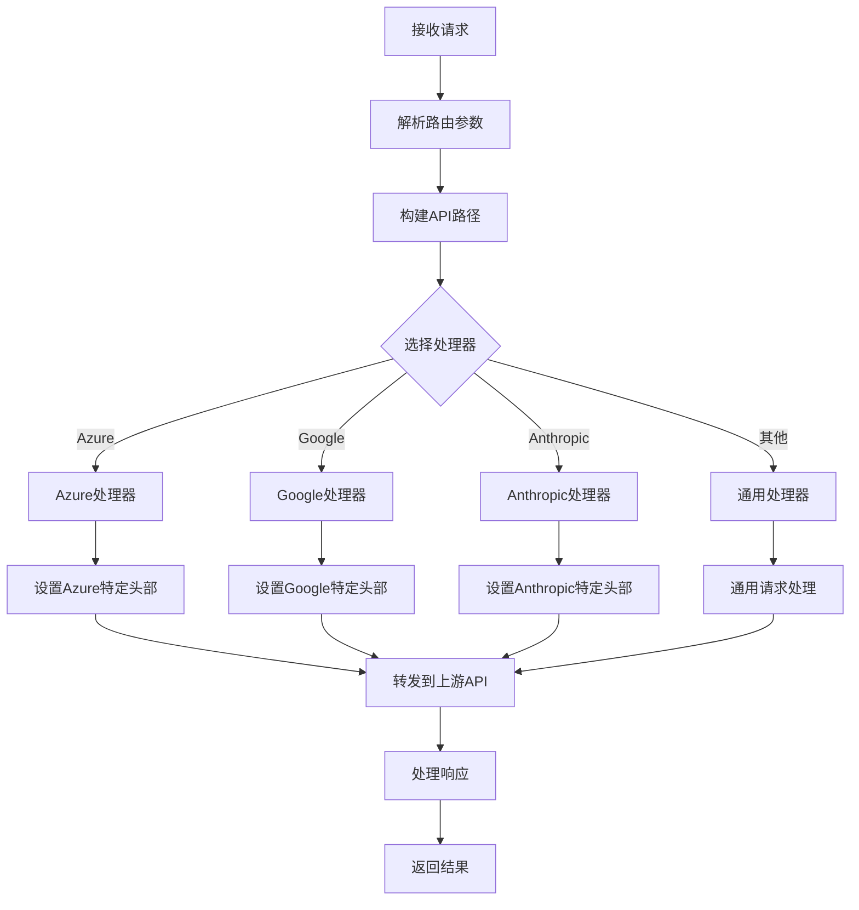

**图表来源**
- [app/api/[provider]/[...path]/route.ts](file://app/api/[provider]/[...path]/route.ts#L20-L58)

#### 支持的提供商

| 提供商 | 路由路径 | 特殊处理 |
|--------|----------|----------|
| OpenAI | `/api/openai` | 支持Azure部署 |
| Azure | `/api/azure` | 特定版本控制 |
| Google | `/api/google` | Gemini模型适配 |
| Anthropic | `/api/anthropic` | Claude模型适配 |
| 百度 | `/api/baidu` | 文心一言适配 |
| 字节跳动 | `/api/bytedance` | 多模态模型支持 |
| 阿里巴巴 | `/api/alibaba` | 通义千问适配 |
| 腾讯 | `/api/tencent` | 腾讯混元适配 |
| 月之暗面 | `/api/moonshot` | 月之暗面模型 |
| 稳定扩散 | `/api/stability` | 图像生成 |
| 科大讯飞 | `/api/iflytek` | 星火认知大模型 |
| 深度求索 | `/api/deepseek` | 深度求索模型 |
| 硅基流动 | `/api/siliconflow` | 硅基流动API |
| XAI | `/api/xai` | Grok模型 |
| ChatGLM | `/api/glm` | ChatGLM模型 |

**章节来源**
- [app/api/[provider]/[...path]/route.ts](file://app/api/[provider]/[...path]/route.ts#L1-L86)

### Artifacts API - 云存储接口

Artifacts API提供了基于Cloudflare KV的云存储功能，用于保存和检索代码片段及其他数据。

#### 功能特性

- **MD5哈希索引**：自动为上传内容生成唯一标识符
- **TTL支持**：可配置数据过期时间
- **批量操作**：支持批量读写操作
- **边缘存储**：利用Cloudflare全球边缘节点

#### 接口规范

| 方法 | 路径 | 描述 | 参数 |
|------|------|------|------|
| POST | `/api/artifacts` | 保存数据 | JSON主体 |
| GET | `/api/artifacts?id={id}` | 获取数据 | 查询参数id |

#### 请求示例

**保存数据**
```bash
curl -X POST https://your-domain.com/api/artifacts \
  -H "Content-Type: application/json" \
  -d '{"key": "unique-key", "value": "data-to-save"}'
```

**获取数据**
```bash
curl https://your-domain.com/api/artifacts?id=hashed-key
```

#### 响应格式

**成功响应**
```json
{
  "code": 0,
  "id": "md5-hash-of-data",
  "result": {
    "success": true
  }
}
```

**错误响应**
```json
{
  "error": true,
  "msg": "Save data error"
}
```

**章节来源**
- [app/api/artifacts/route.ts](file://app/api/artifacts/route.ts#L1-L74)

### Config API - 配置管理接口

Config API提供了服务器端配置的安全暴露接口，采用危险配置模式防止敏感信息泄露。

#### 配置项说明

| 配置项 | 类型 | 描述 |
|--------|------|------|
| needCode | boolean | 是否需要访问码 |
| hideUserApiKey | boolean | 是否隐藏用户API密钥输入 |
| disableGPT4 | boolean | 是否禁用GPT-4模型 |
| hideBalanceQuery | boolean | 是否隐藏余额查询 |
| disableFastLink | boolean | 是否禁用快速链接 |
| customModels | string | 自定义模型列表 |
| defaultModel | string | 默认模型 |
| visionModels | string | 视觉模型列表 |

#### 安全特性

- **危险配置模式**：只暴露必要的配置信息
- **无硬编码值**：避免在前端暴露敏感配置
- **运行时加载**：配置在运行时动态加载

**章节来源**
- [app/api/config/route.ts](file://app/api/config/route.ts#L1-L32)

### Tencent API - 腾讯云接口

Tencent API专门用于处理腾讯混元AI服务的请求，包含特殊的签名认证机制。

#### 认证流程

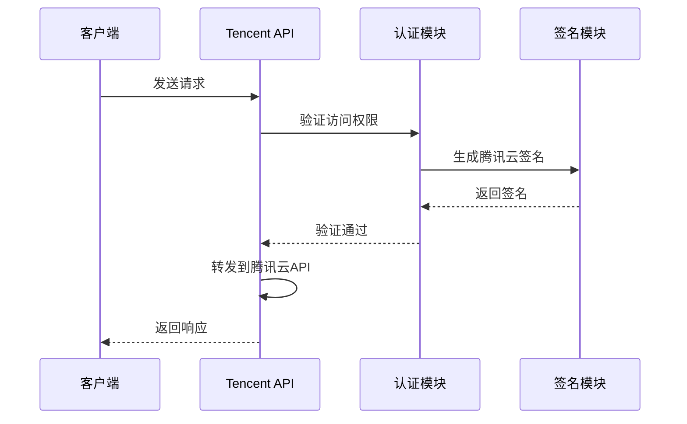

**图表来源**
- [app/api/tencent/route.ts](file://app/api/tencent/route.ts#L20-L33)

#### 签名机制

腾讯云API要求特殊的HTTP签名，系统自动处理：

- **Secret ID/Secret Key**：从环境变量获取
- **时间戳验证**：确保请求时效性
- **签名算法**：HMAC-SHA1签名

**章节来源**
- [app/api/tencent/route.ts](file://app/api/tencent/route.ts#L1-L118)

### Upstash API - Redis代理接口

Upstash API提供了对Upstash Redis服务的安全代理访问，支持远程数据同步功能。

#### 支持的操作

| 操作 | HTTP方法 | 描述 |
|------|----------|------|
| get | GET | 获取键值 |
| set | POST | 设置键值 |

#### 数据分块机制

由于Upstash对单次请求大小有限制（1MB），系统实现了智能分块：

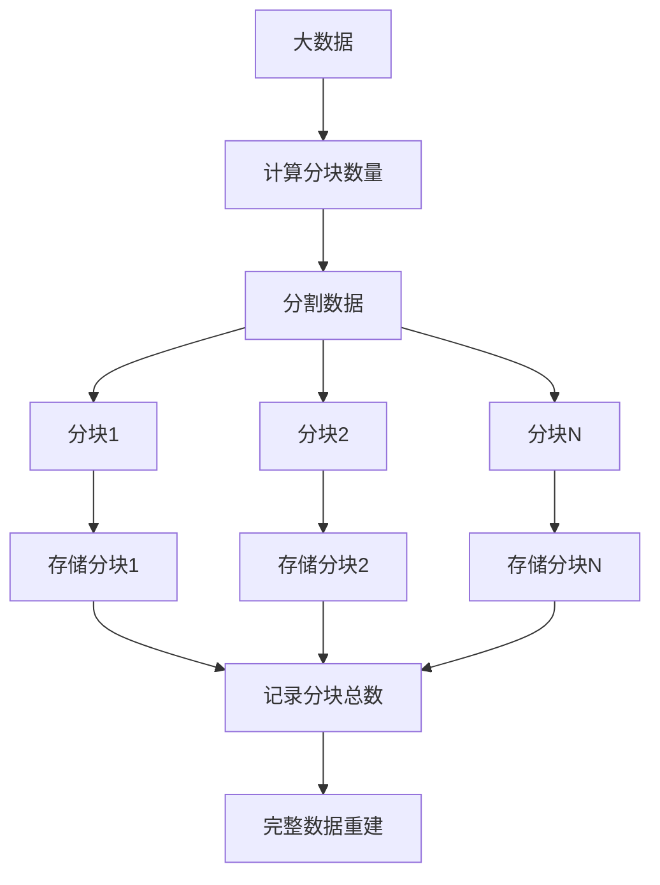

**图表来源**
- [app/utils/cloud/upstash.ts](file://app/utils/cloud/upstash.ts#L67-L76)

#### 安全限制

- **域名白名单**：只能访问`.upstash.io`域名
- **操作限制**：仅允许GET和SET操作
- **代理URL**：支持自定义代理URL

**章节来源**
- [app/api/upstash/[action]/[...key]/route.ts](file://app/api/upstash/[action]/[...key]/route.ts#L1-L74)
- [app/utils/cloud/upstash.ts](file://app/utils/cloud/upstash.ts#L1-L111)

### WebDAV API - 文件同步接口

WebDAV API提供了对WebDAV协议的支持，主要用于远程文件同步和备份功能。

#### 支持的方法

| 方法 | 描述 | 权限控制 |
|------|------|----------|
| MKCOL | 创建集合 | 仅允许创建指定文件夹 |
| GET | 获取文件 | 仅允许下载备份文件 |
| PUT | 上传文件 | 仅允许上传备份文件 |

#### 安全验证

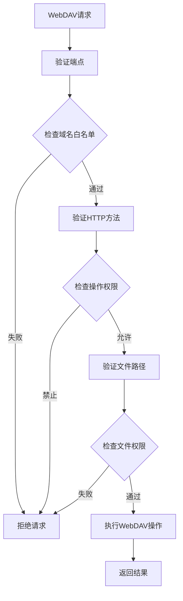

**图表来源**
- [app/api/webdav/[...path]/route.ts](file://app/api/webdav/[...path]/route.ts#L34-L122)

#### 配置选项

- **allowedWebDavEndpoints**：允许的WebDAV端点列表
- **internalAllowedWebDavEndpoints**：内置允许的端点
- **STORAGE_KEY**：存储键前缀

**章节来源**
- [app/api/webdav/[...path]/route.ts](file://app/api/webdav/[...path]/route.ts#L1-L168)

### 通用代理系统

通用代理系统为不直接支持的AI提供商提供统一的代理能力。

#### 请求转发流程

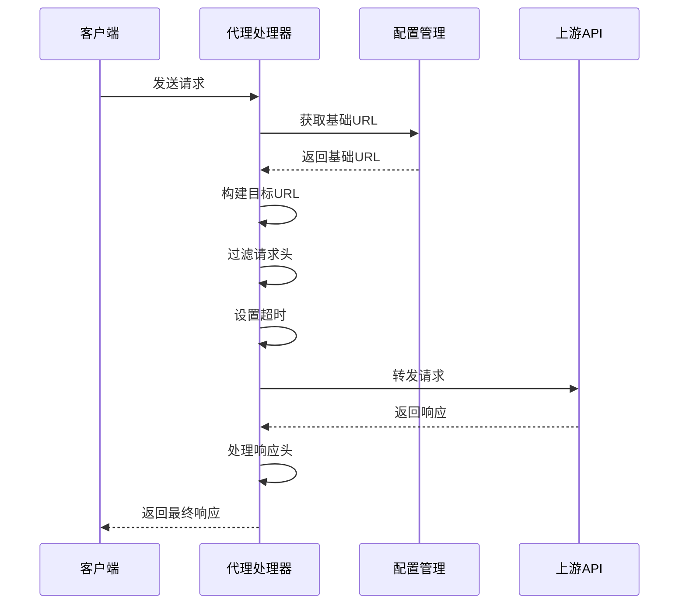

**图表来源**
- [app/api/proxy.ts](file://app/api/proxy.ts#L4-L89)

#### 超时控制

所有代理请求都设置了10分钟的超时时间，防止长时间连接：

```typescript
const timeoutId = setTimeout(() => {
  controller.abort();
}, 10 * 60 * 1000);
```

**章节来源**
- [app/api/proxy.ts](file://app/api/proxy.ts#L1-L90)

## 依赖关系分析

### 核心依赖图

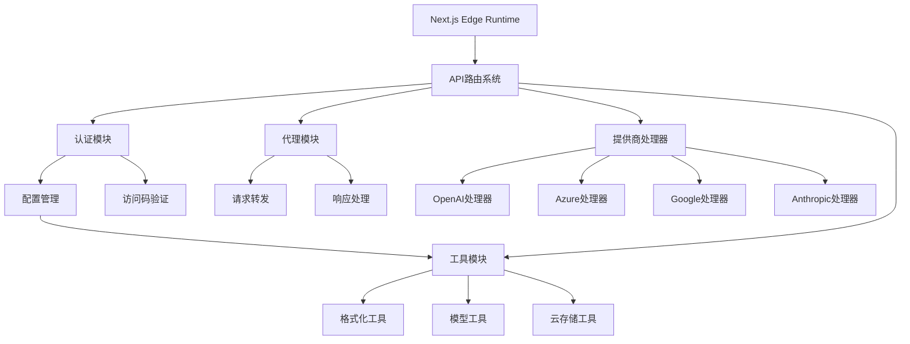

**图表来源**
- [app/api/[provider]/[...path]/route.ts](file://app/api/[provider]/[...path]/route.ts#L1-L19)
- [app/api/auth.ts](file://app/api/auth.ts#L1-L5)

### 外部依赖

| 依赖项 | 用途 | 版本要求 |
|--------|------|----------|
| Next.js | 框架基础 | ^13.0.0+ |
| Cloudflare Workers | 边缘计算 | 兼容 |
| Vercel Edge Functions | 部署平台 | 兼容 |
| Spark MD5 | 哈希计算 | 最新版本 |
| Zod | 类型验证 | 最新版本 |

**章节来源**
- [app/api/[provider]/[...path]/route.ts](file://app/api/[provider]/[...path]/route.ts#L1-L19)
- [app/config/server.ts](file://app/config/server.ts#L1-L200)

## 性能考虑

### 边缘计算优化

系统充分利用Edge Runtime的优势：

- **就近部署**：在全球多个地区部署边缘节点
- **低延迟**：减少网络往返时间
- **高并发**：支持大量并发请求

### 缓存策略

- **CDN缓存**：静态资源通过CDN加速
- **边缘缓存**：频繁访问的数据缓存在边缘
- **智能分片**：大数据分片传输优化

### 资源限制

- **请求超时**：10分钟最大超时时间
- **内存限制**：合理控制请求体大小
- **并发控制**：避免资源耗尽

## 故障排除指南

### 常见错误码

| 错误码 | 描述 | 解决方案 |
|--------|------|----------|
| 401 | 未授权访问 | 检查访问码或API密钥 |
| 403 | 禁止访问 | 模型被禁用或权限不足 |
| 400 | 请求错误 | 检查请求格式和参数 |
| 500 | 服务器错误 | 检查上游API状态 |

### 认证问题排查

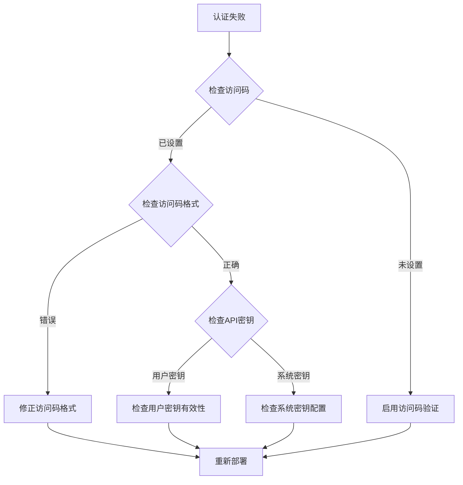

### 性能监控

建议监控以下指标：

- **响应时间**：平均和95%分位响应时间
- **错误率**：各提供商的错误率统计
- **并发数**：同时处理的请求数量
- **资源使用**：CPU和内存使用情况

**章节来源**
- [app/api/auth.ts](file://app/api/auth.ts#L42-L54)
- [app/api/common.ts](file://app/api/common.ts#L131-L140)

## 结论

ChatGPT-Next-Web的后端API接口系统展现了现代Web应用的最佳实践：

### 技术优势

1. **模块化设计**：清晰的职责分离和模块化架构
2. **安全性**：多重认证和严格的权限控制
3. **可扩展性**：动态路由支持新提供商快速接入
4. **性能优化**：边缘计算和智能缓存策略
5. **数据同步**：多种存储方案支持数据持久化

### 最佳实践

- **边缘优先**：充分利用边缘计算能力
- **安全第一**：多层次的安全防护机制
- **开发者友好**：清晰的API文档和错误处理
- **性能导向**：优化的请求转发和缓存策略

### 未来发展方向

- **更多提供商支持**：持续集成新的AI服务
- **增强安全功能**：更细粒度的权限控制
- **性能优化**：进一步提升边缘计算效率
- **监控完善**：更全面的性能和安全监控

这个API系统不仅满足了当前的功能需求，还为未来的扩展和发展奠定了坚实的基础，是现代AI应用后端架构的优秀范例。