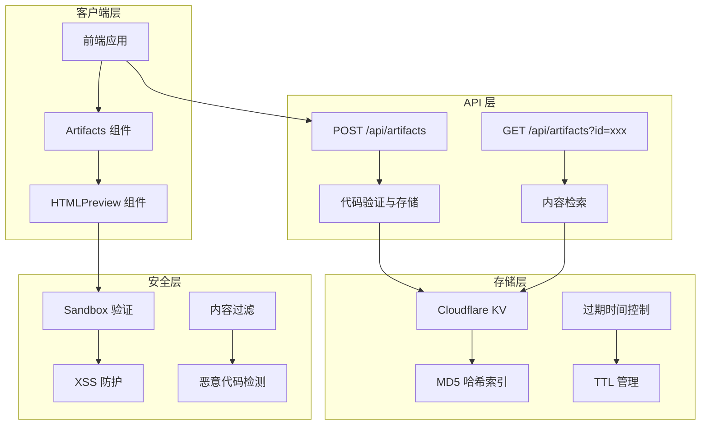
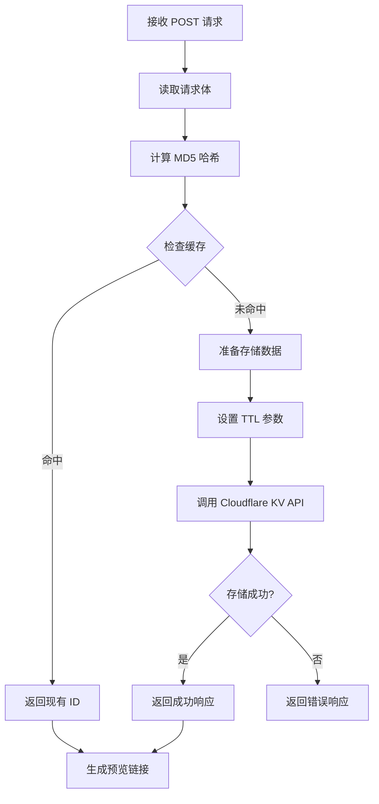
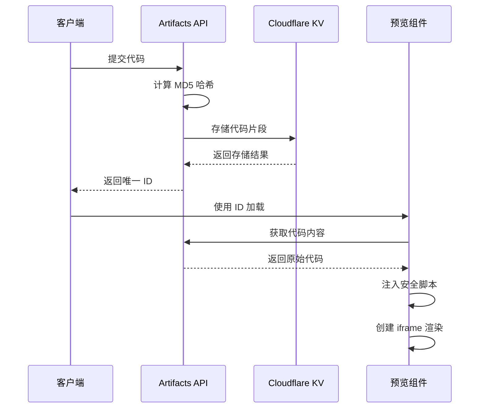
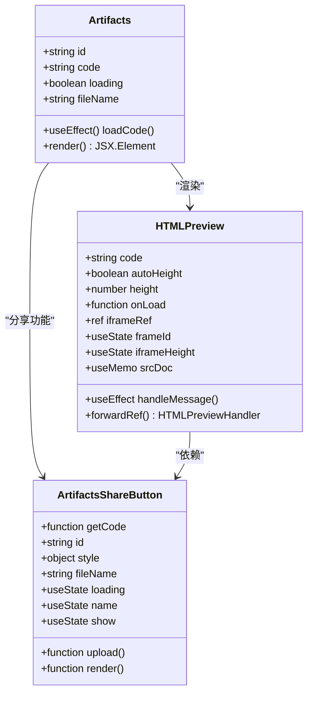
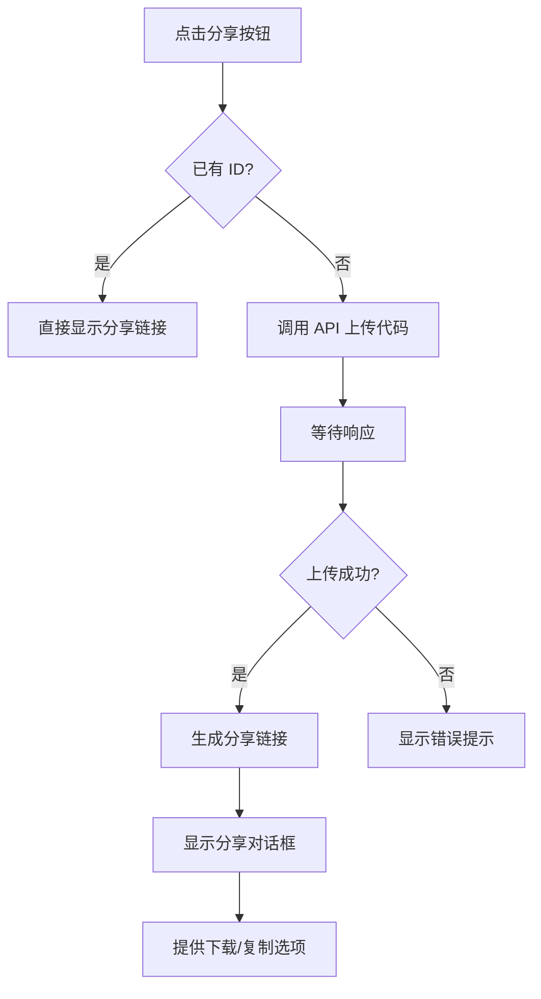

# Artifacts API 技术文档

<cite>
**本文档中引用的文件**
- [app/api/artifacts/route.ts](file://app/api/artifacts/route.ts)
- [app/components/artifacts.tsx](file://app/components/artifacts.tsx)
- [app/components/artifacts.module.scss](file://app/components/artifacts.module.scss)
- [app/config/server.ts](file://app/config/server.ts)
- [app/constant.ts](file://app/constant.ts)
- [app/utils/cloud/upstash.ts](file://app/utils/cloud/upstash.ts)
</cite>

## 目录
1. [简介](#简介)
2. [系统架构](#系统架构)
3. [API端点详解](#api端点详解)
4. [安全机制](#安全机制)
5. [前端组件交互](#前端组件交互)
6. [数据存储与持久化](#数据存储与持久化)
7. [使用示例](#使用示例)
8. [故障排除](#故障排除)
9. [总结](#总结)

## 简介

Artifacts API 是 ChatGPT-Next-Web 项目中的核心功能模块，专门用于处理 AI 生成的 HTML/CSS/JavaScript 代码片段。该系统提供了安全的代码渲染环境，允许用户生成、预览和分享动态网页内容，特别适用于可视化图表、交互式界面等场景。

### 主要特性

- **安全沙箱渲染**：通过 iframe 沙箱机制确保代码执行安全
- **自动内容哈希**：基于 MD5 哈希算法实现内容去重和缓存
- **Cloudflare KV 存储**：利用 Cloudflare 的全球分布式键值存储
- **跨设备共享**：通过短链接实现内容的跨设备访问
- **实时预览**：支持代码变更的即时预览更新

## 系统架构



**架构图来源**
- [app/api/artifacts/route.ts](file://app/api/artifacts/route.ts#L5-L74)
- [app/components/artifacts.tsx](file://app/components/artifacts.tsx#L1-L267)

## API端点详解

### POST /api/artifacts

#### 请求结构

```typescript
interface ArtifactRequest {
  code: string;           // HTML/CSS/JS 代码片段
  language?: string;      // 代码语言类型（可选）
  metadata?: object;      // 元数据信息（可选）
}
```

#### 请求处理流程



**流程图来源**
- [app/api/artifacts/route.ts](file://app/api/artifacts/route.ts#L12-L46)

#### 响应格式

```typescript
interface ArtifactResponse {
  code: 0;              // 成功状态码
  id: string;           // 唯一标识符（MD5 哈希）
  result: object;       // 存储结果详情
}

interface ErrorResponse {
  error: true;
  msg: string;          // 错误信息
}
```

#### 关键参数说明

| 参数 | 类型 | 必需 | 描述 |
|------|------|------|------|
| `code` | string | 是 | 要存储的 HTML/CSS/JS 代码 |
| `language` | string | 否 | 代码语言标识（如 'html', 'css', 'javascript'） |
| `metadata` | object | 否 | 包含额外元数据的对象 |

**节来源**
- [app/api/artifacts/route.ts](file://app/api/artifacts/route.ts#L14-L22)

### GET /api/artifacts

#### 查询参数

| 参数 | 类型 | 必需 | 描述 |
|------|------|------|------|
| `id` | string | 是 | 通过 POST 请求获得的唯一标识符 |

#### 响应处理

GET 请求直接从 Cloudflare KV 中检索对应 ID 的代码内容，并以原始形式返回，供前端 iframe 渲染使用。

**节来源**
- [app/api/artifacts/route.ts](file://app/api/artifacts/route.ts#L52-L62)

## 安全机制

### 沙箱配置

Artifacts API 在前端实现了严格的 iframe 沙箱安全策略：

```typescript
<sandbox="allow-forms allow-modals allow-scripts" />
```

#### 沙箱权限说明

| 权限 | 用途 | 安全影响 |
|------|------|----------|
| `allow-forms` | 允许表单提交 | 受限于同源策略 |
| `allow-modals` | 允许模态对话框 | 防止弹窗攻击 |
| `allow-scripts` | 允许 JavaScript 执行 | 必需但受限制 |

### 内容安全策略（CSP）

虽然代码中没有显式的 CSP 头部设置，但通过以下方式实现安全防护：

1. **同源隔离**：iframe 内容与主页面完全隔离
2. **消息传递验证**：通过 `postMessage` 进行父子窗口通信
3. **动态脚本注入**：自动添加 ResizeObserver 脚本进行高度调整

### XSS 防护措施



**序列图来源**
- [app/components/artifacts.tsx](file://app/components/artifacts.tsx#L81-L87)

**节来源**
- [app/components/artifacts.tsx](file://app/components/artifacts.tsx#L99-L101)

## 前端组件交互

### Artifacts 组件架构



**类图来源**
- [app/components/artifacts.tsx](file://app/components/artifacts.tsx#L25-L267)

### 代码预览机制

HTMLPreview 组件实现了智能的代码预览功能：

#### 动态脚本注入

```typescript
const script = `<script>
  window.addEventListener("DOMContentLoaded", () => 
    new ResizeObserver((entries) => 
      parent.postMessage({
        id: '${frameId}', 
        height: entries[0].target.clientHeight
      }, '*')
    ).observe(document.body)
  )
</script>`
```

#### 自适应高度调整

组件通过监听 iframe 内容变化，自动调整 iframe 高度，提供最佳的用户体验。

**节来源**
- [app/components/artifacts.tsx](file://app/components/artifacts.tsx#L81-L87)

### 分享功能实现

ArtifactsShareButton 组件提供了完整的分享功能：

#### 分享流程



**流程图来源**
- [app/components/artifacts.tsx](file://app/components/artifacts.tsx#L127-L143)

#### 短链接生成

分享链接采用简洁的格式：
```
{origin}#{Path.Artifacts}/{id}
```

例如：`https://app.nextchat.club#/artifacts/abc123`

**节来源**
- [app/components/artifacts.tsx](file://app/components/artifacts.tsx#L123-L125)

## 数据存储与持久化

### Cloudflare KV 集成

Artifacts API 使用 Cloudflare 的全球分布式键值存储服务：

#### 存储配置

```typescript
const storeUrl = () =>
  `https://api.cloudflare.com/client/v4/accounts/${serverConfig.cloudflareAccountId}/storage/kv/namespaces/${serverConfig.cloudflareKVNamespaceId}`;

const storeHeaders = () => ({
  Authorization: `Bearer ${serverConfig.cloudflareKVApiKey}`,
});
```

#### 数据结构

每个存储项包含：

| 字段 | 类型 | 描述 |
|------|------|------|
| `key` | string | MD5 哈希值作为唯一标识 |
| `value` | string | 原始代码内容 |
| `expiration_ttl` | number | 可选的生存时间（秒） |

#### TTL 管理

系统根据配置自动管理数据过期：

```typescript
try {
  const ttl = parseInt(serverConfig.cloudflareKVTTL as string);
  if (ttl > 60) {
    body["expiration_ttl"] = ttl;
  }
} catch (e) {
  console.error(e);
}
```

**节来源**
- [app/api/artifacts/route.ts](file://app/api/artifacts/route.ts#L7-L11)
- [app/api/artifacts/route.ts](file://app/api/artifacts/route.ts#L23-L27)

### 数据一致性保证

1. **幂等性**：相同的代码内容会生成相同的哈希值
2. **原子操作**：Cloudflare KV 支持批量操作的原子性
3. **全球同步**：数据在全球范围内同步，确保访问速度

**节来源**
- [app/api/artifacts/route.ts](file://app/api/artifacts/route.ts#L31-L38)

## 使用示例

### Python 自动化脚本示例

以下是一个完整的 Python 脚本示例，演示如何自动化生成图表并获取预览链接：

```python
#!/usr/bin/env python3
"""
Artifacts API Python 示例脚本
"""

import requests
import hashlib
import json
from typing import Dict, Any

class ArtifactsClient:
    def __init__(self, api_url: str):
        self.api_url = api_url
        self.session = requests.Session()
    
    def generate_chart(self, chart_data: Dict[str, Any]) -> str:
        """
        生成图表并返回预览链接
        
        Args:
            chart_data: 包含图表配置的数据字典
            
        Returns:
            预览链接字符串
        """
        # 构建完整的 HTML 代码
        html_code = self._build_chart_html(chart_data)
        
        # 调用 Artifacts API
        response = self.session.post(
            f"{self.api_url}/artifacts",
            data=html_code,
            headers={"Content-Type": "text/html"}
        )
        
        if response.status_code == 200:
            result = response.json()
            artifact_id = result.get("id")
            return f"https://app.nextchat.club#/artifacts/{artifact_id}"
        else:
            raise Exception(f"API 调用失败: {response.status_code} - {response.text}")
    
    def _build_chart_html(self, chart_data: Dict[str, Any]) -> str:
        """
        构建包含图表的 HTML 代码
        
        Args:
            chart_data: 图表配置数据
            
        Returns:
            完整的 HTML 字符串
        """
        # 基础 HTML 结构
        html_template = """
        <!DOCTYPE html>
        <html>
        <head>
            <meta charset="UTF-8">
            <title>{title}</title>
            <script src="https://cdn.jsdelivr.net/npm/chart.js"></script>
            <style>
                body {{
                    margin: 0;
                    padding: 20px;
                    background-color: #f5f5f5;
                }}
                .chart-container {{
                    max-width: 800px;
                    margin: 0 auto;
                    background: white;
                    border-radius: 8px;
                    box-shadow: 0 2px 10px rgba(0,0,0,0.1);
                    padding: 20px;
                }}
            </style>
        </head>
        <body>
            <div class="chart-container">
                <canvas id="myChart"></canvas>
            </div>
            
            <script>
                document.addEventListener('DOMContentLoaded', function() {{
                    const ctx = document.getElementById('myChart').getContext('2d');
                    new Chart(ctx, {chart_config});
                }});
            </script>
        </body>
        </html>
        """
        
        # 格式化图表配置
        chart_config = json.dumps(chart_data, indent=4, ensure_ascii=False)
        
        return html_template.format(
            title=chart_data.get("options", {}).get("title", {}).get("text", "图表"),
            chart_config=chart_config
        )

# 使用示例
if __name__ == "__main__":
    # 初始化客户端
    client = ArtifactsClient("https://app.nextchat.club/api")
    
    # 准备图表数据
    chart_data = {
        "type": "bar",
        "data": {
            "labels": ["苹果", "香蕉", "橙子", "葡萄", "梨"],
            "datasets": [{
                "label": "水果销量",
                "data": [12, 19, 3, 5, 2],
                "backgroundColor": [
                    'rgba(255, 99, 132, 0.8)',
                    'rgba(54, 162, 235, 0.8)',
                    'rgba(255, 206, 86, 0.8)',
                    'rgba(75, 192, 192, 0.8)',
                    'rgba(153, 102, 255, 0.8)'
                ],
                "borderColor": [
                    'rgba(255, 99, 132, 1)',
                    'rgba(54, 162, 235, 1)',
                    'rgba(255, 206, 86, 1)',
                    'rgba(75, 192, 192, 1)',
                    'rgba(153, 102, 255, 1)'
                ],
                "borderWidth": 1
            }]
        },
        "options": {
            "responsive": True,
            "plugins": {
                "legend": {
                    "position": "top",
                },
                "title": {
                    "display": True,
                    "text": "水果销售统计"
                }
            },
            "scales": {
                "y": {
                    "beginAtZero": True
                }
            }
        }
    }
    
    try:
        # 生成图表并获取预览链接
        preview_link = client.generate_chart(chart_data)
        print(f"图表已生成，预览链接: {preview_link}")
        
        # 也可以保存为文件
        import webbrowser
        webbrowser.open(preview_link)
        
    except Exception as e:
        print(f"发生错误: {e}")
```

### JavaScript 实现示例

```javascript
// Artifacts API 客户端示例
class ArtifactsClient {
    constructor(apiBaseUrl = 'https://app.nextchat.club/api') {
        this.apiBaseUrl = apiBaseUrl;
    }
    
    /**
     * 上传代码片段并获取预览链接
     * @param {string} code - HTML/CSS/JS 代码
     * @returns {Promise<string>} - 预览链接
     */
    async uploadCode(code) {
        try {
            const response = await fetch(`${this.apiBaseUrl}/artifacts`, {
                method: 'POST',
                headers: {
                    'Content-Type': 'text/html'
                },
                body: code
            });
            
            if (!response.ok) {
                throw new Error(`HTTP error! status: ${response.status}`);
            }
            
            const data = await response.json();
            return `https://app.nextchat.club#/artifacts/${data.id}`;
            
        } catch (error) {
            console.error('上传代码失败:', error);
            throw error;
        }
    }
    
    /**
     * 创建简单的 HTML 表格
     * @param {Array<Array<string>>} data - 表格数据
     * @returns {string} - 完整的 HTML 代码
     */
    createTable(data) {
        let html = `
        <!DOCTYPE html>
        <html>
        <head>
            <meta charset="UTF-8">
            <title>数据表格</title>
            <style>
                table {
                    width: 100%;
                    border-collapse: collapse;
                    font-family: Arial, sans-serif;
                }
                th, td {
                    border: 1px solid #ddd;
                    padding: 8px;
                    text-align: left;
                }
                th {
                    background-color: #f2f2f2;
                    font-weight: bold;
                }
                tr:nth-child(even) {
                    background-color: #f9f9f9;
                }
                tr:hover {
                    background-color: #f1f1f1;
                }
            </style>
        </head>
        <body>
            <table>
                <thead>
                    <tr>
        `;
        
        // 添加表头
        data[0].forEach(header => {
            html += `<th>${header}</th>`;
        });
        
        html += '</tr></thead><tbody>';
        
        // 添加数据行
        for (let i = 1; i < data.length; i++) {
            html += '<tr>';
            data[i].forEach(cell => {
                html += `<td>${cell}</td>`;
            });
            html += '</tr>';
        }
        
        html += '</tbody></table></body></html>';
        return html;
    }
}

// 使用示例
(async () => {
    const client = new ArtifactsClient();
    
    // 创建表格数据
    const tableData = [
        ['姓名', '年龄', '城市', '收入'],
        ['张三', '28', '北京', '$80,000'],
        ['李四', '34', '上海', '$95,000'],
        ['王五', '29', '广州', '$78,000'],
        ['赵六', '42', '深圳', '$120,000']
    ];
    
    // 创建 HTML 代码
    const tableHtml = client.createTable(tableData);
    
    try {
        // 上传并获取预览链接
        const previewUrl = await client.uploadCode(tableHtml);
        console.log('表格预览链接:', previewUrl);
        
        // 自动打开浏览器
        window.open(previewUrl, '_blank');
    } catch (error) {
        console.error('生成表格失败:', error);
    }
})();
```

## 故障排除

### 常见问题及解决方案

#### 1. API 调用失败

**问题症状**：POST 请求返回 400 错误或网络超时

**可能原因**：
- Cloudflare KV 配置不正确
- API 密钥无效
- 网络连接问题

**解决方案**：
```bash
# 检查环境变量配置
echo "CLOUDFLARE_ACCOUNT_ID: $CLOUDFLARE_ACCOUNT_ID"
echo "CLOUDFLARE_KV_NAMESPACE_ID: $CLOUDFLARE_KV_NAMESPACE_ID"
echo "CLOUDFLARE_KV_API_KEY: $CLOUDFLARE_KV_API_KEY"
```

#### 2. 代码渲染异常

**问题症状**：iframe 显示空白或报错

**可能原因**：
- 代码中包含不兼容的 JavaScript
- CSS 样式冲突
- 跨域资源加载失败

**解决方案**：
```javascript
// 添加调试信息
console.log('iframe 加载完成，标题:', title);
console.log('iframe 高度:', iframeHeight);
```

#### 3. 分享链接失效

**问题症状**：分享后无法访问内容

**可能原因**：
- Cloudflare KV 数据过期
- 存储配额超限
- ID 格式错误

**解决方案**：
```bash
# 检查 Cloudflare KV 存储状态
curl -H "Authorization: Bearer $CLOUDFLARE_KV_API_KEY" \
     "https://api.cloudflare.com/client/v4/accounts/$CLOUDFLARE_ACCOUNT_ID/storage/kv/namespaces/$CLOUDFLARE_KV_NAMESPACE_ID/values/$ARTIFACT_ID"
```

### 性能优化建议

1. **代码压缩**：在上传前压缩 HTML/CSS/JS 代码
2. **缓存策略**：合理设置 TTL 参数
3. **分块上传**：对于大型代码片段，考虑分块处理
4. **CDN 加速**：利用 Cloudflare 的全球 CDN 提升访问速度

## 总结

Artifacts API 是一个设计精良的安全代码渲染系统，具有以下核心优势：

### 技术亮点

1. **安全性优先**：通过 iframe 沙箱和严格的安全策略确保代码执行安全
2. **高性能存储**：基于 Cloudflare KV 的全球分布式存储，提供快速访问
3. **易用性强**：简洁的 API 设计和完善的前端组件
4. **跨平台支持**：支持多种编程语言和框架的代码片段

### 应用场景

- **数据可视化**：生成各种图表和仪表板
- **交互式界面**：创建动态的用户界面组件
- **原型展示**：快速展示网页设计概念
- **教育工具**：提供代码示例的在线演示

### 最佳实践

1. **代码质量**：确保上传的代码符合标准，避免语法错误
2. **安全审查**：对敏感数据进行适当的处理和保护
3. **性能监控**：定期检查存储使用情况和访问性能
4. **用户体验**：提供清晰的错误提示和加载状态

通过合理使用 Artifacts API，开发者可以轻松创建丰富的交互式内容，为用户提供出色的体验。