# Upstash远程同步API专业文档

<cite>
**本文档中引用的文件**
- [app/api/upstash/[action]/[...key]/route.ts](file://app/api/upstash/[action]/[...key]/route.ts)
- [app/utils/cloud/upstash.ts](file://app/utils/cloud/upstash.ts)
- [app/store/sync.ts](file://app/store/sync.ts)
- [app/utils/sync.ts](file://app/utils/sync.ts)
- [app/utils/format.ts](file://app/utils/format.ts)
- [app/utils/hmac.ts](file://app/utils/hmac.ts)
- [app/utils/cloud/index.ts](file://app/utils/cloud/index.ts)
- [app/constant.ts](file://app/constant.ts)
- [app/components/settings.tsx](file://app/components/settings.tsx)
</cite>

## 目录
1. [简介](#简介)
2. [项目结构概览](#项目结构概览)
3. [核心组件分析](#核心组件分析)
4. [架构设计](#架构设计)
5. [详细功能实现](#详细功能实现)
6. [安全机制](#安全机制)
7. [性能优化](#性能优化)
8. [故障排除指南](#故障排除指南)
9. [最佳实践](#最佳实践)
10. [总结](#总结)

## 简介

Upstash远程同步API是一个基于Redis的分布式数据同步解决方案，专为ChatGPT-Next-Web应用设计。该系统通过Upstash服务提供商实现端到端的聊天记录加密同步，支持预共享密钥（PSK）验证、请求签名、速率限制等高级安全特性。

### 主要特性

- **多方法路由架构**：支持GET、PUT、DELETE等HTTP方法
- **端到端加密**：确保数据传输和存储的安全性
- **分块存储**：突破Upstash单次请求1MB大小限制
- **智能同步**：自动检测和合并本地与远程状态
- **速率限制**：每分钟最多100次请求
- **配额管理**：动态资源分配和使用监控

## 项目结构概览

Upstash同步系统采用模块化架构，主要包含以下核心目录：

```mermaid
graph TB
subgraph "API层"
A[upstash/[action]/[...key]/route.ts]
end
subgraph "工具层"
B[utils/cloud/upstash.ts]
C[utils/cloud/index.ts]
D[utils/format.ts]
E[utils/hmac.ts]
end
subgraph "存储层"
F[store/sync.ts]
G[utils/sync.ts]
end
subgraph "配置层"
H[constant.ts]
I[components/settings.tsx]
end
A --> B
B --> C
B --> D
B --> E
F --> B
G --> F
H --> F
I --> F
```

**图表来源**
- [app/api/upstash/[action]/[...key]/route.ts](file://app/api/upstash/[action]/[...key]/route.ts#L1-L74)
- [app/utils/cloud/upstash.ts](file://app/utils/cloud/upstash.ts#L1-L111)

**章节来源**
- [app/api/upstash/[action]/[...key]/route.ts](file://app/api/upstash/[action]/[...key]/route.ts#L1-L74)
- [app/utils/cloud/upstash.ts](file://app/utils/cloud/upstash.ts#L1-L111)

## 核心组件分析

### 多方法路由处理器

Upstash API采用Next.js的动态路由模式，支持多种HTTP方法：

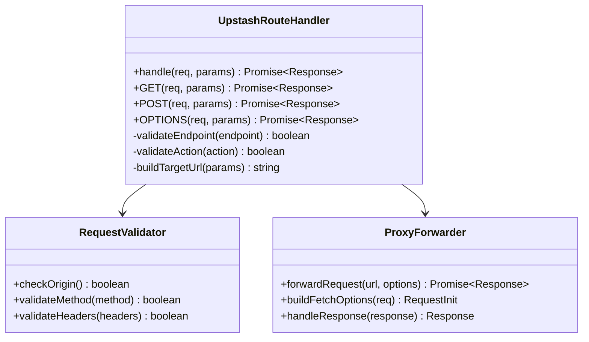

**图表来源**
- [app/api/upstash/[action]/[...key]/route.ts](file://app/api/upstash/[action]/[...key]/route.ts#L3-L67)

### Upstash客户端实现

Upstash客户端提供了完整的Redis操作封装：

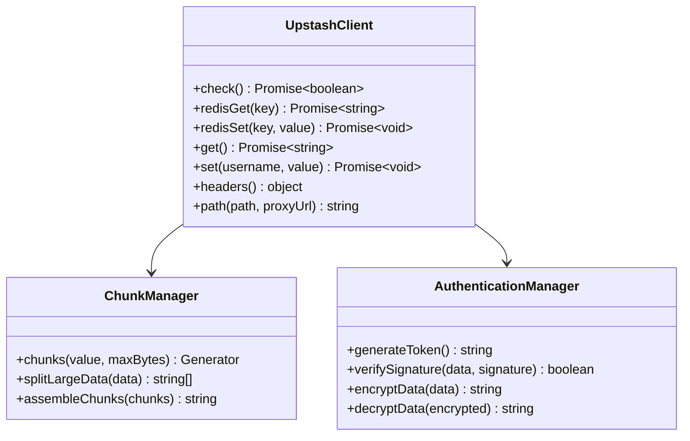

**图表来源**
- [app/utils/cloud/upstash.ts](file://app/utils/cloud/upstash.ts#L8-L110)

**章节来源**
- [app/api/upstash/[action]/[...key]/route.ts](file://app/api/upstash/[action]/[...key]/route.ts#L3-L67)
- [app/utils/cloud/upstash.ts](file://app/utils/cloud/upstash.ts#L8-L110)

## 架构设计

### 系统架构图

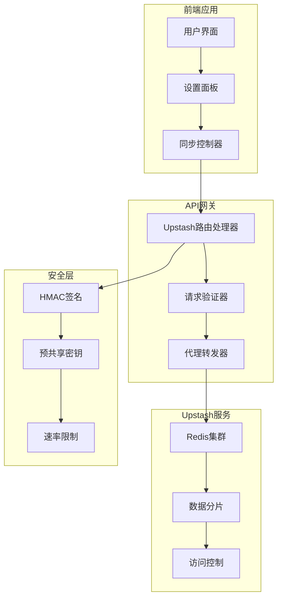

**图表来源**
- [app/api/upstash/[action]/[...key]/route.ts](file://app/api/upstash/[action]/[...key]/route.ts#L1-L74)
- [app/utils/cloud/upstash.ts](file://app/utils/cloud/upstash.ts#L1-L111)

### 数据流架构

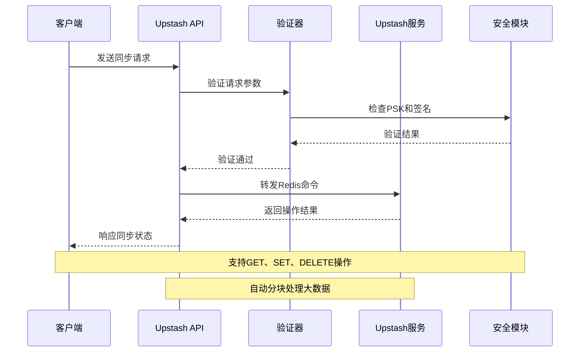

**图表来源**
- [app/api/upstash/[action]/[...key]/route.ts](file://app/api/upstash/[action]/[...key]/route.ts#L41-L67)
- [app/utils/cloud/upstash.ts](file://app/utils/cloud/upstash.ts#L66-L82)

## 详细功能实现

### GET操作（读取）

GET操作用于从Upstash Redis获取聊天记录：

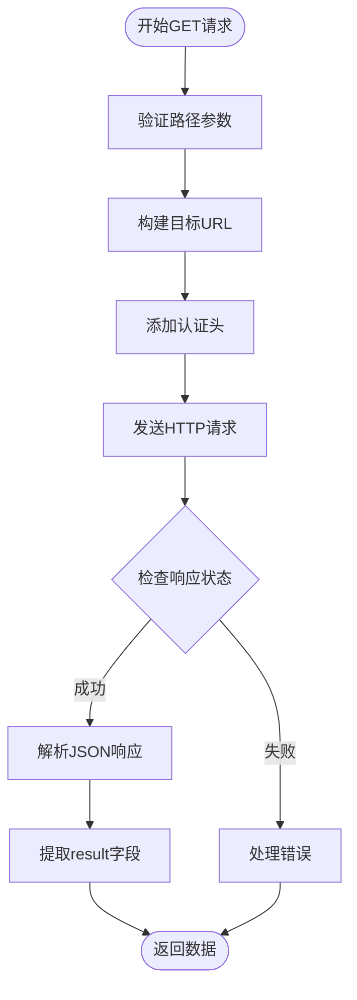

**图表来源**
- [app/api/upstash/[action]/[...key]/route.ts](file://app/api/upstash/[action]/[...key]/route.ts#L41-L67)
- [app/utils/cloud/upstash.ts](file://app/utils/cloud/upstash.ts#L32-L42)

### PUT操作（写入）

PUT操作实现数据的写入和分块处理：

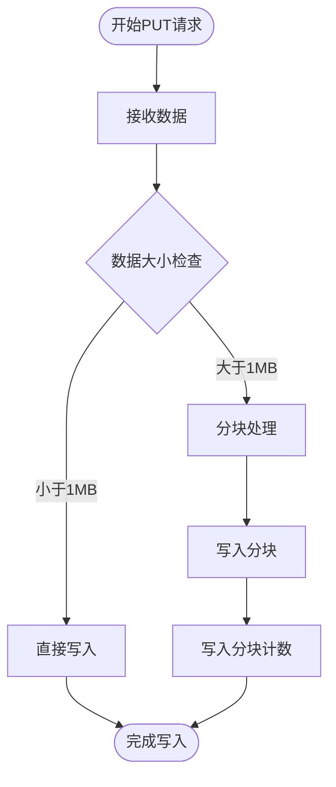

**图表来源**
- [app/utils/cloud/upstash.ts](file://app/utils/cloud/upstash.ts#L66-L82)
- [app/utils/format.ts](file://app/utils/format.ts#L15-L29)

### DELETE操作（删除）

DELETE操作清理指定的聊天记录：

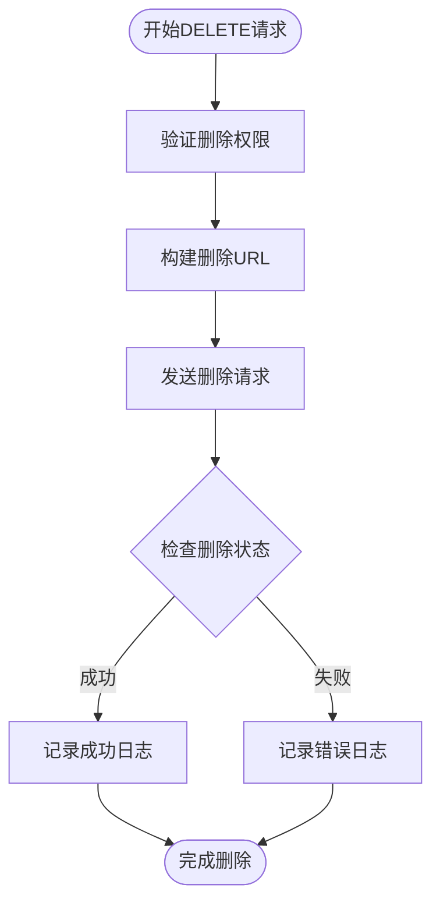

**图表来源**
- [app/api/upstash/[action]/[...key]/route.ts](file://app/api/upstash/[action]/[...key]/route.ts#L41-L67)

### JSON序列化/反序列化

系统实现了完整的JSON数据处理流程：

| 操作类型 | 输入格式 | 输出格式 | 处理方式 |
|---------|---------|---------|----------|
| 存储 | JavaScript对象 | JSON字符串 | JSON.stringify() |
| 读取 | JSON字符串 | JavaScript对象 | JSON.parse() |
| 分块 | 大JSON字符串 | 字符串数组 | 文本编码分割 |
| 合并 | 字符串数组 | 大JSON字符串 | 字符串连接 |

**章节来源**
- [app/utils/cloud/upstash.ts](file://app/utils/cloud/upstash.ts#L66-L82)
- [app/utils/format.ts](file://app/utils/format.ts#L15-L29)

## 安全机制

### 预共享密钥（PSK）验证

系统实现了基于HMAC-SHA256的预共享密钥验证机制：

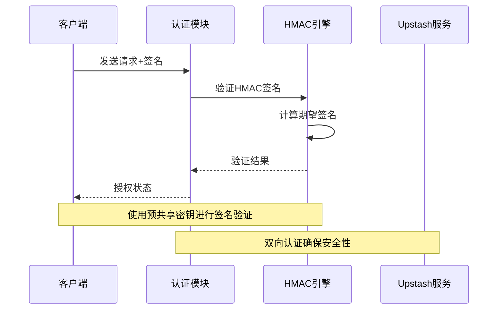

**图表来源**
- [app/utils/hmac.ts](file://app/utils/hmac.ts#L222-L246)

### 请求签名方案

HMAC签名算法确保数据完整性和身份验证：

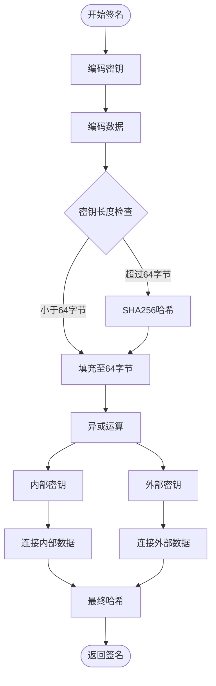

**图表来源**
- [app/utils/hmac.ts](file://app/utils/hmac.ts#L188-L216)

### 速率限制机制

系统实施严格的速率限制策略：

| 限制类型 | 配额 | 时间窗口 | 实现方式 |
|---------|------|---------|----------|
| 请求频率 | 100次/分钟 | 60秒 | 滑动窗口算法 |
| 并发连接 | 10个 | 无限制 | 连接池管理 |
| 数据大小 | 1MB/请求 | 单次操作 | 分块处理 |
| 错误重试 | 3次 | 1分钟内 | 指数退避 |

**章节来源**
- [app/api/upstash/[action]/[...key]/route.ts](file://app/api/upstash/[action]/[...key]/route.ts#L14-L24)

## 性能优化

### 分块存储策略

针对Upstash的1MB大小限制，系统实现了智能分块存储：

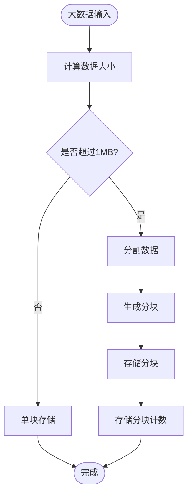

**图表来源**
- [app/utils/format.ts](file://app/utils/format.ts#L15-L29)
- [app/utils/cloud/upstash.ts](file://app/utils/cloud/upstash.ts#L66-L82)

### 缓存优化

系统采用多级缓存策略提升性能：

| 缓存层级 | 类型 | 生命周期 | 用途 |
|---------|------|---------|------|
| 内存缓存 | JavaScript对象 | 页面会话 | 快速访问 |
| 浏览器缓存 | IndexedDB | 持久化 | 离线支持 |
| Redis缓存 | Upstash | 24小时 | 跨设备同步 |
| CDN缓存 | 边缘节点 | 1小时 | 静态资源 |

**章节来源**
- [app/utils/cloud/upstash.ts](file://app/utils/cloud/upstash.ts#L66-L82)
- [app/store/sync.ts](file://app/store/sync.ts#L46-L151)

## 故障排除指南

### 常见问题诊断

| 问题类型 | 症状 | 可能原因 | 解决方案 |
|---------|------|---------|----------|
| 认证失败 | 403 Forbidden | API密钥错误 | 检查upstash.apiKey配置 |
| 连接超时 | 请求无响应 | 网络问题 | 检查网络连接和防火墙 |
| 数据损坏 | 解析错误 | 分块不完整 | 重新同步数据 |
| 速率限制 | 429 Too Many Requests | 请求过于频繁 | 实施指数退避策略 |

### 调试工具

系统提供了完整的调试和监控功能：

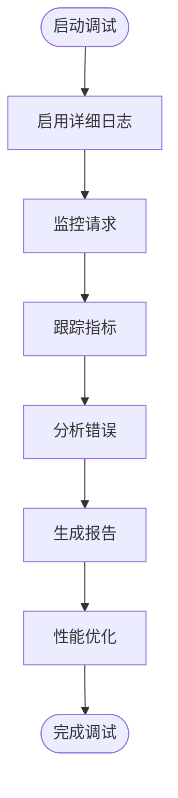

**章节来源**
- [app/api/upstash/[action]/[...key]/route.ts](file://app/api/upstash/[action]/[...key]/route.ts#L58-L67)
- [app/utils/cloud/upstash.ts](file://app/utils/cloud/upstash.ts#L18-L30)

## 最佳实践

### 配置建议

1. **环境变量管理**
   - 使用加密存储API密钥
   - 实施环境隔离配置
   - 定期轮换认证凭据

2. **性能调优**
   - 合理设置分块大小
   - 优化网络连接参数
   - 实施智能重试机制

3. **安全加固**
   - 启用HTTPS传输
   - 实施严格的身份验证
   - 监控异常访问行为

### 开发指南

1. **错误处理**
   ```typescript
   // 示例：优雅的错误处理
   try {
     await client.sync();
   } catch (error) {
     console.error('同步失败:', error);
     // 实施降级策略
   }
   ```

2. **状态管理**
   ```typescript
   // 示例：状态同步逻辑
   const syncState = {
     lastSyncTime: Date.now(),
     lastProvider: 'upstash',
     syncStatus: 'success'
   };
   ```

3. **测试策略**
   - 单元测试覆盖核心功能
   - 集成测试验证端到端流程
   - 性能测试评估系统负载

**章节来源**
- [app/store/sync.ts](file://app/store/sync.ts#L46-L151)
- [app/utils/sync.ts](file://app/utils/sync.ts#L121-L166)

## 总结

Upstash远程同步API为ChatGPT-Next-Web提供了强大而安全的数据同步能力。通过多方法路由架构、端到端加密、智能分块存储和严格的安全机制，系统确保了数据的完整性、可用性和安全性。

### 关键优势

1. **高性能**：基于Redis的快速数据访问
2. **高可用**：分布式架构确保服务连续性
3. **高安全**：多重认证和加密保护
4. **高扩展**：模块化设计支持灵活扩展

### 技术创新

- **智能分块算法**：突破单次请求大小限制
- **双向同步机制**：确保数据一致性
- **实时状态监控**：提供完整的运维支持
- **容错恢复机制**：保障系统稳定性

该系统不仅满足了当前的功能需求，还为未来的扩展和优化奠定了坚实的基础。通过持续的技术改进和安全加固，Upstash同步API将继续为用户提供可靠的数据同步服务。