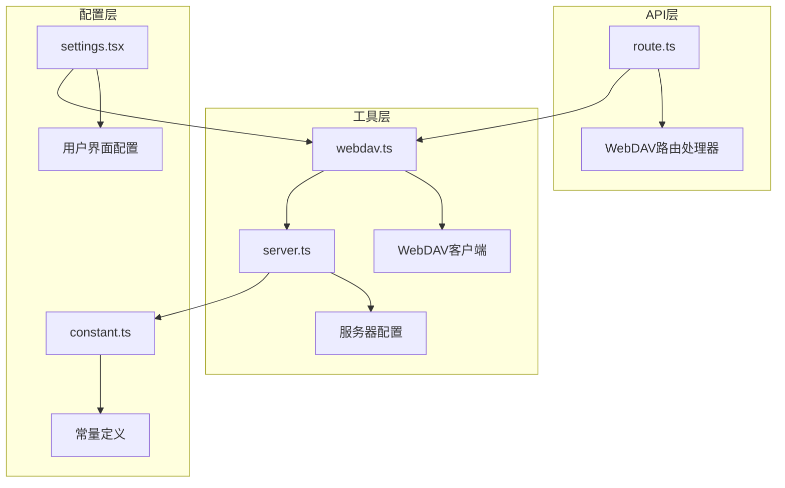
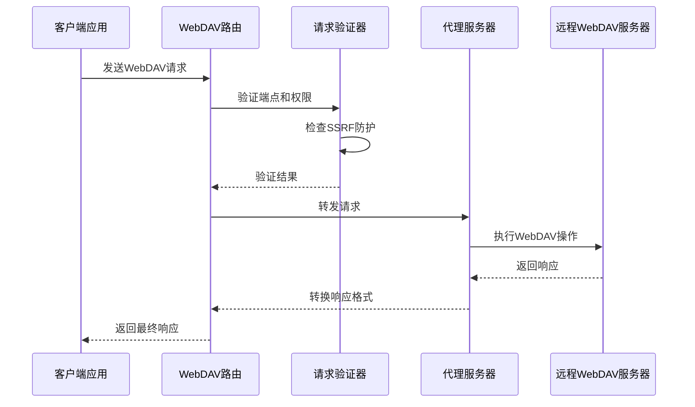
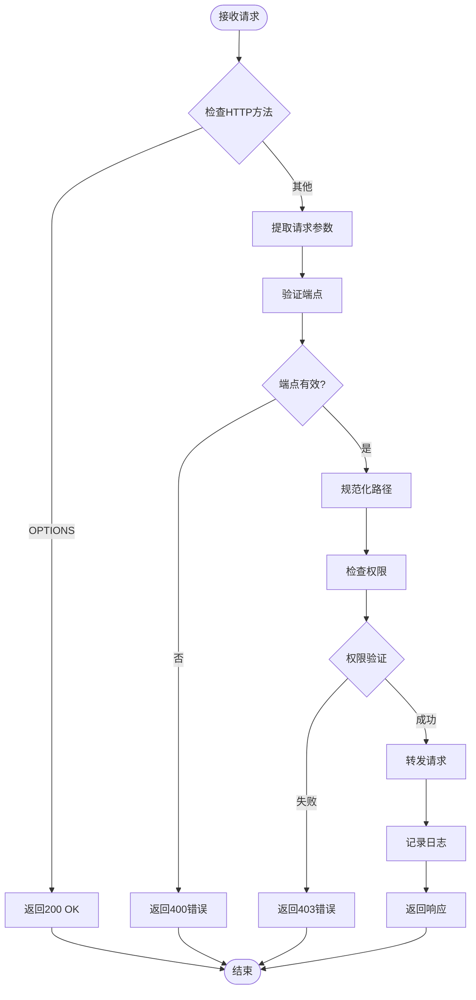
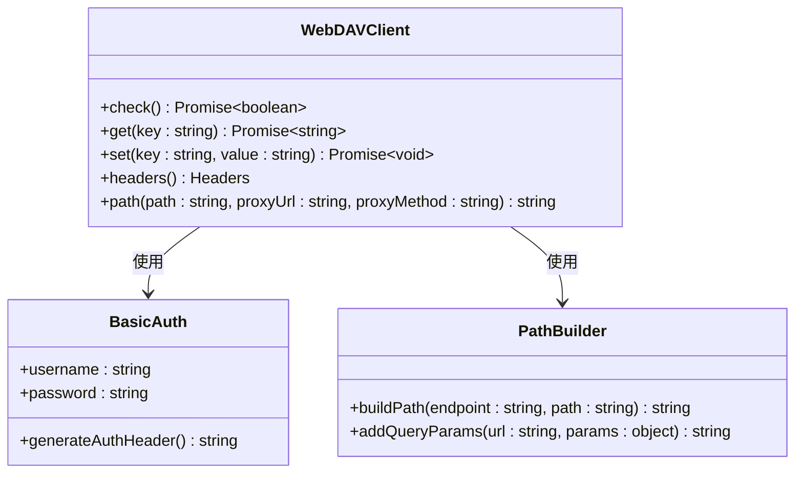
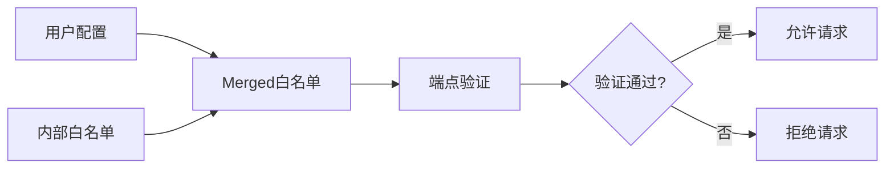
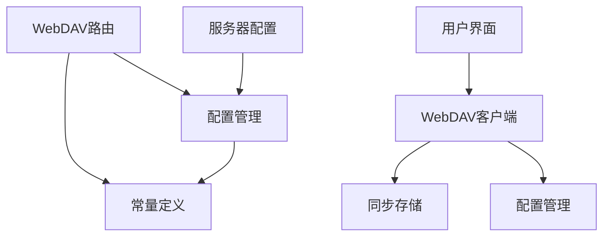

# WebDAV数据存储API技术文档

<cite>
**本文档中引用的文件**
- [app/api/webdav/[...path]/route.ts](file://app/api/webdav/[...path]/route.ts)
- [app/utils/cloud/webdav.ts](file://app/utils/cloud/webdav.ts)
- [app/config/server.ts](file://app/config/server.ts)
- [app/constant.ts](file://app/constant.ts)
- [app/components/settings.tsx](file://app/components/settings.tsx)
</cite>

## 目录
1. [简介](#简介)
2. [项目结构](#项目结构)
3. [核心组件](#核心组件)
4. [架构概览](#架构概览)
5. [详细组件分析](#详细组件分析)
6. [依赖关系分析](#依赖关系分析)
7. [性能考虑](#性能考虑)
8. [故障排除指南](#故障排除指南)
9. [结论](#结论)

## 简介

WebDAV数据存储API是一个通用的云存储适配器，为ChatGPT-Next-Web提供了与各种支持WebDAV协议的存储服务进行交互的能力。该API实现了标准的WebDAV方法（PROPFIND、PUT、GET、DELETE等），并通过代理模式连接到不同的存储后端，如Nextcloud、阿里云盘等。

该系统的主要功能包括：
- 提供统一的WebDAV接口以适配多种存储服务
- 实现聊天数据的持久化存储和同步
- 支持基本认证和SSL证书验证
- 提供超时设置和大文件传输优化
- 实现路径规范化和HTTP头转换

## 项目结构

WebDAV存储API在项目中的组织结构如下：

**图表来源**
- [app/api/webdav/[...path]/route.ts](file://app/api/webdav/[...path]/route.ts#L1-L168)
- [app/utils/cloud/webdav.ts](file://app/utils/cloud/webdav.ts#L1-L98)
- [app/config/server.ts](file://app/config/server.ts#L1-L279)

**章节来源**
- [app/api/webdav/[...path]/route.ts](file://app/api/webdav/[...path]/route.ts#L1-L168)
- [app/utils/cloud/webdav.ts](file://app/utils/cloud/webdav.ts#L1-L98)

## 核心组件

### WebDAV路由处理器

WebDAV路由处理器是整个系统的核心入口点，负责接收和处理来自客户端的WebDAV请求。

主要特性：
- 支持OPTIONS预检请求
- 实现路径规范化和URL验证
- 提供SSRF攻击防护
- 支持多种WebDAV方法（MKCOL、GET、PUT）

### WebDAV客户端

WebDAV客户端封装了与远程WebDAV服务器通信的逻辑，提供了简洁的API接口。

核心功能：
- 基本认证处理（Basic Auth）
- 路径构建和查询参数管理
- 错误处理和状态码映射
- 文件上传和下载操作

### 配置管理系统

配置管理系统负责管理WebDAV连接的各种参数，包括端点、认证信息和代理设置。

**章节来源**
- [app/api/webdav/[...path]/route.ts](file://app/api/webdav/[...path]/route.ts#L20-L168)
- [app/utils/cloud/webdav.ts](file://app/utils/cloud/webdav.ts#L7-L98)
- [app/config/server.ts](file://app/config/server.ts#L179-L181)

## 架构概览

WebDAV存储API采用代理模式架构，通过中间层实现对不同WebDAV服务的统一访问：

**图表来源**
- [app/api/webdav/[...path]/route.ts](file://app/api/webdav/[...path]/route.ts#L20-L168)
- [app/utils/cloud/webdav.ts](file://app/utils/cloud/webdav.ts#L7-L98)

## 详细组件分析

### WebDAV路由处理器详细分析

#### 请求处理流程

**图表来源**
- [app/api/webdav/[...path]/route.ts](file://app/api/webdav/[...path]/route.ts#L20-L168)

#### 路径规范化机制

路径规范化是确保安全性和正确性的关键步骤：

1. **端点标准化**：使用`normalizeUrl`函数将用户提供的端点转换为标准URL格式
2. **权限验证**：通过`mergedAllowedWebDavEndpoints`列表验证允许的域名
3. **路径拼接**：将请求路径与目标端点组合形成完整的请求URL

#### HTTP头转换

系统自动处理以下HTTP头转换：
- **认证头**：将客户端的授权信息传递给目标WebDAV服务器
- **内容类型**：根据请求方法自动设置适当的Content-Type
- **重定向处理**：支持手动重定向控制

**章节来源**
- [app/api/webdav/[...path]/route.ts](file://app/api/webdav/[...path]/route.ts#L12-L168)

### WebDAV客户端详细分析

#### 认证处理机制

**图表来源**
- [app/utils/cloud/webdav.ts](file://app/utils/cloud/webdav.ts#L62-L98)

#### 状态码映射

系统实现了智能的状态码处理：

| 原始状态码 | 映射行为 | 处理方式 |
|------------|----------|----------|
| 200, 201 | 成功状态 | 直接返回 |
| 404 | 文件不存在 | 返回空字符串 |
| 405 | 方法不支持 | 记录警告 |
| 301, 302, 307, 308 | 重定向 | 继续处理 |

#### 分块上传支持

虽然当前实现主要针对小文件（如备份配置），但系统设计考虑了扩展性：

- **文件大小限制**：默认支持最大1MB的单次上传
- **分块策略**：对于大文件可采用分块上传策略
- **内存优化**：流式处理减少内存占用

**章节来源**
- [app/utils/cloud/webdav.ts](file://app/utils/cloud/webdav.ts#L16-L98)

### 配置管理系统分析

#### 端点白名单机制

系统维护两个级别的端点白名单：

1. **内部白名单**：预定义的知名WebDAV服务
2. **自定义白名单**：用户配置的额外允许端点

**图表来源**
- [app/config/server.ts](file://app/config/server.ts#L179-L181)
- [app/constant.ts](file://app/constant.ts#L918-L928)

#### SSL证书验证配置

系统通过以下机制确保SSL安全性：

- **URL验证**：强制使用HTTPS协议
- **主机名匹配**：严格验证目标主机名
- **路径前缀检查**：防止路径遍历攻击

**章节来源**
- [app/config/server.ts](file://app/config/server.ts#L179-L181)
- [app/constant.ts](file://app/constant.ts#L918-L928)

## 依赖关系分析

### 组件间依赖关系

**图表来源**
- [app/api/webdav/[...path]/route.ts](file://app/api/webdav/[...path]/route.ts#L1-L5)
- [app/utils/cloud/webdav.ts](file://app/utils/cloud/webdav.ts#L1-L3)

### 外部依赖

系统依赖以下外部组件：

- **Next.js框架**：提供路由和服务器端渲染能力
- **Node.js Fetch API**：用于HTTP请求处理
- **Base64编码**：实现Basic认证
- **URL解析库**：处理URL标准化

**章节来源**
- [app/api/webdav/[...path]/route.ts](file://app/api/webdav/[...path]/route.ts#L1-L5)
- [app/utils/cloud/webdav.ts](file://app/utils/cloud/webdav.ts#L1-L3)

## 性能考虑

### 超时设置

系统实现了合理的超时配置：

- **默认超时**：60秒（REQUEST_TIMEOUT_MS）
- **思考模式超时**：300秒（REQUEST_TIMEOUT_MS * 5）
- **边缘运行时**：优化的执行环境

### 大文件传输优化

虽然当前实现主要针对小文件，但系统设计考虑了以下优化策略：

- **流式处理**：避免将整个文件加载到内存
- **分块上传**：支持大文件的分块传输
- **内存管理**：及时释放不需要的资源

### 缓存策略

系统实现了简单的缓存机制：

- **连接复用**：保持HTTP连接以提高效率
- **状态缓存**：缓存认证状态和连接信息
- **错误缓存**：避免重复相同的错误请求

## 故障排除指南

### 常见问题及解决方案

#### 认证失败

**症状**：收到401 Unauthorized响应
**原因**：用户名或密码错误
**解决方案**：
1. 检查WebDAV服务器的用户名和密码
2. 确认Basic认证格式正确
3. 验证用户权限设置

#### 端点验证失败

**症状**：收到400 Bad Request响应
**原因**：端点不在白名单中
**解决方案**：
1. 检查端点URL格式
2. 添加端点到ALLOWED_WEBDAV_ENDPOINTS环境变量
3. 确认使用HTTPS协议

#### 文件上传失败

**症状**：上传操作无响应或失败
**原因**：网络问题或服务器限制
**解决方案**：
1. 检查网络连接
2. 验证目标存储空间
3. 查看服务器日志

#### 权限不足

**症状**：收到403 Forbidden响应
**原因**：缺少必要的文件操作权限
**解决方案**：
1. 检查WebDAV用户的权限设置
2. 确认目标目录的访问权限
3. 验证文件名是否符合要求

**章节来源**
- [app/api/webdav/[...path]/route.ts](file://app/api/webdav/[...path]/route.ts#L34-L58)
- [app/utils/cloud/webdav.ts](file://app/utils/cloud/webdav.ts#L16-L34)

## 结论

WebDAV数据存储API为ChatGPT-Next-Web提供了一个强大而灵活的云存储解决方案。通过统一的接口设计，系统能够无缝对接多种WebDAV兼容的服务，包括Nextcloud、阿里云盘等主流存储平台。

### 主要优势

1. **通用性强**：支持多种WebDAV服务提供商
2. **安全性高**：实现了完善的SSRF防护和权限控制
3. **易于集成**：提供简洁的API接口和配置选项
4. **可扩展性好**：支持自定义端点和代理设置

### 技术特点

- **代理模式**：通过中间层实现对不同存储服务的抽象
- **路径规范化**：确保请求的安全性和正确性
- **状态码映射**：智能处理不同存储服务的响应差异
- **认证支持**：完整的Basic认证和SSL验证机制

### 应用场景

该API特别适用于需要跨平台数据同步的应用场景，如：
- 聊天应用的数据备份和恢复
- 文档管理系统的云端同步
- 多设备间的数据共享
- 企业级文档协作平台

通过合理配置和使用，WebDAV数据存储API能够为用户提供可靠、安全、高效的云存储服务体验。