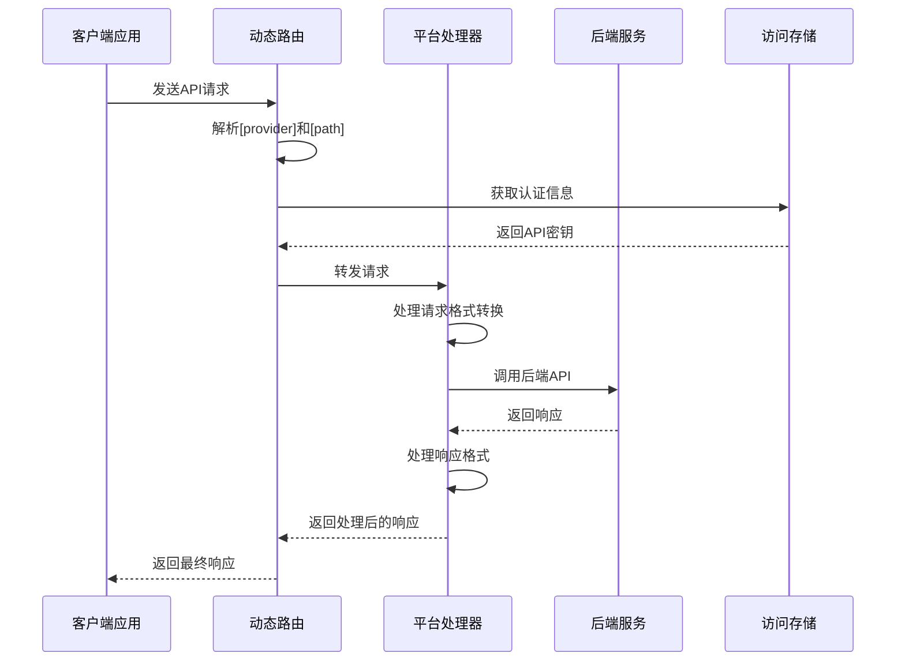
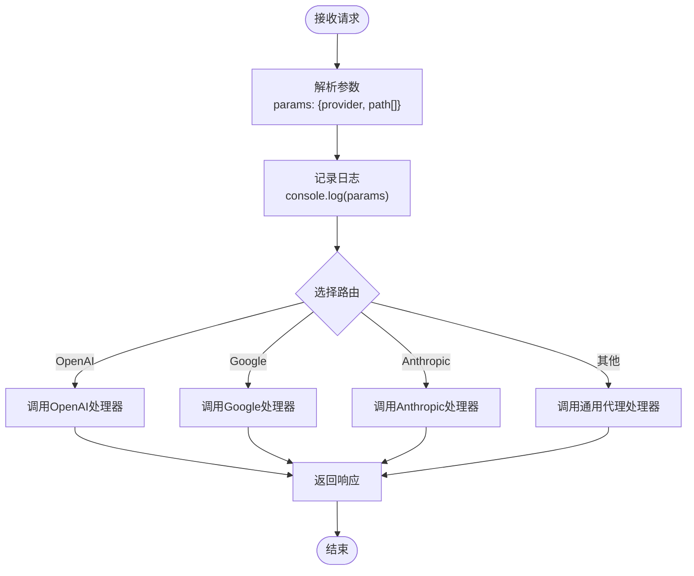
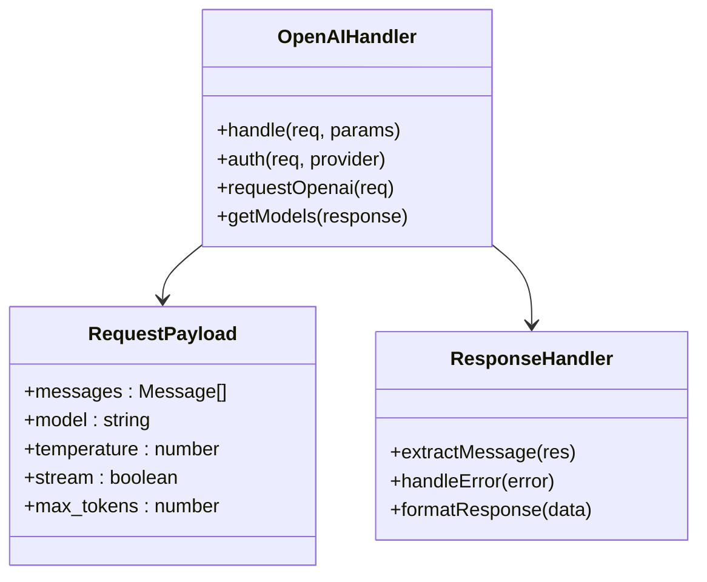
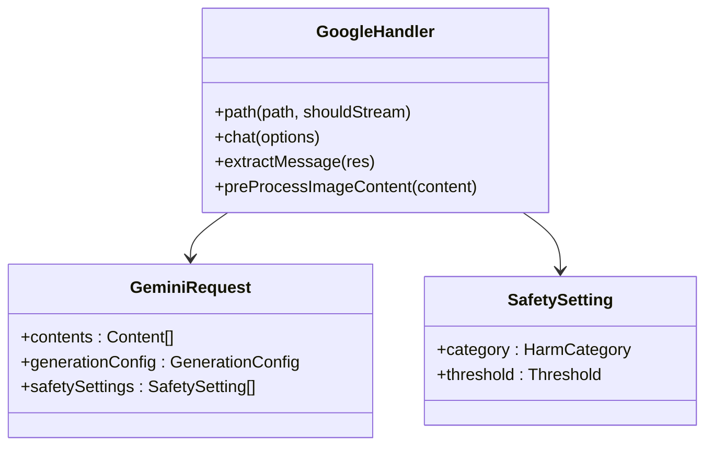
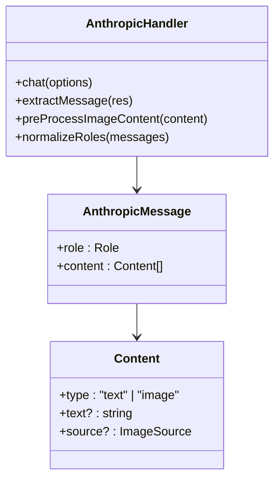
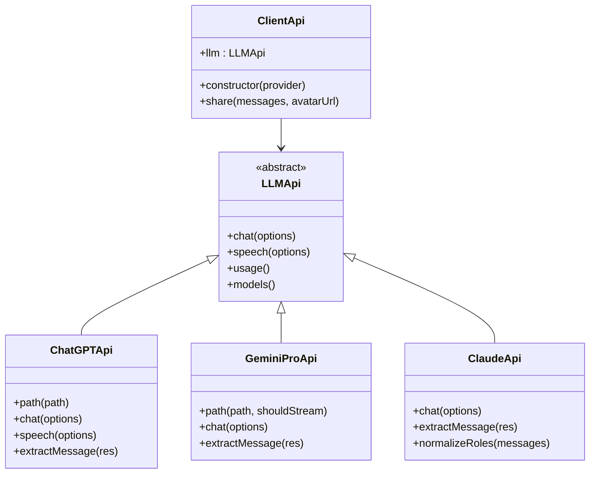
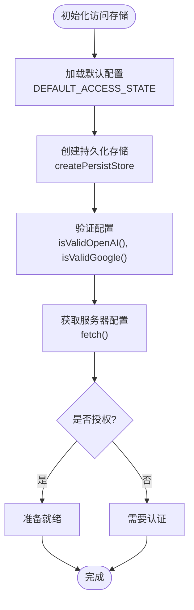
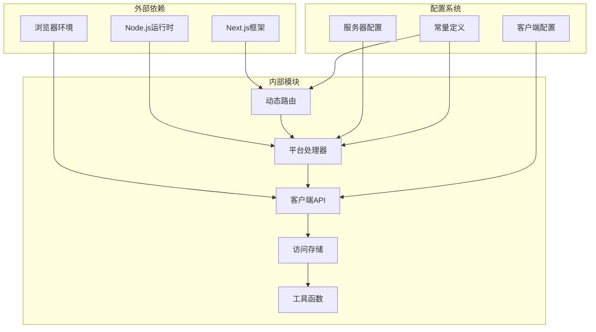

# 模型提供商代理API

<cite>
**本文档中引用的文件**
- [app/api/[provider]/[...path]/route.ts](file://app/api/[provider]/[...path]/route.ts)
- [app/client/api.ts](file://app/client/api.ts)
- [app/store/access.ts](file://app/store/access.ts)
- [app/utils/stream.ts](file://app/utils/stream.ts)
- [app/constant.ts](file://app/constant.ts)
- [app/api/common.ts](file://app/api/common.ts)
- [app/api/proxy.ts](file://app/api/proxy.ts)
- [app/api/openai.ts](file://app/api/openai.ts)
- [app/client/platforms/openai.ts](file://app/client/platforms/openai.ts)
- [app/client/platforms/google.ts](file://app/client/platforms/google.ts)
- [app/client/platforms/anthropic.ts](file://app/client/platforms/anthropic.ts)
- [app/config/server.ts](file://app/config/server.ts)
- [app/utils/chat.ts](file://app/utils/chat.ts)
- [next.config.mjs](file://next.config.mjs)
</cite>

## 目录
1. [简介](#简介)
2. [项目结构](#项目结构)
3. [核心组件](#核心组件)
4. [架构概览](#架构概览)
5. [详细组件分析](#详细组件分析)
6. [依赖关系分析](#依赖关系分析)
7. [性能考虑](#性能考虑)
8. [故障排除指南](#故障排除指南)
9. [结论](#结论)

## 简介

ChatGPT-Next-Web的模型提供商代理API是一个高度模块化和可扩展的系统，旨在统一管理多个AI服务提供商的API调用。该系统通过动态路由机制实现了对OpenAI、Anthropic、Google、百度、字节跳动等14个不同AI服务商的无缝集成，为用户提供了一致的接口体验。

核心设计理念包括：
- **泛型路由设计**：通过`[provider]/[...path]`动态路由模式匹配不同的AI服务商
- **透明代理转发**：将前端请求透明地转发到对应的后端服务
- **统一认证管理**：集中管理各服务商的API密钥和访问控制
- **流式响应支持**：完整支持实时流式对话和内容生成
- **跨域资源共享**：完善的CORS配置确保安全的跨域访问

## 项目结构

```mermaid
graph TB
subgraph "API层"
A[动态路由 /api/[provider]/[...path]]
B[通用处理器 common.ts]
C[代理处理器 proxy.ts]
end
subgraph "平台实现"
D[OpenAI openai.ts]
E[Google google.ts]
F[Anthropic anthropic.ts]
G[其他平台...]
end
subgraph "客户端层"
H[API客户端 api.ts]
I[平台适配器]
J[认证管理]
end
subgraph "存储层"
K[访问存储 access.ts]
L[配置管理]
end
A --> B
A --> C
B --> D
B --> E
B --> F
B --> G
H --> I
I --> J
J --> K
K --> L
```

**图表来源**
- [app/api/[provider]/[...path]/route.ts](file://app/api/[provider]/[...path]/route.ts#L20-L60)
- [app/client/api.ts](file://app/client/api.ts#L136-L182)

**章节来源**
- [app/api/[provider]/[...path]/route.ts](file://app/api/[provider]/[...path]/route.ts#L1-L86)
- [app/constant.ts](file://app/constant.ts#L59-L78)

## 核心组件

### 动态路由系统

动态路由系统是整个代理API的核心，它通过Next.js的文件系统路由机制实现了灵活的服务商匹配：

```typescript
// 路由匹配逻辑
switch (apiPath) {
  case ApiPath.Azure:
    return azureHandler(req, { params });
  case ApiPath.Google:
    return googleHandler(req, { params });
  case ApiPath.Anthropic:
    return anthropicHandler(req, { params });
  // ... 其他服务商
  default:
    return proxyHandler(req, { params });
}
```

### 认证令牌注入机制

系统实现了智能的认证令牌管理，根据不同的服务商类型自动选择合适的认证方式：

```typescript
// 认证头选择逻辑
const authHeader = getAuthHeader();
const bearerToken = getBearerToken(apiKey, isAzure || isAnthropic || isGoogle);

if (bearerToken) {
  headers[authHeader] = bearerToken;
} else if (isEnabledAccessControl && validString(accessStore.accessCode)) {
  headers["Authorization"] = getBearerToken(
    ACCESS_CODE_PREFIX + accessStore.accessCode,
  );
}
```

### 流式响应处理

系统支持完整的流式响应处理，包括服务器发送事件（SSE）和增量数据传输：

```typescript
// 流式处理流程
const stream = fetch(chatPath, {
  method: "POST",
  body: JSON.stringify(requestPayload),
  signal: controller.signal,
  headers: getHeaders(),
});
```

**章节来源**
- [app/api/[provider]/[...path]/route.ts](file://app/api/[provider]/[...path]/route.ts#L20-L60)
- [app/client/api.ts](file://app/client/api.ts#L244-L366)
- [app/utils/stream.ts](file://app/utils/stream.ts#L22-L108)

## 架构概览



**图表来源**
- [app/api/[provider]/[...path]/route.ts](file://app/api/[provider]/[...path]/route.ts#L20-L60)
- [app/client/api.ts](file://app/client/api.ts#L136-L182)

## 详细组件分析

### 动态路由处理器

动态路由处理器负责将泛型请求路由到相应的平台处理器：



**图表来源**
- [app/api/[provider]/[...path]/route.ts](file://app/api/[provider]/[...path]/route.ts#L20-L60)

#### 支持的服务商列表

系统支持以下14个AI服务商：

| 服务商 | API路径 | 主要功能 |
|--------|---------|----------|
| OpenAI | `/api/openai` | GPT系列模型、DALL-E图像生成 |
| Google | `/api/google` | Gemini系列模型、多模态能力 |
| Anthropic | `/api/anthropic` | Claude系列模型、思维链推理 |
| Azure | `/api/azure` | 企业级OpenAI部署 |
| 百度 | `/api/baidu` | 文心一言系列模型 |
| 字节跳动 | `/api/bytedance` | 通义千问系列模型 |
| 阿里巴巴 | `/api/alibaba` | 通义万相、多模态生成 |
| 腾讯 | `/api/tencent` | 混元系列模型 |
| 月之暗面 | `/api/moonshot` | 月之暗面Kimi模型 |
| 知乎 | `/api/iflytek` | 火山语音识别 |
| 深度求索 | `/api/deepseek` | 深度求索模型 |
| XAI | `/api/xai` | Grok模型 |
| ChatGLM | `/api/chatglm` | 清华智谱GLM模型 |
| 硅基流动 | `/api/siliconflow` | 开源模型聚合平台 |
| 302.AI | `/api/302ai` | 国际化模型服务 |

**章节来源**
- [app/api/[provider]/[...path]/route.ts](file://app/api/[provider]/[...path]/route.ts#L1-L19)
- [app/constant.ts](file://app/constant.ts#L59-L78)

### 平台特定处理器

每个平台都有专门的处理器来处理特定的API格式和认证要求：

#### OpenAI处理器

OpenAI处理器负责处理OpenAI API的请求，包括聊天完成、图像生成等功能：



**图表来源**
- [app/api/openai.ts](file://app/api/openai.ts#L29-L78)
- [app/client/platforms/openai.ts](file://app/client/platforms/openai.ts#L57-L70)

#### Google处理器

Google处理器专门处理Google Gemini API的请求，支持多模态输入和高级安全设置：



**图表来源**
- [app/client/platforms/google.ts](file://app/client/platforms/google.ts#L32-L200)

#### Anthropic处理器

Anthropic处理器处理Claude模型的请求，特别注重角色映射和视觉能力支持：



**图表来源**
- [app/client/platforms/anthropic.ts](file://app/client/platforms/anthropic.ts#L68-L200)

**章节来源**
- [app/api/openai.ts](file://app/api/openai.ts#L1-L79)
- [app/client/platforms/openai.ts](file://app/client/platforms/openai.ts#L1-L200)
- [app/client/platforms/google.ts](file://app/client/platforms/google.ts#L1-L200)
- [app/client/platforms/anthropic.ts](file://app/client/platforms/anthropic.ts#L1-L200)

### 客户端集成

客户端通过统一的API接口与代理系统交互：



**图表来源**
- [app/client/api.ts](file://app/client/api.ts#L136-L182)
- [app/client/api.ts](file://app/client/api.ts#L108-L112)

**章节来源**
- [app/client/api.ts](file://app/client/api.ts#L136-L182)

### 访问存储管理

访问存储负责管理所有服务商的API密钥和配置信息：



**图表来源**
- [app/store/access.ts](file://app/store/access.ts#L65-L155)

**章节来源**
- [app/store/access.ts](file://app/store/access.ts#L156-L304)

### 错误映射策略

系统实现了完善的错误处理和映射机制：

| 错误类型 | HTTP状态码 | 处理策略 |
|----------|------------|----------|
| 认证失败 | 401 | 返回认证错误信息 |
| 权限不足 | 403 | 返回权限拒绝信息 |
| 请求超时 | 408 | 重试机制 |
| 服务不可用 | 503 | 降级处理 |
| 参数错误 | 400 | 返回具体错误详情 |

**章节来源**
- [app/api/common.ts](file://app/api/common.ts#L111-L143)
- [app/api/proxy.ts](file://app/api/proxy.ts#L37-L45)

## 依赖关系分析



**图表来源**
- [app/api/[provider]/[...path]/route.ts](file://app/api/[provider]/[...path]/route.ts#L1-L19)
- [app/client/api.ts](file://app/client/api.ts#L1-L28)

**章节来源**
- [app/api/[provider]/[...path]/route.ts](file://app/api/[provider]/[...path]/route.ts#L1-L19)
- [app/client/api.ts](file://app/client/api.ts#L1-L28)

## 性能考虑

### 超时处理

系统实现了多层次的超时保护机制：

```typescript
// 请求超时设置
const timeoutId = setTimeout(() => {
  controller.abort();
}, 10 * 60 * 1000); // 10分钟超时

// 流式响应超时
const streamTimeoutId = setTimeout(() => {
  controller.abort();
}, REQUEST_TIMEOUT_MS); // 默认60秒超时
```

### 重试逻辑

对于网络不稳定的情况，系统提供了自动重试机制：

```typescript
// 重试策略
try {
  const res = await fetch(fetchUrl, fetchOptions);
  return new Response(res.body, {
    status: res.status,
    statusText: res.statusText,
    headers: newHeaders,
  });
} finally {
  clearTimeout(timeoutId);
}
```

### 缓存优化

系统在多个层面实现了缓存优化：

- **图片压缩缓存**：对上传的图片进行压缩和缓存
- **配置缓存**：本地存储用户配置信息
- **模型列表缓存**：缓存可用模型列表减少API调用

**章节来源**
- [app/api/common.ts](file://app/api/common.ts#L46-L50)
- [app/utils/chat.ts](file://app/utils/chat.ts#L144-L165)
- [app/store/access.ts](file://app/store/access.ts#L252-L282)

## 故障排除指南

### 常见问题及解决方案

#### 1. 认证失败

**症状**：收到401未授权错误
**原因**：API密钥配置错误或过期
**解决**：检查访问存储中的密钥配置

#### 2. 跨域请求失败

**症状**：浏览器控制台显示CORS错误
**原因**：CORS配置不正确
**解决**：检查Next.js配置中的CORS头部设置

#### 3. 流式响应中断

**症状**：对话过程中断或响应不完整
**原因**：网络连接不稳定或超时
**解决**：检查网络连接和超时设置

#### 4. 模型不可用

**症状**：请求被拒绝或返回空结果
**原因**：模型配置限制或服务商限制
**解决**：检查自定义模型配置和服务商限制

**章节来源**
- [app/api/common.ts](file://app/api/common.ts#L111-L143)
- [next.config.mjs](file://next.config.mjs#L38-L52)

## 结论

ChatGPT-Next-Web的模型提供商代理API系统展现了现代Web应用中API抽象层设计的最佳实践。通过动态路由、统一认证、流式处理和完善的错误处理机制，该系统成功地将复杂的多服务商API整合为一个简洁、一致的接口。

### 主要优势

1. **高度模块化**：每个服务商都有独立的处理器，便于维护和扩展
2. **统一接口**：客户端无需关心底层服务商差异
3. **灵活配置**：支持多种认证方式和配置选项
4. **性能优化**：多层次的缓存和超时保护机制
5. **安全可靠**：完善的错误处理和安全防护措施

### 技术创新点

- **泛型路由设计**：通过Next.js文件系统路由实现动态服务商匹配
- **智能认证管理**：自动识别服务商类型并应用相应的认证方式
- **流式响应支持**：完整的SSE和增量数据传输支持
- **跨域资源共享**：标准化的CORS配置确保安全访问

该系统为构建大规模AI应用提供了坚实的基础架构，其设计理念和实现方式值得在类似项目中借鉴和应用。