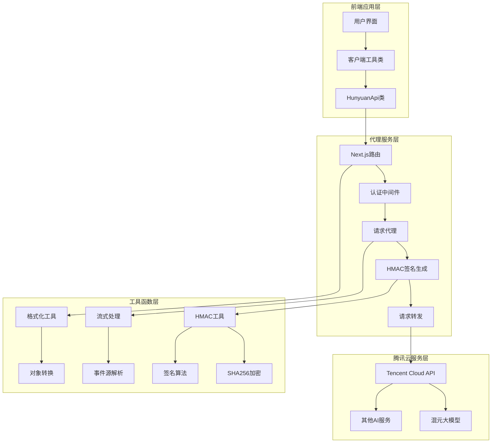
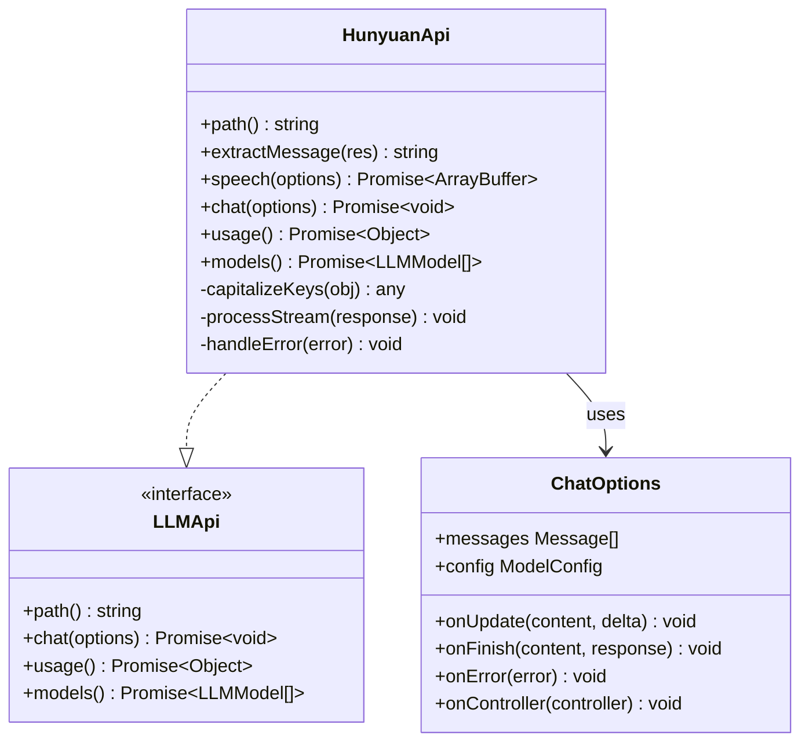
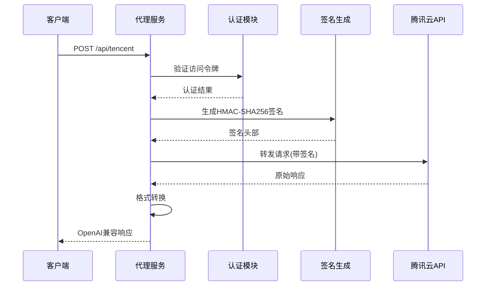
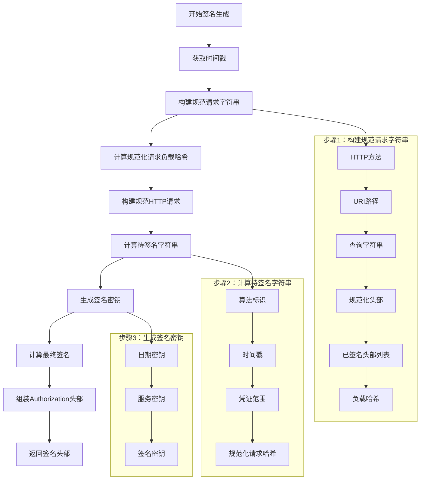
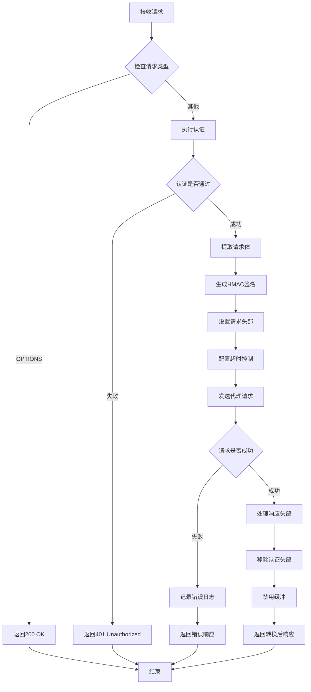
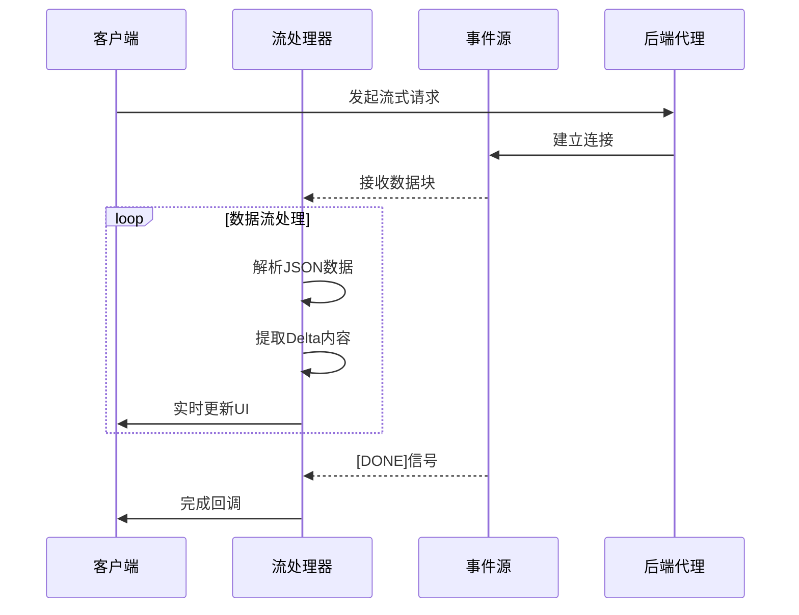
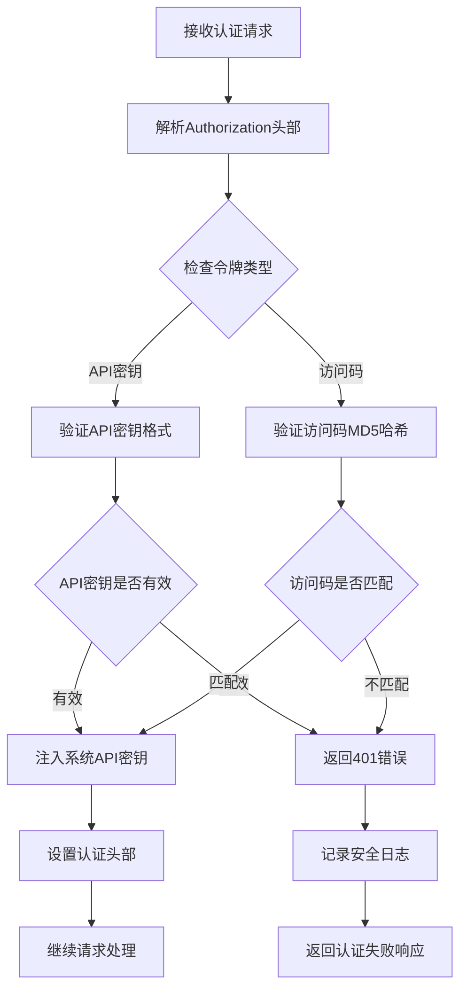
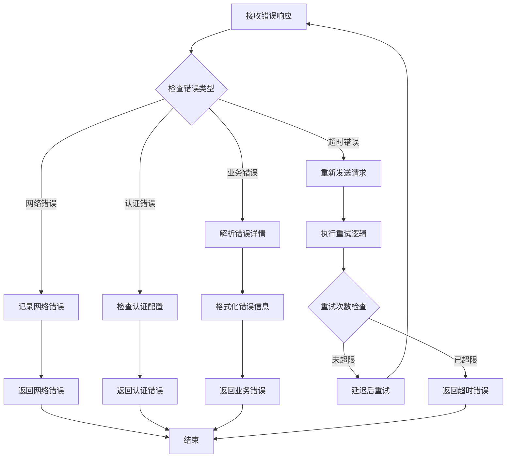

# 腾讯系服务API

<cite>
**本文档引用的文件**
- [app/api/tencent/route.ts](file://app/api/tencent/route.ts)
- [app/client/platforms/tencent.ts](file://app/client/platforms/tencent.ts)
- [app/utils/tencent.ts](file://app/utils/tencent.ts)
- [app/utils/hmac.ts](file://app/utils/hmac.ts)
- [app/utils/stream.ts](file://app/utils/stream.ts)
- [app/constant.ts](file://app/constant.ts)
- [app/api/common.ts](file://app/api/common.ts)
- [app/api/auth.ts](file://app/api/auth.ts)
- [app/utils/format.ts](file://app/utils/format.ts)
- [app/config/server.ts](file://app/config/server.ts)
- [app/config/client.ts](file://app/config/client.ts)
</cite>

## 目录
1. [简介](#简介)
2. [项目架构概览](#项目架构概览)
3. [核心组件分析](#核心组件分析)
4. [HMAC-SHA256签名机制](#hmac-sha256签名机制)
5. [请求代理机制](#请求代理机制)
6. [响应格式转换](#响应格式转换)
7. [流式传输处理](#流式传输处理)
8. [认证与配额管理](#认证与配额管理)
9. [错误处理与状态码映射](#错误处理与状态码映射)
10. [使用示例](#使用示例)
11. [故障排除指南](#故障排除指南)
12. [总结](#总结)

## 简介

腾讯系服务API是一个专门用于集成腾讯混元大模型及其他腾讯云AI能力的代理服务。该系统通过统一的 `/api/tencent` 端点，为开发者提供了访问腾讯云AI服务的标准化接口，支持HMAC-SHA256签名验证、请求代理、响应格式转换等核心功能。

该API设计遵循OpenAI兼容性原则，能够将腾讯云的原生响应格式转换为标准的OpenAI格式，使得现有的应用程序可以无缝集成腾讯的AI能力而无需大量修改代码。

## 项目架构概览

腾讯系服务API采用分层架构设计，包含前端客户端、后端代理服务器和腾讯云AI服务三层结构。



**图表来源**
- [app/client/platforms/tencent.ts](file://app/client/platforms/tencent.ts#L66-L279)
- [app/api/tencent/route.ts](file://app/api/tencent/route.ts#L10-L118)
- [app/utils/tencent.ts](file://app/utils/tencent.ts#L17-L103)

## 核心组件分析

### 客户端工具类 (HunyuanApi)

客户端工具类实现了LLMApi接口，负责与腾讯混元大模型进行交互。



**图表来源**
- [app/client/platforms/tencent.ts](file://app/client/platforms/tencent.ts#L66-L279)

### 后端代理服务

后端代理服务处理来自客户端的请求，并将其转发到腾讯云API。



**图表来源**
- [app/api/tencent/route.ts](file://app/api/tencent/route.ts#L10-L118)
- [app/api/auth.ts](file://app/api/auth.ts#L27-L130)

**章节来源**
- [app/client/platforms/tencent.ts](file://app/client/platforms/tencent.ts#L66-L279)
- [app/api/tencent/route.ts](file://app/api/tencent/route.ts#L10-L118)

## HMAC-SHA256签名机制

腾讯系服务API采用TC3-HMAC-SHA256签名算法确保请求的安全性和完整性。

### 签名生成流程



**图表来源**
- [app/utils/tencent.ts](file://app/utils/tencent.ts#L17-L103)
- [app/utils/hmac.ts](file://app/utils/hmac.ts#L1-L247)

### 签名算法实现

签名算法的核心实现包括以下关键步骤：

1. **时间戳处理**：获取当前UTC时间戳并格式化为日期字符串
2. **规范化请求构建**：按照腾讯云要求的标准格式构建请求字符串
3. **签名密钥生成**：基于SECRET_KEY生成多层密钥
4. **最终签名计算**：使用HMAC-SHA256算法计算最终签名

**章节来源**
- [app/utils/tencent.ts](file://app/utils/tencent.ts#L17-L103)
- [app/utils/hmac.ts](file://app/utils/hmac.ts#L1-L247)

## 请求代理机制

### 区域节点路由策略

腾讯系服务API支持全球多个边缘节点，提供最优的网络性能。

| 区域代码 | 地理位置 | 节点名称 |
|---------|----------|----------|
| arn1 | 阿姆斯特丹 | Amazon Netherlands |
| bom1 | 孟买 | Amazon India |
| cdg1 | 巴黎 | Amazon France |
| cle1 | 克利夫兰 | Amazon US East |
| cpt1 | 开普敦 | Amazon South Africa |
| dub1 | 都柏林 | Amazon Ireland |
| fra1 | 法兰克福 | Amazon Germany |
| gru1 | 圣保罗 | Amazon Brazil |
| hnd1 | 东京 | Amazon Japan |
| iad1 | 费城 | Amazon US East |
| icn1 | 首尔 | Amazon South Korea |
| kix1 | 大阪 | Amazon Japan |
| lhr1 | 伦敦 | Amazon UK |
| pdx1 | 波特兰 | Amazon US West |
| sfo1 | 旧金山 | Amazon US West |
| sin1 | 新加坡 | Amazon Singapore |
| syd1 | 悉尼 | Amazon Australia |

### 请求处理流程



**图表来源**
- [app/api/tencent/route.ts](file://app/api/tencent/route.ts#L10-L118)

**章节来源**
- [app/api/tencent/route.ts](file://app/api/tencent/route.ts#L10-L118)

## 响应格式转换

### 腾讯云响应到OpenAI格式的转换

腾讯云混元大模型的原生响应格式需要转换为OpenAI兼容格式。

#### 原始腾讯云响应格式
```json
{
  "Response": {
    "Choices": [{
      "Message": {
        "Role": "assistant",
        "Content": "这是混元大模型的回答内容"
      },
      "FinishReason": "stop"
    }],
    "Usage": {
      "PromptTokens": 10,
      "CompletionTokens": 50,
      "TotalTokens": 60
    },
    "RequestId": "unique-request-id"
  }
}
```

#### 转换后的OpenAI格式
```json
{
  "choices": [{
    "message": {
      "role": "assistant",
      "content": "这是混元大模型的回答内容"
    },
    "finish_reason": "stop"
  }],
  "usage": {
    "prompt_tokens": 10,
    "completion_tokens": 50,
    "total_tokens": 60
  },
  "id": "unique-request-id",
  "object": "chat.completion",
  "created": 1640995200,
  "model": "hunyuan-pro"
}
```

### 关键字段映射表

| 腾讯云字段 | OpenAI字段 | 转换规则 |
|-----------|-----------|----------|
| Response.Choices[].Message.Role | choices[].message.role | 直接映射 |
| Response.Choices[].Message.Content | choices[].message.content | 直接映射 |
| Response.Choices[].FinishReason | choices[].finish_reason | 直接映射 |
| Response.Usage.PromptTokens | usage.prompt_tokens | 直接映射 |
| Response.Usage.CompletionTokens | usage.completion_tokens | 直接映射 |
| Response.Usage.TotalTokens | usage.total_tokens | 直接映射 |
| Response.RequestId | id | 直接映射 |
| Response.ResponseMetadata.ContentType | object | 固定值："chat.completion" |

**章节来源**
- [app/client/platforms/tencent.ts](file://app/client/platforms/tencent.ts#L92-L94)

## 流式传输处理

### 流式响应处理机制

腾讯系服务API支持实时流式传输，提供接近实时的对话体验。



**图表来源**
- [app/client/platforms/tencent.ts](file://app/client/platforms/tencent.ts#L145-L254)

### 流式传输优化策略

1. **动画效果**：使用requestAnimationFrame实现平滑的文本显示效果
2. **内存管理**：及时清理未完成的响应数据
3. **错误恢复**：断线重连和数据完整性检查
4. **性能监控**：实时监控传输速度和延迟

**章节来源**
- [app/client/platforms/tencent.ts](file://app/client/platforms/tencent.ts#L145-L254)
- [app/utils/stream.ts](file://app/utils/stream.ts#L1-L109)

## 认证与配额管理

### 认证机制

腾讯系服务API采用多层次的认证机制：



**图表来源**
- [app/api/auth.ts](file://app/api/auth.ts#L27-L130)

### 配额限制管理

| 配额类型 | 默认限制 | 可配置项 |
|---------|----------|----------|
| 并发请求数 | 无限制 | 通过环境变量控制 |
| 请求频率 | 无限制 | 通过速率限制器控制 |
| 单次请求大小 | 2MB | 通过请求体大小检查 |
| 会话持续时间 | 10分钟 | 通过超时控制 |

**章节来源**
- [app/api/auth.ts](file://app/api/auth.ts#L27-L130)
- [app/config/server.ts](file://app/config/server.ts#L1-L279)

## 错误处理与状态码映射

### 错误码映射表

腾讯云API错误码与HTTP状态码的映射关系：

| 腾讯云错误码 | HTTP状态码 | 描述 | 处理方式 |
|-------------|-----------|------|----------|
| 60001 | 400 | 参数错误 | 返回详细错误信息 |
| 60002 | 401 | 认证失败 | 检查密钥配置 |
| 60003 | 403 | 权限不足 | 检查API权限 |
| 60004 | 404 | 资源不存在 | 验证模型名称 |
| 60005 | 429 | 请求过于频繁 | 实现重试机制 |
| 60006 | 500 | 服务器内部错误 | 记录日志并重试 |
| 60007 | 503 | 服务暂时不可用 | 实现指数退避 |

### 错误处理流程



**图表来源**
- [app/utils/format.ts](file://app/utils/format.ts#L1-L29)

**章节来源**
- [app/utils/format.ts](file://app/utils/format.ts#L1-L29)
- [app/api/tencent/route.ts](file://app/api/tencent/route.ts#L28-L33)

## 使用示例

### JavaScript Fetch API调用示例

以下是使用JavaScript Fetch API调用腾讯混元大模型的完整示例：

```javascript
// 基础聊天请求示例
async function callHunyuanModel(messages, model = 'hunyuan-pro') {
  const requestBody = {
    model: model,
    messages: messages,
    temperature: 0.7,
    top_p: 0.9,
    stream: false
  };

  try {
    const response = await fetch('/api/tencent', {
      method: 'POST',
      headers: {
        'Content-Type': 'application/json',
        'Authorization': `Bearer ${API_KEY}`
      },
      body: JSON.stringify(requestBody)
    });

    if (!response.ok) {
      throw new Error(`HTTP error! status: ${response.status}`);
    }

    const data = await response.json();
    return data.choices[0].message.content;
  } catch (error) {
    console.error('调用腾讯混元模型失败:', error);
    throw error;
  }
}

// 流式传输示例
async function streamHunyuanModel(messages, model = 'hunyuan-pro') {
  const requestBody = {
    model: model,
    messages: messages,
    temperature: 0.7,
    top_p: 0.9,
    stream: true
  };

  return new Promise((resolve, reject) => {
    const reader = new Response(
      fetch('/api/tencent', {
        method: 'POST',
        headers: {
          'Content-Type': 'application/json',
          'Authorization': `Bearer ${API_KEY}`
        },
        body: JSON.stringify(requestBody)
      }).then(res => res.body)
    ).body.getReader();

    let accumulatedResponse = '';

    function readStream() {
      reader.read().then(({ done, value }) => {
        if (done) {
          resolve(accumulatedResponse);
          return;
        }

        const chunk = new TextDecoder().decode(value);
        accumulatedResponse += chunk;

        // 处理流式数据
        try {
          const lines = chunk.split('\n');
          lines.forEach(line => {
            if (line.startsWith('data: ')) {
              const jsonData = line.slice(6);
              if (jsonData === '[DONE]') {
                resolve(accumulatedResponse);
              } else {
                const parsed = JSON.parse(jsonData);
                const content = parsed.choices[0].delta.content;
                if (content) {
                  // 更新UI或处理内容
                  console.log('收到内容:', content);
                }
              }
            }
          });
        } catch (e) {
          console.error('解析流式数据失败:', e);
        }

        readStream();
      }).catch(reject);
    }

    readStream();
  });
}
```

### 客户端工具类使用示例

```javascript
import { useAccessStore } from '@/store/access';
import { HunyuanApi } from '@/client/platforms/tencent';

// 初始化混元API客户端
const hunyuanApi = new HunyuanApi();

// 发起聊天请求
async function sendMessage() {
  const messages = [
    { role: 'system', content: '你是一个有用的助手。' },
    { role: 'user', content: '你好，请介绍一下自己。' }
  ];

  try {
    const options = {
      messages: messages,
      config: {
        model: 'hunyuan-pro',
        temperature: 0.7,
        top_p: 0.9,
        stream: true
      },
      onUpdate: (content, delta) => {
        // 实时更新UI
        console.log('增量内容:', delta);
      },
      onFinish: (content, response) => {
        // 对话完成
        console.log('完整回答:', content);
      },
      onError: (error) => {
        // 错误处理
        console.error('对话错误:', error);
      }
    };

    await hunyuanApi.chat(options);
  } catch (error) {
    console.error('发送消息失败:', error);
  }
}
```

**章节来源**
- [app/client/platforms/tencent.ts](file://app/client/platforms/tencent.ts#L100-L267)

## 故障排除指南

### 常见问题及解决方案

#### 1. 认证失败 (401 Unauthorized)
**症状**：返回401错误，提示认证失败
**原因**：
- SecretId或SecretKey配置错误
- 网络时间不同步
- API密钥过期

**解决方案**：
```bash
# 检查环境变量配置
echo "SecretId: $TENCENT_SECRET_ID"
echo "SecretKey: $TENCENT_SECRET_KEY"

# 验证时间同步
date

# 重新生成签名
node -e "
const { getHeader } = require('./app/utils/tencent');
const headers = getHeader('{}', '$TENCENT_SECRET_ID', '$TENCENT_SECRET_KEY');
console.log(headers);
"
```

#### 2. 签名验证失败
**症状**：腾讯云返回签名错误
**原因**：
- 请求体被修改
- 时间戳过期
- 签名算法错误

**解决方案**：
```javascript
// 检查请求体一致性
const requestBody = JSON.stringify({
  model: 'hunyuan-pro',
  messages: [{role: 'user', content: '测试'}],
  temperature: 0.7
});

console.log('原始请求体:', requestBody);
console.log('请求体长度:', Buffer.byteLength(requestBody, 'utf8'));
```

#### 3. 流式传输中断
**症状**：流式响应突然中断
**原因**：
- 网络连接不稳定
- 超时设置过短
- 服务器端限制

**解决方案**：
```javascript
// 增加重试机制
async function robustStreamCall(messages, maxRetries = 3) {
  for (let i = 0; i < maxRetries; i++) {
    try {
      return await streamHunyuanModel(messages);
    } catch (error) {
      if (i === maxRetries - 1) throw error;
      await new Promise(resolve => setTimeout(resolve, 1000 * (i + 1)));
    }
  }
}
```

#### 4. 性能优化建议

| 优化项 | 建议配置 | 说明 |
|--------|----------|------|
| 连接池大小 | 10-20个连接 | 根据并发需求调整 |
| 超时时间 | 30秒 | 平衡响应速度和稳定性 |
| 缓存策略 | LRU缓存 | 缓存常用模型配置 |
| 日志级别 | ERROR及以上 | 生产环境避免过多日志 |

**章节来源**
- [app/api/tencent/route.ts](file://app/api/tencent/route.ts#L28-L33)
- [app/utils/tencent.ts](file://app/utils/tencent.ts#L17-L103)

## 总结

腾讯系服务API提供了一个完整、安全、高效的腾讯云AI服务能力集成方案。通过HMAC-SHA256签名机制确保请求安全性，通过统一的OpenAI兼容格式简化了开发工作，通过流式传输提供了优秀的用户体验。

### 主要特性

1. **安全性**：采用TC3-HMAC-SHA256签名算法，确保请求完整性
2. **兼容性**：完全兼容OpenAI API格式，降低迁移成本
3. **可靠性**：完善的错误处理和重试机制
4. **性能**：支持流式传输和多种优化策略
5. **可扩展性**：模块化设计，易于维护和扩展

### 最佳实践

1. **配置管理**：使用环境变量管理敏感信息
2. **错误处理**：实现完善的错误捕获和重试机制
3. **性能监控**：监控API调用成功率和响应时间
4. **安全防护**：定期轮换API密钥，限制访问频率
5. **日志记录**：记录关键操作和错误信息，便于问题排查

该API为开发者提供了一个稳定可靠的腾讯云AI服务接入方案，能够满足各种规模的应用需求。