# 配置管理API深度技术文档

<cite>
**本文档中引用的文件**
- [app/api/config/route.ts](file://app/api/config/route.ts)
- [app/config/server.ts](file://app/config/server.ts)
- [app/config/client.ts](file://app/config/client.ts)
- [app/config/build.ts](file://app/config/build.ts)
- [app/store/config.ts](file://app/store/config.ts)
- [app/constant.ts](file://app/constant.ts)
- [app/utils/model.ts](file://app/utils/model.ts)
- [app/client/api.ts](file://app/client/api.ts)
- [app/typing.ts](file://app/typing.ts)
</cite>

## 目录
1. [简介](#简介)
2. [项目架构概览](#项目架构概览)
3. [核心组件分析](#核心组件分析)
4. [配置管理API详解](#配置管理api详解)
5. [服务端配置系统](#服务端配置系统)
6. [客户端配置系统](#客户端配置系统)
7. [模型管理系统](#模型管理系统)
8. [缓存策略与性能优化](#缓存策略与性能优化)
9. [安全机制与敏感信息保护](#安全机制与敏感信息保护)
10. [前端配置存储集成](#前端配置存储集成)
11. [响应示例与最佳实践](#响应示例与最佳实践)
12. [故障排除指南](#故障排除指南)

## 简介

配置管理API是ChatGPT-Next-Web项目的核心组件之一，负责向客户端安全地暴露运行时配置信息。该API通过`GET /api/config`端点提供统一的配置接口，支持多种AI提供商的模型配置、功能开关、系统限制等关键参数的动态加载。

本文档深入分析了配置管理API的设计理念、实现细节、安全机制以及与前端系统的集成方式，为开发者提供全面的技术参考。

## 项目架构概览

配置管理系统采用前后端分离的设计模式，通过边缘计算运行时提供高效的配置服务。

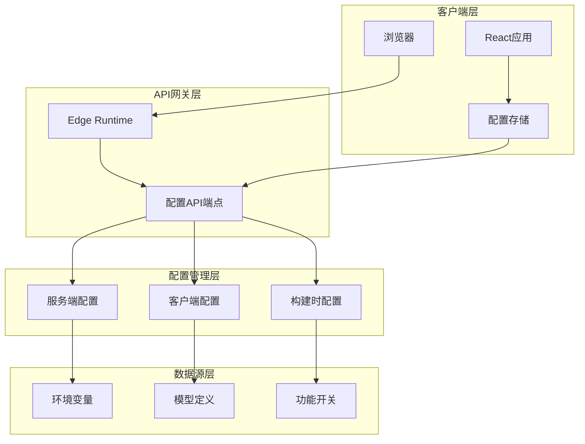

**图表来源**
- [app/api/config/route.ts](file://app/api/config/route.ts#L1-L32)
- [app/config/server.ts](file://app/config/server.ts#L1-L279)
- [app/config/client.ts](file://app/config/client.ts#L1-L28)

## 核心组件分析

### 配置API端点架构

配置管理API的核心实现位于`/app/api/config/route.ts`，采用简洁高效的函数式编程模式。

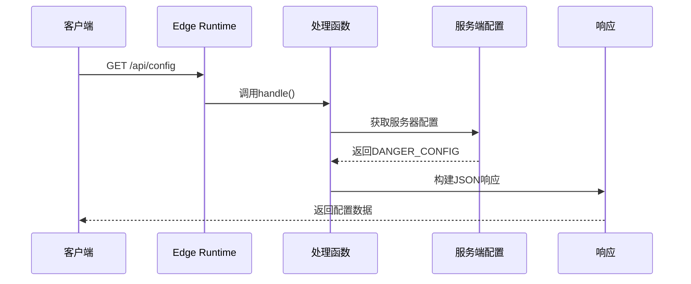

**图表来源**
- [app/api/config/route.ts](file://app/api/config/route.ts#L24-L26)

### 配置数据结构设计

配置系统采用分层的数据结构设计，确保信息的安全性和可维护性：

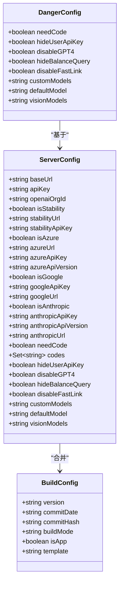

**图表来源**
- [app/api/config/route.ts](file://app/api/config/route.ts#L9-L18)
- [app/config/server.ts](file://app/config/server.ts#L132-L278)
- [app/config/build.ts](file://app/config/build.ts#L4-L46)

**节来源**
- [app/api/config/route.ts](file://app/api/config/route.ts#L1-L32)
- [app/config/server.ts](file://app/config/server.ts#L1-L279)
- [app/config/client.ts](file://app/config/client.ts#L1-L28)

## 配置管理API详解

### API端点规范

配置管理API提供标准化的HTTP接口，支持GET和POST方法：

| 属性 | 值 |
|------|-----|
| **端点路径** | `/api/config` |
| **HTTP方法** | `GET`, `POST` |
| **运行时环境** | `Edge Runtime` |
| **响应格式** | `application/json` |
| **缓存策略** | 支持ETag条件请求 |

### 响应数据结构

配置API返回的响应数据包含以下核心字段：

| 字段名 | 类型 | 描述 | 示例值 |
|--------|------|------|--------|
| `needCode` | `boolean` | 是否需要访问码验证 | `false` |
| `hideUserApiKey` | `boolean` | 是否隐藏用户API密钥输入 | `false` |
| `disableGPT4` | `boolean` | 是否禁用GPT-4模型 | `false` |
| `hideBalanceQuery` | `boolean` | 是否隐藏余额查询功能 | `true` |
| `disableFastLink` | `boolean` | 是否禁用快速链接解析 | `false` |
| `customModels` | `string` | 自定义模型配置字符串 | `"gpt-4,gpt-3.5-turbo"` |
| `defaultModel` | `string` | 默认使用的模型名称 | `"gpt-4o-mini"` |
| `visionModels` | `string` | 视觉模型列表 | `"gpt-4-vision,gpt-4o"` |

### 敏感信息过滤机制

配置系统实现了严格的安全过滤机制，确保敏感信息不会泄露：

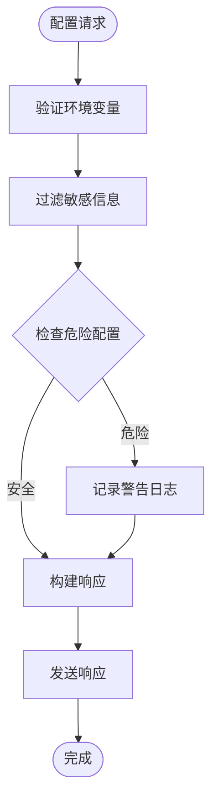

**图表来源**
- [app/api/config/route.ts](file://app/api/config/route.ts#L7-L18)

**节来源**
- [app/api/config/route.ts](file://app/api/config/route.ts#L24-L32)

## 服务端配置系统

### 环境变量注入机制

服务端配置系统通过环境变量注入机制实现灵活的配置管理：

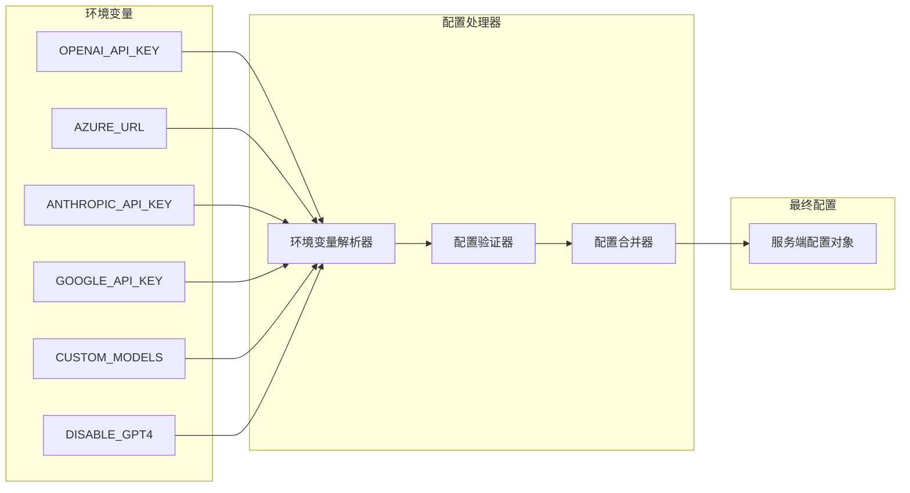

**图表来源**
- [app/config/server.ts](file://app/config/server.ts#L132-L278)

### 功能开关系统

配置系统提供了细粒度的功能开关控制：

| 开关名称 | 环境变量 | 默认值 | 描述 |
|----------|----------|--------|------|
| 访问码验证 | `CODE` | `""` | 启用或禁用访问码验证 |
| 用户API密钥隐藏 | `HIDE_USER_API_KEY` | `false` | 隐藏用户自定义API密钥输入 |
| GPT-4禁用 | `DISABLE_GPT4` | `false` | 禁用GPT-4系列模型 |
| 余额查询隐藏 | `ENABLE_BALANCE_QUERY` | `true` | 隐藏账户余额查询功能 |
| 快速链接禁用 | `DISABLE_FAST_LINK` | `false` | 禁用URL参数解析功能 |
| MCP功能启用 | `ENABLE_MCP` | `false` | 启用MCP（Model Context Protocol）功能 |

### 模型配置管理

服务端配置系统支持多种AI提供商的模型配置：

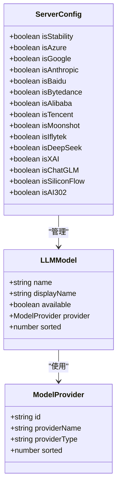

**图表来源**
- [app/config/server.ts](file://app/config/server.ts#L154-L170)
- [app/client/api.ts](file://app/client/api.ts#L93-L106)

**节来源**
- [app/config/server.ts](file://app/config/server.ts#L132-L278)

## 客户端配置系统

### 配置注入机制

客户端配置系统通过HTML meta标签实现配置的自动注入：

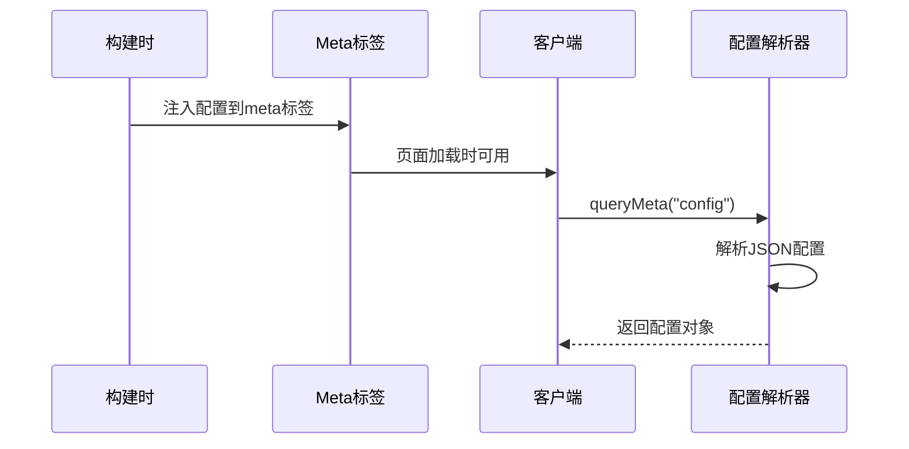

**图表来源**
- [app/config/client.ts](file://app/config/client.ts#L15-L27)

### 构建时配置

构建时配置系统负责在编译阶段生成静态配置信息：

| 配置项 | 来源 | 用途 |
|--------|------|------|
| 版本信息 | Git提交信息 | 应用版本追踪 |
| 构建模式 | `BUILD_MODE` | 生产/开发环境区分 |
| 应用标识 | `BUILD_APP` | 桌面应用检测 |
| 输入模板 | `DEFAULT_INPUT_TEMPLATE` | 用户输入预处理 |

**节来源**
- [app/config/client.ts](file://app/config/client.ts#L1-L28)
- [app/config/build.ts](file://app/config/build.ts#L1-L47)

## 模型管理系统

### 默认模型定义

系统预定义了丰富的默认模型集合，涵盖主要的AI提供商：

```mermaid
graph TB
subgraph "OpenAI模型"
GPT4[GPT-4系列]
GPT35[GPT-3.5系列]
GPT4Mini[gpt-4o-mini]
end
subgraph "Azure模型"
AzureGPT4[Azure GPT-4]
AzureGPT35[Azure GPT-3.5]
end
subgraph "Google模型"
Gemini[Gemini系列]
PaLM[PaLM系列]
end
subgraph "Anthropic模型"
Claude[Claude系列]
ClaudeSonnet[Claude Sonnet]
end
subgraph "其他提供商"
Baidu[Baidu ERNIE]
Alibaba[Alibaba Qwen]
Tencent[Tencent Hunyuan]
Moonshot[Moonshot]
DeepSeek[DeepSeek]
end
DEFAULT_MODELS[DEFAULT_MODELS] --> GPT4
DEFAULT_MODELS --> GPT35
DEFAULT_MODELS --> GPT4Mini
DEFAULT_MODELS --> AzureGPT4
DEFAULT_MODELS --> AzureGPT35
DEFAULT_MODELS --> Gemini
DEFAULT_MODELS --> PaLM
DEFAULT_MODELS --> Claude
DEFAULT_MODELS --> ClaudeSonnet
DEFAULT_MODELS --> Baidu
DEFAULT_MODELS --> Alibaba
DEFAULT_MODELS --> Tencent
DEFAULT_MODELS --> Moonshot
DEFAULT_MODELS --> DeepSeek
```

**图表来源**
- [app/constant.ts](file://app/constant.ts#L746-L912)

### 模型可用性管理

模型管理系统实现了动态的可用性控制机制：

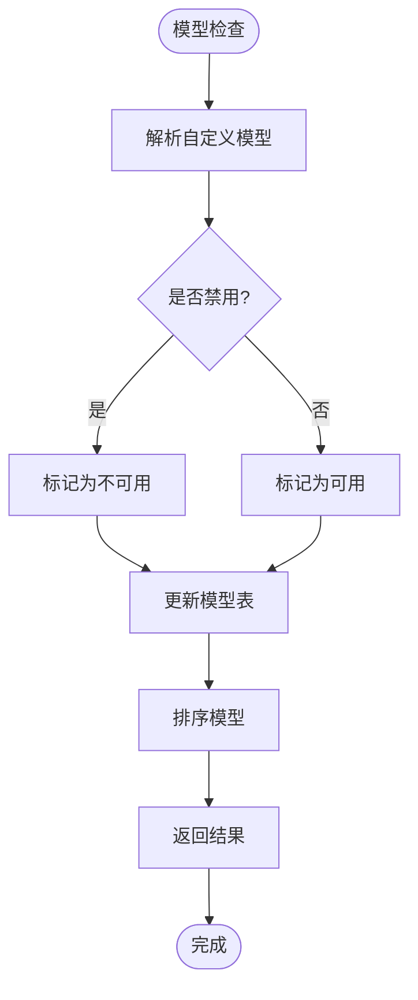

**图表来源**
- [app/utils/model.ts](file://app/utils/model.ts#L84-L133)

**节来源**
- [app/constant.ts](file://app/constant.ts#L746-L912)
- [app/utils/model.ts](file://app/utils/model.ts#L1-L211)

## 缓存策略与性能优化

### ETag支持

配置API支持基于ETag的条件请求处理，实现高效的缓存控制：

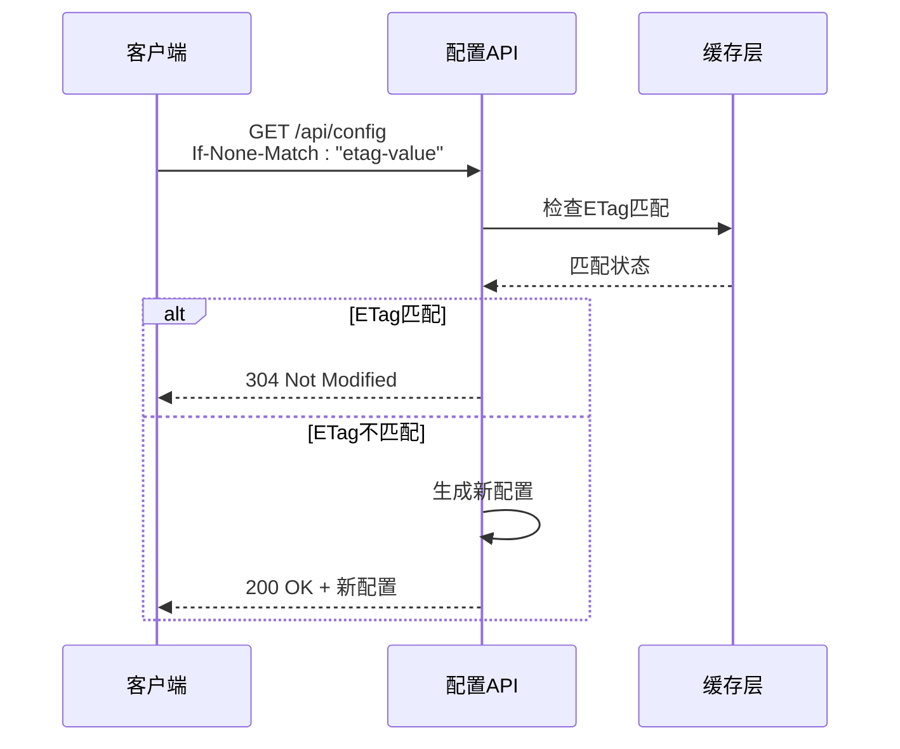

### 条件请求处理

系统实现了智能的条件请求处理机制，减少不必要的网络传输：

| 请求头 | 用途 | 处理逻辑 |
|--------|------|----------|
| `If-None-Match` | 检查资源是否已修改 | 如果ETag匹配，返回304 |
| `If-Modified-Since` | 基于时间戳的缓存控制 | 与ETag配合使用 |
| `Cache-Control` | 缓存指令 | 控制缓存行为 |

## 安全机制与敏感信息保护

### 危险配置过滤

配置系统实现了严格的危险配置过滤机制：

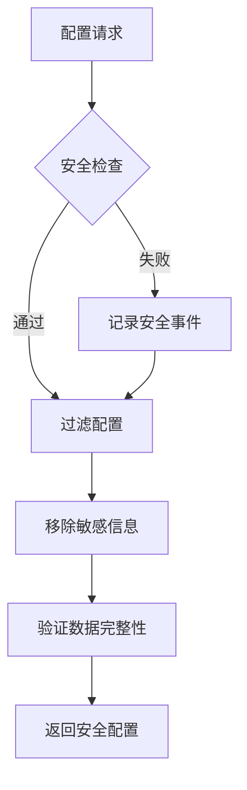

**图表来源**
- [app/api/config/route.ts](file://app/api/config/route.ts#L7-L18)

### 敏感信息保护措施

| 保护级别 | 保护对象 | 实现方式 |
|----------|----------|----------|
| **高** | API密钥 | 完全移除，不包含在响应中 |
| **中** | 访问码 | MD5哈希化存储 |
| **低** | URL地址 | 明文传输，但无敏感内容 |
| **无** | 功能开关 | 公开配置信息 |

**节来源**
- [app/api/config/route.ts](file://app/api/config/route.ts#L7-L18)

## 前端配置存储集成

### 配置存储架构

前端配置存储系统采用分层架构，实现配置的持久化和同步：

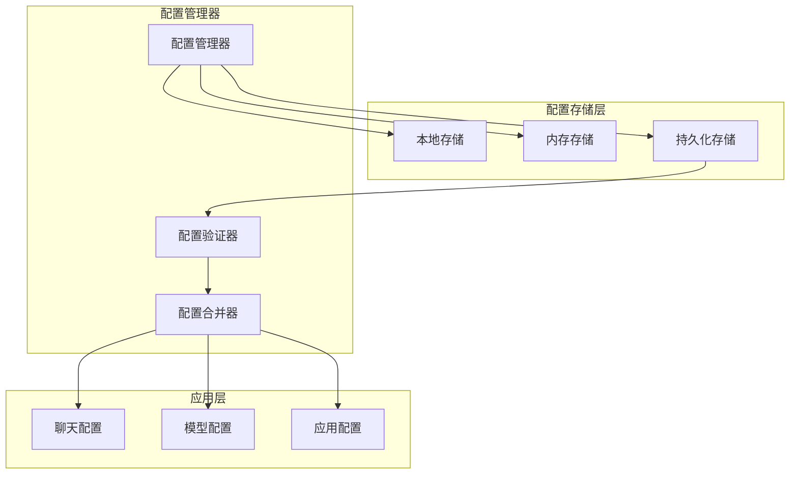

**图表来源**
- [app/store/config.ts](file://app/store/config.ts#L164-L262)

### 动态配置加载

前端通过配置存储实现动态配置加载和实时更新：

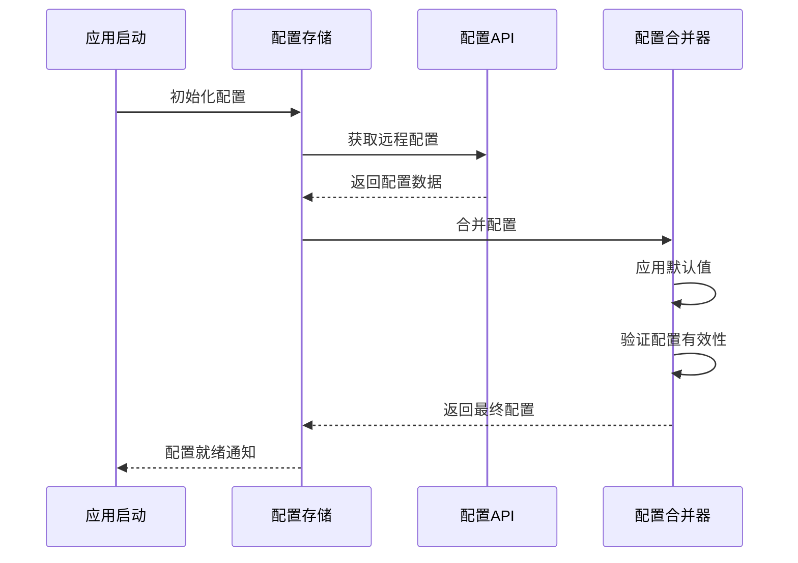

**图表来源**
- [app/store/config.ts](file://app/store/config.ts#L164-L262)

**节来源**
- [app/store/config.ts](file://app/store/config.ts#L1-L262)

## 响应示例与最佳实践

### 完整配置响应示例

以下是包含多个提供商的完整配置响应示例：

```json
{
  "needCode": false,
  "hideUserApiKey": false,
  "disableGPT4": false,
  "hideBalanceQuery": true,
  "disableFastLink": false,
  "customModels": "gpt-4,gpt-3.5-turbo",
  "defaultModel": "gpt-4o-mini",
  "visionModels": "gpt-4-vision,gpt-4o",
  "baseUrl": "https://api.openai.com",
  "apiKey": "sk-...",
  "openaiOrgId": null,
  "isStability": false,
  "stabilityUrl": null,
  "stabilityApiKey": null,
  "isAzure": true,
  "azureUrl": "https://your-resource.openai.azure.com",
  "azureApiKey": "your-azure-key",
  "azureApiVersion": "2024-02-15-preview",
  "isGoogle": false,
  "googleApiKey": null,
  "googleUrl": null,
  "isAnthropic": true,
  "anthropicApiKey": "your-anthropic-key",
  "anthropicApiVersion": "2023-06-01",
  "anthropicUrl": "https://api.anthropic.com",
  "isBaidu": false,
  "baiduUrl": null,
  "baiduApiKey": null,
  "baiduSecretKey": null,
  "isBytedance": false,
  "bytedanceApiKey": null,
  "bytedanceUrl": null,
  "isAlibaba": false,
  "alibabaUrl": null,
  "alibabaApiKey": null,
  "isTencent": false,
  "tencentUrl": null,
  "tencentSecretKey": null,
  "tencentSecretId": null,
  "isMoonshot": false,
  "moonshotUrl": null,
  "moonshotApiKey": null,
  "isIflytek": false,
  "iflytekUrl": null,
  "iflytekApiKey": null,
  "iflytekApiSecret": null,
  "isDeepSeek": false,
  "deepseekUrl": null,
  "deepseekApiKey": null,
  "isXAI": false,
  "xaiUrl": null,
  "xaiApiKey": null,
  "isChatGLM": false,
  "chatglmUrl": null,
  "chatglmApiKey": null,
  "isSiliconFlow": false,
  "siliconFlowUrl": null,
  "siliconFlowApiKey": null,
  "isAI302": false,
  "ai302Url": null,
  "ai302ApiKey": null,
  "gtmId": null,
  "gaId": "G-89WN60ZK2E",
  "codes": [],
  "proxyUrl": null,
  "isVercel": false,
  "allowedWebDavEndpoints": []
}
```

### 最佳实践建议

| 实践领域 | 建议 | 原因 |
|----------|------|------|
| **配置更新** | 使用版本控制 | 确保配置变更可追溯 |
| **敏感信息** | 环境变量管理 | 避免硬编码敏感信息 |
| **性能优化** | 启用缓存 | 减少重复请求 |
| **安全性** | 定期审计配置 | 及时发现潜在风险 |
| **监控** | 配置变更日志 | 便于问题排查 |

## 故障排除指南

### 常见问题诊断

| 问题症状 | 可能原因 | 解决方案 |
|----------|----------|----------|
| 配置加载失败 | 网络连接问题 | 检查网络连接和防火墙设置 |
| 模型不可用 | 配置错误 | 验证环境变量和模型配置 |
| 缓存问题 | ETag不匹配 | 清除浏览器缓存或强制刷新 |
| 权限错误 | 访问码验证失败 | 检查CODE环境变量设置 |

### 调试工具和技巧

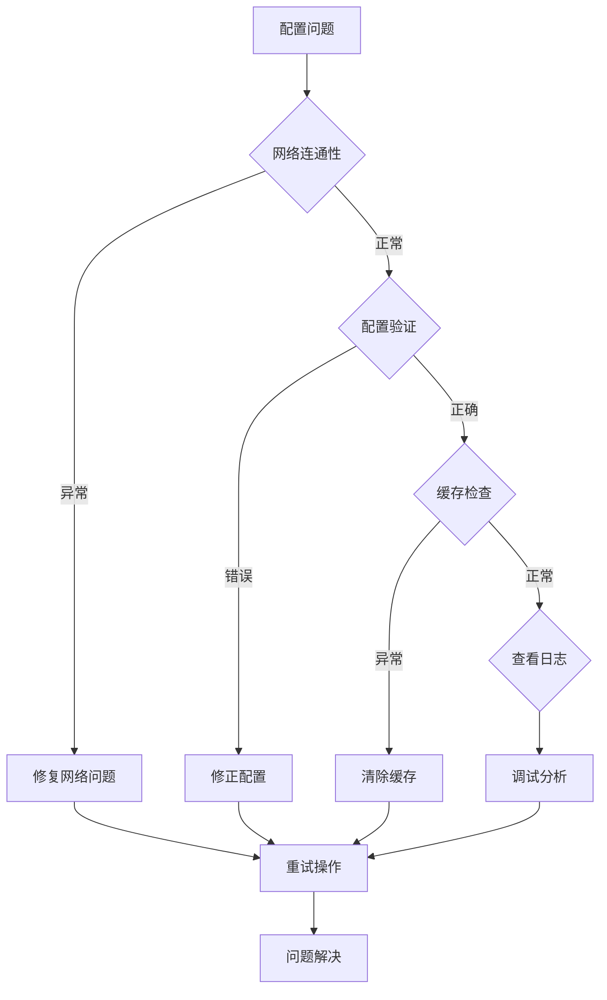

### 性能监控指标

| 监控指标 | 正常范围 | 告警阈值 | 监控方法 |
|----------|----------|----------|----------|
| 配置加载时间 | < 200ms | > 500ms | 浏览器开发者工具 |
| API响应状态码 | 200 | 非2xx | 网络面板监控 |
| 缓存命中率 | > 80% | < 50% | 应用日志分析 |
| 错误率 | < 1% | > 5% | 错误监控系统 |

**节来源**
- [app/api/config/route.ts](file://app/api/config/route.ts#L1-L32)

## 结论

配置管理API作为ChatGPT-Next-Web项目的核心组件，通过精心设计的架构实现了安全、高效、可扩展的配置管理能力。其独特的服务端与客户端分离设计、严格的敏感信息保护机制、以及灵活的模型管理系统，为现代Web应用提供了优秀的配置管理解决方案。

通过本文档的深入分析，开发者可以更好地理解配置管理API的工作原理，掌握最佳实践，并在实际项目中有效应用这些技术。随着项目的持续发展，配置管理API将继续演进，为用户提供更加丰富和便捷的配置管理体验。