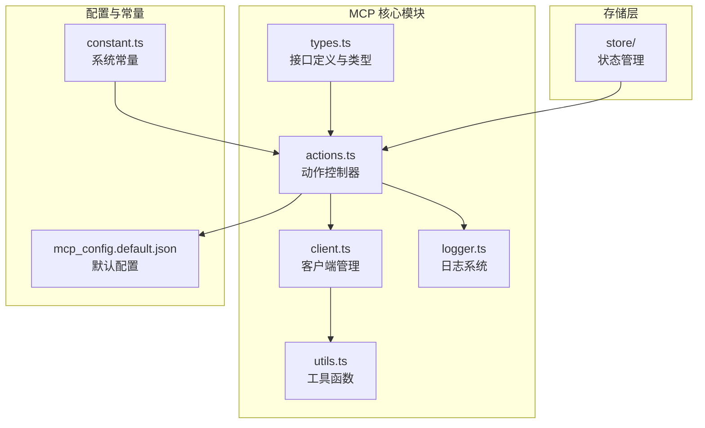
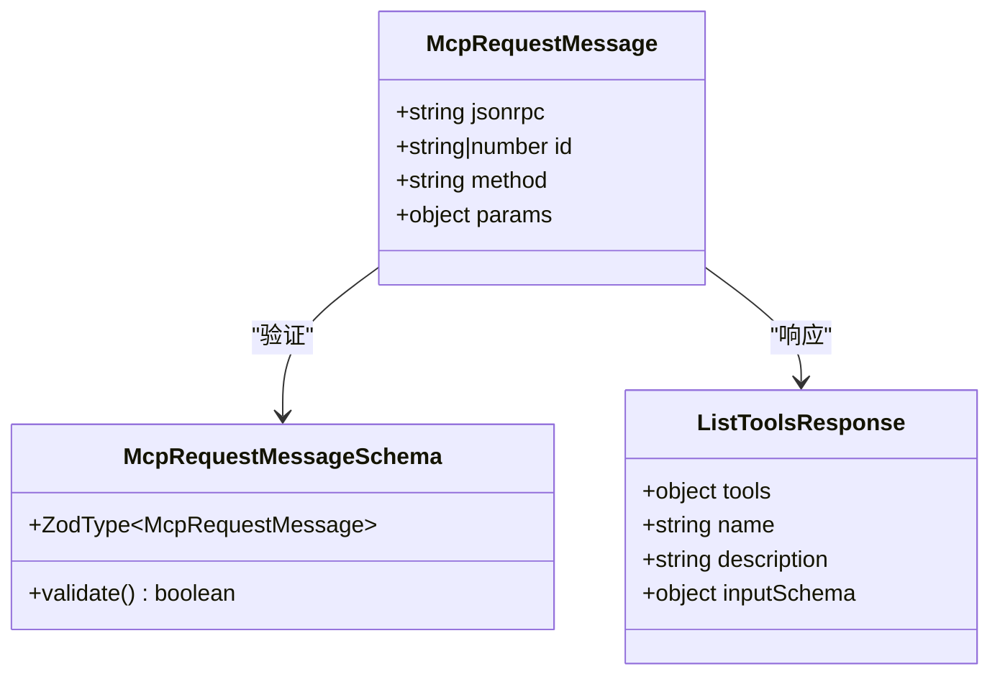
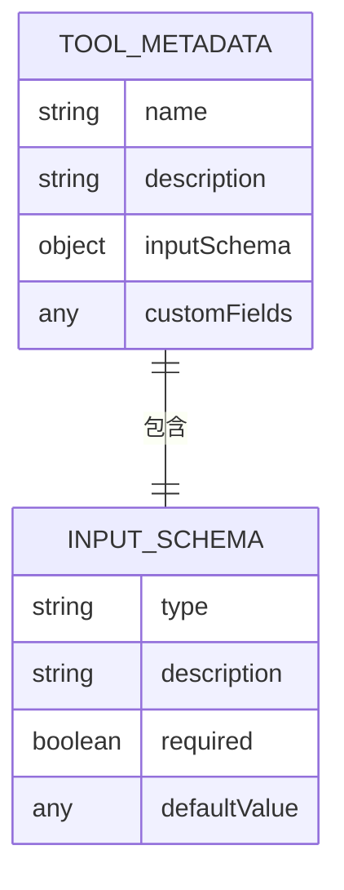
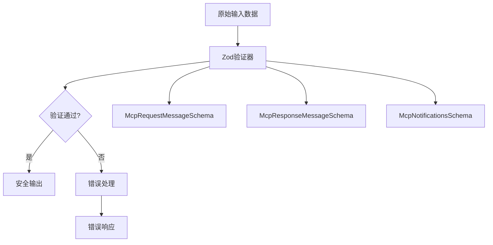
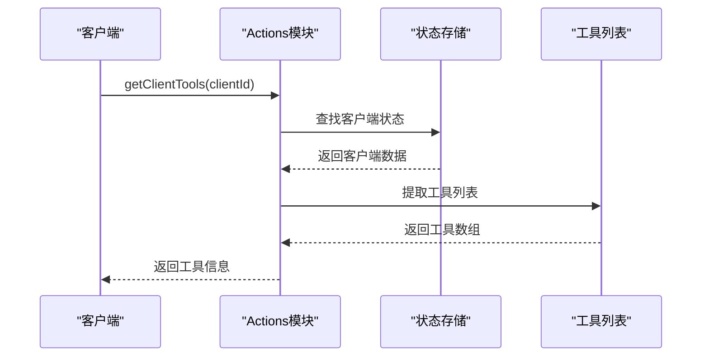
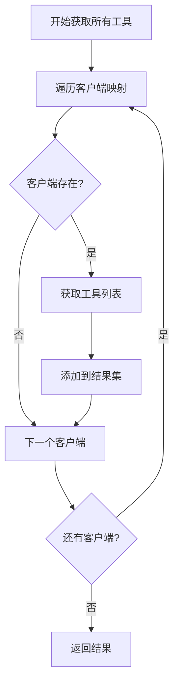
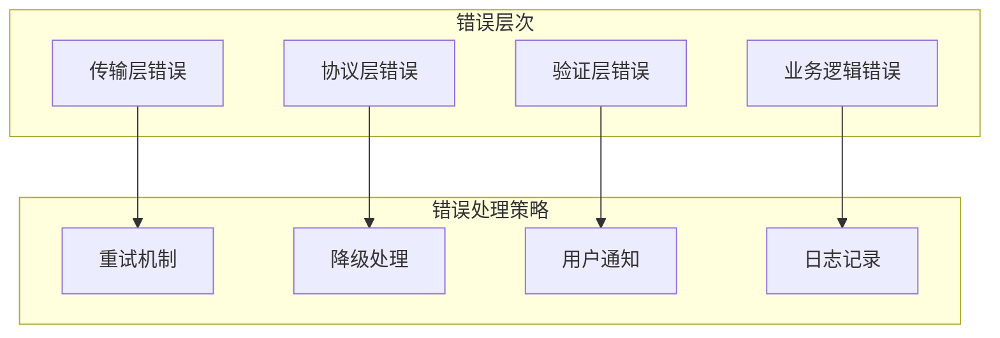
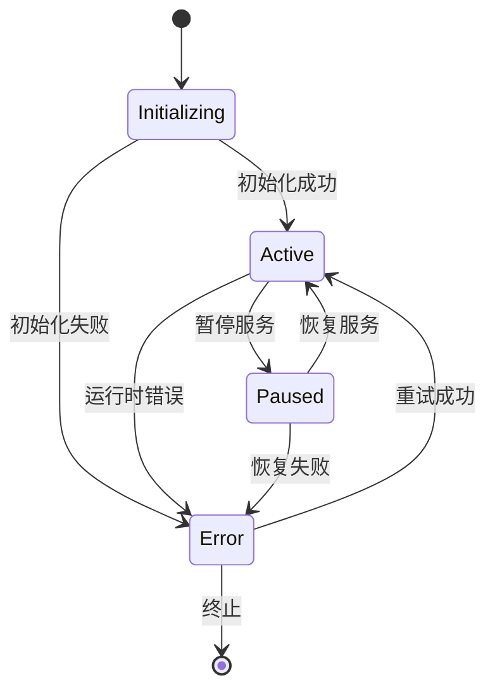

# MCP动作定义与元数据

<cite>
**本文档引用的文件**
- [types.ts](file://app/mcp/types.ts)
- [actions.ts](file://app/mcp/actions.ts)
- [client.ts](file://app/mcp/client.ts)
- [utils.ts](file://app/mcp/utils.ts)
- [logger.ts](file://app/mcp/logger.ts)
- [mcp_config.default.json](file://app/mcp/mcp_config.default.json)
- [constant.ts](file://app/constant.ts)
</cite>

## 目录
1. [简介](#简介)
2. [项目结构概览](#项目结构概览)
3. [核心接口设计](#核心接口设计)
4. [动作元数据机制](#动作元数据机制)
5. [Zod Schema验证系统](#zod-schema验证系统)
6. [工具列表获取流程](#工具列表获取流程)
7. [错误处理机制](#错误处理机制)
8. [客户端行为影响](#客户端行为影响)
9. [实际应用示例](#实际应用示例)
10. [最佳实践与优化建议](#最佳实践与优化建议)

## 简介

Model Context Protocol (MCP) 是一个标准化协议，用于在AI助手和外部工具之间建立通信桥梁。在ChatGPT-Next-Web项目中，MCP系统提供了强大的工具扩展能力，允许用户通过自然语言调用各种外部服务和功能。

本文档详细分析了MCP动作定义机制的核心组件，包括types.ts中的接口设计、Zod Schema验证系统、工具元数据管理以及客户端行为控制机制。

## 项目结构概览

MCP系统的核心文件组织如下：



**图表来源**
- [types.ts](file://app/mcp/types.ts#L1-L181)
- [actions.ts](file://app/mcp/actions.ts#L1-L386)
- [client.ts](file://app/mcp/client.ts#L1-L56)

**章节来源**
- [types.ts](file://app/mcp/types.ts#L1-L181)
- [actions.ts](file://app/mcp/actions.ts#L1-L386)
- [client.ts](file://app/mcp/client.ts#L1-L56)

## 核心接口设计

### McpRequestMessage 接口

`McpRequestMessage`是MCP通信的核心消息格式，定义了标准的JSON-RPC 2.0消息结构：



**图表来源**
- [types.ts](file://app/mcp/types.ts#L6-L20)
- [types.ts](file://app/mcp/types.ts#L67-L74)

#### 字段详解

| 字段名 | 类型 | 必需性 | 描述 |
|--------|------|--------|------|
| `jsonrpc` | `"2.0"` | 可选 | JSON-RPC 协议版本号 |
| `id` | `string \| number` | 可选 | 请求标识符，用于匹配响应 |
| `method` | `string` | 必需 | 调用的方法名称，通常为"tools/call" |
| `params` | `object` | 可选 | 方法参数对象 |

### McpResponseMessage 接口

响应消息结构支持成功结果和错误处理：

| 字段名 | 类型 | 描述 |
|--------|------|------|
| `jsonrpc` | `"2.0"` | JSON-RPC 协议版本号 |
| `id` | `string \| number` | 响应对应的请求ID |
| `result` | `object` | 成功执行的结果 |
| `error` | `object` | 错误信息对象 |

**章节来源**
- [types.ts](file://app/mcp/types.ts#L6-L48)

## 动作元数据机制

### 工具元数据结构

每个MCP工具都包含以下关键元数据：



**图表来源**
- [types.ts](file://app/mcp/types.ts#L67-L74)

#### 元数据字段说明

| 元数据字段 | 类型 | 必需性 | 作用 |
|------------|------|--------|------|
| `name` | `string` | 可选 | 工具的唯一标识名称 |
| `description` | `string` | 可选 | 工具的功能描述 |
| `inputSchema` | `object` | 可选 | 输入参数的JSON Schema定义 |

### 元数据在系统中的作用

1. **客户端行为控制**：元数据决定了工具在前端界面中的显示方式和交互逻辑
2. **参数验证**：通过inputSchema确保传入参数的正确性
3. **动态UI生成**：根据元数据自动生成表单和输入验证规则
4. **帮助文档生成**：自动生成工具使用说明和参数文档

**章节来源**
- [types.ts](file://app/mcp/types.ts#L67-L74)

## Zod Schema验证系统

### 验证器定义

MCP系统使用Zod库构建强类型的验证系统：



**图表来源**
- [types.ts](file://app/mcp/types.ts#L15-L20)
- [types.ts](file://app/mcp/types.ts#L35-L48)

### 验证流程

1. **请求验证**：对传入的McpRequestMessage进行类型检查
2. **参数验证**：根据inputSchema验证方法参数
3. **响应验证**：确保返回的消息符合规范
4. **错误捕获**：捕获验证失败并提供详细错误信息

**章节来源**
- [types.ts](file://app/mcp/types.ts#L15-L48)

## 工具列表获取流程

### getClientTools 函数

`getClientTools`函数负责从已连接的MCP客户端获取可用工具列表：



**图表来源**
- [actions.ts](file://app/mcp/actions.ts#L77-L80)

### getAllTools 函数

`getAllTools`函数遍历所有客户端获取完整的工具集合：



**图表来源**
- [actions.ts](file://app/mcp/actions.ts#L89-L99)

### 客户端状态管理

系统维护三种客户端状态：

| 状态类型 | 特征 | 数据结构 |
|----------|------|----------|
| `McpInitializingClient` | 正在初始化 | `{client: null, tools: null, errorMsg: null}` |
| `McpActiveClient` | 连接正常 | `{client: Client, tools: ListToolsResponse, errorMsg: null}` |
| `McpErrorClient` | 发生错误 | `{client: null, tools: null, errorMsg: string}` |

**章节来源**
- [actions.ts](file://app/mcp/actions.ts#L77-L99)
- [types.ts](file://app/mcp/types.ts#L76-L97)

## 错误处理机制

### errorMsg 设计考量

MCP系统的错误处理采用分层策略：



### 错误恢复机制

1. **自动重连**：网络中断时自动尝试重新连接
2. **状态隔离**：单个客户端错误不影响其他客户端
3. **渐进式降级**：部分功能失效时保持核心功能可用
4. **详细日志**：记录完整的错误堆栈和上下文信息

**章节来源**
- [actions.ts](file://app/mcp/actions.ts#L131-L138)
- [actions.ts](file://app/mcp/actions.ts#L260-L278)
- [logger.ts](file://app/mcp/logger.ts#L1-L66)

## 客户端行为影响

### 动作定义对客户端的影响

MCP动作定义直接影响客户端的行为模式：



### 客户端生命周期管理

1. **初始化阶段**：建立连接并获取可用工具列表
2. **运行阶段**：处理用户请求和工具调用
3. **维护阶段**：监控状态和处理异常
4. **终止阶段**：清理资源和断开连接

**章节来源**
- [actions.ts](file://app/mcp/actions.ts#L101-L139)
- [actions.ts](file://app/mcp/actions.ts#L231-L278)

## 实际应用示例

### MCP JSON格式解析

系统支持特定格式的MCP JSON代码块：

```typescript
// 示例：MCP请求格式
const mcpRequestExample = `
\`\`\`json:mcp:filesystem
{
  "method": "tools/call",
  "params": {
    "name": "list_allowed_directories",
    "arguments": {}
  }
}
\`\`\`
`;

// 示例：MCP响应格式
const mcpResponseExample = `
\`\`\`json:mcp-response:filesystem
{
  "result": {
    "directories": ["/home/user", "/tmp"]
  }
}
\`\`\`
`;
```

### 系统提示模板

MCP系统使用专门的提示模板引导AI正确使用工具：

| 模板类型 | 用途 | 关键规则 |
|----------|------|----------|
| `MCP_SYSTEM_TEMPLATE` | 主要系统提示 | 定义工具使用原则和交互流程 |
| `MCP_TOOLS_TEMPLATE` | 工具列表模板 | 格式化显示可用工具信息 |
| `MCP_EXAMPLE_TEMPLATE` | 使用示例 | 提供正确的调用格式示例 |

**章节来源**
- [utils.ts](file://app/mcp/utils.ts#L1-L12)
- [constant.ts](file://app/constant.ts#L299-L421)

## 最佳实践与优化建议

### 性能优化策略

1. **延迟加载**：按需初始化MCP客户端，避免启动时全部加载
2. **连接池管理**：复用客户端连接减少资源消耗
3. **缓存机制**：缓存工具元数据和配置信息
4. **异步处理**：使用异步操作避免阻塞主线程

### 安全考虑

1. **参数验证**：严格验证所有输入参数
2. **权限控制**：限制工具访问范围和功能
3. **资源限制**：设置合理的超时和配额限制
4. **审计日志**：记录所有工具调用和错误信息

### 开发建议

1. **模块化设计**：保持各组件职责单一明确
2. **错误边界**：合理设置错误处理边界
3. **测试覆盖**：确保核心功能的充分测试
4. **文档维护**：及时更新API文档和使用指南

### 扩展性考虑

1. **插件架构**：支持动态加载新的MCP服务器
2. **配置热更新**：支持运行时修改配置
3. **多语言支持**：国际化和本地化支持
4. **监控集成**：与系统监控和告警系统集成

**章节来源**
- [actions.ts](file://app/mcp/actions.ts#L141-L161)
- [actions.ts](file://app/mcp/actions.ts#L310-L334)