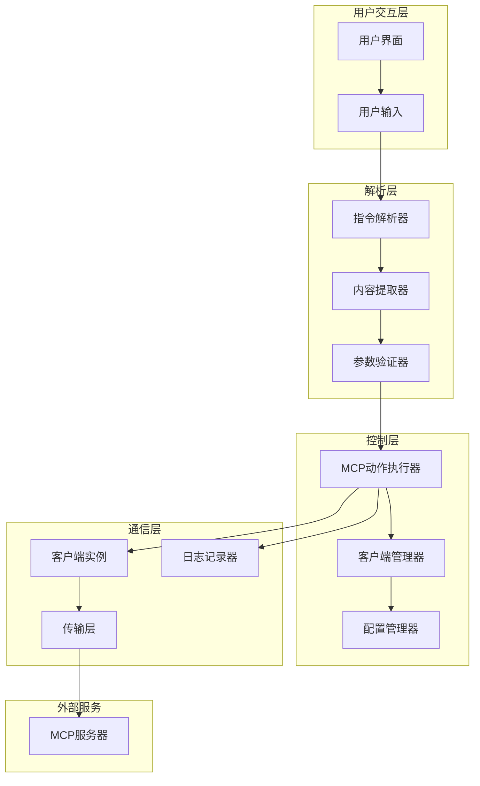
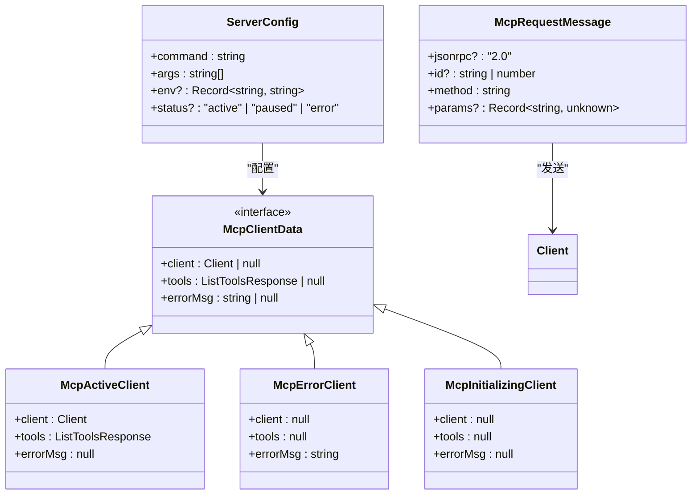
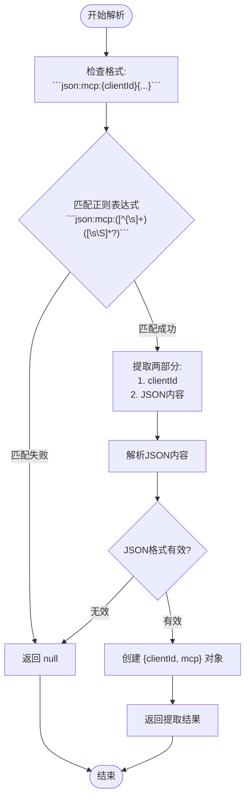
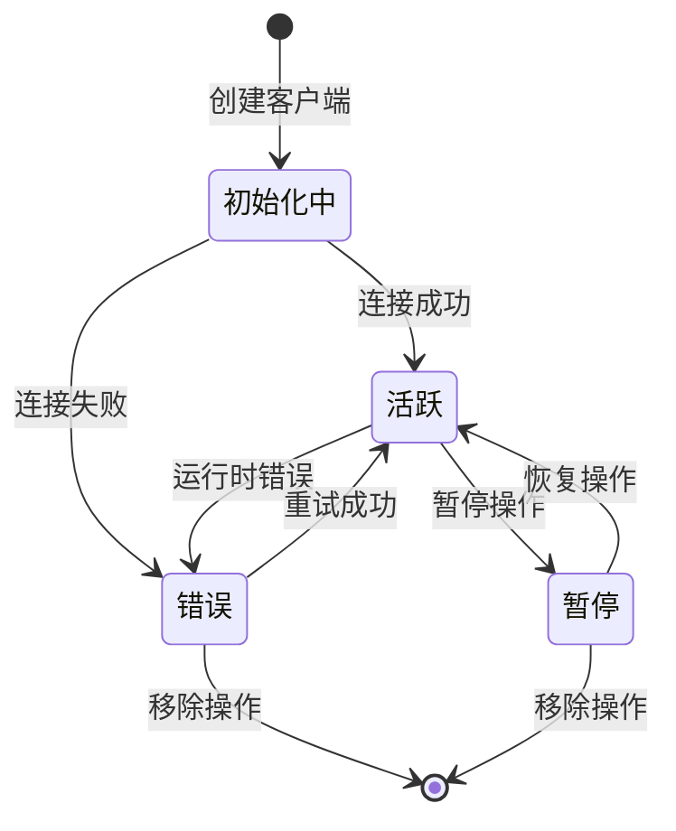
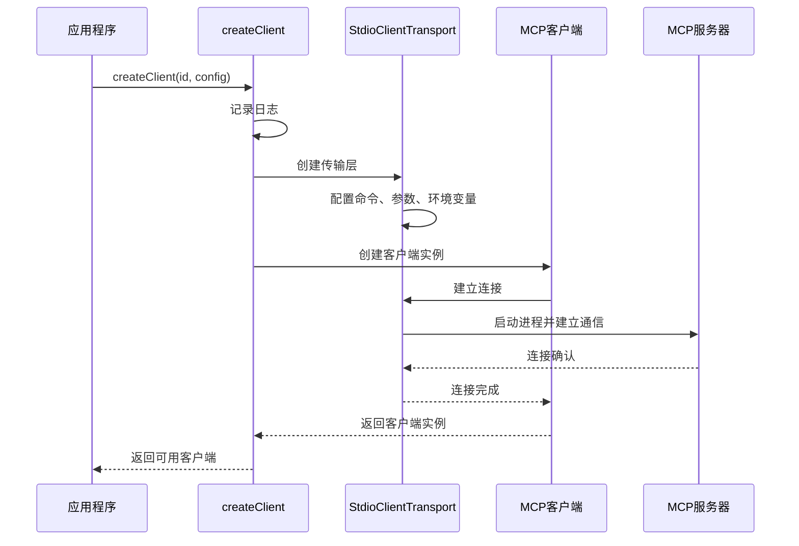
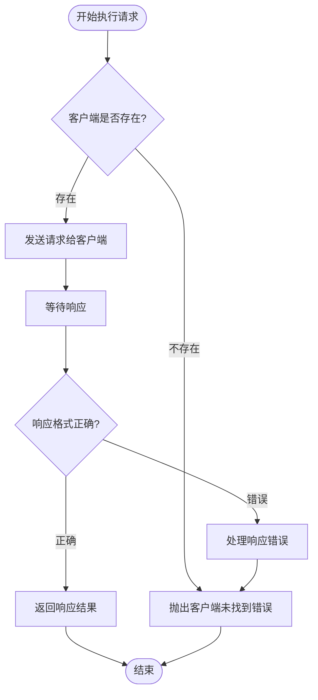
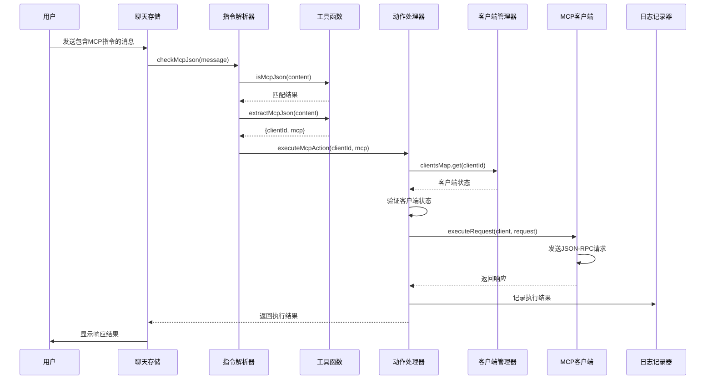
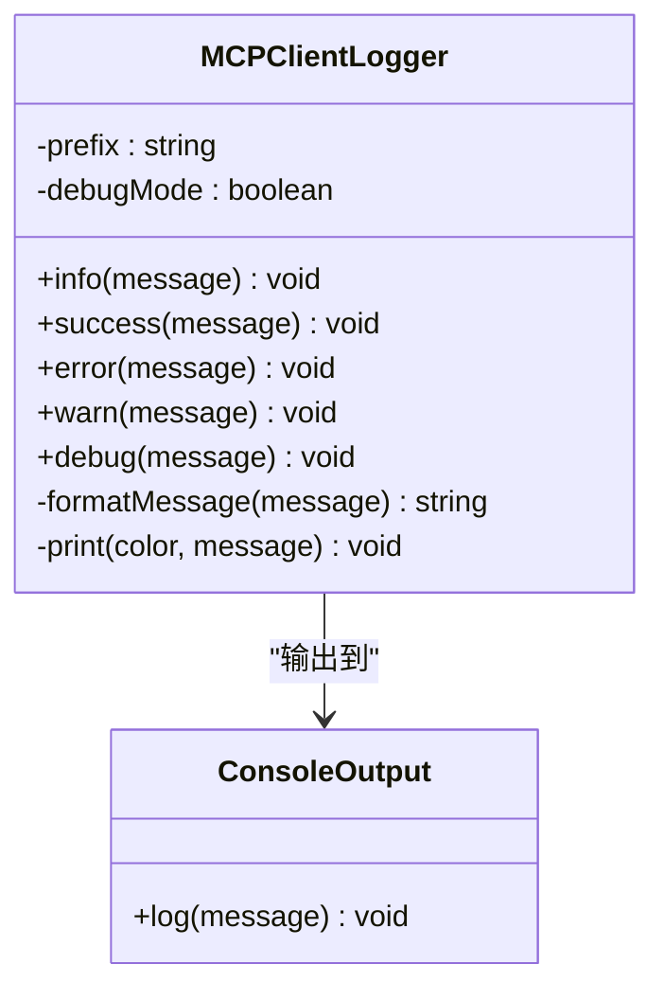
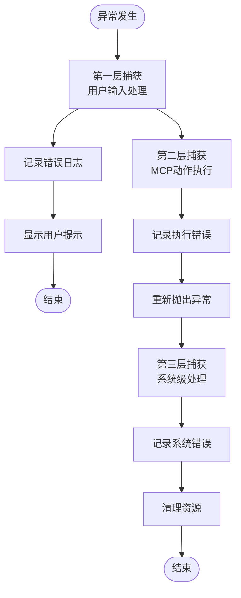

# MCP动作执行流程

<cite>
**本文档引用的文件**
- [app/mcp/actions.ts](file://app/mcp/actions.ts)
- [app/mcp/client.ts](file://app/mcp/client.ts)
- [app/mcp/utils.ts](file://app/mcp/utils.ts)
- [app/mcp/logger.ts](file://app/mcp/logger.ts)
- [app/mcp/types.ts](file://app/mcp/types.ts)
- [app/store/chat.ts](file://app/store/chat.ts)
- [app/constant.ts](file://app/constant.ts)
- [app/mcp/mcp_config.default.json](file://app/mcp/mcp_config.default.json)
</cite>

## 目录
1. [概述](#概述)
2. [核心组件架构](#核心组件架构)
3. [MCP指令提取机制](#mcp指令提取机制)
4. [客户端管理与连接](#客户端管理与连接)
5. [McpRequestMessage构建与传输](#mcprequestmessage构建与传输)
6. [执行时序分析](#执行时序分析)
7. [异常处理与日志记录](#异常处理与日志记录)
8. [最佳实践指南](#最佳实践指南)
9. [总结](#总结)

## 概述

MCP（Model Context Protocol）动作执行机制是ChatGPT-Next-Web中实现外部工具集成的核心功能。该机制通过`executeMcpAction`函数为核心，实现了从用户输入解析到远程客户端调用的完整流程。系统采用基于Map的数据结构管理多个MCP客户端，支持动态添加、移除和状态监控。

## 核心组件架构

### 系统架构概览



**图表来源**
- [app/mcp/actions.ts](file://app/mcp/actions.ts#L336-L352)
- [app/mcp/client.ts](file://app/mcp/client.ts#L9-L55)
- [app/mcp/utils.ts](file://app/mcp/utils.ts#L1-L11)

### 核心数据结构

系统使用以下核心数据结构来管理MCP客户端和状态：



**图表来源**
- [app/mcp/types.ts](file://app/mcp/types.ts#L76-L97)
- [app/mcp/types.ts](file://app/mcp/types.ts#L113-L117)
- [app/mcp/types.ts](file://app/mcp/types.ts#L6-L13)

**章节来源**
- [app/mcp/types.ts](file://app/mcp/types.ts#L1-L181)
- [app/mcp/actions.ts](file://app/mcp/actions.ts#L24-L25)

## MCP指令提取机制

### 正则表达式匹配逻辑

系统使用专门的正则表达式来识别和提取MCP指令格式：



**图表来源**
- [app/mcp/utils.ts](file://app/mcp/utils.ts#L1-L11)

### 提取函数实现细节

提取函数的工作原理如下：

1. **格式验证**：使用正则表达式`/```json:mcp:([^{\s]+)([\s\S]*?)```/`验证输入格式
2. **分组捕获**：第一组捕获`clientId`，第二组捕获JSON内容
3. **JSON解析**：对提取的JSON字符串进行安全解析
4. **结果封装**：返回包含`clientId`和解析后对象的结构

**章节来源**
- [app/mcp/utils.ts](file://app/mcp/utils.ts#L1-L11)

## 客户端管理与连接

### 客户端生命周期管理



**图表来源**
- [app/mcp/actions.ts](file://app/mcp/actions.ts#L101-L139)
- [app/mcp/actions.ts](file://app/mcp/actions.ts#L231-L278)

### createClient函数工作流程

客户端创建过程包含以下关键步骤：



**图表来源**
- [app/mcp/client.ts](file://app/mcp/client.ts#L9-L38)

### 客户端状态监控

系统维护一个全局的`clientsMap`来跟踪所有客户端的状态：

| 状态 | 描述 | 处理方式 |
|------|------|----------|
| `active` | 客户端正常运行 | 直接执行请求 |
| `paused` | 客户端被暂停 | 跳过初始化，不执行请求 |
| `error` | 客户端发生错误 | 记录错误信息，不执行请求 |
| `initializing` | 客户端正在初始化 | 设置为null状态 |

**章节来源**
- [app/mcp/actions.ts](file://app/mcp/actions.ts#L26-L75)
- [app/mcp/client.ts](file://app/mcp/client.ts#L9-L55)

## McpRequestMessage构建与传输

### 请求消息结构规范

McpRequestMessage遵循JSON-RPC 2.0协议规范，具有以下结构：

```mermaid
classDiagram
class McpRequestMessage {
+jsonrpc? : "2.0"
+id? : string | number
+method : "tools/call" | string
+params? : {
[key : string] : unknown
}
}
class McpResponseMessage {
+jsonrpc? : "2.0"
+id? : string | number
+result? : {
[key : string] : unknown
}
+error? : {
code : number
message : string
data? : unknown
}
}
class ZodSchema {
+validate(data) boolean
+parse(data) T
}
McpRequestMessage --> ZodSchema : "验证"
McpRequestMessage --> Client : "发送"
Client --> McpResponseMessage : "接收"
```

**图表来源**
- [app/mcp/types.ts](file://app/mcp/types.ts#L6-L13)
- [app/mcp/types.ts](file://app/mcp/types.ts#L22-L33)

### executeRequest函数实现

executeRequest函数负责将McpRequestMessage发送给指定的MCP客户端：



**图表来源**
- [app/mcp/client.ts](file://app/mcp/client.ts#L50-L55)

**章节来源**
- [app/mcp/types.ts](file://app/mcp/types.ts#L6-L48)
- [app/mcp/client.ts](file://app/mcp/client.ts#L50-L55)

## 执行时序分析

### 完整执行流程时序图



**图表来源**
- [app/store/chat.ts](file://app/store/chat.ts#L827-L855)
- [app/mcp/actions.ts](file://app/mcp/actions.ts#L336-L352)
- [app/mcp/utils.ts](file://app/mcp/utils.ts#L5-L11)

### 关键执行节点

1. **用户输入阶段**：用户在聊天界面输入包含MCP指令的消息
2. **指令检测阶段**：系统自动检测消息中是否包含MCP格式的代码块
3. **指令提取阶段**：使用正则表达式提取clientId和JSON内容
4. **参数验证阶段**：验证提取的MCP请求格式是否正确
5. **客户端查找阶段**：通过clientsMap查找对应的MCP客户端
6. **请求执行阶段**：调用executeRequest发送JSON-RPC请求
7. **响应处理阶段**：处理MCP服务器的响应并格式化返回
8. **结果展示阶段**：将执行结果以MCP响应格式返回给用户

**章节来源**
- [app/store/chat.ts](file://app/store/chat.ts#L827-L855)
- [app/mcp/actions.ts](file://app/mcp/actions.ts#L336-L352)

## 异常处理与日志记录

### MCPClientLogger类设计

系统使用专门的日志记录器来跟踪MCP操作的各个阶段：



**图表来源**
- [app/mcp/logger.ts](file://app/mcp/logger.ts#L12-L66)

### 异常传播机制

系统采用多层次的异常处理策略：



**图表来源**
- [app/store/chat.ts](file://app/store/chat.ts#L836-L850)
- [app/mcp/actions.ts](file://app/mcp/actions.ts#L341-L351)

### 日志记录最佳实践

1. **分级日志**：使用不同颜色和级别区分信息、警告、错误等
2. **上下文信息**：每个日志条目都包含客户端ID和操作类型
3. **调试模式**：支持可选的调试模式输出详细信息
4. **格式化输出**：自动将对象转换为JSON格式便于阅读
5. **异步处理**：日志记录不影响主要业务流程

**章节来源**
- [app/mcp/logger.ts](file://app/mcp/logger.ts#L1-L66)
- [app/mcp/actions.ts](file://app/mcp/actions.ts#L341-L351)

## 最佳实践指南

### MCP指令格式规范

根据系统文档，MCP指令应严格遵循以下格式：

```
```json:mcp:{clientId}
{
  "method": "tools/call",
  "params": {
    "name": "tool_name",
    "arguments": {
      "param1": "value1",
      "param2": "value2"
    }
  }
}
```
```

### 参数验证建议

1. **必需字段验证**：
   - `method`必须为`"tools/call"`
   - `params.name`必须匹配可用工具名称
   - `params.arguments`必须符合工具的输入模式

2. **类型安全**：
   - 使用Zod模式验证确保类型安全
   - 对敏感参数进行额外验证
   - 实施参数长度限制

3. **错误处理**：
   - 提供清晰的错误消息
   - 记录详细的错误上下文
   - 实施适当的重试机制

### 性能优化建议

1. **客户端缓存**：维护活跃客户端的缓存避免重复创建
2. **连接池管理**：合理管理客户端连接生命周期
3. **超时设置**：为网络请求设置合理的超时时间
4. **并发控制**：限制同时执行的MCP请求数量

### 安全考虑

1. **输入验证**：严格验证所有用户输入
2. **权限控制**：实施细粒度的工具访问控制
3. **审计日志**：记录所有MCP操作用于审计
4. **资源限制**：限制工具执行的资源消耗

**章节来源**
- [app/constant.ts](file://app/constant.ts#L322-L341)
- [app/mcp/types.ts](file://app/mcp/types.ts#L15-L20)

## 总结

MCP动作执行机制是一个设计精良的系统，它通过以下关键特性实现了可靠的外部工具集成：

1. **模块化架构**：清晰分离解析、执行、管理等不同职责
2. **强类型验证**：使用Zod模式确保数据完整性
3. **完善的错误处理**：多层次的异常捕获和恢复机制
4. **全面的日志记录**：提供详细的调试和监控信息
5. **灵活的配置管理**：支持动态添加和移除MCP服务器

该系统不仅保证了MCP功能的稳定性和可靠性，还为未来的扩展提供了良好的基础。通过遵循本文档中的最佳实践，开发者可以有效地利用MCP功能来增强应用的工具集能力。