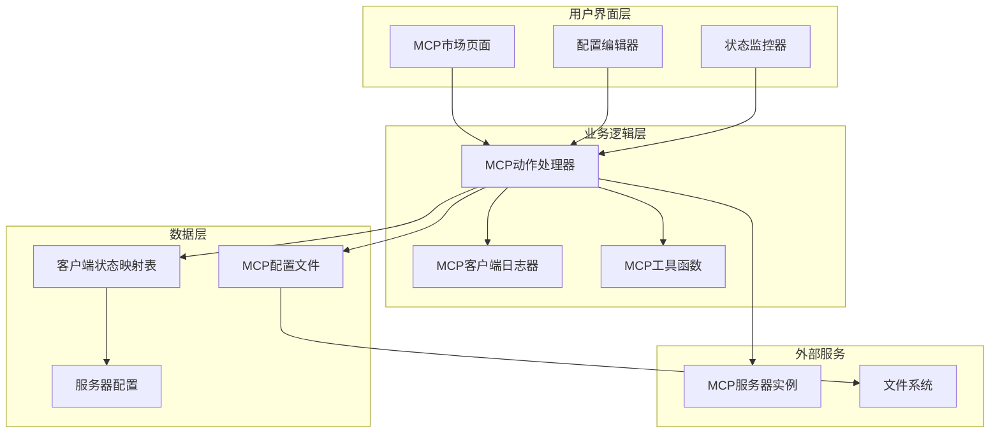
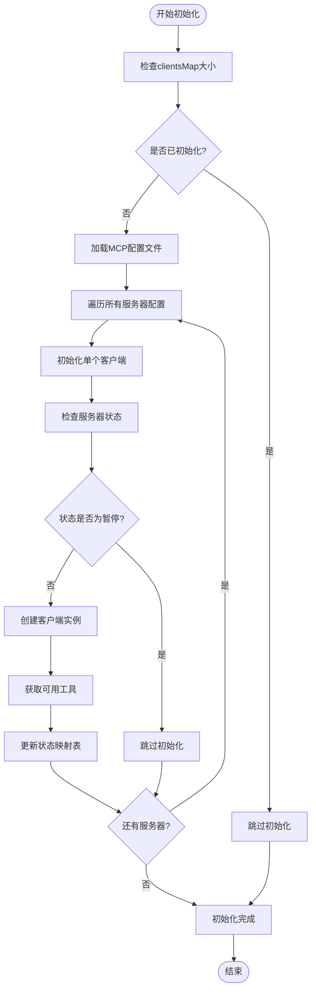
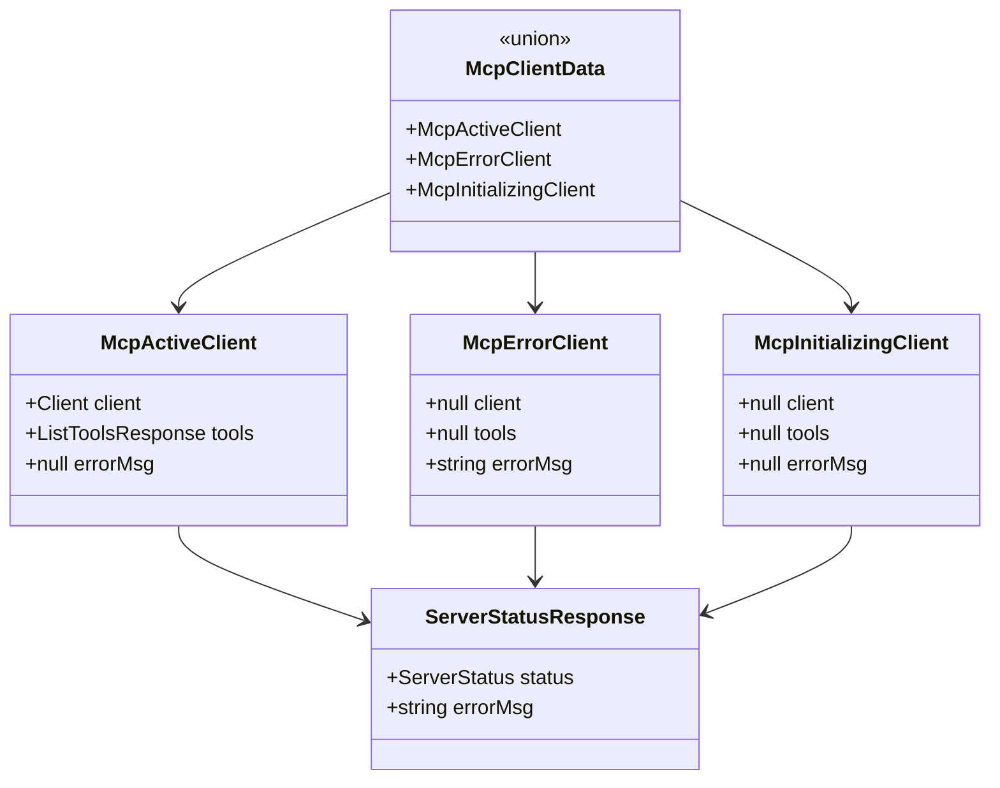
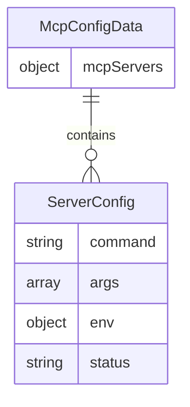
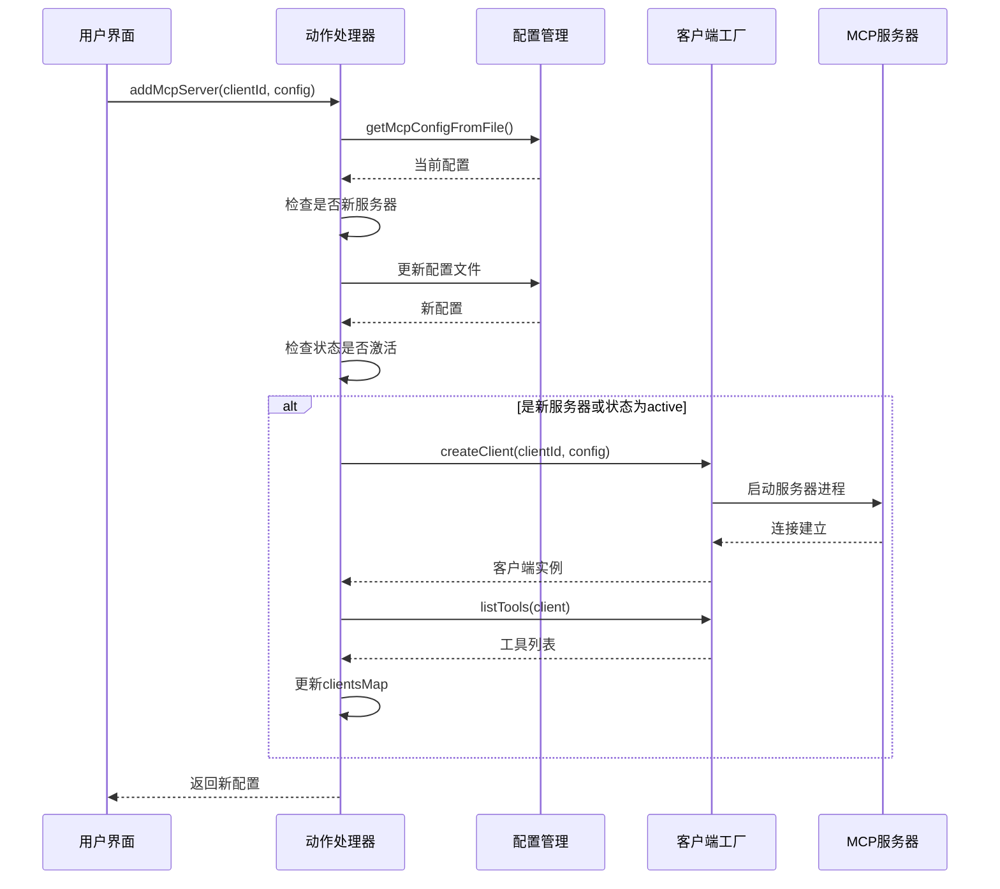
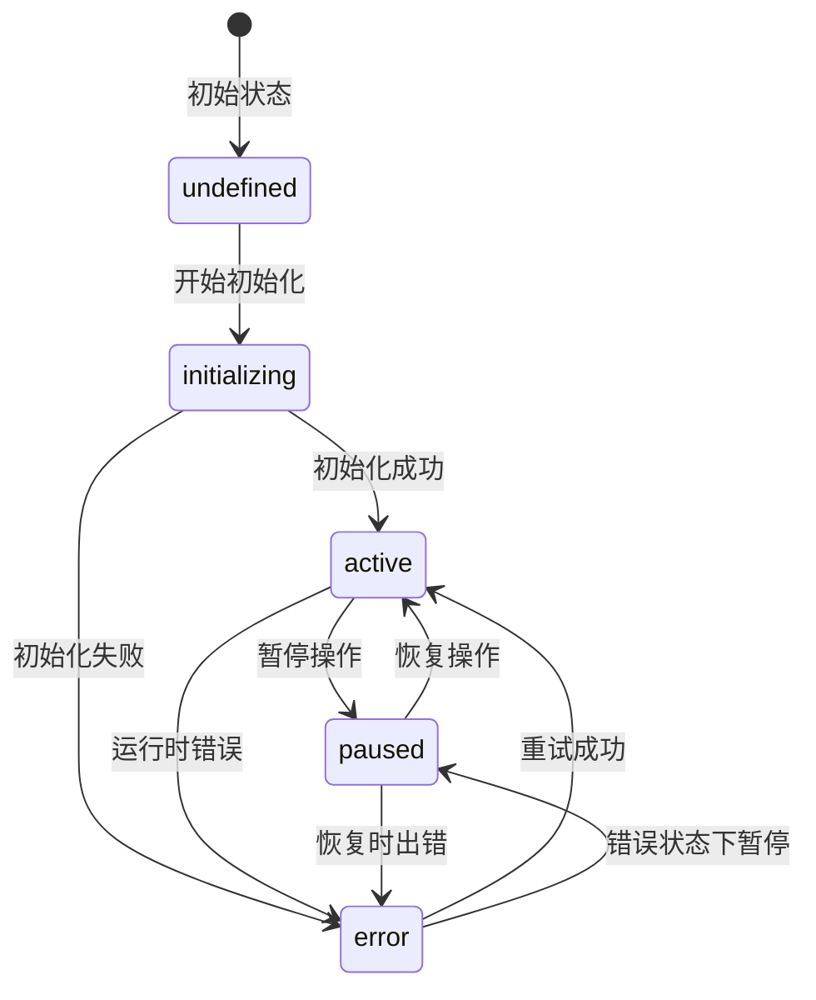
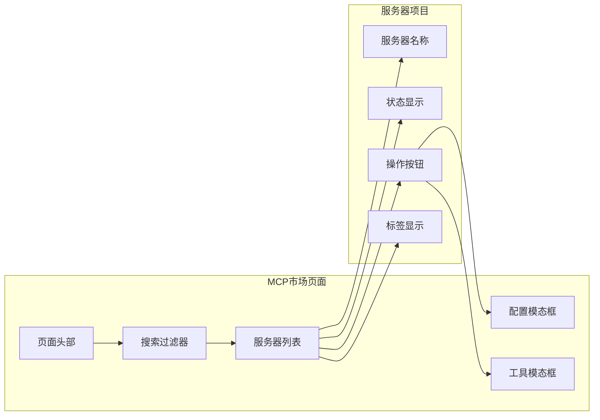
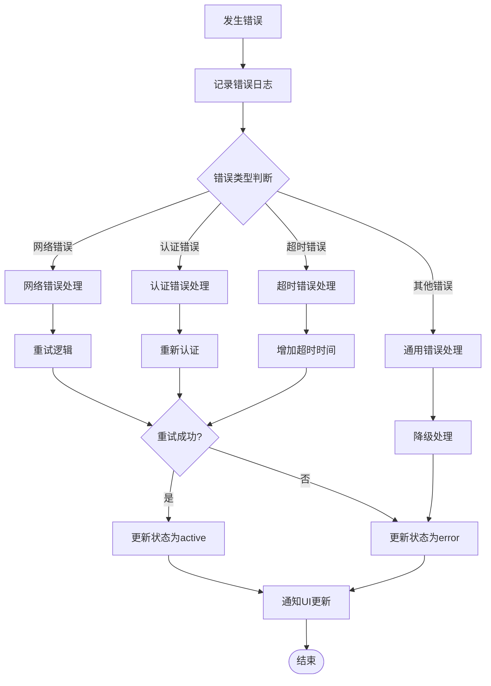
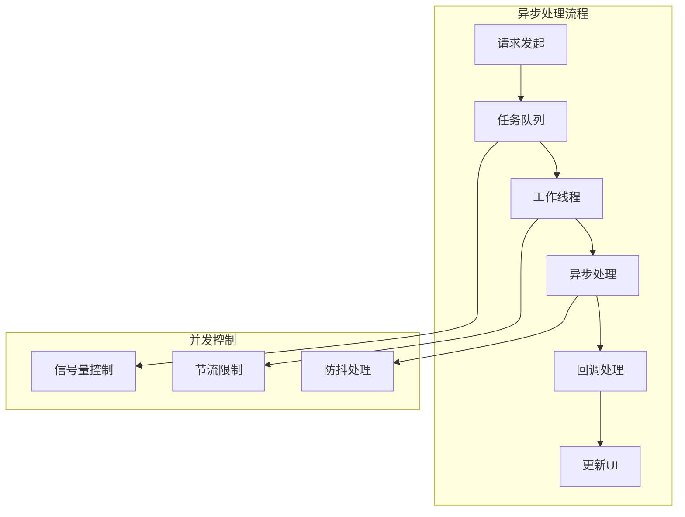
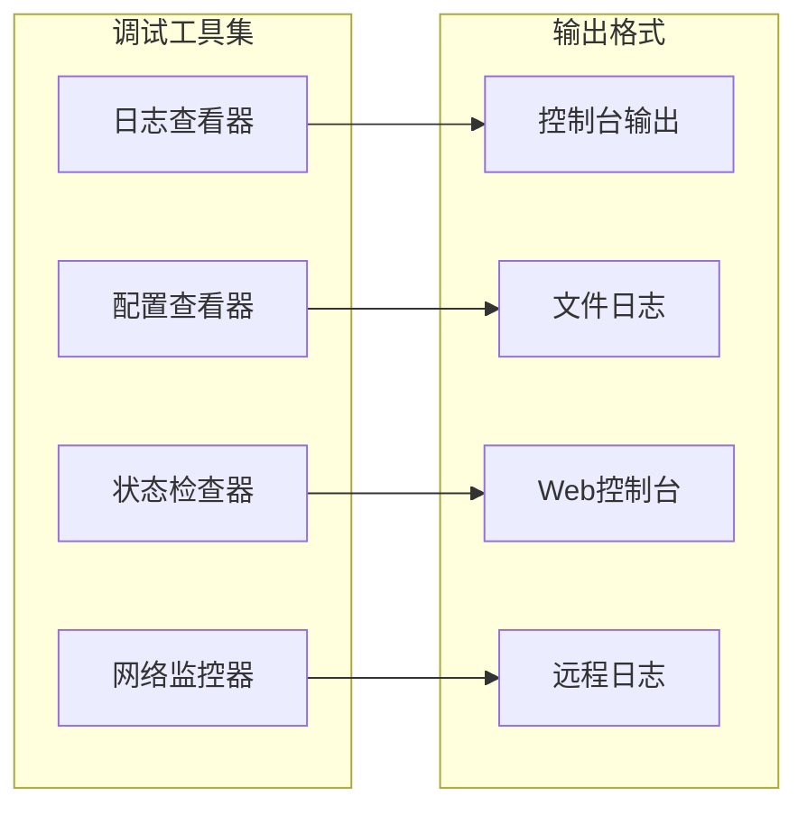

# MCP动作注册与客户端管理

<cite>
**本文档引用的文件**
- [actions.ts](file://app/mcp/actions.ts)
- [types.ts](file://app/mcp/types.ts)
- [client.ts](file://app/mcp/client.ts)
- [utils.ts](file://app/mcp/utils.ts)
- [logger.ts](file://app/mcp/logger.ts)
- [mcp_config.default.json](file://app/mcp/mcp_config.default.json)
- [mcp-market.tsx](file://app/components/mcp-market.tsx)
- [server.ts](file://app/config/server.ts)
</cite>

## 目录
1. [简介](#简介)
2. [系统架构概览](#系统架构概览)
3. [核心组件分析](#核心组件分析)
4. [MCP配置系统](#mcp配置系统)
5. [客户端生命周期管理](#客户端生命周期管理)
6. [UI交互与状态管理](#ui交互与状态管理)
7. [错误处理与状态转换](#错误处理与状态转换)
8. [性能优化策略](#性能优化策略)
9. [故障排除指南](#故障排除指南)
10. [总结](#总结)

## 简介

MCP（Model Context Protocol）动作注册与客户端管理系统是一个基于React和TypeScript构建的现代化架构，用于管理和协调多个MCP服务器客户端。该系统提供了完整的客户端生命周期管理、状态监控、配置持久化和用户界面交互功能。

系统的核心设计理念包括：
- **模块化架构**：清晰分离业务逻辑、数据模型和用户界面
- **状态驱动**：基于React的状态管理确保UI实时响应
- **异步处理**：充分利用JavaScript的异步特性处理客户端连接
- **类型安全**：完整的TypeScript类型定义保证代码质量
- **可扩展性**：灵活的配置系统支持动态添加和移除服务器

## 系统架构概览

**图表来源**
- [actions.ts](file://app/mcp/actions.ts#L1-L386)
- [mcp-market.tsx](file://app/components/mcp-market.tsx#L1-L756)

**章节来源**
- [actions.ts](file://app/mcp/actions.ts#L1-L50)
- [types.ts](file://app/mcp/types.ts#L1-L181)

## 核心组件分析

### 初始化系统函数

系统启动时通过`initializeMcpSystem`函数进行初始化，该函数负责：

**图表来源**
- [actions.ts](file://app/mcp/actions.ts#L142-L160)
- [actions.ts](file://app/mcp/actions.ts#L101-L139)

### 客户端状态管理

系统维护一个全局的`clientsMap`状态映射表，用于跟踪每个MCP客户端的状态：

**图表来源**
- [types.ts](file://app/mcp/types.ts#L76-L97)
- [types.ts](file://app/mcp/types.ts#L107-L110)

**章节来源**
- [actions.ts](file://app/mcp/actions.ts#L24-L75)
- [types.ts](file://app/mcp/types.ts#L76-L110)

## MCP配置系统

### 配置文件结构

系统使用JSON格式的配置文件来存储MCP服务器信息：

**图表来源**
- [types.ts](file://app/mcp/types.ts#L120-L123)
- [types.ts](file://app/mcp/types.ts#L113-L118)

### 默认配置与环境变量

系统提供了默认配置机制，当配置文件不存在时自动使用默认值：

| 配置项 | 类型 | 默认值 | 描述 |
|--------|------|--------|------|
| mcpServers | Record<string, ServerConfig> | {} | 服务器配置对象 |
| command | string | - | 服务器进程命令 |
| args | string[] | [] | 命令行参数数组 |
| env | Record<string, string> | {} | 环境变量映射 |
| status | "active" \| "paused" \| "error" | "active" | 服务器运行状态 |

**章节来源**
- [mcp_config.default.json](file://app/mcp/mcp_config.default.json#L1-L4)
- [types.ts](file://app/mcp/types.ts#L125-L127)

## 客户端生命周期管理

### 添加服务器流程

**图表来源**
- [actions.ts](file://app/mcp/actions.ts#L163-L192)
- [client.ts](file://app/mcp/client.ts#L9-L38)

### 状态转换机制

系统实现了完整的状态转换机制，支持以下状态：

**图表来源**
- [types.ts](file://app/mcp/types.ts#L100-L105)
- [actions.ts](file://app/mcp/actions.ts#L27-L75)

**章节来源**
- [actions.ts](file://app/mcp/actions.ts#L163-L192)
- [actions.ts](file://app/mcp/actions.ts#L195-L229)
- [actions.ts](file://app/mcp/actions.ts#L231-L282)

## UI交互与状态管理

### MCP市场页面架构

MCP市场页面提供了完整的用户交互界面，支持服务器的添加、配置、启动、停止和删除操作：

**图表来源**
- [mcp-market.tsx](file://app/components/mcp-market.tsx#L43-L756)

### 实时状态监控

系统实现了实时的状态监控机制，每秒轮询一次客户端状态：

| 监控指标 | 更新频率 | 数据源 | 用途 |
|----------|----------|--------|------|
| 服务器状态 | 1秒 | getClientsStatus() | UI状态显示 |
| 工具列表 | 按需 | getClientTools() | 工具展示 |
| 配置状态 | 操作后 | 配置文件读取 | 状态同步 |
| 加载状态 | 实时 | 内部状态管理 | 用户反馈 |

**章节来源**
- [mcp-market.tsx](file://app/components/mcp-market.tsx#L75-L90)
- [mcp-market.tsx](file://app/components/mcp-market.tsx#L113-L133)

## 错误处理与状态转换

### 错误处理策略

系统采用多层次的错误处理策略：

**图表来源**
- [actions.ts](file://app/mcp/actions.ts#L131-L138)
- [actions.ts](file://app/mcp/actions.ts#L260-L278)

### 日志系统

系统内置了完整的日志记录功能，支持多种日志级别：

| 日志级别 | 颜色编码 | 使用场景 | 示例 |
|----------|----------|----------|------|
| Info | 蓝色 | 一般信息记录 | "Initializing client [clientId]..." |
| Success | 绿色 | 成功操作记录 | "Client [clientId] initialized successfully" |
| Warning | 黄色 | 警告信息记录 | "Skipping initialization for paused client" |
| Error | 红色 | 错误信息记录 | "Failed to initialize client [clientId]" |
| Debug | 淡色 | 调试信息记录 | 详细的调试输出 |

**章节来源**
- [logger.ts](file://app/mcp/logger.ts#L12-L66)
- [actions.ts](file://app/mcp/actions.ts#L131-L138)

## 性能优化策略

### 异步处理优化

系统采用异步处理模式，避免阻塞主线程：

### 内存管理

系统实现了智能的内存管理策略：

| 策略 | 实现方式 | 效果 |
|------|----------|------|
| 延迟加载 | 按需初始化客户端 | 减少启动时间 |
| 缓存机制 | clientsMap状态缓存 | 提高查询效率 |
| 自动清理 | 定期清理无效连接 | 防止内存泄漏 |
| 连接池 | 复用客户端连接 | 减少资源消耗 |

## 故障排除指南

### 常见问题诊断

| 问题症状 | 可能原因 | 解决方案 | 预防措施 |
|----------|----------|----------|----------|
| 客户端无法连接 | 服务器进程未启动 | 检查命令和参数配置 | 验证服务器可执行性 |
| 工具列表为空 | 通信协议错误 | 检查MCP版本兼容性 | 使用标准MCP实现 |
| 状态显示异常 | 配置文件损坏 | 重置为默认配置 | 定期备份配置文件 |
| UI无响应 | 异步操作阻塞 | 检查Promise处理 | 实现超时机制 |

### 调试工具

系统提供了多种调试工具：

**章节来源**
- [logger.ts](file://app/mcp/logger.ts#L12-L66)
- [actions.ts](file://app/mcp/actions.ts#L354-L362)

## 总结

MCP动作注册与客户端管理系统是一个设计精良、功能完备的现代化架构。系统通过以下特点实现了高效的MCP服务器管理：

### 核心优势

1. **模块化设计**：清晰的分层架构便于维护和扩展
2. **类型安全**：完整的TypeScript类型定义保证代码质量
3. **异步处理**：充分利用现代JavaScript特性提升性能
4. **状态管理**：实时的状态监控确保用户体验
5. **错误处理**：完善的错误处理机制提高系统稳定性

### 技术亮点

- **状态映射表**：高效的clientsMap实现客户端状态管理
- **配置持久化**：可靠的配置文件读写机制
- **实时监控**：轮询机制确保状态同步
- **日志系统**：完整的日志记录和调试支持

### 应用价值

该系统为MCP技术的广泛应用奠定了坚实基础，通过提供稳定、高效、易用的客户端管理解决方案，推动了AI工具生态的发展。系统的可扩展性和模块化设计使其能够适应不断变化的需求，为未来的功能增强提供了良好的基础。