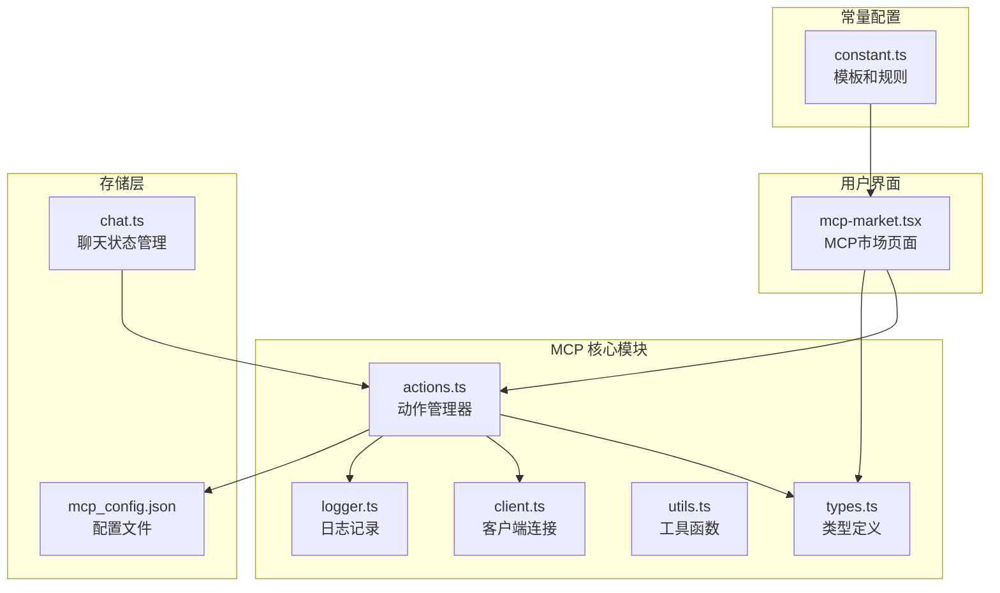
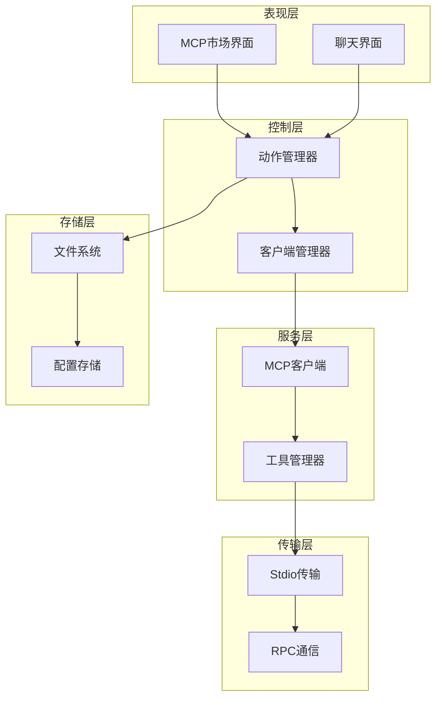
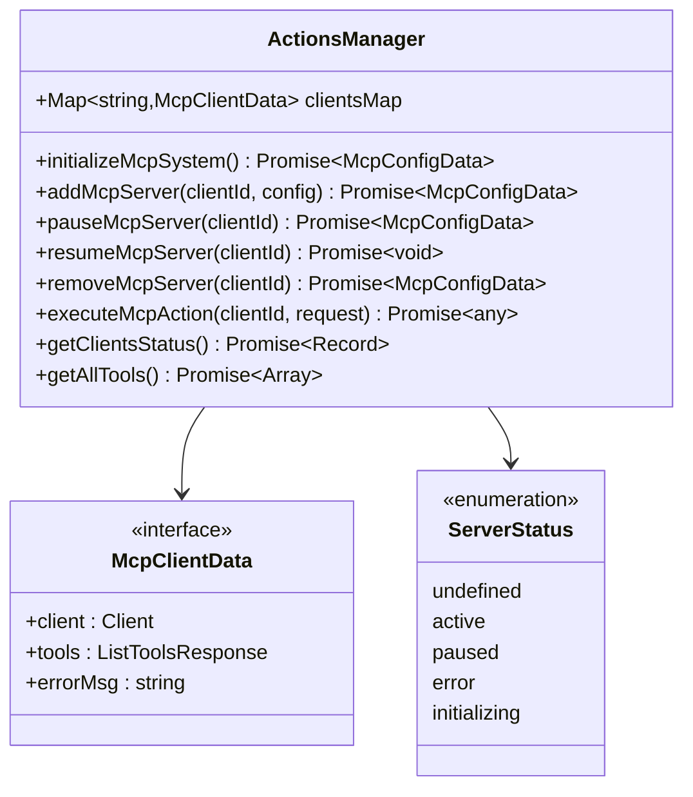
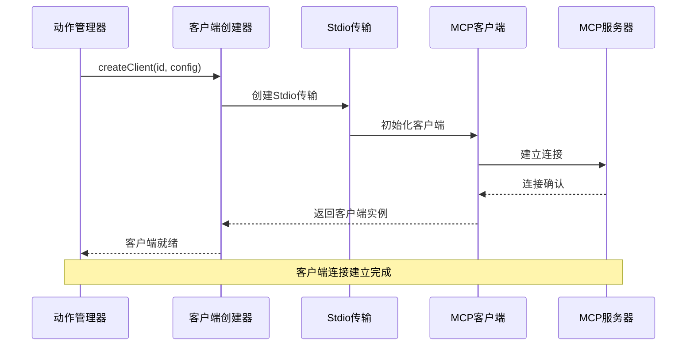
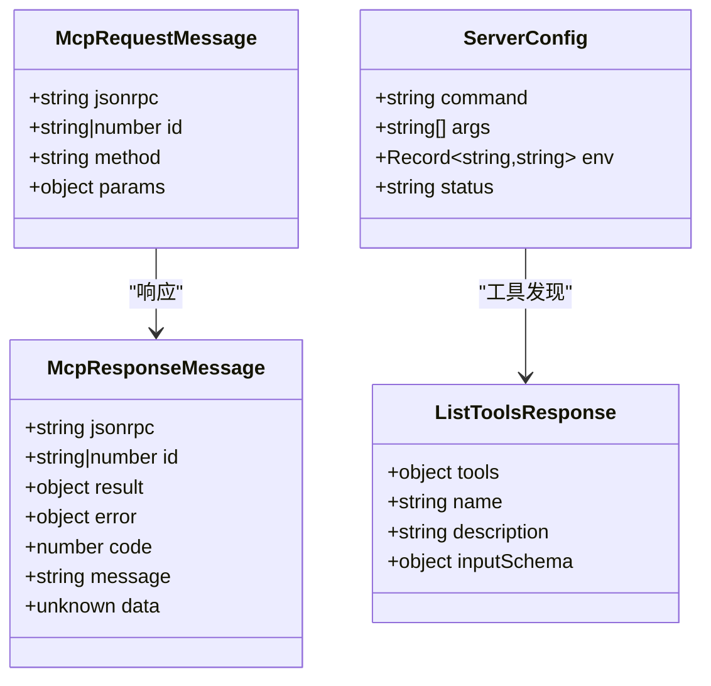
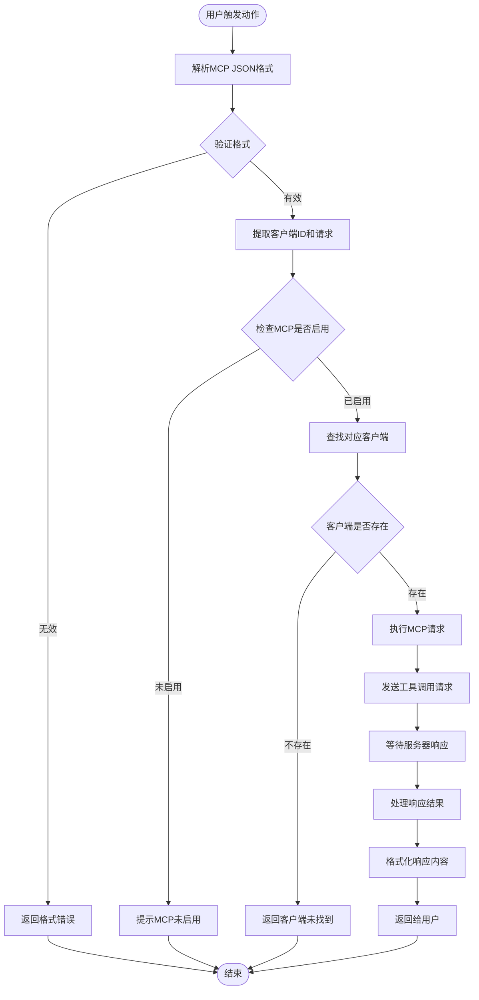
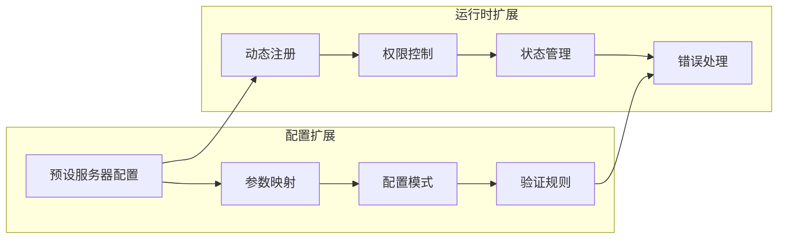
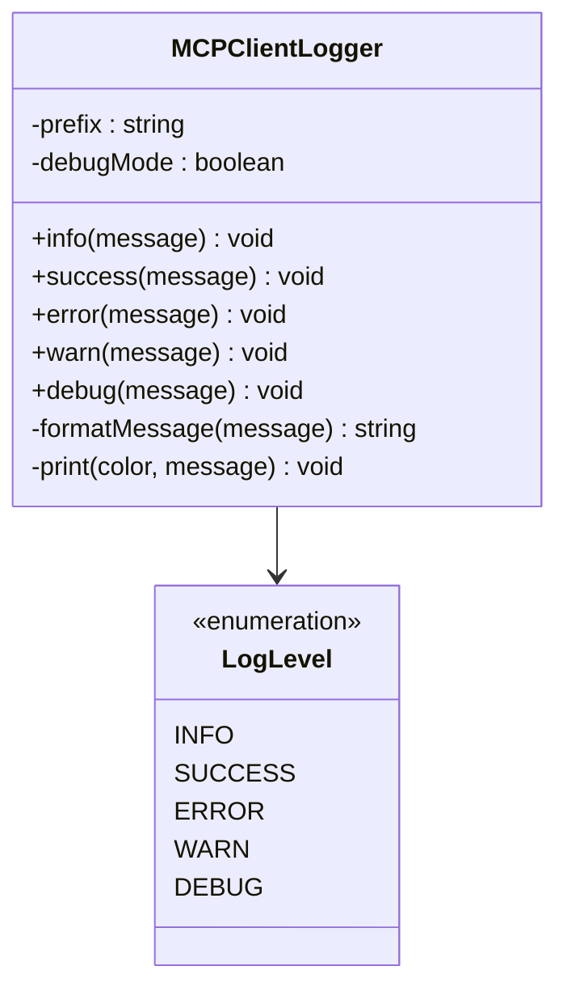
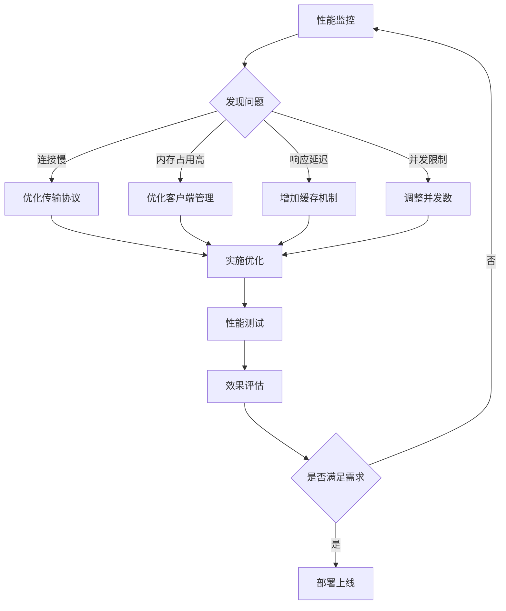

# MCP动作管理

<cite>
**本文档中引用的文件**
- [actions.ts](file://app/mcp/actions.ts)
- [types.ts](file://app/mcp/types.ts)
- [client.ts](file://app/mcp/client.ts)
- [utils.ts](file://app/mcp/utils.ts)
- [logger.ts](file://app/mcp/logger.ts)
- [mcp-market.tsx](file://app/components/mcp-market.tsx)
- [chat.ts](file://app/store/chat.ts)
- [constant.ts](file://app/constant.ts)
- [mcp_config.default.json](file://app/mcp/mcp_config.default.json)
</cite>

## 目录
1. [简介](#简介)
2. [项目结构](#项目结构)
3. [核心组件](#核心组件)
4. [架构概览](#架构概览)
5. [详细组件分析](#详细组件分析)
6. [动作调用链路](#动作调用链路)
7. [扩展自定义动作](#扩展自定义动作)
8. [调试与测试最佳实践](#调试与测试最佳实践)
9. [故障排除指南](#故障排除指南)
10. [结论](#结论)

## 简介

MCP（Model Context Protocol）动作管理系统是一个基于Model Context Protocol规范构建的插件化架构，允许ChatGPT-Next-Web通过外部进程与各种工具和服务进行交互。该系统提供了完整的动作定义、注册、执行和管理机制，支持动态加载和配置MCP服务器，实现强大的扩展能力。

## 项目结构

MCP动作管理系统的核心文件组织如下：



**图表来源**
- [actions.ts](file://app/mcp/actions.ts#L1-L386)
- [types.ts](file://app/mcp/types.ts#L1-L181)
- [client.ts](file://app/mcp/client.ts#L1-L56)

**章节来源**
- [actions.ts](file://app/mcp/actions.ts#L1-L50)
- [types.ts](file://app/mcp/types.ts#L1-L100)

## 核心组件

### 动作管理器（Actions）

动作管理器是MCP系统的核心控制器，负责：
- 客户端生命周期管理
- 服务器配置和状态监控
- 动作执行和结果处理
- 系统初始化和重启

主要功能包括：
- 客户端状态跟踪（初始化中、活跃、暂停、错误）
- 多客户端并发管理
- 配置持久化存储
- 实时状态监控

### 类型系统（Types）

定义了MCP通信的标准接口和数据结构：

| 接口名称 | 用途 | 主要字段 |
|---------|------|----------|
| McpRequestMessage | 请求消息格式 | method, params, id |
| McpResponseMessage | 响应消息格式 | result, error, id |
| ServerConfig | 服务器配置 | command, args, env |
| ListToolsResponse | 工具列表响应 | tools数组 |
| McpClientData | 客户端数据状态 | client, tools, errorMsg |

### 客户端连接（Client）

负责与MCP服务器建立和维护连接：
- 使用Stdio传输协议
- 支持环境变量传递
- 提供连接池管理
- 实现自动重连机制

**章节来源**
- [actions.ts](file://app/mcp/actions.ts#L24-L100)
- [types.ts](file://app/mcp/types.ts#L6-L120)
- [client.ts](file://app/mcp/client.ts#L9-L56)

## 架构概览

MCP动作管理系统采用分层架构设计，确保高内聚低耦合：



**图表来源**
- [actions.ts](file://app/mcp/actions.ts#L142-L200)
- [client.ts](file://app/mcp/client.ts#L9-L56)
- [mcp-market.tsx](file://app/components/mcp-market.tsx#L43-L100)

## 详细组件分析

### 动作管理器详细分析

动作管理器实现了完整的MCP服务器生命周期管理：



**图表来源**
- [actions.ts](file://app/mcp/actions.ts#L76-L100)
- [types.ts](file://app/mcp/types.ts#L76-L97)

### 客户端连接详细分析

客户端连接模块负责与MCP服务器建立稳定连接：



**图表来源**
- [client.ts](file://app/mcp/client.ts#L9-L39)
- [actions.ts](file://app/mcp/actions.ts#L102-L139)

### 类型系统详细分析

类型系统确保了MCP通信的标准化和安全性：



**图表来源**
- [types.ts](file://app/mcp/types.ts#L6-L74)

**章节来源**
- [actions.ts](file://app/mcp/actions.ts#L102-L180)
- [client.ts](file://app/mcp/client.ts#L9-L56)
- [types.ts](file://app/mcp/types.ts#L6-L120)

## 动作调用链路

MCP动作的完整执行链路涉及多个组件的协作：



**图表来源**
- [chat.ts](file://app/store/chat.ts#L826-L855)
- [utils.ts](file://app/mcp/utils.ts#L1-L11)

### 动作执行流程详解

1. **UI触发阶段**
   - 用户在聊天界面输入MCP格式的消息
   - 系统检测到```json:mcp:{clientId}格式
   - 解析出客户端ID和请求参数

2. **参数校验阶段**
   - 验证MCP格式的正确性
   - 检查MCP功能是否启用
   - 确认目标客户端是否存在

3. **客户端请求构造阶段**
   - 构建标准的MCP请求消息
   - 设置JSON-RPC协议头
   - 包装工具调用参数

4. **响应处理阶段**
   - 等待MCP服务器响应
   - 处理成功和错误情况
   - 格式化响应结果
   - 将结果注入聊天界面

**章节来源**
- [chat.ts](file://app/store/chat.ts#L826-L855)
- [utils.ts](file://app/mcp/utils.ts#L1-L11)
- [constant.ts](file://app/constant.ts#L299-L380)

## 扩展自定义动作

### 自定义动作定义

要扩展自定义MCP动作，需要遵循以下步骤：

1. **定义动作接口**
   ```typescript
   // 在types.ts中扩展接口
   export interface CustomActionParams {
     // 自定义参数定义
   }
   
   export interface CustomActionResult {
     // 自定义结果定义
   }
   ```

2. **实现动作处理器**
   ```typescript
   // 在actions.ts中添加处理逻辑
   export async function handleCustomAction(
     clientId: string,
     params: CustomActionParams
   ): Promise<CustomActionResult> {
     // 实现自定义逻辑
   }
   ```

3. **注册动作到系统**
   ```typescript
   // 在客户端初始化时注册
   await registerCustomActions(client);
   ```

### 动作配置扩展



**图表来源**
- [types.ts](file://app/mcp/types.ts#L130-L180)
- [mcp-market.tsx](file://app/components/mcp-market.tsx#L178-L200)

**章节来源**
- [types.ts](file://app/mcp/types.ts#L130-L180)
- [mcp-market.tsx](file://app/components/mcp-market.tsx#L178-L250)

## 调试与测试最佳实践

### 日志记录策略

MCP系统提供了完善的日志记录机制：



**图表来源**
- [logger.ts](file://app/mcp/logger.ts#L12-L66)

### 测试策略

1. **单元测试**
   - 测试动作执行逻辑
   - 验证类型安全
   - 模拟客户端连接

2. **集成测试**
   - 测试完整的动作调用链路
   - 验证多客户端并发
   - 测试错误恢复机制

3. **端到端测试**
   - 模拟用户交互
   - 验证UI响应
   - 测试配置持久化

### 调试技巧

| 调试方法 | 适用场景 | 实现方式 |
|---------|----------|----------|
| 日志追踪 | 运行时问题诊断 | 启用DEBUG模式 |
| 状态监控 | 客户端状态检查 | 使用getClientsStatus |
| 配置验证 | 配置文件问题 | 验证JSON格式 |
| 网络诊断 | 连接问题排查 | 检查Stdio传输 |

**章节来源**
- [logger.ts](file://app/mcp/logger.ts#L12-L66)
- [actions.ts](file://app/mcp/actions.ts#L26-L100)

## 故障排除指南

### 常见问题及解决方案

1. **MCP服务器连接失败**
   - 检查服务器配置命令和参数
   - 验证可执行文件路径
   - 确认网络和权限设置

2. **动作执行超时**
   - 增加超时时间设置
   - 检查服务器性能
   - 优化请求参数

3. **配置文件损坏**
   - 使用默认配置文件
   - 检查JSON语法
   - 验证文件权限

### 性能优化建议



**章节来源**
- [actions.ts](file://app/mcp/actions.ts#L26-L100)
- [client.ts](file://app/mcp/client.ts#L9-L56)

## 结论

MCP动作管理系统为ChatGPT-Next-Web提供了强大而灵活的扩展能力。通过标准化的接口设计、完善的生命周期管理和丰富的调试工具，开发者可以轻松地集成和扩展各种外部工具和服务。

系统的主要优势包括：
- **模块化设计**：清晰的职责分离和接口定义
- **高可靠性**：完善的错误处理和恢复机制
- **易于扩展**：标准化的扩展接口和配置机制
- **开发友好**：丰富的调试工具和日志记录

随着MCP协议的不断发展和社区生态的完善，该系统将继续为用户提供更加强大和便捷的AI助手体验。