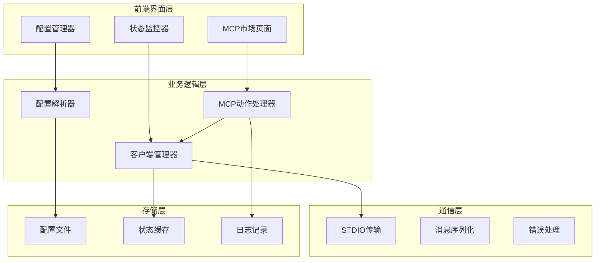
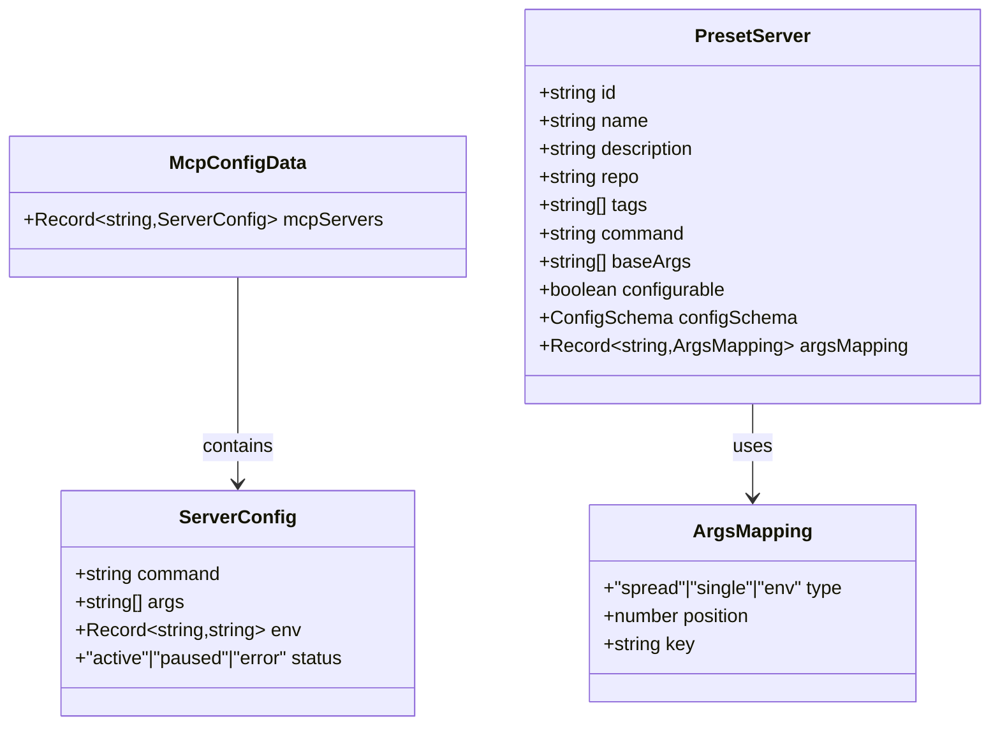
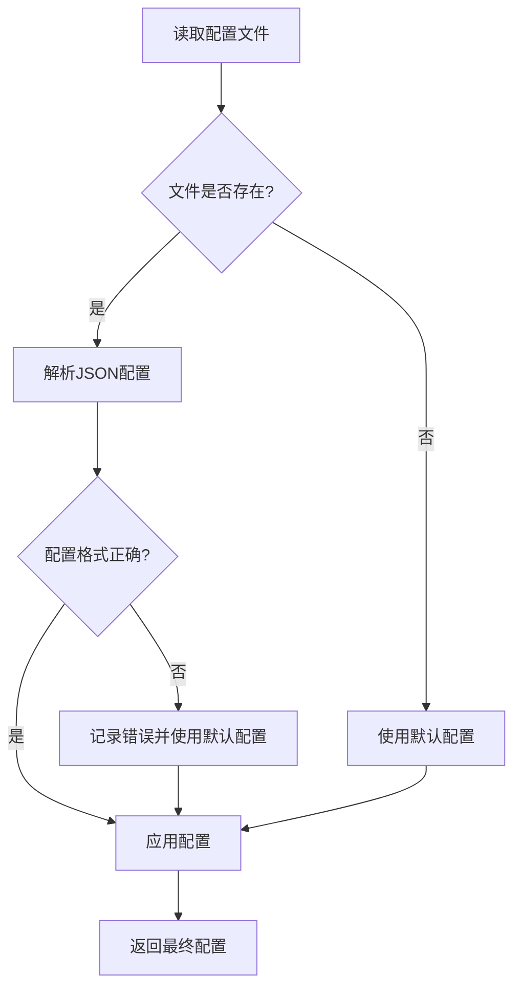
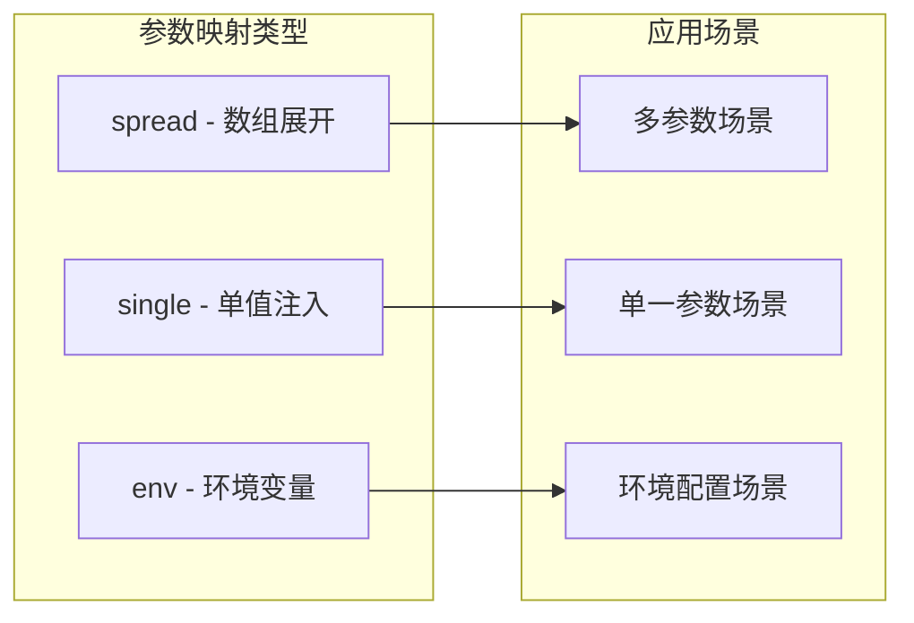
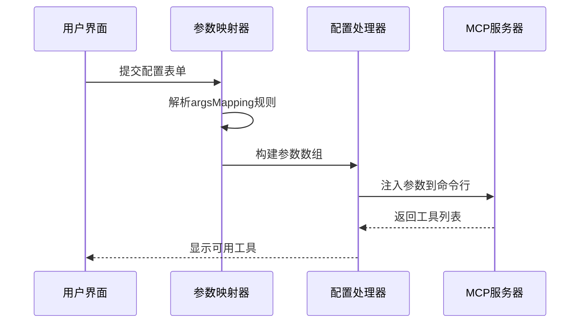
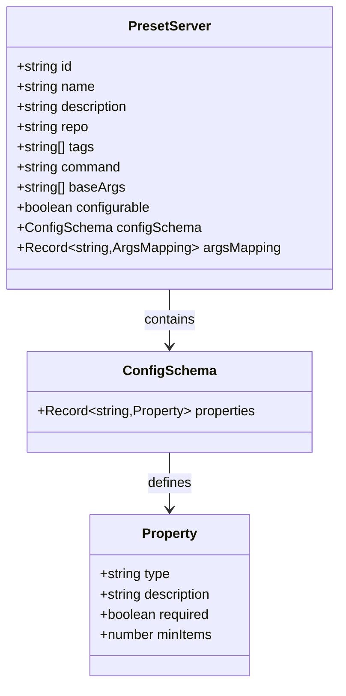
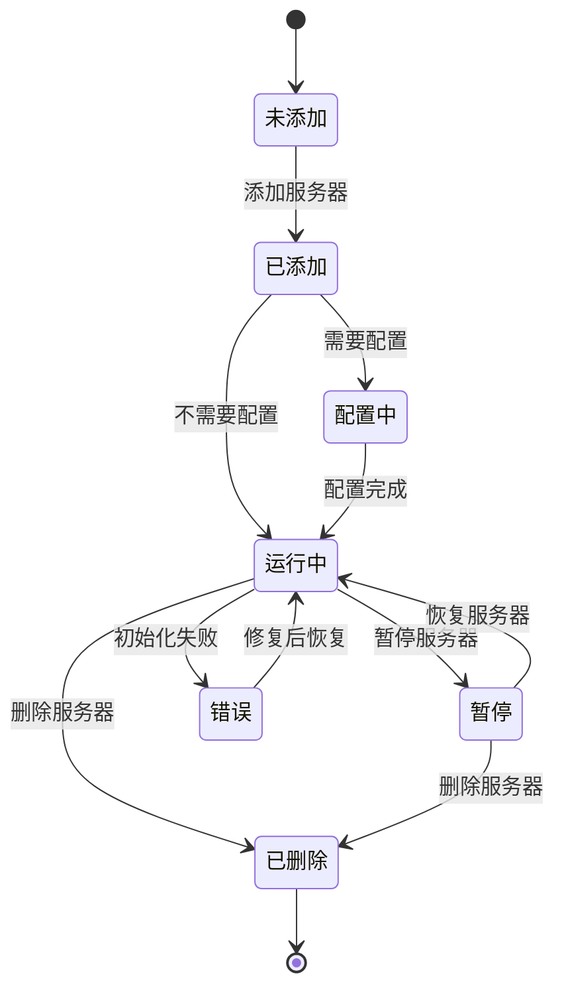
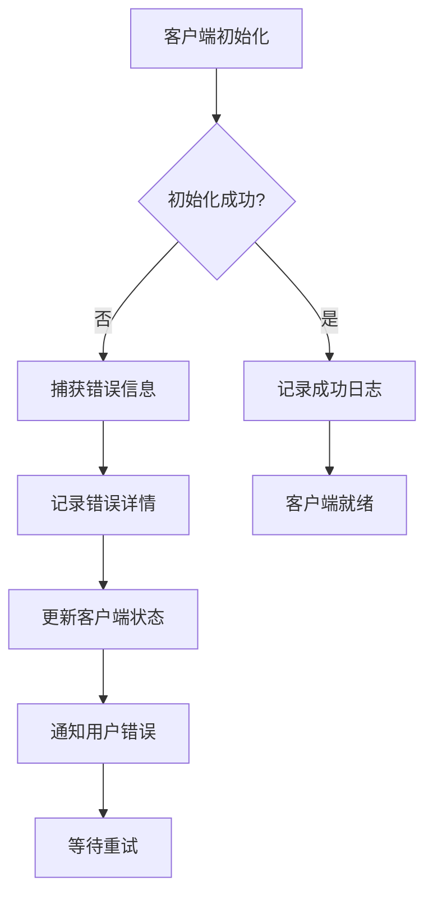

# 自定义MCP动作扩展开发指南

<cite>
**本文档引用的文件**
- [types.ts](file://app/mcp/types.ts)
- [actions.ts](file://app/mcp/actions.ts)
- [client.ts](file://app/mcp/client.ts)
- [utils.ts](file://app/mcp/utils.ts)
- [mcp_config.default.json](file://app/mcp/mcp_config.default.json)
- [mcp-market.tsx](file://app/components/mcp-market.tsx)
- [server.ts](file://app/config/server.ts)
</cite>

## 目录
1. [简介](#简介)
2. [项目架构概览](#项目架构概览)
3. [核心类型定义](#核心类型定义)
4. [配置系统详解](#配置系统详解)
5. [参数映射机制](#参数映射机制)
6. [预置服务器接口](#预置服务器接口)
7. [扩展开发流程](#扩展开发流程)
8. [调试与故障排除](#调试与故障排除)
9. [最佳实践](#最佳实践)
10. [总结](#总结)

## 简介

Model Context Protocol (MCP) 是一个用于扩展大语言模型功能的协议。本指南详细介绍了如何基于 ChatGPT-Next-Web 的现有架构扩展自定义MCP动作，包括配置管理、参数映射、预置服务器等核心功能的实现。

## 项目架构概览

MCP系统采用模块化架构设计，主要包含以下核心组件：



**图表来源**
- [mcp-market.tsx](file://app/components/mcp-market.tsx#L44-L756)
- [actions.ts](file://app/mcp/actions.ts#L1-L386)
- [client.ts](file://app/mcp/client.ts#L1-L56)

**章节来源**
- [mcp-market.tsx](file://app/components/mcp-market.tsx#L1-L756)
- [actions.ts](file://app/mcp/actions.ts#L1-L386)

## 核心类型定义

### ServerConfig配置结构

ServerConfig是MCP服务器的核心配置接口，定义了服务器的基本属性：



**图表来源**
- [types.ts](file://app/mcp/types.ts#L113-L180)

### 输入模式验证

系统提供了完整的输入模式验证机制，确保配置的正确性：

| 字段名 | 类型 | 必填 | 描述 |
|--------|------|------|------|
| command | string | 是 | 服务器启动命令 |
| args | string[] | 是 | 命令行参数数组 |
| env | Record<string,string> | 否 | 环境变量配置 |
| status | "active"\|"paused"\|"error" | 否 | 服务器状态 |

**章节来源**
- [types.ts](file://app/mcp/types.ts#L113-L180)

## 配置系统详解

### 默认配置结构

系统提供了灵活的配置继承机制，通过DEFAULT_MCP_CONFIG实现配置的默认值管理：



**图表来源**
- [actions.ts](file://app/mcp/actions.ts#L354-L362)

### 配置文件路径管理

配置文件采用相对路径策略，确保跨平台兼容性：

```typescript
// 配置文件路径定义
const CONFIG_PATH = path.join(process.cwd(), "app/mcp/mcp_config.json");
```

### 继承与覆盖机制

配置系统支持多层次的继承与覆盖：

1. **默认配置层**：`DEFAULT_MCP_CONFIG` 提供基础默认值
2. **文件配置层**：`mcp_config.json` 提供用户自定义配置
3. **运行时配置层**：动态修改的临时配置

**章节来源**
- [actions.ts](file://app/mcp/actions.ts#L21-L23)
- [actions.ts](file://app/mcp/actions.ts#L354-L362)
- [mcp_config.default.json](file://app/mcp/mcp_config.default.json#L1-L4)

## 参数映射机制

### ArgsMapping类型系统

参数映射机制提供了三种不同的参数注入方式：



**图表来源**
- [types.ts](file://app/mcp/types.ts#L129-L138)

### 参数映射实现原理

系统通过智能的参数映射算法实现动态参数注入：



**图表来源**
- [mcp-market.tsx](file://app/components/mcp-market.tsx#L135-L166)
- [mcp-market.tsx](file://app/components/mcp-market.tsx#L177-L226)

### 参数映射配置示例

以下是不同类型的参数映射配置示例：

| 映射类型 | 配置示例 | 应用场景 |
|----------|----------|----------|
| spread | `{type: "spread", position: 2}` | 多个可变参数 |
| single | `{type: "single", position: 0, key: "apiKey"}` | 单一配置参数 |
| env | `{type: "env", key: "MCP_TOKEN"}` | 环境变量注入 |

**章节来源**
- [mcp-market.tsx](file://app/components/mcp-market.tsx#L135-L166)
- [mcp-market.tsx](file://app/components/mcp-market.tsx#L177-L226)

## 预置服务器接口

### PresetServer接口设计

PresetServer接口提供了标准化的预置服务器定义模板：



**图表来源**
- [types.ts](file://app/mcp/types.ts#L140-L180)

### 预置服务器生命周期

预置服务器的完整生命周期管理：



**图表来源**
- [actions.ts](file://app/mcp/actions.ts#L163-L307)

**章节来源**
- [types.ts](file://app/mcp/types.ts#L140-L180)
- [actions.ts](file://app/mcp/actions.ts#L163-L307)

## 扩展开发流程

### 步骤1：定义ServerConfig配置

创建新的MCP服务器配置：

```typescript
// 示例：定义新的服务器配置
const newServerConfig: ServerConfig = {
  command: "python",
  args: ["-m", "mcp.server", "--port", "8080"],
  env: {
    MCP_SERVER_NAME: "my-custom-server",
    MCP_LOG_LEVEL: "debug"
  },
  status: "active"
};
```

### 步骤2：设计inputSchema参数结构

定义服务器的输入参数结构：

```typescript
// 示例：输入参数schema
const inputSchema = {
  type: "object",
  properties: {
    apiKey: {
      type: "string",
      description: "API密钥",
      required: true
    },
    endpoint: {
      type: "string",
      description: "API端点URL",
      required: false,
      default: "https://api.example.com"
    },
    timeout: {
      type: "number",
      description: "请求超时时间(秒)",
      required: false,
      default: 30
    }
  }
};
```

### 步骤3：配置argsMapping参数映射

设置参数映射规则：

```typescript
// 示例：参数映射配置
const argsMapping: Record<string, ArgsMapping> = {
  apiKey: {
    type: "env",
    key: "API_KEY"
  },
  endpoint: {
    type: "single",
    position: 2
  },
  timeout: {
    type: "single",
    position: 4
  }
};
```

### 步骤4：添加到mcp_config.json

在配置文件中添加新的MCP服务器条目：

```json
{
  "mcpServers": {
    "my-custom-server": {
      "command": "python",
      "args": ["-m", "mcp.server", "--endpoint", "https://api.example.com", "--timeout", "30"],
      "env": {
        "MCP_SERVER_NAME": "my-custom-server",
        "API_KEY": "${API_KEY}"
      },
      "status": "active"
    }
  }
}
```

### 步骤5：实现PresetServer接口

创建预置服务器定义：

```typescript
// 示例：预置服务器定义
const myCustomServer: PresetServer = {
  id: "my-custom-server",
  name: "自定义MCP服务器",
  description: "提供自定义功能的MCP服务器",
  repo: "https://github.com/example/my-custom-server",
  tags: ["自定义", "实用工具"],
  command: "python",
  baseArgs: ["-m", "mcp.server"],
  configurable: true,
  configSchema: {
    properties: {
      apiKey: {
        type: "string",
        description: "API密钥",
        required: true
      },
      endpoint: {
        type: "string",
        description: "API端点",
        required: false,
        default: "https://api.example.com"
      }
    }
  },
  argsMapping: {
    apiKey: {
      type: "env",
      key: "API_KEY"
    },
    endpoint: {
      type: "single",
      position: 2
    }
  }
};
```

**章节来源**
- [actions.ts](file://app/mcp/actions.ts#L163-L189)
- [mcp-market.tsx](file://app/components/mcp-market.tsx#L177-L226)

## 调试与故障排除

### 功能开关检查

使用isMcpEnabled函数检查MCP功能是否启用：

```typescript
// 检查MCP功能状态
const isMcpEnabled = async () => {
  try {
    const serverConfig = getServerSideConfig();
    return serverConfig.enableMcp;
  } catch (error) {
    logger.error(`Failed to check MCP status: ${error}`);
    return false;
  }
};
```

### 日志定位客户端初始化失败原因

系统提供了完整的日志记录机制帮助调试：



**图表来源**
- [actions.ts](file://app/mcp/actions.ts#L101-L139)
- [actions.ts](file://app/mcp/actions.ts#L231-L278)

### 常见问题排查

| 问题类型 | 可能原因 | 解决方案 |
|----------|----------|----------|
| 客户端无法连接 | 命令路径错误 | 检查command字段的可执行文件路径 |
| 参数传递失败 | argsMapping配置错误 | 验证参数映射规则的position和key |
| 环境变量缺失 | env配置不完整 | 确保所有必需的环境变量都已设置 |
| 权限不足 | 文件或命令权限问题 | 检查文件权限和执行权限 |

### 调试技巧

1. **启用详细日志**：设置环境变量`MCP_LOG_LEVEL=debug`
2. **检查配置文件**：验证`mcp_config.json`的语法和结构
3. **测试命令行**：直接在终端运行配置的命令测试
4. **监控网络连接**：检查服务器是否正常响应

**章节来源**
- [actions.ts](file://app/mcp/actions.ts#L376-L385)
- [actions.ts](file://app/mcp/actions.ts#L101-L139)
- [actions.ts](file://app/mcp/actions.ts#L231-L278)

## 最佳实践

### 配置管理最佳实践

1. **使用环境变量**：敏感信息如API密钥应通过环境变量传递
2. **参数验证**：在前端和后端都进行参数验证
3. **错误处理**：实现完善的错误处理和用户反馈机制
4. **状态监控**：实时监控服务器状态并提供可视化界面

### 性能优化建议

1. **懒加载**：只在需要时初始化MCP客户端
2. **连接池**：复用已建立的连接减少开销
3. **缓存策略**：缓存工具列表和配置信息
4. **异步处理**：使用异步操作避免阻塞主线程

### 安全考虑

1. **输入验证**：严格验证所有用户输入
2. **权限控制**：限制MCP服务器的访问权限
3. **数据加密**：敏感数据在传输和存储时进行加密
4. **审计日志**：记录所有MCP操作以便审计

## 总结

本指南详细介绍了如何基于ChatGPT-Next-Web的架构扩展自定义MCP动作。通过理解ServerConfig配置、参数映射机制、预置服务器接口等核心概念，开发者可以：

1. **灵活配置**：通过ServerConfig接口定义各种类型的MCP服务器
2. **智能映射**：利用ArgsMapping机制实现参数的动态注入
3. **标准化管理**：通过PresetServer接口提供标准化的服务器定义
4. **可靠部署**：借助完善的配置管理和错误处理机制

MCP系统的模块化设计使其具有良好的扩展性和维护性，为构建强大的AI功能扩展平台奠定了坚实基础。开发者可以根据具体需求，在现有架构基础上进行二次开发，实现个性化的MCP功能扩展。