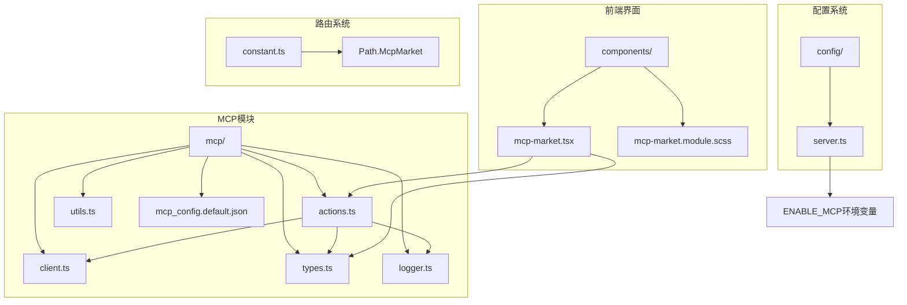
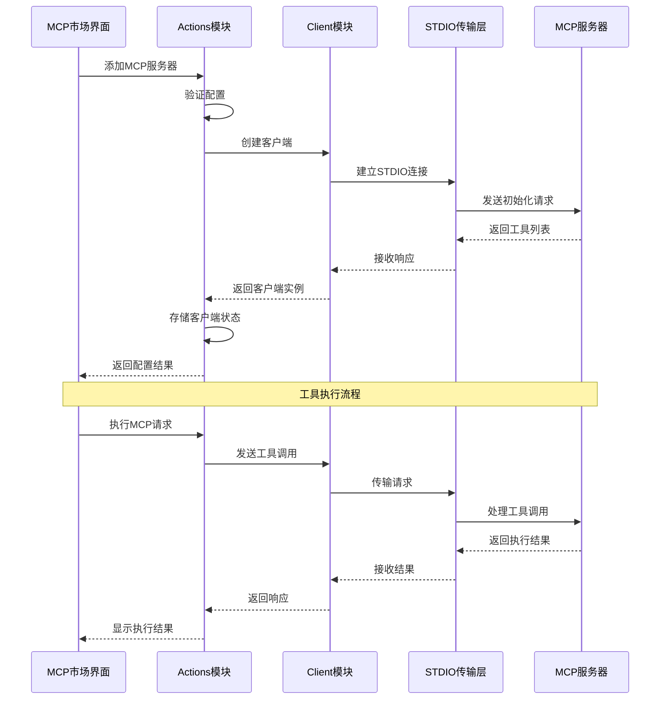
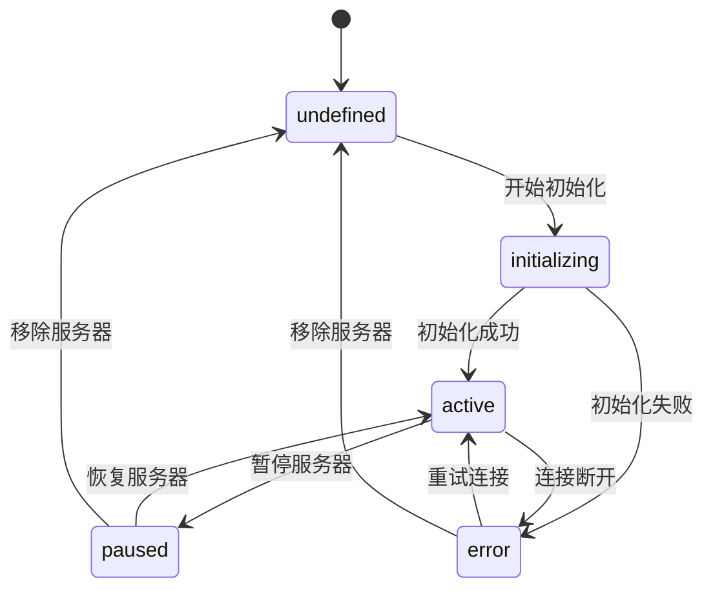
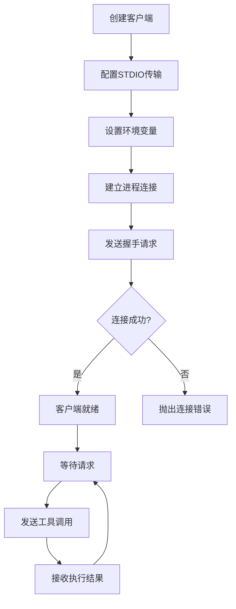
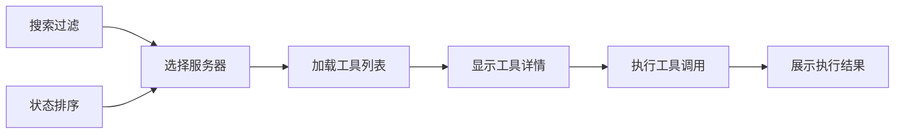

# MCP协议支持

<cite>
**本文档中引用的文件**
- [mcp_config.default.json](file://app/mcp/mcp_config.default.json)
- [actions.ts](file://app/mcp/actions.ts)
- [client.ts](file://app/mcp/client.ts)
- [types.ts](file://app/mcp/types.ts)
- [utils.ts](file://app/mcp/utils.ts)
- [logger.ts](file://app/mcp/logger.ts)
- [mcp-market.tsx](file://app/components/mcp-market.tsx)
- [mcp-market.module.scss](file://app/components/mcp-market.module.scss)
- [server.ts](file://app/config/server.ts)
- [constant.ts](file://app/constant.ts)
</cite>

## 目录
1. [简介](#简介)
2. [项目结构](#项目结构)
3. [核心组件](#核心组件)
4. [架构概览](#架构概览)
5. [详细组件分析](#详细组件分析)
6. [MCP市场界面](#mcp市场界面)
7. [配置管理](#配置管理)
8. [性能考虑](#性能考虑)
9. [故障排除指南](#故障排除指南)
10. [结论](#结论)

## 简介

Model Context Protocol（MCP）是一种用于扩展大语言模型上下文能力的协议。在ChatGPT-Next-Web项目中，MCP支持通过专门的模块实现了对第三方服务和工具的集成，增强了模型的推理能力和功能扩展性。

MCP协议的核心价值在于：
- **增强模型上下文理解**：通过外部工具和数据源扩展模型的知识边界
- **标准化接口**：提供统一的通信协议，简化第三方服务集成
- **动态工具发现**：支持运行时发现和调用外部工具
- **安全隔离**：确保外部服务的安全访问和权限控制

## 项目结构

MCP功能在项目中的组织结构如下：



**图表来源**
- [actions.ts](file://app/mcp/actions.ts#L1-L386)
- [client.ts](file://app/mcp/client.ts#L1-L56)
- [types.ts](file://app/mcp/types.ts#L1-L181)

**章节来源**
- [actions.ts](file://app/mcp/actions.ts#L1-L50)
- [client.ts](file://app/mcp/client.ts#L1-L20)

## 核心组件

### MCP Actions模块

Actions模块是MCP系统的核心控制器，负责管理所有MCP客户端的生命周期和操作。

主要功能包括：
- **客户端状态管理**：跟踪每个MCP服务器的连接状态
- **工具发现**：自动发现和注册可用的工具
- **请求执行**：处理MCP请求并返回结果
- **配置管理**：维护MCP服务器的配置信息

### MCP Client模块

Client模块封装了与MCP服务器的实际通信逻辑。

核心特性：
- **标准输入输出传输**：使用STDIO协议进行通信
- **客户端生命周期**：管理连接的建立、维护和关闭
- **错误处理**：提供健壮的异常处理机制

### 类型定义系统

Types模块定义了MCP协议的所有数据结构和接口。

关键类型包括：
- **McpRequestMessage**：MCP请求消息格式
- **ServerConfig**：服务器配置结构
- **McpClientData**：客户端状态数据

**章节来源**
- [actions.ts](file://app/mcp/actions.ts#L26-L140)
- [client.ts](file://app/mcp/client.ts#L9-L56)
- [types.ts](file://app/mcp/types.ts#L6-L181)

## 架构概览

MCP系统采用分层架构设计，确保了良好的可扩展性和维护性：



**图表来源**
- [actions.ts](file://app/mcp/actions.ts#L163-L193)
- [client.ts](file://app/mcp/client.ts#L9-L56)

## 详细组件分析

### MCP Actions详细分析

Actions模块提供了完整的MCP服务器管理功能：

#### 客户端状态管理



**图表来源**
- [actions.ts](file://app/mcp/actions.ts#L26-L75)
- [types.ts](file://app/mcp/types.ts#L76-L97)

#### 服务器生命周期管理

Actions模块实现了完整的服务器生命周期管理：

1. **初始化阶段**：验证配置并建立连接
2. **运行阶段**：监控状态并处理请求
3. **维护阶段**：支持暂停、恢复和重启
4. **清理阶段**：优雅关闭连接并释放资源

#### 错误处理机制

系统采用多层次的错误处理策略：

- **连接错误**：重试机制和状态标记
- **请求错误**：详细的错误信息记录
- **配置错误**：验证和回滚机制

**章节来源**
- [actions.ts](file://app/mcp/actions.ts#L101-L141)
- [actions.ts](file://app/mcp/actions.ts#L163-L283)

### MCP Client详细分析

Client模块专注于与MCP服务器的直接通信：

#### STDIO传输层



**图表来源**
- [client.ts](file://app/mcp/client.ts#L9-L38)

#### 客户端状态跟踪

Client模块维护详细的客户端状态信息：

- **连接状态**：活跃、暂停、错误、未定义
- **工具列表**：动态发现的可用工具
- **错误信息**：详细的错误诊断信息

**章节来源**
- [client.ts](file://app/mcp/client.ts#L9-L56)

### MCP Types详细分析

Types模块定义了MCP协议的数据结构：

#### 请求消息格式

MCP请求消息遵循标准的JSON-RPC 2.0格式：

```typescript
interface McpRequestMessage {
  jsonrpc?: "2.0";
  id?: string | number;
  method: "tools/call" | string;
  params?: {
    [key: string]: unknown;
  };
}
```

#### 服务器配置结构

```typescript
interface ServerConfig {
  command: string;
  args: string[];
  env?: Record<string, string>;
  status?: "active" | "paused" | "error";
}
```

#### 预设服务器定义

预设服务器提供了标准化的服务器配置模板：

- **唯一标识**：服务器的内部名称
- **显示名称**：用户可见的友好名称
- **描述信息**：功能说明和用途描述
- **配置模式**：是否需要用户配置
- **参数映射**：配置项到命令行参数的映射规则

**章节来源**
- [types.ts](file://app/mcp/types.ts#L6-L181)

## MCP市场界面

MCP市场界面提供了直观的服务器管理和工具发现功能：

### 功能特性

#### 服务器管理

- **添加服务器**：支持从预设列表中添加新的MCP服务器
- **配置管理**：提供图形化的配置界面
- **状态监控**：实时显示服务器状态和工具列表
- **生命周期控制**：启动、停止、重启服务器

#### 工具发现与展示



**图表来源**
- [mcp-market.tsx](file://app/components/mcp-market.tsx#L228-L242)

#### 用户体验设计

界面采用现代化的设计风格：

- **响应式布局**：适应不同屏幕尺寸
- **状态指示器**：清晰的状态反馈
- **加载动画**：流畅的用户体验
- **错误提示**：友好的错误信息展示

### 交互流程

#### 服务器添加流程

1. **浏览预设**：用户查看可用的MCP服务器
2. **选择配置**：根据需求选择合适的预设
3. **配置参数**：填写必要的配置信息
4. **测试连接**：验证服务器连接
5. **激活使用**：服务器进入活跃状态

#### 工具执行流程

1. **选择工具**：从工具列表中选择目标工具
2. **准备参数**：配置工具执行所需的参数
3. **执行调用**：发送工具调用请求
4. **结果展示**：显示执行结果和日志

**章节来源**
- [mcp-market.tsx](file://app/components/mcp-market.tsx#L255-L280)
- [mcp-market.tsx](file://app/components/mcp-market.tsx#L282-L312)

## 配置管理

### 环境变量配置

MCP功能通过环境变量进行全局控制：

```typescript
// 启用MCP功能
ENABLE_MCP: process.env.ENABLE_MCP === "true",
```

### 配置文件结构

MCP配置文件采用JSON格式，包含以下结构：

```json
{
  "mcpServers": {
    "server-id": {
      "command": "python",
      "args": ["script.py", "--port", "8080"],
      "env": {
        "API_KEY": "your-api-key"
      },
      "status": "active"
    }
  }
}
```

### 默认配置

系统提供默认的空配置，确保在没有自定义配置时系统的正常运行。

**章节来源**
- [server.ts](file://app/config/server.ts#L275)
- [mcp_config.default.json](file://app/mcp/mcp_config.default.json#L1-L4)

## 性能考虑

### 并发处理

MCP系统支持多个服务器的同时运行，通过以下机制优化性能：

- **异步操作**：所有网络操作采用异步模式
- **连接池**：复用活跃的连接减少开销
- **状态缓存**：缓存服务器状态避免重复查询

### 内存管理

- **客户端映射**：使用Map结构高效存储客户端信息
- **配置持久化**：定期保存配置避免内存泄漏
- **资源清理**：及时释放不再使用的资源

### 网络优化

- **连接复用**：共享底层传输连接
- **批量操作**：合并多个小请求
- **超时控制**：防止长时间阻塞

## 故障排除指南

### 常见问题

#### 连接失败

**症状**：服务器状态显示为"error"
**原因**：网络连接问题或服务器不可用
**解决方案**：
1. 检查网络连接
2. 验证服务器配置
3. 查看详细错误信息

#### 工具不可用

**症状**：工具列表为空或工具无法执行
**原因**：服务器未正确初始化或工具注册失败
**解决方案**：
1. 重启MCP服务器
2. 检查服务器日志
3. 验证工具配置

#### 配置错误

**症状**：添加服务器时出现错误
**原因**：配置格式不正确或参数缺失
**解决方案**：
1. 检查配置语法
2. 验证必需参数
3. 使用预设配置模板

### 调试方法

#### 日志分析

系统提供详细的日志记录功能：

```typescript
const logger = new MCPClientLogger("MCP Actions");
logger.info("Initializing client...");
logger.error("Failed to connect to server");
```

#### 状态检查

通过MCP市场界面可以实时查看服务器状态：

- **连接状态**：检查服务器是否在线
- **工具列表**：确认可用工具
- **错误信息**：查看详细错误描述

#### 网络诊断

- **端口检查**：验证服务器端口是否开放
- **防火墙设置**：确保网络访问权限
- **代理配置**：检查代理服务器设置

**章节来源**
- [logger.ts](file://app/mcp/logger.ts#L12-L66)
- [actions.ts](file://app/mcp/actions.ts#L26-L75)

## 结论

ChatGPT-Next-Web的MCP协议支持实现了一个功能完整、设计精良的外部服务集成框架。通过模块化的架构设计，系统实现了：

### 主要优势

1. **标准化集成**：遵循MCP协议标准，确保兼容性
2. **灵活配置**：支持多种配置方式和参数映射
3. **用户友好**：提供直观的图形化界面
4. **稳定可靠**：完善的错误处理和状态管理
5. **易于扩展**：模块化设计便于功能扩展

### 技术特色

- **异步架构**：充分利用现代JavaScript的异步特性
- **类型安全**：完整的TypeScript类型定义
- **状态管理**：智能的状态跟踪和恢复机制
- **日志系统**：详细的日志记录和调试支持

### 应用价值

MCP支持显著提升了ChatGPT-Next-Web的功能扩展能力，使用户能够：
- 集成各种外部工具和服务
- 扩展模型的上下文理解能力
- 实现复杂的业务逻辑处理
- 构建个性化的AI应用

通过持续的优化和完善，MCP协议支持将继续为用户提供更加强大和便捷的AI服务集成体验。