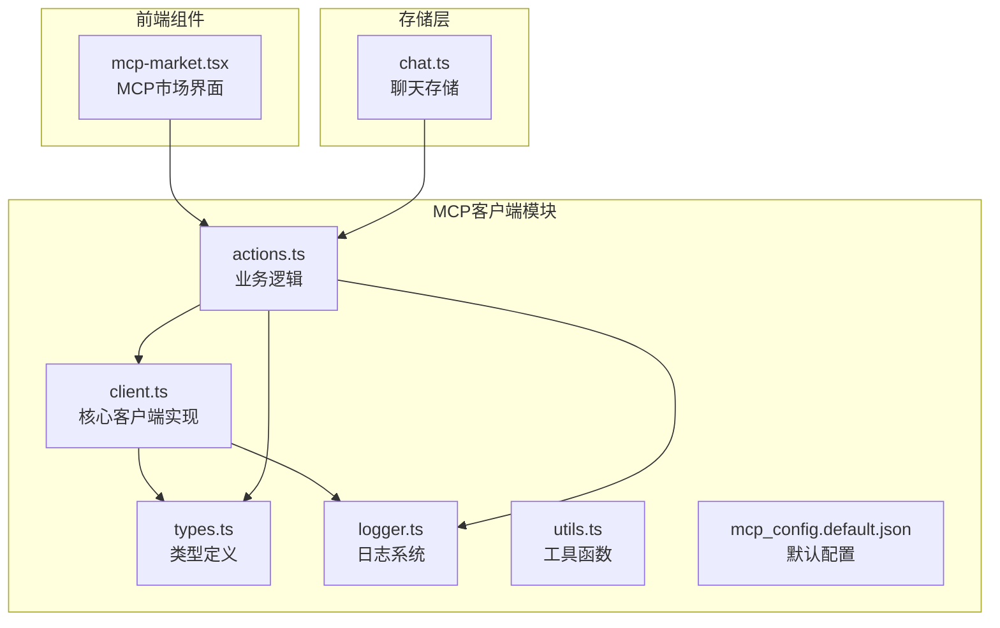
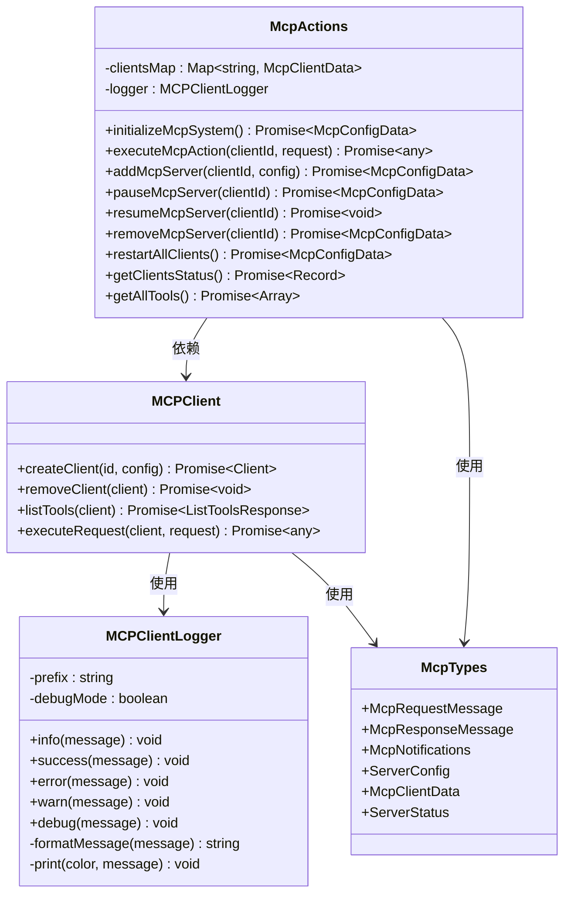
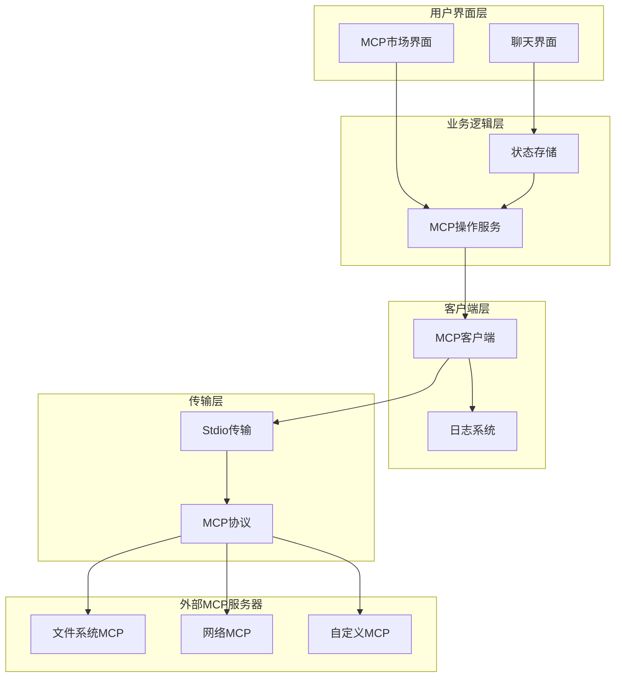
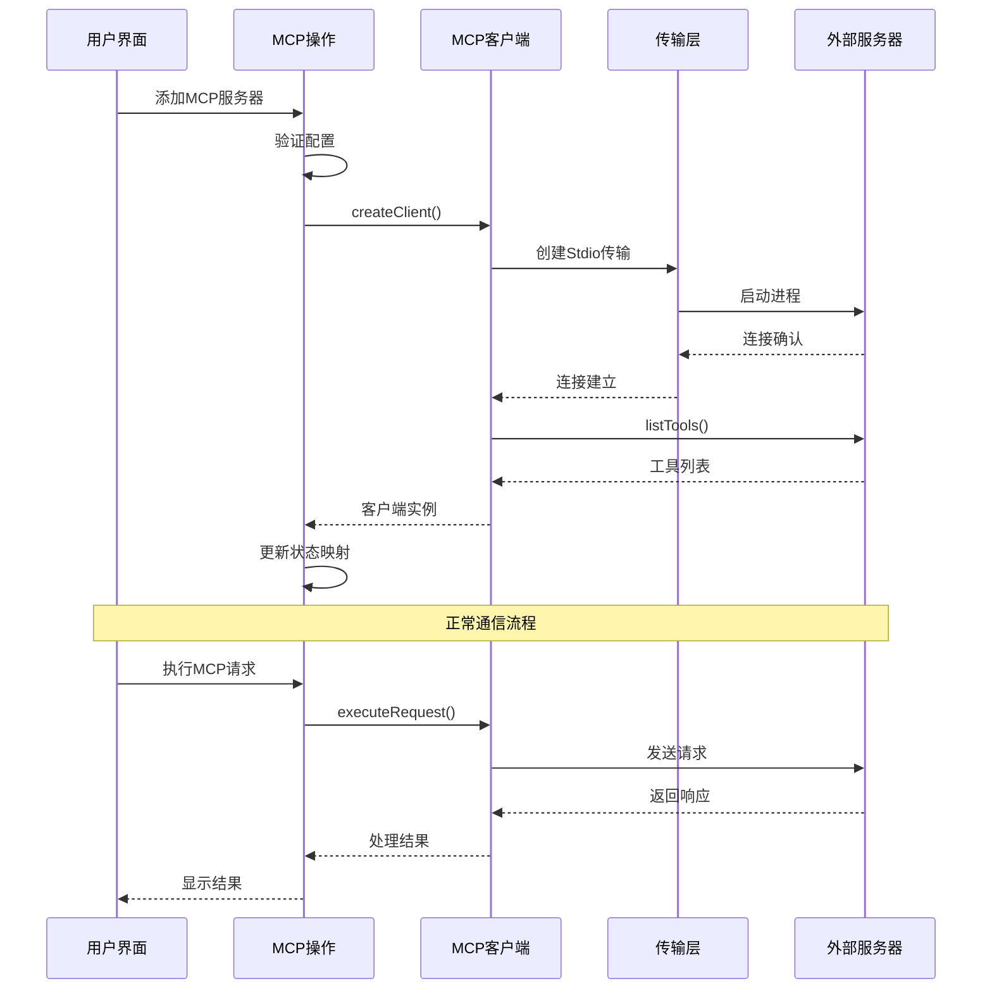
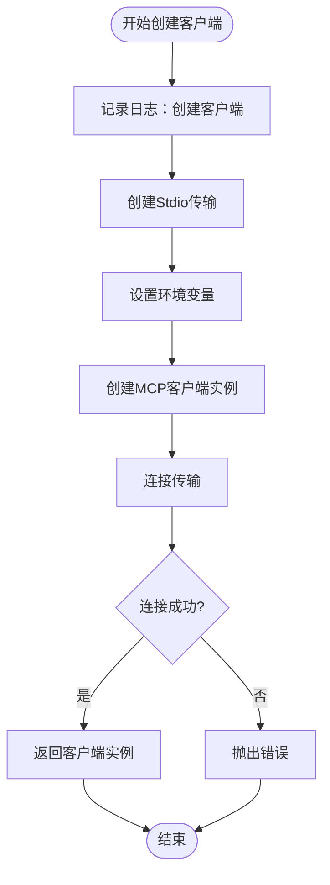
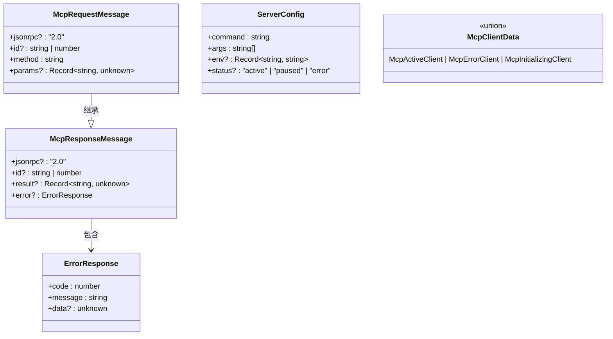
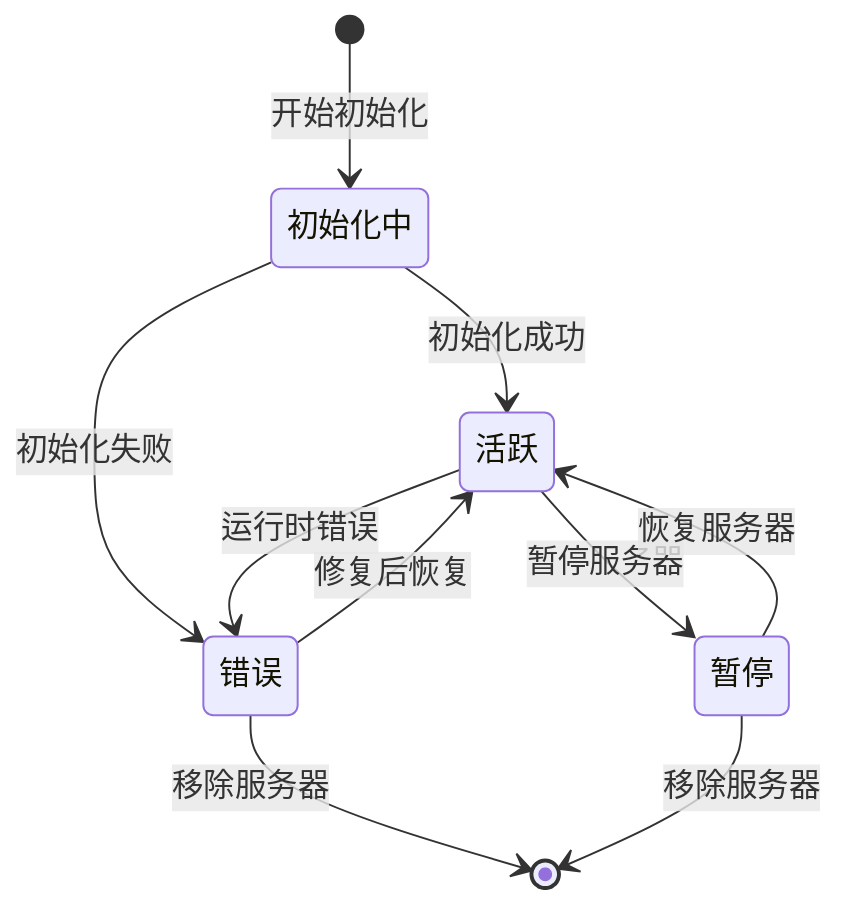
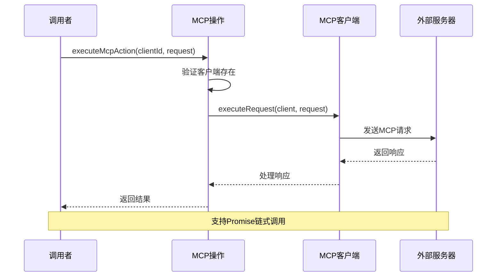
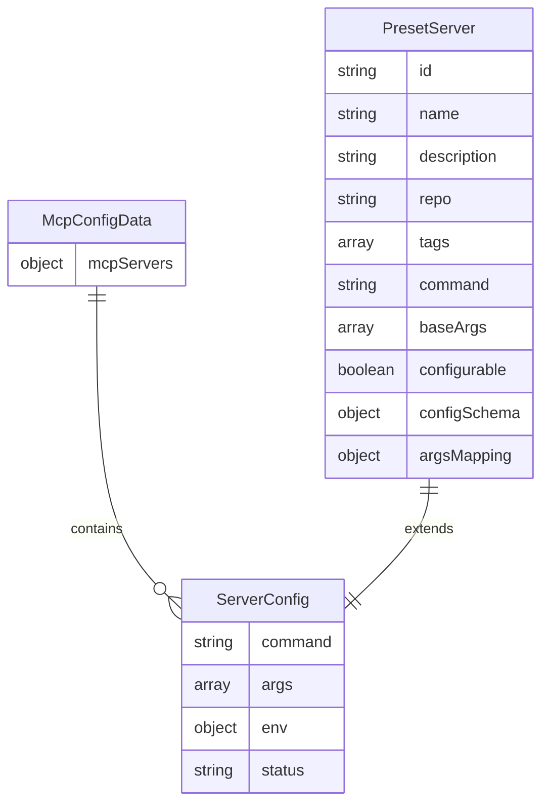
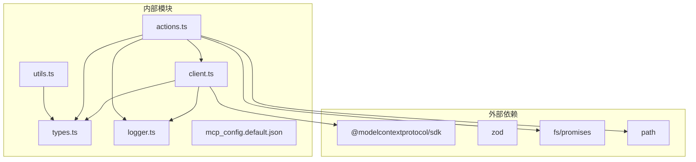

# MCP客户端实现

<cite>
**本文档中引用的文件**
- [client.ts](file://app/mcp/client.ts)
- [types.ts](file://app/mcp/types.ts)
- [logger.ts](file://app/mcp/logger.ts)
- [actions.ts](file://app/mcp/actions.ts)
- [utils.ts](file://app/mcp/utils.ts)
- [mcp_config.default.json](file://app/mcp/mcp_config.default.json)
- [chat.ts](file://app/store/chat.ts)
- [mcp-market.tsx](file://app/components/mcp-market.tsx)
</cite>

## 目录
1. [简介](#简介)
2. [项目结构](#项目结构)
3. [核心组件](#核心组件)
4. [架构概览](#架构概览)
5. [详细组件分析](#详细组件分析)
6. [依赖关系分析](#依赖关系分析)
7. [性能考虑](#性能考虑)
8. [故障排除指南](#故障排除指南)
9. [结论](#结论)

## 简介

MCP（Model Context Protocol）客户端是ChatGPT-Next-Web项目中的一个重要模块，负责与外部MCP服务器进行通信。该客户端实现了完整的MCP协议支持，包括连接建立、请求序列化、响应反序列化、错误重试等核心功能，并通过严格的类型系统确保类型安全。

MCP客户端采用异步架构设计，支持多客户端并发管理，提供了完整的生命周期管理功能，包括初始化、运行时状态监控、优雅关闭等。通过集成的日志系统，开发者可以实时监控客户端状态和调试通信过程。

## 项目结构

MCP客户端模块位于`app/mcp/`目录下，包含以下核心文件：

**图表来源**
- [client.ts](file://app/mcp/client.ts#L1-L56)
- [types.ts](file://app/mcp/types.ts#L1-L181)
- [logger.ts](file://app/mcp/logger.ts#L1-L66)
- [actions.ts](file://app/mcp/actions.ts#L1-L386)

**章节来源**
- [client.ts](file://app/mcp/client.ts#L1-L56)
- [types.ts](file://app/mcp/types.ts#L1-L181)
- [logger.ts](file://app/mcp/logger.ts#L1-L66)

## 核心组件

### 客户端核心类图

**图表来源**
- [client.ts](file://app/mcp/client.ts#L9-L55)
- [logger.ts](file://app/mcp/logger.ts#L12-L65)
- [actions.ts](file://app/mcp/actions.ts#L21-L25)
- [types.ts](file://app/mcp/types.ts#L6-L181)

**章节来源**
- [client.ts](file://app/mcp/client.ts#L1-L56)
- [logger.ts](file://app/mcp/logger.ts#L1-L66)
- [actions.ts](file://app/mcp/actions.ts#L1-L386)

## 架构概览

### 系统架构图

**图表来源**
- [actions.ts](file://app/mcp/actions.ts#L1-L386)
- [client.ts](file://app/mcp/client.ts#L1-L56)
- [mcp-market.tsx](file://app/components/mcp-market.tsx#L1-L756)

### 数据流图

**图表来源**
- [actions.ts](file://app/mcp/actions.ts#L101-L139)
- [client.ts](file://app/mcp/client.ts#L9-L55)

**章节来源**
- [actions.ts](file://app/mcp/actions.ts#L141-L161)
- [client.ts](file://app/mcp/client.ts#L9-L55)

## 详细组件分析

### 客户端创建与连接

#### 连接建立流程

MCP客户端的核心功能是通过`createClient`函数建立与外部MCP服务器的连接。该函数实现了完整的连接生命周期管理：

**图表来源**
- [client.ts](file://app/mcp/client.ts#L9-L38)

#### 环境变量处理

客户端在创建过程中会智能地处理环境变量，确保外部MCP服务器能够正确访问所需的系统资源：

- **继承当前进程环境**：从父进程继承所有可用的环境变量
- **过滤无效值**：移除值为`undefined`的环境变量
- **合并自定义配置**：允许在服务器配置中指定额外的环境变量

**章节来源**
- [client.ts](file://app/mcp/client.ts#L15-L25)

### 类型安全保障

#### 类型定义体系

MCP客户端使用严格的类型定义确保所有通信的安全性和可靠性：

**图表来源**
- [types.ts](file://app/mcp/types.ts#L6-L181)

#### Zod验证系统

客户端使用Zod库实现运行时类型验证，确保所有消息格式符合MCP协议规范：

- **请求消息验证**：验证`McpRequestMessageSchema`确保请求格式正确
- **响应消息验证**：验证`McpResponseMessageSchema`确保响应格式正确
- **通知消息验证**：验证`McpNotificationsSchema`确保通知格式正确

**章节来源**
- [types.ts](file://app/mcp/types.ts#L15-L62)

### 日志系统

#### 日志级别与颜色编码

MCP客户端内置了完整的日志系统，支持多种日志级别和彩色输出：

| 日志级别 | 颜色代码 | 用途 |
|---------|---------|------|
| Info | 蓝色 | 一般信息记录 |
| Success | 绿色 | 成功操作记录 |
| Warning | 黄色 | 警告信息记录 |
| Error | 红色 | 错误信息记录 |
| Debug | 深灰色 | 调试信息记录 |

#### 日志格式化

日志系统自动处理不同类型的消息：
- **对象类型**：转换为JSON字符串，带缩进格式化
- **原始类型**：直接转换为字符串
- **错误对象**：提取错误消息并格式化

**章节来源**
- [logger.ts](file://app/mcp/logger.ts#L1-L66)

### 业务逻辑层

#### 客户端状态管理

MCP客户端实现了复杂的状态管理系统，跟踪每个客户端的生命周期：

**图表来源**
- [actions.ts](file://app/mcp/actions.ts#L76-L100)

#### 并发客户端管理

系统使用`Map<string, McpClientData>`来管理多个并发客户端：

- **键值映射**：以客户端ID为键，存储客户端状态
- **状态隔离**：每个客户端独立的状态管理
- **并发安全**：异步操作确保线程安全

**章节来源**
- [actions.ts](file://app/mcp/actions.ts#L24-L25)

### 请求执行流程

#### 异步请求处理

MCP客户端支持异步请求处理，确保不会阻塞主线程：

**图表来源**
- [actions.ts](file://app/mcp/actions.ts#L336-L351)
- [client.ts](file://app/mcp/client.ts#L50-L55)

#### 错误处理策略

客户端实现了多层次的错误处理机制：

1. **连接级错误**：传输层连接失败
2. **协议级错误**：MCP协议错误
3. **应用级错误**：业务逻辑错误
4. **超时处理**：长时间无响应的处理

**章节来源**
- [actions.ts](file://app/mcp/actions.ts#L131-L138)
- [actions.ts](file://app/mcp/actions.ts#L260-L278)

### 配置管理

#### 配置文件结构

MCP客户端使用JSON格式的配置文件管理服务器配置：

**图表来源**
- [types.ts](file://app/mcp/types.ts#L120-L181)
- [mcp_config.default.json](file://app/mcp/mcp_config.default.json#L1-L4)

**章节来源**
- [actions.ts](file://app/mcp/actions.ts#L354-L374)
- [mcp_config.default.json](file://app/mcp/mcp_config.default.json#L1-L4)

## 依赖关系分析

### 模块依赖图

**图表来源**
- [client.ts](file://app/mcp/client.ts#L1-L6)
- [actions.ts](file://app/mcp/actions.ts#L1-L20)

### 循环依赖检测

经过分析，MCP客户端模块不存在循环依赖：
- `client.ts` → `types.ts` → `logger.ts`（单向依赖）
- `actions.ts` → `client.ts` → `types.ts` → `logger.ts`（单向依赖）
- `utils.ts` 不依赖其他MCP模块

**章节来源**
- [client.ts](file://app/mcp/client.ts#L1-L6)
- [actions.ts](file://app/mcp/actions.ts#L1-L20)

## 性能考虑

### 内存管理

MCP客户端采用了多种内存优化策略：

1. **客户端池化**：避免频繁创建和销毁客户端实例
2. **状态缓存**：缓存工具列表和客户端状态
3. **延迟初始化**：按需创建客户端连接
4. **资源清理**：及时关闭不再使用的连接

### 并发优化

- **异步操作**：所有I/O操作都是异步的
- **非阻塞设计**：避免长时间运行的同步操作
- **连接复用**：同一个客户端实例可处理多个请求

### 网络优化

- **连接池**：维护活跃的连接池
- **超时控制**：设置合理的请求超时时间
- **重试机制**：自动重试临时性错误

## 故障排除指南

### 常见问题诊断

#### 连接失败

**症状**：客户端无法连接到MCP服务器
**可能原因**：
- 服务器进程未启动
- 命令路径错误
- 权限不足
- 网络连接问题

**解决方案**：
1. 检查服务器配置中的命令和参数
2. 验证服务器进程是否正常运行
3. 查看日志获取详细错误信息

#### 工具列表为空

**症状**：`listTools()`返回空结果
**可能原因**：
- 服务器未正确实现工具接口
- 协议版本不兼容
- 认证失败

**解决方案**：
1. 验证MCP服务器的实现
2. 检查协议版本匹配
3. 确认认证凭据正确

#### 请求超时

**症状**：MCP请求长时间无响应
**可能原因**：
- 服务器处理能力不足
- 网络延迟过高
- 死锁或无限循环

**解决方案**：
1. 增加超时时间设置
2. 优化服务器性能
3. 检查服务器代码逻辑

### 调试技巧

1. **启用调试日志**：设置`debugMode: true`获取详细日志
2. **检查状态映射**：使用`getClientsStatus()`查看客户端状态
3. **验证配置**：确认配置文件格式正确
4. **测试连接**：单独测试服务器连接性

**章节来源**
- [logger.ts](file://app/mcp/logger.ts#L12-L22)
- [actions.ts](file://app/mcp/actions.ts#L27-L75)

## 结论

MCP客户端是一个设计精良、功能完整的模块，它成功地实现了MCP协议的所有核心功能。通过严格的类型系统、完善的错误处理机制和高效的并发管理，该客户端为ChatGPT-Next-Web项目提供了可靠的外部MCP服务器集成能力。

### 主要优势

1. **类型安全**：使用TypeScript和Zod确保运行时类型安全
2. **异步架构**：支持高并发和非阻塞操作
3. **完整生命周期**：从创建到销毁的完整管理
4. **详细日志**：提供全面的调试和监控支持
5. **灵活配置**：支持动态服务器管理和配置热更新

### 最佳实践建议

1. **合理设置超时**：根据服务器性能设置合适的超时时间
2. **监控客户端状态**：定期检查客户端健康状况
3. **错误处理**：实现适当的错误恢复机制
4. **资源管理**：及时清理不再使用的客户端连接
5. **日志记录**：在生产环境中启用详细日志记录

该MCP客户端模块为现代AI应用提供了强大的扩展能力，使得ChatGPT-Next-Web能够无缝集成各种外部工具和服务，极大地扩展了系统的功能边界。