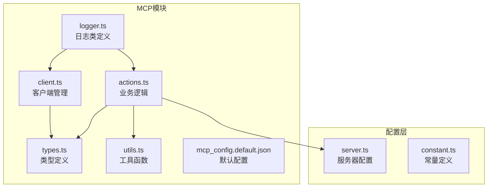
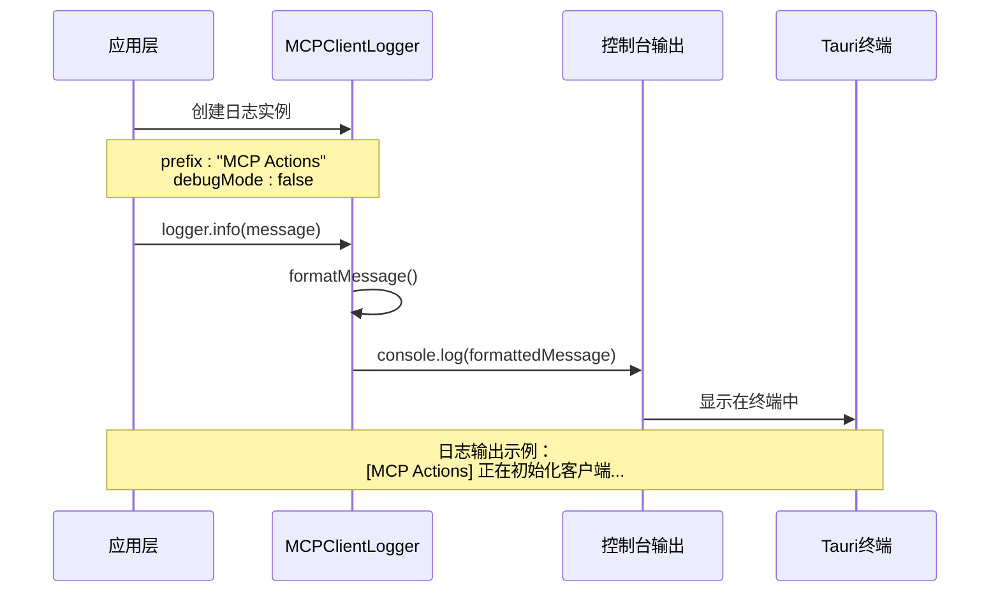
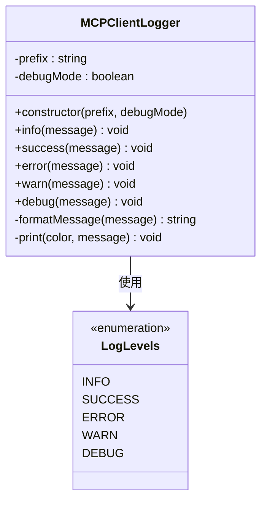
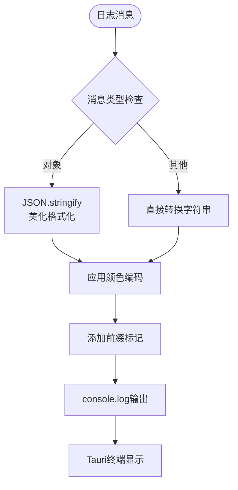
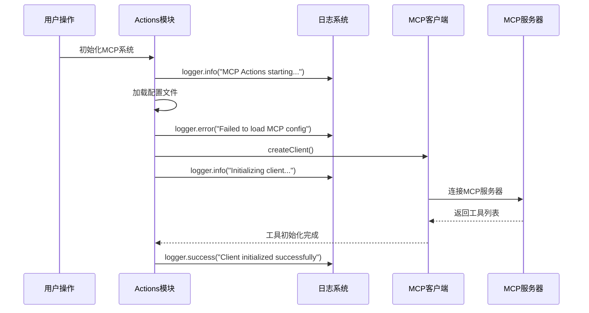
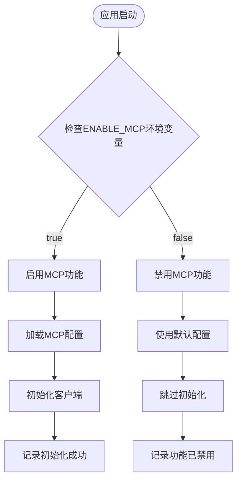
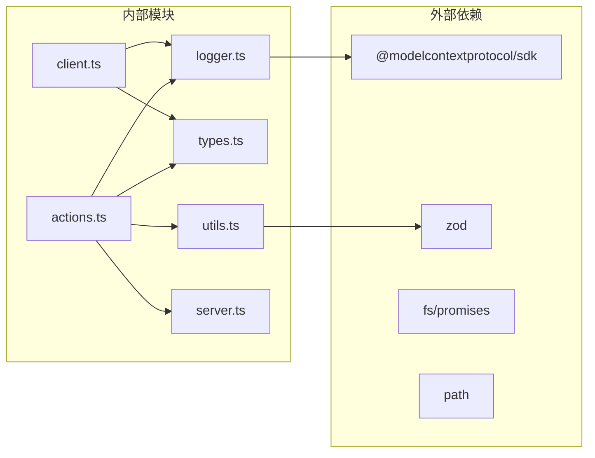
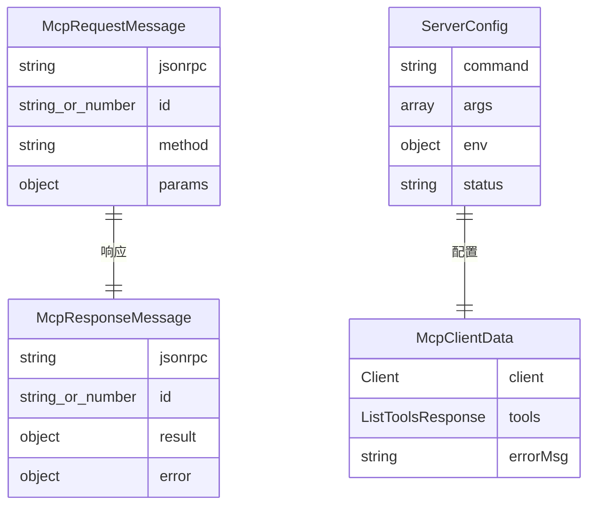

# MCP客户端日志记录系统

<cite>
**本文档中引用的文件**
- [logger.ts](file://app/mcp/logger.ts)
- [actions.ts](file://app/mcp/actions.ts)
- [client.ts](file://app/mcp/client.ts)
- [types.ts](file://app/mcp/types.ts)
- [utils.ts](file://app/mcp/utils.ts)
- [mcp_config.default.json](file://app/mcp/mcp_config.default.json)
- [server.ts](file://app/config/server.ts)
- [constant.ts](file://app/constant.ts)
</cite>

## 目录
1. [简介](#简介)
2. [项目结构](#项目结构)
3. [核心组件](#核心组件)
4. [架构概览](#架构概览)
5. [详细组件分析](#详细组件分析)
6. [依赖关系分析](#依赖关系分析)
7. [性能考虑](#性能考虑)
8. [故障排除指南](#故障排除指南)
9. [结论](#结论)

## 简介

MCP（Model Context Protocol）客户端日志记录系统是一个专为NextChat应用设计的轻量级日志框架，用于监控和调试MCP服务器连接、工具调用和系统状态。该系统提供了结构化的日志输出、颜色编码、级别分类和可配置的调试模式，帮助开发者快速定位问题并优化系统性能。

## 项目结构

MCP日志系统的核心文件组织如下：



**图表来源**
- [logger.ts](file://app/mcp/logger.ts#L1-L66)
- [actions.ts](file://app/mcp/actions.ts#L1-L386)
- [client.ts](file://app/mcp/client.ts#L1-L56)

**章节来源**
- [logger.ts](file://app/mcp/logger.ts#L1-L66)
- [actions.ts](file://app/mcp/actions.ts#L1-L386)
- [client.ts](file://app/mcp/client.ts#L1-L56)

## 核心组件

### MCPClientLogger类

MCPClientLogger是日志系统的核心类，提供以下功能：

- **日志级别支持**：info、success、error、warn、debug
- **颜色编码输出**：ANSI颜色码支持
- **智能消息格式化**：对象自动转换为JSON字符串
- **可配置前缀**：支持自定义日志前缀
- **调试模式控制**：可选择性显示调试信息

### 日志级别体系

系统定义了五种日志级别，每种都有特定的颜色编码和用途：

| 级别 | 颜色 | 用途 | 调试模式 |
|------|------|------|----------|
| info | 蓝色 | 一般信息记录 | 始终显示 |
| success | 绿色 | 成功操作确认 | 始终显示 |
| error | 红色 | 错误和异常 | 始终显示 |
| warn | 黄色 | 警告信息 | 始终显示 |
| debug | 灰色 | 调试信息 | 条件显示 |

**章节来源**
- [logger.ts](file://app/mcp/logger.ts#L12-L65)

## 架构概览

MCP日志系统采用分层架构设计，确保日志记录与业务逻辑分离：



**图表来源**
- [logger.ts](file://app/mcp/logger.ts#L58-L64)
- [actions.ts](file://app/mcp/actions.ts#L21-L21)

## 详细组件分析

### 日志类实现分析

#### 类结构设计



**图表来源**
- [logger.ts](file://app/mcp/logger.ts#L12-L65)

#### 颜色编码系统

系统使用ANSI颜色代码实现彩色输出：



**图表来源**
- [logger.ts](file://app/mcp/logger.ts#L49-L64)

**章节来源**
- [logger.ts](file://app/mcp/logger.ts#L1-L66)

### 业务层日志集成

#### Actions模块中的日志使用

Actions模块展示了日志系统在业务逻辑中的典型应用场景：



**图表来源**
- [actions.ts](file://app/mcp/actions.ts#L142-L161)
- [actions.ts](file://app/mcp/actions.ts#L112-L139)

#### 客户端管理中的日志记录

客户端生命周期管理中的关键节点都包含日志记录：

| 操作阶段 | 日志级别 | 记录内容 | 示例消息 |
|----------|----------|----------|----------|
| 初始化 | info | 开始初始化 | "Initializing client [clientId]..." |
| 成功 | success | 初始化完成 | "Client [clientId] initialized successfully" |
| 失败 | error | 初始化失败 | "Failed to initialize client [clientId]" |
| 执行请求 | info | 开始执行请求 | "Executing request for [clientId]" |
| 错误处理 | error | 请求失败 | "Failed to execute request for [clientId]" |

**章节来源**
- [actions.ts](file://app/mcp/actions.ts#L101-L386)

### 配置系统集成

#### 环境变量配置

系统通过环境变量控制MCP功能的启用状态：



**图表来源**
- [server.ts](file://app/config/server.ts#L275-L275)
- [actions.ts](file://app/mcp/actions.ts#L377-L385)

**章节来源**
- [server.ts](file://app/config/server.ts#L97-L275)
- [actions.ts](file://app/mcp/actions.ts#L377-L385)

## 依赖关系分析

### 模块依赖图



**图表来源**
- [client.ts](file://app/mcp/client.ts#L1-L6)
- [actions.ts](file://app/mcp/actions.ts#L1-L20)

### 类型系统依赖

系统类型定义展现了清晰的层次结构：



**图表来源**
- [types.ts](file://app/mcp/types.ts#L6-L33)
- [types.ts](file://app/mcp/types.ts#L113-L118)
- [types.ts](file://app/mcp/types.ts#L76-L97)

**章节来源**
- [types.ts](file://app/mcp/types.ts#L1-L181)

## 性能考虑

### 日志输出优化

1. **异步处理**：日志输出使用同步console.log，避免阻塞主线程
2. **条件编译**：debug级别的日志仅在debugMode为true时输出
3. **内存管理**：对象序列化使用JSON.stringify，避免循环引用问题

### 生产环境优化

- **减少冗余输出**：生产环境中应禁用debug模式
- **批量处理**：对于大量日志，考虑使用缓冲机制
- **性能监控**：定期检查日志输出对系统性能的影响

## 故障排除指南

### 常见问题及解决方案

#### 日志不显示问题

**问题描述**：日志信息没有出现在终端中

**可能原因**：
1. Tauri配置问题
2. 控制台输出被重定向
3. 日志级别过滤

**解决方案**：
- 检查Tauri配置中的终端设置
- 验证console.log是否正常工作
- 确认日志级别配置正确

#### MCP连接失败

**问题描述**：MCP客户端无法连接到服务器

**诊断步骤**：
1. 检查服务器配置是否正确
2. 验证网络连接状态
3. 查看详细的错误日志

**章节来源**
- [actions.ts](file://app/mcp/actions.ts#L132-L138)
- [actions.ts](file://app/mcp/actions.ts#L261-L276)

### 调试技巧

#### 启用详细日志

```typescript
// 在开发环境中启用debug模式
const logger = new MCPClientLogger("MCP Debug", true);
```

#### 日志分析方法

1. **时间戳分析**：观察操作的时间顺序
2. **错误模式识别**：查找重复出现的错误模式
3. **资源使用监控**：跟踪内存和CPU使用情况

## 结论

MCP客户端日志记录系统提供了一个完整、灵活且易于使用的日志解决方案。通过合理的架构设计、丰富的日志级别和智能的消息格式化，该系统能够有效支持开发和运维工作。系统的主要优势包括：

1. **简洁高效**：基于原生console.log，性能开销小
2. **易于配置**：支持多种配置选项和调试模式
3. **类型安全**：完整的TypeScript类型定义
4. **扩展性强**：模块化设计便于功能扩展

对于开发者而言，合理使用这个日志系统可以帮助快速定位问题、优化性能，并提升整体开发体验。在生产环境中，建议根据具体需求调整日志级别和输出策略，以平衡信息丰富性和系统性能。