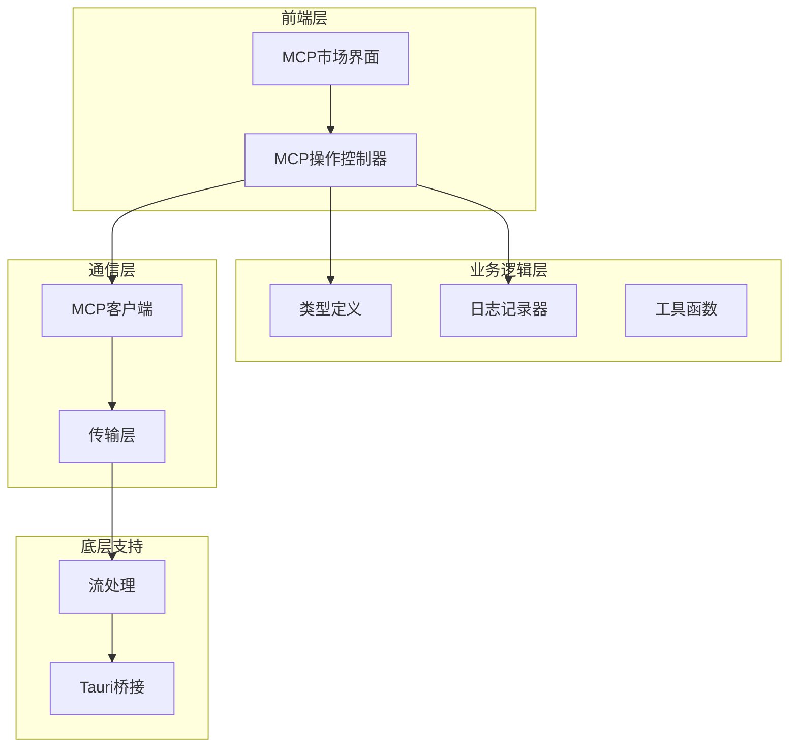
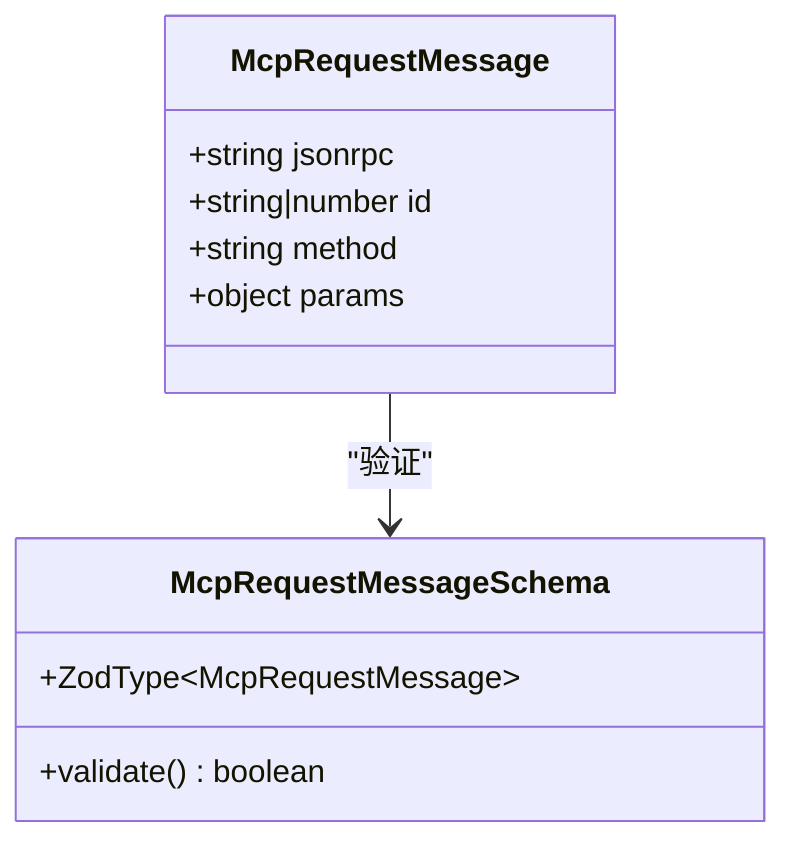
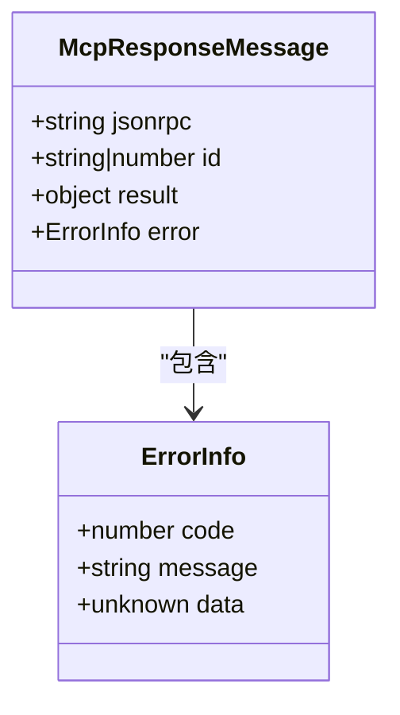
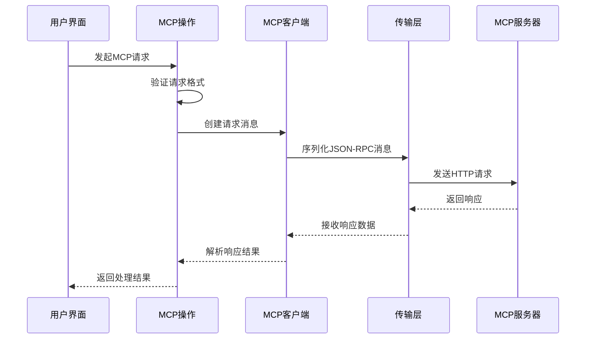
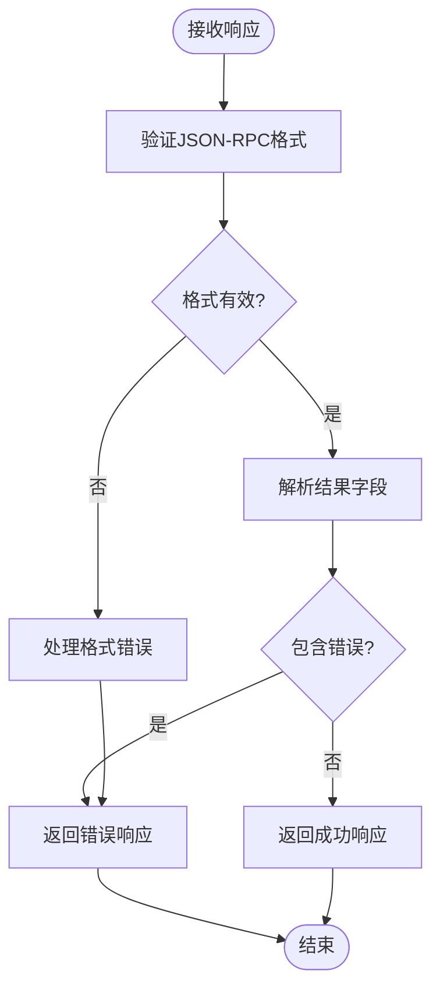
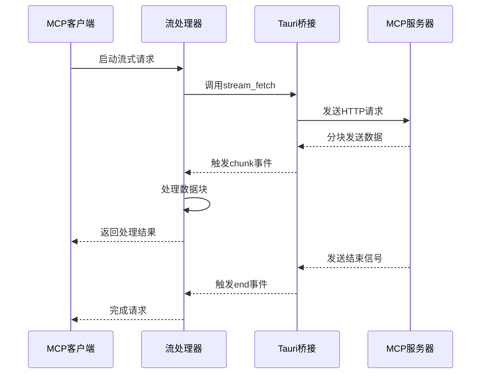
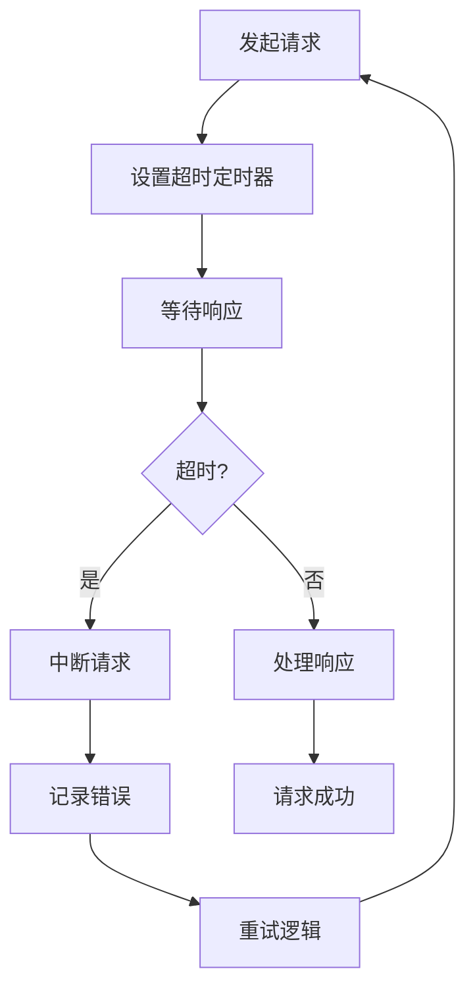
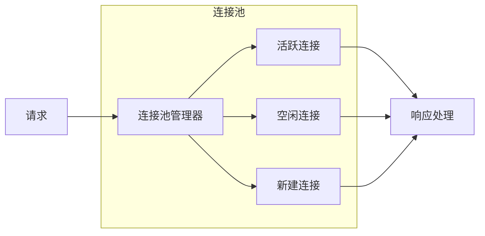
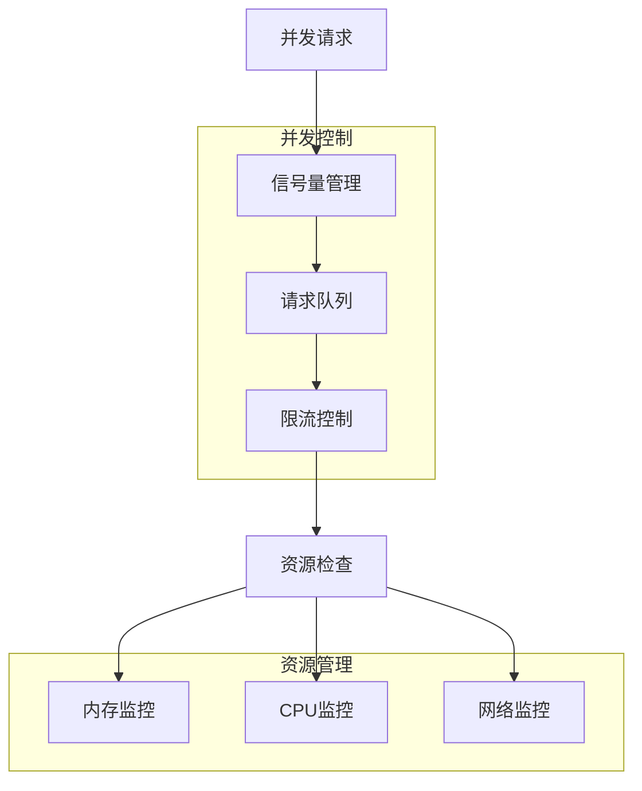

# 请求与响应处理

<cite>
**本文档中引用的文件**
- [app/mcp/types.ts](file://app/mcp/types.ts)
- [app/mcp/client.ts](file://app/mcp/client.ts)
- [app/mcp/actions.ts](file://app/mcp/actions.ts)
- [app/mcp/logger.ts](file://app/mcp/logger.ts)
- [app/mcp/utils.ts](file://app/mcp/utils.ts)
- [app/utils/stream.ts](file://app/utils/stream.ts)
- [app/components/mcp-market.tsx](file://app/components/mcp-market.tsx)
- [src-tauri/src/stream.rs](file://src-tauri/src/stream.rs)
</cite>

## 目录
1. [简介](#简介)
2. [项目架构概览](#项目架构概览)
3. [核心类型定义](#核心类型定义)
4. [请求发送流程](#请求发送流程)
5. [响应接收机制](#响应接收机制)
6. [流式响应处理](#流式响应处理)
7. [错误处理与异常管理](#错误处理与异常管理)
8. [性能优化策略](#性能优化策略)
9. [高并发场景处理](#高并发场景处理)
10. [总结](#总结)

## 简介

MCP（Model Context Protocol）客户端是ChatGPT-Next-Web项目中的重要组件，负责与外部MCP服务器进行通信。本文档深入解析MCP客户端的请求发送与响应接收流程，涵盖请求的序列化、消息格式封装、流式响应的分块处理机制，以及如何利用类型定义保障数据安全性和处理各种异常情况。

## 项目架构概览

MCP客户端采用分层架构设计，主要包含以下核心模块：



**图表来源**
- [app/mcp/actions.ts](file://app/mcp/actions.ts#L1-L50)
- [app/mcp/client.ts](file://app/mcp/client.ts#L1-L56)
- [app/utils/stream.ts](file://app/utils/stream.ts#L1-L109)

**章节来源**
- [app/mcp/actions.ts](file://app/mcp/actions.ts#L1-L386)
- [app/mcp/client.ts](file://app/mcp/client.ts#L1-L56)

## 核心类型定义

MCP客户端使用严格的类型定义来确保请求和响应的数据安全性。核心类型包括：

### 请求消息类型



**图表来源**
- [app/mcp/types.ts](file://app/mcp/types.ts#L6-L20)

### 响应消息类型



**图表来源**
- [app/mcp/types.ts](file://app/mcp/types.ts#L22-L47)

### 客户端状态类型

| 状态类型 | 描述 | 用途 |
|---------|------|------|
| `McpInitializingClient` | 初始化中 | 客户端正在建立连接 |
| `McpActiveClient` | 活跃状态 | 客户端正常工作 |
| `McpErrorClient` | 错误状态 | 客户端连接失败 |

**章节来源**
- [app/mcp/types.ts](file://app/mcp/types.ts#L67-L97)

## 请求发送流程

MCP客户端的请求发送遵循严格的JSON-RPC 2.0协议规范，通过以下步骤完成：

### 请求序列化过程



**图表来源**
- [app/mcp/actions.ts](file://app/mcp/actions.ts#L337-L351)
- [app/mcp/client.ts](file://app/mcp/client.ts#L50-L55)

### 请求拦截机制

MCP客户端实现了请求拦截功能，可以在请求发送前进行预处理：

```typescript
// 请求拦截示例路径：app/mcp/actions.ts#L337-L351
// 在executeMcpAction函数中实现请求验证和预处理
```

**章节来源**
- [app/mcp/actions.ts](file://app/mcp/actions.ts#L337-L351)

## 响应接收机制

### 响应数据解析

MCP客户端使用Zod验证库对响应数据进行严格验证：



**图表来源**
- [app/mcp/types.ts](file://app/mcp/types.ts#L22-L47)

### 异常流处理

当MCP服务器返回错误时，客户端会按照以下流程处理：

| 错误类型 | 处理方式 | 影响范围 |
|---------|----------|----------|
| 连接超时 | 自动重试机制 | 单次请求 |
| 服务器错误 | 记录日志并返回 | 单次请求 |
| 协议错误 | 格式化错误信息 | 单次请求 |
| 网络中断 | 断线重连 | 所有请求 |

**章节来源**
- [app/mcp/actions.ts](file://app/mcp/actions.ts#L131-L138)
- [app/mcp/logger.ts](file://app/mcp/logger.ts#L1-L66)

## 流式响应处理

### SSE协议支持

MCP客户端支持Server-Sent Events (SSE)协议，实现实时流式响应：



**图表来源**
- [app/utils/stream.ts](file://app/utils/stream.ts#L22-L108)
- [src-tauri/src/stream.rs](file://src-tauri/src/stream.rs#L35-L144)

### 数据分块处理

流式响应采用分块处理机制，确保大数据量的高效传输：

```typescript
// 分块处理示例路径：app/utils/stream.ts#L50-L65
// 监听stream-response事件处理数据块
```

**章节来源**
- [app/utils/stream.ts](file://app/utils/stream.ts#L50-L65)
- [src-tauri/src/stream.rs](file://src-tauri/src/stream.rs#L94-L112)

## 错误处理与异常管理

### 错误码定义

MCP客户端定义了完整的错误码体系：

| 错误码范围 | 错误类型 | 处理策略 |
|-----------|----------|----------|
| 100-199 | 网络错误 | 自动重试 |
| 200-299 | 服务器错误 | 记录日志 |
| 300-399 | 客户端错误 | 返回错误信息 |
| 400+ | 协议错误 | 终止连接 |

### 超时中断机制

客户端实现了完善的超时控制：



**图表来源**
- [app/utils/stream.ts](file://app/utils/stream.ts#L36-L48)

**章节来源**
- [app/mcp/logger.ts](file://app/mcp/logger.ts#L1-L66)
- [app/utils/stream.ts](file://app/utils/stream.ts#L36-L48)

## 性能优化策略

### 连接池管理

MCP客户端采用连接池技术提高并发性能：



### 缓存策略

客户端实现了多级缓存机制：

| 缓存级别 | 存储位置 | 生命周期 | 用途 |
|---------|----------|----------|------|
| 内存缓存 | 客户端内存 | 会话期间 | 工具列表缓存 |
| 文件缓存 | 本地文件系统 | 持久化 | 配置信息 |
| 会话缓存 | 浏览器存储 | 页面会话 | 用户偏好 |

**章节来源**
- [app/mcp/actions.ts](file://app/mcp/actions.ts#L24-L25)

## 高并发场景处理

### 并发控制机制

MCP客户端实现了智能的并发控制：



### 性能调优建议

针对高并发场景，建议采用以下优化策略：

1. **连接复用**：保持长连接减少握手开销
2. **批量处理**：合并小请求减少网络往返
3. **异步处理**：使用Promise.all处理并发请求
4. **资源监控**：实时监控系统资源使用情况
5. **降级策略**：在高负载时启用降级模式

**章节来源**
- [app/mcp/actions.ts](file://app/mcp/actions.ts#L101-L139)
- [app/components/mcp-market.tsx](file://app/components/mcp-market.tsx#L75-L89)

## 总结

MCP客户端的请求与响应处理机制体现了现代Web应用的最佳实践：

1. **类型安全**：通过Zod验证确保数据完整性
2. **协议兼容**：严格遵循JSON-RPC 2.0标准
3. **流式处理**：支持实时数据传输
4. **错误恢复**：完善的异常处理机制
5. **性能优化**：多层次的性能优化策略

这套机制不仅保证了系统的稳定性和可靠性，还为开发者提供了清晰的扩展接口和调试工具。通过合理的架构设计和性能优化，MCP客户端能够胜任各种复杂的生产环境需求。