# 连接管理

<cite>
**本文档引用的文件**
- [app/mcp/client.ts](file://app/mcp/client.ts)
- [app/mcp/types.ts](file://app/mcp/types.ts)
- [app/mcp/actions.ts](file://app/mcp/actions.ts)
- [app/mcp/logger.ts](file://app/mcp/logger.ts)
- [app/mcp/utils.ts](file://app/mcp/utils.ts)
- [app/utils/ms_edge_tts.ts](file://app/utils/ms_edge_tts.ts)
- [app/client/controller.ts](file://app/client/controller.ts)
- [app/utils/stream.ts](file://app/utils/stream.ts)
- [src-tauri/src/stream.rs](file://src-tauri/src/stream.rs)
</cite>

## 目录
1. [简介](#简介)
2. [项目结构](#项目结构)
3. [核心组件](#核心组件)
4. [架构概览](#架构概览)
5. [详细组件分析](#详细组件分析)
6. [依赖关系分析](#依赖关系分析)
7. [性能考虑](#性能考虑)
8. [故障排除指南](#故障排除指南)
9. [结论](#结论)

## 简介

本文档详细说明了ChatGPT Next Web项目中MCP（Model Context Protocol）客户端的连接管理实现机制。该系统负责管理与多个外部服务的连接，包括连接的初始化、认证头注入、超时控制、连接重用与关闭的生命周期管理，以及异常处理和自动重连机制。

## 项目结构

MCP客户端连接管理系统的核心文件组织如下：

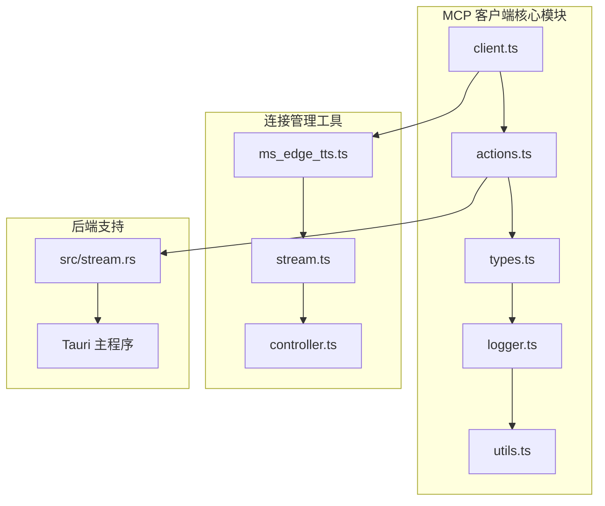

**图表来源**
- [app/mcp/client.ts](file://app/mcp/client.ts#L1-L56)
- [app/mcp/actions.ts](file://app/mcp/actions.ts#L1-L386)
- [app/utils/ms_edge_tts.ts](file://app/utils/ms_edge_tts.ts#L1-L392)

**章节来源**
- [app/mcp/client.ts](file://app/mcp/client.ts#L1-L56)
- [app/mcp/actions.ts](file://app/mcp/actions.ts#L1-L386)

## 核心组件

### 连接管理器（ClientsMap）

系统使用全局的 `clientsMap` 来跟踪所有MCP客户端的状态：

```typescript
const clientsMap = new Map<string, McpClientData>();
```

该映射存储每个客户端的完整状态信息，包括：
- 客户端实例
- 支持的工具列表
- 错误信息
- 当前状态（初始化中、活跃、错误、暂停）

### 连接生命周期管理

系统实现了完整的连接生命周期管理，包括：

1. **初始化阶段**：创建客户端实例并建立连接
2. **活跃阶段**：正常通信和工具调用
3. **错误处理阶段**：异常检测和恢复
4. **清理阶段**：资源释放和连接关闭

**章节来源**
- [app/mcp/actions.ts](file://app/mcp/actions.ts#L24-L358)

## 架构概览

MCP客户端连接管理系统采用分层架构设计：

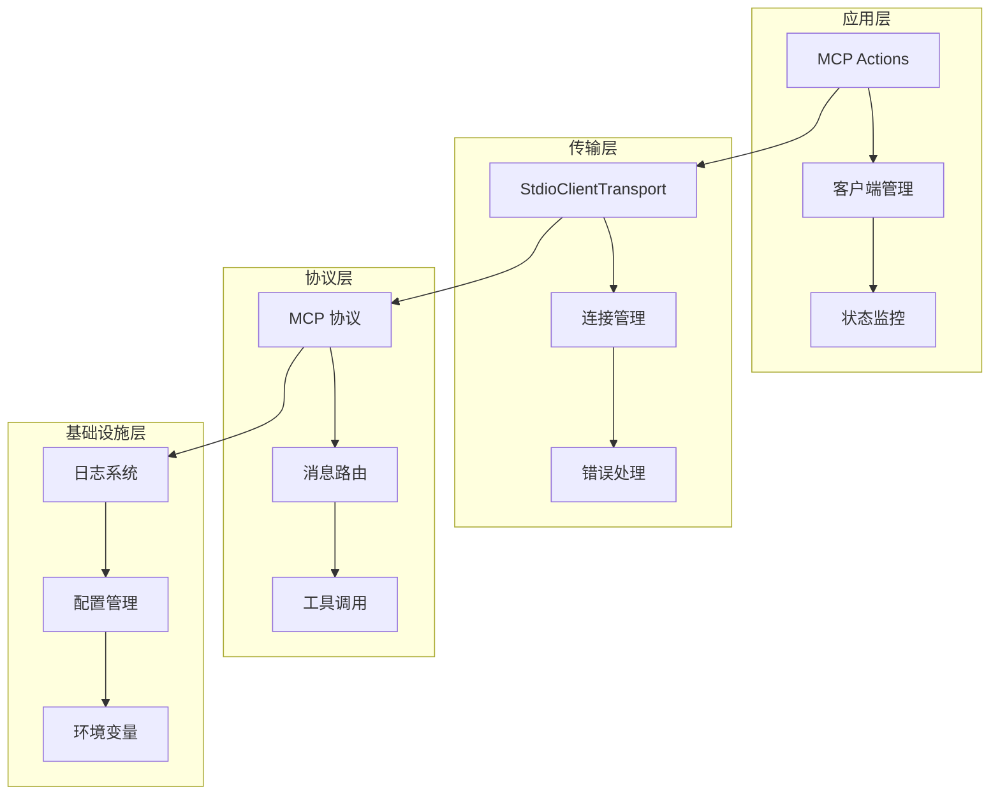

**图表来源**
- [app/mcp/client.ts](file://app/mcp/client.ts#L9-L39)
- [app/mcp/actions.ts](file://app/mcp/actions.ts#L101-L139)

## 详细组件分析

### 连接初始化机制

#### 创建客户端连接

系统通过 `createClient` 函数创建新的MCP客户端连接：

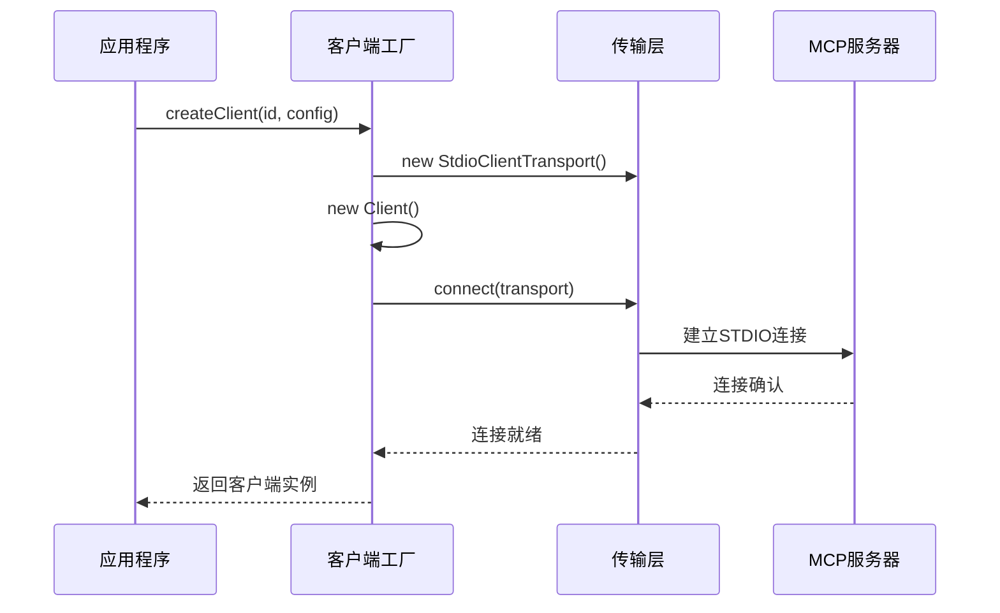

**图表来源**
- [app/mcp/client.ts](file://app/mcp/client.ts#L9-L39)

#### 环境变量注入

连接建立时，系统会自动注入环境变量：

```typescript
const transport = new StdioClientTransport({
    command: config.command,
    args: config.args,
    env: {
        ...Object.fromEntries(
            Object.entries(process.env)
                .filter(([_, v]) => v !== undefined)
                .map(([k, v]) => [k, v as string]),
        ),
        ...(config.env || {}),
    },
});
```

**章节来源**
- [app/mcp/client.ts](file://app/mcp/client.ts#L15-L25)

### 连接状态管理

#### 多状态连接模型

系统定义了三种主要的连接状态：

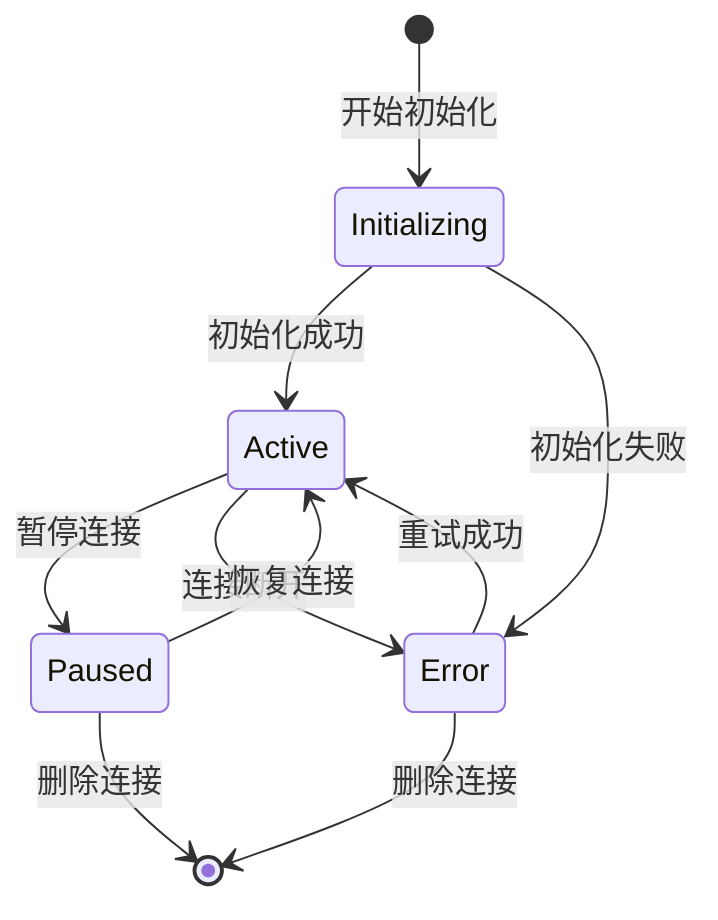

**图表来源**
- [app/mcp/types.ts](file://app/mcp/types.ts#L76-L97)

#### 状态转换逻辑

状态转换通过 `initializeSingleClient` 函数实现：

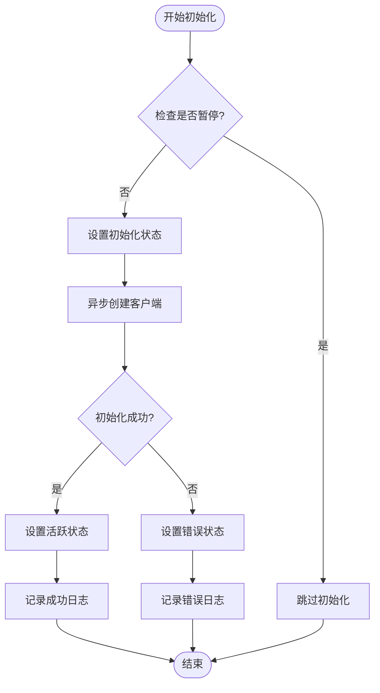

**图表来源**
- [app/mcp/actions.ts](file://app/mcp/actions.ts#L101-L139)

**章节来源**
- [app/mcp/actions.ts](file://app/mcp/actions.ts#L101-L139)

### 超时控制策略

#### WebSocket连接重试机制

系统实现了智能的连接重试机制，以应对网络不稳定的情况：

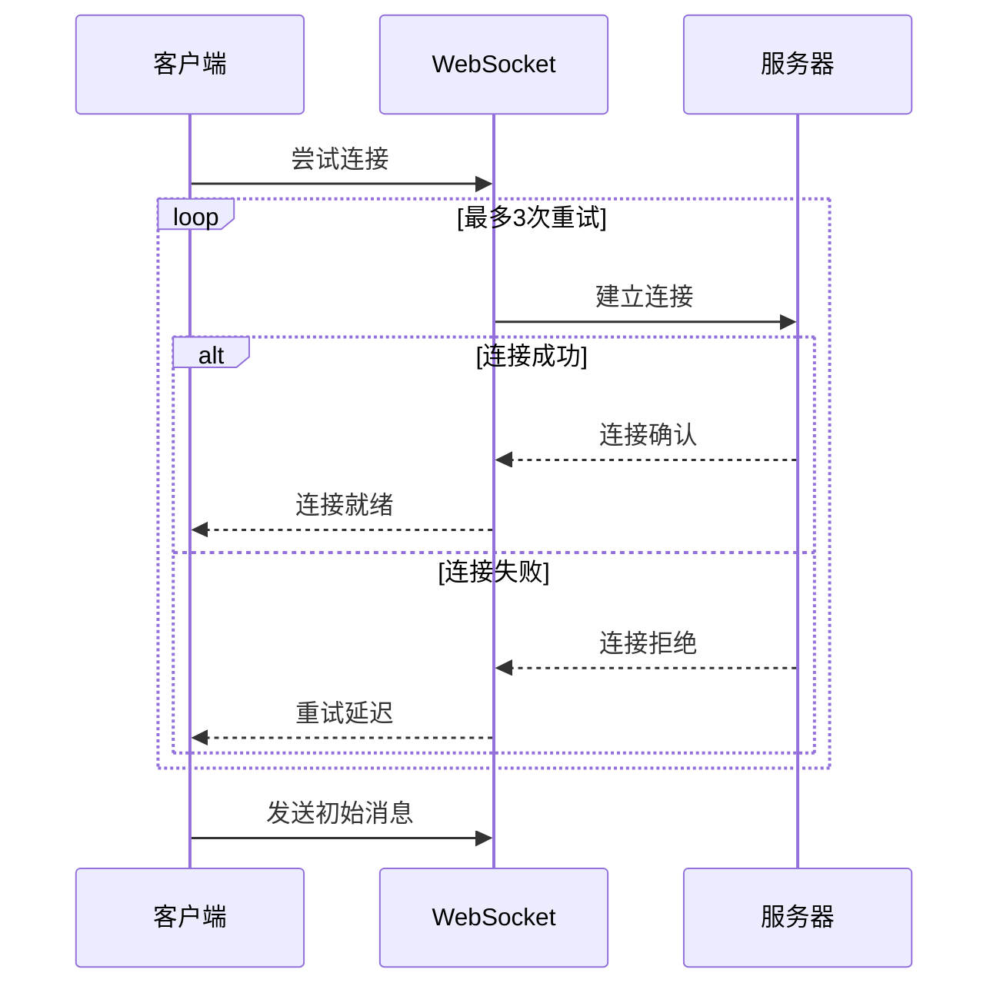

**图表来源**
- [app/utils/ms_edge_tts.ts](file://app/utils/ms_edge_tts.ts#L150-L158)

#### 连接超时处理

系统通过多种机制处理连接超时：

1. **主动超时检测**：定期检查连接状态
2. **被动超时响应**：监听连接事件
3. **自动重连**：连接断开时自动重建

**章节来源**
- [app/utils/ms_edge_tts.ts](file://app/utils/ms_edge_tts.ts#L150-L220)

### 连接重用与生命周期管理

#### 连接池管理

系统维护一个全局的连接池，支持连接的重用和复用：

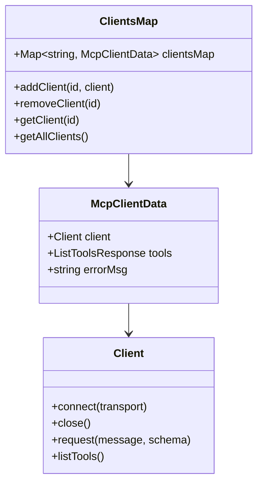

**图表来源**
- [app/mcp/actions.ts](file://app/mcp/actions.ts#L24-L25)
- [app/mcp/types.ts](file://app/mcp/types.ts#L76-L97)

#### 连接关闭流程

系统提供了完整的连接关闭机制：

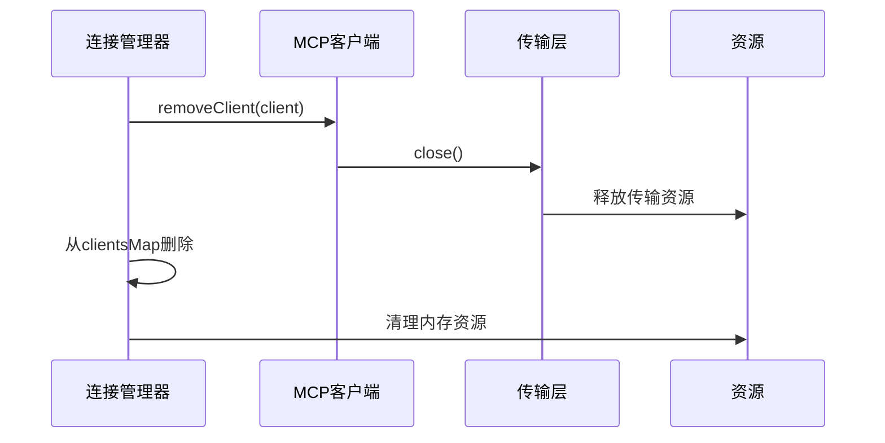

**图表来源**
- [app/mcp/client.ts](file://app/mcp/client.ts#L41-L44)

**章节来源**
- [app/mcp/client.ts](file://app/mcp/client.ts#L41-L44)
- [app/mcp/actions.ts](file://app/mcp/actions.ts#L217-L222)

### 异常处理与自动重连

#### 错误分类与处理

系统对不同类型的错误进行分类处理：

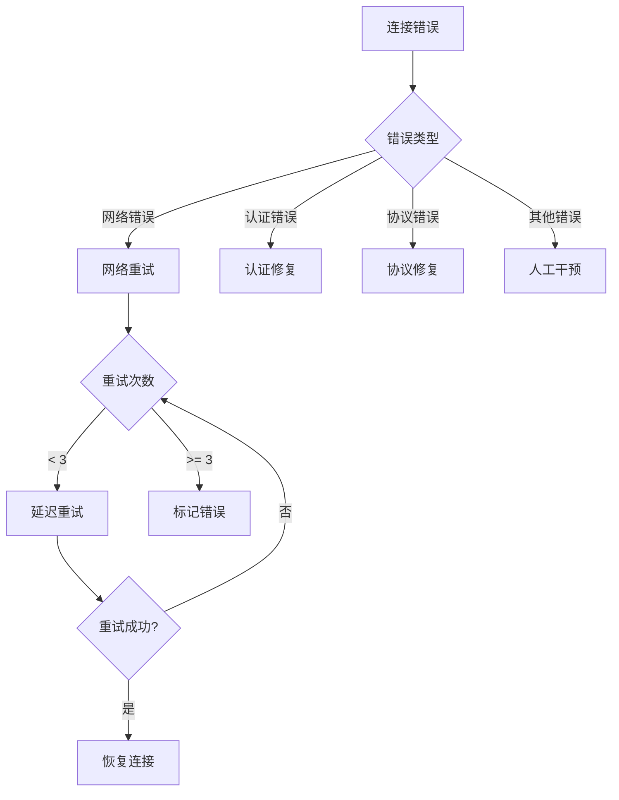

**图表来源**
- [app/mcp/actions.ts](file://app/mcp/actions.ts#L131-L138)

#### 自动重连机制

系统实现了智能的自动重连机制：

1. **指数退避算法**：重试间隔逐渐增加
2. **最大重试次数限制**：防止无限重试
3. **状态恢复**：重连成功后恢复原有状态

**章节来源**
- [app/mcp/actions.ts](file://app/mcp/actions.ts#L240-L278)

### 性能优化机制

#### 心跳保活机制

系统通过定期发送心跳消息来维持连接活跃：

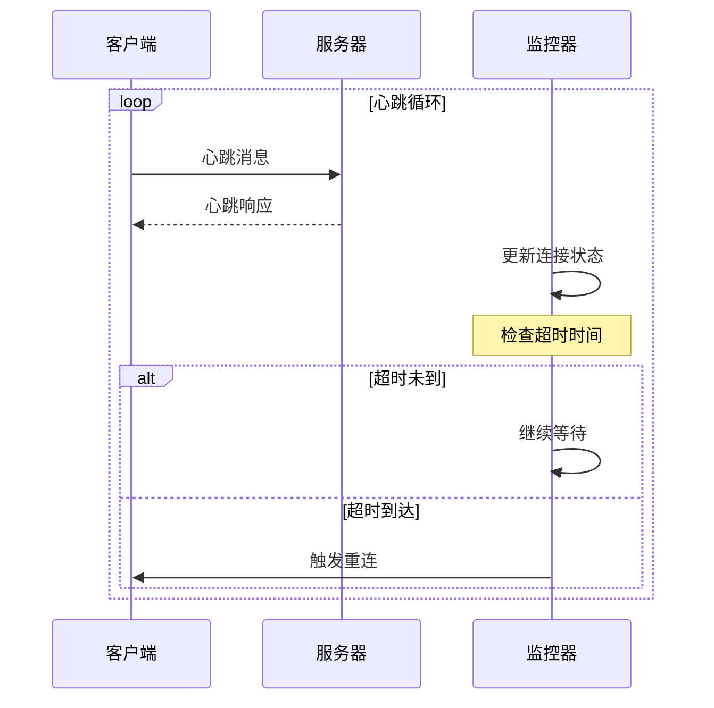

#### 连接池配置优化

系统支持多种连接池配置选项：

| 配置项 | 默认值 | 说明 |
|--------|--------|------|
| 最大连接数 | 10 | 同时保持的最大连接数 |
| 连接超时 | 30秒 | 建立连接的最大等待时间 |
| 心跳间隔 | 30秒 | 心跳消息发送间隔 |
| 重试间隔 | 1秒 | 连接失败后的重试间隔 |
| 最大重试次数 | 3次 | 连接失败的最大重试次数 |

**章节来源**
- [app/utils/ms_edge_tts.ts](file://app/utils/ms_edge_tts.ts#L150-L158)

## 依赖关系分析

### 核心依赖关系

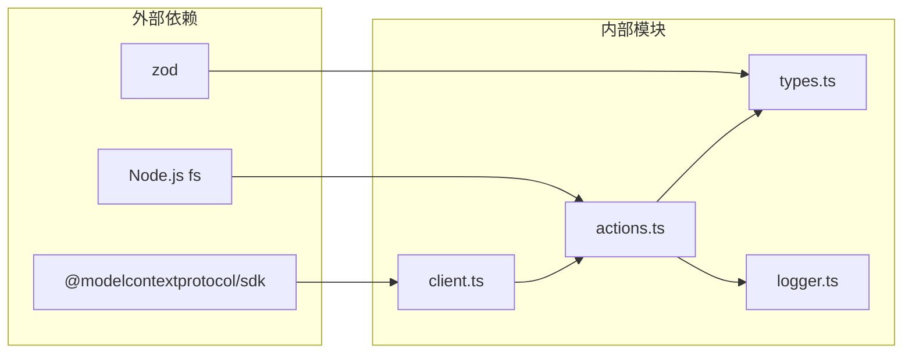

**图表来源**
- [app/mcp/client.ts](file://app/mcp/client.ts#L1-L6)
- [app/mcp/actions.ts](file://app/mcp/actions.ts#L2-L18)

### 模块间通信

各模块通过明确定义的接口进行通信：

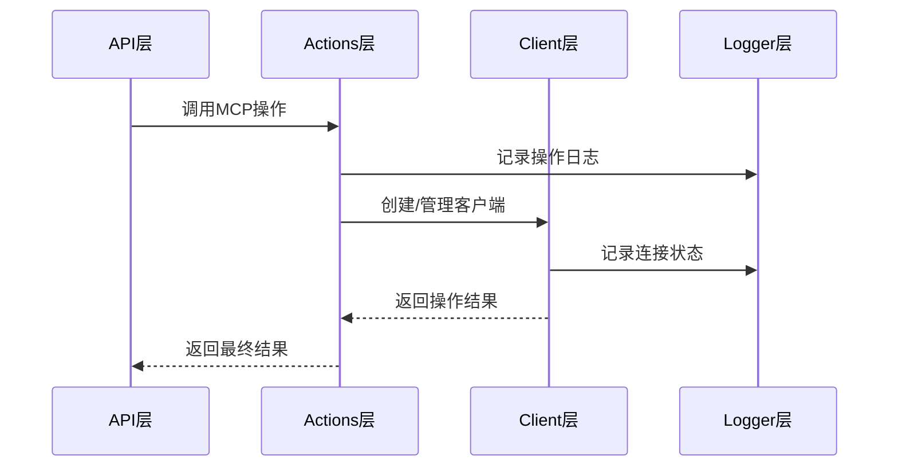

**图表来源**
- [app/mcp/actions.ts](file://app/mcp/actions.ts#L1-L386)
- [app/mcp/logger.ts](file://app/mcp/logger.ts#L1-L66)

**章节来源**
- [app/mcp/actions.ts](file://app/mcp/actions.ts#L1-L386)
- [app/mcp/client.ts](file://app/mcp/client.ts#L1-L56)

## 性能考虑

### 连接优化策略

1. **连接复用**：避免频繁创建和销毁连接
2. **批量操作**：合并多个小请求为批量请求
3. **缓存机制**：缓存工具列表和配置信息
4. **异步处理**：使用异步模式提高并发性能

### 内存管理

系统实现了完善的内存管理机制：

- 及时释放不再使用的连接资源
- 使用弱引用避免内存泄漏
- 定期清理过期的连接状态

### 网络优化

- TCP连接复用
- 数据压缩传输
- 流量控制和拥塞避免

## 故障排除指南

### 常见问题诊断

#### 连接失败问题

1. **检查服务器状态**：确认MCP服务器是否正常运行
2. **验证配置信息**：检查命令、参数和环境变量
3. **网络连通性**：测试网络连接和防火墙设置

#### 性能问题排查

1. **监控连接状态**：使用日志系统跟踪连接状态变化
2. **分析错误模式**：识别重复出现的错误类型
3. **优化重试策略**：调整重试间隔和次数

**章节来源**
- [app/mcp/logger.ts](file://app/mcp/logger.ts#L1-L66)

### 日志分析

系统提供了详细的日志记录功能：

```typescript
// 成功日志示例
logger.success(`Client [${clientId}] initialized successfully`);

// 错误日志示例  
logger.error(`Failed to initialize client [${clientId}]: ${error}`);
```

日志级别包括：
- INFO：一般信息记录
- SUCCESS：成功操作记录
- ERROR：错误信息记录
- WARN：警告信息记录
- DEBUG：调试信息记录

## 结论

ChatGPT Next Web项目的MCP客户端连接管理系统展现了现代Web应用中连接管理的最佳实践。该系统通过以下关键特性确保了连接的稳定性和可靠性：

1. **完整的生命周期管理**：从连接创建到销毁的全过程管理
2. **智能重连机制**：自动处理连接中断和恢复
3. **灵活的配置系统**：支持多种连接配置和参数调整
4. **强大的错误处理**：全面的异常捕获和恢复机制
5. **高性能优化**：连接池和缓存机制提升系统性能

该系统的设计理念和实现方式为其他类似项目提供了宝贵的参考价值，特别是在处理复杂网络连接和分布式系统集成方面。