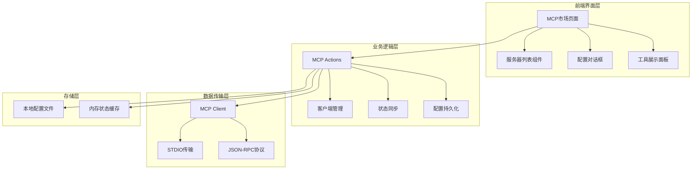
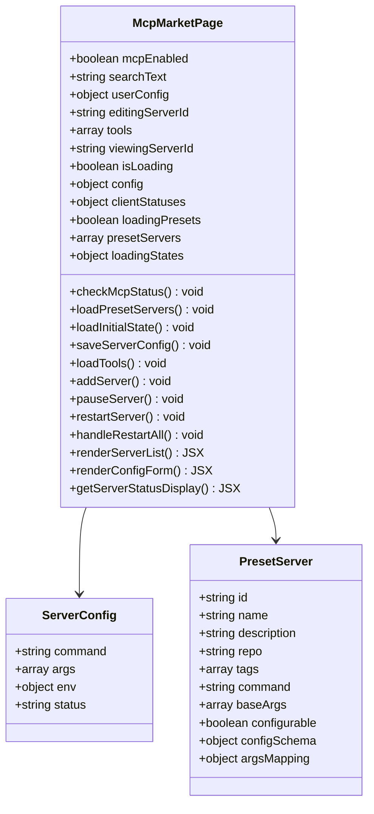
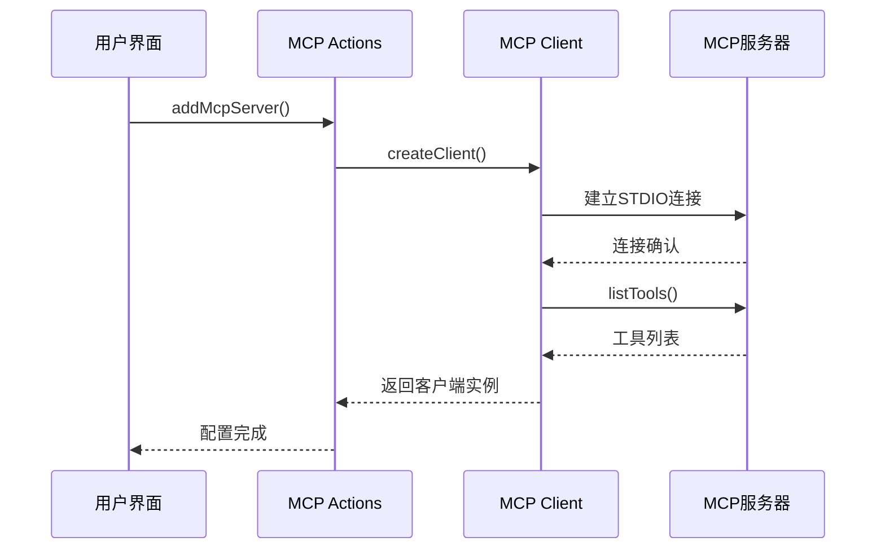
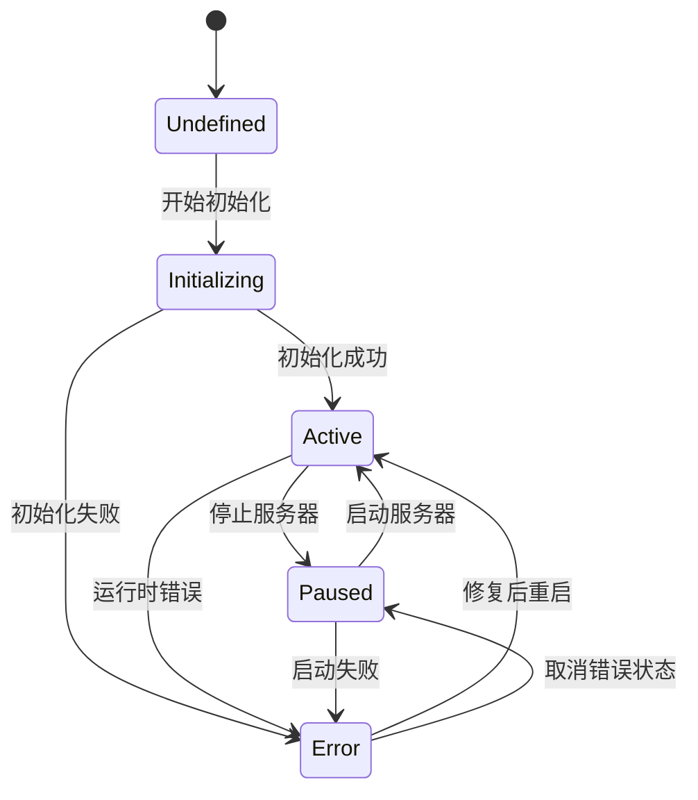
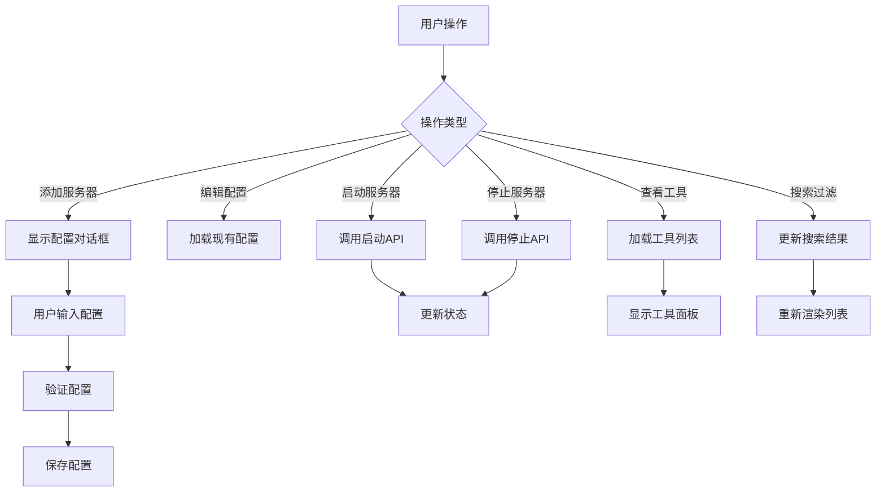
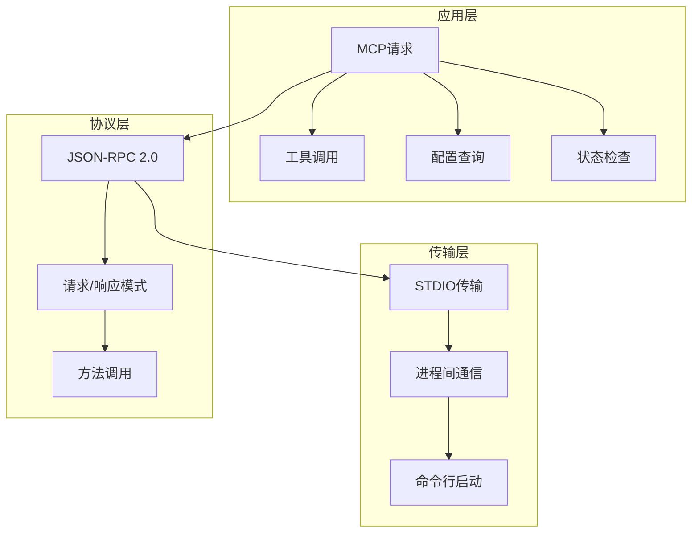
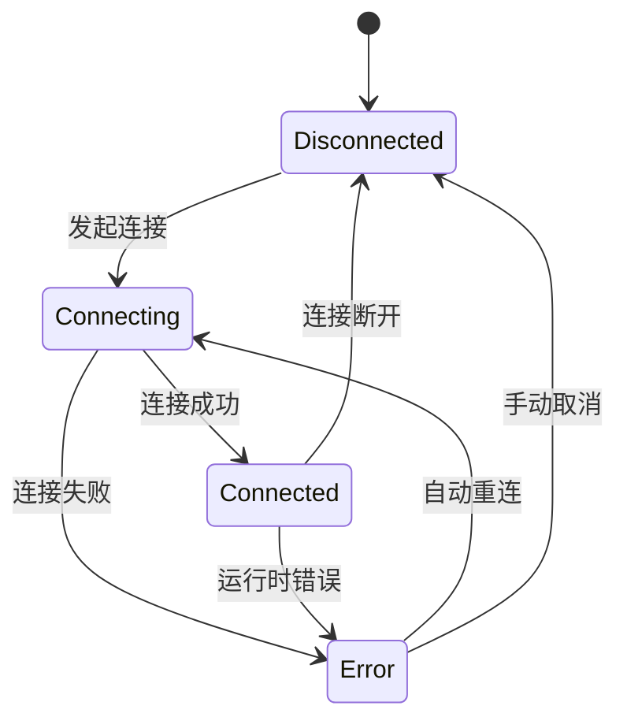
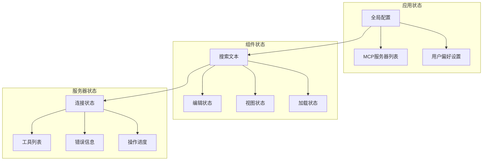
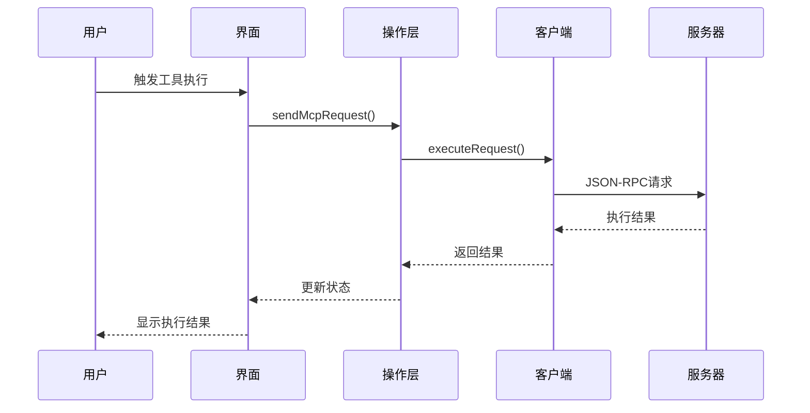

# MCP用户界面集成

<cite>
**本文档中引用的文件**
- [mcp-market.tsx](file://app/components/mcp-market.tsx)
- [mcp-market.module.scss](file://app/components/mcp-market.module.scss)
- [client.ts](file://app/mcp/client.ts)
- [types.ts](file://app/mcp/types.ts)
- [logger.ts](file://app/mcp/logger.ts)
- [actions.ts](file://app/mcp/actions.ts)
- [utils.ts](file://app/mcp/utils.ts)
- [mcp_config.default.json](file://app/mcp/mcp_config.default.json)
- [ui-lib.tsx](file://app/components/ui-lib.tsx)
</cite>

## 目录
1. [项目概述](#项目概述)
2. [架构设计](#架构设计)
3. [核心组件分析](#核心组件分析)
4. [UI组件设计](#ui组件设计)
5. [交互逻辑](#交互逻辑)
6. [MCP客户端通信](#mcp客户端通信)
7. [状态管理](#状态管理)
8. [用户操作流程](#用户操作流程)
9. [界面定制化](#界面定制化)
10. [无障碍访问支持](#无障碍访问支持)
11. [性能优化](#性能优化)
12. [故障排除](#故障排除)

## 项目概述

MCP市场界面（MCP Market）是ChatGPT-Next-Web项目中的一个核心组件，负责管理和展示Model Context Protocol (MCP) 服务器的配置、状态和工具。该界面提供了完整的MCP服务器生命周期管理功能，包括服务器发现、配置、启动、停止、工具发现等操作。

### 主要功能特性

- **服务器管理**：支持添加、删除、启动、停止MCP服务器
- **工具发现**：自动发现并展示服务器提供的工具
- **状态监控**：实时显示服务器运行状态和错误信息
- **配置管理**：支持服务器配置的动态修改
- **批量操作**：支持一键重启所有服务器
- **权限控制**：基于MCP协议的安全访问控制

## 架构设计

MCP市场界面采用模块化架构设计，主要包含以下层次：

**图表来源**
- [mcp-market.tsx](file://app/components/mcp-market.tsx#L43-L756)
- [actions.ts](file://app/mcp/actions.ts#L26-L386)
- [client.ts](file://app/mcp/client.ts#L9-L56)

## 核心组件分析

### MCP市场主页面组件

MCP市场主页面是一个功能完整的React组件，负责协调所有子组件的工作。该组件维护了复杂的状态管理系统，包括服务器配置状态、加载状态、搜索状态等。

#### 组件状态结构

**图表来源**
- [mcp-market.tsx](file://app/components/mcp-market.tsx#L43-L756)
- [types.ts](file://app/mcp/types.ts#L112-L181)

**章节来源**
- [mcp-market.tsx](file://app/components/mcp-market.tsx#L43-L756)

### MCP客户端管理器

MCP客户端管理器负责与后端MCP服务器建立连接、发送请求和处理响应。它封装了底层的STDIO传输和JSON-RPC协议细节。

#### 客户端生命周期管理

**图表来源**
- [actions.ts](file://app/mcp/actions.ts#L164-L192)
- [client.ts](file://app/mcp/client.ts#L9-L56)

**章节来源**
- [client.ts](file://app/mcp/client.ts#L9-L56)
- [actions.ts](file://app/mcp/actions.ts#L101-L139)

## UI组件设计

### 页面布局结构

MCP市场页面采用现代化的卡片式布局设计，每个MCP服务器都以独立的卡片形式展示，提供清晰的信息层次结构。

#### 页面元素分布

| 区域 | 组件 | 功能描述 |
|------|------|----------|
| 顶部标题栏 | Window Header | 显示页面标题、服务器数量统计、批量操作按钮 |
| 搜索过滤区 | Search Bar | 支持按名称、描述、标签搜索服务器 |
| 服务器列表区 | Server List | 展示所有可选的MCP服务器及其状态 |
| 配置对话框 | Modal Form | 编辑服务器配置参数 |
| 工具展示面板 | Tool Viewer | 显示服务器提供的工具列表 |

### 服务器卡片设计

每个服务器卡片包含以下关键信息：

- **服务器标识**：名称、状态指示器、仓库链接
- **描述信息**：简短描述、标签分类
- **操作按钮**：根据服务器状态显示不同的操作选项
- **状态反馈**：实时显示服务器运行状态和错误信息

#### 状态指示器设计

**图表来源**
- [mcp-market.tsx](file://app/components/mcp-market.tsx#L409-L439)
- [types.ts](file://app/mcp/types.ts#L100-L109)

**章节来源**
- [mcp-market.tsx](file://app/components/mcp-market.tsx#L449-L633)
- [mcp-market.module.scss](file://app/components/mcp-market.module.scss#L132-L234)

### 配置表单组件

配置表单支持多种输入类型，包括字符串、数组等，提供直观的用户界面来配置服务器参数。

#### 输入类型支持

| 类型 | 组件 | 特性 |
|------|------|------|
| 字符串 | 文本输入框 | 支持占位符、验证提示 |
| 数组 | 动态列表 | 支持添加、删除、重排序 |
| 环境变量 | 键值对 | 支持多环境变量配置 |

**章节来源**
- [mcp-market.tsx](file://app/components/mcp-market.tsx#L329-L407)

## 交互逻辑

### 事件处理机制

MCP市场界面实现了完整的事件处理机制，支持用户的各种操作需求。

#### 主要交互流程

**图表来源**
- [mcp-market.tsx](file://app/components/mcp-market.tsx#L256-L312)

### 加载状态管理

界面实现了细粒度的加载状态管理，确保用户能够清楚地了解操作进度。

#### 加载状态类型

- **全局加载**：批量操作时显示整体进度
- **服务器级加载**：单个服务器操作时的进度指示
- **工具加载**：工具列表获取过程中的加载动画

**章节来源**
- [mcp-market.tsx](file://app/components/mcp-market.tsx#L244-L253)

## MCP客户端通信

### 通信协议栈

MCP客户端采用标准的Model Context Protocol (MCP) 协议，通过STDIO传输层与服务器进行通信。

#### 协议层次结构

**图表来源**
- [client.ts](file://app/mcp/client.ts#L15-L38)
- [types.ts](file://app/mcp/types.ts#L6-L33)

### 客户端连接管理

客户端连接管理实现了智能的连接池和重连机制，确保系统的稳定性和可靠性。

#### 连接状态管理

**图表来源**
- [client.ts](file://app/mcp/client.ts#L10-L56)
- [actions.ts](file://app/mcp/actions.ts#L101-L139)

**章节来源**
- [client.ts](file://app/mcp/client.ts#L9-L56)
- [actions.ts](file://app/mcp/actions.ts#L26-L386)

## 状态管理

### 状态架构设计

MCP市场界面采用了集中式状态管理模式，通过React Hooks和自定义状态管理器来维护复杂的业务状态。

#### 状态分层结构

**图表来源**
- [mcp-market.tsx](file://app/components/mcp-market.tsx#L45-L60)

### 状态同步机制

系统实现了实时的状态同步机制，确保界面状态与后端服务器状态保持一致。

#### 轮询机制

- **状态轮询**：每秒轮询一次服务器状态
- **配置同步**：配置变更时立即同步到文件系统
- **工具刷新**：服务器状态变化时自动刷新工具列表

**章节来源**
- [mcp-market.tsx](file://app/components/mcp-market.tsx#L74-L89)
- [actions.ts](file://app/mcp/actions.ts#L27-L75)

## 用户操作流程

### 浏览工具流程

用户可以通过MCP市场界面浏览可用的MCP服务器和它们提供的工具。

#### 操作步骤

1. **服务器发现**：系统自动加载预设服务器列表
2. **服务器筛选**：用户可以使用搜索功能筛选服务器
3. **状态查看**：查看服务器的运行状态和可用性
4. **工具探索**：点击"Tools"按钮查看服务器提供的工具

### 查看权限要求流程

每个MCP工具都有特定的权限要求，系统会显示这些要求供用户参考。

#### 权限信息展示

- **工具名称**：清晰的工具标识
- **描述信息**：详细的工具功能说明
- **输入参数**：工具所需的输入参数说明
- **权限要求**：工具执行所需的权限级别

### 触发执行流程

用户可以触发MCP工具的执行，并监控执行过程。

#### 执行监控

**图表来源**
- [actions.ts](file://app/mcp/actions.ts#L337-L352)
- [client.ts](file://app/mcp/client.ts#L50-L56)

### 监控运行状态流程

系统提供实时的服务器运行状态监控功能。

#### 状态监控指标

- **连接状态**：服务器是否在线
- **响应时间**：服务器响应延迟
- **错误率**：操作失败比例
- **资源使用**：CPU、内存使用情况

**章节来源**
- [mcp-market.tsx](file://app/components/mcp-market.tsx#L228-L242)
- [actions.ts](file://app/mcp/actions.ts#L27-L75)

## 界面定制化

### 主题适配

MCP市场界面支持完整的主题定制，包括颜色方案、字体大小、间距等。

#### 主题配置项

| 配置项 | 默认值 | 描述 |
|--------|--------|------|
| 主色调 | --primary | 系统主色调 |
| 背景色 | --white | 页面背景色 |
| 边框色 | --border-in-light | 边框颜色 |
| 字体颜色 | --black | 主要文字颜色 |
| 悬停效果 | --primary-10 | 悬停时的透明度 |

### 响应式设计

界面采用响应式设计，能够在不同尺寸的设备上正常显示。

#### 断点设置

- **移动端**：< 768px
- **平板端**：768px - 1024px  
- **桌面端**：> 1024px

### 可访问性增强

界面实现了基本的可访问性支持，包括键盘导航和屏幕阅读器支持。

#### 可访问性特性

- **键盘导航**：支持Tab键导航所有交互元素
- **ARIA标签**：为重要元素添加语义化标签
- **焦点管理**：合理的焦点顺序和视觉指示
- **高对比度**：支持高对比度模式

**章节来源**
- [mcp-market.module.scss](file://app/components/mcp-market.module.scss#L1-L658)

## 无障碍访问支持

### 键盘导航支持

MCP市场界面完全支持键盘导航，用户可以通过键盘快捷键完成所有操作。

#### 键盘快捷键

| 快捷键 | 功能 |
|--------|------|
| Tab | 在可交互元素间切换 |
| Enter | 确认当前操作 |
| Escape | 取消当前操作 |
| Arrow Keys | 导航菜单选项 |

### 屏幕阅读器支持

界面为屏幕阅读器提供了完整的语义化标记。

#### ARIA属性使用

- **role**：定义元素角色（button, dialog, listbox等）
- **aria-label**：为元素提供可读的标签
- **aria-describedby**：关联描述信息
- **aria-expanded**：指示折叠/展开状态

### 高对比度模式

界面支持高对比度模式，确保视力障碍用户能够正常使用。

#### 对比度调整

- **文字对比度**：至少4.5:1的对比度
- **交互元素**：明显的视觉区分
- **状态指示**：清晰的状态反馈

## 性能优化

### 渲染优化

界面实现了多项渲染优化技术，确保流畅的用户体验。

#### 优化策略

- **虚拟滚动**：大量服务器列表的虚拟化处理
- **懒加载**：工具列表的按需加载
- **防抖处理**：搜索输入的防抖机制
- **状态缓存**：避免重复的API调用

### 内存管理

系统实现了智能的内存管理机制，防止内存泄漏。

#### 内存优化

- **组件卸载**：及时清理事件监听器
- **定时器管理**：自动清理轮询定时器
- **缓存清理**：定期清理过期的客户端实例

### 网络优化

网络请求经过优化，减少不必要的数据传输。

#### 网络优化技术

- **请求合并**：将多个小请求合并为大请求
- **缓存策略**：合理利用浏览器缓存
- **压缩传输**：启用gzip压缩
- **CDN加速**：静态资源使用CDN

## 故障排除

### 常见问题诊断

#### 服务器连接失败

**症状**：服务器状态显示为"Error"
**可能原因**：
- 服务器进程未启动
- 端口被占用
- 权限不足
- 配置参数错误

**解决方法**：
1. 检查服务器进程状态
2. 验证端口可用性
3. 确认执行权限
4. 重新配置服务器

#### 工具列表为空

**症状**：点击"Tools"按钮后显示无工具
**可能原因**：
- 服务器未正确初始化
- 网络连接问题
- 协议版本不匹配

**解决方法**：
1. 重启服务器
2. 检查网络连接
3. 更新协议版本

#### 配置保存失败

**症状**：配置修改后无法保存
**可能原因**：
- 文件权限问题
- 磁盘空间不足
- 配置格式错误

**解决方法**：
1. 检查文件权限
2. 清理磁盘空间
3. 验证配置格式

### 日志记录

系统提供了完整的日志记录功能，便于问题诊断和性能监控。

#### 日志级别

| 级别 | 描述 | 使用场景 |
|------|------|----------|
| INFO | 一般信息 | 正常操作记录 |
| SUCCESS | 成功操作 | 操作成功确认 |
| WARN | 警告信息 | 潜在问题提醒 |
| ERROR | 错误信息 | 操作失败记录 |

**章节来源**
- [logger.ts](file://app/mcp/logger.ts#L12-L66)

### 调试工具

界面内置了调试工具，帮助开发者快速定位问题。

#### 调试功能

- **状态检查器**：查看当前应用状态
- **网络监控**：监控API请求状态
- **性能分析**：分析渲染性能
- **错误追踪**：跟踪错误发生位置

## 总结

MCP市场界面是一个功能完整、设计精良的用户界面组件，它成功地将复杂的MCP服务器管理功能转化为直观易用的图形界面。通过模块化的架构设计、完善的交互逻辑和优秀的用户体验，该组件为用户提供了强大的MCP服务器管理能力。

### 技术亮点

1. **模块化架构**：清晰的组件分离和职责划分
2. **实时状态同步**：高效的轮询机制和状态管理
3. **丰富的交互**：完整的用户操作支持
4. **性能优化**：多项优化技术确保流畅体验
5. **可扩展性**：良好的代码结构便于功能扩展

### 应用价值

MCP市场界面不仅是一个技术实现，更是现代Web应用开发的最佳实践体现。它展示了如何将复杂的后端功能转化为优秀的用户体验，为类似项目的开发提供了宝贵的参考价值。