# MCP配置管理

<cite>
**本文档中引用的文件**
- [mcp_config.default.json](file://app/mcp/mcp_config.default.json)
- [types.ts](file://app/mcp/types.ts)
- [utils.ts](file://app/mcp/utils.ts)
- [actions.ts](file://app/mcp/actions.ts)
- [client.ts](file://app/mcp/client.ts)
- [server.ts](file://app/config/server.ts)
- [logger.ts](file://app/mcp/logger.ts)
- [mcp-market.tsx](file://app/components/mcp-market.tsx)
</cite>

## 目录
1. [简介](#简介)
2. [项目结构](#项目结构)
3. [核心配置文件](#核心配置文件)
4. [配置架构概览](#配置架构概览)
5. [详细组件分析](#详细组件分析)
6. [配置加载与合并逻辑](#配置加载与合并逻辑)
7. [环境变量与运行时设置](#环境变量与运行时设置)
8. [配置验证与错误处理](#配置验证与错误处理)
9. [实际配置示例](#实际配置示例)
10. [常见配置错误排查](#常见配置错误排查)
11. [总结](#总结)

## 简介

MCP（Model Context Protocol）配置管理系统是ChatGPT-Next-Web项目中用于管理MCP服务器连接的核心模块。该系统提供了完整的配置文件管理、服务器生命周期控制、以及用户友好的配置界面。通过统一的配置架构，系统能够灵活地管理多个MCP服务器实例，支持动态启停、状态监控和错误恢复。

## 项目结构

MCP配置管理系统采用模块化设计，主要包含以下核心文件：

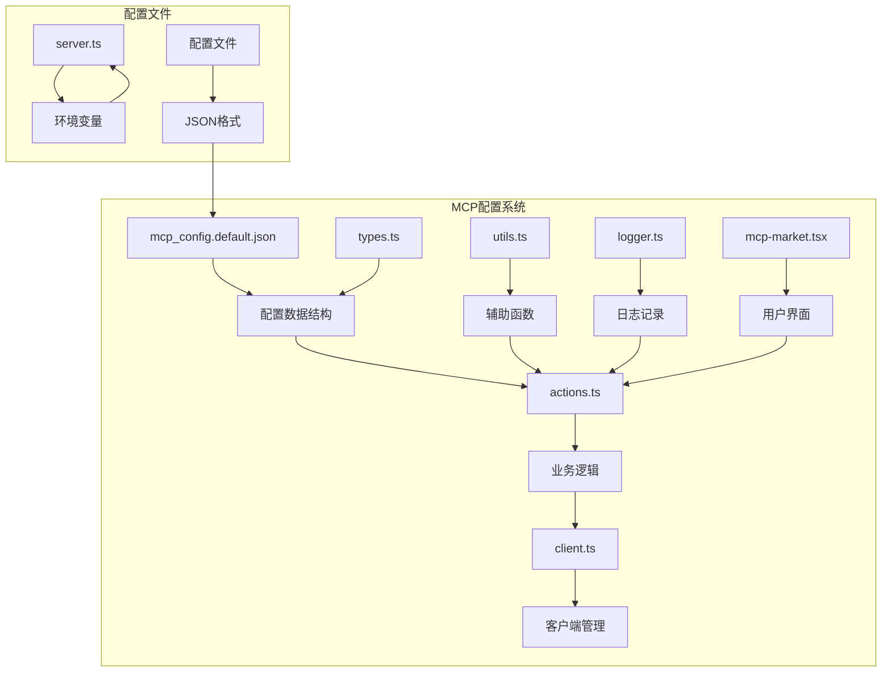

**图表来源**
- [mcp_config.default.json](file://app/mcp/mcp_config.default.json#L1-L4)
- [types.ts](file://app/mcp/types.ts#L1-L181)
- [actions.ts](file://app/mcp/actions.ts#L1-L385)

## 核心配置文件

### 默认配置文件结构

MCP配置系统的核心是一个简单的JSON配置文件，定义了所有MCP服务器的配置信息：

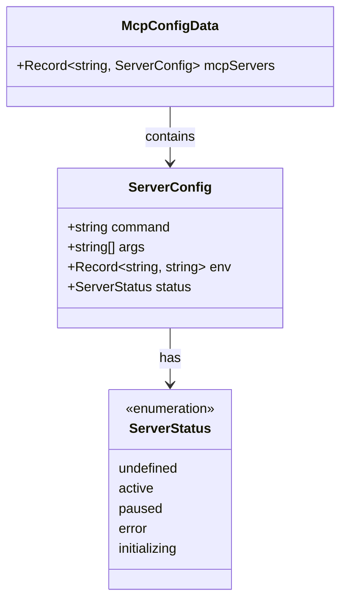

**图表来源**
- [types.ts](file://app/mcp/types.ts#L120-L118)

**章节来源**
- [mcp_config.default.json](file://app/mcp/mcp_config.default.json#L1-L4)
- [types.ts](file://app/mcp/types.ts#L120-L118)

### 配置字段详解

| 字段名 | 类型 | 必需 | 描述 |
|--------|------|------|------|
| `mcpServers` | `Record<string, ServerConfig>` | 是 | 包含所有MCP服务器配置的对象，键为服务器ID，值为服务器配置对象 |

每个`ServerConfig`对象包含以下字段：

| 字段名 | 类型 | 必需 | 描述 |
|--------|------|------|------|
| `command` | `string` | 是 | 启动MCP服务器的可执行命令 |
| `args` | `string[]` | 是 | 传递给命令的参数数组 |
| `env` | `Record<string, string>` | 否 | 环境变量对象 |
| `status` | `"active" \| "paused" \| "error"` | 否 | 服务器状态，默认为`active` |

## 配置架构概览

MCP配置管理系统采用分层架构设计，确保配置的灵活性和可扩展性：

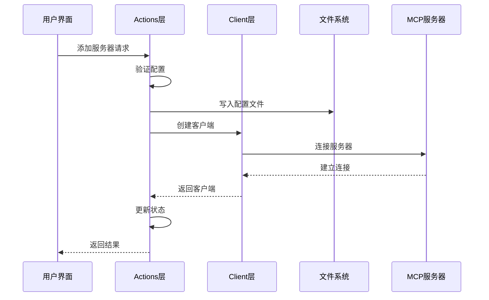

**图表来源**
- [actions.ts](file://app/mcp/actions.ts#L164-L228)
- [client.ts](file://app/mcp/client.ts#L9-L38)

## 详细组件分析

### 配置数据类型定义

系统使用TypeScript接口定义配置结构，确保类型安全：

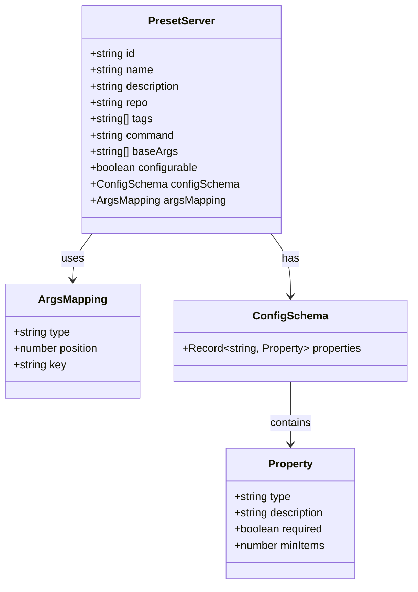

**图表来源**
- [types.ts](file://app/mcp/types.ts#L140-L180)

**章节来源**
- [types.ts](file://app/mcp/types.ts#L140-L180)

### 客户端管理组件

MCP客户端管理器负责维护所有活动的MCP连接：

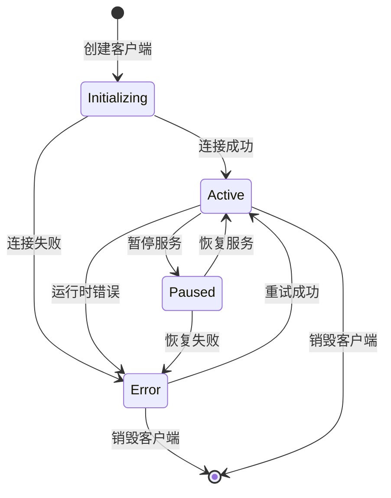

**图表来源**
- [types.ts](file://app/mcp/types.ts#L76-L97)
- [actions.ts](file://app/mcp/actions.ts#L232-L295)

**章节来源**
- [client.ts](file://app/mcp/client.ts#L9-L56)
- [types.ts](file://app/mcp/types.ts#L76-L97)

### 日志记录系统

MCP系统内置了完整的日志记录功能，支持多种日志级别：

| 日志级别 | 方法 | 颜色 | 用途 |
|----------|------|------|------|
| 信息 | `info()` | 蓝色 | 一般信息记录 |
| 成功 | `success()` | 绿色 | 操作成功 |
| 警告 | `warn()` | 黄色 | 警告信息 |
| 错误 | `error()` | 红色 | 错误信息 |
| 调试 | `debug()` | 淡色 | 调试信息 |

**章节来源**
- [logger.ts](file://app/mcp/logger.ts#L12-L66)

## 配置加载与合并逻辑

### 配置文件读取流程

系统采用优雅降级的方式加载配置：

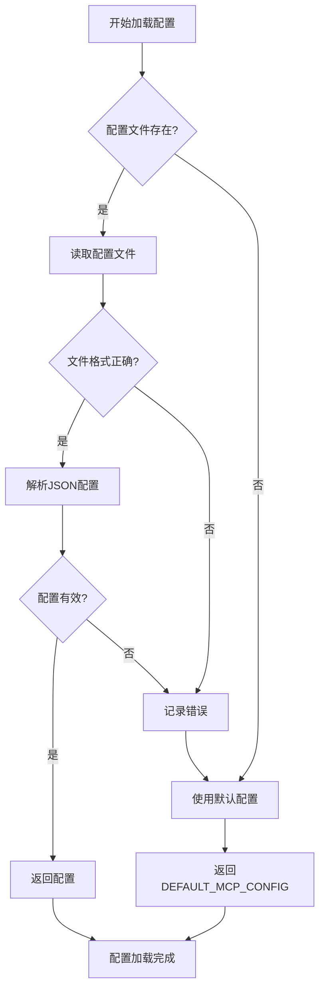

**图表来源**
- [actions.ts](file://app/mcp/actions.ts#L356-L362)

### 配置合并策略

当添加新服务器时，系统采用深度合并策略：

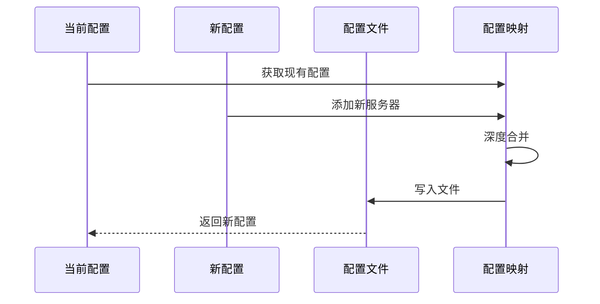

**图表来源**
- [actions.ts](file://app/mcp/actions.ts#L174-L180)

**章节来源**
- [actions.ts](file://app/mcp/actions.ts#L356-L373)

## 环境变量与运行时设置

### 环境变量配置

系统通过环境变量控制MCP功能的启用状态：

| 环境变量 | 类型 | 默认值 | 描述 |
|----------|------|--------|------|
| `ENABLE_MCP` | `string` | `""` | 控制MCP功能的启用状态 |

### 运行时配置覆盖

系统支持通过服务器配置对象覆盖默认设置：

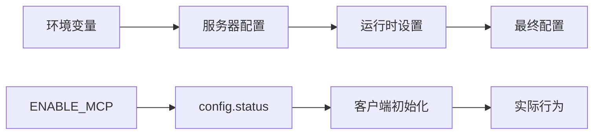

**图表来源**
- [server.ts](file://app/config/server.ts#L276-L277)

**章节来源**
- [server.ts](file://app/config/server.ts#L276-L277)
- [actions.ts](file://app/mcp/actions.ts#L377-L385)

## 配置验证与错误处理

### 配置验证机制

系统使用Zod进行配置验证，确保数据完整性：

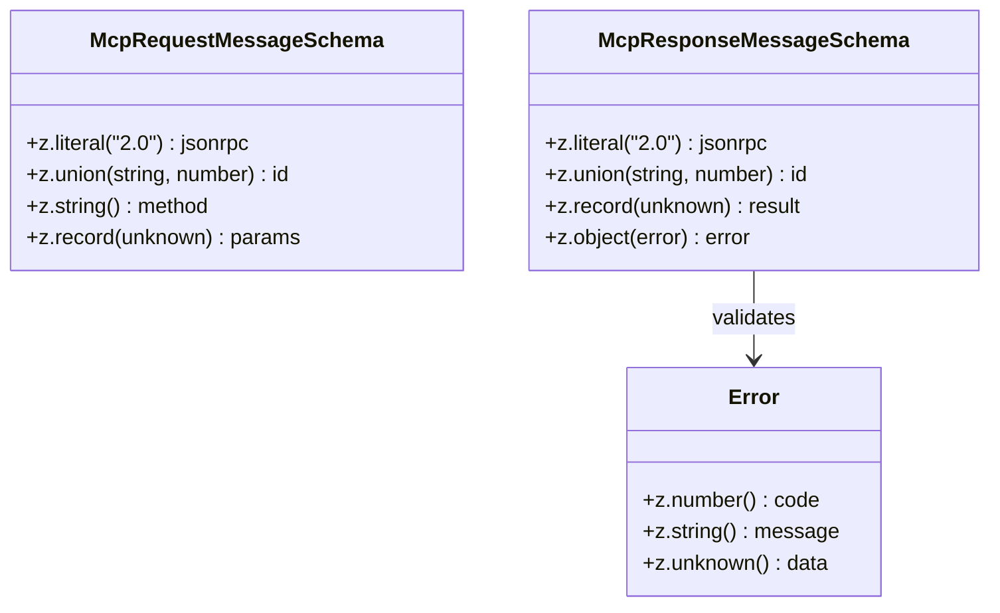

**图表来源**
- [types.ts](file://app/mcp/types.ts#L15-L48)

### 错误处理策略

系统实现了多层次的错误处理机制：

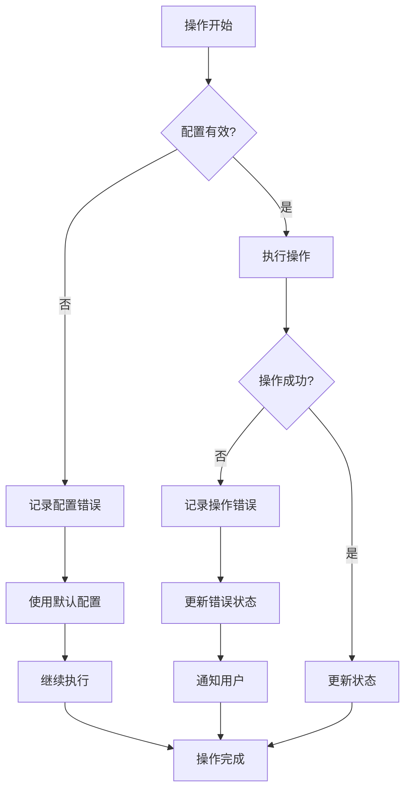

**图表来源**
- [actions.ts](file://app/mcp/actions.ts#L144-L160)
- [actions.ts](file://app/mcp/actions.ts#L241-L268)

**章节来源**
- [types.ts](file://app/mcp/types.ts#L15-L48)
- [actions.ts](file://app/mcp/actions.ts#L144-L160)
- [actions.ts](file://app/mcp/actions.ts#L241-L268)

## 实际配置示例

### 基础配置示例

```json
{
  "mcpServers": {
    "ollama": {
      "command": "ollama",
      "args": ["serve"],
      "status": "active"
    }
  }
}
```

### 复杂配置示例

```json
{
  "mcpServers": {
    "github": {
      "command": "python",
      "args": [
        "-m",
        "mcp_server_github",
        "--token",
        "${GITHUB_TOKEN}"
      ],
      "env": {
        "GITHUB_TOKEN": "your-github-token",
        "HTTP_PROXY": "http://proxy.example.com:8080"
      },
      "status": "active"
    },
    "local-server": {
      "command": "/usr/local/bin/mcp-server",
      "args": [
        "--port",
        "8080",
        "--config",
        "/etc/mcp/config.json"
      ],
      "env": {
        "NODE_ENV": "production",
        "LOG_LEVEL": "debug"
      },
      "status": "paused"
    }
  }
}
```

### 预设服务器配置

系统支持预设服务器配置，简化用户配置过程：

```mermaid
classDiagram
class PresetServerExample {
+string id = "github"
+string name = "GitHub MCP Server"
+string description = "GitHub API integration"
+string repo = "https : //github.com/example/mcp-github"
+string[] tags = ["github", "api"]
+string command = "python"
+string[] baseArgs = ["-m", "mcp_server_github"]
+boolean configurable = true
+ConfigSchema configSchema
+ArgsMapping argsMapping
}
class ConfigSchema {
+properties : {
"token" : {
"type" : "string",
"description" : "GitHub Personal Access Token",
"required" : true
},
"organization" : {
"type" : "string",
"description" : "GitHub organization name",
"required" : false
}
}
}
PresetServerExample --> ConfigSchema : defines
```

**图表来源**
- [mcp-market.tsx](file://app/components/mcp-market.tsx#L92-L109)

**章节来源**
- [mcp-market.tsx](file://app/components/mcp-market.tsx#L92-L109)

## 常见配置错误排查

### 配置文件错误

| 错误类型 | 症状 | 解决方案 |
|----------|------|----------|
| JSON格式错误 | 配置加载失败 | 使用JSON验证工具检查语法 |
| 缺少必需字段 | 服务器无法启动 | 确保包含`command`和`args`字段 |
| 环境变量未定义 | 运行时错误 | 设置必要的环境变量 |

### 连接问题排查

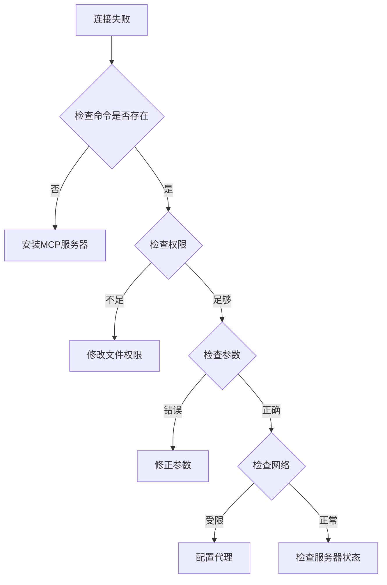

### 性能优化建议

1. **合理设置超时时间**：根据网络状况调整连接超时
2. **使用连接池**：对于频繁访问的服务器，考虑连接复用
3. **监控资源使用**：定期检查CPU和内存使用情况
4. **配置健康检查**：设置定期的服务器状态检查

**章节来源**
- [actions.ts](file://app/mcp/actions.ts#L356-L362)
- [client.ts](file://app/mcp/client.ts#L9-L38)

## 总结

MCP配置管理系统提供了完整而灵活的MCP服务器管理解决方案。通过清晰的配置结构、完善的错误处理机制和用户友好的界面，系统能够有效地管理复杂的MCP服务器环境。系统的模块化设计确保了良好的可维护性和扩展性，为开发者提供了强大的工具来集成各种MCP服务器。

关键特性包括：
- 统一的配置文件格式
- 灵活的参数映射机制
- 完善的错误处理和日志记录
- 支持预设服务器配置
- 动态的服务器生命周期管理

通过遵循本文档提供的指导原则和最佳实践，开发者可以充分利用MCP配置管理系统的强大功能，构建稳定可靠的MCP集成解决方案。