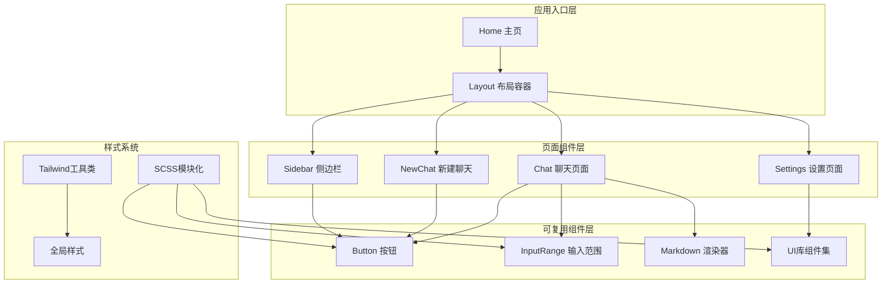
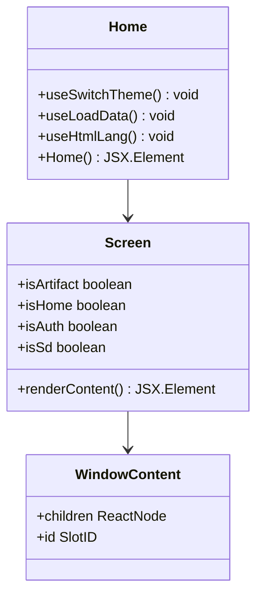
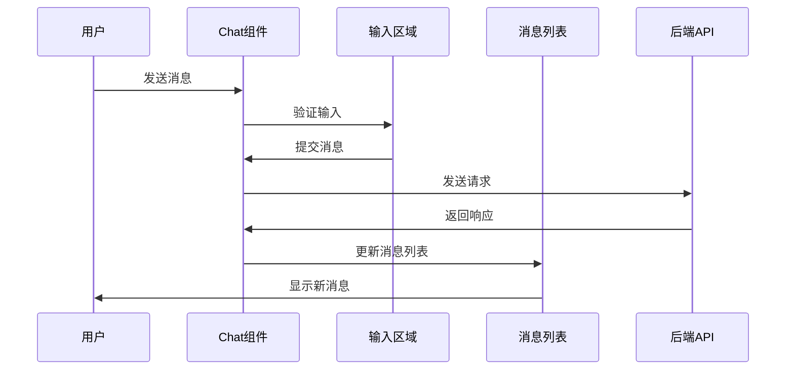
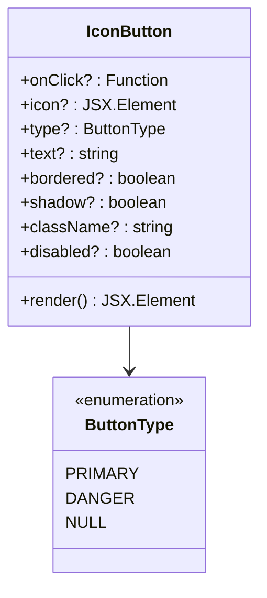
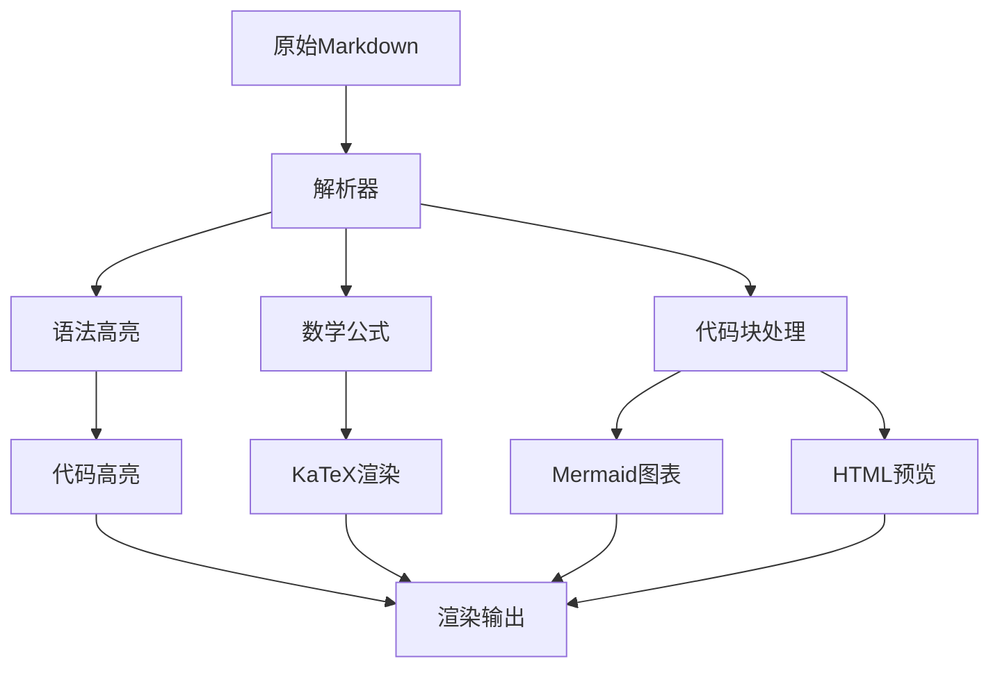
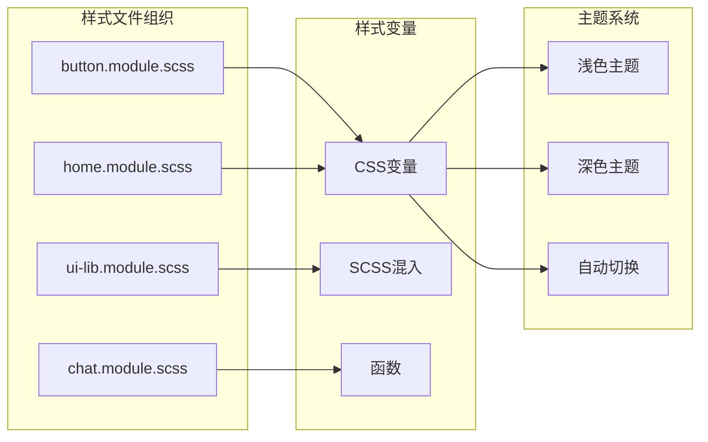
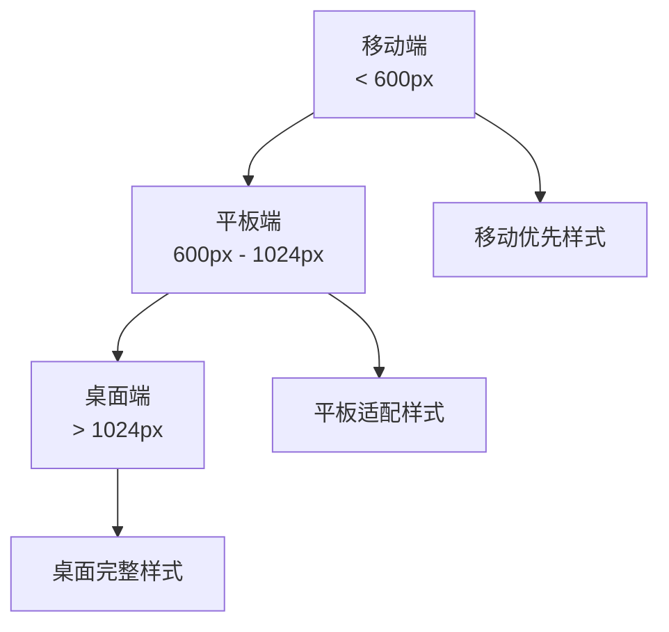
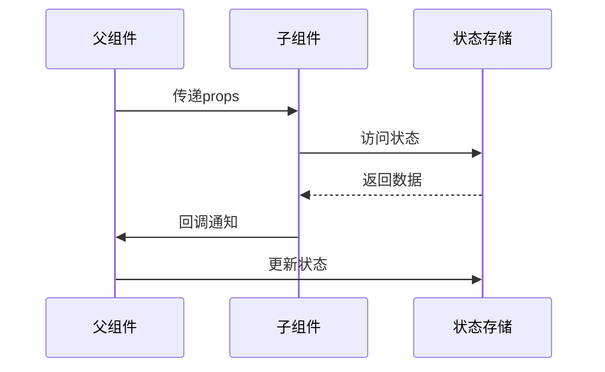

# UI组件架构

<cite>
**本文档中引用的文件**
- [app/components/home.tsx](file://app/components/home.tsx)
- [app/components/chat.tsx](file://app/components/chat.tsx)
- [app/components/settings.tsx](file://app/components/settings.tsx)
- [app/components/button.tsx](file://app/components/button.tsx)
- [app/components/input-range.tsx](file://app/components/input-range.tsx)
- [app/components/markdown.tsx](file://app/components/markdown.tsx)
- [app/components/ui-lib.tsx](file://app/components/ui-lib.tsx)
- [app/components/sidebar.tsx](file://app/components/sidebar.tsx)
- [app/components/new-chat.tsx](file://app/components/new-chat.tsx)
- [app/components/chat-list.tsx](file://app/components/chat-list.tsx)
- [app/styles/globals.scss](file://app/styles/globals.scss)
- [app/styles/tailwind.css](file://app/styles/tailwind.css)
- [app/components/ui-lib.module.scss](file://app/components/ui-lib.module.scss)
- [app/components/button.module.scss](file://app/components/button.module.scss)
- [app/components/input-range.module.scss](file://app/components/input-range.module.scss)
</cite>

## 目录
1. [项目概述](#项目概述)
2. [组件架构总览](#组件架构总览)
3. [核心页面组件](#核心页面组件)
4. [可复用UI元素](#可复用ui元素)
5. [样式系统架构](#样式系统架构)
6. [组件通信模式](#组件通信模式)
7. [最佳实践指南](#最佳实践指南)
8. [总结](#总结)

## 项目概述

ChatGPT Next Web采用现代化的React组件架构，结合SCSS模块化样式系统和Tailwind CSS工具类，构建了一个高度可维护和可扩展的前端UI体系。该架构支持主题切换、响应式设计和组件复用，为用户提供一致且流畅的交互体验。

## 组件架构总览

**图表来源**
- [app/components/home.tsx](file://app/components/home.tsx#L1-L273)
- [app/components/chat.tsx](file://app/components/chat.tsx#L1-L800)
- [app/components/settings.tsx](file://app/components/settings.tsx#L1-L800)

## 核心页面组件

### Home 主页组件

Home组件是整个应用的根入口，负责路由管理和整体布局控制。

**图表来源**
- [app/components/home.tsx](file://app/components/home.tsx#L237-L273)

**节来源**
- [app/components/home.tsx](file://app/components/home.tsx#L1-L273)

### Chat 聊天组件

Chat组件是最复杂的页面组件，包含消息处理、输入控制、配置管理等功能。

**图表来源**
- [app/components/chat.tsx](file://app/components/chat.tsx#L1-L800)

**节来源**
- [app/components/chat.tsx](file://app/components/chat.tsx#L1-L800)

### Settings 设置组件

Settings组件提供应用配置和用户设置功能，采用模块化设计。

**节来源**
- [app/components/settings.tsx](file://app/components/settings.tsx#L1-L800)

## 可复用UI元素

### Button 按钮组件

Button组件是基础交互元素，支持多种类型和状态。

**图表来源**
- [app/components/button.tsx](file://app/components/button.tsx#L1-L67)

**节来源**
- [app/components/button.tsx](file://app/components/button.tsx#L1-L67)

### InputRange 输入范围组件

InputRange组件用于数值范围选择，提供直观的滑块交互。

**节来源**
- [app/components/input-range.tsx](file://app/components/input-range.tsx#L1-L42)

### Markdown 渲染器

Markdown组件提供富文本内容渲染，支持数学公式、代码高亮和交互功能。

**图表来源**
- [app/components/markdown.tsx](file://app/components/markdown.tsx#L1-L353)

**节来源**
- [app/components/markdown.tsx](file://app/components/markdown.tsx#L1-L353)

### UI库组件集

UI库提供了丰富的基础组件，包括模态框、列表、选择器等。

**节来源**
- [app/components/ui-lib.tsx](file://app/components/ui-lib.tsx#L1-L590)

## 样式系统架构

### SCSS模块化系统

项目采用SCSS模块化方案，每个组件都有独立的样式文件。

**图表来源**
- [app/components/button.module.scss](file://app/components/button.module.scss#L1-L83)
- [app/components/ui-lib.module.scss](file://app/components/ui-lib.module.scss#L1-L340)

**节来源**
- [app/components/button.module.scss](file://app/components/button.module.scss#L1-L83)
- [app/components/ui-lib.module.scss](file://app/components/ui-lib.module.scss#L1-L340)
- [app/components/input-range.module.scss](file://app/components/input-range.module.scss#L1-L14)

### Tailwind CSS集成

项目混合使用Tailwind CSS工具类和自定义SCSS，实现快速开发和精细控制。

**节来源**
- [app/styles/globals.scss](file://app/styles/globals.scss#L1-L402)

### 响应式设计

**节来源**
- [app/styles/globals.scss](file://app/styles/globals.scss#L70-L82)

## 组件通信模式

### Props传递数据

组件间通过props进行数据传递，遵循单向数据流原则。

### 事件回调机制

组件通过事件回调实现父子组件通信。

**节来源**
- [app/components/chat.tsx](file://app/components/chat.tsx#L494-L506)
- [app/components/sidebar.tsx](file://app/components/sidebar.tsx#L228-L369)

## 最佳实践指南

### 组件命名规范

- **文件命名**: 使用PascalCase，如`Chat.tsx`
- **样式文件**: 使用`组件名.module.scss`格式
- **组件导出**: 默认导出主要组件，命名导出辅助组件

### 样式组织原则

1. **模块化**: 每个组件独立的样式文件
2. **命名空间**: 使用组件名称作为前缀
3. **变量统一**: 在全局样式中定义CSS变量
4. **主题支持**: 支持light、dark、auto三种主题

### 性能优化建议

1. **懒加载**: 对于大型组件使用动态导入
2. **记忆化**: 使用`React.memo`优化渲染
3. **代码分割**: 合理拆分组件以减少bundle大小
4. **事件委托**: 减少事件监听器数量

### 可访问性考虑

1. **语义化标签**: 正确使用HTML语义化标签
2. **键盘导航**: 支持完整的键盘操作
3. **屏幕阅读器**: 添加适当的aria属性
4. **焦点管理**: 合理管理焦点顺序

**节来源**
- [app/components/home.tsx](file://app/components/home.tsx#L43-L84)
- [app/components/chat.tsx](file://app/components/chat.tsx#L133-L135)

## 总结

ChatGPT Next Web的UI组件架构体现了现代前端开发的最佳实践：

1. **模块化设计**: 每个组件职责单一，易于维护和测试
2. **样式隔离**: SCSS模块化确保样式不会相互污染
3. **主题系统**: 完善的主题切换机制提升用户体验
4. **响应式布局**: 兼容多设备的响应式设计
5. **性能优化**: 通过懒加载和代码分割优化性能

这种架构不仅保证了代码的可维护性和可扩展性，还为开发者提供了清晰的开发指导，有助于团队协作和长期项目发展。通过遵循这些设计原则和最佳实践，可以构建出高质量、高性能的Web应用程序。