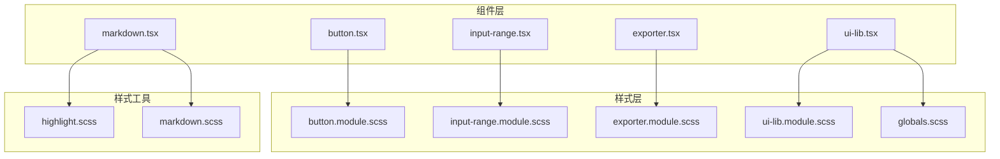
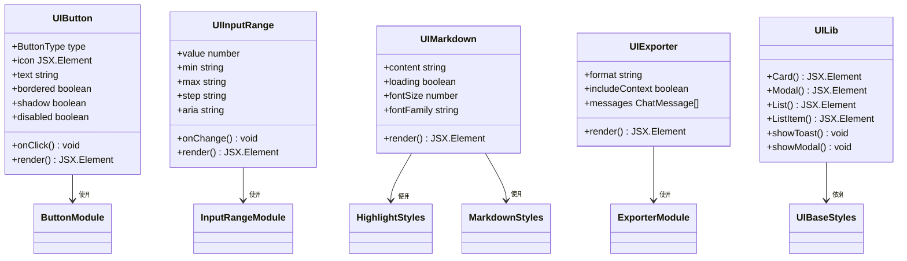
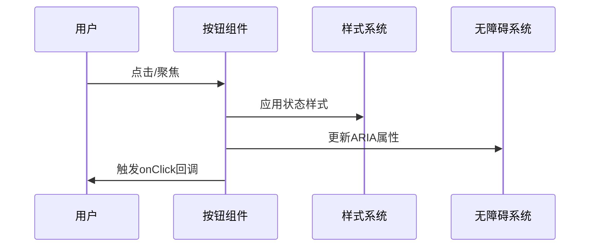
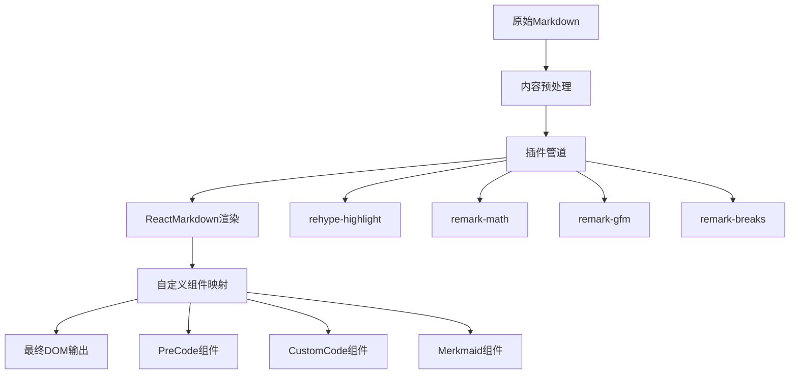
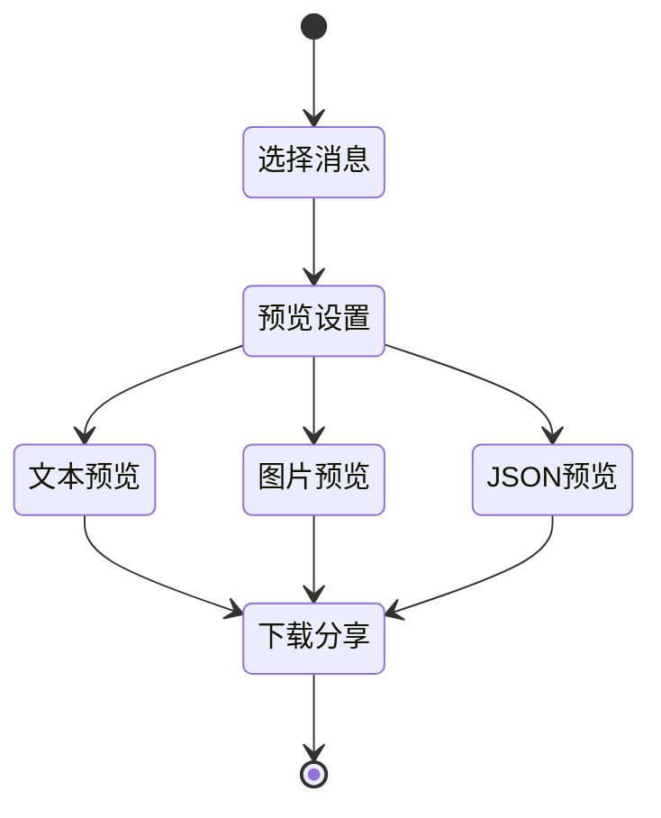
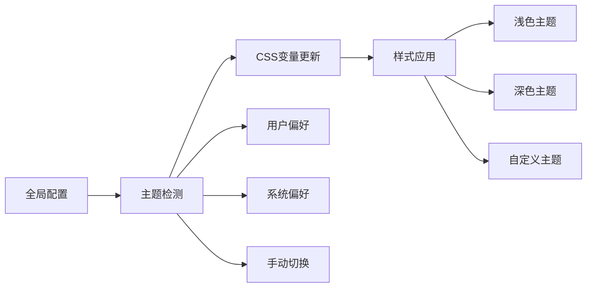
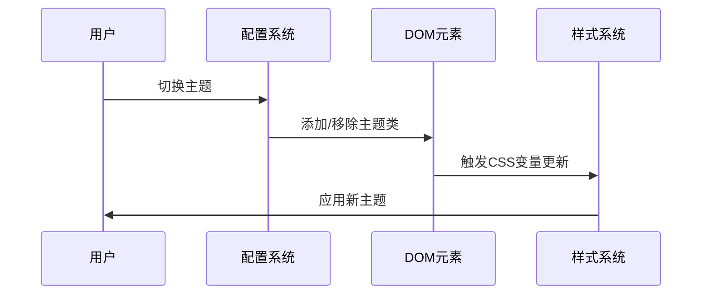

# 基础UI组件库

<cite>
**本文档中引用的文件**
- [button.tsx](file://app/components/button.tsx)
- [input-range.tsx](file://app/components/input-range.tsx)
- [markdown.tsx](file://app/components/markdown.tsx)
- [exporter.tsx](file://app/components/exporter.tsx)
- [ui-lib.tsx](file://app/components/ui-lib.tsx)
- [button.module.scss](file://app/components/button.module.scss)
- [input-range.module.scss](file://app/components/input-range.module.scss)
- [exporter.module.scss](file://app/components/exporter.module.scss)
- [ui-lib.module.scss](file://app/components/ui-lib.module.scss)
- [highlight.scss](file://app/styles/highlight.scss)
- [markdown.scss](file://app/styles/markdown.scss)
- [globals.scss](file://app/styles/globals.scss)
</cite>

## 目录
1. [简介](#简介)
2. [项目结构](#项目结构)
3. [核心组件](#核心组件)
4. [架构概览](#架构概览)
5. [详细组件分析](#详细组件分析)
6. [无障碍支持](#无障碍支持)
7. [主题适配](#主题适配)
8. [性能考虑](#性能考虑)
9. [故障排除指南](#故障排除指南)
10. [结论](#结论)

## 简介

ChatGPT Next Web 的基础UI组件库是一个高度模块化的React组件系统，专为现代化聊天应用界面设计。该库包含原子级组件（如按钮、输入框）、复合组件（如模态框、列表）以及专门的功能组件（如Markdown渲染器、导出器）。所有组件都遵循无障碍设计原则，支持深色/浅色主题切换，并提供一致的视觉风格。

## 项目结构

**图表来源**
- [button.tsx](file://app/components/button.tsx#L1-L67)
- [input-range.tsx](file://app/components/input-range.tsx#L1-L42)
- [markdown.tsx](file://app/components/markdown.tsx#L1-L353)
- [exporter.tsx](file://app/components/exporter.tsx#L1-L695)
- [ui-lib.tsx](file://app/components/ui-lib.tsx#L1-L590)

**章节来源**
- [button.tsx](file://app/components/button.tsx#L1-L67)
- [input-range.tsx](file://app/components/input-range.tsx#L1-L42)
- [markdown.tsx](file://app/components/markdown.tsx#L1-L353)
- [exporter.tsx](file://app/components/exporter.tsx#L1-L695)
- [ui-lib.tsx](file://app/components/ui-lib.tsx#L1-L590)

## 核心组件

### 按钮组件 (Button)

按钮组件是系统中最基础的交互元素，支持多种类型和状态。

#### Props接口
- `onClick`: 点击事件处理器
- `icon`: 图标元素
- `type`: 按钮类型（"primary" | "danger" | null）
- `text`: 显示文本
- `bordered`: 是否显示边框
- `shadow`: 是否显示阴影
- `className`: 自定义类名
- `title`: 工具提示文本
- `disabled`: 是否禁用
- `tabIndex`: 键盘导航顺序
- `autoFocus`: 是否自动聚焦
- `style`: 内联样式
- `aria`: 无障碍标签

#### 样式定制
按钮组件通过CSS Modules实现样式隔离，支持：
- 主题色变体（primary、danger）
- 边框和阴影效果
- 状态变化动画
- 移动端适配

### 输入范围组件 (InputRange)

用于数值选择的滑块组件，常用于配置参数调整。

#### Props接口
- `onChange`: 值变化事件处理器
- `title`: 标题文本
- `value`: 当前值
- `className`: 自定义类名
- `min`: 最小值
- `max`: 最大值
- `step`: 步长
- `aria`: 无障碍标签

### Markdown渲染器 (Markdown)

功能强大的Markdown内容渲染组件，支持数学公式、代码高亮和交互功能。

#### 插件集成
- **rehype-highlight**: 代码语法高亮
- **remark-math**: 数学公式渲染
- **remark-gfm**: GitHub Flavored Markdown支持
- **remark-breaks**: 自动换行处理

#### 特殊功能
- Mermaid图表渲染
- 代码复制功能
- 可折叠代码块
- HTML预览支持

### 导出器组件 (Exporter)

聊天记录导出功能的核心组件，支持多种格式和预览。

#### 功能特性
- 多格式导出（文本、图片、JSON）
- 分步向导界面
- 实时预览
- 共享链接生成

**章节来源**
- [button.tsx](file://app/components/button.tsx#L7-L23)
- [input-range.tsx](file://app/components/input-range.tsx#L5-L14)
- [markdown.tsx](file://app/components/markdown.tsx#L270-L353)
- [exporter.tsx](file://app/components/exporter.tsx#L140-L256)

## 架构概览

**图表来源**
- [button.tsx](file://app/components/button.tsx#L9-L67)
- [input-range.tsx](file://app/components/input-range.tsx#L16-L42)
- [markdown.tsx](file://app/components/markdown.tsx#L321-L353)
- [exporter.tsx](file://app/components/exporter.tsx#L140-L256)
- [ui-lib.tsx](file://app/components/ui-lib.tsx#L29-L590)

## 详细组件分析

### 按钮组件深度分析

#### 组件结构

**图表来源**
- [button.tsx](file://app/components/button.tsx#L24-L67)
- [button.module.scss](file://app/components/button.module.scss#L1-L83)

#### 样式系统
按钮组件采用CSS Modules实现样式隔离，支持：
- **状态管理**: hover、focus、disabled状态
- **主题适配**: primary、danger类型变体
- **视觉反馈**: 平滑过渡动画
- **响应式设计**: 移动端特殊处理

#### 无障碍特性
- **ARIA标签**: 支持自定义aria-label
- **键盘导航**: tabindex属性支持
- **焦点管理**: 自动聚焦和焦点跟踪
- **语义化标记**: role="button"语义化按钮

**章节来源**
- [button.tsx](file://app/components/button.tsx#L1-L67)
- [button.module.scss](file://app/components/button.module.scss#L1-L83)

### Markdown渲染器深度分析

#### 渲染流程

**图表来源**
- [markdown.tsx](file://app/components/markdown.tsx#L270-L317)

#### 代码高亮系统
Markdown组件集成了rehype-highlight插件，提供：
- **语法高亮**: 支持多种编程语言
- **主题系统**: Tokyo-night-Dark主题
- **自动检测**: 无需指定语言类型
- **错误处理**: 缺失语言时的优雅降级

#### 数学公式渲染
使用KaTeX引擎渲染数学表达式：
- **行内公式**: `$inline math$` 格式
- **块级公式**: `$$block math$$` 格式
- **LaTeX兼容**: 完整的LaTeX数学符号支持

**章节来源**
- [markdown.tsx](file://app/components/markdown.tsx#L1-L353)
- [highlight.scss](file://app/styles/highlight.scss#L1-L116)

### 导出器组件深度分析

#### 导出流程

**图表来源**
- [exporter.tsx](file://app/components/exporter.tsx#L140-L256)

#### 多格式支持
导出器支持三种主要格式：
- **文本格式**: 纯文本Markdown输出
- **图片格式**: 完整聊天界面截图
- **JSON格式**: 结构化数据导出

#### 图片导出功能
图片导出功能包含：
- **HTML到图像转换**: 使用html-to-image库
- **跨平台支持**: 移动端和桌面端优化
- **剪贴板集成**: 直接复制到剪贴板
- **下载功能**: 支持PNG格式下载

**章节来源**
- [exporter.tsx](file://app/components/exporter.tsx#L1-L695)

### UI库复合组件分析

#### 模态框系统
UI库提供了完整的模态框解决方案：
- **动态渲染**: 支持程序化调用
- **键盘控制**: ESC键关闭，焦点管理
- **响应式设计**: 移动端适配
- **动画效果**: 滑入滑出动画

#### 列表系统
提供统一的列表展示组件：
- **列表项**: 支持图标、标题、副标题
- **垂直布局**: 可选的垂直排列模式
- **点击交互**: 支持点击事件处理
- **样式统一**: 一致的视觉风格

**章节来源**
- [ui-lib.tsx](file://app/components/ui-lib.tsx#L1-L590)

## 无障碍支持

### 设计原则
系统遵循WCAG 2.1 AA标准，确保所有用户都能有效使用：

#### 键盘导航
- **Tab顺序**: 合理的键盘导航顺序
- **快捷键**: 支持Enter和Space激活
- **焦点管理**: 清晰的焦点指示器
- **ESC退出**: 所有模态框支持ESC关闭

#### 屏幕阅读器支持
- **ARIA标签**: 语义化的无障碍标签
- **角色定义**: 明确的组件角色
- **状态通知**: 动态状态变化通知
- **描述文本**: 详细的交互描述

#### 视觉辅助
- **对比度**: 符合WCAG对比度要求
- **字体大小**: 可调整的字体大小
- **颜色使用**: 不仅依赖颜色传达信息
- **动画控制**: 支持减少动画的偏好设置

**章节来源**
- [button.tsx](file://app/components/button.tsx#L37-L44)
- [input-range.tsx](file://app/components/input-range.tsx#L29-L38)
- [ui-lib.tsx](file://app/components/ui-lib.tsx#L124-L136)

## 主题适配

### 主题系统架构

**图表来源**
- [globals.scss](file://app/styles/globals.scss#L1-L70)

### CSS变量系统
主题系统基于CSS自定义属性实现：
- **颜色变量**: --primary、--secondary、--background等
- **尺寸变量**: --border-radius、--font-size等
- **阴影变量**: --card-shadow、--global-shadow等
- **动画变量**: --transition-duration、--animation-easing等

### 深色/浅色切换
系统支持三种主题模式：
- **自动模式**: 基于系统偏好自动切换
- **浅色模式**: 固定浅色主题
- **深色模式**: 固定深色主题

#### 主题切换机制

**图表来源**
- [globals.scss](file://app/styles/globals.scss#L47-L53)

**章节来源**
- [globals.scss](file://app/styles/globals.scss#L1-L70)
- [markdown.scss](file://app/styles/markdown.scss#L1-L1029)

## 性能考虑

### 组件优化策略
1. **React.memo**: 对复杂组件使用记忆化
2. **懒加载**: 动态导入大型组件
3. **虚拟滚动**: 处理大量列表数据
4. **防抖节流**: 优化用户输入响应
5. **代码分割**: 按需加载非关键代码

### 渲染性能
- **批量更新**: 减少不必要的重新渲染
- **事件委托**: 优化事件处理性能
- **内存管理**: 及时清理事件监听器
- **资源压缩**: 优化静态资源大小

### 网络优化
- **CDN加速**: 静态资源CDN分发
- **缓存策略**: 合理的HTTP缓存头
- **压缩传输**: Gzip/Brotli压缩
- **预加载**: 关键资源预加载

## 故障排除指南

### 常见问题及解决方案

#### 按钮组件问题
**问题**: 按钮点击无响应
**解决方案**: 
- 检查disabled属性设置
- 验证onClick事件绑定
- 确认事件冒泡未被阻止

**问题**: 按钮样式异常
**解决方案**:
- 检查CSS Modules导入
- 验证主题变量设置
- 确认样式优先级

#### Markdown渲染问题
**问题**: 代码高亮不显示
**解决方案**:
- 确认rehype-highlight插件安装
- 检查语言标识符语法
- 验证highlight.scss导入

**问题**: 数学公式渲染失败
**解决方案**:
- 确认remark-math插件配置
- 检查KaTeX样式文件引入
- 验证公式语法格式

#### 导出功能问题
**问题**: 图片导出空白
**解决方案**:
- 检查html-to-image库版本
- 确认DOM元素可见性
- 验证Canvas权限设置

**问题**: 文件下载失败
**解决方案**:
- 检查浏览器下载权限
- 验证文件大小限制
- 确认网络连接状态

**章节来源**
- [button.tsx](file://app/components/button.tsx#L17-L23)
- [markdown.tsx](file://app/components/markdown.tsx#L276-L287)
- [exporter.tsx](file://app/components/exporter.tsx#L446-L495)

## 结论

ChatGPT Next Web的基础UI组件库展现了现代React应用开发的最佳实践。通过模块化设计、无障碍支持、主题适配和性能优化，该组件库为开发者提供了一个强大而灵活的界面构建基础。

### 主要优势
1. **模块化架构**: 组件间低耦合，高内聚
2. **无障碍设计**: 完整的可访问性支持
3. **主题系统**: 灵活的主题切换机制
4. **性能优化**: 多层次的性能优化策略
5. **扩展性强**: 易于添加新组件和功能

### 发展方向
- **TypeScript增强**: 更完善的类型定义
- **测试覆盖**: 增加单元测试和集成测试
- **文档完善**: 详细的API文档和使用示例
- **社区贡献**: 开放更多定制化选项

该组件库不仅满足了当前项目的需求，也为未来的功能扩展和技术演进奠定了坚实的基础。