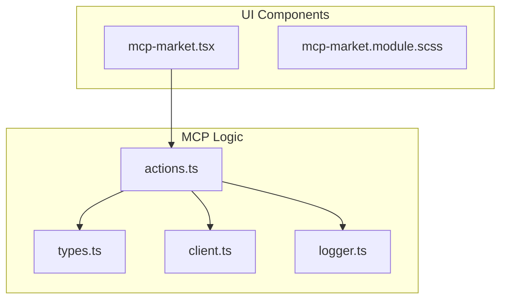
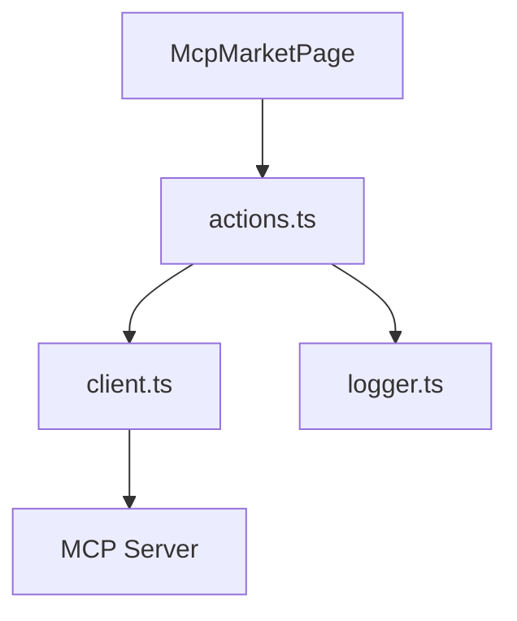
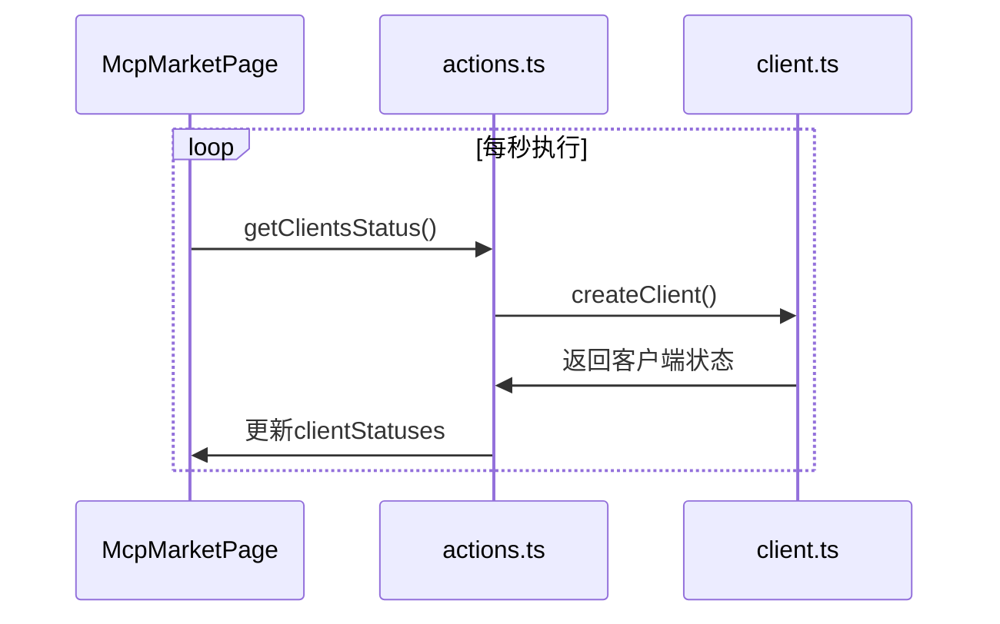
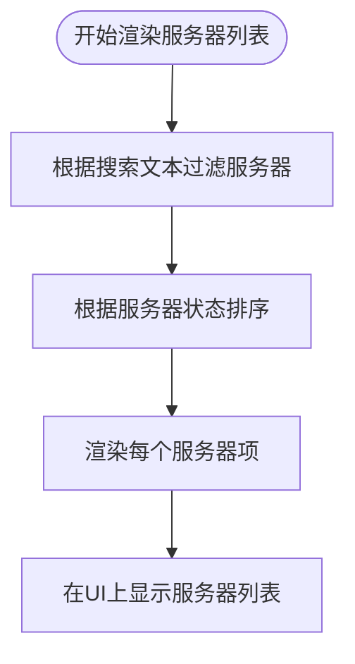
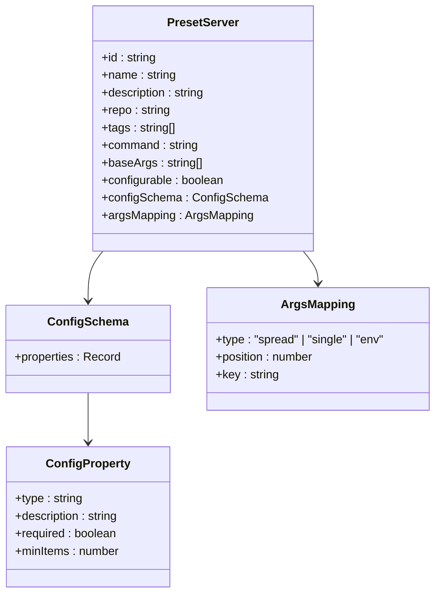
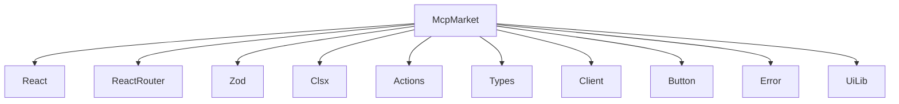

# MCP协议插件市场

<cite>
**本文档引用的文件**
- [mcp-market.tsx](file://app/components/mcp-market.tsx)
- [actions.ts](file://app/mcp/actions.ts)
- [types.ts](file://app/mcp/types.ts)
- [client.ts](file://app/mcp/client.ts)
- [mcp-market.module.scss](file://app/components/mcp-market.module.scss)
- [home.tsx](file://app/components/home.tsx)
- [sidebar.tsx](file://app/components/sidebar.tsx)
- [logger.ts](file://app/mcp/logger.ts)
- [mcp_config.default.json](file://app/mcp/mcp_config.default.json)
</cite>

## 目录
1. [简介](#简介)
2. [项目结构](#项目结构)
3. [核心组件](#核心组件)
4. [架构概述](#架构概述)
5. [详细组件分析](#详细组件分析)
6. [依赖分析](#依赖分析)
7. [性能考虑](#性能考虑)
8. [故障排除指南](#故障排除指南)
9. [结论](#结论)

## 简介
MCP协议插件市场是ChatGPT-Next-Web项目中的一个重要功能模块，它提供了一个用户友好的界面来管理MCP（Model Context Protocol）服务器。该市场允许用户添加、启动、停止和重启MCP服务器，查看服务器支持的工具，并通过预设配置快速部署服务器。本文档将深入分析MCP协议插件市场的UI实现，重点关注mcp-market.tsx的界面架构、服务器列表渲染逻辑及实时状态轮询机制。

## 项目结构
MCP协议插件市场的相关文件主要分布在`app/components`和`app/mcp`目录下。`mcp-market.tsx`是主要的UI组件文件，负责渲染整个MCP市场的界面。`mcp-market.module.scss`包含了该组件的样式定义。`app/mcp`目录下包含了MCP相关的逻辑处理文件，包括`actions.ts`（提供API操作）、`types.ts`（定义类型）、`client.ts`（客户端操作）和`logger.ts`（日志记录）。

**Diagram sources**
- [mcp-market.tsx](file://app/components/mcp-market.tsx)
- [actions.ts](file://app/mcp/actions.ts)
- [types.ts](file://app/mcp/types.ts)

## 核心组件
MCP协议插件市场的核心组件是`McpMarketPage`，它是一个React函数组件，负责渲染整个MCP市场的界面。该组件使用了多个状态变量来管理UI状态，包括`mcpEnabled`（MCP是否启用）、`searchText`（搜索文本）、`userConfig`（用户配置）、`editingServerId`（正在编辑的服务器ID）、`tools`（工具列表）、`viewingServerId`（正在查看的服务器ID）、`isLoading`（加载状态）、`config`（MCP配置）、`clientStatuses`（客户端状态）和`presetServers`（预设服务器列表）。

**Section sources**
- [mcp-market.tsx](file://app/components/mcp-market.tsx#L43-L61)

## 架构概述
MCP协议插件市场的架构分为UI层和逻辑层。UI层由`mcp-market.tsx`组件构成，负责展示界面和处理用户交互。逻辑层由`actions.ts`、`client.ts`等文件构成，负责与MCP服务器进行通信和管理服务器状态。UI层通过调用逻辑层提供的API来实现MCP服务器的全生命周期管理。

**Diagram sources**
- [mcp-market.tsx](file://app/components/mcp-market.tsx)
- [actions.ts](file://app/mcp/actions.ts)
- [client.ts](file://app/mcp/client.ts)

## 详细组件分析

### MCP市场页面分析
`McpMarketPage`组件是MCP协议插件市场的核心，它使用了多个`useEffect`钩子来管理组件的生命周期和状态更新。

#### 状态轮询机制
`McpMarketPage`组件使用`useEffect`钩子实现了MCP客户端状态的每秒级更新。当MCP启用且配置加载完成后，组件会启动一个定时器，每1000毫秒调用一次`getClientsStatus`函数来获取所有客户端的最新状态，并更新`clientStatuses`状态变量。

**Diagram sources**
- [mcp-market.tsx](file://app/components/mcp-market.tsx#L75-L89)
- [actions.ts](file://app/mcp/actions.ts#L27-L74)

#### 服务器列表渲染
`renderServerList`函数负责渲染服务器列表。它首先根据搜索文本过滤预设服务器，然后根据服务器状态对服务器进行排序，最后将每个服务器渲染为一个`mcp-market-item`。服务器状态包括"Running"、"Stopped"、"Error"等，这些状态在UI上以不同的颜色和标签呈现。

**Diagram sources**
- [mcp-market.tsx](file://app/components/mcp-market.tsx#L449-L632)

### 预设服务器配置分析
MCP市场支持预设服务器配置，这些配置通过`presetServers`状态变量管理。预设服务器的配置信息包括ID、名称、描述、仓库地址、标签、命令、基础参数、是否可配置、配置模式和参数映射等。

#### 动态表单渲染
当用户点击"Configure"按钮时，会打开一个配置对话框，显示一个动态生成的表单。表单的结构由预设服务器的`configSchema`定义，支持字符串和数组类型的输入。对于数组类型，用户可以添加和删除多个值。

**Diagram sources**
- [types.ts](file://app/mcp/types.ts#L140-L180)
- [mcp-market.tsx](file://app/components/mcp-market.tsx#L329-L407)

#### 参数映射机制
参数映射机制允许将用户在UI上输入的配置值映射到服务器的实际启动参数中。映射类型包括"spread"（展开到参数数组中）、"single"（单个参数值）和"env"（环境变量）。在保存服务器配置时，`saveServerConfig`函数会根据`argsMapping`将`userConfig`中的值映射到`args`和`env`中。

**Section sources**
- [mcp-market.tsx](file://app/components/mcp-market.tsx#L178-L226)
- [types.ts](file://app/mcp/types.ts#L129-L138)

### 工具列表查看功能
用户可以点击"Tools"按钮查看服务器支持的工具列表。`loadTools`函数会调用`getClientTools`API获取指定客户端的工具列表，并在模态框中显示。工具列表包括工具名称和描述等信息。

**Section sources**
- [mcp-market.tsx](file://app/components/mcp-market.tsx#L229-L242)
- [actions.ts](file://app/mcp/actions.ts#L78-L80)

## 依赖分析
MCP协议插件市场依赖于多个外部库和内部模块。主要依赖包括React、React Router、Zod（用于类型验证）、clsx（用于条件类名）等。内部依赖包括`actions.ts`、`types.ts`、`client.ts`等MCP相关模块，以及`button.tsx`、`error.tsx`、`ui-lib.tsx`等UI组件。

**Diagram sources**
- [mcp-market.tsx](file://app/components/mcp-market.tsx#L1-L35)

## 性能考虑
MCP协议插件市场在性能方面做了多项优化。首先，使用了`useEffect`钩子来避免不必要的重新渲染。其次，服务器列表的渲染使用了搜索过滤和状态排序，提高了用户体验。此外，状态轮询机制使用了定时器，避免了频繁的API调用。

## 故障排除指南
如果MCP市场无法正常工作，可以检查以下几点：
1. 确认MCP功能已启用（`isMcpEnabled`返回true）
2. 检查`mcp_config.json`文件是否存在且格式正确
3. 查看浏览器控制台是否有错误信息
4. 检查网络请求是否成功

**Section sources**
- [mcp-market.tsx](file://app/components/mcp-market.tsx#L63-L72)
- [actions.ts](file://app/mcp/actions.ts#L377-L385)

## 结论
MCP协议插件市场是一个功能丰富且用户友好的界面，它通过React组件和TypeScript类型系统实现了MCP服务器的全生命周期管理。通过`useEffect`钩子实现了实时状态轮询，通过动态表单渲染和参数映射机制支持了预设服务器的灵活配置。该市场的设计充分考虑了用户体验和性能优化，为用户提供了一个便捷的MCP服务器管理平台。