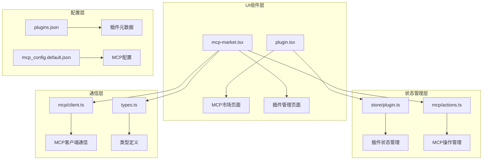
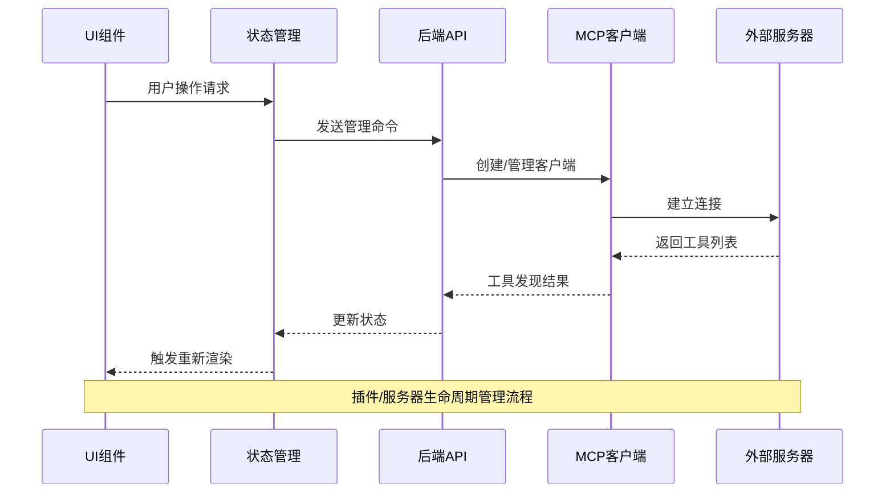
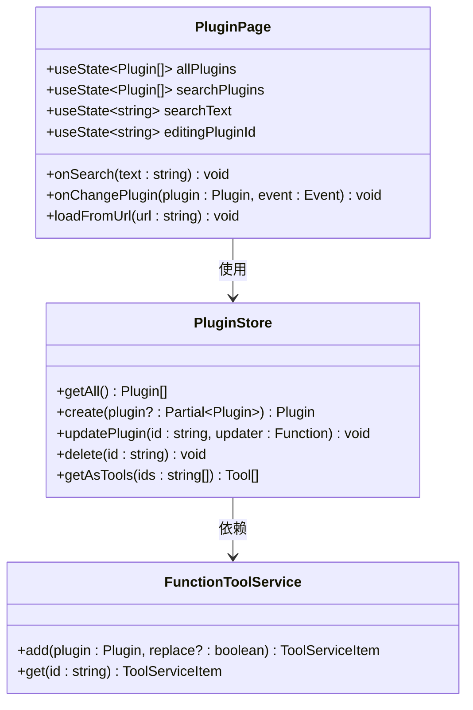
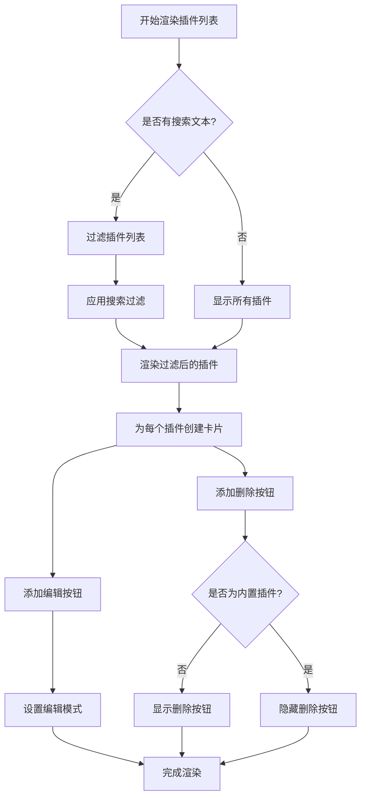
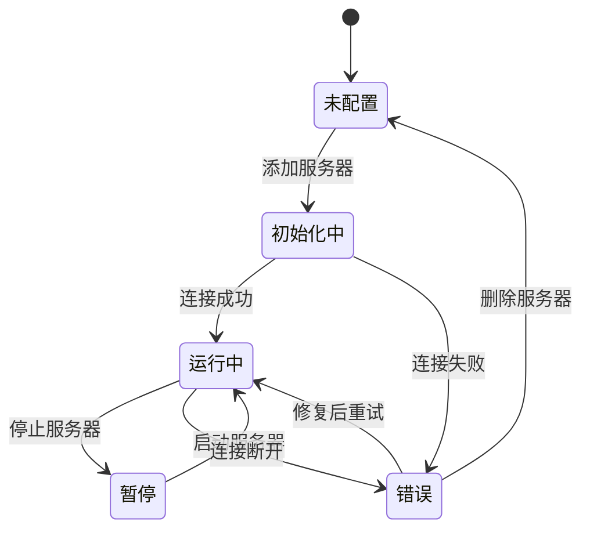
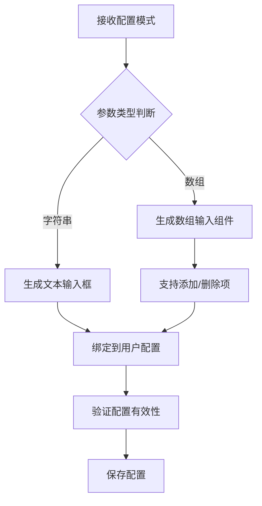
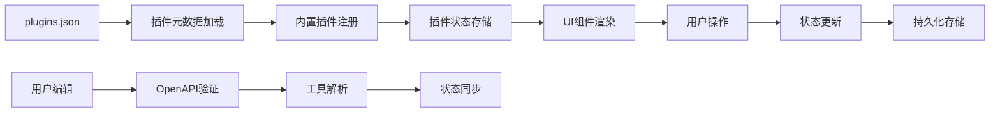
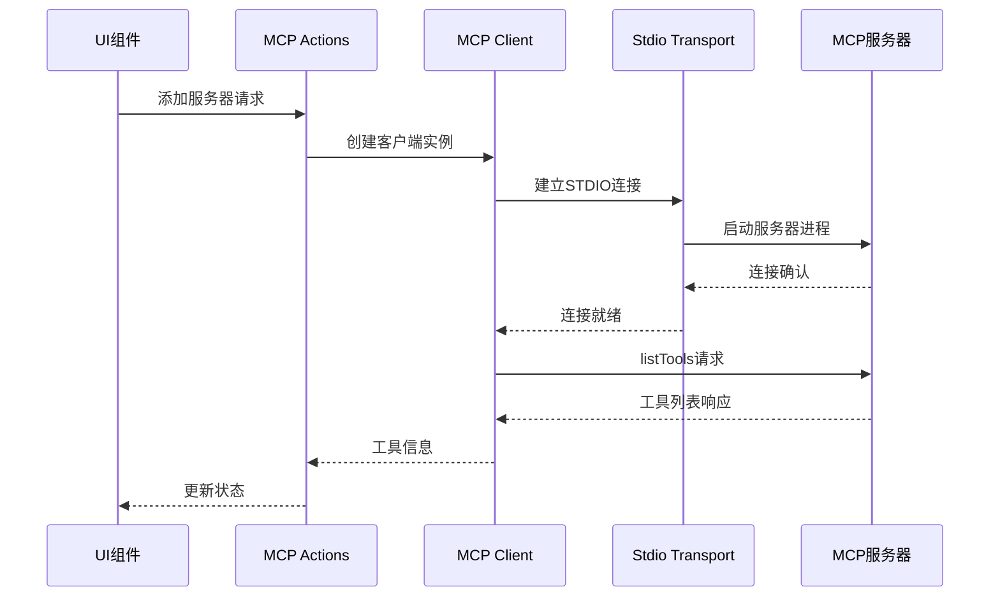
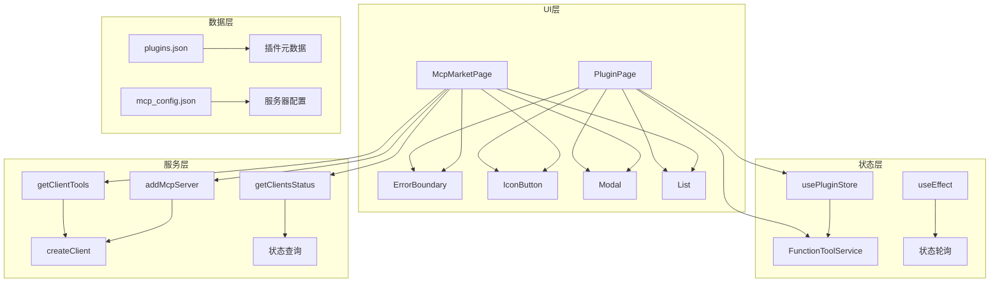

# 插件市场组件

<cite>
**本文档中引用的文件**
- [plugin.tsx](file://app/components/plugin.tsx)
- [mcp-market.tsx](file://app/components/mcp-market.tsx)
- [plugins.json](file://public/plugins.json)
- [client.ts](file://app/mcp/client.ts)
- [actions.ts](file://app/mcp/actions.ts)
- [types.ts](file://app/mcp/types.ts)
- [store/plugin.ts](file://app/store/plugin.ts)
- [mcp-market.module.scss](file://app/components/mcp-market.module.scss)
- [plugin.module.scss](file://app/components/plugin.module.scss)
</cite>

## 目录
1. [简介](#简介)
2. [项目结构](#项目结构)
3. [核心组件](#核心组件)
4. [架构概览](#架构概览)
5. [详细组件分析](#详细组件分析)
6. [依赖关系分析](#依赖关系分析)
7. [性能考虑](#性能考虑)
8. [故障排除指南](#故障排除指南)
9. [结论](#结论)

## 简介

插件市场组件是 ChatGPT-Next-Web 中负责管理和展示插件及MCP（Model Context Protocol）服务器的核心UI模块。该系统提供了完整的插件生命周期管理功能，包括插件的发现、安装、配置、启用、禁用和删除等操作。

系统采用React技术栈构建，通过模块化的组件设计实现了清晰的职责分离。插件系统支持两种主要类型：传统的OpenAPI插件和基于MCP协议的智能服务器插件，每种都有专门的UI界面和状态管理系统。

## 项目结构

插件市场组件的文件组织遵循功能导向的模块化原则：

**图表来源**
- [plugin.tsx](file://app/components/plugin.tsx#L1-L371)
- [mcp-market.tsx](file://app/components/mcp-market.tsx#L1-L756)
- [store/plugin.ts](file://app/store/plugin.ts#L1-L272)
- [actions.ts](file://app/mcp/actions.ts#L1-L386)

**章节来源**
- [plugin.tsx](file://app/components/plugin.tsx#L1-L50)
- [mcp-market.tsx](file://app/components/mcp-market.tsx#L1-L50)

## 核心组件

### 插件管理组件 (PluginPage)

插件管理组件提供了传统OpenAPI插件的完整管理界面，支持插件的创建、编辑、删除和配置等功能。

主要功能特性：
- **插件列表展示**：以卡片形式展示所有已安装的插件
- **搜索过滤**：支持按插件名称进行实时搜索
- **插件编辑器**：内置OpenAPI规范编辑器，支持YAML格式
- **认证配置**：支持多种认证方式（Bearer Token、Basic Auth、自定义）
- **实时验证**：编辑时自动验证OpenAPI规范的有效性

### MCP市场组件 (McpMarketPage)

MCP市场组件专门用于管理基于Model Context Protocol的智能服务器插件，提供更高级的服务器管理和工具发现功能。

主要功能特性：
- **预设服务器列表**：从远程API获取可用的MCP服务器列表
- **服务器状态监控**：实时显示服务器连接状态和工具可用性
- **动态配置**：支持服务器参数的动态配置和环境变量设置
- **工具发现**：自动发现并展示服务器提供的工具接口
- **批量操作**：支持一键重启所有服务器的功能

**章节来源**
- [plugin.tsx](file://app/components/plugin.tsx#L33-L371)
- [mcp-market.tsx](file://app/components/mcp-market.tsx#L43-L756)

## 架构概览

插件市场系统采用分层架构设计，确保了良好的可维护性和扩展性：

**图表来源**
- [actions.ts](file://app/mcp/actions.ts#L101-L140)
- [client.ts](file://app/mcp/client.ts#L9-L56)
- [store/plugin.ts](file://app/store/plugin.ts#L172-L271)

系统的核心架构特点：

1. **响应式状态管理**：使用React Hooks和自定义状态存储实现响应式更新
2. **异步操作处理**：通过Promise链和错误边界确保操作的可靠性
3. **实时状态同步**：定期轮询服务器状态，保持UI与实际状态的一致性
4. **类型安全**：通过TypeScript确保组件间的数据传递安全

## 详细组件分析

### 插件管理组件详细分析

#### 组件结构与状态管理

插件管理组件采用了复杂的状态管理模式来处理插件的各种操作：

**图表来源**
- [plugin.tsx](file://app/components/plugin.tsx#L33-L371)
- [store/plugin.ts](file://app/store/plugin.ts#L172-L271)

#### 插件列表渲染逻辑

插件列表的渲染采用了条件渲染和动态样式绑定的策略：

**图表来源**
- [plugin.tsx](file://app/components/plugin.tsx#L195-L230)

#### OpenAPI规范验证机制

组件内置了强大的OpenAPI规范验证功能：

1. **实时语法检查**：使用OpenAPIClientAxios库验证YAML格式
2. **自动重命名**：根据规范中的标题自动更新插件名称
3. **版本提取**：从规范中提取版本信息
4. **工具解析**：自动解析可用的API工具

**章节来源**
- [plugin.tsx](file://app/components/plugin.tsx#L60-L86)

### MCP市场组件详细分析

#### 服务器状态管理系统

MCP市场组件实现了复杂的服务器状态管理系统：

**图表来源**
- [actions.ts](file://app/mcp/actions.ts#L27-L74)
- [types.ts](file://app/mcp/types.ts#L100-L110)

#### 动态配置表单生成

系统能够根据预设服务器的配置模式动态生成配置表单：

**图表来源**
- [mcp-market.tsx](file://app/components/mcp-market.tsx#L330-L407)

#### 工具发现与展示机制

MCP服务器的工具发现过程：

1. **连接建立**：通过StdioClientTransport建立与服务器的连接
2. **工具查询**：发送listTools请求获取可用工具列表
3. **工具解析**：解析返回的工具定义并转换为标准格式
4. **状态更新**：将工具信息存储到客户端状态中

**章节来源**
- [client.ts](file://app/mcp/client.ts#L46-L56)
- [actions.ts](file://app/mcp/actions.ts#L78-L80)

### 数据流与通信机制

#### 插件系统数据流

**图表来源**
- [store/plugin.ts](file://app/store/plugin.ts#L239-L269)
- [plugin.tsx](file://app/components/plugin.tsx#L60-L86)

#### MCP通信数据流

**图表来源**
- [actions.ts](file://app/mcp/actions.ts#L101-L140)
- [client.ts](file://app/mcp/client.ts#L9-L56)

**章节来源**
- [actions.ts](file://app/mcp/actions.ts#L1-L386)
- [client.ts](file://app/mcp/client.ts#L1-L56)

## 依赖关系分析

### 组件间依赖关系

插件市场系统的组件间依赖关系体现了清晰的分层架构：

**图表来源**
- [mcp-market.tsx](file://app/components/mcp-market.tsx#L1-L15)
- [plugin.tsx](file://app/components/plugin.tsx#L1-L30)
- [actions.ts](file://app/mcp/actions.ts#L1-L10)

### 外部依赖分析

系统依赖的关键外部库和资源：

| 依赖项 | 版本 | 用途 | 重要性 |
|--------|------|------|--------|
| react-router-dom | 最新版 | 路由导航 | 核心 |
| openapi-client-axios | 最新版 | OpenAPI客户端 | 核心 |
| js-yaml | 最新版 | YAML解析 | 核心 |
| @modelcontextprotocol/sdk | 最新版 | MCP协议支持 | 核心 |
| clsx | 最新版 | CSS类名处理 | 辅助 |

**章节来源**
- [plugin.tsx](file://app/components/plugin.tsx#L1-L10)
- [mcp-market.tsx](file://app/components/mcp-market.tsx#L1-L15)

## 性能考虑

### 渲染优化策略

1. **虚拟滚动**：对于大量插件或服务器列表，考虑实现虚拟滚动以提高渲染性能
2. **防抖处理**：搜索功能使用useDebouncedCallback防止频繁的API调用
3. **状态缓存**：插件工具解析结果被缓存，避免重复计算
4. **懒加载**：MCP服务器配置对话框采用模态框形式，按需加载

### 网络请求优化

1. **并发控制**：MCP服务器初始化采用并发但受控的方式
2. **错误重试**：网络请求包含适当的重试机制
3. **状态轮询**：使用合理的轮询间隔（1秒）平衡实时性和性能

### 内存管理

1. **客户端清理**：MCP客户端在不需要时会被正确销毁
2. **状态清理**：组件卸载时清理定时器和事件监听器
3. **缓存限制**：插件工具服务对解析结果进行适当缓存

## 故障排除指南

### 常见问题与解决方案

#### 插件加载失败

**症状**：插件列表为空或显示加载错误
**原因**：plugins.json文件访问失败或格式错误
**解决方案**：
1. 检查public/plugins.json文件是否存在且格式正确
2. 验证网络连接和CORS设置
3. 查看浏览器开发者工具的网络面板

#### MCP服务器连接失败

**症状**：MCP服务器状态显示为"Error"
**原因**：服务器进程启动失败或通信异常
**解决方案**：
1. 检查服务器命令和参数配置
2. 验证服务器进程是否正常运行
3. 查看服务器日志输出

#### OpenAPI验证错误

**症状**：编辑插件时出现验证错误提示
**原因**：YAML格式不正确或OpenAPI规范无效
**解决方案**：
1. 使用在线YAML验证工具检查格式
2. 验证OpenAPI规范的完整性
3. 检查必需字段是否正确填写

### 调试技巧

1. **浏览器开发工具**：使用Console标签查看JavaScript错误
2. **网络面板**：监控API请求和响应
3. **状态检查**：使用React DevTools检查组件状态
4. **日志记录**：系统包含详细的日志记录功能

**章节来源**
- [actions.ts](file://app/mcp/actions.ts#L260-L278)
- [store/plugin.ts](file://app/store/plugin.ts#L80-L82)

## 结论

插件市场组件展现了现代Web应用中复杂状态管理和异步通信的最佳实践。通过精心设计的架构，系统实现了以下核心价值：

### 技术优势

1. **模块化设计**：清晰的职责分离使得代码易于维护和扩展
2. **类型安全**：完整的TypeScript类型定义确保了开发时的类型安全
3. **响应式更新**：基于React Hooks的状态管理提供了流畅的用户体验
4. **错误处理**：完善的错误边界和异常处理机制提高了系统稳定性

### 功能特色

1. **双插件系统**：同时支持传统OpenAPI插件和现代MCP协议插件
2. **实时状态**：通过轮询机制实现实时的状态同步
3. **动态配置**：支持复杂的服务器参数配置和环境变量管理
4. **工具发现**：自动发现和展示服务器提供的功能工具

### 扩展性考虑

系统的设计充分考虑了未来的扩展需求：
- 新的插件类型可以通过扩展类型系统轻松添加
- MCP协议支持为未来的AI服务器集成预留了空间
- 模块化的架构使得功能增强变得相对简单

这个插件市场组件不仅是一个功能完整的插件管理工具，更是现代前端架构设计的优秀范例，展示了如何在复杂的业务场景中实现优雅的技术解决方案。