# 普通插件管理界面

<cite>
**本文档中引用的文件**
- [app/components/plugin.tsx](file://app/components/plugin.tsx)
- [app/store/plugin.ts](file://app/store/plugin.ts)
- [public/plugins.json](file://public/plugins.json)
- [app/components/plugin.module.scss](file://app/components/plugin.module.scss)
- [app/components/ui-lib.tsx](file://app/components/ui-lib.tsx)
- [app/locales/cn.ts](file://app/locales/cn.ts)
- [app/locales/en.ts](file://app/locales/en.ts)
- [app/utils/store.ts](file://app/utils/store.ts)
</cite>

## 目录
1. [简介](#简介)
2. [项目结构](#项目结构)
3. [核心组件](#核心组件)
4. [架构概览](#架构概览)
5. [详细组件分析](#详细组件分析)
6. [状态管理机制](#状态管理机制)
7. [插件认证系统](#插件认证系统)
8. [错误处理与用户反馈](#错误处理与用户反馈)
9. [性能考虑](#性能考虑)
10. [故障排除指南](#故障排除指南)
11. [结论](#结论)

## 简介

普通插件管理系统是ChatGPT-Next-Web项目中的一个重要功能模块，提供了完整的插件生命周期管理能力。该系统允许用户浏览、搜索、创建、编辑和删除插件，同时支持多种认证方式和OpenAPI Schema的可视化编辑。

系统采用React + TypeScript技术栈，基于Zustand状态管理库实现插件数据的持久化存储，并通过OpenAPI Client Axios库解析和执行插件功能。

## 项目结构

插件系统的文件组织结构如下：

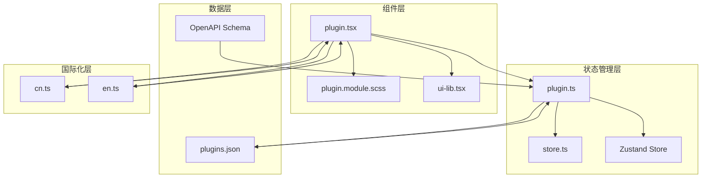

**图表来源**
- [app/components/plugin.tsx](file://app/components/plugin.tsx#L1-L371)
- [app/store/plugin.ts](file://app/store/plugin.ts#L1-L272)
- [public/plugins.json](file://public/plugins.json#L1-L18)

**章节来源**
- [app/components/plugin.tsx](file://app/components/plugin.tsx#L1-L50)
- [app/store/plugin.ts](file://app/store/plugin.ts#L1-L50)

## 核心组件

### 插件页面组件 (PluginPage)

插件页面是整个插件管理系统的核心入口，负责展示插件列表、搜索功能和创建新插件的能力。

主要功能特性：
- **插件列表展示**：以卡片形式展示所有可用插件
- **实时搜索**：支持按插件名称进行实时搜索过滤
- **插件操作**：提供编辑、删除等管理功能
- **模态编辑器**：内置OpenAPI Schema编辑器

### 插件编辑器组件

插件编辑器是一个功能完整的模态对话框，支持：
- **认证配置**：Bearer、Basic、Custom等多种认证方式
- **Schema编辑**：可视化的OpenAPI Schema编辑界面
- **实时验证**：对OpenAPI Schema进行语法和语义验证
- **工具函数生成**：根据Schema自动生成可调用的工具函数

**章节来源**
- [app/components/plugin.tsx](file://app/components/plugin.tsx#L33-L371)
- [app/store/plugin.ts](file://app/store/plugin.ts#L41-L156)

## 架构概览

插件系统采用分层架构设计，确保了良好的可维护性和扩展性：

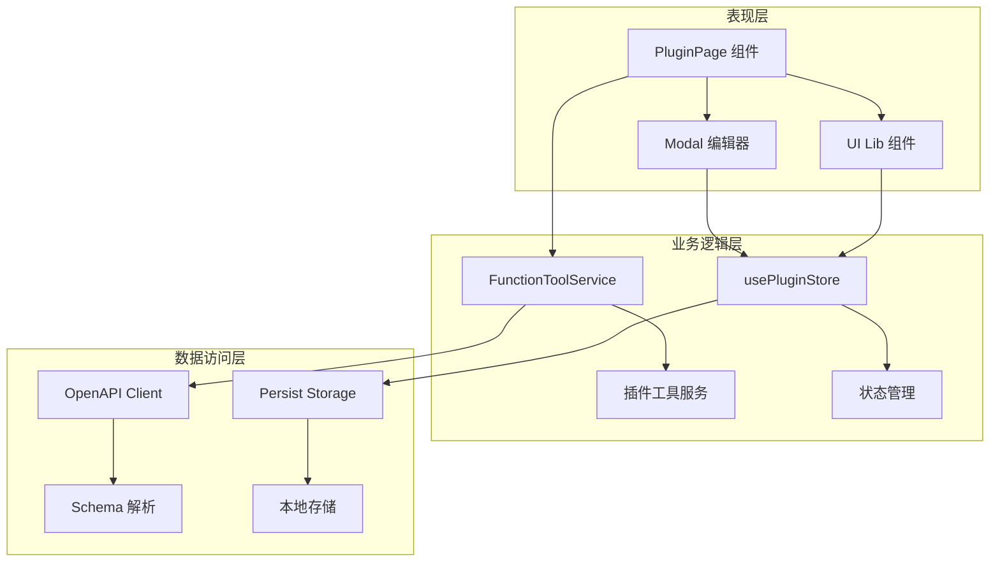

**图表来源**
- [app/components/plugin.tsx](file://app/components/plugin.tsx#L19-L28)
- [app/store/plugin.ts](file://app/store/plugin.ts#L41-L156)

## 详细组件分析

### 插件列表渲染逻辑

插件列表的渲染采用了虚拟化和优化策略：

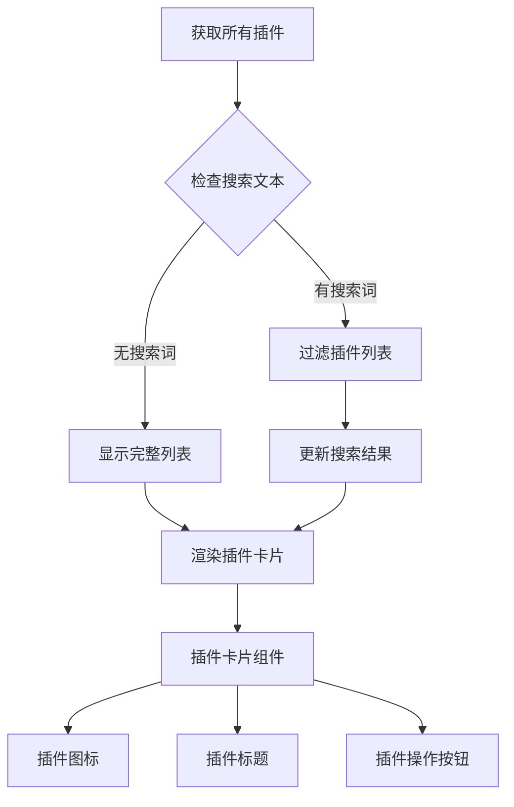

**图表来源**
- [app/components/plugin.tsx](file://app/components/plugin.tsx#L37-L52)

插件卡片包含以下关键信息：
- **插件标题**：显示插件名称和版本号
- **工具数量**：显示插件提供的工具函数数量
- **操作按钮**：编辑、删除等管理功能

### 插件搜索机制

搜索功能实现了防抖处理和智能匹配：

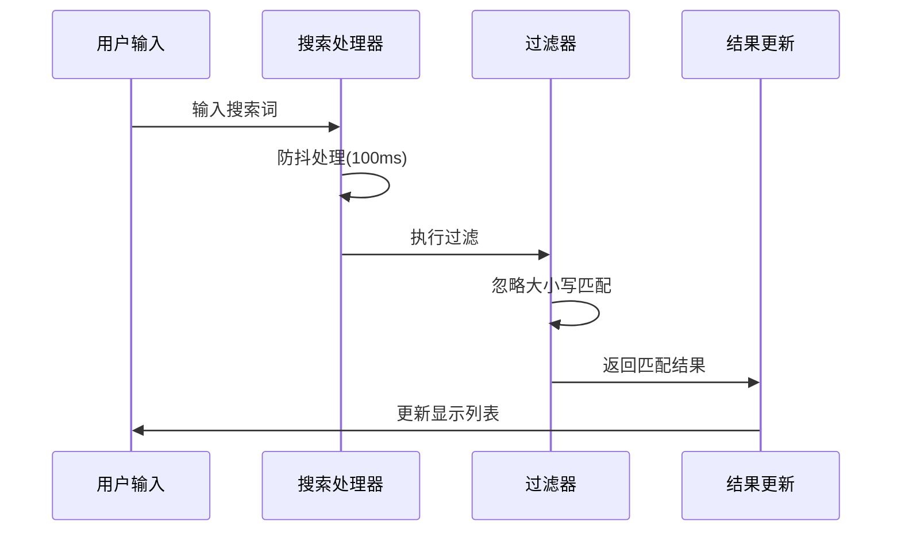

**图表来源**
- [app/components/plugin.tsx](file://app/components/plugin.tsx#L43-L52)

**章节来源**
- [app/components/plugin.tsx](file://app/components/plugin.tsx#L37-L52)

### 插件创建流程

新插件的创建过程涉及多个步骤：

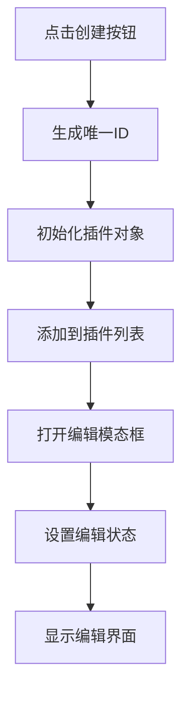

**图表来源**
- [app/components/plugin.tsx](file://app/components/plugin.tsx#L168-L169)
- [app/store/plugin.ts](file://app/store/plugin.ts#L176-L189)

**章节来源**
- [app/components/plugin.tsx](file://app/components/plugin.tsx#L168-L169)
- [app/store/plugin.ts](file://app/store/plugin.ts#L176-L189)

### OpenAPI Schema编辑器

Schema编辑器提供了强大的可视化编辑功能：

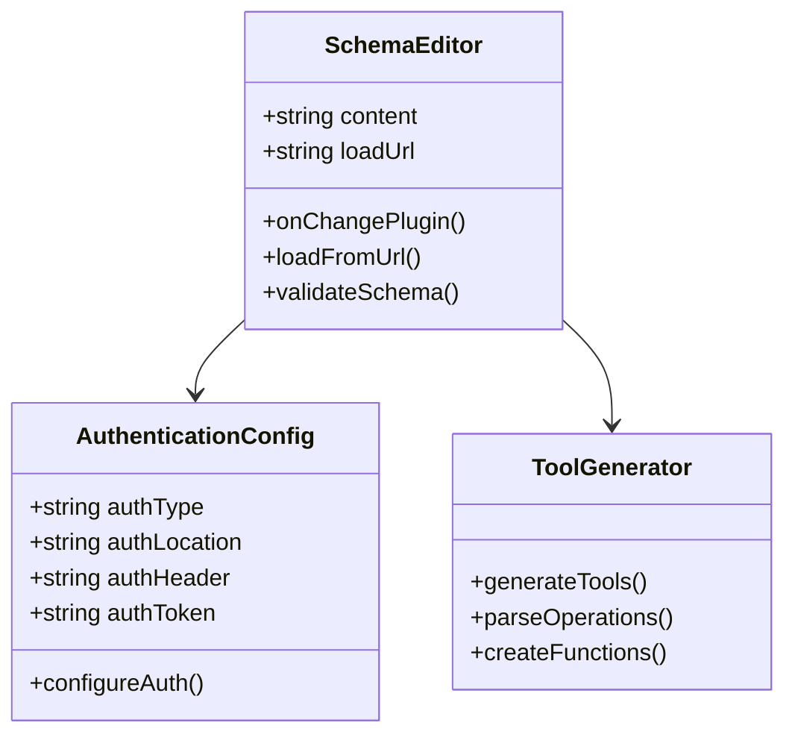

**图表来源**
- [app/components/plugin.tsx](file://app/components/plugin.tsx#L60-L117)
- [app/store/plugin.ts](file://app/store/plugin.ts#L41-L156)

**章节来源**
- [app/components/plugin.tsx](file://app/components/plugin.tsx#L60-L117)
- [app/store/plugin.ts](file://app/store/plugin.ts#L41-L156)

## 状态管理机制

### Zustand Store 实现

插件系统使用Zustand作为状态管理解决方案，提供了持久化存储和响应式更新：

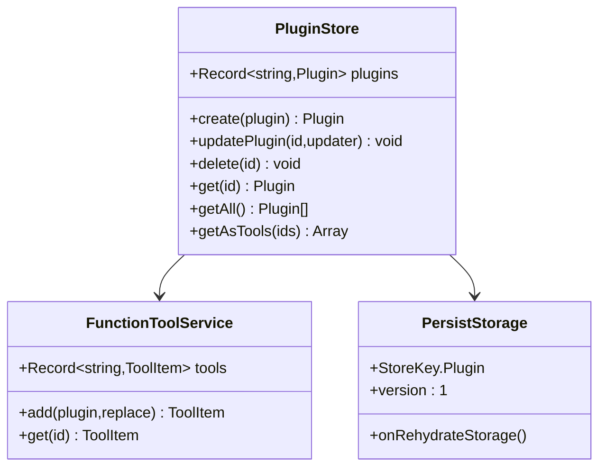

**图表来源**
- [app/store/plugin.ts](file://app/store/plugin.ts#L172-L269)
- [app/utils/store.ts](file://app/utils/store.ts#L29-L51)

### 数据持久化策略

系统采用IndexedDB进行数据持久化，确保插件数据在浏览器重启后仍然可用：

| 存储键 | 类型 | 描述 |
|--------|------|------|
| StoreKey.Plugin | 字符串 | 插件存储的唯一标识符 |
| 版本号 | 数字 | 数据结构版本，用于迁移 |
| 插件数据 | 对象数组 | 包含所有插件的完整信息 |

**章节来源**
- [app/store/plugin.ts](file://app/store/plugin.ts#L172-L269)
- [app/utils/store.ts](file://app/utils/store.ts#L29-L51)

### 插件生命周期管理

插件的CRUD操作通过专门的方法进行管理：

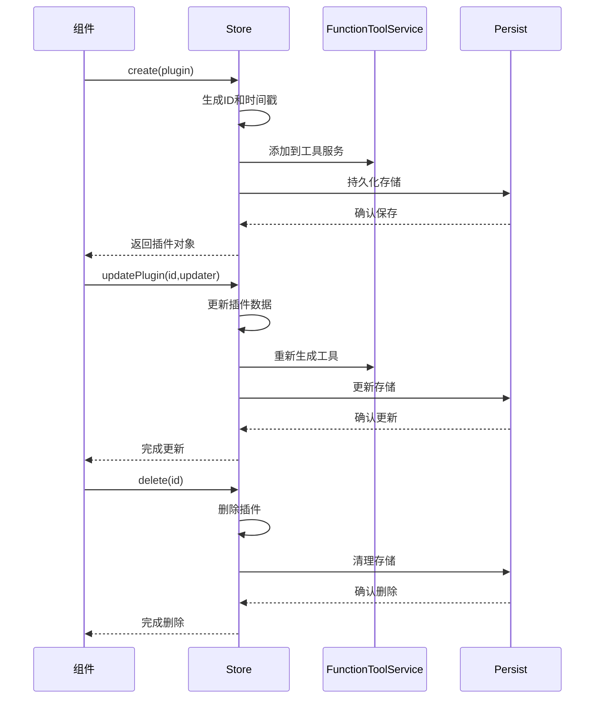

**图表来源**
- [app/store/plugin.ts](file://app/store/plugin.ts#L175-L207)

**章节来源**
- [app/store/plugin.ts](file://app/store/plugin.ts#L175-L207)

## 插件认证系统

### 认证类型支持

系统支持多种认证方式，满足不同API的需求：

| 认证类型 | 描述 | 使用场景 |
|----------|------|----------|
| None | 无认证 | 公开API接口 |
| Basic | 基础认证 | HTTP基本认证 |
| Bearer | Bearer令牌 | OAuth 2.0访问令牌 |
| Custom | 自定义认证 | 特殊认证需求 |

### 认证位置配置

认证信息可以放置在不同的HTTP位置：

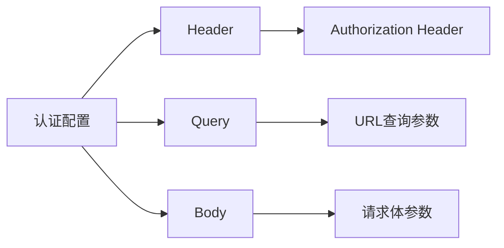

**图表来源**
- [app/components/plugin.tsx](file://app/components/plugin.tsx#L270-L288)

### 认证流程实现

认证系统的工作流程如下：

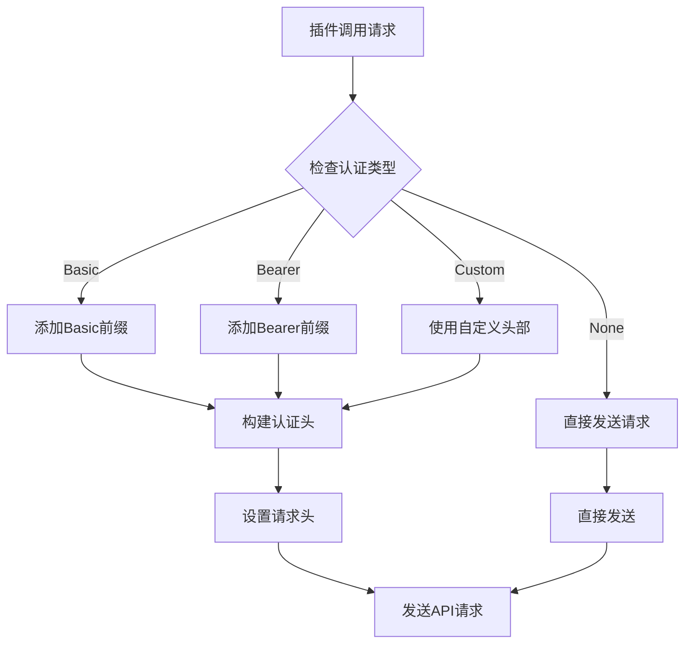

**图表来源**
- [app/store/plugin.ts](file://app/store/plugin.ts#L46-L53)
- [app/store/plugin.ts](file://app/store/plugin.ts#L61-L63)

**章节来源**
- [app/components/plugin.tsx](file://app/components/plugin.tsx#L252-L318)
- [app/store/plugin.ts](file://app/store/plugin.ts#L46-L63)

## 错误处理与用户反馈

### 错误处理机制

系统实现了多层次的错误处理策略：

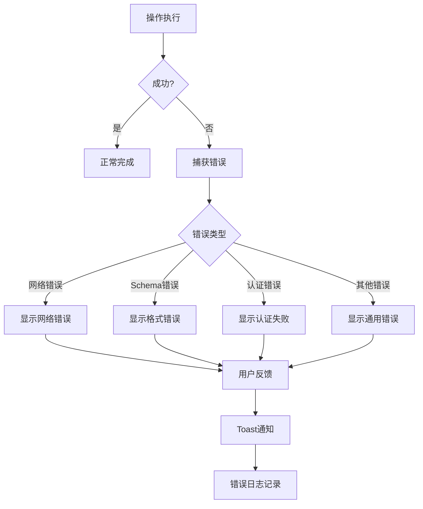

**图表来源**
- [app/components/plugin.tsx](file://app/components/plugin.tsx#L78-L85)
- [app/components/ui-lib.tsx](file://app/components/ui-lib.tsx#L232-L255)

### 用户反馈系统

系统提供了多种用户反馈机制：

| 反馈类型 | 实现方式 | 使用场景 |
|----------|----------|----------|
| Toast通知 | showToast函数 | 简短的操作反馈 |
| Modal确认 | showConfirm函数 | 危险操作确认 |
| 错误边界 | ErrorBoundary组件 | 异常情况兜底 |
| 实时验证 | 内联提示 | 输入验证反馈 |

### 开发者工具集成

系统集成了开发者友好的调试功能：

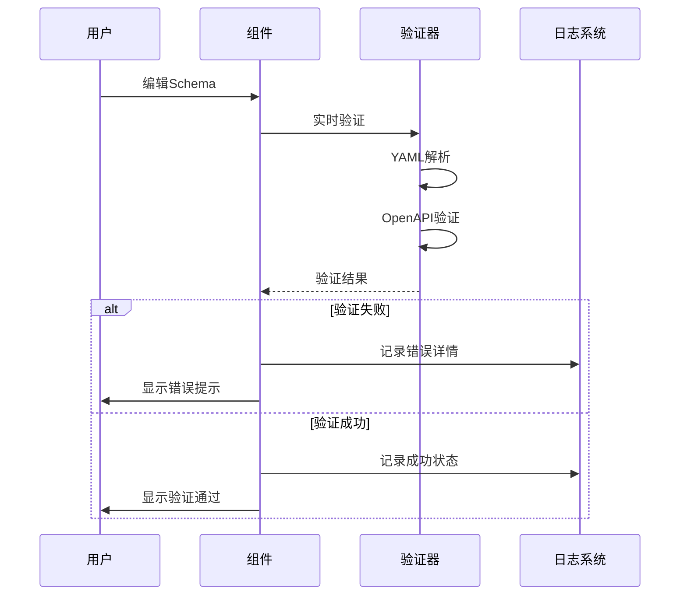

**图表来源**
- [app/components/plugin.tsx](file://app/components/plugin.tsx#L60-L85)

**章节来源**
- [app/components/plugin.tsx](file://app/components/plugin.tsx#L78-L85)
- [app/components/ui-lib.tsx](file://app/components/ui-lib.tsx#L232-L255)

## 性能考虑

### 渲染优化策略

系统采用了多种性能优化技术：

- **防抖处理**：搜索输入防抖100ms，避免频繁重新渲染
- **虚拟化**：大型插件列表的虚拟滚动支持
- **懒加载**：插件Schema的按需加载
- **缓存机制**：FunctionToolService的工具函数缓存

### 内存管理

插件系统实现了有效的内存管理：

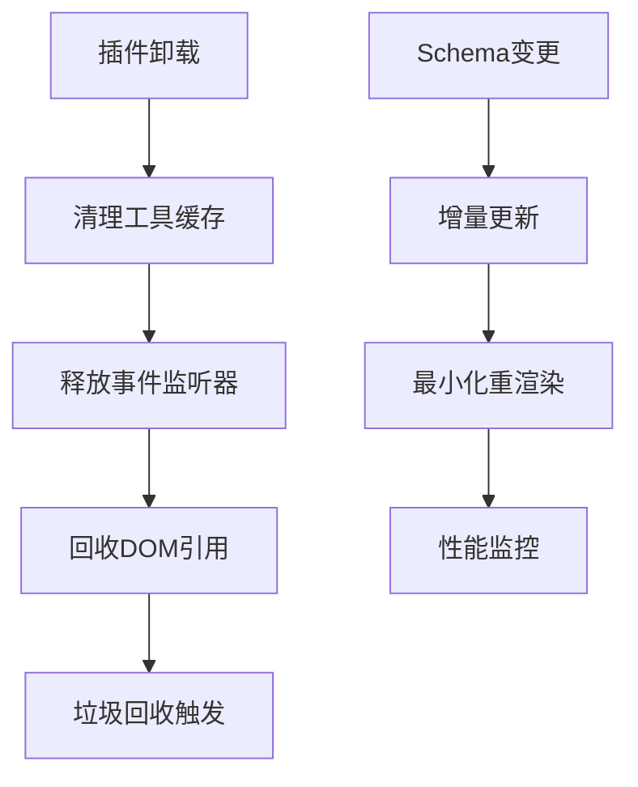

**图表来源**
- [app/store/plugin.ts](file://app/store/plugin.ts#L153-L155)

## 故障排除指南

### 常见问题及解决方案

| 问题类型 | 症状 | 解决方案 |
|----------|------|----------|
| 插件加载失败 | 插件列表为空 | 检查plugins.json文件和网络连接 |
| Schema验证错误 | 编辑器报错 | 验证YAML格式和OpenAPI规范 |
| 认证失败 | API调用被拒绝 | 检查认证配置和令牌有效性 |
| 性能问题 | 页面卡顿 | 启用防抖和减少并发请求 |

### 调试技巧

1. **开发者工具**：使用浏览器开发者工具检查网络请求和控制台错误
2. **状态检查**：通过React DevTools查看插件状态变化
3. **日志追踪**：利用console.log和错误边界记录详细日志
4. **性能分析**：使用Performance面板分析渲染性能

**章节来源**
- [app/components/plugin.tsx](file://app/components/plugin.tsx#L78-L85)
- [app/store/plugin.ts](file://app/store/plugin.ts#L80-L82)

## 结论

普通插件管理系统是一个功能完整、架构清晰的前端模块。它成功地将复杂的插件管理需求抽象为简洁的用户界面，同时保持了良好的性能和可维护性。

### 主要优势

1. **用户体验友好**：直观的界面设计和流畅的交互体验
2. **功能完整性**：覆盖插件生命周期的各个环节
3. **扩展性强**：支持多种认证方式和自定义配置
4. **稳定性高**：完善的错误处理和用户反馈机制
5. **性能优化**：采用多种优化策略确保良好性能

### 技术亮点

- **Zustand状态管理**：轻量级且高效的全局状态解决方案
- **OpenAPI集成**：原生支持OpenAPI规范的Schema解析
- **实时验证**：边编辑边验证的用户体验
- **国际化支持**：完整的多语言本地化实现

该系统为ChatGPT-Next-Web项目提供了强大的插件扩展能力，是现代Web应用中插件管理的最佳实践之一。