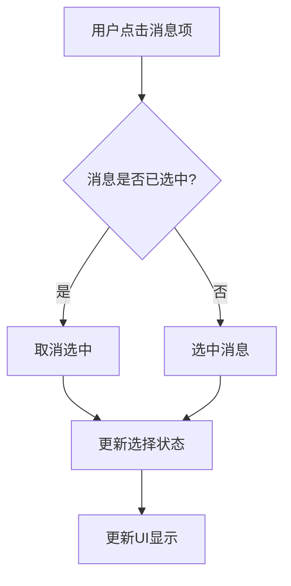

# 上下文消息选择

<cite>
**本文档引用的文件**  
- [message-selector.tsx](file://app/components/message-selector.tsx)
- [message-selector.module.scss](file://app/components/message-selector.module.scss)
- [exporter.tsx](file://app/components/exporter.tsx)
- [chat.tsx](file://app/components/chat.tsx)
- [utils.ts](file://app/utils.ts)
- [store/chat.ts](file://app/store/chat.ts)
- [locales/cn.ts](file://app/locales/cn.ts)
</cite>

## 目录
1. [简介](#简介)
2. [核心功能分析](#核心功能分析)
3. [UI交互设计](#ui交互设计)
4. [数据传递机制](#数据传递机制)
5. [样式与布局](#样式与布局)
6. [使用场景分析](#使用场景分析)
7. [结论](#结论)

## 简介
`message-selector.tsx` 组件在聊天应用中扮演着关键角色，它允许用户从历史消息中选择特定片段作为新请求的上下文，从而提升对话的连贯性和相关性。该组件通过直观的UI设计和高效的交互逻辑，为用户提供了一种便捷的方式来构建和管理对话上下文。

## 核心功能分析

`message-selector.tsx` 组件的核心功能是允许用户从历史消息中选择特定的片段作为新请求的上下文。这一功能通过以下几个关键机制实现：

1. **消息过滤与搜索**：组件提供了搜索功能，用户可以通过输入关键词来过滤消息列表，快速定位到需要选择的消息。
2. **多选与范围选择**：支持通过Shift键进行范围选择，用户可以连续选择多个消息。
3. **选择状态管理**：使用 `useMessageSelector` Hook 来管理选中消息的状态，确保选择的准确性和一致性。

**Section sources**
- [message-selector.tsx](file://app/components/message-selector.tsx#L54-L66)
- [message-selector.tsx](file://app/components/message-selector.tsx#L13-L52)

## UI交互设计

### 消息项的勾选机制
组件中的每个消息项都包含一个复选框，用户可以通过点击复选框或消息项本身来选择或取消选择消息。复选框的状态由 `isSelected` 变量控制，该变量通过 `props.selection.has(id)` 判断消息是否被选中。



**Diagram sources**
- [message-selector.tsx](file://app/components/message-selector.tsx#L204-L207)

### 选中状态的视觉反馈
选中的消息项会通过背景色变化来提供视觉反馈。具体来说，选中的消息项的背景色会变为 `var(--second)`，这使得用户能够清晰地看到哪些消息已被选中。

```scss
.message-selected {
  background-color: var(--second);
}
```

**Diagram sources**
- [message-selector.module.scss](file://app/components/message-selector.module.scss#L48-L50)

### 确认/取消操作流程
组件提供了“全选”、“最近几条”和“清除选中”三个按钮，用户可以通过这些按钮快速完成常见的选择操作。例如，“最近几条”按钮会自动选择最近的4条消息。

```mermaid
flowchart TD
A[用户点击"最近几条"] --> B[清除当前选择]
B --> C[选择最近4条消息]
C --> D[更新选择状态]
D --> E[更新UI显示]
```

**Diagram sources**
- [message-selector.tsx](file://app/components/message-selector.tsx#L172-L177)

**Section sources**
- [message-selector.tsx](file://app/components/message-selector.tsx#L161-L187)
- [locales/cn.ts](file://app/locales/cn.ts#L139-L144)

## 数据传递机制

### 与主聊天组件的数据传递
`message-selector.tsx` 组件通过 `props` 与主聊天组件进行数据传递。主聊天组件通过 `useMessageSelector` Hook 获取选择状态，并将 `selection` 和 `updateSelection` 作为 `props` 传递给 `MessageSelector` 组件。

```typescript
const { selection, updateSelection } = useMessageSelector();
return <MessageSelector selection={selection} updateSelection={updateSelection} />;
```

**Section sources**
- [exporter.tsx](file://app/components/exporter.tsx#L168)
- [exporter.tsx](file://app/components/exporter.tsx#L244-L248)

### 将选中的消息ID列表注入到新的用户输入中
当用户完成选择并提交时，选中的消息ID列表会被注入到新的用户输入中。主聊天组件通过 `getMessagesWithMemory` 方法获取包含选中消息的完整消息列表，并将其用于生成新的请求。

```typescript
async getMessagesWithMemory() {
  const session = get().currentSession();
  const messages = session.messages.slice();
  const selectedMessages = messages.filter(m => selection.has(m.id));
  // 将选中的消息注入到新的请求中
}
```

**Section sources**
- [store/chat.ts](file://app/store/chat.ts#L542-L568)
- [message-selector.tsx](file://app/components/message-selector.tsx#L56-L66)

## 样式与布局

### 弹出式对话框的布局
`message-selector.tsx` 组件通常以弹出式对话框的形式展示，其布局包括一个搜索栏、操作按钮和消息列表。搜索栏位于顶部，操作按钮位于搜索栏下方，消息列表则占据剩余空间。

```scss
.message-selector {
  .message-filter {
    display: flex;
    .search-bar {
      flex-grow: 1;
      margin-right: 10px;
    }
    .actions {
      display: flex;
      button:not(:last-child) {
        margin-right: 10px;
      }
    }
  }
  .messages {
    margin-top: 20px;
    border-radius: 10px;
    border: var(--border-in-light);
    overflow: hidden;
  }
}
```

**Diagram sources**
- [message-selector.module.scss](file://app/components/message-selector.module.scss#L2-L34)
- [message-selector.module.scss](file://app/components/message-selector.module.scss#L36-L41)

### 动画过渡效果
组件在显示和隐藏时会使用平滑的动画过渡效果，提升用户体验。虽然具体的动画效果未在SCSS文件中明确定义，但可以通过React的 `useEffect` 和 `useState` 钩子来实现。

### 响应式适配策略
组件在不同屏幕尺寸下具有良好的响应式适配。在小屏幕设备上，搜索栏和操作按钮会垂直排列，以适应较小的屏幕宽度。

```scss
@media screen and (max-width: 600px) {
  .message-filter {
    flex-direction: column;
    .search-bar {
      margin-right: 0;
    }
    .actions {
      margin-top: 20px;
      button {
        flex-grow: 1;
      }
    }
  }
}
```

**Diagram sources**
- [message-selector.module.scss](file://app/components/message-selector.module.scss#L19-L33)

## 使用场景分析

### 导出消息
`message-selector.tsx` 组件在导出消息时被广泛使用。用户可以通过选择特定的消息片段，将其导出为文本、图片或JSON格式。`exporter.tsx` 组件中使用了 `MessageSelector` 来实现这一功能。

```typescript
function MessageExporter() {
  const { selection, updateSelection } = useMessageSelector();
  return (
    <MessageSelector
      selection={selection}
      updateSelection={updateSelection}
      defaultSelectAll
    />
  );
}
```

**Section sources**
- [exporter.tsx](file://app/components/exporter.tsx#L168)
- [exporter.tsx](file://app/components/exporter.tsx#L244-L248)

## 结论
`message-selector.tsx` 组件通过其强大的功能和直观的UI设计，显著提升了聊天应用的用户体验。它不仅允许用户从历史消息中选择特定片段作为新请求的上下文，还通过高效的交互逻辑和响应式布局，确保了在不同设备上的良好表现。未来可以进一步优化其动画效果和性能，以提供更加流畅的用户体验。