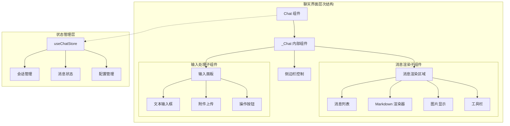
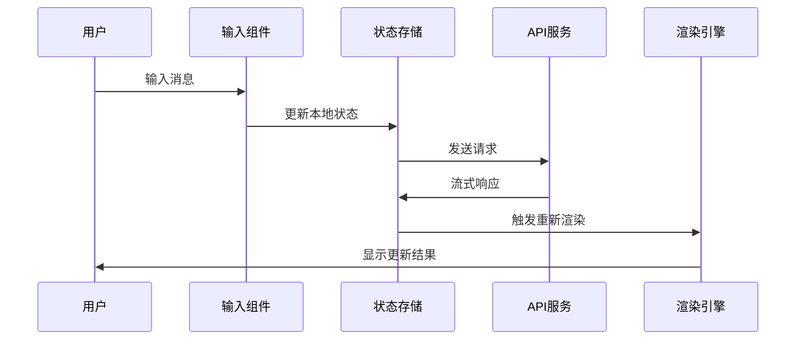
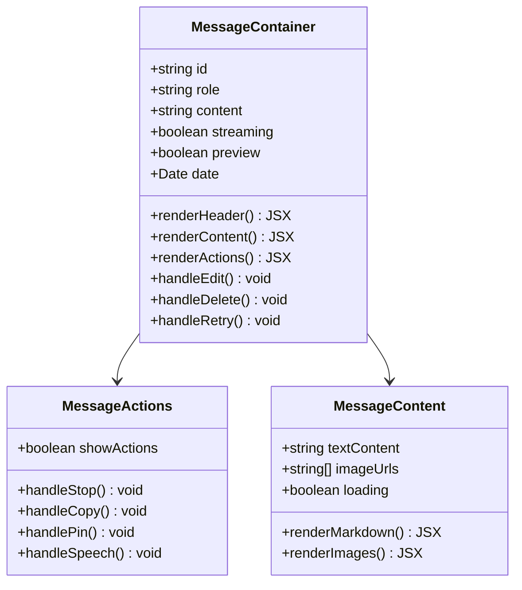
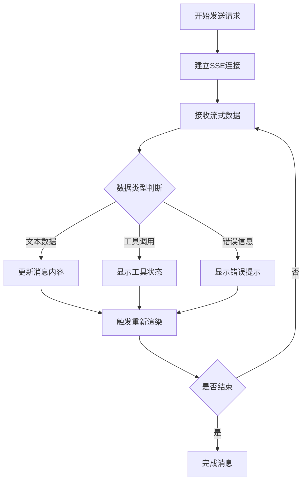
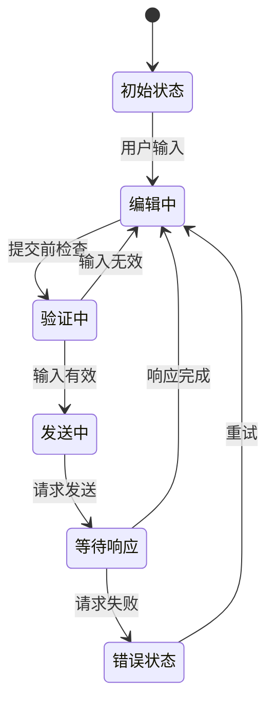
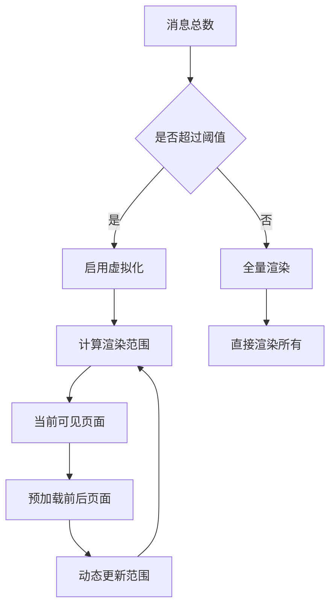
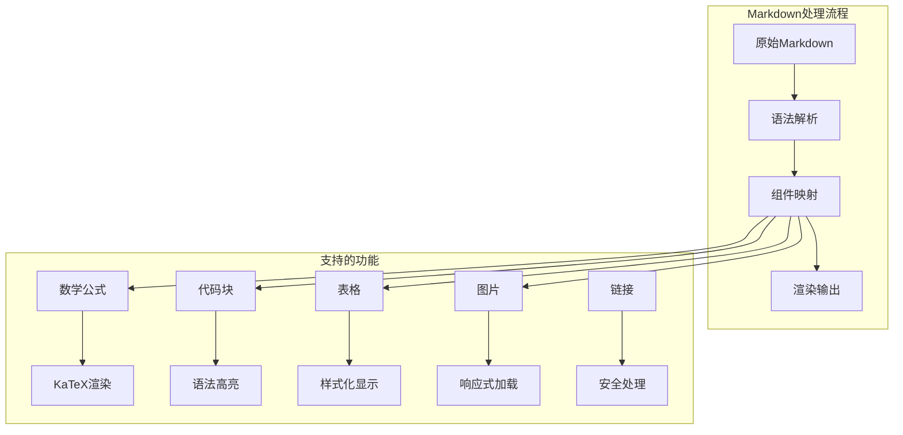
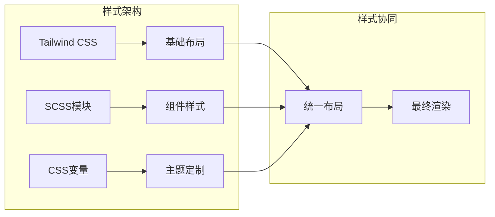
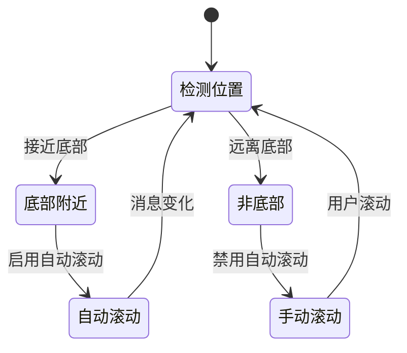

# 主聊天容器

<cite>
**本文档中引用的文件**
- [chat.tsx](file://app/components/chat.tsx)
- [chat.ts](file://app/store/chat.ts)
- [stream.ts](file://app/utils/stream.ts)
- [markdown.tsx](file://app/components/markdown.tsx)
- [message-selector.tsx](file://app/components/message-selector.tsx)
- [chat.module.scss](file://app/components/chat.module.scss)
- [hooks.ts](file://app/utils/hooks.ts)
</cite>

## 目录
1. [简介](#简介)
2. [项目结构概览](#项目结构概览)
3. [核心组件架构](#核心组件架构)
4. [消息流渲染机制](#消息流渲染机制)
5. [实时流式响应处理](#实时流式响应处理)
6. [输入框受控组件管理](#输入框受控组件管理)
7. [状态管理集成](#状态管理集成)
8. [虚拟化渲染策略](#虚拟化渲染策略)
9. [富文本处理能力](#富文本处理能力)
10. [样式系统协同](#样式系统协同)
11. [交互细节实现](#交互细节实现)
12. [性能优化考虑](#性能优化考虑)
13. [总结](#总结)

## 简介

chat.tsx是ChatGPT-Next-Web项目中的核心聊天界面容器组件，作为整个聊天功能的中央枢纽，负责协调消息渲染、用户输入处理、实时响应流式传输以及与状态管理系统深度集成。该组件采用现代化的React架构设计，结合虚拟化渲染、流式处理和响应式设计原则，为用户提供流畅的聊天体验。

## 项目结构概览



**图表来源**
- [chat.tsx](file://app/components/chat.tsx#L989-L2172)
- [chat.ts](file://app/store/chat.ts#L232-L932)

**章节来源**
- [chat.tsx](file://app/components/chat.tsx#L1-L50)
- [chat.ts](file://app/store/chat.ts#L1-L50)

## 核心组件架构

### 组件层次结构

chat.tsx采用分层架构设计，主要包含以下核心层次：

1. **顶层容器层**：负责整体布局和路由导航
2. **消息渲染层**：处理消息列表的渲染和交互
3. **输入控制层**：管理用户输入和提交逻辑
4. **状态管理层**：与useChatStore深度集成

### 关键数据流



**图表来源**
- [chat.tsx](file://app/components/chat.tsx#L1105-L1124)
- [chat.ts](file://app/store/chat.ts#L407-L527)

**章节来源**
- [chat.tsx](file://app/components/chat.tsx#L989-L1030)

## 消息流渲染机制

### 渲染消息类型

组件支持多种消息类型的渲染：

| 消息类型 | 描述 | 渲染特点 |
|---------|------|----------|
| 用户消息 | 用户发送的文本或多媒体内容 | 右对齐，蓝色主题色 |
| 助手消息 | AI生成的响应内容 | 左对齐，灰色主题色 |
| 预览消息 | 正在发送但未完成的消息 | 占位符显示 |
| 上下文消息 | 系统预设的上下文提示 | 特殊样式标识 |

### 消息容器设计

每个消息都封装在独立的容器中，支持丰富的交互功能：



**图表来源**
- [chat.tsx](file://app/components/chat.tsx#L1786-L2038)
- [chat.ts](file://app/store/chat.ts#L56-L65)

**章节来源**
- [chat.tsx](file://app/components/chat.tsx#L1348-L1402)

## 实时流式响应处理

### SSE接收与处理流程

组件实现了完整的Server-Sent Events (SSE) 处理机制：



**图表来源**
- [chat.ts](file://app/store/chat.ts#L459-L527)
- [stream.ts](file://app/utils/stream.ts#L22-L109)

### 流式响应状态管理

| 状态 | 描述 | 视觉反馈 |
|------|------|----------|
| streaming: true | 正在接收流式数据 | 加载动画显示 |
| preview: true | 预览状态消息 | 占位符效果 |
| isError: true | 发生错误 | 错误提示样式 |
| tools: [] | 工具调用状态 | 工具栏显示 |

**章节来源**
- [chat.ts](file://app/store/chat.ts#L459-L527)

## 输入框受控组件管理

### 受控输入状态

输入框采用完全受控的方式进行管理：



**图表来源**
- [chat.tsx](file://app/components/chat.tsx#L1001-L1124)

### 输入处理特性

1. **自动增长**：根据内容自动调整文本区域高度
2. **粘贴处理**：支持图片粘贴和文件上传
3. **快捷键支持**：多种键盘快捷键操作
4. **撤销恢复**：保存未完成的输入内容

**章节来源**
- [chat.tsx](file://app/components/chat.tsx#L1049-L1124)

## 状态管理集成

### useChatStore深度集成

组件与useChatStore建立了全面的状态同步机制：

```mermaid
graph LR
subgraph "状态同步机制"
A[本地状态] < --> B[useChatStore]
B < --> C[持久化存储]
C < --> D[全局配置]
end
subgraph "状态类型"
E[会话状态] --> F[消息列表]
E --> G[会话配置]
E --> H[用户偏好]
end
A --> E
B --> E
```

**图表来源**
- [chat.ts](file://app/store/chat.ts#L232-L240)
- [chat.tsx](file://app/components/chat.tsx#L992-L994)

### 会话状态同步

| 同步点 | 同步内容 | 触发条件 |
|--------|----------|----------|
| 消息发送 | 新消息添加到列表 | 用户点击发送 |
| 消息接收 | 流式响应更新 | API返回数据 |
| 会话切换 | 状态重置和加载 | 用户选择不同会话 |
| 配置变更 | 全局设置应用 | 用户修改设置 |

**章节来源**
- [chat.ts](file://app/store/chat.ts#L380-L406)

## 虚拟化渲染策略

### 分页渲染实现

为了处理大量消息的高效渲染，组件实现了智能的分页渲染策略：



**图表来源**
- [chat.tsx](file://app/components/chat.tsx#L1386-L1402)

### 渲染性能优化

1. **消息索引管理**：使用msgRenderIndex控制渲染范围
2. **懒加载机制**：只渲染可见区域的消息
3. **预加载策略**：提前加载相邻页面的消息
4. **滚动检测**：智能检测滚动位置并更新渲染范围

**章节来源**
- [chat.tsx](file://app/components/chat.tsx#L1386-L1424)

## 富文本处理能力

### Markdown组件集成

组件集成了强大的Markdown渲染引擎，支持丰富的格式化功能：



**图表来源**
- [markdown.tsx](file://app/components/markdown.tsx#L270-L316)
- [chat.tsx](file://app/components/chat.tsx#L1970-L1986)

### 代码高亮与数学公式

| 功能 | 实现方式 | 支持语言 |
|------|----------|----------|
| 代码高亮 | Prism.js | JavaScript, Python, Go, Java等 |
| 数学公式 | KaTeX | LaTeX语法支持 |
| Mermaid图表 | Mermaid.js | 流程图、序列图等 |
| HTML预览 | 内置处理器 | 自动识别和渲染 |

**章节来源**
- [markdown.tsx](file://app/components/markdown.tsx#L1-L353)

## 样式系统协同

### Tailwind CSS与SCSS模块化

组件采用了混合样式系统的架构：



**图表来源**
- [chat.module.scss](file://app/components/chat.module.scss#L1-L50)
- [chat.tsx](file://app/components/chat.tsx#L90-L91)

### 响应式设计实现

| 断点 | 设备类型 | 样式调整 |
|------|----------|----------|
| 600px以下 | 移动设备 | 简化布局，大字体 |
| 600px-1200px | 平板设备 | 中等布局，适中字体 |
| 1200px以上 | 桌面设备 | 完整布局，标准字体 |

**章节来源**
- [chat.module.scss](file://app/components/chat.module.scss#L314-L531)

## 交互细节实现

### 自动滚动机制

组件实现了智能的自动滚动功能：



**图表来源**
- [chat.tsx](file://app/components/chat.tsx#L453-L491)

### 加载状态与错误处理

1. **加载状态**：通过loading属性控制加载指示器
2. **错误提示**：错误消息的特殊样式和处理
3. **重试机制**：支持消息重发和重新加载
4. **网络异常**：断网情况下的友好提示

**章节来源**
- [chat.tsx](file://app/components/chat.tsx#L1144-L1167)

## 性能优化考虑

### 渲染性能优化

1. **React.memo使用**：对复杂组件进行记忆化处理
2. **事件委托**：减少事件监听器数量
3. **防抖处理**：输入和搜索操作的防抖优化
4. **内存管理**：及时清理不需要的数据引用

### 网络性能优化

1. **请求合并**：批量处理多个API请求
2. **缓存策略**：合理利用浏览器缓存
3. **连接复用**：保持长连接减少握手开销
4. **错误重试**：智能的重试机制

**章节来源**
- [chat.tsx](file://app/components/chat.tsx#L1-L50)

## 总结

chat.tsx作为核心聊天界面容器，展现了现代Web应用开发的最佳实践。通过深度集成状态管理、实现高效的虚拟化渲染、提供丰富的富文本处理能力和优雅的响应式设计，该组件为用户提供了流畅、稳定且功能丰富的聊天体验。

其架构设计体现了以下核心优势：
- **模块化结构**：清晰的组件分层和职责分离
- **性能优化**：智能的渲染策略和资源管理
- **用户体验**：流畅的交互和完善的错误处理
- **可扩展性**：良好的架构便于功能扩展和维护

这种设计模式不仅适用于当前的聊天功能，也为未来的功能扩展和性能优化奠定了坚实的基础。