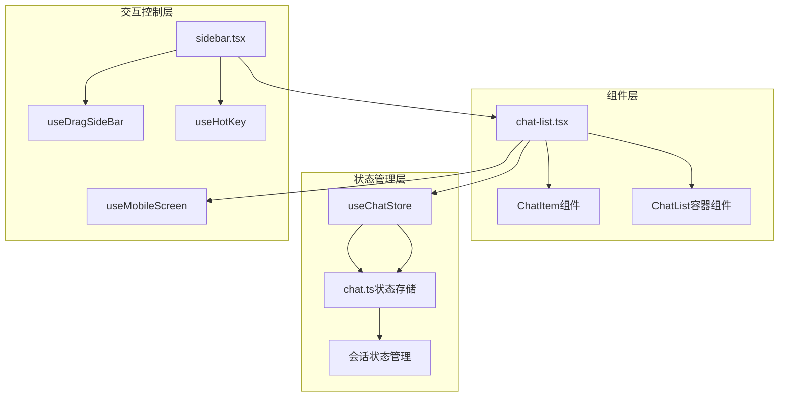
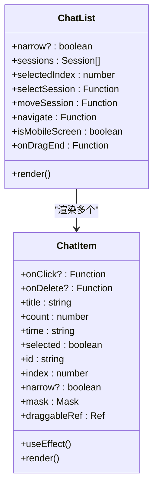
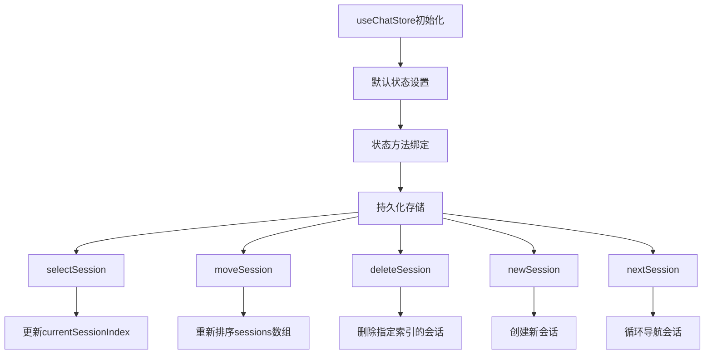
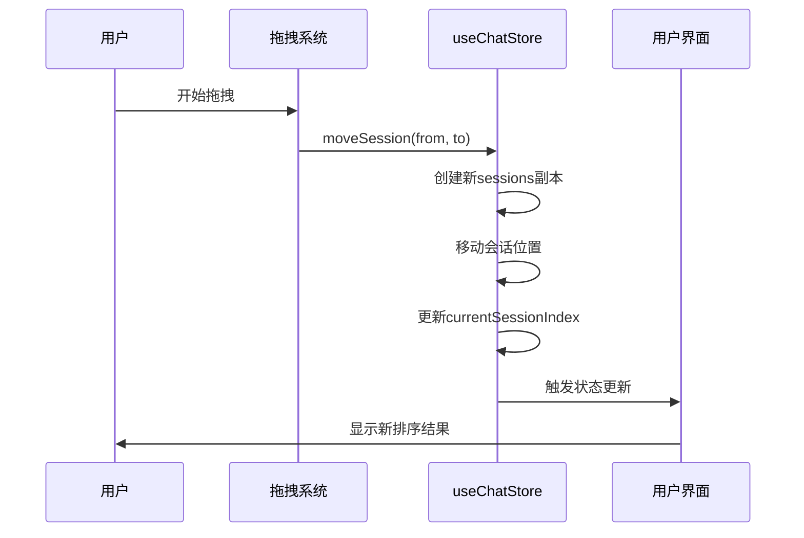
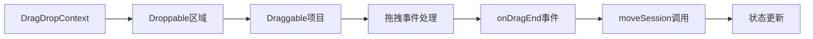
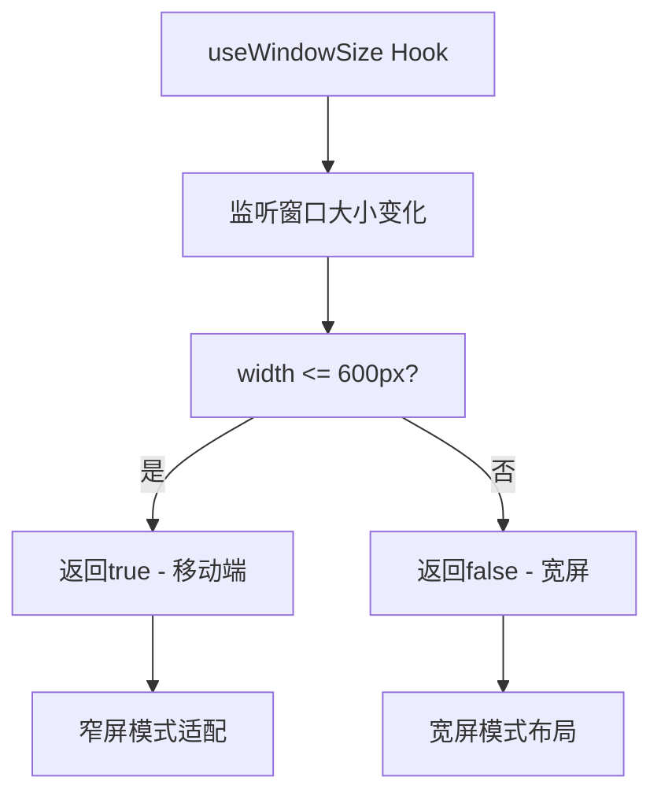
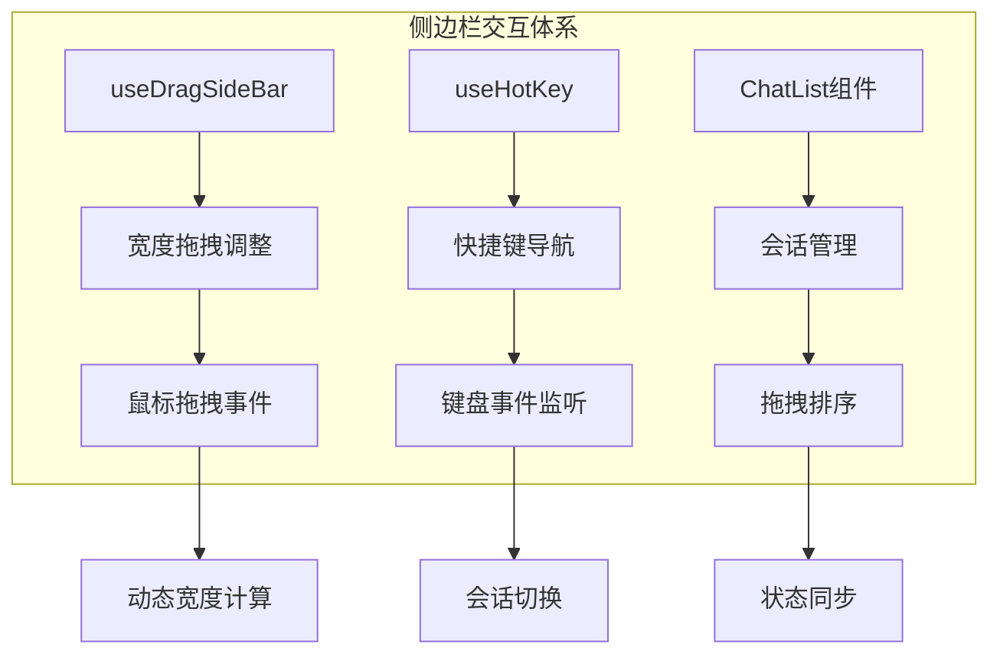
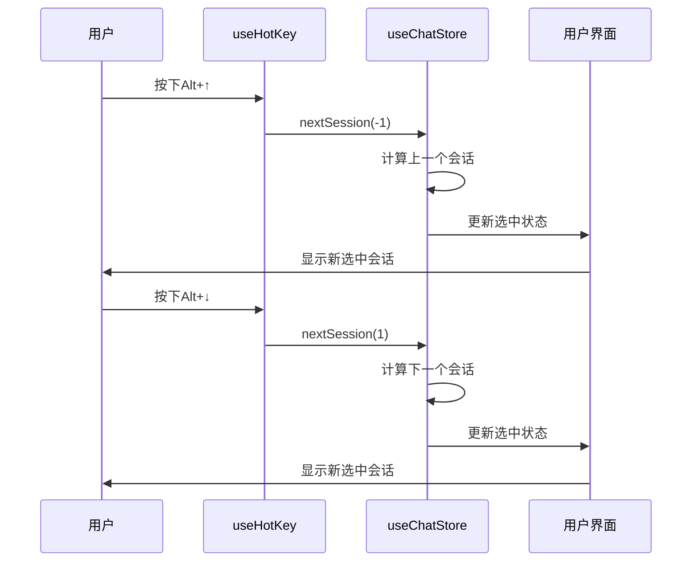

# 会话列表管理

<cite>
**本文档中引用的文件**
- [chat-list.tsx](file://app/components/chat-list.tsx)
- [sidebar.tsx](file://app/components/sidebar.tsx)
- [chat.ts](file://app/store/chat.ts)
- [hooks.ts](file://app/utils/hooks.ts)
- [constant.ts](file://app/constant.ts)
- [utils.ts](file://app/utils.ts)
</cite>

## 目录
1. [简介](#简介)
2. [项目结构概览](#项目结构概览)
3. [核心组件分析](#核心组件分析)
4. [状态管理系统](#状态管理系统)
5. [拖拽排序机制](#拖拽排序机制)
6. [响应式UI设计](#响应式ui设计)
7. [交互体系架构](#交互体系架构)
8. [性能优化考虑](#性能优化考虑)
9. [故障排除指南](#故障排除指南)
10. [总结](#总结)

## 简介

ChatGPT-Next-Web的会话列表管理是一个复杂而精密的系统，负责处理用户会话的创建、显示、排序和删除等功能。该系统通过React Hooks和状态管理库实现了高度响应式的用户体验，支持拖拽排序、键盘导航等高级功能。

本文档深入分析chat-list.tsx组件在会话列表管理中的核心作用，详细说明其如何通过useChatStore钩子订阅会话状态，实现会话项的渲染、选择与删除功能。同时探讨DragDropContext与Draggable组件集成实现的会话拖拽排序逻辑，以及窄屏模式下的UI适配策略。

## 项目结构概览

会话列表管理系统主要由以下核心模块组成：



**图表来源**
- [chat-list.tsx](file://app/components/chat-list.tsx#L1-L175)
- [sidebar.tsx](file://app/components/sidebar.tsx#L1-L369)
- [chat.ts](file://app/store/chat.ts#L1-L932)

**章节来源**
- [chat-list.tsx](file://app/components/chat-list.tsx#L1-L175)
- [sidebar.tsx](file://app/components/sidebar.tsx#L1-L369)

## 核心组件分析

### ChatItem组件：单个会话项渲染

ChatItem组件是会话列表中每个会话项的具体表现形式，负责渲染会话的基本信息并处理用户交互。



**图表来源**
- [chat-list.tsx](file://app/components/chat-list.tsx#L23-L102)
- [chat-list.tsx](file://app/components/chat-list.tsx#L105-L174)

#### 组件属性与功能

ChatItem组件接收以下关键属性：
- **基础信息属性**：title（会话标题）、count（消息数量）、time（最后更新时间）
- **状态属性**：selected（是否选中）、id（唯一标识）、index（索引位置）
- **交互属性**：onClick（点击回调）、onDelete（删除回调）
- **样式属性**：narrow（窄屏模式标志）、mask（会话配置）

#### 窄屏模式适配

在窄屏模式下，ChatItem采用紧凑布局：
- 显示头像和计数的组合布局
- 移除详细的时间和消息统计信息
- 优化触摸交互体验

**章节来源**
- [chat-list.tsx](file://app/components/chat-list.tsx#L23-L102)

### ChatList容器组件：会话列表管理

ChatList组件作为ChatItem的容器，负责管理整个会话列表的状态和交互逻辑。

#### 状态订阅与管理

通过useChatStore钩子订阅会话状态：
```typescript
const [sessions, selectedIndex, selectSession, moveSession] = useChatStore(
  (state) => [
    state.sessions,
    state.currentSessionIndex,
    state.selectSession,
    state.moveSession,
  ],
);
```

#### 会话选择机制

当用户点击某个会话项时：
1. 调用selectSession方法更新当前选中索引
2. 导航到聊天页面（Path.Chat）
3. 触发状态更新以反映新的选中状态

#### 删除确认机制

删除操作采用双重确认：
- 在窄屏或移动设备上直接删除
- 在宽屏设备上显示确认对话框

**章节来源**
- [chat-list.tsx](file://app/components/chat-list.tsx#L105-L174)

## 状态管理系统

### useChatStore状态存储

useChatStore是整个应用的状态管理中心，基于zustand库实现。



**图表来源**
- [chat.ts](file://app/store/chat.ts#L232-L932)

#### moveSession方法实现

moveSession方法是拖拽排序的核心逻辑：



**图表来源**
- [chat.ts](file://app/store/chat.ts#L282-L304)

#### 状态更新策略

状态更新采用不可变更新模式：
- 创建sessions的新副本进行修改
- 计算新的currentSessionIndex
- 避免直接修改原始状态

**章节来源**
- [chat.ts](file://app/store/chat.ts#L232-L932)

## 拖拽排序机制

### DragDropContext集成

系统使用@hello-pangea/dnd库实现拖拽功能：



**图表来源**
- [chat-list.tsx](file://app/components/chat-list.tsx#L134-L172)

### onDragEnd事件处理

onDragEnd事件处理器实现精确的位置验证和状态更新：

#### 事件处理流程

1. **目标检查**：验证destination是否存在
2. **位置比较**：判断是否发生了实际位置变化
3. **状态更新**：调用moveSession方法更新状态
4. **副作用处理**：触发UI重新渲染

#### 性能优化策略

- 使用防抖技术减少频繁的状态更新
- 实现智能的位置检测避免不必要的重排
- 优化DOM操作减少重绘和回流

**章节来源**
- [chat-list.tsx](file://app/components/chat-list.tsx#L118-L132)

## 响应式UI设计

### 移动端检测机制

系统通过useMobileScreen Hook实现响应式设计：



**图表来源**
- [utils.ts](file://app/utils.ts#L145-L149)

### 窄屏模式适配策略

#### 布局调整

窄屏模式下的UI适配包括：
- 缩小侧边栏宽度
- 简化会话项显示内容
- 优化触摸交互区域
- 调整字体和间距

#### 功能简化

为适应小屏幕，系统提供简化的功能集：
- 移除详细的时间显示
- 仅显示关键的头像和计数
- 优化滚动性能
- 减少视觉元素

**章节来源**
- [utils.ts](file://app/utils.ts#L145-L149)
- [chat-list.tsx](file://app/components/chat-list.tsx#L65-L86)

## 交互体系架构

### 侧边栏整体交互体系

sidebar.tsx文件实现了完整的侧边栏交互体系，包括宽度调整、快捷键导航等功能。



**图表来源**
- [sidebar.tsx](file://app/components/sidebar.tsx#L227-L369)

### useDragSideBar宽度调整

宽度调整功能提供了直观的拖拽体验：

#### 拖拽算法实现

1. **初始状态记录**：保存拖拽开始时的宽度和鼠标位置
2. **实时计算**：根据鼠标位移计算新的宽度
3. **边界限制**：确保宽度在最小值和最大值之间
4. **平滑过渡**：使用CSS动画实现流畅的宽度变化

#### 点击切换功能

拖拽图标支持点击切换窄屏模式：
- 快速点击触发模式切换
- 长按执行拖拽操作
- 区分不同交互意图

**章节来源**
- [sidebar.tsx](file://app/components/sidebar.tsx#L65-L136)

### useHotKey快捷键导航

快捷键系统提供了高效的键盘导航方式：

#### 键盘事件处理



**图表来源**
- [sidebar.tsx](file://app/components/sidebar.tsx#L46-L62)

#### 循环导航机制

nextSession方法实现了循环导航：
- 支持正向和反向导航
- 自动处理边界情况
- 保持状态一致性

**章节来源**
- [sidebar.tsx](file://app/components/sidebar.tsx#L46-L62)

## 性能优化考虑

### 渲染性能优化

#### 虚拟化技术

对于大量会话的情况，可以考虑实现虚拟化：
- 只渲染可见区域的会话项
- 动态计算渲染范围
- 优化滚动性能

#### 状态更新优化

- 使用浅比较避免不必要的重渲染
- 合并多个状态更新
- 实现选择性更新

### 内存管理

#### 引用清理

- 及时清理事件监听器
- 释放不再需要的DOM引用
- 避免内存泄漏

#### 数据结构优化

- 使用高效的数据结构存储会话
- 实现懒加载机制
- 优化序列化和反序列化

## 故障排除指南

### 常见问题诊断

#### 拖拽功能异常

**症状**：拖拽排序不工作或出现错误
**可能原因**：
- DragDropContext配置错误
- Draggable组件缺少必需属性
- 状态更新冲突

**解决方案**：
- 检查onDragEnd事件处理函数
- 验证会话数据结构完整性
- 确认状态更新的原子性

#### 响应式布局问题

**症状**：窄屏模式显示异常
**可能原因**：
- 媒体查询条件错误
- CSS变量未正确设置
- 组件依赖关系混乱

**解决方案**：
- 验证useMobileScreen Hook的返回值
- 检查CSS变量的动态设置
- 确认组件的依赖注入

#### 状态同步问题

**症状**：UI与状态不一致
**可能原因**：
- 状态更新时机错误
- 异步操作导致的竞争条件
- 缓存机制失效

**解决方案**：
- 使用正确的状态更新模式
- 实现适当的异步处理
- 清理过期的缓存数据

**章节来源**
- [chat-list.tsx](file://app/components/chat-list.tsx#L118-L132)
- [utils.ts](file://app/utils.ts#L145-L149)

## 总结

ChatGPT-Next-Web的会话列表管理系统展现了现代前端应用的最佳实践。通过精心设计的组件架构、高效的状态管理和丰富的交互功能，为用户提供了流畅而直观的体验。

### 关键特性总结

1. **模块化设计**：清晰的组件分离和职责划分
2. **响应式架构**：完善的移动端适配和性能优化
3. **交互丰富性**：拖拽排序、键盘导航等高级功能
4. **状态管理**：基于zustand的高效状态管理
5. **可扩展性**：良好的代码组织和接口设计

### 技术亮点

- **Drag-and-drop集成**：无缝的拖拽排序体验
- **智能响应式设计**：自适应不同屏幕尺寸
- **性能优化**：合理的渲染策略和状态管理
- **用户体验**：直观的交互和反馈机制

这个系统不仅满足了基本的会话管理需求，更为未来的功能扩展奠定了坚实的基础。通过持续的优化和改进，它将继续为用户提供卓越的使用体验。