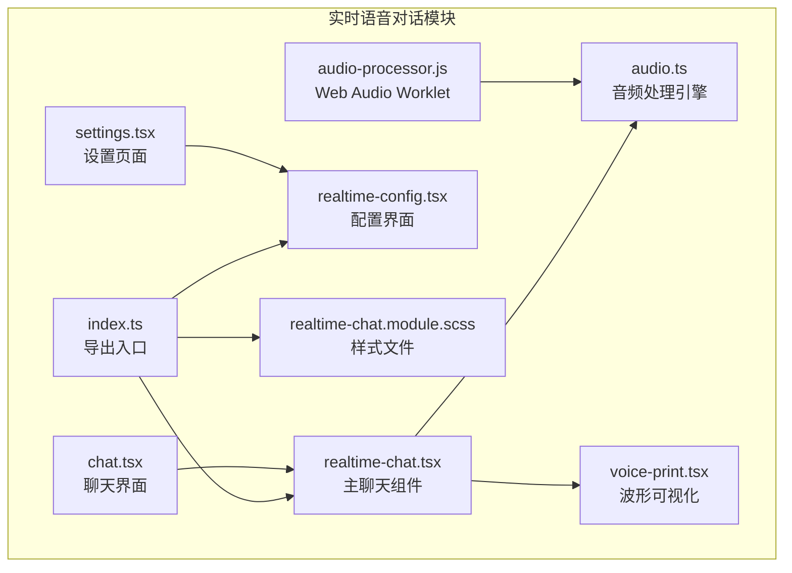
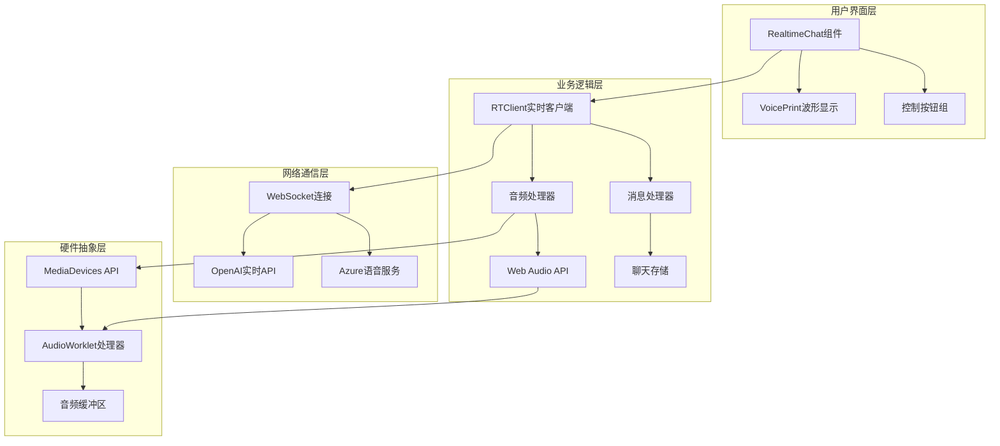
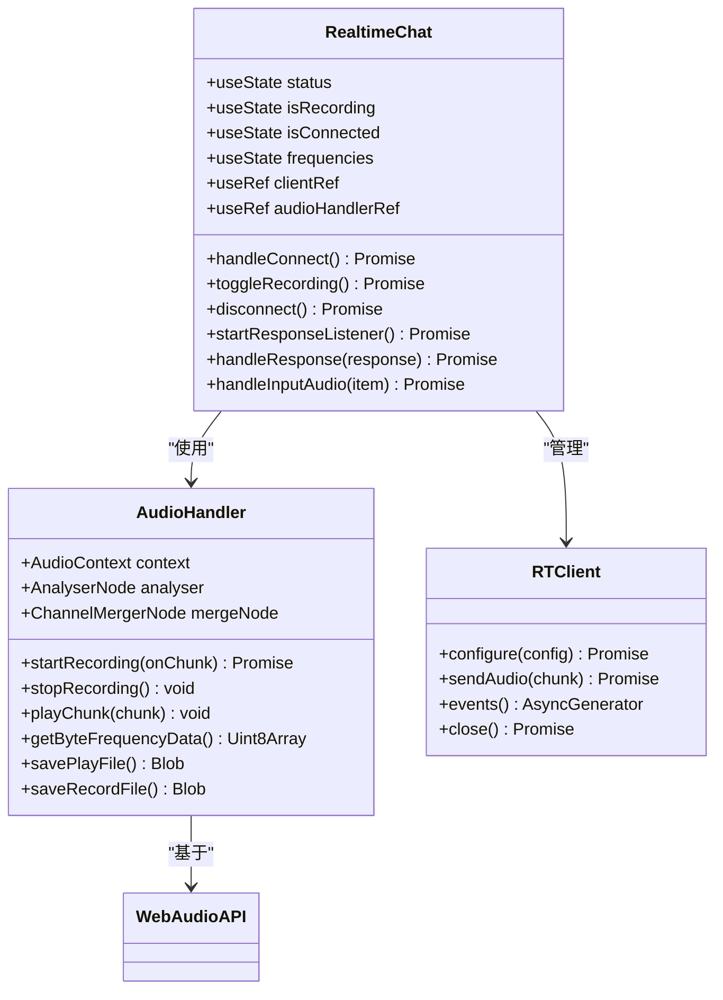
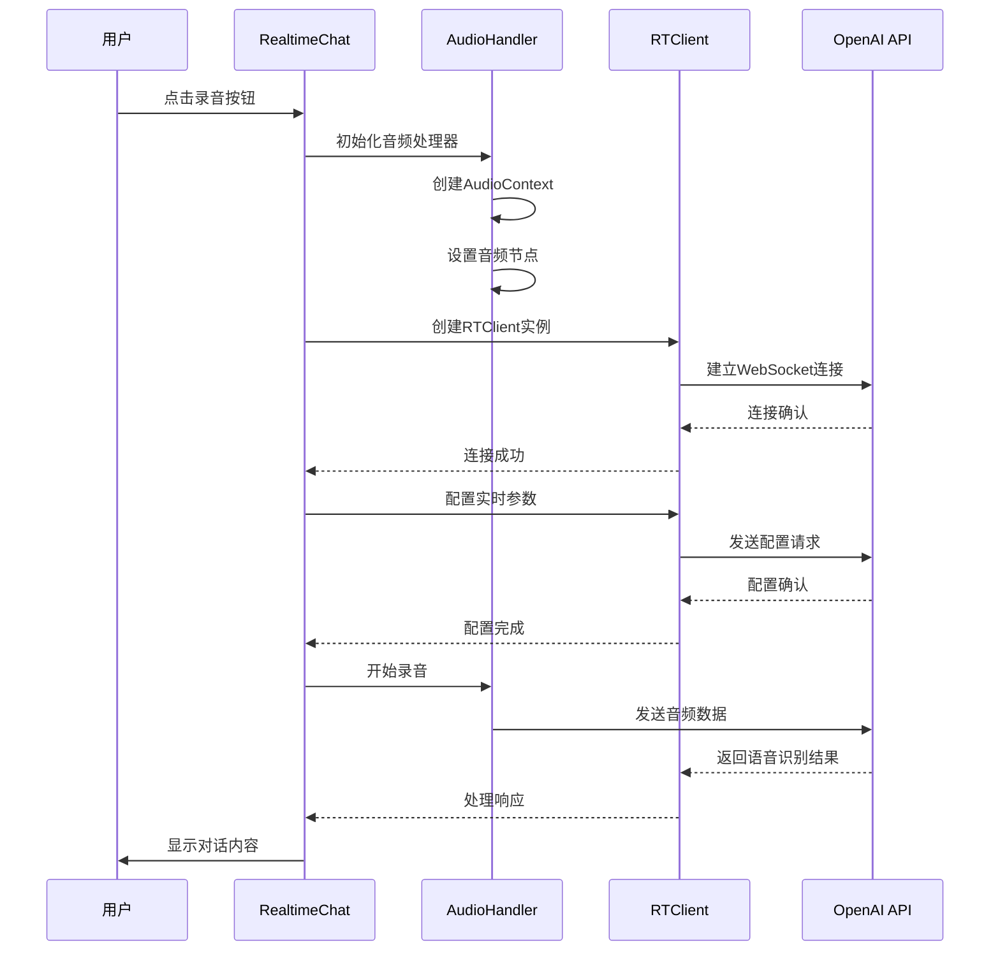
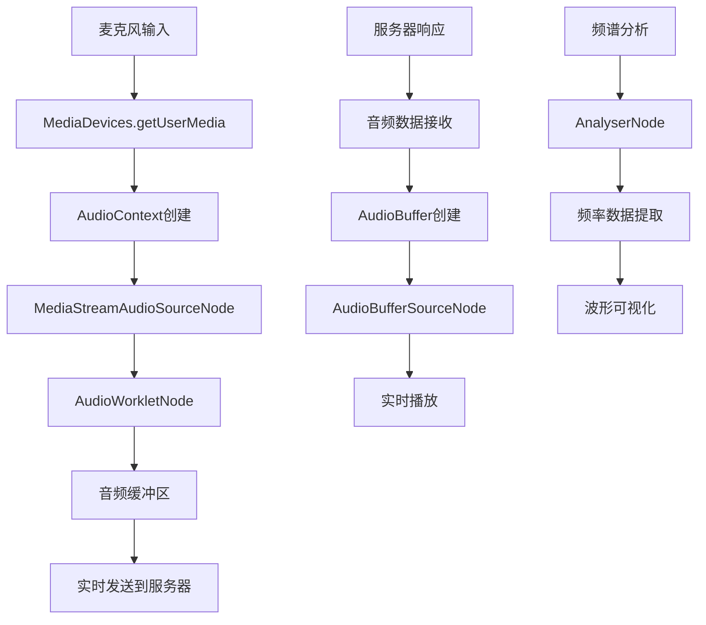
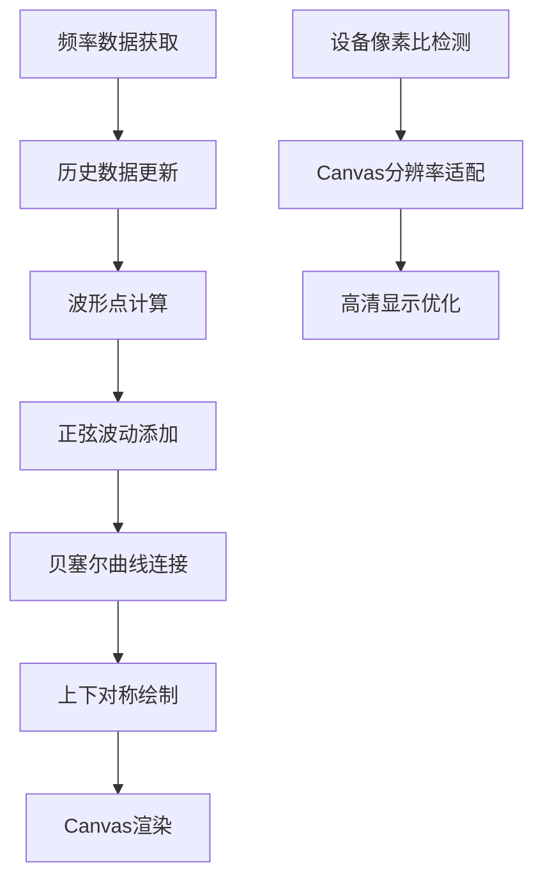
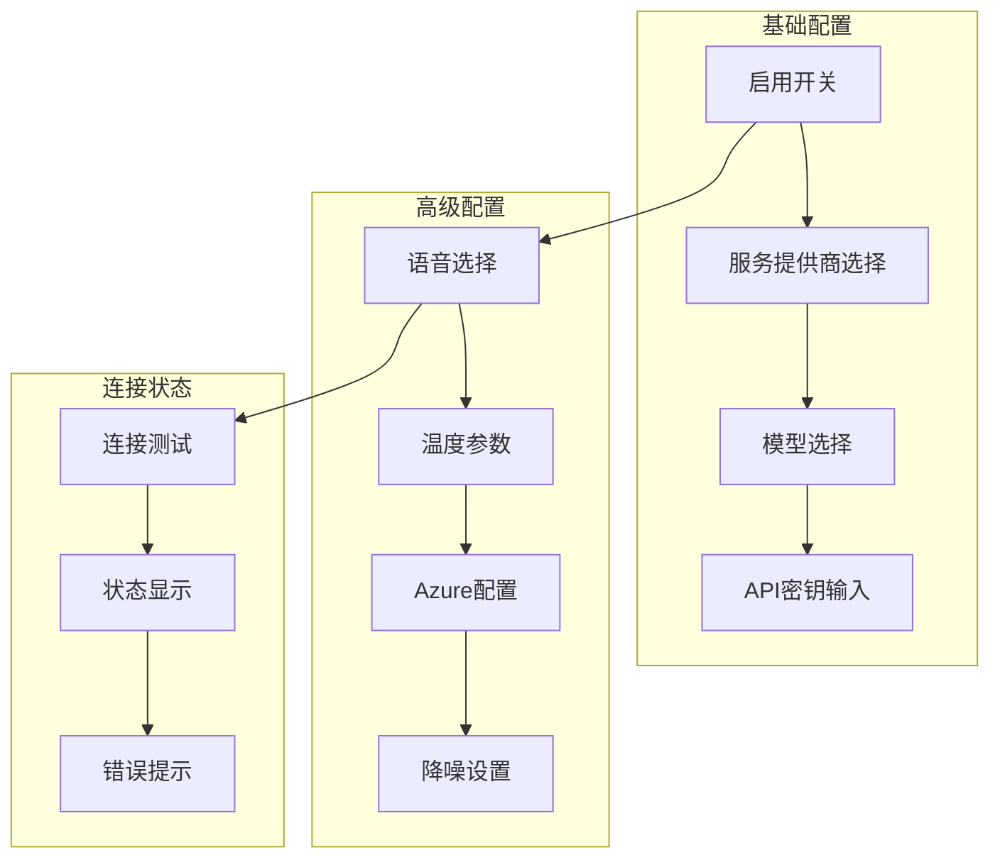
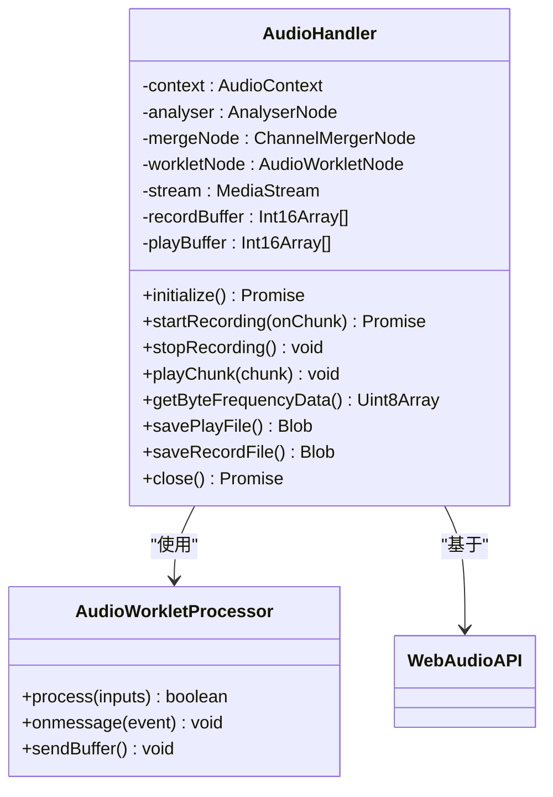
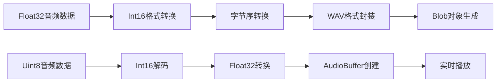
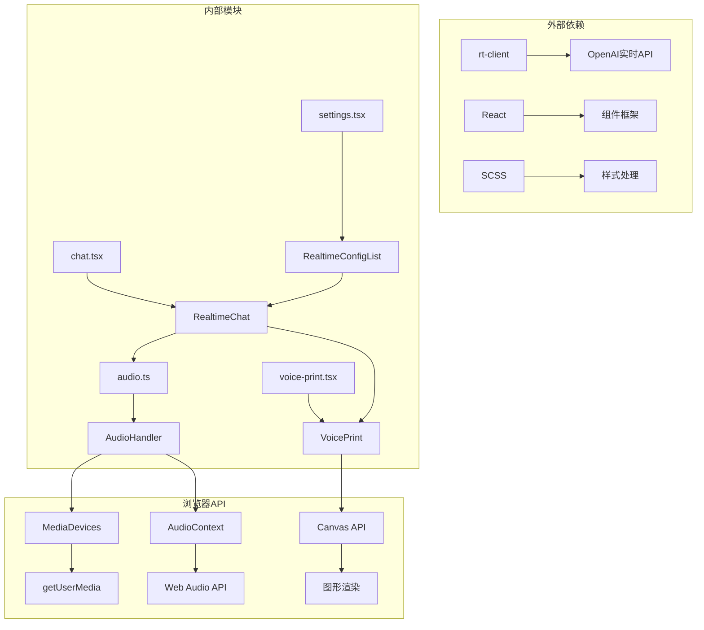

# 实时语音对话

<cite>
**本文档中引用的文件**
- [index.ts](file://app/components/realtime-chat/index.ts)
- [realtime-chat.tsx](file://app/components/realtime-chat/realtime-chat.tsx)
- [realtime-config.tsx](file://app/components/realtime-chat/realtime-config.tsx)
- [realtime-chat.module.scss](file://app/components/realtime-chat/realtime-chat.module.scss)
- [audio.ts](file://app/lib/audio.ts)
- [config.ts](file://app/store/config.ts)
- [voice-print.tsx](file://app/components/voice-print/voice-print.tsx)
- [voice-print.module.scss](file://app/components/voice-print/voice-print.module.scss)
- [chat.tsx](file://app/components/chat.tsx)
- [settings.tsx](file://app/components/settings.tsx)
- [audio-processor.js](file://public/audio-processor.js)
</cite>

## 目录
1. [简介](#简介)
2. [项目结构](#项目结构)
3. [核心组件](#核心组件)
4. [架构概览](#架构概览)
5. [详细组件分析](#详细组件分析)
6. [依赖关系分析](#依赖关系分析)
7. [性能考虑](#性能考虑)
8. [故障排除指南](#故障排除指南)
9. [结论](#结论)

## 简介

实时语音对话模块是ChatGPT Next Web应用中的一个高级功能，它提供了基于WebRTC技术的低延迟语音通信能力。该模块通过集成OpenAI的实时语音API，实现了高质量的语音交互体验，包括实时语音识别、文本转语音、噪声抑制和回声消除等功能。

该系统采用模块化设计，包含实时语音聊天组件、配置管理界面、音频处理引擎和视觉反馈组件等多个子系统，为用户提供了一个完整的实时语音对话解决方案。

## 项目结构

实时语音对话模块位于`app/components/realtime-chat/`目录下，包含以下核心文件：



**图表来源**
- [index.ts](file://app/components/realtime-chat/index.ts#L1-L2)
- [realtime-chat.tsx](file://app/components/realtime-chat/realtime-chat.tsx#L1-L30)
- [realtime-config.tsx](file://app/components/realtime-chat/realtime-config.tsx#L1-L10)

**章节来源**
- [index.ts](file://app/components/realtime-chat/index.ts#L1-L2)
- [realtime-chat.tsx](file://app/components/realtime-chat/realtime-chat.tsx#L1-L50)

## 核心组件

### 导出机制

实时语音对话模块通过简洁的导出机制提供统一的接口访问：

```typescript
// 导出所有公共接口
export * from "./realtime-chat";
```

这种设计模式确保了模块的封装性和易用性，外部组件只需导入根目录即可获得完整的功能集合。

### 配置管理系统

系统提供了完整的配置管理功能，支持多种语音服务提供商和参数调节：

| 配置项 | 类型 | 默认值 | 描述 |
|--------|------|--------|------|
| enable | boolean | false | 是否启用实时语音功能 |
| provider | string | "OpenAI" | 语音服务提供商 |
| model | string | "gpt-4o-realtime-preview-2024-10-01" | 使用的语音模型 |
| apiKey | string | "" | API密钥 |
| temperature | number | 0.9 | 对话温度参数 |
| voice | string | "alloy" | 语音合成声音 |
| azure.endpoint | string | "" | Azure服务端点 |
| azure.deployment | string | "" | Azure部署名称 |

**章节来源**
- [config.ts](file://app/store/config.ts#L95-L106)
- [realtime-config.tsx](file://app/components/realtime-chat/realtime-config.tsx#L15-L174)

## 架构概览

实时语音对话系统采用分层架构设计，从底层的音频处理到顶层的用户界面，形成了完整的处理链路：



**图表来源**
- [realtime-chat.tsx](file://app/components/realtime-chat/realtime-chat.tsx#L14-L25)
- [audio.ts](file://app/lib/audio.ts#L1-L30)

## 详细组件分析

### RealtimeChat 主聊天组件

RealtimeChat是整个实时语音对话系统的核心组件，负责协调各个子系统的运行。

#### 核心功能架构



**图表来源**
- [realtime-chat.tsx](file://app/components/realtime-chat/realtime-chat.tsx#L31-L360)
- [audio.ts](file://app/lib/audio.ts#L1-L201)

#### 连接建立流程

实时语音对话的连接建立是一个多阶段的过程，涉及多个组件的协调工作：



**图表来源**
- [realtime-chat.tsx](file://app/components/realtime-chat/realtime-chat.tsx#L59-L119)
- [audio.ts](file://app/lib/audio.ts#L35-L84)

#### 媒体流处理机制

音频处理是实时语音对话的核心技术之一，系统采用了多层次的音频处理策略：



**图表来源**
- [audio.ts](file://app/lib/audio.ts#L35-L84)
- [audio-processor.js](file://public/audio-processor.js#L1-L49)

**章节来源**
- [realtime-chat.tsx](file://app/components/realtime-chat/realtime-chat.tsx#L31-L360)
- [audio.ts](file://app/lib/audio.ts#L1-L201)

### VoicePrint 波形可视化组件

VoicePrint组件提供了实时的语音波形可视化功能，通过Canvas API绘制动态的声纹图案。

#### 波形绘制算法



**图表来源**
- [voice-print.tsx](file://app/components/voice-print/voice-print.tsx#L55-L165)

#### 动画效果实现

VoicePrint组件使用requestAnimationFrame实现流畅的动画效果：

| 特性 | 实现方式 | 效果 |
|------|----------|------|
| 平滑过渡 | 历史数据平均 | 减少视觉闪烁 |
| 自然波动 | 正弦函数 | 增强真实感 |
| 流畅动画 | requestAnimationFrame | 60fps流畅度 |
| 性能优化 | 设备像素比适配 | 高清显示 |

**章节来源**
- [voice-print.tsx](file://app/components/voice-print/voice-print.tsx#L1-L180)
- [voice-print.module.scss](file://app/components/voice-print/voice-print.module.scss#L1-L11)

### 配置管理界面

实时语音配置界面提供了全面的参数调节功能，支持多种语音服务提供商和个性化设置。

#### 配置界面布局



**图表来源**
- [realtime-config.tsx](file://app/components/realtime-chat/realtime-config.tsx#L15-L174)

#### 参数验证机制

配置界面包含了完善的参数验证功能：

| 配置项 | 验证规则 | 错误处理 |
|--------|----------|----------|
| API密钥 | 非空检查 | 实时提示 |
| 服务端点 | URL格式验证 | 格式化建议 |
| 温度参数 | 范围限制(0.6-1.0) | 滑块限制 |
| 语音选择 | 枚举值验证 | 下拉菜单 |

**章节来源**
- [realtime-config.tsx](file://app/components/realtime-chat/realtime-config.tsx#L15-L174)

### 音频处理引擎

AudioHandler类是整个音频处理系统的核心，提供了完整的音频录制、播放和分析功能。

#### 音频处理架构



**图表来源**
- [audio.ts](file://app/lib/audio.ts#L1-L201)
- [audio-processor.js](file://public/audio-processor.js#L1-L49)

#### 音频格式转换

系统需要在不同音频格式之间进行高效转换：



**图表来源**
- [audio.ts](file://app/lib/audio.ts#L58-L72)
- [audio.ts](file://app/lib/audio.ts#L110-L149)

**章节来源**
- [audio.ts](file://app/lib/audio.ts#L1-L201)
- [audio-processor.js](file://public/audio-processor.js#L1-L49)

## 依赖关系分析

实时语音对话模块的依赖关系体现了清晰的分层架构设计：



**图表来源**
- [realtime-chat.tsx](file://app/components/realtime-chat/realtime-chat.tsx#L14-L25)
- [chat.tsx](file://app/components/chat.tsx#L124-L2144)

### 核心依赖说明

| 依赖类型 | 具体组件 | 作用 | 版本要求 |
|----------|----------|------|----------|
| 第三方库 | rt-client | 实时语音客户端 | 最新版本 |
| 框架 | React | 组件渲染 | 18.x+ |
| 浏览器API | AudioContext | 音频处理 | 支持Web Audio |
| 浏览器API | MediaDevices | 音频输入 | 支持getUserMedia |
| 工具库 | clsx | CSS类名处理 | 最新版本 |

**章节来源**
- [realtime-chat.tsx](file://app/components/realtime-chat/realtime-chat.tsx#L1-L30)
- [config.ts](file://app/store/config.ts#L1-L262)

## 性能考虑

实时语音对话系统在设计时充分考虑了性能优化，采用了多种技术手段确保流畅的用户体验。

### 音频处理优化

1. **采样率优化**：使用24kHz采样率平衡音质和性能
2. **缓冲区管理**：采用100ms缓冲区减少CPU占用
3. **异步处理**：音频处理与UI渲染分离
4. **内存管理**：及时释放不再使用的音频缓冲区

### 网络传输优化

1. **压缩算法**：使用高效的音频编码格式
2. **批量传输**：合并小的数据包减少网络开销
3. **错误恢复**：实现自动重连和数据重传机制
4. **带宽自适应**：根据网络状况调整传输质量

### 用户界面优化

1. **动画性能**：使用requestAnimationFrame确保60fps
2. **DOM操作最小化**：减少不必要的DOM更新
3. **事件防抖**：防止频繁的状态更新
4. **资源预加载**：提前加载必要的音频资源

## 故障排除指南

### 常见问题及解决方案

#### 连接问题

| 问题症状 | 可能原因 | 解决方案 |
|----------|----------|----------|
| 无法建立连接 | 网络问题 | 检查网络连接，尝试代理 |
| API密钥无效 | 密钥错误 | 验证API密钥格式和权限 |
| 服务端点错误 | 地址错误 | 检查Azure配置的端点地址 |
| 连接超时 | 服务器负载 | 等待后重试或联系服务提供商 |

#### 音频问题

| 问题症状 | 可能原因 | 解决方案 |
|----------|----------|----------|
| 无音频输入 | 权限被拒绝 | 检查浏览器麦克风权限 |
| 音质差 | 设备问题 | 更换音频设备或检查驱动 |
| 延迟高 | 网络问题 | 检查网络质量和带宽 |
| 回声噪音 | 环境干扰 | 使用降噪耳机或调整环境 |

#### 视觉问题

| 问题症状 | 可能原因 | 解决方案 |
|----------|----------|----------|
| 波形不显示 | Canvas兼容性 | 更新浏览器版本 |
| 动画卡顿 | 性能不足 | 关闭其他标签页释放资源 |
| 样式异常 | SCSS编译问题 | 清除缓存重新构建 |
| 响应式布局 | 屏幕尺寸问题 | 调整浏览器窗口大小 |

**章节来源**
- [realtime-chat.tsx](file://app/components/realtime-chat/realtime-chat.tsx#L110-L115)
- [audio.ts](file://app/lib/audio.ts#L80-L83)

### 调试工具

系统提供了完善的调试功能：

1. **控制台日志**：详细的错误信息和状态跟踪
2. **网络监控**：WebSocket连接状态和数据传输统计
3. **音频分析**：实时音频频谱和质量指标
4. **性能监控**：CPU和内存使用情况

## 结论

实时语音对话模块代表了现代Web应用中语音交互技术的先进实践。通过精心设计的架构和优化的实现，该系统成功地将复杂的WebRTC技术和实时语音API整合为一个易于使用的产品功能。

### 技术亮点

1. **模块化设计**：清晰的职责分离和可扩展的架构
2. **性能优化**：多层次的性能优化策略确保流畅体验
3. **用户体验**：直观的界面设计和实时的视觉反馈
4. **跨平台兼容**：良好的浏览器兼容性和设备适配

### 应用价值

该模块不仅提升了ChatGPT Next Web的语音交互能力，更为开发者提供了一个完整的实时语音对话解决方案参考。其设计理念和技术实现可以广泛应用于各种需要实时语音交互的Web应用场景。

### 发展方向

随着Web Audio API和实时通信技术的不断发展，该模块还有很大的优化空间，包括更好的降噪算法、更低的延迟处理、更丰富的语音合成选项等，这些都将为用户提供更加优质的语音交互体验。