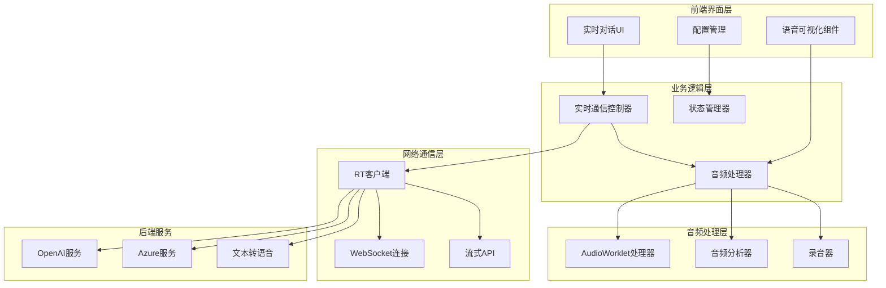
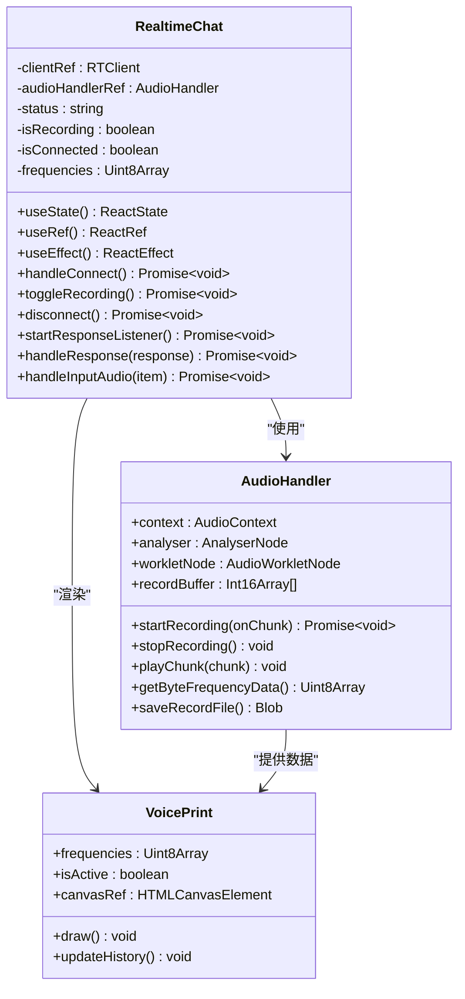
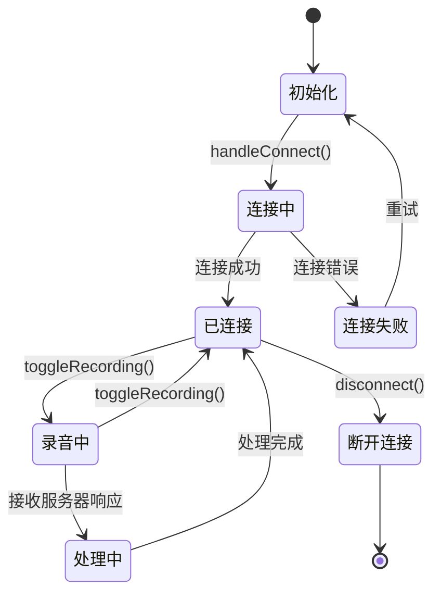
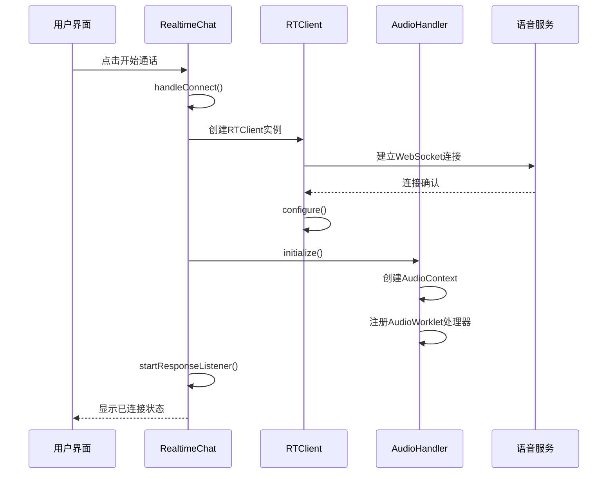
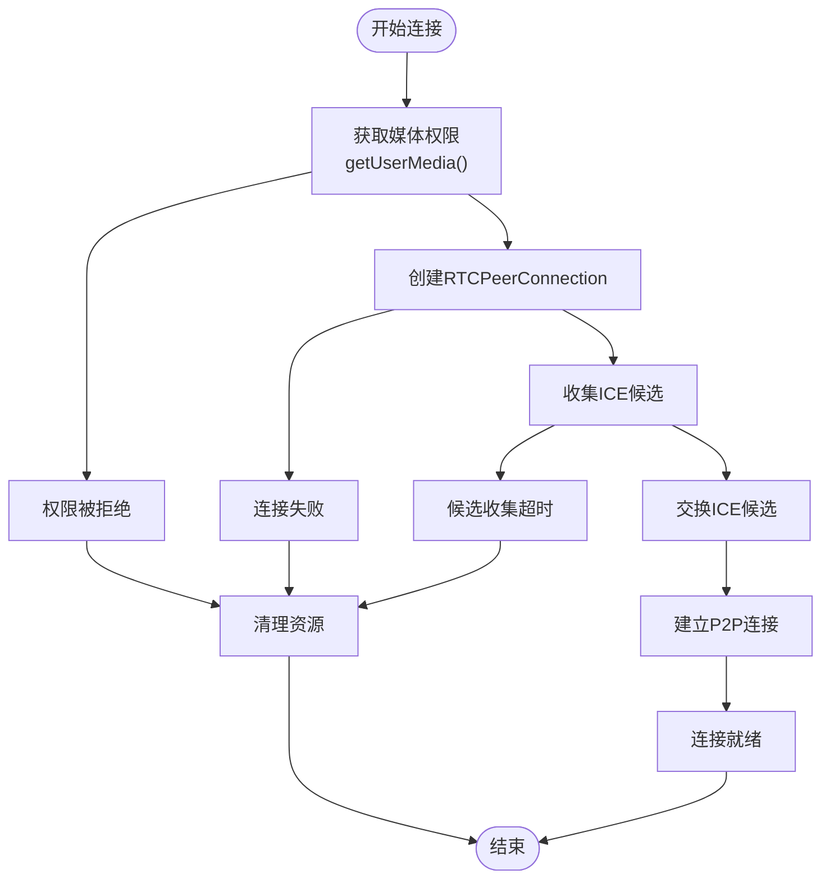
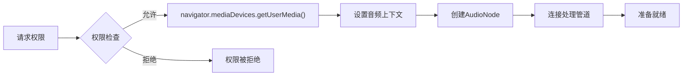
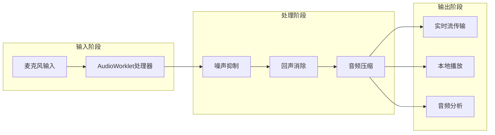
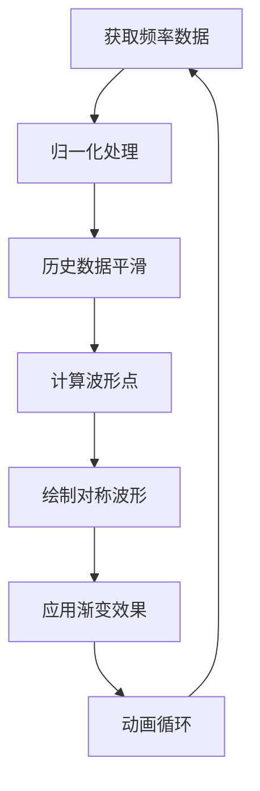
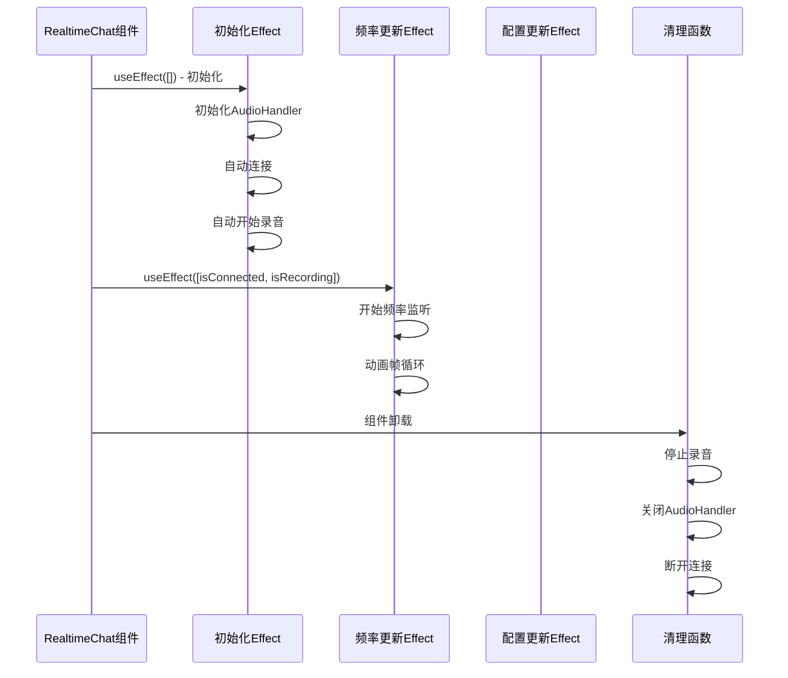
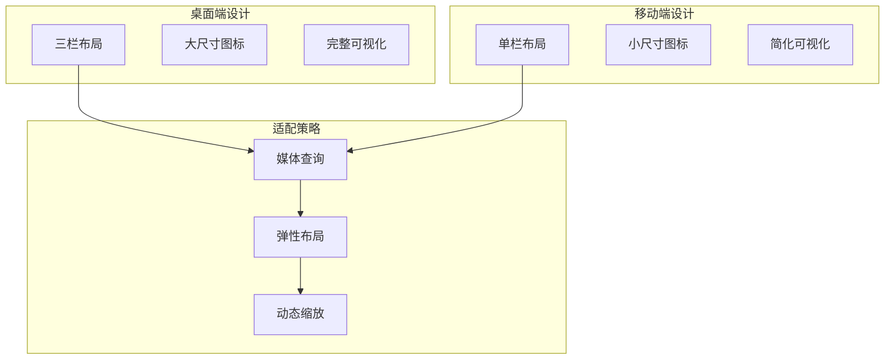

# 实时语音对话核心交互

<cite>
**本文档中引用的文件**
- [realtime-chat.tsx](file://app/components/realtime-chat/realtime-chat.tsx)
- [realtime-chat.module.scss](file://app/components/realtime-chat/realtime-chat.module.scss)
- [realtime-config.tsx](file://app/components/realtime-chat/realtime-config.tsx)
- [audio.ts](file://app/lib/audio.ts)
- [voice-print.tsx](file://app/components/voice-print/voice-print.tsx)
- [voice-print.module.scss](file://app/components/voice-print/voice-print.module.scss)
- [audio-processor.js](file://public/audio-processor.js)
- [audio.ts](file://app/utils/audio.ts)
- [stream.ts](file://app/utils/stream.ts)
- [chat.ts](file://app/store/chat.ts)
</cite>

## 目录
1. [项目概述](#项目概述)
2. [系统架构](#系统架构)
3. [核心组件分析](#核心组件分析)
4. [实时语音通信机制](#实时语音通信机制)
5. [音频处理与可视化](#音频处理与可视化)
6. [状态管理系统](#状态管理系统)
7. [UI交互设计](#ui交互设计)
8. [性能优化策略](#性能优化策略)
9. [故障排除指南](#故障排除指南)
10. [总结](#总结)

## 项目概述

实时语音对话核心交互组件是ChatGPT Next Web项目中的一个创新功能模块，它实现了基于WebRTC技术的低延迟双向语音通信。该组件通过集成OpenAI和Azure的实时语音服务，为用户提供流畅的语音对话体验，支持语音转文字、文字转语音以及实时音频流处理。

### 主要特性

- **低延迟语音通信**：采用WebRTC技术实现毫秒级响应
- **实时音频可视化**：动态语音波形显示与麦克风激活指示
- **多平台兼容**：支持桌面和移动端设备
- **智能音频处理**：内置噪声抑制和回声消除
- **灵活配置选项**：支持多种语音模型和服务提供商

## 系统架构



**图表来源**
- [realtime-chat.tsx](file://app/components/realtime-chat/realtime-chat.tsx#L1-L50)
- [audio.ts](file://app/lib/audio.ts#L1-L50)

## 核心组件分析

### RealtimeChat 主组件

RealtimeChat 是整个实时语音对话系统的核心控制器，负责协调各个子组件的工作流程。



**图表来源**
- [realtime-chat.tsx](file://app/components/realtime-chat/realtime-chat.tsx#L31-L360)
- [audio.ts](file://app/lib/audio.ts#L1-L201)
- [voice-print.tsx](file://app/components/voice-print/voice-print.tsx#L1-L181)

**章节来源**
- [realtime-chat.tsx](file://app/components/realtime-chat/realtime-chat.tsx#L31-L360)
- [audio.ts](file://app/lib/audio.ts#L1-L201)

### 状态机设计

组件内部实现了复杂的状态机来管理语音会话的生命周期：



**章节来源**
- [realtime-chat.tsx](file://app/components/realtime-chat/realtime-chat.tsx#L59-L119)
- [realtime-chat.tsx](file://app/components/realtime-chat/realtime-chat.tsx#L121-L131)

## 实时语音通信机制

### 连接初始化流程

实时语音通信的建立遵循严格的初始化序列：



**图表来源**
- [realtime-chat.tsx](file://app/components/realtime-chat/realtime-chat.tsx#L59-L119)
- [audio.ts](file://app/lib/audio.ts#L31-L33)

### 信令流程

信令系统负责协调客户端与服务器之间的通信协议：

| 信令类型 | 描述 | 数据格式 | 触发条件 |
|---------|------|----------|----------|
| 连接请求 | 建立WebSocket连接 | JSON对象 | 用户点击开始通话 |
| 配置消息 | 设置语音参数 | 配置对象 | 连接建立后 |
| 音频数据 | 实时语音流 | Uint8Array | 录音过程中 |
| 响应消息 | 服务器回复 | RTResponse对象 | 对话处理完成 |
| 错误通知 | 异常情况报告 | 错误对象 | 通信异常 |

**章节来源**
- [realtime-chat.tsx](file://app/components/realtime-chat/realtime-chat.tsx#L133-L149)
- [realtime-chat.tsx](file://app/components/realtime-chat/realtime-chat.tsx#L151-L201)

### ICE候选交换

虽然主要使用WebSocket进行通信，但底层仍然依赖WebRTC的ICE机制：



**图表来源**
- [audio.ts](file://app/lib/audio.ts#L41-L48)

## 音频处理与可视化

### 媒体流获取

音频处理的第一步是通过getUserMedia API获取用户的麦克风输入：



**图表来源**
- [audio.ts](file://app/lib/audio.ts#L41-L48)

### 音频数据处理管道

音频处理器实现了多层次的数据处理流水线：



**图表来源**
- [audio.ts](file://app/lib/audio.ts#L35-L84)
- [audio-processor.js](file://public/audio-processor.js#L1-L49)

### 语音波形可视化

VoicePrint 组件实现了动态的语音波形可视化效果：



**图表来源**
- [voice-print.tsx](file://app/components/voice-print/voice-print.tsx#L55-L166)

**章节来源**
- [audio.ts](file://app/lib/audio.ts#L1-L201)
- [voice-print.tsx](file://app/components/voice-print/voice-print.tsx#L1-L181)

## 状态管理系统

### 连接状态管理

组件维护了多个关键状态变量来跟踪实时对话的进程：

| 状态变量 | 类型 | 描述 | 初始值 |
|---------|------|------|--------|
| `status` | string | 当前连接状态描述 | "" |
| `isRecording` | boolean | 是否正在录音 | false |
| `isConnected` | boolean | WebSocket是否连接 | false |
| `isConnecting` | boolean | 是否正在连接中 | false |
| `modality` | "audio" \| "text" | 通信模式 | "audio" |
| `useVAD` | boolean | 是否使用语音活动检测 | true |
| `frequencies` | Uint8Array \| undefined | 频率分析数据 | undefined |

### 生命周期钩子

组件使用React的副作用钩子来管理资源的生命周期：



**图表来源**
- [realtime-chat.tsx](file://app/components/realtime-chat/realtime-chat.tsx#L260-L285)
- [realtime-chat.tsx](file://app/components/realtime-chat/realtime-chat.tsx#L286-L309)
- [realtime-chat.tsx](file://app/components/realtime-chat/realtime-chat.tsx#L312-L318)

**章节来源**
- [realtime-chat.tsx](file://app/components/realtime-chat/realtime-chat.tsx#L39-L46)
- [realtime-chat.tsx](file://app/components/realtime-chat/realtime-chat.tsx#L260-L318)

## UI交互设计

### SCSS模块样式设计

实时对话UI采用了现代化的设计语言，注重用户体验和视觉反馈：

```scss
// 圆形麦克风区域
.circle-mic {
  width: 150px;
  height: 150px;
  border-radius: 50%;
  background: linear-gradient(to bottom right, #a0d8ef, #f0f8ff);
  display: flex;
  justify-content: center;
  align-items: center;
}

// 脉冲动画效果
.pulse {
  animation: pulse 1.5s infinite;
}

// 底部图标布局
.bottom-icons {
  display: flex;
  justify-content: space-between;
  align-items: center;
  width: 100%;
  position: absolute;
  bottom: 20px;
  box-sizing: border-box;
  padding: 0 20px;
}
```

### 响应式适配策略

组件实现了多层次的响应式设计：



**图表来源**
- [realtime-chat.module.scss](file://app/components/realtime-chat/realtime-chat.module.scss#L1-L75)

### 用户交互事件处理

组件响应多种用户交互事件：

| 交互类型 | 处理函数 | 触发条件 | 功能描述 |
|---------|----------|----------|----------|
| 点击录音按钮 | `toggleRecording()` | 用户点击麦克风图标 | 开始/停止录音 |
| 点击关闭按钮 | `handleClose()` | 用户点击电源图标 | 结束通话并关闭 |
| 状态变化 | `onStartVoice/onPausedVoice` | 通话状态改变 | 上层回调通知 |

**章节来源**
- [realtime-chat.module.scss](file://app/components/realtime-chat/realtime-chat.module.scss#L1-L75)
- [realtime-chat.tsx](file://app/components/realtime-chat/realtime-chat.tsx#L327-L358)

## 性能优化策略

### 音频处理优化

1. **采样率优化**：使用24kHz采样率平衡质量与性能
2. **缓冲区管理**：采用100ms缓冲区减少CPU负载
3. **异步处理**：所有音频操作都在Web Worker中执行
4. **内存管理**：及时释放不再使用的音频缓冲区

### 渲染性能优化

1. **requestAnimationFrame**：使用浏览器优化的动画循环
2. **Canvas优化**：针对高DPI屏幕的像素密度适配
3. **历史数据缓存**：限制历史数据长度避免内存泄漏
4. **增量更新**：只更新发生变化的波形部分

### 网络优化

1. **连接复用**：WebSocket连接保持长连接
2. **数据压缩**：音频数据采用Uint8Array格式
3. **错误重试**：实现指数退避重连机制
4. **资源预加载**：提前加载必要的音频工作程序

## 故障排除指南

### 常见问题及解决方案

| 问题类型 | 症状 | 可能原因 | 解决方案 |
|---------|------|----------|----------|
| 连接失败 | 显示"Connection failed" | 网络问题或API密钥错误 | 检查网络连接和API配置 |
| 录音无声音 | 麦克风图标不闪烁 | 权限被拒绝或设备不可用 | 检查浏览器权限设置 |
| 音频卡顿 | 语音传输延迟 | CPU负载过高或网络不稳定 | 关闭其他占用资源的应用 |
| 可视化异常 | 波形显示不正常 | Canvas渲染问题 | 刷新页面或检查浏览器兼容性 |

### 调试工具

1. **浏览器开发者工具**：监控网络请求和控制台错误
2. **AudioContext调试**：检查音频上下文状态
3. **Canvas性能分析**：使用Performance面板分析渲染性能
4. **WebSocket监控**：观察实时通信状态

**章节来源**
- [realtime-chat.tsx](file://app/components/realtime-chat/realtime-chat.tsx#L110-L115)
- [audio.ts](file://app/lib/audio.ts#L80-L83)

## 总结

实时语音对话核心交互组件是一个高度集成的系统，它成功地将WebRTC技术、现代前端框架和人工智能服务相结合，为用户提供了流畅、可靠的语音对话体验。该组件的主要优势包括：

### 技术亮点

1. **低延迟通信**：通过WebRTC和优化的音频处理管道实现毫秒级响应
2. **高质量音频**：内置噪声抑制、回声消除和音频压缩技术
3. **直观的可视化**：动态语音波形为用户提供实时反馈
4. **灵活的配置**：支持多种语音模型和服务提供商
5. **良好的用户体验**：响应式设计和直观的交互界面

### 架构优势

1. **模块化设计**：清晰的组件分离便于维护和扩展
2. **状态管理**：完善的状态机确保系统稳定性
3. **错误处理**：全面的错误捕获和恢复机制
4. **性能优化**：多层次的性能优化策略保证流畅运行

### 应用价值

该组件不仅为ChatGPT Next Web项目提供了强大的语音对话能力，也为类似的实时通信应用提供了可参考的技术实现方案。其设计理念和实现方法对于构建高质量的Web音频应用具有重要的指导意义。

通过深入理解这个组件的实现机制，开发者可以更好地掌握现代Web音频技术的最佳实践，并在此基础上开发出更加创新和实用的语音交互应用。