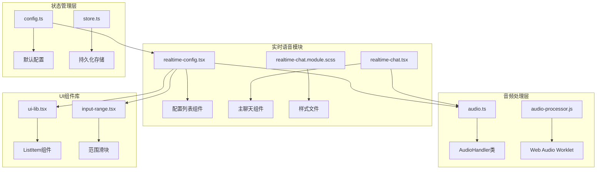
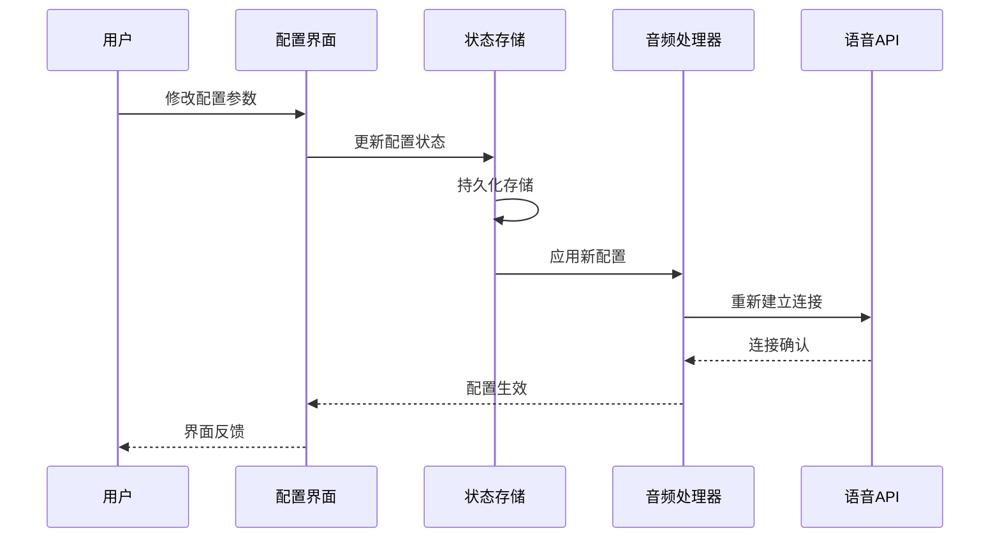
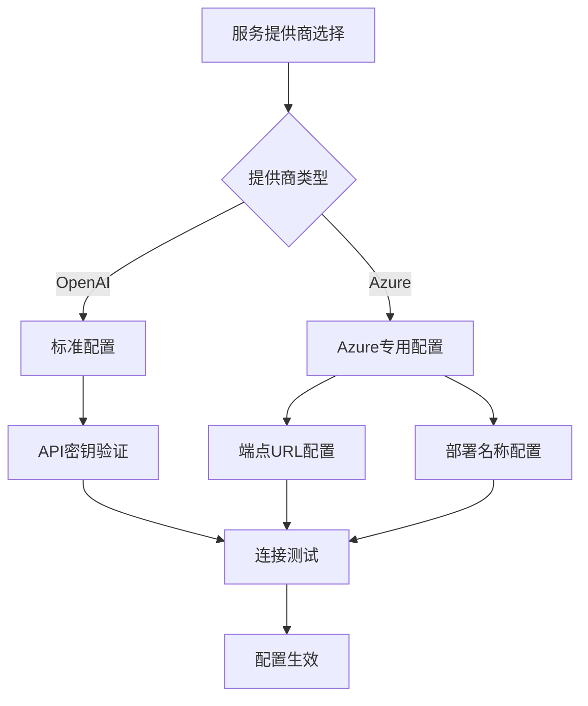
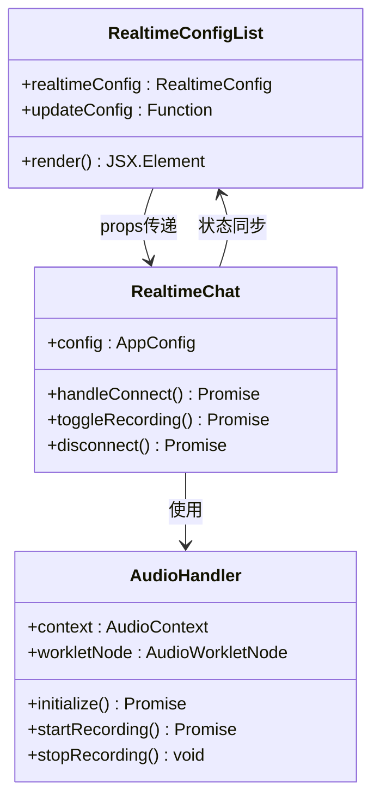
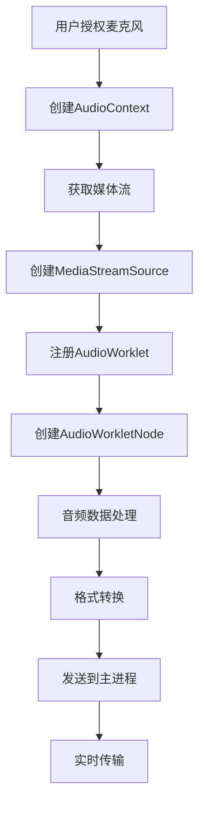
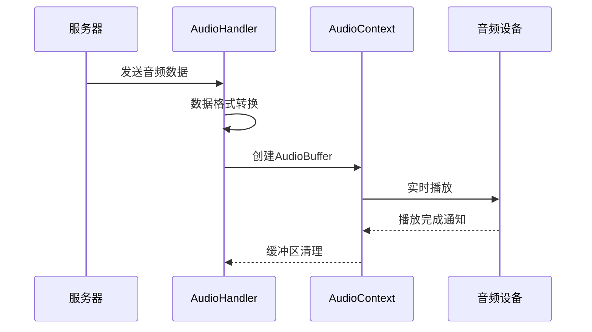

# 实时语音对话配置界面

<cite>
**本文档中引用的文件**
- [realtime-config.tsx](file://app/components/realtime-chat/realtime-config.tsx)
- [realtime-chat.tsx](file://app/components/realtime-chat/realtime-chat.tsx)
- [realtime-chat.module.scss](file://app/components/realtime-chat/realtime-chat.module.scss)
- [config.ts](file://app/store/config.ts)
- [audio.ts](file://app/lib/audio.ts)
- [ui-lib.tsx](file://app/components/ui-lib.tsx)
- [input-range.tsx](file://app/components/input-range.tsx)
- [constant.ts](file://app/constant.ts)
- [store.ts](file://app/utils/store.ts)
</cite>

## 目录
1. [简介](#简介)
2. [项目结构](#项目结构)
3. [核心组件](#核心组件)
4. [架构概览](#架构概览)
5. [详细组件分析](#详细组件分析)
6. [状态管理与持久化](#状态管理与持久化)
7. [音频处理机制](#音频处理机制)
8. [用户界面设计](#用户界面设计)
9. [使用场景示例](#使用场景示例)
10. [性能考虑](#性能考虑)
11. [故障排除指南](#故障排除指南)
12. [结论](#结论)

## 简介

实时语音对话配置界面是ChatGPT Next Web项目中的一个关键组件，专门用于管理和配置实时语音通信的各项参数。该组件为用户提供了全面的音频设备控制、语音质量调节和连接设置功能，确保最佳的语音通话体验。

该配置界面主要包含以下核心功能：
- 音频设备的选择和管理（麦克风与扬声器）
- 音量控制和静音功能
- 降噪和回声消除选项
- 语音合成参数调节
- 连接配置和认证设置

## 项目结构

实时语音对话配置相关的文件组织结构如下：

**图表来源**
- [realtime-config.tsx](file://app/components/realtime-chat/realtime-config.tsx#L1-L174)
- [realtime-chat.tsx](file://app/components/realtime-chat/realtime-chat.tsx#L1-L360)
- [audio.ts](file://app/lib/audio.ts#L1-L201)

## 核心组件

### RealtimeConfigList 组件

RealtimeConfigList是配置界面的核心组件，负责渲染所有可配置的音频参数选项。该组件接收两个主要属性：

- `realtimeConfig`: 当前的实时配置对象
- `updateConfig`: 用于更新配置的回调函数

该组件支持多种配置类型，包括：
- 启用/禁用实时语音功能
- 服务提供商选择（OpenAI、Azure）
- API密钥配置
- 语音模型选择
- 温度参数调节
- 语音合成配置

**节来源**
- [realtime-config.tsx](file://app/components/realtime-chat/realtime-config.tsx#L16-L174)

### AudioHandler 类

AudioHandler类是音频处理的核心，负责：
- 麦克风音频捕获
- 音频数据格式转换
- 实时音频播放
- 音频缓冲管理

该类使用Web Audio API和AudioWorkletProcessor来实现高质量的音频处理。

**节来源**
- [audio.ts](file://app/lib/audio.ts#L1-L201)

## 架构概览

实时语音对话配置界面采用分层架构设计，确保各组件间的松耦合和高内聚：

**图表来源**
- [realtime-config.tsx](file://app/components/realtime-chat/realtime-config.tsx#L16-L174)
- [audio.ts](file://app/lib/audio.ts#L1-L201)
- [config.ts](file://app/store/config.ts#L164-L262)

## 详细组件分析

### 配置参数管理

配置界面支持多个关键参数的动态调整：

#### 服务提供商配置

**图表来源**
- [realtime-config.tsx](file://app/components/realtime-chat/realtime-config.tsx#L20-L54)

#### 音频设备控制
音频设备控制通过AudioHandler类实现，支持以下功能：
- 自动检测可用音频设备
- 动态切换输入/输出设备
- 实时音频质量监控
- 设备状态反馈

#### 语音质量参数
语音质量参数包括：
- **温度参数**: 控制语音的创造性程度（0.6-1.0）
- **语音模型**: 支持多种预设语音模型
- **采样率**: 固定24kHz采样率
- **通道数**: 单声道处理

**节来源**
- [realtime-config.tsx](file://app/components/realtime-chat/realtime-config.tsx#L151-L174)

### 状态同步机制

配置界面与父组件之间通过props传递回调函数实现状态同步：

**图表来源**
- [realtime-config.tsx](file://app/components/realtime-chat/realtime-config.tsx#L16-L19)
- [realtime-chat.tsx](file://app/components/realtime-chat/realtime-chat.tsx#L31-L35)
- [audio.ts](file://app/lib/audio.ts#L1-L201)

**节来源**
- [realtime-chat.tsx](file://app/components/realtime-chat/realtime-chat.tsx#L31-L360)

## 状态管理与持久化

### 配置持久化策略

系统采用多层持久化策略确保配置的安全保存：

#### IndexedDB 存储
主要使用IndexedDB进行配置数据的持久化存储，提供以下优势：
- 大容量数据存储
- 异步操作支持
- 浏览器兼容性好
- 数据安全性高

#### localStorage 备份
当IndexedDB不可用时，自动降级到localStorage作为备份存储。

#### 配置合并机制
系统实现了智能的配置合并逻辑，确保本地配置与远程同步时的数据完整性。

**节来源**
- [store.ts](file://app/utils/store.ts#L1-L51)
- [config.ts](file://app/store/config.ts#L164-L262)

### 配置结构定义

RealtimeConfig接口定义了完整的配置结构：

| 配置项 | 类型 | 默认值 | 描述 |
|--------|------|--------|------|
| enable | boolean | false | 是否启用实时语音功能 |
| provider | ServiceProvider | "OpenAI" | 服务提供商类型 |
| model | string | "gpt-4o-realtime-preview-2024-10-01" | 使用的语音模型 |
| apiKey | string | "" | API访问密钥 |
| temperature | number | 0.9 | 语音温度参数 |
| voice | Voice | "alloy" | 预设语音模型 |
| azure.endpoint | string | "" | Azure端点URL |
| azure.deployment | string | "" | Azure部署名称 |

**节来源**
- [config.ts](file://app/store/config.ts#L95-L106)

## 音频处理机制

### 音频采集流程

音频采集采用现代Web Audio API技术栈：

**图表来源**
- [audio.ts](file://app/lib/audio.ts#L35-L76)

### 音频处理特性

#### 高质量音频处理
- **采样率**: 24kHz固定采样率
- **位深度**: 16-bit量化
- **通道数**: 单声道处理
- **实时性**: 低延迟音频传输

#### 音频增强功能
- **回声消除**: 自动回声抑制
- **噪声抑制**: 实时噪声过滤
- **自动增益控制**: 音量自动调节
- **频率分析**: 实时频谱显示

**节来源**
- [audio.ts](file://app/lib/audio.ts#L35-L76)

### 音频播放机制

音频播放采用流式处理方式，确保低延迟和高质量：

**图表来源**
- [audio.ts](file://app/lib/audio.ts#L109-L149)

**节来源**
- [audio.ts](file://app/lib/audio.ts#L109-L149)

## 用户界面设计

### SCSS样式架构

配置界面采用模块化的SCSS架构，确保样式的一致性和可维护性：

#### 主题一致性
界面设计遵循整体应用的主题风格：
- **颜色方案**: 与应用主色调保持一致
- **字体系统**: 使用统一的字体层次结构
- **间距规范**: 遵循设计系统的间距规则
- **交互反馈**: 提供清晰的状态指示

#### 响应式设计
配置界面支持多种屏幕尺寸：
- **桌面端**: 宽屏布局，最大化信息展示
- **平板端**: 中等宽度适配
- **移动端**: 简化布局，突出核心功能

**节来源**
- [realtime-chat.module.scss](file://app/components/realtime-chat/realtime-chat.module.scss#L1-L75)

### 交互反馈设计

#### 状态指示器
- **连接状态**: 显示当前连接状态
- **录音状态**: 实时显示录音活动
- **错误提示**: 友好的错误信息展示
- **加载状态**: 操作过程中的进度指示

#### 视觉反馈
- **悬停效果**: 按钮和交互元素的悬停状态
- **激活状态**: 当前选中项目的视觉标识
- **动画效果**: 平滑的状态切换动画
- **音效反馈**: 关键操作的音频提示

**节来源**
- [realtime-chat.tsx](file://app/components/realtime-chat/realtime-chat.tsx#L328-L358)

## 使用场景示例

### 场景一：初次配置语音通话

用户首次使用实时语音功能时的典型配置流程：

1. **启用功能**: 在配置界面勾选"启用实时语音"选项
2. **选择服务**: 从下拉菜单中选择OpenAI或Azure服务提供商
3. **配置API**: 输入有效的API密钥
4. **测试连接**: 系统自动尝试建立连接
5. **调整参数**: 根据需要调整温度参数和语音模型
6. **开始通话**: 配置完成后即可开始语音对话

### 场景二：优化音频质量

用户遇到音频质量问题时的调整流程：

1. **检查设备**: 确认麦克风和扬声器设备正常工作
2. **调整音量**: 使用音量滑块优化输入和输出音量
3. **启用降噪**: 开启噪声抑制和回声消除功能
4. **测试效果**: 通过实时频谱图观察音频质量
5. **保存配置**: 系统自动保存优化后的配置

### 场景三：企业环境配置

在企业环境中部署时的配置要点：

1. **Azure集成**: 配置Azure特定的端点和部署信息
2. **安全设置**: 正确配置API密钥和访问权限
3. **网络优化**: 调整超时和重试参数
4. **合规检查**: 确保符合企业安全政策
5. **批量部署**: 利用配置模板进行批量部署

## 性能考虑

### 内存管理
- **音频缓冲**: 合理控制音频缓冲区大小
- **对象复用**: 重用AudioContext和相关对象
- **垃圾回收**: 及时释放不再使用的音频资源
- **内存泄漏防护**: 确保事件监听器正确移除

### 网络优化
- **连接池**: 复用WebSocket连接
- **数据压缩**: 对音频数据进行适当压缩
- **错误重试**: 实现智能的重试机制
- **超时控制**: 设置合理的超时时间

### 用户体验优化
- **即时反馈**: 配置变更立即生效
- **状态同步**: 确保界面状态与实际状态一致
- **错误恢复**: 提供友好的错误恢复机制
- **性能监控**: 实时监控系统性能指标

## 故障排除指南

### 常见问题及解决方案

#### 音频设备无法识别
**症状**: 配置界面中没有列出可用的音频设备
**解决方案**:
1. 检查浏览器权限设置
2. 确认操作系统中的音频设备正常工作
3. 尝试刷新页面或重启浏览器
4. 检查是否有其他应用程序占用音频设备

#### 连接失败
**症状**: 无法成功连接到语音服务
**解决方案**:
1. 验证API密钥的有效性
2. 检查网络连接状态
3. 确认服务提供商的可用性
4. 查看浏览器控制台的错误信息

#### 音质不佳
**症状**: 语音通话质量差，有杂音或回声
**解决方案**:
1. 启用噪声抑制和回声消除
2. 调整麦克风位置和距离
3. 检查音频设备的质量
4. 降低房间内的背景噪音

#### 性能问题
**症状**: 音频处理延迟高，卡顿明显
**解决方案**:
1. 减少同时运行的音频应用
2. 降低音频采样率（如果可能）
3. 检查系统资源使用情况
4. 尝试在更强大的设备上运行

**节来源**
- [audio.ts](file://app/lib/audio.ts#L35-L76)
- [realtime-chat.tsx](file://app/components/realtime-chat/realtime-chat.tsx#L59-L115)

## 结论

实时语音对话配置界面是一个功能完善、设计精良的音频管理系统。它不仅提供了丰富的配置选项，还确保了良好的用户体验和系统稳定性。

### 主要优势
- **功能全面**: 涵盖了语音通话所需的所有配置参数
- **易于使用**: 直观的界面设计和清晰的操作指引
- **性能优异**: 采用现代Web技术实现高质量音频处理
- **稳定可靠**: 完善的错误处理和恢复机制
- **扩展性强**: 支持多种服务提供商和未来功能扩展

### 技术特色
- **现代化架构**: 基于React和Web Audio API构建
- **响应式设计**: 适应不同设备和屏幕尺寸
- **智能持久化**: 多层存储策略确保配置安全
- **实时反馈**: 即时的状态更新和用户反馈

该配置界面为用户提供了一个强大而易用的语音通信工具，是ChatGPT Next Web项目中不可或缺的重要组成部分。通过持续的优化和改进，它将继续为用户提供卓越的语音对话体验。