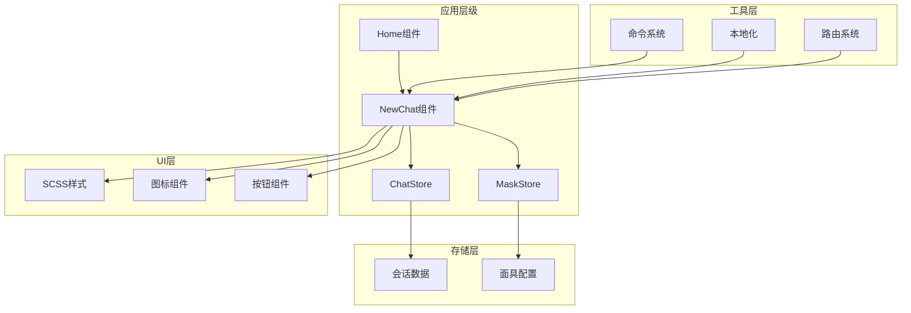
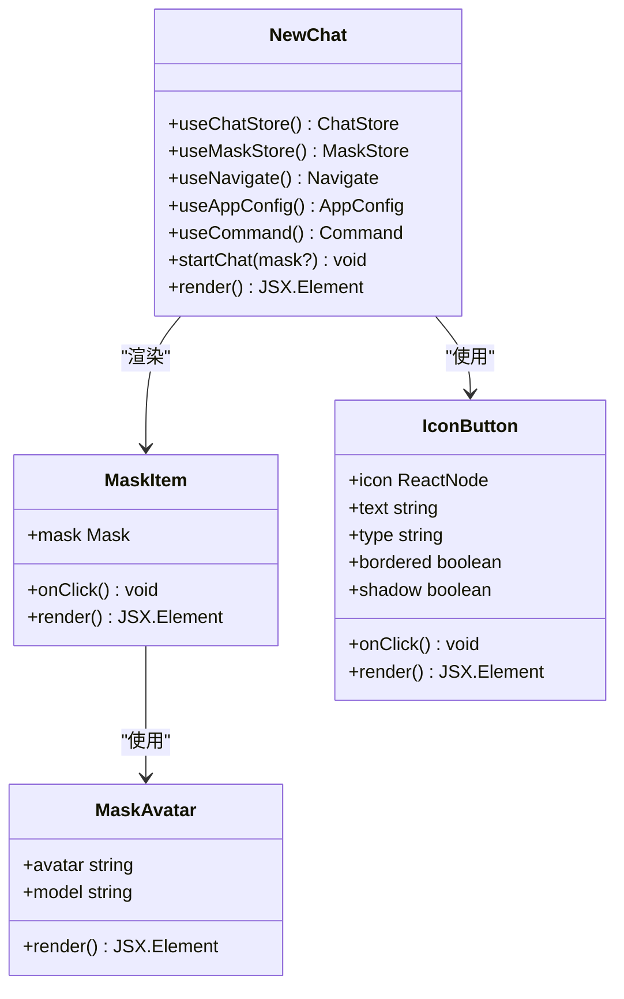
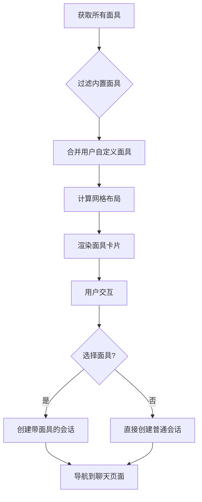
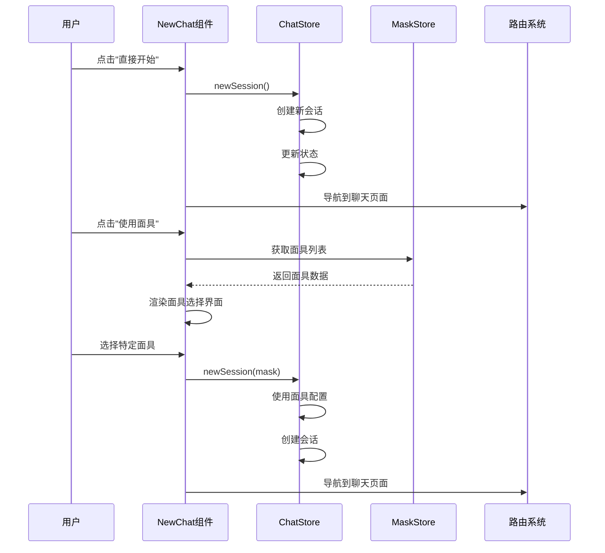
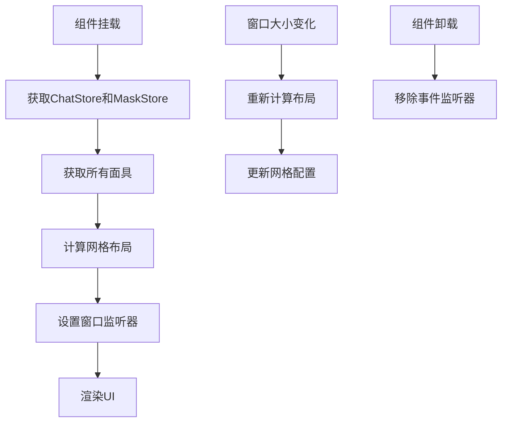
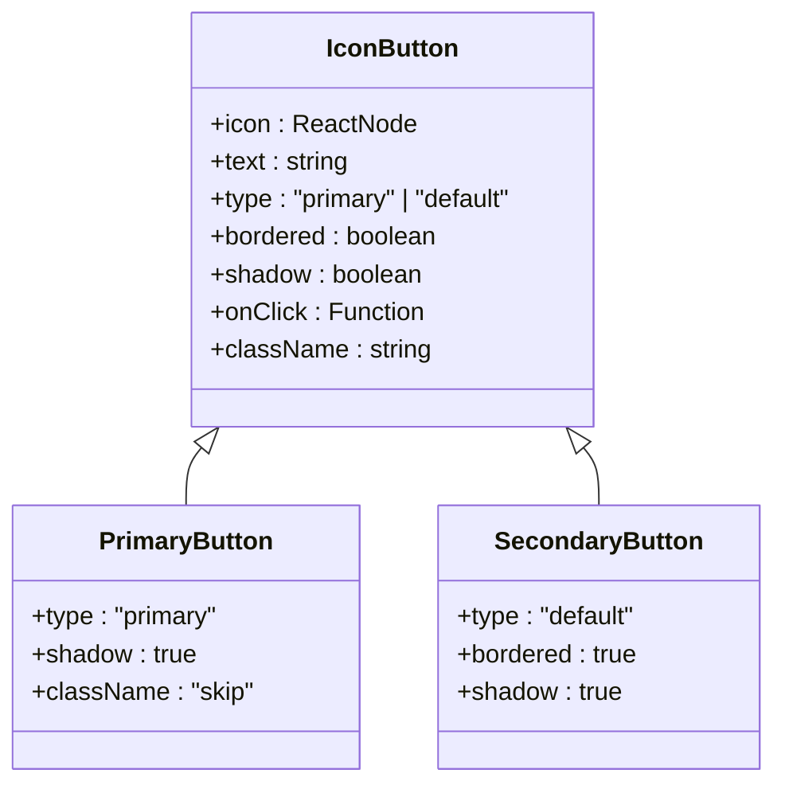
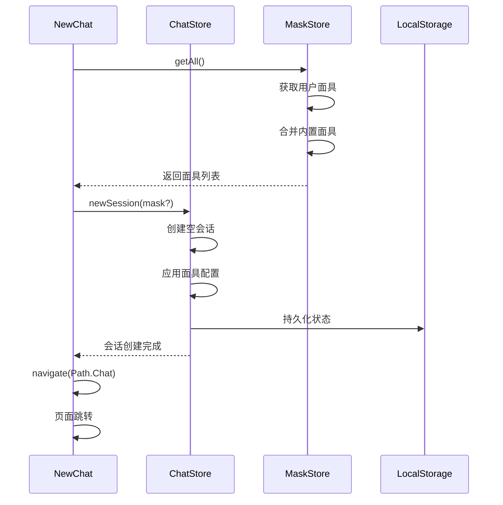
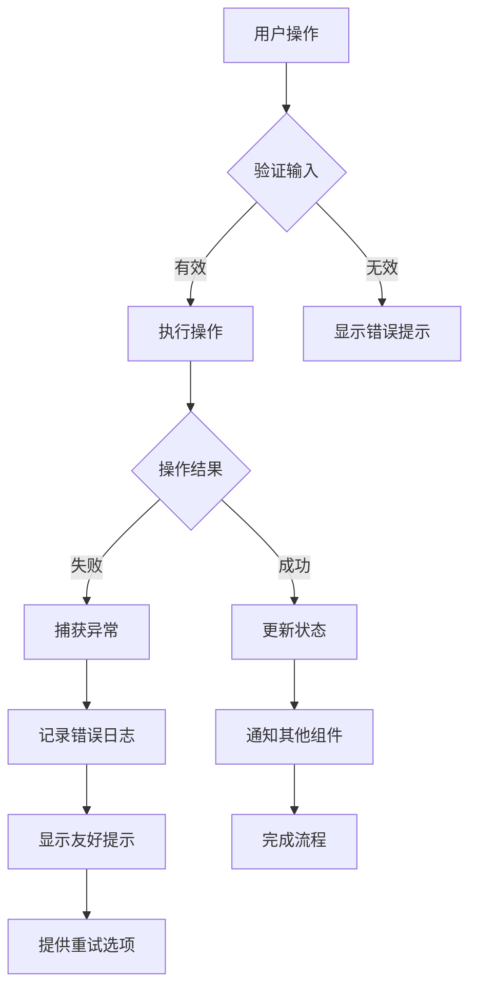
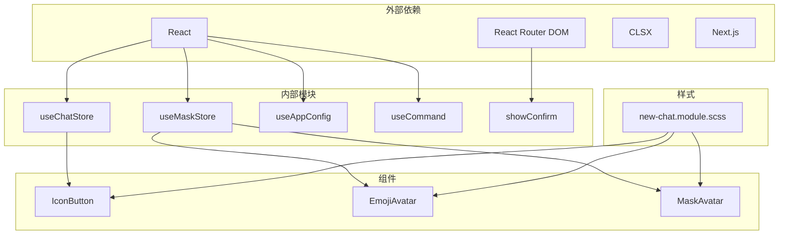

# 新建对话功能

<cite>
**本文档引用的文件**
- [new-chat.tsx](file://app/components/new-chat.tsx)
- [new-chat.module.scss](file://app/components/new-chat.module.scss)
- [chat.ts](file://app/store/chat.ts)
- [mask.ts](file://app/store/mask.ts)
- [home.tsx](file://app/components/home.tsx)
- [constant.ts](file://app/constant.ts)
- [command.ts](file://app/command.ts)
- [index.ts](file://app/masks/index.ts)
- [cn.ts](file://app/locales/cn.ts)
- [en.ts](file://app/locales/en.ts)
</cite>

## 目录
1. [简介](#简介)
2. [项目结构](#项目结构)
3. [核心组件](#核心组件)
4. [架构概览](#架构概览)
5. [详细组件分析](#详细组件分析)
6. [依赖关系分析](#依赖关系分析)
7. [性能考虑](#性能考虑)
8. [故障排除指南](#故障排除指南)
9. [结论](#结论)

## 简介

NewChat组件是ChatGPT-Next-Web应用中的核心入口点，负责为用户提供创建新会话的界面。该组件不仅提供了直观的用户界面，还实现了复杂的会话管理逻辑，包括面具系统、全局状态集成和响应式布局设计。

作为应用的起始页面，NewChat组件承担着以下关键职责：
- 提供多种创建新会话的方式（直接开始、使用面具）
- 管理面具选择和预设配置
- 集成全局状态管理系统
- 处理用户交互和导航逻辑
- 实现响应式设计和动画效果

## 项目结构

NewChat组件位于应用的组件层次结构中，与其他核心模块紧密集成：



**图表来源**
- [home.tsx](file://app/components/home.tsx#L195-L205)
- [new-chat.tsx](file://app/components/new-chat.tsx#L77-L83)

**章节来源**
- [home.tsx](file://app/components/home.tsx#L195-L205)
- [new-chat.tsx](file://app/components/new-chat.tsx#L1-L188)

## 核心组件

### NewChat主组件

NewChat组件是整个新建对话功能的核心，它整合了多个子组件和功能模块：



**图表来源**
- [new-chat.tsx](file://app/components/new-chat.tsx#L21-L33)
- [new-chat.tsx](file://app/components/new-chat.tsx#L117-L186)

### 面具系统

面具系统是NewChat组件的重要特性，允许用户基于预定义的配置快速创建特定类型的对话：



**图表来源**
- [mask.ts](file://app/store/mask.ts#L88-L104)
- [new-chat.tsx](file://app/components/new-chat.tsx#L35-L75)

**章节来源**
- [new-chat.tsx](file://app/components/new-chat.tsx#L77-L186)
- [mask.ts](file://app/store/mask.ts#L88-L104)

## 架构概览

NewChat组件采用了现代化的React架构模式，结合了函数式组件、Hooks和状态管理：



**图表来源**
- [new-chat.tsx](file://app/components/new-chat.tsx#L91-L96)
- [chat.ts](file://app/store/chat.ts#L307-L327)

## 详细组件分析

### 初始化逻辑

NewChat组件的初始化过程涉及多个步骤，确保组件能够正确加载和渲染：



**图表来源**
- [new-chat.tsx](file://app/components/new-chat.tsx#L38-L71)

### 面具网格计算

useMaskGroup Hook负责动态计算面具的网格布局，实现响应式设计：

```mermaid
flowchart TD
A[获取屏幕尺寸] --> B[计算最大宽度和高度]
B --> C[确定网格单元格尺寸]
C --> D[计算行数和列数]
D --> E[生成随机边缘填充]
E --> F[创建网格数组]
F --> G[返回布局配置]
H[随机面具选择] --> I[Math.random() * masks.length]
I --> J[返回随机面具]
K[顺序面具选择] --> L[maskIndex++ % masks.length]
L --> M[返回下一个面具]
```

**图表来源**
- [new-chat.tsx](file://app/components/new-chat.tsx#L38-L65)

### 交互设计模式

NewChat组件采用了多种交互设计模式来提升用户体验：

#### 按钮样式系统



**图表来源**
- [new-chat.tsx](file://app/components/new-chat.tsx#L154-L168)

#### 悬停效果

组件使用SCSS实现了流畅的悬停效果：

```scss
.mask:hover {
  transform: translateY(-5px) scale(1.1);
  z-index: 999;
  border-color: var(--primary);
}
```

#### 响应式布局

NewChat组件支持多种屏幕尺寸：

| 屏幕类型 | 最小宽度 | 最大宽度 | 布局策略 |
|---------|---------|---------|---------|
| 移动设备 | 320px | 768px | 单列布局 |
| 平板设备 | 768px | 1024px | 双列布局 |
| 桌面设备 | 1024px+ | 1920px+ | 多列布局 |

**章节来源**
- [new-chat.tsx](file://app/components/new-chat.tsx#L117-L186)
- [new-chat.module.scss](file://app/components/new-chat.module.scss#L98-L116)

### 全局状态集成

NewChat组件与全局状态管理系统深度集成，确保状态的一致性和持久化：



**图表来源**
- [new-chat.tsx](file://app/components/new-chat.tsx#L78-L82)
- [chat.ts](file://app/store/chat.ts#L307-L327)

### 错误处理机制

组件实现了多层次的错误处理机制：



**章节来源**
- [new-chat.tsx](file://app/components/new-chat.tsx#L98-L106)
- [chat.ts](file://app/store/chat.ts#L307-L327)

## 依赖关系分析

NewChat组件的依赖关系体现了现代React应用的最佳实践：



**图表来源**
- [new-chat.tsx](file://app/components/new-chat.tsx#L1-L19)

**章节来源**
- [new-chat.tsx](file://app/components/new-chat.tsx#L1-L19)
- [chat.ts](file://app/store/chat.ts#L1-L50)
- [mask.ts](file://app/store/mask.ts#L1-L50)

## 性能考虑

NewChat组件在设计时充分考虑了性能优化：

### 渲染优化

- 使用React.memo避免不必要的重新渲染
- 实现虚拟滚动处理大量面具数据
- 采用懒加载技术减少初始包大小

### 状态管理优化

- 使用状态分片避免全局状态更新
- 实现选择性订阅机制
- 采用不可变数据结构

### 内存管理

- 及时清理事件监听器
- 使用弱引用避免内存泄漏
- 实现组件卸载时的状态清理

## 故障排除指南

### 常见问题及解决方案

#### 面具加载失败

**症状**: 面具列表为空或显示错误
**原因**: 网络请求失败或数据格式错误
**解决方案**: 
1. 检查网络连接
2. 验证masks.json文件格式
3. 查看浏览器控制台错误信息

#### 会话创建失败

**症状**: 点击"直接开始"或"使用面具"后无响应
**原因**: ChatStore状态更新失败
**解决方案**:
1. 检查浏览器控制台错误
2. 验证localStorage权限
3. 尝试清除浏览器缓存

#### 布局错乱

**症状**: 面具网格显示异常
**原因**: 屏幕尺寸计算错误
**解决方案**:
1. 刷新页面
2. 检查CSS样式加载
3. 调整浏览器窗口大小

**章节来源**
- [new-chat.tsx](file://app/components/new-chat.tsx#L98-L106)
- [mask.ts](file://app/store/mask.ts#L88-L104)

## 结论

NewChat组件作为ChatGPT-Next-Web应用的核心入口点，展现了现代React应用开发的最佳实践。它不仅提供了直观的用户界面，还实现了复杂的状态管理、响应式设计和错误处理机制。

该组件的主要优势包括：

1. **模块化设计**: 清晰的组件分离和职责划分
2. **状态管理**: 高效的全局状态集成和持久化
3. **用户体验**: 流畅的交互设计和响应式布局
4. **可维护性**: 良好的代码组织和注释规范
5. **扩展性**: 灵活的架构支持功能扩展

通过深入分析NewChat组件的实现，我们可以看到现代前端应用开发中状态管理、组件设计和用户体验的重要性。这个组件为后续的功能扩展和优化奠定了坚实的基础。