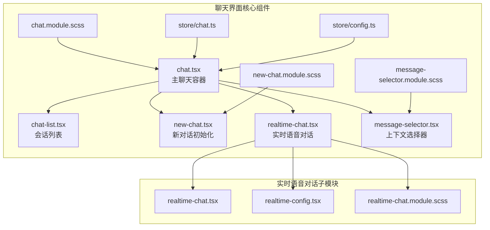
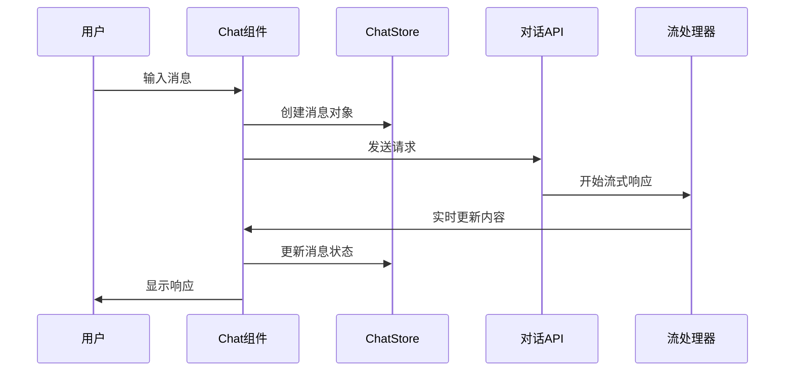
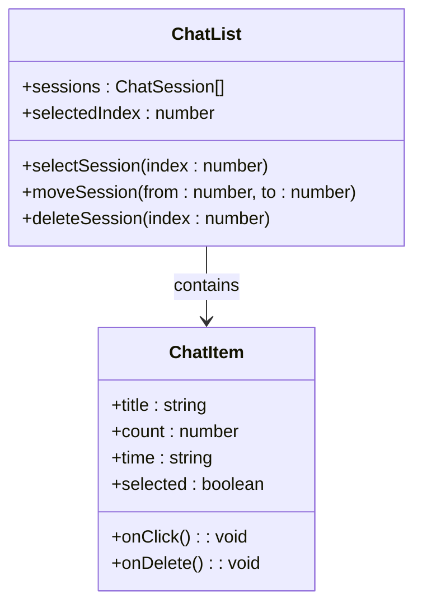
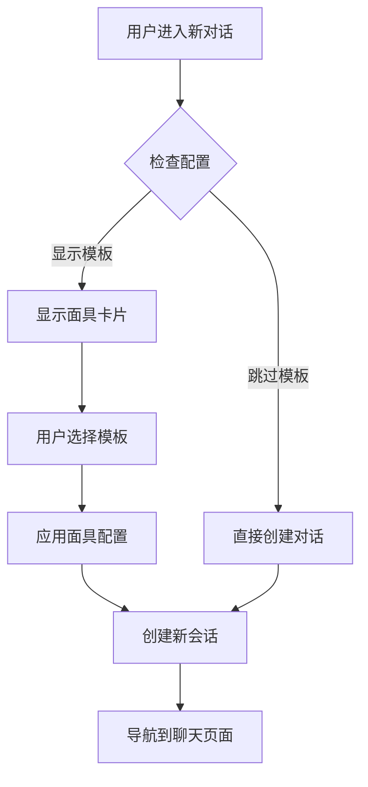
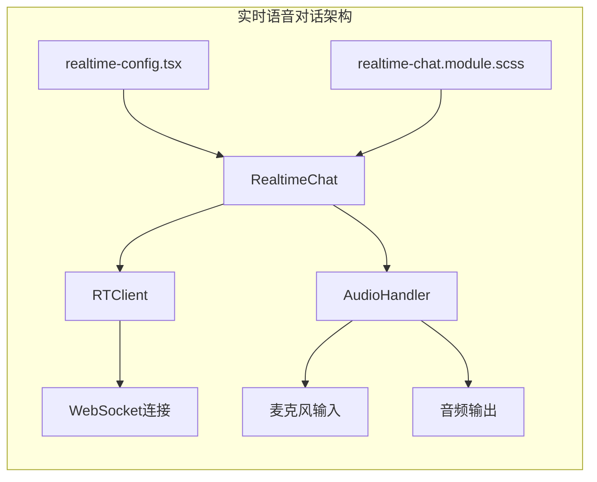
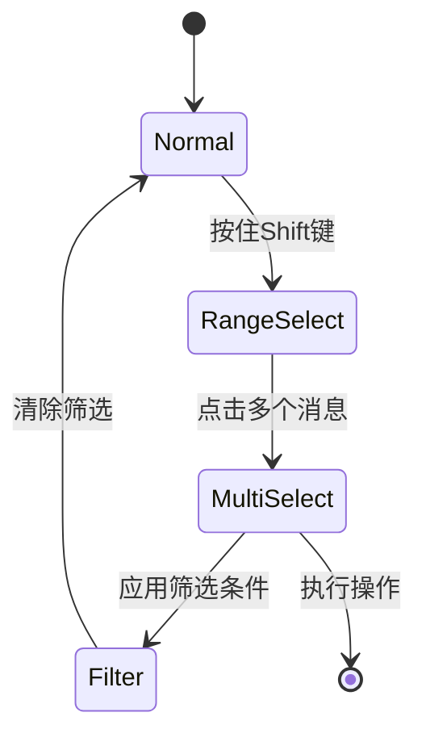
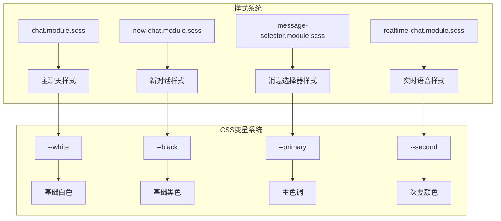
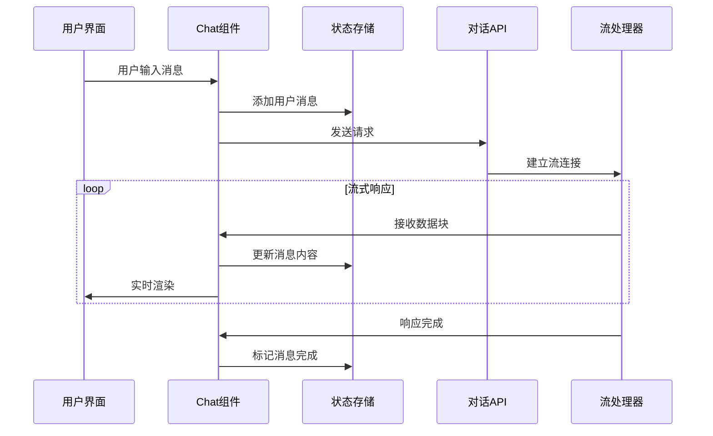
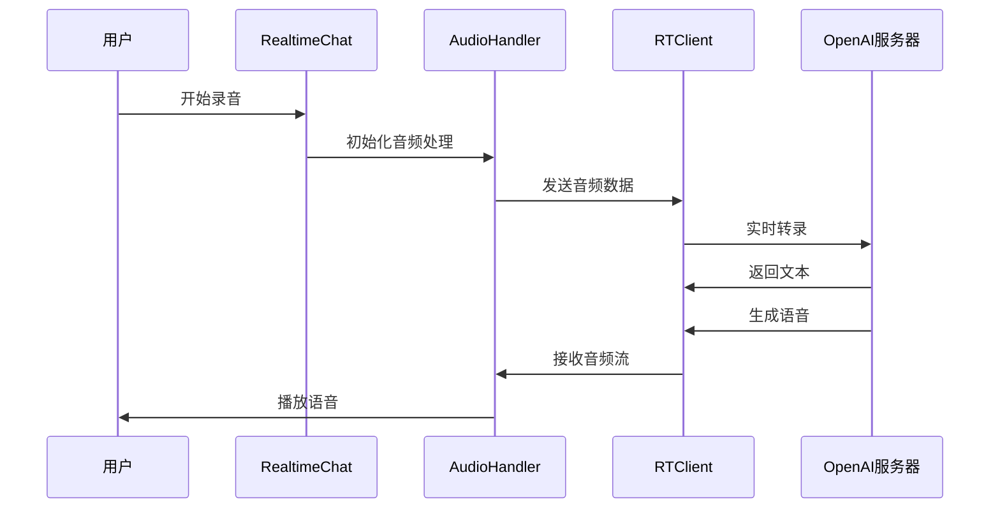
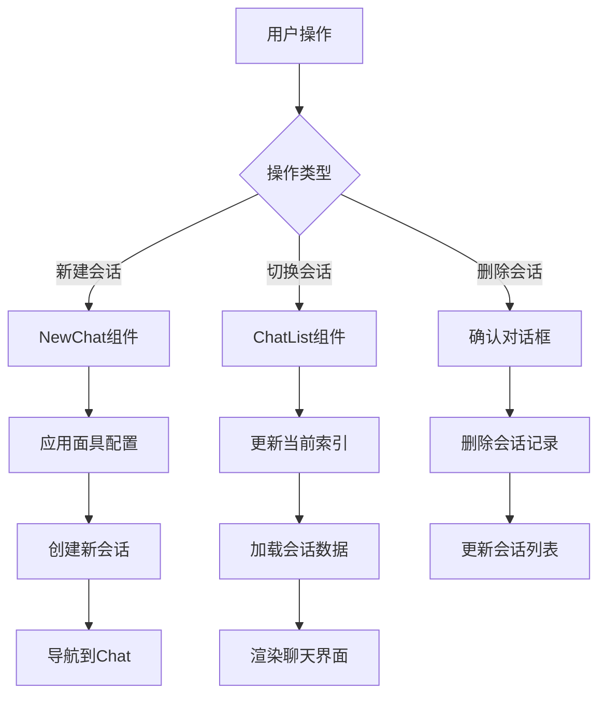

# 聊天界面组件

<cite>
**本文档中引用的文件**
- [chat.tsx](file://app/components/chat.tsx)
- [chat-list.tsx](file://app/components/chat-list.tsx)
- [new-chat.tsx](file://app/components/new-chat.tsx)
- [realtime-chat.tsx](file://app/components/realtime-chat/realtime-chat.tsx)
- [realtime-config.tsx](file://app/components/realtime-chat/realtime-config.tsx)
- [message-selector.tsx](file://app/components/message-selector.tsx)
- [chat.module.scss](file://app/components/chat.module.scss)
- [new-chat.module.scss](file://app/components/new-chat.module.scss)
- [message-selector.module.scss](file://app/components/message-selector.module.scss)
- [chat.ts](file://app/store/chat.ts)
- [config.ts](file://app/store/config.ts)
</cite>

## 目录
1. [概述](#概述)
2. [核心组件架构](#核心组件架构)
3. [主聊天容器 - chat.tsx](#主聊天容器---chatsx)
4. [会话列表管理 - chat-list.tsx](#会话列表管理---chat-listtsx)
5. [新对话初始化 - new-chat.tsx](#新对话初始化---new-chatsx)
6. [实时语音对话 - realtime-chat模块](#实时语音对话---realtime-chat模块)
7. [上下文选择器 - message-selector](#上下文选择器---message-selectorsx)
8. [样式系统与UI模式](#样式系统与ui模式)
9. [组件交互流程](#组件交互流程)
10. [总结](#总结)

## 概述

ChatGPT-Next-Web的聊天界面采用模块化架构设计，由多个核心组件协同工作，提供完整的聊天体验。主要组件包括主聊天容器、会话列表管理、新对话初始化、实时语音对话支持以及上下文选择功能。

## 核心组件架构

**图表来源**
- [chat.tsx](file://app/components/chat.tsx#L1-L50)
- [chat-list.tsx](file://app/components/chat-list.tsx#L1-L30)
- [new-chat.tsx](file://app/components/new-chat.tsx#L1-L30)

## 主聊天容器 - chat.tsx

chat.tsx是整个聊天界面的核心容器，负责协调所有子组件的工作，管理消息流渲染、输入处理和实时响应机制。

### 主要职责

1. **消息流渲染管理**
   - 处理用户消息和机器人回复的渲染
   - 支持流式响应显示
   - 管理消息状态（加载、完成、错误）

2. **输入处理机制**
   - 文本输入框管理
   - 键盘快捷键处理
   - 文件上传支持

3. **实时流式响应接收**
   - WebSocket连接管理
   - 流式数据处理
   - 响应中断控制

### 核心功能实现

**图表来源**
- [chat.tsx](file://app/components/chat.tsx#L1680-L1750)
- [chat.ts](file://app/store/chat.ts#L67-L76)

### 关键特性

- **智能滚动**: 自动滚动到底部，支持手动控制
- **消息编辑**: 支持消息修改和重新发送
- **工具集成**: 集成插件和MCP工具支持
- **多模态支持**: 图像、音频等多媒体内容处理

**章节来源**
- [chat.tsx](file://app/components/chat.tsx#L1-L800)
- [chat.ts](file://app/store/chat.ts#L44-L66)

## 会话列表管理 - chat-list.tsx

chat-list.tsx负责管理用户的聊天会话列表，提供拖拽排序、会话切换和删除功能。

### 组件结构

**图表来源**
- [chat-list.tsx](file://app/components/chat-list.tsx#L23-L102)
- [chat.ts](file://app/store/chat.ts#L84-L96)

### 功能特性

1. **拖拽排序**: 使用react-beautiful-dnd实现会话重排
2. **会话预览**: 显示消息数量和最后更新时间
3. **快速访问**: 点击切换到对应会话
4. **批量操作**: 支持删除确认和批量清理

### 样式系统

采用SCSS模块化设计，支持主题切换和响应式布局：

- **桌面端**: 完整的标题、时间和消息计数显示
- **移动端**: 紧凑模式，仅显示图标和基本信息
- **选中状态**: 清晰的视觉反馈

**章节来源**
- [chat-list.tsx](file://app/components/chat-list.tsx#L1-L175)

## 新对话初始化 - new-chat.tsx

new-chat.tsx提供直观的新对话创建界面，支持从预设模板开始或直接创建空白对话。

### 初始化流程

**图表来源**
- [new-chat.tsx](file://app/components/new-chat.tsx#L77-L110)

### 面具系统

1. **内置面具**: 提供多种预设对话场景
2. **动态布局**: 基于屏幕尺寸自动调整网格布局
3. **快速创建**: 点击即可应用面具并开始对话
4. **自定义面具**: 支持用户创建和管理自定义面具

### 用户体验优化

- **视觉引导**: 中心化的欢迎界面和操作按钮
- **快捷方式**: 支持键盘快捷键和命令行调用
- **配置记忆**: 记住用户偏好设置

**章节来源**
- [new-chat.tsx](file://app/components/new-chat.tsx#L1-L188)

## 实时语音对话 - realtime-chat模块

realtime-chat模块提供了先进的实时语音对话功能，基于OpenAI的实时API构建。

### 架构设计

**图表来源**
- [realtime-chat.tsx](file://app/components/realtime-chat/realtime-chat.tsx#L1-L50)
- [realtime-config.tsx](file://app/components/realtime-chat/realtime-config.tsx#L1-L30)

### 核心功能

1. **语音识别**: 实时将用户语音转换为文本
2. **语音合成**: 将机器人回复转换为语音输出
3. **双向通信**: 同时处理输入和输出音频流
4. **VAD检测**: 基于语音活动检测的智能断句

### 配置选项

| 配置项 | 类型 | 默认值 | 描述 |
|--------|------|--------|------|
| provider | ServiceProvider | OpenAI | 服务提供商 |
| model | string | gpt-4o-realtime-preview-2024-10-01 | 模型名称 |
| apiKey | string | "" | API密钥 |
| voice | Voice | alloy | 语音模型 |
| temperature | number | 0.9 | 温度参数 |
| azure.endpoint | string | "" | Azure端点 |
| azure.deployment | string | "" | Azure部署 |

### 技术实现

- **音频处理**: 使用Web Audio API进行实时音频处理
- **流式传输**: 支持低延迟的音频流传输
- **错误处理**: 完善的连接失败和重试机制
- **状态管理**: 实时的状态同步和用户反馈

**章节来源**
- [realtime-chat.tsx](file://app/components/realtime-chat/realtime-chat.tsx#L1-L360)
- [realtime-config.tsx](file://app/components/realtime-chat/realtime-config.tsx#L1-L174)

## 上下文选择器 - message-selector

message-selector提供了强大的消息选择和过滤功能，支持范围选择、搜索和批量操作。

### 选择机制

**图表来源**
- [message-selector.tsx](file://app/components/message-selector.tsx#L13-L53)

### 核心功能

1. **范围选择**: Shift+点击实现连续区域选择
2. **搜索过滤**: 支持消息内容关键词搜索
3. **批量操作**: 支持全选、最新消息选择等操作
4. **实时预览**: 选择时实时显示选中状态

### 数据处理

- **消息验证**: 过滤无效、错误或正在流式传输的消息
- **上下文索引**: 支持从特定位置开始的选择
- **状态同步**: 与主聊天状态保持同步

**章节来源**
- [message-selector.tsx](file://app/components/message-selector.tsx#L1-L239)

## 样式系统与UI模式

### SCSS模块化架构

项目采用SCSS模块化设计，每个组件都有独立的样式文件：

**图表来源**
- [chat.module.scss](file://app/components/chat.module.scss#L1-L50)
- [new-chat.module.scss](file://app/components/new-chat.module.scss#L1-L30)

### Tailwind协同使用

虽然项目主要使用SCSS，但也部分集成了Tailwind CSS：

- **工具类**: 在JSX中使用Tailwind工具类
- **响应式**: 结合SCSS媒体查询实现响应式设计
- **动画**: 使用Tailwind动画类增强用户体验

### UI模式

1. **加载状态**: 通过骨架屏和进度指示器
2. **错误提示**: 统一的错误消息显示
3. **成功反馈**: 操作成功的视觉确认
4. **交互状态**: 鼠标悬停、点击等状态变化

**章节来源**
- [chat.module.scss](file://app/components/chat.module.scss#L1-L754)
- [new-chat.module.scss](file://app/components/new-chat.module.scss#L1-L126)
- [message-selector.module.scss](file://app/components/message-selector.module.scss#L1-L83)

## 组件交互流程

### 聊天消息流

**图表来源**
- [chat.tsx](file://app/components/chat.tsx#L1680-L1750)

### 实时语音对话流程

**图表来源**
- [realtime-chat.tsx](file://app/components/realtime-chat/realtime-chat.tsx#L231-L285)

### 会话管理流程

**图表来源**
- [new-chat.tsx](file://app/components/new-chat.tsx#L89-L110)
- [chat-list.tsx](file://app/components/chat-list.tsx#L144-L166)

## 总结

ChatGPT-Next-Web的聊天界面组件系统展现了现代Web应用的优秀架构设计：

1. **模块化设计**: 每个组件职责明确，便于维护和扩展
2. **状态管理**: 采用集中式状态管理，确保数据一致性
3. **实时性**: 支持流式响应和实时语音对话
4. **用户体验**: 注重交互细节和视觉反馈
5. **可扩展性**: 良好的架构支持功能扩展和定制

这种设计不仅保证了系统的稳定性和性能，也为未来的功能扩展奠定了坚实的基础。通过合理的组件划分和清晰的交互流程，为用户提供了流畅、自然的聊天体验。