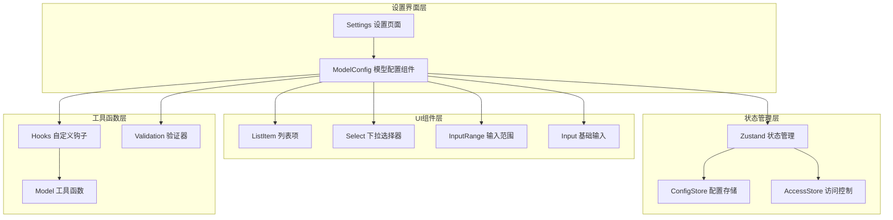
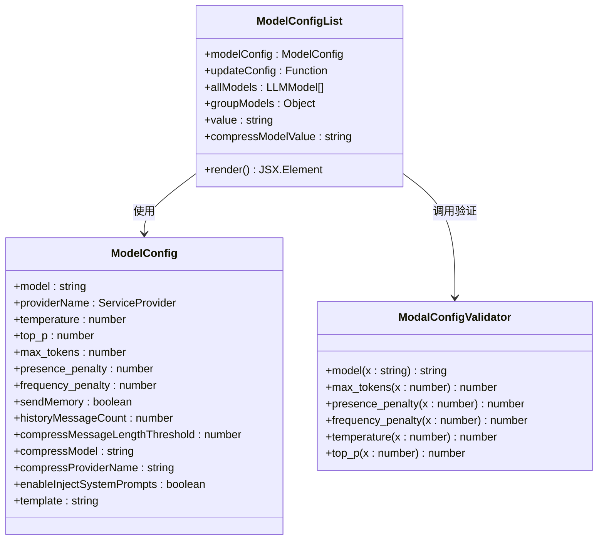
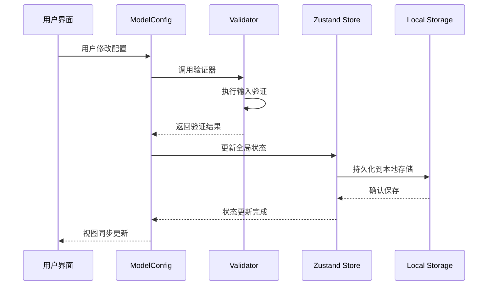
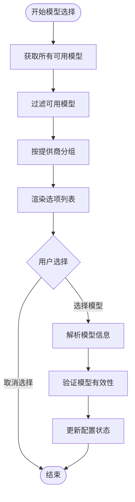
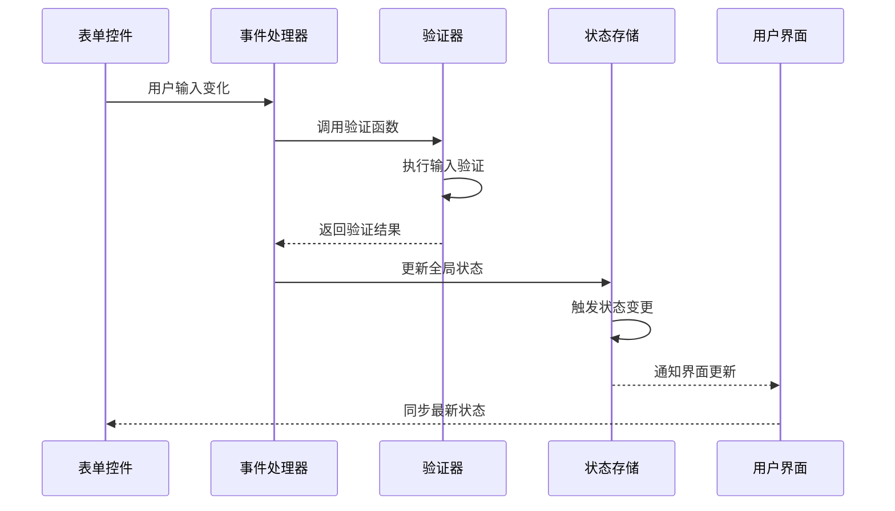
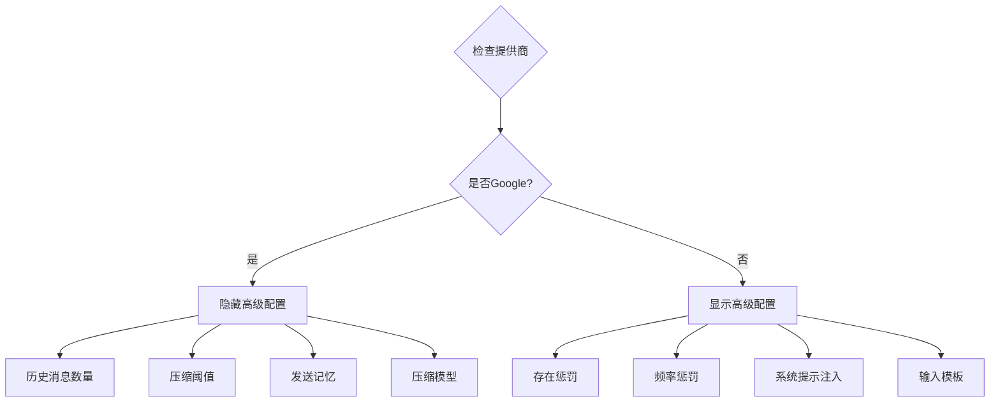
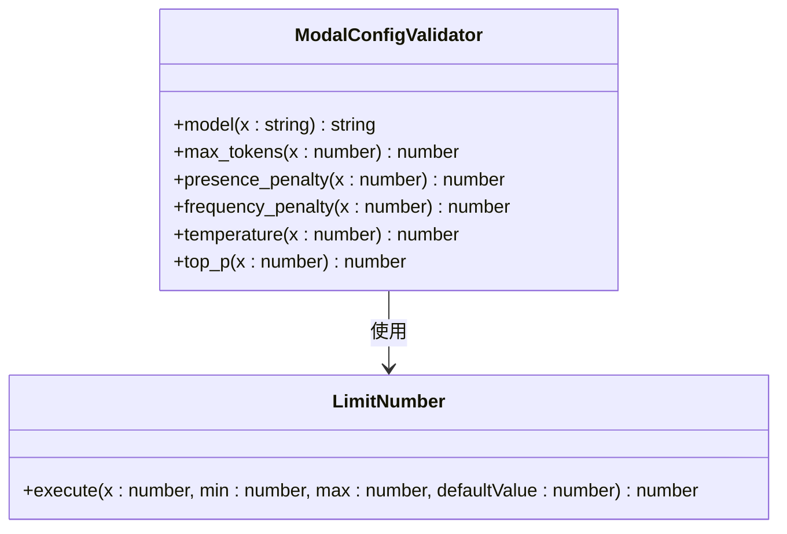
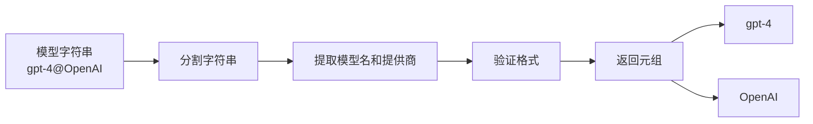
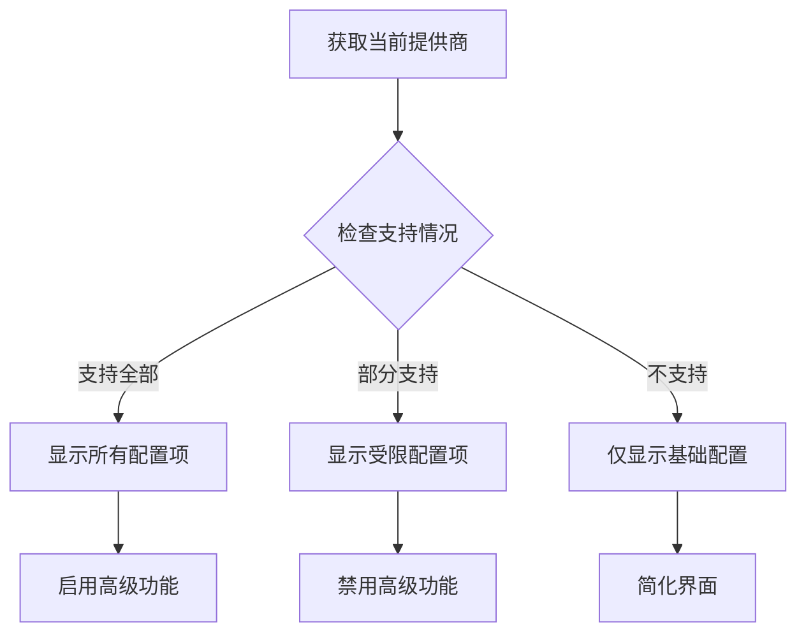
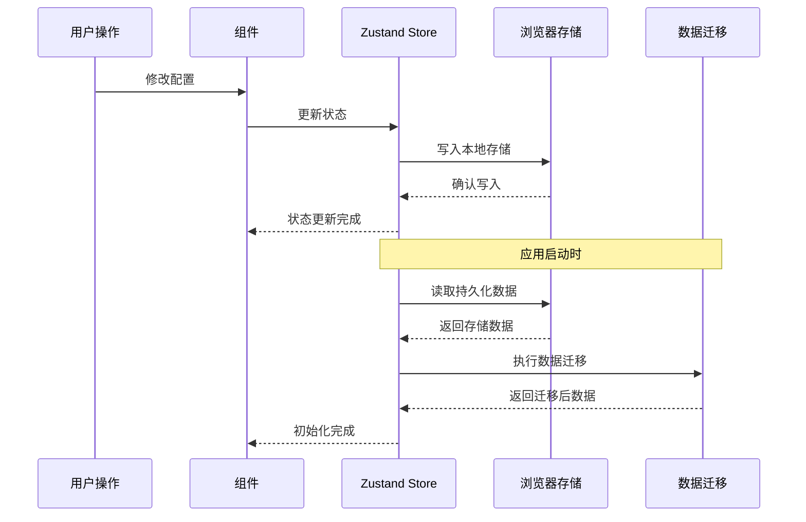

# 模型配置组件深度解析

<cite>
**本文档引用的文件**
- [model-config.tsx](file://app/components/model-config.tsx)
- [config.ts](file://app/store/config.ts)
- [model.ts](file://app/utils/model.ts)
- [hooks.ts](file://app/utils/hooks.ts)
- [ui-lib.tsx](file://app/components/ui-lib.tsx)
- [input-range.tsx](file://app/components/input-range.tsx)
- [settings.tsx](file://app/components/settings.tsx)
- [constant.ts](file://app/constant.ts)
- [api.ts](file://app/client/api.ts)
</cite>

## 目录
1. [概述](#概述)
2. [项目架构](#项目架构)
3. [核心组件分析](#核心组件分析)
4. [状态管理系统](#状态管理系统)
5. [配置项详解](#配置项详解)
6. [表单控件与状态绑定](#表单控件与状态绑定)
7. [输入验证机制](#输入验证机制)
8. [多提供商适配](#多提供商适配)
9. [数据持久化](#数据持久化)
10. [性能优化策略](#性能优化策略)
11. [故障排除指南](#故障排除指南)
12. [总结](#总结)

## 概述

模型配置组件（ModelConfig）是ChatGPT Next Web项目中的核心设置界面组件，负责为用户提供可视化的AI模型参数配置功能。该组件通过Zustand状态管理库实现全局配置状态的统一管理，支持多种AI提供商的模型参数配置，并提供了完善的输入验证和错误处理机制。

### 主要功能特性

- **多提供商模型选择**：支持OpenAI、Google、Anthropic等多个AI服务提供商的模型切换
- **参数可视化配置**：提供直观的滑块、输入框等控件配置模型参数
- **实时状态同步**：通过Zustand实现表单控件与全局状态的双向绑定
- **智能验证机制**：内置输入验证规则，确保配置参数的有效性
- **条件渲染**：根据不同的AI提供商动态显示或隐藏特定配置项

## 项目架构

**图表来源**
- [settings.tsx](file://app/components/settings.tsx#L1919-L1926)
- [model-config.tsx](file://app/components/model-config.tsx#L12-L15)
- [ui-lib.tsx](file://app/components/ui-lib.tsx#L54-L87)

## 核心组件分析

### ModelConfigList 组件结构

ModelConfigList 是模型配置的核心组件，采用函数式组件设计，接收 `modelConfig` 和 `updateConfig` 两个属性作为配置参数和更新函数。

**图表来源**
- [model-config.tsx](file://app/components/model-config.tsx#L12-L23)
- [config.ts](file://app/store/config.ts#L111-L120)
- [config.ts](file://app/store/config.ts#L143-L161)

**章节来源**
- [model-config.tsx](file://app/components/model-config.tsx#L12-L274)

### 组件生命周期管理

组件通过React的 `useMemo` 和 `useEffect` 钩子实现高效的性能优化：

- **模型数据预处理**：使用 `useAllModels()` 获取并分组所有可用模型
- **状态依赖追踪**：通过 `useMemo` 缓存计算结果，避免不必要的重新渲染
- **响应式更新**：监听配置变化，自动更新相关状态

## 状态管理系统

### Zustand 集成架构

系统采用Zustand作为状态管理解决方案，实现了全局配置状态的集中管理：

**图表来源**
- [model-config.tsx](file://app/components/model-config.tsx#L35-L38)
- [config.ts](file://app/store/config.ts#L164-L262)

### 全局配置状态结构

配置状态采用分层结构设计，包含模型配置、TTS配置和实时配置三个主要部分：

| 配置类别 | 属性名称 | 数据类型 | 默认值 | 描述 |
|---------|---------|---------|--------|------|
| 模型配置 | model | string | "gpt-4o-mini" | 当前选中的AI模型 |
| 模型配置 | providerName | ServiceProvider | "OpenAI" | AI服务提供商 |
| 模型配置 | temperature | number | 0.5 | 生成文本的随机性参数 |
| 模型配置 | top_p | number | 1 | 核采样参数 |
| 模型配置 | max_tokens | number | 4000 | 最大生成令牌数 |
| 模型配置 | presence_penalty | number | 0 | 存在惩罚系数 |
| 模型配置 | frequency_penalty | number | 0 | 频率惩罚系数 |
| 模型配置 | sendMemory | boolean | true | 是否发送历史记忆 |
| 模型配置 | historyMessageCount | number | 4 | 历史消息数量 |
| 模型配置 | compressMessageLengthThreshold | number | 1000 | 压缩阈值 |
| 模型配置 | compressModel | string | "" | 压缩模型 |
| 模型配置 | enableInjectSystemPrompts | boolean | true | 启用系统提示注入 |
| 模型配置 | template | string | DEFAULT_INPUT_TEMPLATE | 输入模板 |

**章节来源**
- [config.ts](file://app/store/config.ts#L66-L84)

## 配置项详解

### 模型选择配置

模型选择功能支持跨提供商的模型切换，通过 `Select` 组件实现下拉选择：

**图表来源**
- [model-config.tsx](file://app/components/model-config.tsx#L26-L50)
- [model.ts](file://app/utils/model.ts#L40-L49)

### 温度参数配置

温度参数控制生成文本的随机性和创造性：

- **取值范围**：0.0 - 2.0
- **默认值**：0.5
- **作用效果**：
  - 低温度（接近0）：输出更确定、保守
  - 高温度（接近2）：输出更随机、创造性更强

### Top-P 参数配置

Top-P（核采样）参数控制词汇选择的概率分布：

- **取值范围**：0.0 - 1.0
- **默认值**：1.0
- **工作原理**：只考虑累积概率达到P的最小词汇集合

### 最大令牌数配置

控制每次请求的最大输出长度：

- **取值范围**：1024 - 512000
- **默认值**：4000
- **影响因素**：模型能力、上下文长度限制

**章节来源**
- [model-config.tsx](file://app/components/model-config.tsx#L52-L111)

### 惩罚系数配置

存在惩罚和频率惩罚用于控制重复内容的生成：

- **存在惩罚**：-2.0 到 2.0
- **频率惩罚**：-2.0 到 2.0
- **默认值**：0.0
- **应用场景**：减少重复内容，提高多样性

### 高级配置选项

#### 历史消息数量

控制保留的历史对话轮数：

- **取值范围**：0 - 64
- **默认值**：4
- **影响**：影响上下文理解和对话连贯性

#### 压缩阈值

设置消息压缩的触发条件：

- **取值范围**：500 - 4000
- **默认值**：1000
- **作用**：当消息长度超过阈值时自动压缩

#### 系统提示注入

控制是否启用系统提示的自动注入：

- **默认值**：true
- **作用**：增强指令理解和行为一致性

**章节来源**
- [model-config.tsx](file://app/components/model-config.tsx#L194-L270)

## 表单控件与状态绑定

### 双向数据绑定机制

组件实现了完整的双向数据绑定，确保表单控件与全局状态的一致性：

**图表来源**
- [model-config.tsx](file://app/components/model-config.tsx#L35-L38)
- [model-config.tsx](file://app/components/model-config.tsx#L63-L68)

### 控件类型映射

| 配置项 | 控件类型 | 验证规则 | 特殊处理 |
|-------|---------|---------|---------|
| 模型选择 | Select | 无特殊验证 | 分组显示 |
| 温度 | InputRange | 0.0-2.0 | 固定步长0.1 |
| Top-P | InputRange | 0.0-1.0 | 固定步长0.1 |
| 最大令牌数 | Number Input | 1024-512000 | 数字验证 |
| 存在惩罚 | InputRange | -2.0-2.0 | 固定步长0.1 |
| 频率惩罚 | InputRange | -2.0-2.0 | 固定步长0.1 |
| 历史消息 | InputRange | 0-64 | 整数验证 |
| 压缩阈值 | Number Input | 500-4000 | 数字验证 |
| 复选框 | Checkbox | 布尔值 | 状态切换 |
| 文本输入 | Text Input | 字符串验证 | 直接赋值 |

**章节来源**
- [model-config.tsx](file://app/components/model-config.tsx#L26-L270)

### 条件渲染逻辑

组件根据不同的AI提供商动态显示配置项：

**图表来源**
- [model-config.tsx](file://app/components/model-config.tsx#L113-L193)

## 输入验证机制

### 验证器架构设计

系统采用专门的验证器模块，提供统一的输入验证接口：

**图表来源**
- [config.ts](file://app/store/config.ts#L143-L161)
- [config.ts](file://app/store/config.ts#L115-L126)

### 验证规则详解

#### 数值范围验证

所有数值类型的配置项都采用 `limitNumber` 函数进行范围约束：

| 参数 | 最小值 | 最大值 | 默认值 | 验证函数 |
|------|--------|--------|--------|----------|
| temperature | 0.0 | 2.0 | 1.0 | limitNumber(x, 0, 2, 1) |
| top_p | 0.0 | 1.0 | 1.0 | limitNumber(x, 0, 1, 1) |
| max_tokens | 0 | 512000 | 1024 | limitNumber(x, 0, 512000, 1024) |
| presence_penalty | -2.0 | 2.0 | 0.0 | limitNumber(x, -2, 2, 0) |
| frequency_penalty | -2.0 | 2.0 | 0.0 | limitNumber(x, -2, 2, 0) |

#### 类型验证

- **模型名称**：字符串验证，确保格式正确
- **布尔值**：直接赋值，无需额外验证
- **数字输入**：类型转换和范围检查

**章节来源**
- [config.ts](file://app/store/config.ts#L143-L161)

### 错误处理机制

验证失败时的处理策略：

1. **输入拦截**：阻止无效输入
2. **默认值回退**：使用安全的默认值
3. **用户反馈**：通过视觉提示告知用户
4. **状态保护**：确保全局状态始终有效

## 多提供商适配

### 提供商识别机制

系统通过 `getModelProvider` 函数解析模型字符串，提取模型名称和提供商信息：

**图表来源**
- [model-config.tsx](file://app/components/model-config.tsx#L32-L34)
- [model.ts](file://app/utils/model.ts#L40-L49)

### 提供商特定配置

不同提供商对某些配置项的支持程度不同：

| 提供商 | 支持的配置项 | 特殊限制 | 默认行为 |
|-------|-------------|---------|---------|
| OpenAI | 全部配置项 | 无 | 标准支持 |
| Google | 模型、温度、Top-P | 不支持惩罚系数 | 隐藏相关控件 |
| Anthropic | 模型、温度、Top-P | 不支持惩罚系数 | 隐藏相关控件 |
| 其他 | 模型、温度、Top-P | 不支持惩罚系数 | 隐藏相关控件 |

### 动态配置渲染

组件根据当前选择的提供商动态调整界面布局：

**图表来源**
- [model-config.tsx](file://app/components/model-config.tsx#L113-L193)

**章节来源**
- [model-config.tsx](file://app/components/model-config.tsx#L32-L38)

## 数据持久化

### Zustand 持久化策略

系统使用 `createPersistStore` 实现配置的持久化存储：

**图表来源**
- [config.ts](file://app/store/config.ts#L164-L262)

### 版本兼容性管理

系统实现了完善的数据迁移机制，确保配置数据的向前兼容性：

| 版本号 | 迁移内容 | 影响范围 |
|-------|---------|---------|
| 3.4 | 添加 sendMemory、historyMessageCount、compressMessageLengthThreshold | 模型配置 |
| 3.5 | 添加 customModels 配置 | 自定义模型 |
| 3.6 | 添加 enableInjectSystemPrompts | 系统提示 |
| 3.7 | 添加 enableAutoGenerateTitle | 自动标题 |
| 3.8 | 添加 lastUpdate 时间戳 | 全局配置 |
| 3.9 | 更新模板配置 | 输入模板 |
| 4.1 | 添加压缩模型配置 | 压缩功能 |

**章节来源**
- [config.ts](file://app/store/config.ts#L200-L259)

### 存储键值管理

配置数据通过统一的存储键进行管理：

- **主存储键**：`StoreKey.Config`（"app-config"）
- **版本控制**：当前版本为4.1
- **数据结构**：完整的配置对象
- **序列化**：JSON格式存储

## 性能优化策略

### 渲染性能优化

系统采用多种策略优化组件渲染性能：

1. **记忆化计算**：使用 `useMemo` 缓存计算结果
2. **条件渲染**：根据提供商动态显示/隐藏配置项
3. **事件防抖**：避免频繁的状态更新
4. **批量更新**：合并多个状态变更操作

### 内存管理

- **组件卸载清理**：及时清理事件监听器
- **状态重置**：提供完整的状态重置功能
- **垃圾回收**：避免内存泄漏

### 网络优化

- **懒加载**：按需加载模型数据
- **缓存策略**：缓存模型列表和配置数据
- **并发处理**：异步处理配置更新

## 故障排除指南

### 常见问题诊断

#### 配置无法保存

**症状**：修改配置后刷新页面恢复默认值

**可能原因**：
1. 浏览器存储权限被拒绝
2. 存储空间不足
3. 数据格式损坏

**解决方法**：
1. 检查浏览器存储设置
2. 清理浏览器缓存
3. 重置配置到默认状态

#### 模型列表为空

**症状**：模型选择器显示空白

**可能原因**：
1. 网络连接异常
2. 模型数据加载失败
3. 权限配置错误

**解决方法**：
1. 检查网络连接
2. 刷新页面重新加载
3. 检查API密钥配置

#### 配置验证失败

**症状**：输入无效值时界面无反应

**可能原因**：
1. 验证器逻辑错误
2. 输入格式不匹配
3. 类型转换失败

**解决方法**：
1. 检查输入格式
2. 使用默认值替代
3. 查看控制台错误信息

### 调试技巧

1. **开发者工具**：使用浏览器开发者工具监控状态变化
2. **日志记录**：添加必要的日志输出
3. **单元测试**：编写验证器的单元测试
4. **边界测试**：测试极端输入值

**章节来源**
- [config.ts](file://app/store/config.ts#L164-L262)

## 总结

模型配置组件是ChatGPT Next Web项目中的关键界面组件，它成功地实现了以下目标：

### 技术亮点

1. **模块化设计**：清晰的组件分离和职责划分
2. **状态管理**：基于Zustand的高效状态管理
3. **类型安全**：完整的TypeScript类型定义
4. **用户体验**：直观的配置界面和即时反馈
5. **扩展性**：良好的架构支持新提供商接入

### 架构优势

- **可维护性**：清晰的代码结构和文档
- **可测试性**：模块化设计便于单元测试
- **可扩展性**：插件化的提供商支持
- **性能**：优化的渲染和状态更新机制

### 改进建议

1. **国际化支持**：增强多语言配置界面
2. **配置导入导出**：支持配置文件的导入导出
3. **配置模板**：提供预设的配置模板
4. **实时预览**：添加配置效果的实时预览功能

该组件展现了现代前端应用的最佳实践，为AI模型配置提供了专业、可靠的用户界面解决方案。