# 认证与密钥管理组件

<cite>
**本文档中引用的文件**
- [app/components/auth.tsx](file://app/components/auth.tsx)
- [app/store/access.ts](file://app/store/access.tsx)
- [app/api/auth.ts](file://app/api/auth.ts)
- [app/utils/store.ts](file://app/utils/store.ts)
- [app/utils/auth-settings-events.ts](file://app/utils/auth-settings-events.ts)
- [app/utils/hmac.ts](file://app/utils/hmac.ts)
- [app/utils/clone.ts](file://app/utils/clone.ts)
- [app/utils/indexedDB-storage.ts](file://app/utils/indexedDB-storage.ts)
- [app/config/server.ts](file://app/config/server.ts)
- [app/constant.ts](file://app/constant.ts)
- [app/api/openai.ts](file://app/api/openai.ts)
- [app/api/google.ts](file://app/api/google.ts)
- [app/api/anthropic.ts](file://app/api/anthropic.ts)
</cite>

## 目录
1. [简介](#简介)
2. [项目结构概览](#项目结构概览)
3. [核心组件分析](#核心组件分析)
4. [架构设计](#架构设计)
5. [详细组件分析](#详细组件分析)
6. [密钥管理流程](#密钥管理流程)
7. [安全机制](#安全机制)
8. [状态管理](#状态管理)
9. [API集成](#api集成)
10. [性能考虑](#性能考虑)
11. [故障排除指南](#故障排除指南)
12. [总结](#总结)

## 简介

auth.tsx组件是ChatGPT-Next-Web项目中负责API密钥管理和身份验证的核心组件。它为用户提供了统一的界面来输入和管理多个AI服务提供商的API密钥，包括OpenAI、Google、Anthropic等主流平台。该组件不仅实现了密钥的安全存储和传输，还提供了完整的认证流程和错误处理机制。

## 项目结构概览

该项目采用现代化的React + Next.js架构，主要分为以下几个层次：

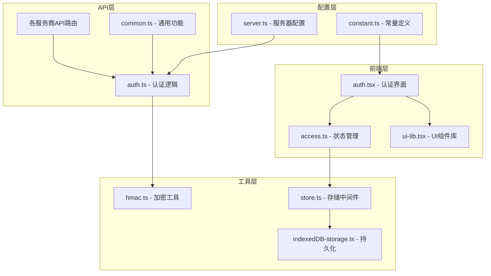

**图表来源**
- [app/components/auth.tsx](file://app/components/auth.tsx#L1-L190)
- [app/store/access.ts](file://app/store/access.tsx#L1-L304)
- [app/api/auth.ts](file://app/api/auth.ts#L1-L130)

## 核心组件分析

### AuthPage 组件

AuthPage是认证界面的主要组件，提供了用户友好的密钥输入界面：

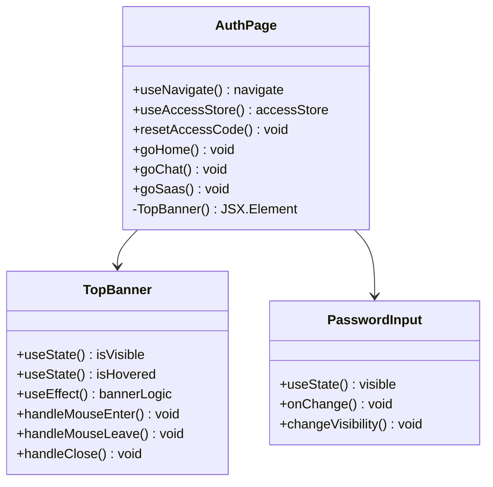

**图表来源**
- [app/components/auth.tsx](file://app/components/auth.tsx#L25-L190)

**章节来源**
- [app/components/auth.tsx](file://app/components/auth.tsx#L25-L190)

### 密钥输入界面

组件支持多种类型的密钥输入：

| 密钥类型 | 描述 | 验证规则 |
|---------|------|----------|
| 访问码 | 用户访问控制密钥 | MD5哈希验证 |
| OpenAI API密钥 | OpenAI服务API密钥 | 必填字段 |
| Google API密钥 | Google AI Studio API密钥 | 可选但推荐 |
| Anthropic API密钥 | Anthropic Claude API密钥 | 可选但推荐 |

**章节来源**
- [app/components/auth.tsx](file://app/components/auth.tsx#L66-L110)

## 架构设计

### 系统架构图

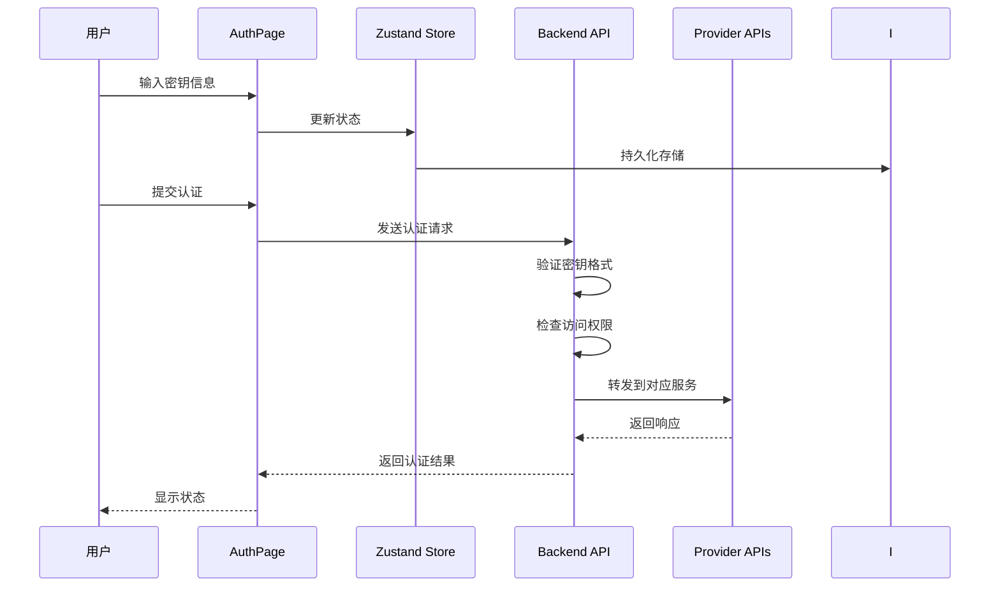

**图表来源**
- [app/components/auth.tsx](file://app/components/auth.tsx#L73-L117)
- [app/store/access.ts](file://app/store/access.tsx#L156-L304)
- [app/api/auth.ts](file://app/api/auth.ts#L27-L130)

## 详细组件分析

### 密钥验证机制

组件实现了多层次的密钥验证：

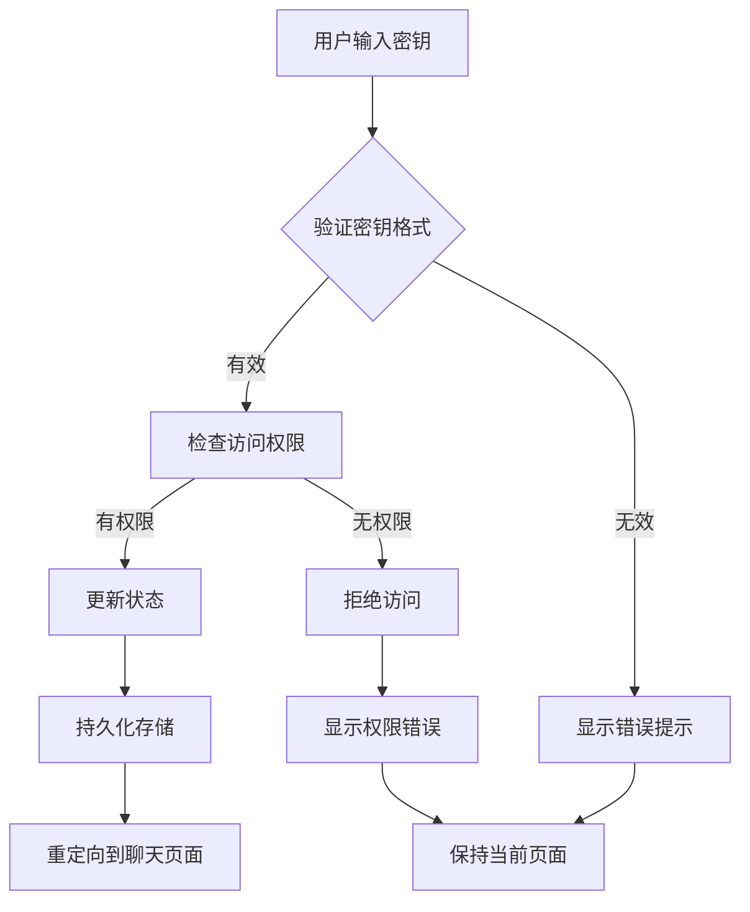

**图表来源**
- [app/store/access.ts](file://app/store/access.tsx#L175-L249)
- [app/api/auth.ts](file://app/api/auth.ts#L42-L54)

### 状态管理模式

使用Zustand进行状态管理，支持持久化存储：

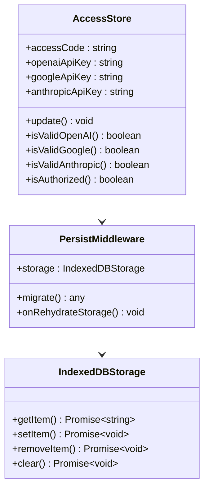

**图表来源**
- [app/store/access.ts](file://app/store/access.tsx#L156-L304)
- [app/utils/store.ts](file://app/utils/store.ts#L29-L79)
- [app/utils/indexedDB-storage.ts](file://app/utils/indexedDB-storage.ts#L7-L47)

**章节来源**
- [app/store/access.ts](file://app/store/access.tsx#L156-L304)
- [app/utils/store.ts](file://app/utils/store.ts#L29-L79)

### 密钥加密与安全

系统采用多层安全机制保护用户密钥：

| 安全层级 | 实现方式 | 保护内容 |
|---------|----------|----------|
| 传输安全 | HTTPS协议 | 防止中间人攻击 |
| 存储安全 | IndexedDB加密 | 本地数据保护 |
| 验证安全 | MD5哈希验证 | 访问码防篡改 |
| 权限控制 | 服务器端验证 | 防止未授权访问 |

**章节来源**
- [app/api/auth.ts](file://app/api/auth.ts#L17-L24)
- [app/utils/hmac.ts](file://app/utils/hmac.ts#L188-L217)

## 密钥管理流程

### 密钥输入与验证流程

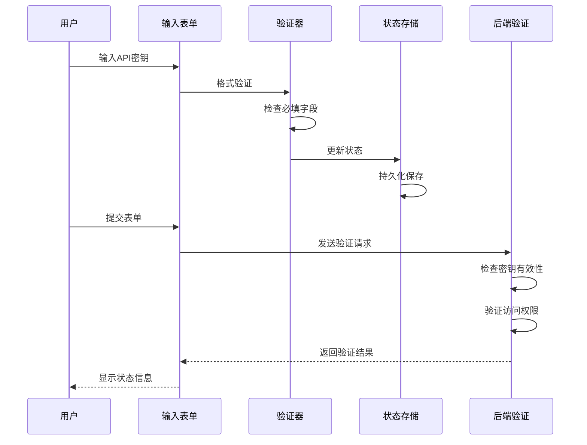

**图表来源**
- [app/components/auth.tsx](file://app/components/auth.tsx#L73-L117)
- [app/api/auth.ts](file://app/api/auth.ts#L27-L130)

### 多服务商密钥管理

系统支持同时管理多个AI服务提供商的密钥：

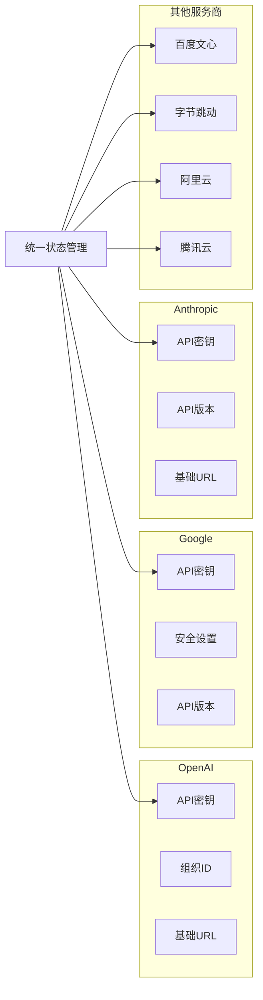

**图表来源**
- [app/store/access.ts](file://app/store/access.tsx#L65-L141)

**章节来源**
- [app/store/access.ts](file://app/store/access.tsx#L65-L141)

## 安全机制

### 认证流程安全

系统实现了严格的认证流程：

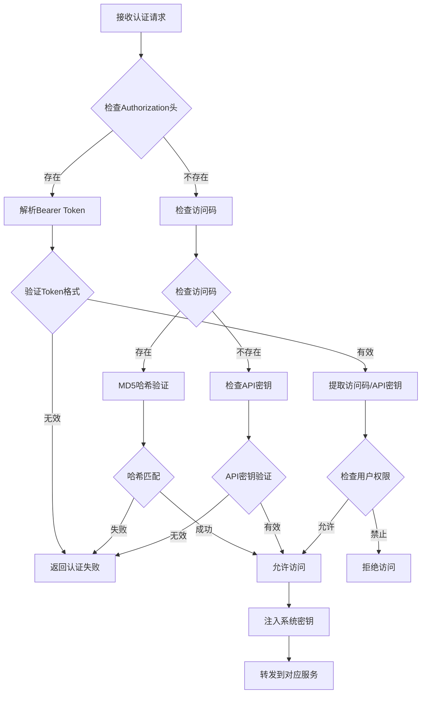

**图表来源**
- [app/api/auth.ts](file://app/api/auth.ts#L27-L130)

### 错误处理机制

系统提供了完善的错误处理：

| 错误类型 | 错误消息 | 处理方式 |
|---------|----------|----------|
| 空访问码 | "empty access code" | 提示用户输入访问码 |
| 错误访问码 | "wrong access code" | 显示访问码错误 |
| API密钥被禁用 | "you are not allowed to access with your own api key" | 禁用用户自定义密钥 |
| 系统密钥缺失 | "admin did not provide an api key" | 使用系统默认密钥 |

**章节来源**
- [app/api/auth.ts](file://app/api/auth.ts#L42-L54)

## 状态管理

### Zustand状态架构

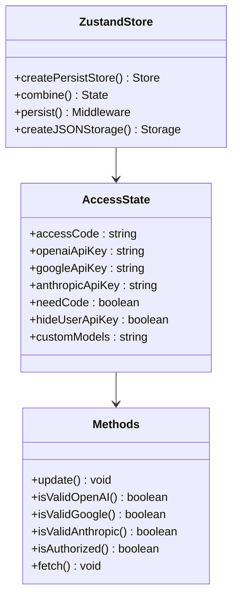

**图表来源**
- [app/store/access.ts](file://app/store/access.tsx#L156-L304)
- [app/utils/store.ts](file://app/utils/store.ts#L29-L79)

### 数据持久化策略

系统采用IndexedDB作为主要存储介质，提供更好的数据持久性和安全性：

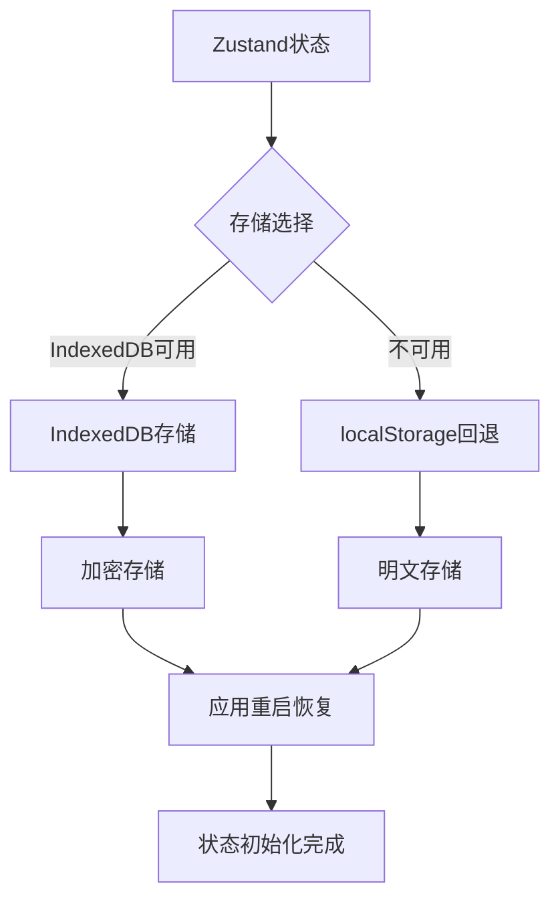

**图表来源**
- [app/utils/indexedDB-storage.ts](file://app/utils/indexedDB-storage.ts#L7-L47)

**章节来源**
- [app/utils/indexedDB-storage.ts](file://app/utils/indexedDB-storage.ts#L7-L47)

## API集成

### 服务提供商API路由

每个AI服务提供商都有专门的API路由处理：

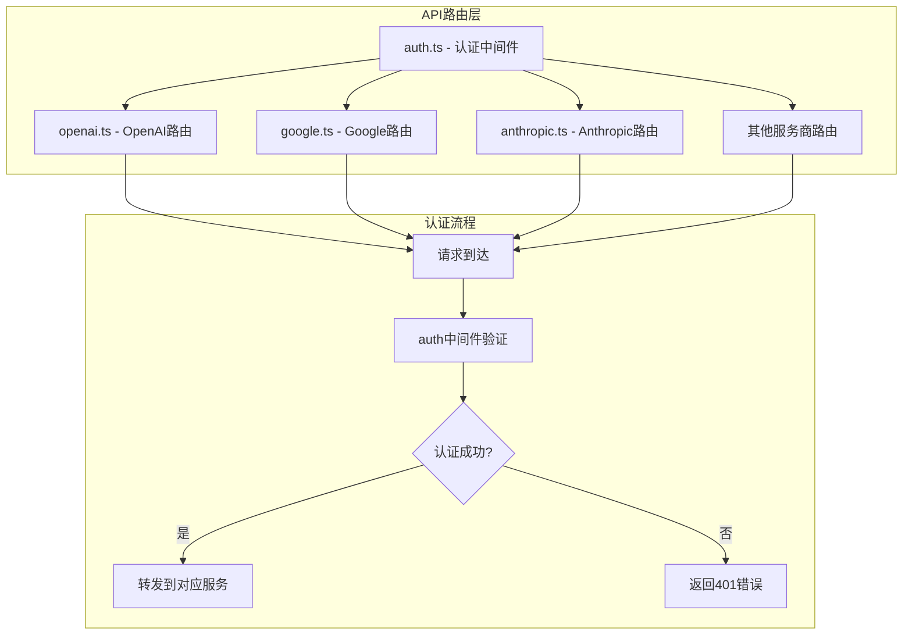

**图表来源**
- [app/api/auth.ts](file://app/api/auth.ts#L27-L130)
- [app/api/openai.ts](file://app/api/openai.ts#L29-L79)
- [app/api/google.ts](file://app/api/google.ts#L9-L134)
- [app/api/anthropic.ts](file://app/api/anthropic.ts#L17-L171)

### 请求转发机制

系统实现了智能的请求转发机制：

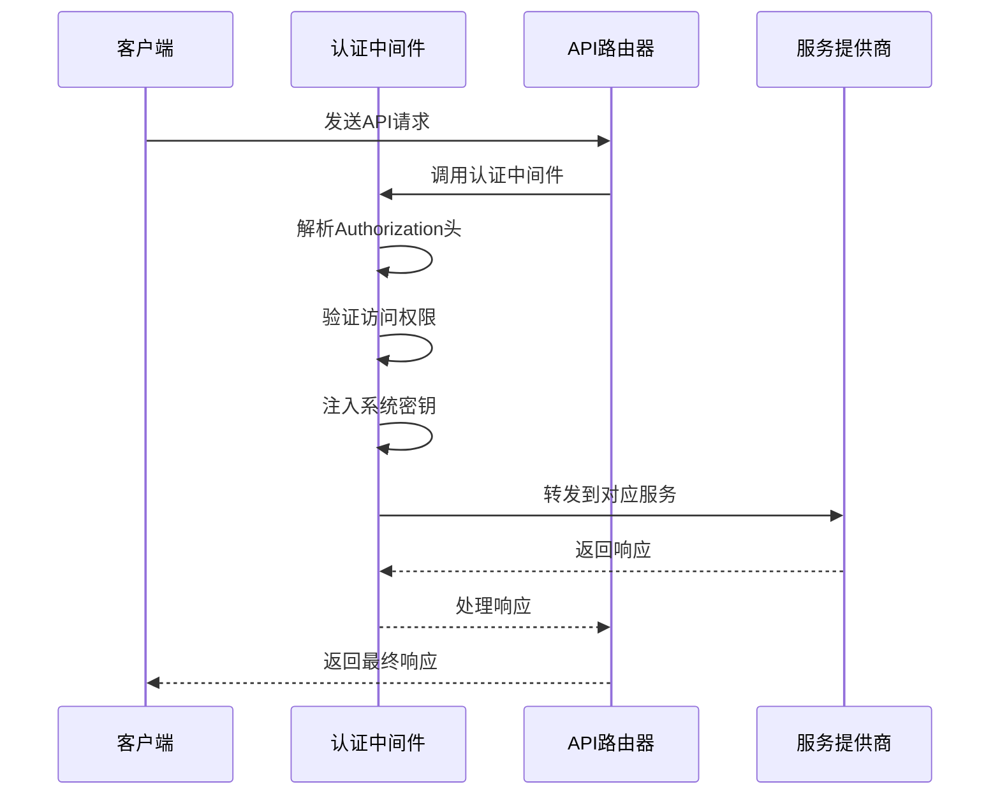

**图表来源**
- [app/api/auth.ts](file://app/api/auth.ts#L56-L129)

**章节来源**
- [app/api/auth.ts](file://app/api/auth.ts#L27-L130)
- [app/api/openai.ts](file://app/api/openai.ts#L29-L79)

## 性能考虑

### 状态更新优化

系统采用了多种性能优化策略：

| 优化技术 | 实现方式 | 性能收益 |
|---------|----------|----------|
| 深拷贝缓存 | deepClone函数 | 避免不必要的重新渲染 |
| 延迟加载 | fetchState状态 | 防止重复API调用 |
| 批量更新 | Zustand批量操作 | 减少状态更新次数 |
| 缓存机制 | IndexedDB持久化 | 提高启动速度 |

### 内存管理

系统实现了智能的内存管理策略：

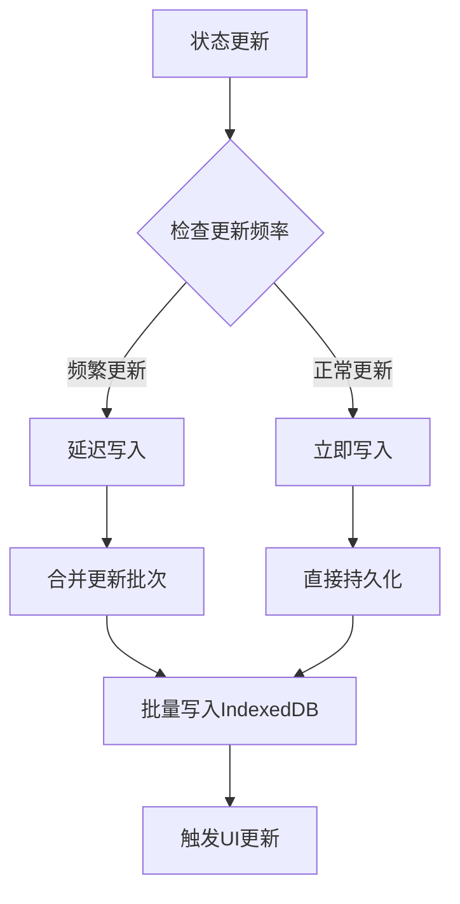

**图表来源**
- [app/utils/clone.ts](file://app/utils/clone.ts#L1-L13)
- [app/utils/store.ts](file://app/utils/store.ts#L61-L67)

## 故障排除指南

### 常见问题诊断

| 问题症状 | 可能原因 | 解决方案 |
|---------|----------|----------|
| 密钥保存失败 | IndexedDB不可用 | 检查浏览器兼容性 |
| 认证失败 | 密钥格式错误 | 验证API密钥格式 |
| 访问被拒绝 | 权限配置问题 | 检查服务器配置 |
| 页面卡死 | 状态更新过频 | 检查状态订阅逻辑 |

### 调试工具

系统提供了丰富的调试功能：

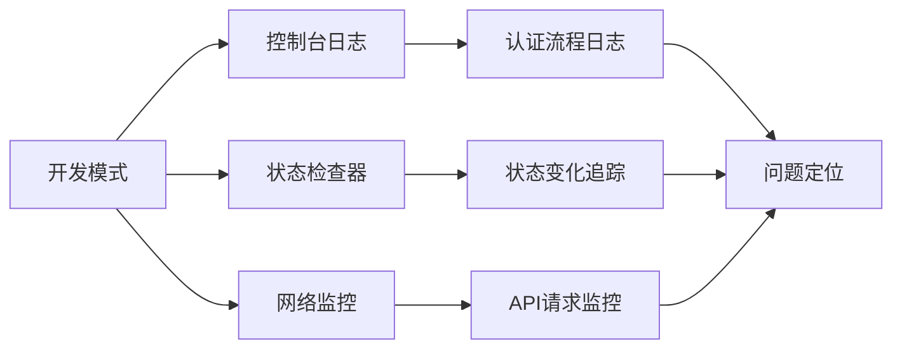

**章节来源**
- [app/api/auth.ts](file://app/api/auth.ts#L35-L40)

## 总结

auth.tsx组件作为ChatGPT-Next-Web项目的核心认证组件，实现了以下关键功能：

1. **统一的密钥管理界面**：为多个AI服务提供商提供一致的密钥输入体验
2. **严格的安全验证**：多层次的密钥验证和权限控制机制
3. **智能的状态管理**：基于Zustand的状态管理，支持持久化存储
4. **灵活的API集成**：支持多种AI服务提供商的API路由
5. **完善的错误处理**：提供详细的错误信息和用户指导

该组件的设计充分考虑了安全性、可扩展性和用户体验，为整个应用提供了可靠的认证基础设施。通过合理的架构设计和安全机制，确保了用户密钥的安全存储和传输，同时提供了良好的开发体验和维护便利性。