# 设置界面组件架构与状态联动机制文档

<cite>
**本文档引用的文件**
- [settings.tsx](file://app/components/settings.tsx)
- [model-config.tsx](file://app/components/model-config.tsx)
- [tts-config.tsx](file://app/components/tts-config.tsx)
- [auth.tsx](file://app/components/auth.tsx)
- [settings.module.scss](file://app/components/settings.module.scss)
- [config.ts](file://app/store/config.ts)
- [access.ts](file://app/store/access.ts)
- [sync.ts](file://app/store/sync.ts)
- [ui-lib.tsx](file://app/components/ui-lib.tsx)
- [constant.ts](file://app/constant.ts)
</cite>

## 目录
1. [概述](#概述)
2. [项目架构](#项目架构)
3. [核心组件分析](#核心组件分析)
4. [状态管理系统](#状态管理系统)
5. [表单验证与错误处理](#表单验证与错误处理)
6. [API同步机制](#api同步机制)
7. [交互细节与用户体验](#交互细节与用户体验)
8. [总结](#总结)

## 概述

ChatGPT-Next-Web的设置界面采用模块化架构设计，通过React组件和Zustand状态管理实现配置项的可视化展示、用户交互和数据持久化。系统包含四个核心组件：设置主面板(settings.tsx)、模型配置(model-config.tsx)、语音合成配置(tts-config.tsx)和身份验证(auth.tsx)，它们通过统一的状态管理模式实现数据同步和状态联动。

## 项目架构

### 组件层次结构

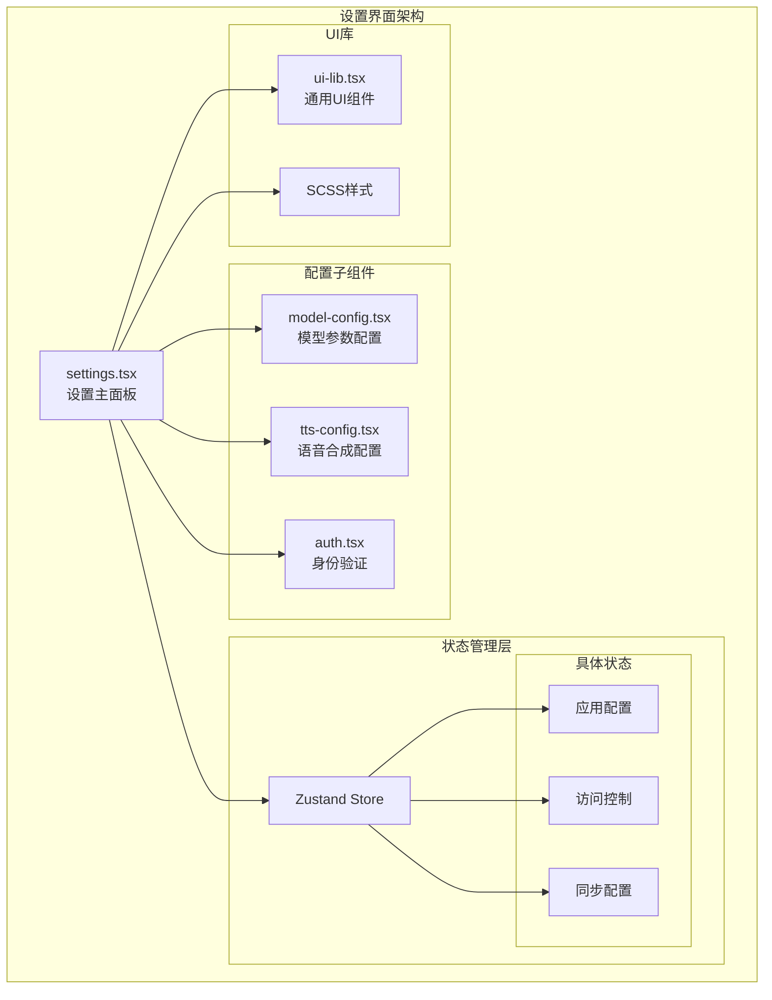

**图表来源**
- [settings.tsx](file://app/components/settings.tsx#L584-L1960)
- [model-config.tsx](file://app/components/model-config.tsx#L12-L274)
- [tts-config.tsx](file://app/components/tts-config.tsx#L13-L134)
- [auth.tsx](file://app/components/auth.tsx#L25-L190)

### 状态管理架构

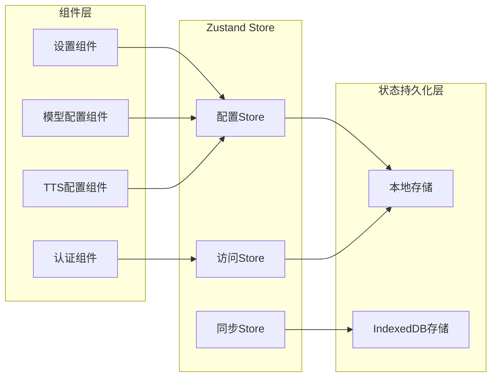

**图表来源**
- [config.ts](file://app/store/config.ts#L164-L262)
- [access.ts](file://app/store/access.ts#L156-L304)
- [sync.ts](file://app/store/sync.ts#L46-L151)

## 核心组件分析

### settings.tsx - 设置主面板

settings.tsx是设置界面的核心组件，负责整体布局、导航逻辑和主要配置项的展示。

#### 主要功能特性

1. **多标签导航系统**
   - 提供清晰的配置分类导航
   - 支持键盘快捷键操作（Escape返回主页）
   - 响应式布局适配不同屏幕尺寸

2. **配置项组织**
   - 访问控制配置
   - 应用偏好设置
   - 同步配置管理
   - 危险操作保护

3. **实时状态监控**
   - 版本更新检查
   - 使用情况查询
   - 连接状态监控

#### 架构设计模式

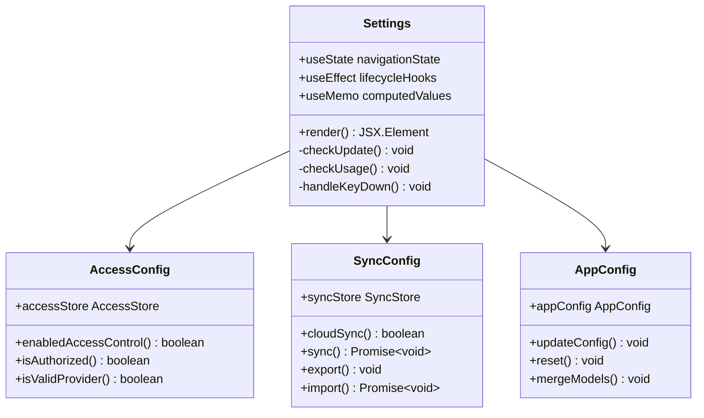

**图表来源**
- [settings.tsx](file://app/components/settings.tsx#L584-L800)

**章节来源**
- [settings.tsx](file://app/components/settings.tsx#L584-L1960)

### model-config.tsx - 模型参数配置

model-config.tsx专门负责大语言模型参数的可视化配置和验证。

#### 配置参数体系

| 参数类型 | 配置项 | 数据范围 | 默认值 | 验证规则 |
|---------|--------|----------|--------|----------|
| 基础参数 | 模型选择 | 多提供商模型 | gpt-4o-mini | 必填验证 |
| 温度控制 | temperature | 0.0-2.0 | 0.5 | 数值限制 |
| 采样策略 | top_p | 0.0-1.0 | 1.0 | 概率验证 |
| 上下文长度 | max_tokens | 1024-512000 | 4000 | 范围验证 |
| 频率惩罚 | frequency_penalty | -2.0-2.0 | 0.0 | 数值限制 |
| 存在惩罚 | presence_penalty | -2.0-2.0 | 0.0 | 数值限制 |

#### 可视化配置流程

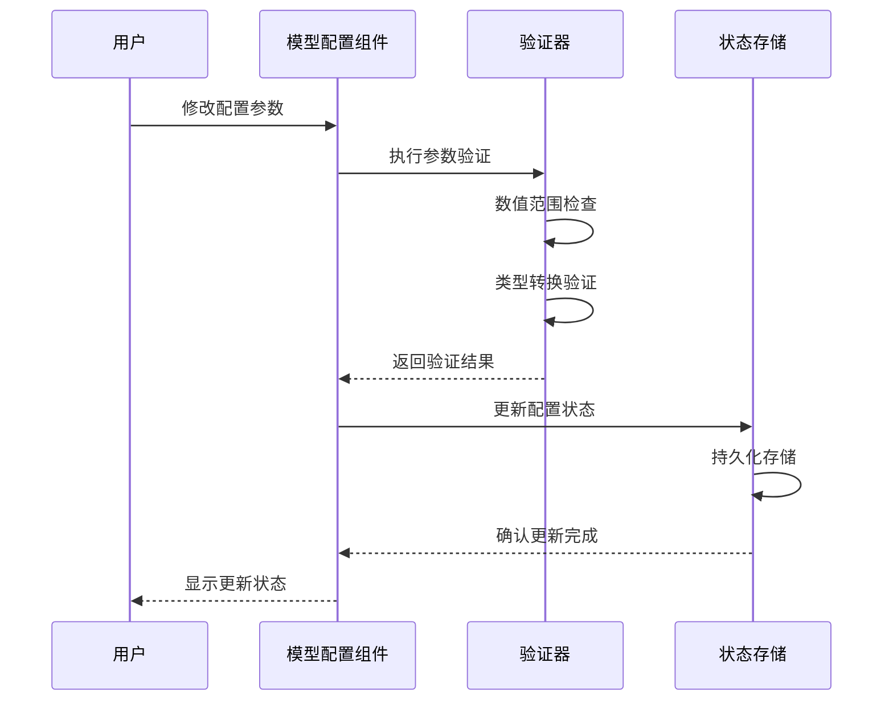

**图表来源**
- [model-config.tsx](file://app/components/model-config.tsx#L26-L274)
- [config.ts](file://app/store/config.ts#L143-L162)

**章节来源**
- [model-config.tsx](file://app/components/model-config.tsx#L12-L274)

### tts-config.tsx - 语音合成配置

tts-config.tsx实现了语音合成功能的配置管理，支持多种TTS引擎和语音选项。

#### 引擎支持矩阵

| 引擎类型 | 支持模型 | 语音选项 | 速度范围 | 特殊功能 |
|---------|----------|----------|----------|----------|
| Edge TTS | 默认模型 | 多种方言 | 0.3-4.0 | 实时合成 |
| 其他引擎 | 自定义模型 | 语音库选择 | 0.5-2.0 | 音质调节 |

#### 配置联动机制

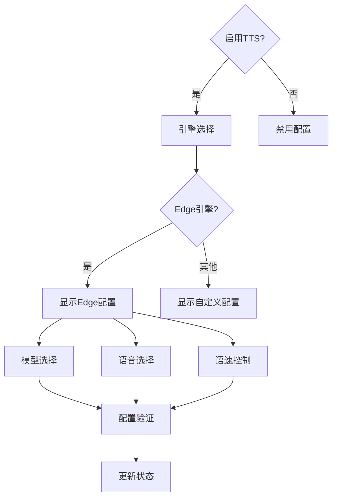

**图表来源**
- [tts-config.tsx](file://app/components/tts-config.tsx#L13-L134)

**章节来源**
- [tts-config.tsx](file://app/components/tts-config.tsx#L13-L134)

### auth.tsx - 身份验证组件

auth.tsx负责API密钥管理和身份验证流程，提供安全的访问控制。

#### 认证流程架构

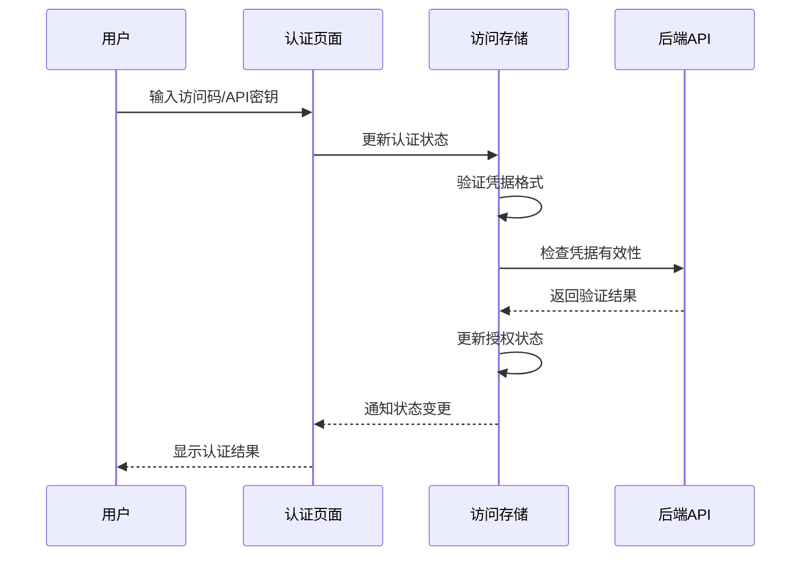

**图表来源**
- [auth.tsx](file://app/components/auth.tsx#L25-L190)
- [access.ts](file://app/store/access.ts#L229-L250)

#### 安全特性

1. **凭据隔离**：访问码与API密钥分离管理
2. **动态验证**：实时验证凭据有效性
3. **会话管理**：自动清理敏感信息
4. **权限控制**：基于凭据的访问级别

**章节来源**
- [auth.tsx](file://app/components/auth.tsx#L25-L190)

## 状态管理系统

### Zustand Store架构

系统采用Zustand作为状态管理解决方案，提供类型安全和开发体验优化。

#### Store类型定义

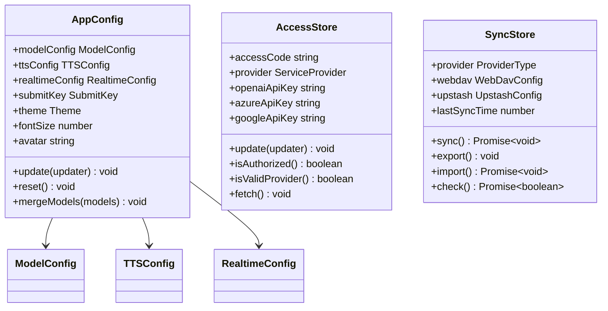

**图表来源**
- [config.ts](file://app/store/config.ts#L108-L114)
- [access.ts](file://app/store/access.ts#L156-L304)
- [sync.ts](file://app/store/sync.ts#L46-L151)

### 状态同步机制

#### 数据流图

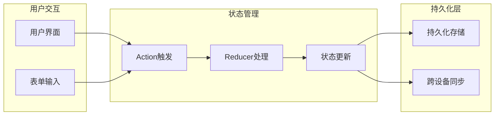

**图表来源**
- [config.ts](file://app/store/config.ts#L164-L262)

**章节来源**
- [config.ts](file://app/store/config.ts#L164-L262)
- [access.ts](file://app/store/access.ts#L156-L304)
- [sync.ts](file://app/store/sync.ts#L46-L151)

## 表单验证与错误处理

### 验证器系统

系统实现了多层次的表单验证机制，确保数据完整性和用户体验。

#### 验证流程

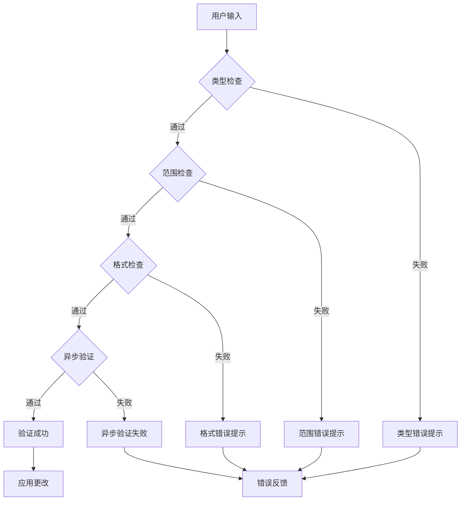

**图表来源**
- [config.ts](file://app/store/config.ts#L143-L162)

### 错误反馈机制

#### 错误处理层级

1. **即时验证**：输入时实时反馈
2. **提交验证**：表单提交时全面检查
3. **异步验证**：网络请求后的状态检查
4. **持久化验证**：存储前的数据完整性检查

**章节来源**
- [config.ts](file://app/store/config.ts#L143-L162)
- [model-config.tsx](file://app/components/model-config.tsx#L26-L274)

## API同步机制

### 同步配置管理

系统支持多种云服务提供商的配置同步，包括WebDAV和UpStash。

#### 同步流程

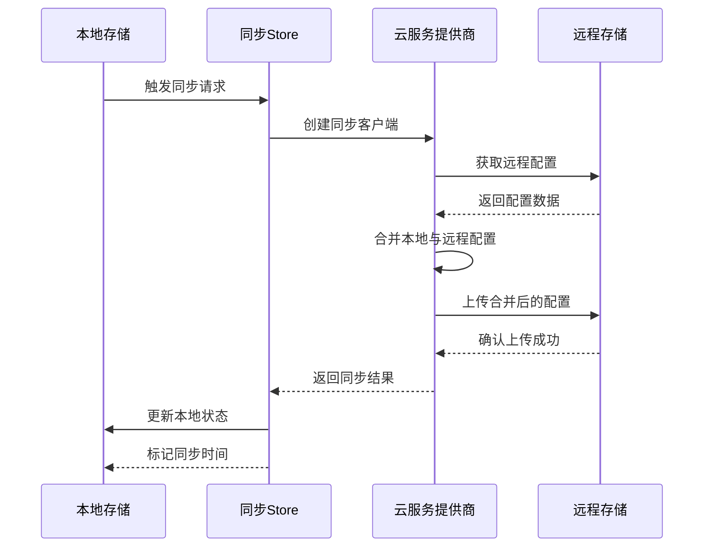

**图表来源**
- [sync.ts](file://app/store/sync.ts#L91-L120)

### 数据一致性保证

#### 冲突解决策略

1. **时间戳优先**：基于最后修改时间确定权威版本
2. **增量合并**：仅合并冲突字段，保留非冲突数据
3. **备份恢复**：提供导入导出功能进行数据恢复
4. **版本迁移**：自动处理配置格式升级

**章节来源**
- [sync.ts](file://app/store/sync.ts#L46-L151)

## 交互细节与用户体验

### 组件间通信

#### 状态联动机制

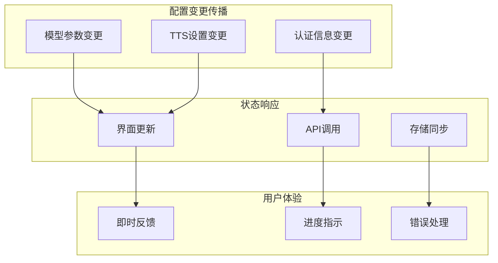

**图表来源**
- [settings.tsx](file://app/components/settings.tsx#L584-L800)

### 用户体验优化

#### 交互设计原则

1. **渐进式披露**：按重要性展示配置选项
2. **即时反馈**：配置变更立即反映到界面
3. **错误预防**：通过验证避免无效配置
4. **操作确认**：对危险操作提供二次确认
5. **无障碍支持**：完整的键盘导航和屏幕阅读器支持

#### 样式系统

组件使用SCSS模块化样式，支持主题切换和响应式设计：

- **变量系统**：统一的颜色、间距和字体变量
- **主题适配**：深色/浅色主题自动切换
- **响应式布局**：移动端友好界面设计
- **动画效果**：平滑的过渡动画和状态变化

**章节来源**
- [settings.module.scss](file://app/components/settings.module.scss#L1-L81)
- [ui-lib.tsx](file://app/components/ui-lib.tsx#L1-L200)

## 总结

ChatGPT-Next-Web的设置界面组件展现了现代前端应用的最佳实践：

1. **模块化架构**：清晰的组件分离和职责划分
2. **状态管理**：基于Zustand的高效状态管理
3. **类型安全**：完整的TypeScript类型定义
4. **用户体验**：注重交互细节和错误处理
5. **可扩展性**：支持多种配置场景和未来扩展

这套组件架构不仅满足了当前的功能需求，还为未来的功能扩展和性能优化奠定了坚实基础。通过合理的抽象和封装，开发者可以轻松维护和扩展设置界面的各项功能。