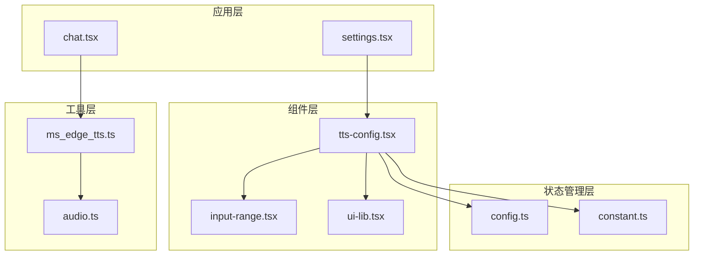
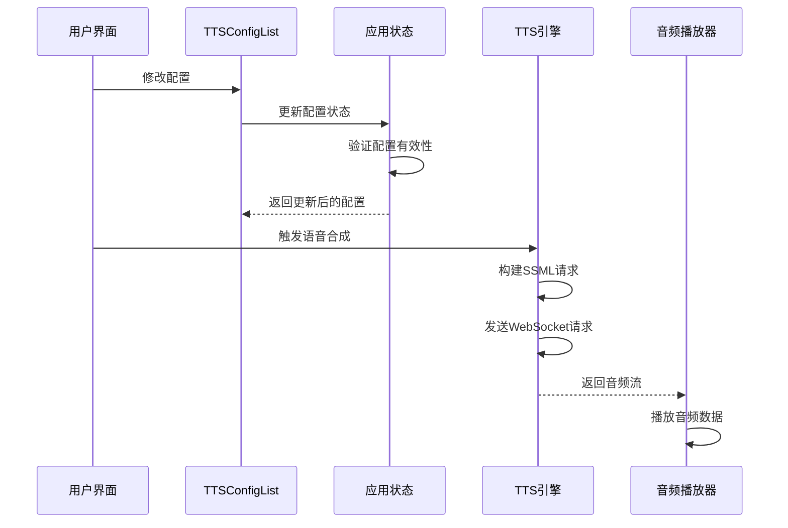
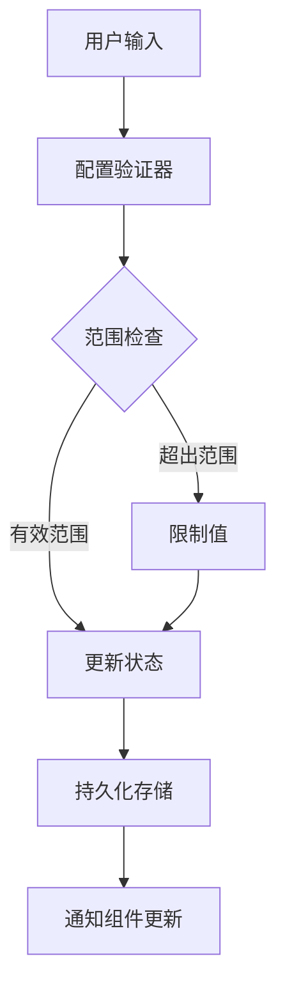
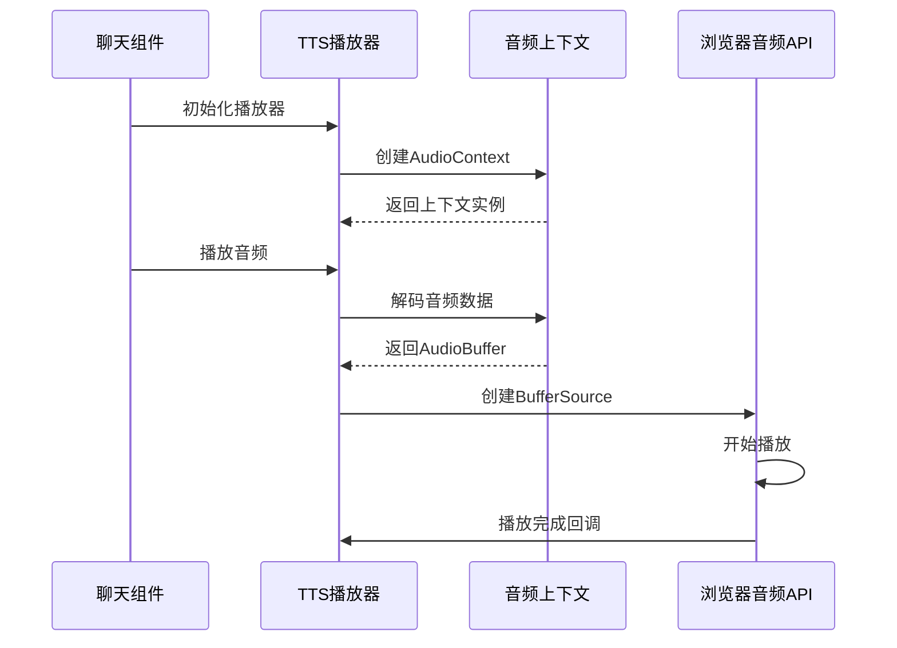
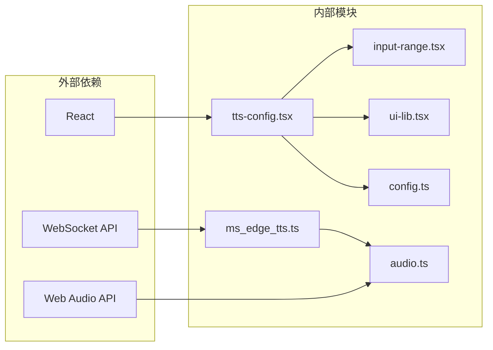

# 语音合成配置组件

<cite>
**本文档引用的文件**
- [tts-config.tsx](file://app/components/tts-config.tsx)
- [ms_edge_tts.ts](file://app/utils/ms_edge_tts.ts)
- [audio.ts](file://app/lib/audio.ts)
- [config.ts](file://app/store/config.ts)
- [constant.ts](file://app/constant.ts)
- [input-range.tsx](file://app/components/input-range.tsx)
- [ui-lib.tsx](file://app/components/ui-lib.tsx)
- [settings.tsx](file://app/components/settings.tsx)
- [chat.tsx](file://app/components/chat.tsx)
- [audio.ts](file://app/utils/audio.ts)
</cite>

## 目录
1. [简介](#简介)
2. [项目结构](#项目结构)
3. [核心组件](#核心组件)
4. [架构概览](#架构概览)
5. [详细组件分析](#详细组件分析)
6. [依赖关系分析](#依赖关系分析)
7. [性能考虑](#性能考虑)
8. [故障排除指南](#故障排除指南)
9. [结论](#结论)

## 简介

tts-config.tsx组件是ChatGPT-Next-Web语音合成功能的核心配置界面，负责提供用户友好的语音输出设置选项。该组件实现了语音角色选择、语速调节、音量控制等功能，并与MS Edge TTS服务进行深度集成，为用户提供高质量的语音合成体验。

该组件采用React函数式组件设计，通过状态管理机制与应用配置层紧密耦合，支持多种TTS引擎（OpenAI-TTS和Edge-TTS），并提供了完整的错误处理和用户体验优化。

## 项目结构

语音合成配置系统采用模块化架构，主要文件组织如下：



**图表来源**
- [tts-config.tsx](file://app/components/tts-config.tsx#L1-L134)
- [ms_edge_tts.ts](file://app/utils/ms_edge_tts.ts#L1-L392)
- [audio.ts](file://app/lib/audio.ts#L1-L201)

**章节来源**
- [tts-config.tsx](file://app/components/tts-config.tsx#L1-L134)
- [ms_edge_tts.ts](file://app/utils/ms_edge_tts.ts#L1-L392)

## 核心组件

### TTSConfigList 组件

TTSConfigList是语音合成配置的主要容器组件，负责渲染所有语音设置选项。该组件接收两个主要属性：`ttsConfig`（当前配置）和`updateConfig`（配置更新函数）。

#### 主要功能特性

1. **启用/禁用控制**：提供语音合成功能的开关控制
2. **引擎选择**：支持OpenAI-TTS和Edge-TTS两种引擎
3. **模型配置**：针对不同引擎的模型选择
4. **语音角色选择**：提供多种预设语音角色
5. **语速调节**：精确到小数点后一位的速度控制
6. **条件渲染**：根据引擎类型动态显示相关配置项

#### 配置项映射表

| 配置项 | 类型 | 默认值 | 取值范围 |
|--------|------|--------|----------|
| enable | boolean | false | true/false |
| engine | string | "OpenAI-TTS" | "OpenAI-TTS", "Edge-TTS" |
| model | string | "tts-1" | "tts-1", "tts-1-hd" |
| voice | string | "alloy" | "alloy", "echo", "fable", "onyx", "nova", "shimmer" |
| speed | number | 1.0 | 0.25-4.0 |

**章节来源**
- [tts-config.tsx](file://app/components/tts-config.tsx#L13-L133)
- [config.ts](file://app/store/config.ts#L86-L93)

## 架构概览

语音合成配置系统采用分层架构设计，确保各组件间的松耦合和高内聚：



**图表来源**
- [tts-config.tsx](file://app/components/tts-config.tsx#L25-L30)
- [ms_edge_tts.ts](file://app/utils/ms_edge_tts.ts#L334-L337)
- [audio.ts](file://app/utils/audio.ts#L1-L45)

## 详细组件分析

### 输入范围组件（InputRange）

InputRange组件提供了语速调节的滑块控件，支持精确到小数点后一位的数值调整。

#### 组件特性

- **无障碍支持**：提供aria标签确保屏幕阅读器兼容性
- **范围验证**：自动限制输入值在有效范围内
- **实时反馈**：即时显示当前设置值
- **样式定制**：支持自定义CSS类名

#### 使用示例

```typescript
<InputRange
  aria="语速调节"
  value={props.ttsConfig.speed?.toFixed(1)}
  min="0.3"
  max="4.0"
  step="0.1"
  onChange={(e) => {
    props.updateConfig(
      (config) => (config.speed = TTSConfigValidator.speed(
        e.currentTarget.valueAsNumber
      ))
    );
  }}
/>
```

**章节来源**
- [input-range.tsx](file://app/components/input-range.tsx#L16-L42)

### MS Edge TTS 集成

MS Edge TTS类提供了与微软边缘浏览器TTS服务的完整集成，支持实时语音合成和流媒体播放。

#### 核心功能模块

1. **连接管理**：自动处理WebSocket连接和重连逻辑
2. **元数据配置**：设置语音角色、语言和地区信息
3. **SSML模板**：生成符合标准的语音合成标记语言
4. **音频流处理**：实时处理和传输音频数据流

#### 音频格式支持

| 格式 | 质量 | 适用场景 |
|------|------|----------|
| audio-24khz-48kbitrate-mono-mp3 | 中等 | 通用场景 |
| audio-24khz-96kbitrate-mono-mp3 | 高质量 | 需要更好音质的场景 |
| webm-24kHZ-16bit-mono-opus | 压缩格式 | 存储空间敏感场景 |

**章节来源**
- [ms_edge_tts.ts](file://app/utils/ms_edge_tts.ts#L119-L392)

### 状态管理与验证

配置状态通过专门的验证器进行管理，确保用户输入的有效性和应用的一致性。

#### 验证规则

```typescript
export const TTSConfigValidator = {
  engine(x: string) { return x as TTSEngineType; },
  model(x: string) { return x as TTSModelType; },
  voice(x: string) { return x as TTSVoiceType; },
  speed(x: number) { return limitNumber(x, 0.25, 4.0, 1.0); }
};
```

#### 数据流图



**图表来源**
- [config.ts](file://app/store/config.ts#L128-L141)

**章节来源**
- [config.ts](file://app/store/config.ts#L128-L141)

### 音频播放器集成

音频播放功能通过专门的播放器类实现，支持实时音频播放和停止控制。

#### 播放器接口

```typescript
type TTSPlayer = {
  init: () => void;
  play: (audioBuffer: ArrayBuffer, onended: () => void | null) => Promise<void>;
  stop: () => void;
};
```

#### 播放流程



**图表来源**
- [audio.ts](file://app/utils/audio.ts#L1-L45)

**章节来源**
- [audio.ts](file://app/utils/audio.ts#L1-L45)

## 依赖关系分析

语音合成配置系统的依赖关系呈现清晰的层次结构：



**图表来源**
- [tts-config.tsx](file://app/components/tts-config.tsx#L1-L12)
- [ms_edge_tts.ts](file://app/utils/ms_edge_tts.ts#L1-L5)

### 关键依赖说明

1. **React生态系统**：提供组件化开发框架
2. **WebSocket协议**：实现实时语音合成通信
3. **Web Audio API**：处理音频播放和处理
4. **本地化系统**：支持多语言界面文本

**章节来源**
- [tts-config.tsx](file://app/components/tts-config.tsx#L1-L12)
- [ms_edge_tts.ts](file://app/utils/ms_edge_tts.ts#L1-L5)

## 性能考虑

### 优化策略

1. **懒加载**：TTS功能按需初始化，减少初始加载时间
2. **连接复用**：WebSocket连接保持长连接，避免频繁重建
3. **内存管理**：及时释放音频缓冲区和播放器资源
4. **防抖处理**：配置变更采用防抖机制，减少不必要的API调用

### 错误处理机制

系统实现了多层次的错误处理：

- **网络错误**：自动重试机制和降级策略
- **配置错误**：输入验证和默认值回退
- **播放错误**：静默失败和用户提示

## 故障排除指南

### 常见问题及解决方案

1. **语音合成不工作**
   - 检查TTS功能是否启用
   - 验证API密钥配置
   - 确认网络连接状态

2. **音频播放异常**
   - 检查浏览器音频权限
   - 验证音频格式支持
   - 确认音频上下文状态

3. **配置保存失败**
   - 检查本地存储权限
   - 验证配置格式正确性
   - 确认应用状态同步

**章节来源**
- [ms_edge_tts.ts](file://app/utils/ms_edge_tts.ts#L150-L159)
- [audio.ts](file://app/utils/audio.ts#L31-L41)

## 结论

tts-config.tsx组件作为语音合成功能的核心配置界面，成功实现了以下目标：

1. **用户友好性**：提供直观的语音设置界面，支持多种配置选项
2. **技术先进性**：采用现代Web技术栈，支持实时语音合成
3. **可扩展性**：模块化设计便于添加新的TTS引擎和服务
4. **可靠性**：完善的错误处理和降级机制确保系统稳定性

该组件不仅满足了当前的语音合成需求，还为未来的功能扩展和技术升级奠定了坚实基础。通过合理的架构设计和严格的质量控制，确保了系统的高性能和良好的用户体验。