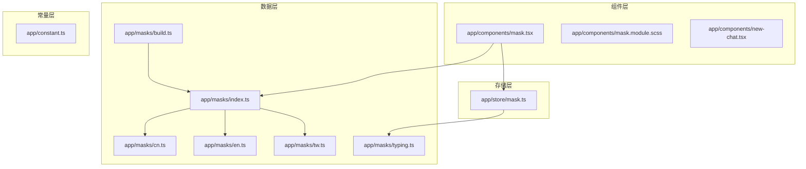
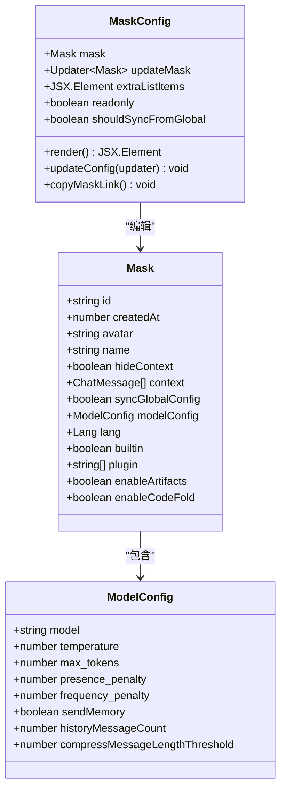
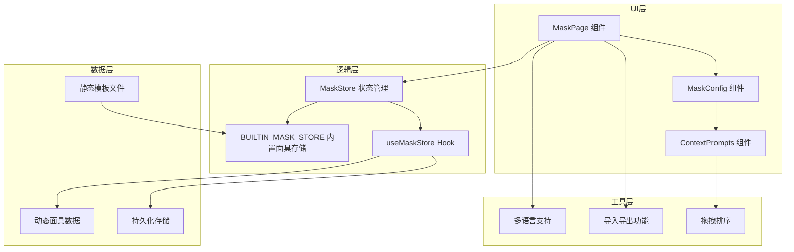
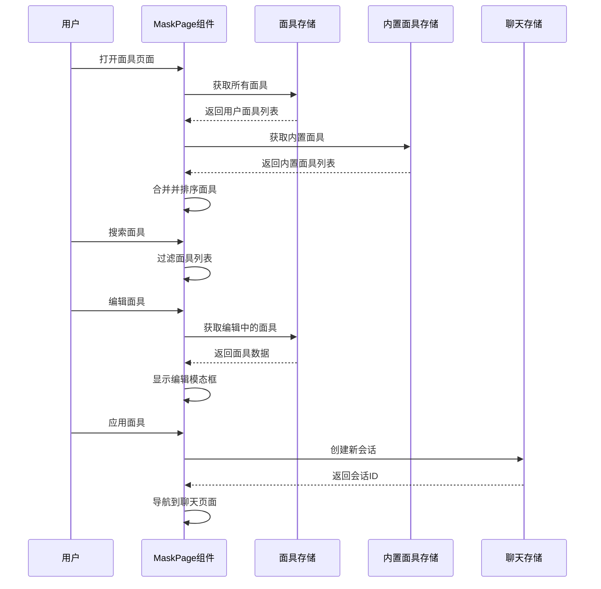
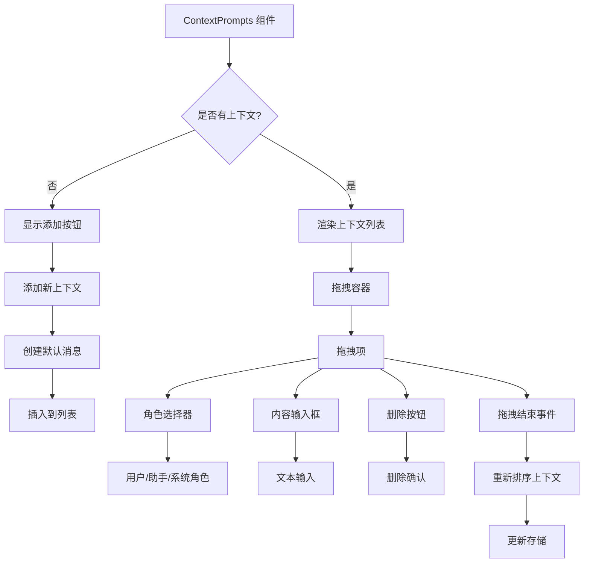
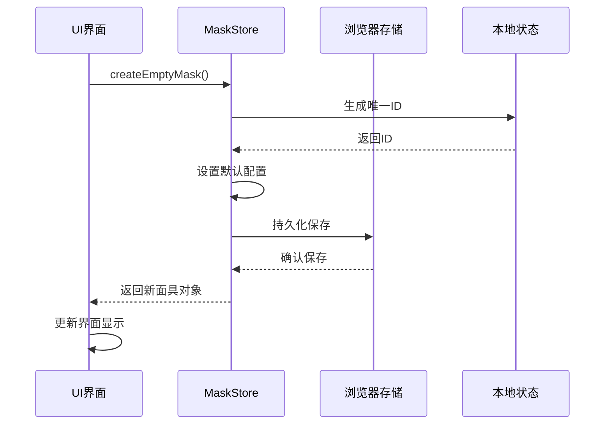
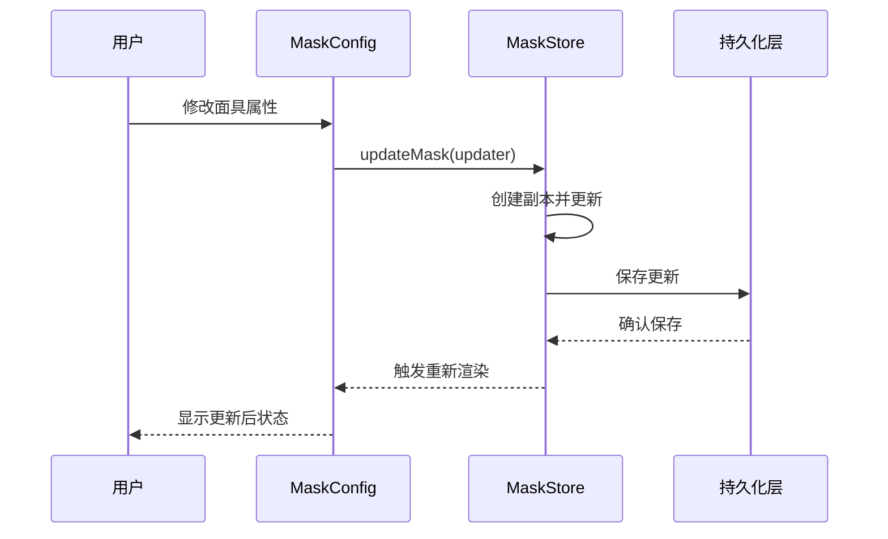
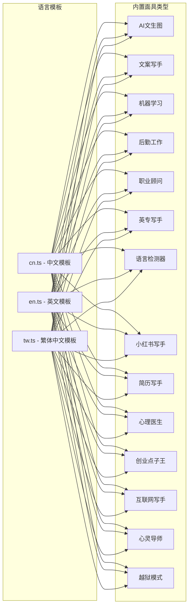
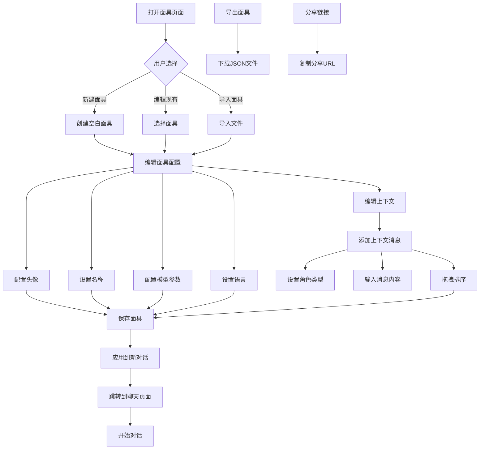
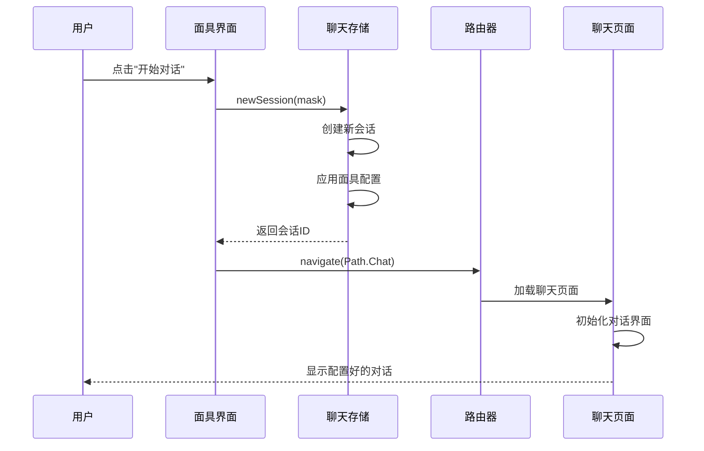

# 面具系统组件

<cite>
**本文档引用的文件**
- [app/components/mask.tsx](file://app/components/mask.tsx)
- [app/masks/index.ts](file://app/masks/index.ts)
- [app/masks/cn.ts](file://app/masks/cn.ts)
- [app/masks/en.ts](file://app/masks/en.ts)
- [app/masks/tw.ts](file://app/masks/tw.ts)
- [app/masks/typing.ts](file://app/masks/typing.ts)
- [app/masks/build.ts](file://app/masks/build.ts)
- [app/store/mask.ts](file://app/store/mask.ts)
- [app/constant.ts](file://app/constant.ts)
- [app/components/new-chat.tsx](file://app/components/new-chat.tsx)
</cite>

## 目录
1. [简介](#简介)
2. [项目结构](#项目结构)
3. [核心组件](#核心组件)
4. [架构概览](#架构概览)
5. [详细组件分析](#详细组件分析)
6. [数据流分析](#数据流分析)
7. [多语言支持](#多语言支持)
8. [用户工作流](#用户工作流)
9. [性能考虑](#性能考虑)
10. [故障排除指南](#故障排除指南)
11. [结论](#结论)

## 简介

面具系统（Mask System）是ChatGPT Next Web项目中的核心功能模块，它提供了一套完整的预设角色模板管理系统。该系统允许用户快速选择预定义的角色配置，自定义系统提示词，配置模型参数，并支持多语言本地化。面具系统通过统一的UI界面和灵活的数据结构，为用户提供了一个强大而直观的角色扮演和对话配置工具。

## 项目结构

面具系统的文件组织结构清晰，主要分布在以下几个关键目录中：

**图表来源**
- [app/components/mask.tsx](file://app/components/mask.tsx#L1-L50)
- [app/masks/index.ts](file://app/masks/index.ts#L1-L39)
- [app/store/mask.ts](file://app/store/mask.ts#L1-L50)

**章节来源**
- [app/components/mask.tsx](file://app/components/mask.tsx#L1-L100)
- [app/masks/index.ts](file://app/masks/index.ts#L1-L39)
- [app/store/mask.ts](file://app/store/mask.ts#L1-L139)

## 核心组件

### MaskConfig 组件

MaskConfig 是面具配置的核心组件，负责展示和编辑面具的各项配置：

**图表来源**
- [app/components/mask.tsx](file://app/components/mask.tsx#L67-L257)
- [app/store/mask.ts](file://app/store/mask.ts#L9-L23)

### 面具数据结构

面具系统使用统一的数据结构来表示所有类型的面具配置：

| 字段名 | 类型 | 描述 | 默认值 |
|--------|------|------|--------|
| id | string | 面具唯一标识符 | 自动生成 |
| createdAt | number | 创建时间戳 | 当前时间 |
| avatar | string | 头像图标 | "gpt-bot" |
| name | string | 面具名称 | "新对话" |
| hideContext | boolean | 是否隐藏上下文 | false |
| context | ChatMessage[] | 对话上下文数组 | [] |
| syncGlobalConfig | boolean | 是否同步全局配置 | true |
| modelConfig | ModelConfig | 模型配置对象 | 全局配置 |
| lang | Lang | 语言标识 | 当前语言 |
| builtin | boolean | 是否为内置面具 | false |
| plugin | string[] | 插件列表 | [] |
| enableArtifacts | boolean | 是否启用制品 | false |
| enableCodeFold | boolean | 是否启用代码折叠 | false |

**章节来源**
- [app/store/mask.ts](file://app/store/mask.ts#L9-L23)
- [app/components/mask.tsx](file://app/components/mask.tsx#L67-L257)

## 架构概览

面具系统采用分层架构设计，确保了良好的可维护性和扩展性：

**图表来源**
- [app/components/mask.tsx](file://app/components/mask.tsx#L442-L682)
- [app/store/mask.ts](file://app/store/mask.ts#L49-L138)
- [app/masks/index.ts](file://app/masks/index.ts#L8-L38)

## 详细组件分析

### MaskPage 主页面组件

MaskPage 是面具管理的主要界面，提供了完整的面具浏览、搜索、创建和编辑功能：

**图表来源**
- [app/components/mask.tsx](file://app/components/mask.tsx#L442-L682)
- [app/store/mask.ts](file://app/store/mask.ts#L88-L104)

### ContextPrompts 上下文提示组件

ContextPrompts 组件负责管理面具的对话上下文，支持拖拽排序和动态编辑：

**图表来源**
- [app/components/mask.tsx](file://app/components/mask.tsx#L260-L439)
- [app/components/mask.tsx](file://app/components/mask.tsx#L61-L66)

**章节来源**
- [app/components/mask.tsx](file://app/components/mask.tsx#L260-L439)
- [app/components/mask.tsx](file://app/components/mask.tsx#L442-L682)

## 数据流分析

### 面具创建流程

面具创建涉及多个组件间的协调工作：

**图表来源**
- [app/store/mask.ts](file://app/store/mask.ts#L35-L47)
- [app/store/mask.ts](file://app/store/mask.ts#L53-L66)

### 面具编辑流程

面具编辑采用响应式更新机制：

**图表来源**
- [app/store/mask.ts](file://app/store/mask.ts#L68-L76)
- [app/components/mask.tsx](file://app/components/mask.tsx#L85-L95)

**章节来源**
- [app/store/mask.ts](file://app/store/mask.ts#L53-L76)
- [app/components/mask.tsx](file://app/components/mask.tsx#L85-L95)

## 多语言支持

面具系统提供了完整的多语言支持，涵盖中文、英文和繁体中文三种语言：

### 语言模板结构

**图表来源**
- [app/masks/cn.ts](file://app/masks/cn.ts#L3-L446)
- [app/masks/en.ts](file://app/masks/en.ts#L3-L135)
- [app/masks/tw.ts](file://app/masks/tw.ts#L3-L446)

### 语言切换机制

系统通过浏览器环境检测和动态加载实现语言切换：

| 语言标识 | 文件路径 | 支持的面具数量 |
|----------|----------|----------------|
| cn | app/masks/cn.ts | 13个内置面具 |
| en | app/masks/en.ts | 4个内置面具 |
| tw | app/masks/tw.ts | 13个内置面具 |

**章节来源**
- [app/masks/cn.ts](file://app/masks/cn.ts#L1-L446)
- [app/masks/en.ts](file://app/masks/en.ts#L1-L135)
- [app/masks/tw.ts](file://app/masks/tw.ts#L1-L446)
- [app/masks/index.ts](file://app/masks/index.ts#L24-L38)

## 用户工作流

### 完整的面具使用工作流

面具系统为用户提供了从创建到应用的完整工作流程：

**图表来源**
- [app/components/mask.tsx](file://app/components/mask.tsx#L442-L682)
- [app/components/mask.tsx](file://app/components/mask.tsx#L476-L498)

### 面具应用流程

当用户选择某个面具时，系统会自动创建基于该面具配置的新对话会话：

**图表来源**
- [app/components/mask.tsx](file://app/components/mask.tsx#L600-L606)
- [app/constant.ts](file://app/constant.ts#L44-L56)

**章节来源**
- [app/components/mask.tsx](file://app/components/mask.tsx#L442-L682)
- [app/components/mask.tsx](file://app/components/mask.tsx#L600-L606)

## 性能考虑

### 面具加载优化

系统采用了多种优化策略来提升性能：

1. **懒加载机制**：内置面具通过异步加载，避免一次性加载所有模板
2. **虚拟滚动**：大量面具时使用虚拟滚动技术
3. **缓存策略**：面具配置数据会被缓存到浏览器存储
4. **按需渲染**：只有可见的面具才会被渲染

### 内存管理

- 使用 `createPersistStore` 实现状态持久化
- 面具数据采用深拷贝避免意外修改
- 提供清理机制释放不再使用的面具数据

## 故障排除指南

### 常见问题及解决方案

| 问题类型 | 症状 | 可能原因 | 解决方案 |
|----------|------|----------|----------|
| 面具加载失败 | 页面空白或错误 | 网络请求失败 | 检查网络连接，刷新页面 |
| 面具丢失 | 面具列表为空 | 本地存储损坏 | 清除浏览器缓存，重新加载 |
| 导入失败 | 无法导入面具文件 | 文件格式错误 | 检查JSON格式，确保包含必需字段 |
| 语言切换失效 | 面具语言不正确 | 语言检测失败 | 手动选择目标语言 |
| 上下文编辑异常 | 拖拽或编辑无效 | 组件状态异常 | 刷新页面重试 |

### 调试工具

系统提供了多种调试和诊断功能：

- **控制台日志**：记录面具操作的关键步骤
- **状态检查**：查看当前面具存储的状态
- **网络监控**：跟踪面具数据的加载过程
- **错误边界**：防止单个组件错误影响整体功能

**章节来源**
- [app/components/mask.tsx](file://app/components/mask.tsx#L1-L50)
- [app/store/mask.ts](file://app/store/mask.ts#L119-L138)

## 结论

面具系统作为ChatGPT Next Web的核心功能模块，成功实现了以下目标：

1. **统一的用户体验**：提供了一致且直观的面具管理界面
2. **灵活的配置能力**：支持复杂的对话上下文和模型参数配置
3. **多语言本地化**：完整支持中文、英文和繁体中文
4. **高性能设计**：采用优化的加载和渲染策略
5. **可扩展架构**：便于添加新的面具类型和功能

该系统不仅提升了用户的使用体验，也为开发者提供了清晰的扩展接口。通过合理的分层设计和模块化架构，面具系统展现了现代Web应用开发的最佳实践。