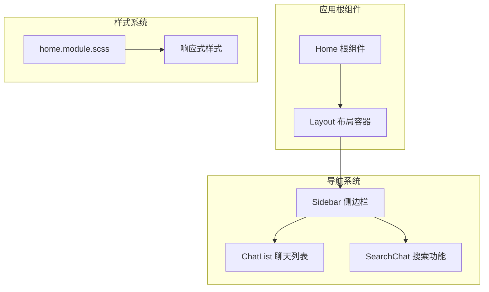
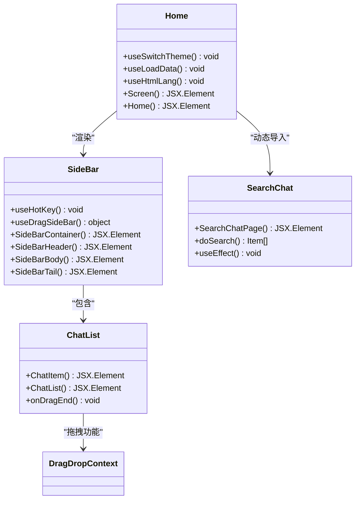
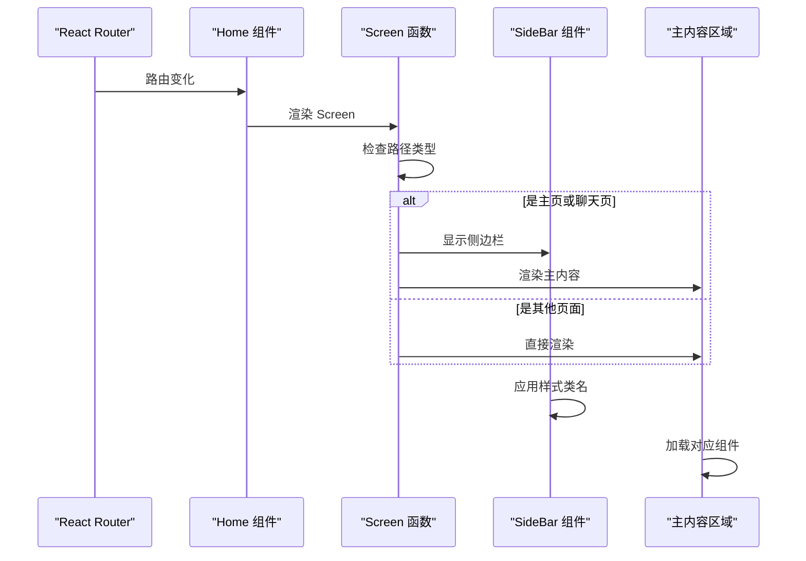
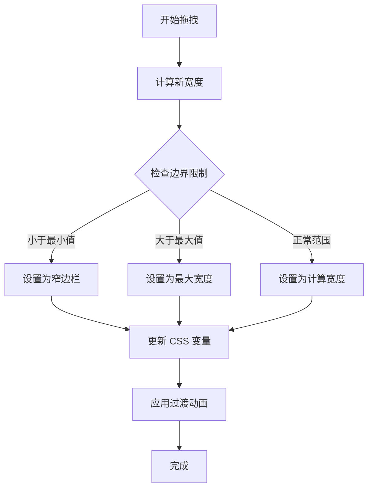
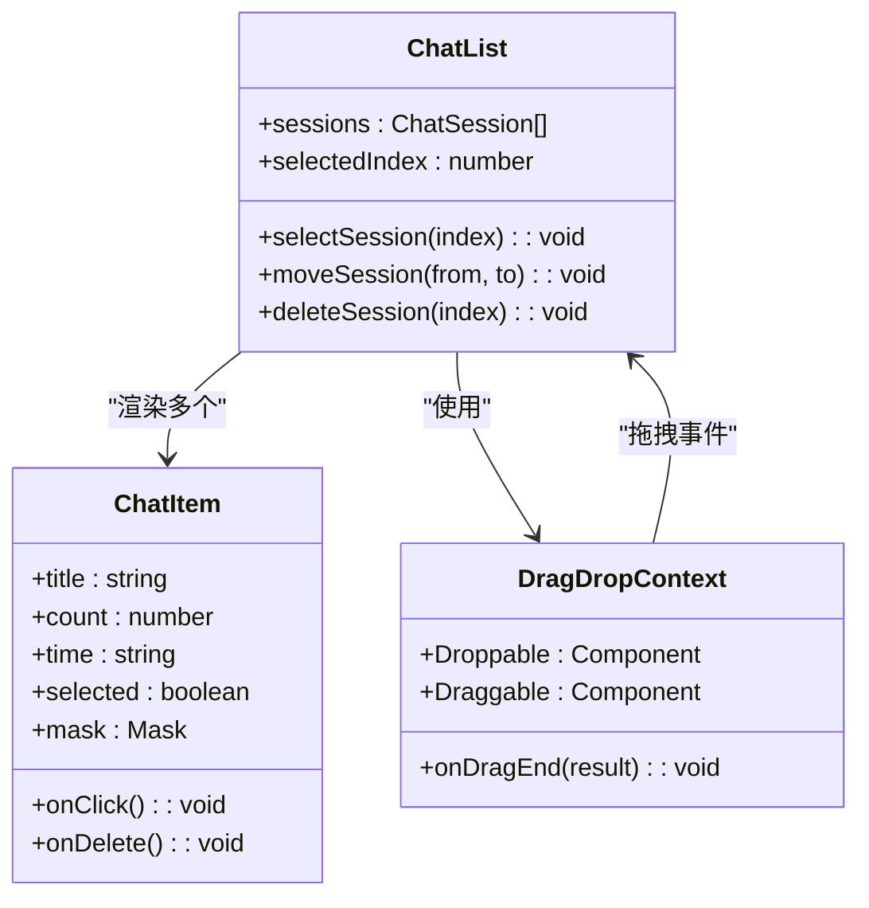
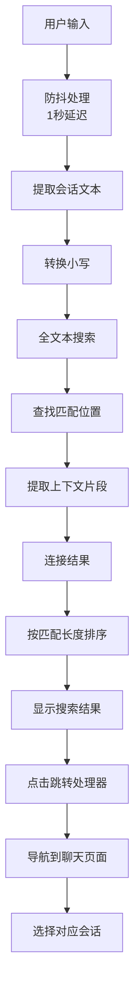
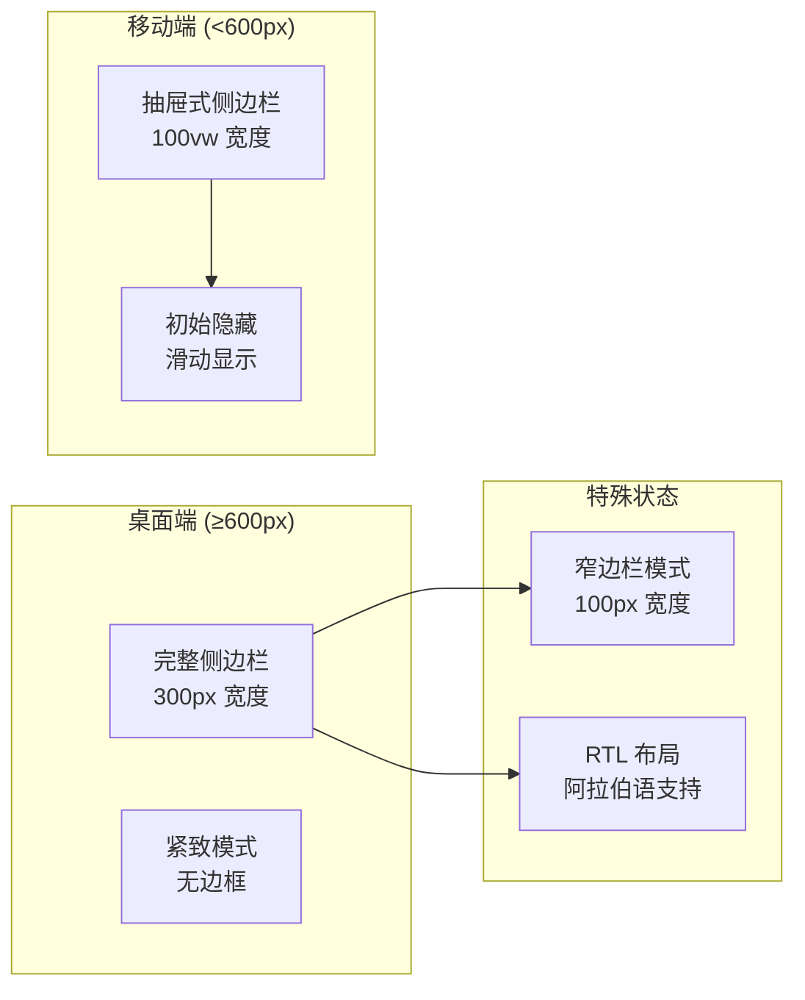
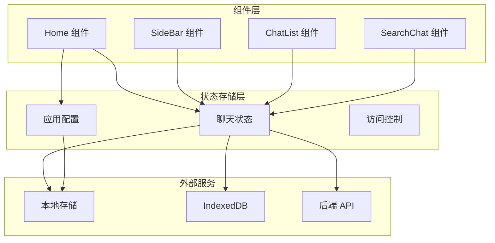
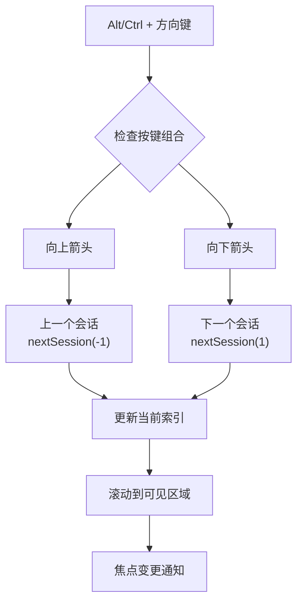
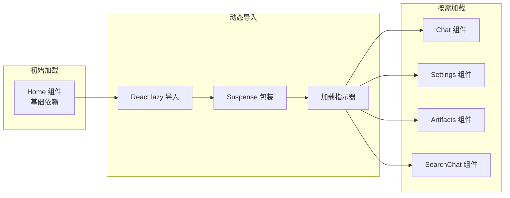

# 首页与侧边栏组件

<cite>
**本文档中引用的文件**
- [home.tsx](file://app/components/home.tsx)
- [sidebar.tsx](file://app/components/sidebar.tsx)
- [search-chat.tsx](file://app/components/search-chat.tsx)
- [home.module.scss](file://app/components/home.module.scss)
- [chat-list.tsx](file://app/components/chat-list.tsx)
- [constant.ts](file://app/constant.ts)
- [hooks.ts](file://app/utils/hooks.ts)
</cite>

## 目录
1. [简介](#简介)
2. [项目结构概览](#项目结构概览)
3. [核心组件架构](#核心组件架构)
4. [首页根布局组件](#首页根布局组件)
5. [侧边栏导航组件](#侧边栏导航组件)
6. [搜索聊天功能](#搜索聊天功能)
7. [响应式布局系统](#响应式布局系统)
8. [状态管理与数据流](#状态管理与数据流)
9. [无障碍访问与键盘快捷键](#无障碍访问与键盘快捷键)
10. [性能优化策略](#性能优化策略)
11. [最佳实践指南](#最佳实践指南)
12. [总结](#总结)

## 简介

ChatGPT Next Web 是一个基于 React 和 Next.js 构建的现代化聊天界面应用，其首页与侧边栏组件构成了整个应用的核心导航架构。本文档深入分析了这三个关键组件的设计理念、实现细节和交互逻辑，为开发者提供全面的技术参考。

该应用采用模块化的组件设计，通过精心构建的布局系统实现了流畅的用户体验，同时支持多种设备和屏幕尺寸的自适应显示。

## 项目结构概览

应用的组件结构遵循清晰的层次化设计：

**图表来源**
- [home.tsx](file://app/components/home.tsx#L1-L273)
- [sidebar.tsx](file://app/components/sidebar.tsx#L1-L369)
- [home.module.scss](file://app/components/home.module.scss#L1-L350)

## 核心组件架构

### 组件关系图

**图表来源**
- [home.tsx](file://app/components/home.tsx#L160-L221)
- [sidebar.tsx](file://app/components/sidebar.tsx#L227-L369)
- [chat-list.tsx](file://app/components/chat-list.tsx#L105-L175)
- [search-chat.tsx](file://app/components/search-chat.tsx#L18-L168)

## 首页根布局组件

### 核心功能概述

Home 组件作为应用的根布局容器，负责协调主内容区与侧边栏的显示逻辑，实现了复杂的路由管理和状态同步机制。

### 主要特性

1. **动态路由管理**：根据 URL 路径智能切换不同的页面视图
2. **主题切换系统**：支持亮色、暗色和自动模式的主题切换
3. **国际化支持**：动态语言设置和本地化资源加载
4. **性能优化**：使用 React.lazy 实现组件的懒加载和代码分割

### 布局协调机制

**图表来源**
- [home.tsx](file://app/components/home.tsx#L160-L221)

### 关键实现细节

**路径检测逻辑**：
- `isArtifact`: 判断是否为制品页面
- `isHome`: 判断是否为主页
- `isAuth`: 判断是否为认证页面
- `isSd`: 判断是否为 Stable Diffusion 页面

**容器样式控制**：
- `shouldTightBorder`: 根据配置和屏幕尺寸决定是否应用紧致边框
- RTL 支持：阿拉伯语等从右到左语言的布局适配

**节来源**
- [home.tsx](file://app/components/home.tsx#L160-L221)

## 侧边栏导航组件

### 折叠状态管理系统

SideBar 组件实现了复杂的状态管理机制，支持手动折叠、拖拽调整宽度和移动端适配。

### 核心功能模块

#### 1. 拖拽宽度调整

**图表来源**
- [sidebar.tsx](file://app/components/sidebar.tsx#L65-L119)

#### 2. 快捷入口功能

侧边栏提供了多个快速访问入口：

| 功能入口 | 图标 | 路径 | 描述 |
|---------|------|------|------|
| 掩码功能 | MaskIcon | /masks | 对话模板和预设配置 |
| MCP 市场 | McpIcon | /mcp-market | 外部工具集成市场 |
| 发现功能 | DiscoveryIcon | 动态选择 | 插件、Stable Diffusion、搜索聊天 |

#### 3. 会话导航系统

ChatList 组件负责管理所有对话会话的显示和交互：

**图表来源**
- [chat-list.tsx](file://app/components/chat-list.tsx#L23-L102)

### 移动端适配策略

侧边栏针对移动设备进行了特殊优化：

- **滑动隐藏**：默认情况下侧边栏完全隐藏，需要时通过滑动显示
- **触摸优化**：针对触摸设备的交互体验优化
- **性能考虑**：iOS 设备上的过渡动画禁用以提升性能

**节来源**
- [sidebar.tsx](file://app/components/sidebar.tsx#L1-L369)
- [chat-list.tsx](file://app/components/chat-list.tsx#L1-L175)

## 搜索聊天功能

### 实时过滤算法

SearchChat 组件实现了高效的全文搜索功能，支持实时过滤和结果排序。

### 搜索算法流程

**图表来源**
- [search-chat.tsx](file://app/components/search-chat.tsx#L28-L68)

### 关键技术实现

#### 1. 防抖机制
使用 `setInterval` 实现每秒检查一次输入变化，避免频繁的搜索操作影响性能。

#### 2. 上下文提取
当找到匹配项时，提取前后各 35 字符的内容，形成有意义的搜索结果片段。

#### 3. 结果排序
按照匹配内容的总长度进行降序排序，确保最相关的匹配出现在前面。

### 用户交互设计

| 交互元素 | 功能描述 | 键盘支持 |
|---------|----------|----------|
| 搜索输入框 | 实时搜索聊天内容 | Enter 键确认搜索 |
| 搜索结果列表 | 显示匹配的会话 | 点击直接跳转 |
| 关闭按钮 | 返回上一页 | 点击或 ESC 键 |

**节来源**
- [search-chat.tsx](file://app/components/search-chat.tsx#L1-L168)

## 响应式布局系统

### 断点设计

应用采用了基于 CSS 变量的响应式布局系统：

**图表来源**
- [home.module.scss](file://app/components/home.module.scss#L24-L134)

### 样式变量系统

应用使用 CSS 自定义属性实现动态样式：

| 变量名 | 默认值 | 用途 |
|--------|--------|------|
| `--sidebar-width` | 300px | 侧边栏宽度控制 |
| `--window-width` | 1200px | 主窗口宽度 |
| `--window-height` | 100vh | 主窗口高度 |
| `--full-height` | 100vh | 全屏高度 |

### 移动端优化

针对不同移动设备的特殊处理：

- **iOS 平台**：禁用过渡动画以提升滚动性能
- **Android 平台**：保持标准动画效果
- **横屏模式**：自动切换到桌面布局

**节来源**
- [home.module.scss](file://app/components/home.module.scss#L1-L350)

## 状态管理与数据流

### 数据流架构

**图表来源**
- [home.tsx](file://app/components/home.tsx#L26-L30)
- [sidebar.tsx](file://app/components/sidebar.tsx#L18-L20)

### 状态同步机制

应用使用 Zustand 状态管理库实现跨组件的状态共享：

- **持久化存储**：自动保存和恢复用户偏好设置
- **实时同步**：组件状态与存储状态保持同步
- **类型安全**：完整的 TypeScript 类型定义

**节来源**
- [home.tsx](file://app/components/home.tsx#L223-L235)

## 无障碍访问与键盘快捷键

### 键盘导航支持

SideBar 组件实现了完整的键盘导航功能：

**图表来源**
- [sidebar.tsx](file://app/components/sidebar.tsx#L46-L62)

### 无障碍特性

| 特性 | 实现方式 | 用户收益 |
|------|----------|----------|
| 屏幕阅读器支持 | ARIA 标签和角色 | 视觉障碍用户导航 |
| 键盘操作 | Tab 键顺序和快捷键 | 手动操作便利性 |
| 高对比度模式 | CSS 变量主题 | 视力不佳用户友好 |
| 焦点管理 | 自动滚动到可见区域 | 导航状态清晰 |

### 语义化 HTML

组件使用语义化的 HTML 结构：

- **导航区域**：使用 `<nav>` 标签标识
- **列表项目**：使用 `<ul>` 和 `<li>` 表示
- **按钮元素**：使用 `<button>` 而非 `
`
- **表单控件**：正确绑定标签和输入元素

**节来源**
- [sidebar.tsx](file://app/components/sidebar.tsx#L46-L62)

## 性能优化策略

### 组件懒加载

应用广泛使用 React.lazy 实现组件的按需加载：

**图表来源**
- [home.tsx](file://app/components/home.tsx#L43-L83)

### 优化技术

1. **代码分割**：大型组件独立打包，减少初始包大小
2. **虚拟滚动**：长列表使用虚拟化技术提升性能
3. **防抖搜索**：搜索功能使用防抖机制减少计算频率
4. **内存管理**：及时清理事件监听器和定时器

### 性能监控

应用集成了性能监控机制：

- **组件渲染时间**：记录关键组件的渲染耗时
- **内存使用情况**：监控应用内存占用
- **网络请求优化**：缓存 API 响应结果

**节来源**
- [home.tsx](file://app/components/home.tsx#L43-L83)

## 最佳实践指南

### 开发规范

#### 1. 组件设计原则

- **单一职责**：每个组件只负责一个特定功能
- **可复用性**：设计通用性强的子组件
- **类型安全**：使用 TypeScript 定义完整类型
- **错误边界**：合理使用 ErrorBoundary 组件

#### 2. 样式管理

- **模块化 CSS**：使用 SCSS 模块避免样式冲突
- **CSS 变量**：统一管理颜色、间距等设计令牌
- **响应式设计**：基于断点而非设备类型
- **动画性能**：优先使用 transform 和 opacity

#### 3. 状态管理

- **集中存储**：相似状态放在同一 store 中
- **不可变更新**：使用 immer 或类似库保证状态不可变
- **持久化策略**：重要状态自动保存到本地存储
- **类型推导**：利用 TypeScript 提升开发体验

### 测试策略

#### 单元测试覆盖

| 组件 | 测试重点 | 测试方法 |
|------|----------|----------|
| Home | 路由处理、主题切换 | Jest + React Testing Library |
| SideBar | 拖拽逻辑、状态管理 | 模拟事件和状态 |
| ChatList | 拖拽排序、删除功能 | E2E 测试 |
| SearchChat | 搜索算法、防抖机制 | 单元测试 |

#### 性能测试

- **首屏加载时间**：监控初始页面渲染时间
- **交互响应时间**：测量用户操作的响应延迟
- **内存泄漏检测**：定期检查内存使用情况
- **移动端性能**：在真实设备上测试性能表现

### 部署优化

#### 构建配置

- **Tree Shaking**：移除未使用的代码
- **代码压缩**：使用 Terser 压缩 JavaScript
- **资源优化**：图片和字体资源压缩
- **CDN 配置**：静态资源使用 CDN 加速

#### 缓存策略

- **浏览器缓存**：静态资源长期缓存
- **API 缓存**：智能缓存 API 响应
- **版本控制**：资源文件添加哈希戳
- **渐进式加载**：优先加载关键资源

## 总结

ChatGPT Next Web 的首页与侧边栏组件展现了现代前端应用的设计精髓。通过精心设计的架构、完善的交互逻辑和优秀的性能优化，为用户提供了流畅、直观且功能丰富的使用体验。

### 核心优势

1. **架构清晰**：模块化设计便于维护和扩展
2. **用户体验**：响应式布局和无障碍支持
3. **性能优异**：懒加载和优化策略确保流畅体验
4. **技术先进**：采用最新的 React 和 Next.js 技术栈

### 技术亮点

- **动态路由系统**：智能的页面切换和状态管理
- **拖拽交互**：直观的侧边栏宽度调整
- **实时搜索**：高效的全文搜索和过滤算法
- **主题系统**：灵活的视觉主题切换机制

### 未来发展方向

随着技术的不断发展，该应用可以在以下方面继续优化：

- **PWA 支持**：增强离线功能和安装能力
- **多语言扩展**：支持更多语言和地区
- **AI 功能增强**：集成更先进的自然语言处理能力
- **协作功能**：支持多人实时协作编辑

这套组件系统不仅为当前的功能需求提供了完美的解决方案，也为未来的功能扩展奠定了坚实的基础，是现代 Web 应用开发的优秀范例。