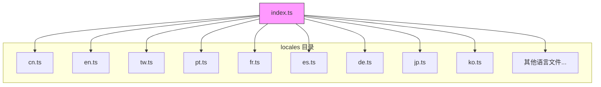
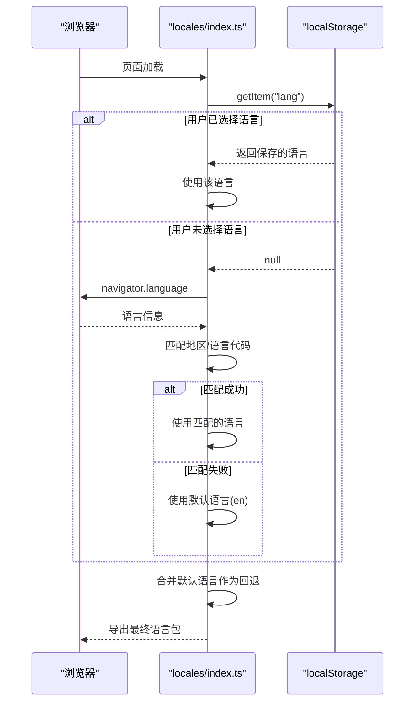

# 国际化与本地化

<cite>
**本文档引用的文件**  
- [cn.ts](file://app/locales/cn.ts)
- [en.ts](file://app/locales/en.ts)
- [index.ts](file://app/locales/index.ts)
- [settings.tsx](file://app/components/settings.tsx)
- [home.tsx](file://app/components/home.tsx)
- [chat.tsx](file://app/components/chat.tsx)
</cite>

## 目录
1. [简介](#简介)
2. [多语言资源文件组织结构](#多语言资源文件组织结构)
3. [语言加载与切换机制](#语言加载与切换机制)
4. [默认语言设置与用户偏好记忆](#默认语言设置与用户偏好记忆)
5. [UI组件中的翻译函数调用](#ui组件中的翻译函数调用)
6. [新增语言支持流程](#新增语言支持流程)
7. [翻译键名命名规范与上下文注释](#翻译键名命名规范与上下文注释)

## 简介
本项目实现了完整的国际化（i18n）支持，通过 `locales` 目录下的多语言资源文件，为用户提供多语言界面切换功能。系统支持包括简体中文、英语、葡萄牙语、繁体中文等在内的多种语言，允许用户根据个人偏好选择界面语言。国际化方案涵盖了语言资源管理、动态语言切换、用户偏好持久化、翻译键名规范等核心功能，确保了多语言支持的可维护性和扩展性。

**Section sources**
- [index.ts](file://app/locales/index.ts#L1-L171)

## 多语言资源文件组织结构
项目的多语言资源文件统一存放在 `app/locales/` 目录下，每个语言对应一个独立的 TypeScript 文件，如 `cn.ts`（简体中文）、`en.ts`（英语）、`tw.ts`（繁体中文）等。这些文件导出一个包含所有界面文本的嵌套对象，结构清晰，便于维护。

每个语言文件定义了统一的 `LocaleType` 类型，确保所有语言包具有相同的结构。对于新增的语言，可以使用 `PartialLocaleType` 类型，仅覆盖需要翻译的部分，其余未翻译的字段将自动回退到默认语言（英语）的文本。

语言资源文件采用模块化导入方式，在 `locales/index.ts` 中集中管理所有语言包的导入和导出，形成统一的访问入口。



**Diagram sources**
- [index.ts](file://app/locales/index.ts#L1-L50)
- [cn.ts](file://app/locales/cn.ts#L1-L100)
- [en.ts](file://app/locales/en.ts#L1-L100)

**Section sources**
- [cn.ts](file://app/locales/cn.ts#L1-L875)
- [en.ts](file://app/locales/en.ts#L1-L876)
- [index.ts](file://app/locales/index.ts#L1-L171)

## 语言加载与切换机制
项目的语言加载机制基于 `locales/index.ts` 文件实现。该文件首先导入所有语言包，并通过 `ALL_LANGS` 对象进行统一管理。系统通过 `getLang()` 函数确定当前应使用的语言，其逻辑如下：

1. 首先检查 `localStorage` 中是否已保存用户选择的语言（键名为 `lang`）。
2. 如果未保存，则通过浏览器的 `navigator.language` 获取用户的系统语言和地区信息。
3. 优先匹配地区代码（如 `zh-CN` 中的 `CN`），若匹配成功则使用对应语言。
4. 若地区代码不匹配，则尝试匹配语言代码（如 `zh-CN` 中的 `zh`）。
5. 若均不匹配，则使用默认语言 `en`（英语）。

语言切换通过 `changeLang(lang: Lang)` 函数实现，该函数将用户选择的语言保存到 `localStorage` 中，并通过 `location.reload()` 重新加载页面以应用新的语言设置。



**Diagram sources**
- [index.ts](file://app/locales/index.ts#L79-L129)

**Section sources**
- [index.ts](file://app/locales/index.ts#L79-L129)

## 默认语言设置与用户偏好记忆
系统默认语言设置为英语（`DEFAULT_LANG = "en"`），并作为所有语言包的回退语言（`fallbackLang`）。当目标语言包中缺少某些翻译字段时，系统会自动使用英语版本的文本，确保界面不会出现空白。

用户偏好记忆功能通过 `localStorage` 实现。当用户在设置中选择语言后，系统调用 `changeLang(lang)` 函数，将选择的语言代码（如 `cn`、`en`、`tw`）以键值对形式（`lang: "cn"`）存储在 `localStorage` 中。下次用户访问时，系统会优先读取此值，从而实现语言偏好的持久化记忆。

此外，系统还提供了 `getISOLang()` 函数，用于将内部语言代码转换为标准的 ISO 语言标签（如 `cn` 转换为 `zh-Hans`），以便在需要标准格式的场景下使用。

**Section sources**
- [index.ts](file://app/locales/index.ts#L79-L139)

## UI组件中的翻译函数调用
在UI组件中，通过导入 `Locale` 对象来调用翻译函数。`Locale` 对象是 `locales/index.ts` 的默认导出，它已经根据当前语言设置动态指向了正确的语言包。

调用方式非常简单，直接通过点符号访问嵌套的翻译键名。例如：
- `Locale.Home.NewChat` 用于获取“新的聊天”文本
- `Locale.Settings.Lang.Name` 用于获取“语言”标签
- `Locale.Chat.Actions.Send` 用于获取“发送”按钮文本

在组件中，通常会将 `Locale` 与组件的逻辑结合使用。例如，在 `settings.tsx` 的语言选择下拉菜单中，通过 `AllLangs` 数组和 `ALL_LANG_OPTIONS` 映射来渲染所有可用的语言选项，并使用 `changeLang()` 函数处理选择事件。

```mermaid
flowchart TD
Start([组件渲染]) --> Import["导入 Locale 对象"]
Import --> Access["通过 Locale.键名 访问翻译文本"]
Access --> Render["在JSX中渲染文本"]
Render --> End([界面显示])
subgraph "示例: 语言选择下拉菜单"
A[Select 组件] --> B[遍历 AllLangs]
B --> C[获取 ALL_LANG_OPTIONS[lang]]
C --> D[显示语言名称]
D --> E[onChange 调用 changeLang]
end
```

**Diagram sources**
- [settings.tsx](file://app/components/settings.tsx#L46-L51)
- [home.tsx](file://app/components/home.tsx#L17-L18)

**Section sources**
- [settings.tsx](file://app/components/settings.tsx#L1-L1960)
- [chat.tsx](file://app/components/chat.tsx#L87-L87)
- [home.tsx](file://app/components/home.tsx#L1-L273)

## 新增语言支持流程
为项目添加新的语言支持遵循以下流程：

1. **创建语言文件**：在 `app/locales/` 目录下创建新的 `.ts` 文件，文件名使用标准的语言代码（如 `de.ts` 代表德语）。
2. **导入依赖**：在新文件中导入必要的依赖，如 `getClientConfig`、`SubmitKey` 和 `LocaleType`。
3. **定义翻译对象**：创建一个名为 `de`（以德语为例）的常量，其类型为 `PartialLocaleType`，并填充需要翻译的文本。
4. **导出语言包**：在文件末尾导出该语言对象。
5. **注册语言**：在 `locales/index.ts` 文件中，使用 `import` 语句导入新语言文件，并将其添加到 `ALL_LANGS` 对象和 `ALL_LANG_OPTIONS` 映射中。
6. **测试验证**：启动应用，在设置中选择新语言，检查界面文本是否正确显示。

通过此流程，可以轻松地为项目添加新的语言支持，而无需修改核心逻辑。

**Section sources**
- [index.ts](file://app/locales/index.ts#L1-L171)
- [de.ts](file://app/locales/de.ts#L1-L20) (示例)

## 翻译键名命名规范与上下文注释
为了确保翻译的准确性和维护的便利性，项目遵循严格的翻译键名命名规范：

- **层级结构清晰**：翻译键名采用嵌套对象的形式，按功能模块组织，如 `Chat.Actions.Send`、`Settings.Lang.Name`，这使得键名具有明确的上下文。
- **语义化命名**：键名使用具有明确含义的英文单词，避免使用缩写或模糊的名称。
- **一致性**：相同含义的文本在不同位置使用相同的键名，确保翻译的一致性。
- **特殊说明**：对于 `Locale.Settings.Lang.Name` 这样的键，文件中明确添加了注释 `// ATTENTION: if you wanna add a new translation, please do not translate this value, leave it as 'Language'`，指示贡献者不要翻译此特定值，以保持国际化系统的一致性。

此外，对于包含变量的动态文本，使用函数形式定义，如 `Locale.ChatItem.ChatItemCount = (count: number) => ${count} 条对话`，这使得翻译文本能够根据运行时数据动态生成，同时保持了类型安全。

这些规范和注释极大地提高了多语言资源的可维护性，降低了翻译错误的风险，并为未来的扩展提供了清晰的指导。

**Section sources**
- [cn.ts](file://app/locales/cn.ts#L180-L181)
- [en.ts](file://app/locales/en.ts#L181-L182)
- [index.ts](file://app/locales/index.ts#L56-L76)