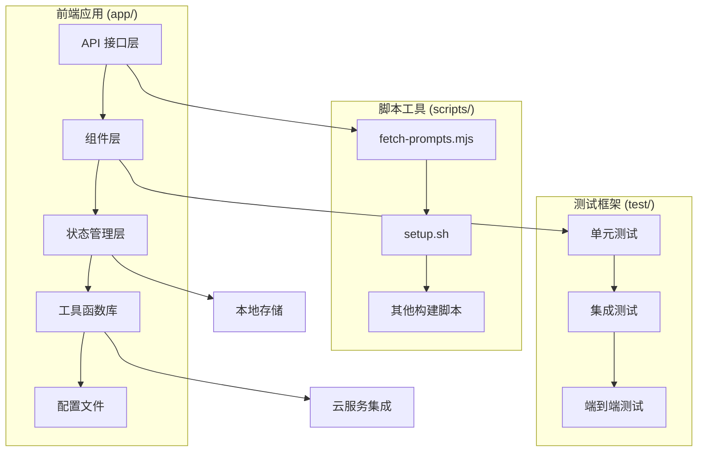
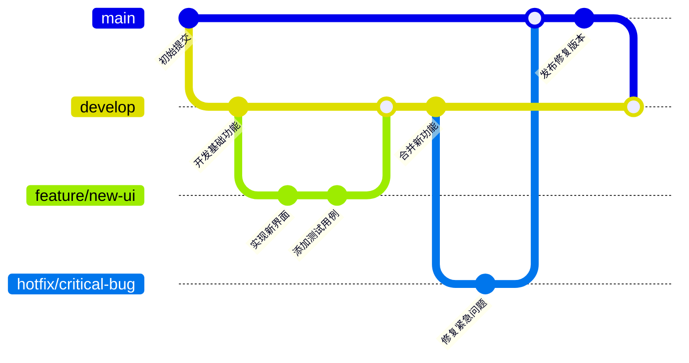
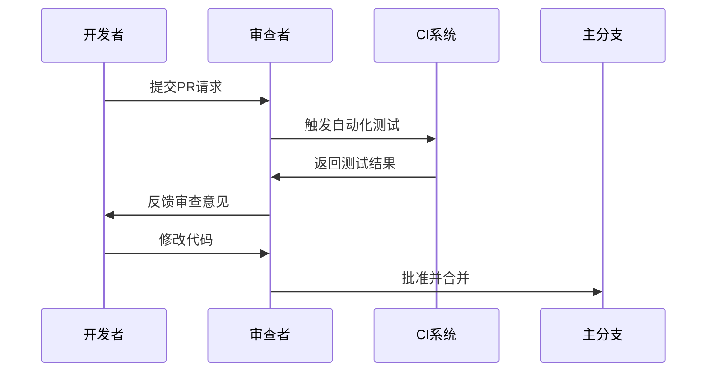

# 开发者指南

<cite>
**本文档中引用的文件**
- [package.json](file://package.json)
- [README.md](file://README.md)
- [scripts/fetch-prompts.mjs](file://scripts/fetch-prompts.mjs)
- [app/utils.ts](file://app/utils.ts)
- [next.config.mjs](file://next.config.mjs)
- [tsconfig.json](file://tsconfig.json)
- [jest.config.ts](file://jest.config.ts)
- [jest.setup.ts](file://jest.setup.ts)
- [app/constant.ts](file://app/constant.ts)
- [app/utils/hooks.ts](file://app/utils/hooks.ts)
- [app/store/index.ts](file://app/store/index.ts)
- [app/masks/index.ts](file://app/masks/index.ts)
- [app/masks/build.ts](file://app/masks/build.ts)
- [scripts/setup.sh](file://scripts/setup.sh)
- [test/model-available.test.ts](file://test/model-available.test.ts)
</cite>

## 目录
1. [项目简介](#项目简介)
2. [开发环境搭建](#开发环境搭建)
3. [项目架构概览](#项目架构概览)
4. [代码风格规范](#代码风格规范)
5. [提交信息格式](#提交信息格式)
6. [分支管理策略](#分支管理策略)
7. [Pull Request 流程](#pull-request-流程)
8. [工具脚本使用指南](#工具脚本使用指南)
9. [常用工具函数库](#常用工具函数库)
10. [本地开发环境配置](#本地开发环境配置)
11. [调试技巧](#调试技巧)
12. [代码审查标准](#代码审查标准)
13. [测试指南](#测试指南)
14. [部署与发布](#部署与发布)

## 项目简介

ChatGPT Next Web 是一个基于 Next.js 的现代化 AI 助手应用，支持多种 AI 模型提供商，包括 OpenAI、Claude、Gemini、DeepSeek 等。项目采用 TypeScript 构建，具有良好的类型安全性和可维护性。

### 核心特性
- 支持多种 AI 模型提供商
- 响应式设计，支持移动端
- 多语言国际化支持
- 插件系统扩展功能
- 实时聊天和流式响应
- 本地数据存储和同步

## 开发环境搭建

### 系统要求
- Node.js 版本 >= 18
- Yarn 包管理器
- Git 版本控制

### 快速开始

1. **克隆项目**
```bash
git clone https://github.com/ChatGPTNextWeb/ChatGPT-Next-Web.git
cd ChatGPT-Next-Web
```

2. **安装依赖**
```bash
yarn install
```

3. **配置环境变量**
创建 `.env.local` 文件：
```bash
OPENAI_API_KEY=your_api_key_here
# 如果需要访问代理服务
BASE_URL=https://your-proxy-url.com
```

4. **启动开发服务器**
```bash
yarn dev
```

### 开发脚本说明

项目提供了丰富的开发脚本：

| 脚本命令 | 功能描述 |
|---------|----------|
| `yarn dev` | 启动开发服务器，自动监听文件变化 |
| `yarn build` | 构建生产环境代码 |
| `yarn start` | 启动生产环境服务器 |
| `yarn mask` | 构建内置面具配置 |
| `yarn mask:watch` | 监听面具文件变化并自动构建 |
| `yarn test` | 运行测试套件（交互模式） |
| `yarn test:ci` | CI 环境运行测试 |
| `yarn lint` | 代码质量检查 |
| `yarn prompts` | 获取外部提示词资源 |

**章节来源**
- [package.json](file://package.json#L5-L21)
- [README.md](file://README.md#L383-L403)

## 项目架构概览

### 目录结构



**图表来源**
- [app/utils.ts](file://app/utils.ts#L1-L50)
- [scripts/fetch-prompts.mjs](file://scripts/fetch-prompts.mjs#L1-L30)

### 核心模块说明

| 模块路径 | 功能描述 | 主要职责 |
|---------|----------|----------|
| `app/api/` | API 接口路由 | 处理各种 AI 服务提供商的请求 |
| `app/components/` | React 组件 | 用户界面组件和页面 |
| `app/store/` | 状态管理 | 全局状态管理和持久化 |
| `app/utils/` | 工具函数库 | 可复用的业务逻辑函数 |
| `app/masks/` | 面具配置 | 提示词模板和预设配置 |
| `app/locales/` | 国际化 | 多语言本地化支持 |

**章节来源**
- [app/store/index.ts](file://app/store/index.ts#L1-L6)

## 代码风格规范

### TypeScript 配置

项目使用严格的 TypeScript 配置，确保代码质量和类型安全：

```typescript
// tsconfig.json 关键配置
{
  "strict": true,
  "forceConsistentCasingInFileNames": true,
  "jsx": "preserve",
  "moduleResolution": "node"
}
```

### ESLint 规则

项目集成了完善的 ESLint 配置，包括：
- 代码格式化统一
- 未使用导入自动清理
- React Hooks 使用规范
- 类型安全检查

### 命名约定

| 类型 | 约定 | 示例 |
|------|------|------|
| 变量/函数 | 小驼峰命名法 | `getMessageTextContent` |
| 常量 | 全大写加下划线 | `REQUEST_TIMEOUT_MS` |
| 接口类型 | 大驼峰命名法 | `RequestMessage` |
| 组件 | 大驼峰命名法 | `ChatComponent` |
| 文件夹 | 小写加连字符 | `api-client` |

### 导入导出规范

```typescript
// 统一的导出模式
export * from "./chat";
export * from "./update";
export * from "./access";

// 明确的导入模式
import { useStore } from "../store";
import type { RequestMessage } from "../client/api";
```

**章节来源**
- [tsconfig.json](file://tsconfig.json#L2-L17)
- [package.json](file://package.json#L77-L86)

## 提交信息格式

### 提交消息规范

项目采用 Conventional Commits 格式：

```
<type>(<scope>): <description>

[optional body]

[optional footer(s)]
```

### 提交类型

| 类型 | 描述 | 示例 |
|------|------|------|
| `feat` | 新功能 | `feat(api): add support for Anthropic Claude` |
| `fix` | 错误修复 | `fix(ui): resolve mobile layout issue` |
| `docs` | 文档更新 | `docs: update developer guide` |
| `style` | 代码格式 | `style: format utils functions` |
| `refactor` | 代码重构 | `refactor(store): simplify state management` |
| `test` | 测试相关 | `test: add unit tests for utils` |
| `chore` | 构建过程 | `chore(deps): update dependencies` |

### 提交示例

```bash
# 功能开发
git commit -m "feat(api): add new OpenAI model support

- Added support for GPT-4 Turbo
- Updated API routing
- Added model availability checks"

# 错误修复
git commit -m "fix(ui): resolve sidebar collapse bug

- Fixed responsive layout issue
- Added proper breakpoint handling
- Tested on multiple devices"

# 文档更新
git commit -m "docs: update contribution guidelines

- Added new development setup steps
- Clarified code review process
- Updated testing requirements"
```

## 分支管理策略

### Git Flow 工作流

项目采用 Git Flow 分支管理策略：



### 分支命名规范

| 分支类型 | 命名格式 | 示例 |
|----------|----------|------|
| 功能分支 | `feature/description` | `feature/add-anthropic-support` |
| 修复分支 | `fix/description` | `fix/sidebar-layout-issue` |
| 热修复分支 | `hotfix/issue-number` | `hotfix/123-crash-on-mobile` |
| 发布分支 | `release/version` | `release/v2.15.0` |
| 开发分支 | `develop` | 持续集成开发 |

### 合并策略

- **功能分支**：通过 Pull Request 合并到 develop
- **热修复分支**：直接合并到 main 和 develop
- **发布分支**：完成测试后合并到 main 和 develop

## Pull Request 流程

### PR 创建步骤

1. **创建功能分支**
```bash
git checkout -b feature/add-new-model
```

2. **开发和测试**
```bash
# 开发新功能
yarn dev

# 运行测试
yarn test
```

3. **提交代码**
```bash
git add .
git commit -m "feat(api): add support for new AI model"
git push origin feature/add-new-model
```

4. **创建 Pull Request**
   - 在 GitHub 上创建 PR
   - 填写详细的描述
   - 关联相关 Issue

### PR 检查清单

- [ ] 代码符合项目风格规范
- [ ] 添加了必要的测试用例
- [ ] 更新了相关文档
- [ ] 通过了所有自动化测试
- [ ] 没有引入新的 ESLint 警告
- [ ] 功能经过充分测试验证

### 代码审查流程



**图表来源**
- [test/model-available.test.ts](file://test/model-available.test.ts#L1-L20)

## 工具脚本使用指南

### fetch-prompts.mjs

该脚本用于获取外部提示词资源，支持多语言版本。

#### 功能特性
- 自动获取中英文提示词
- 过滤敏感内容
- 支持超时处理
- 异常容错机制

#### 使用方法
```bash
# 获取最新提示词
yarn prompts

# 或直接运行脚本
node ./scripts/fetch-prompts.mjs
```

#### 配置选项
```javascript
// 支持的语言源
const CN_URL = "PlexPt/awesome-chatgpt-prompts-zh/main/prompts-zh.json";
const EN_URL = "f/awesome-chatgpt-prompts/main/prompts.csv";

// 敏感词过滤列表
const ignoreWords = ["涩涩", "魅魔", "澀澀"];
```

**章节来源**
- [scripts/fetch-prompts.mjs](file://scripts/fetch-prompts.mjs#L1-L99)

### setup.sh

自动化设置脚本，支持多种操作系统。

#### 支持平台
- Ubuntu Linux
- Debian Linux  
- CentOS Linux
- Arch Linux
- macOS

#### 自动化功能
- 检测并安装必要依赖
- 克隆项目仓库
- 配置环境变量
- 安装项目依赖
- 启动开发服务器

#### 使用方法
```bash
# 下载并运行设置脚本
bash <(curl -s https://raw.githubusercontent.com/ChatGPTNextWeb/ChatGPT-Next-Web/main/scripts/setup.sh)
```

**章节来源**
- [scripts/setup.sh](file://scripts/setup.sh#L1-L69)

### mask 构建脚本

用于构建内置面具配置文件。

#### 功能说明
- 合并多语言面具配置
- 生成标准化的 JSON 输出
- 支持自定义面具 ID 分配

#### 使用方法
```bash
# 构建面具配置
yarn mask

# 监听文件变化并自动构建
yarn mask:watch
```

**章节来源**
- [app/masks/build.ts](file://app/masks/build.ts#L1-L26)

## 常用工具函数库

### app/utils 函数库

项目的核心工具函数库，提供通用的业务逻辑支持。

#### 核心功能分类

| 功能类别 | 主要函数 | 用途描述 |
|---------|----------|----------|
| 字符串处理 | `trimTopic`, `getMessageTextContent` | 文本清理和内容提取 |
| 数据操作 | `clone`, `merge`, `format` | 对象和数组操作 |
| 网络请求 | `fetch`, `adapter` | 统一的网络请求接口 |
| 存储管理 | `safeLocalStorage`, `indexedDB-storage` | 数据持久化 |
| 模型处理 | `isVisionModel`, `getModelSizes` | AI 模型相关功能 |
| UI 辅助 | `copyToClipboard`, `downloadAs` | 用户界面交互 |

#### 网络请求适配器

```typescript
// 统一的网络请求接口
export function fetch(url: string, options?: Record<string, unknown>): Promise<any> {
  if (window.__TAURI__) {
    return tauriStreamFetch(url, options);
  }
  return window.fetch(url, options);
}

// 请求适配器
export function adapter(config: Record<string, unknown>) {
  const { baseURL, url, params, data: body, ...rest } = config;
  const path = baseURL ? `${baseURL}${url}` : url;
  const fetchUrl = params ? `${path}?${new URLSearchParams(params as any).toString()}` : path;
  
  return fetch(fetchUrl as string, { ...rest, body })
    .then((res) => {
      const { status, headers, statusText } = res;
      return res.text().then((data: string) => ({ status, statusText, headers, data }));
    });
}
```

#### 状态管理工具

```typescript
// 安全的本地存储封装
export function safeLocalStorage(): {
  getItem: (key: string) => string | null;
  setItem: (key: string, value: string) => void;
  removeItem: (key: string) => void;
  clear: () => void;
} {
  let storage: Storage | null;
  
  try {
    if (typeof window !== "undefined" && window.localStorage) {
      storage = window.localStorage;
    } else {
      storage = null;
    }
  } catch (e) {
    console.error("localStorage is not available:", e);
    storage = null;
  }
  
  return { /* ... */ };
}
```

**章节来源**
- [app/utils.ts](file://app/utils.ts#L1-L482)

### Hooks 工具函数

React Hooks 工具函数，简化状态管理和业务逻辑。

#### useAllModels Hook

```typescript
export function useAllModels() {
  const accessStore = useAccessStore();
  const configStore = useAppConfig();
  
  const models = useMemo(() => {
    return collectModelsWithDefaultModel(
      configStore.models,
      [configStore.customModels, accessStore.customModels].join(","),
      accessStore.defaultModel,
    );
  }, [
    accessStore.customModels,
    accessStore.defaultModel,
    configStore.customModels,
    configStore.models,
  ]);
  
  return models;
}
```

**章节来源**
- [app/utils/hooks.ts](file://app/utils/hooks.ts#L1-L23)

### 面具配置系统

内置的提示词模板管理系统。

#### 配置结构
```typescript
export interface BuiltinMask {
  id: number;
  name: string;
  desc: string;
  avatar: string;
  modelConfig: ModelConfig;
  lang: string;
  builtin: boolean;
  context: Context[];
  syncGlobalConfig: boolean;
}
```

#### 构建流程
1. 读取多语言面具配置
2. 合并为统一格式
3. 生成 `masks.json` 文件
4. 提供给前端使用

**章节来源**
- [app/masks/index.ts](file://app/masks/index.ts#L1-L39)

## 本地开发环境配置

### 环境变量配置

项目支持丰富的环境变量配置：

| 变量名 | 类型 | 默认值 | 描述 |
|--------|------|--------|------|
| `OPENAI_API_KEY` | String | - | OpenAI API 密钥 |
| `BASE_URL` | String | `https://api.openai.com` | API 基础 URL |
| `CODE` | String | - | 访问密码（逗号分隔） |
| `DISABLE_GPT4` | Boolean | `false` | 禁用 GPT-4 模型 |
| `ENABLE_BALANCE_QUERY` | Boolean | `false` | 启用余额查询 |
| `CUSTOM_MODELS` | String | - | 自定义模型配置 |
| `DEFAULT_MODEL` | String | - | 默认使用的模型 |

### 开发服务器配置

#### Next.js 配置优化

```javascript
// next.config.mjs 关键配置
const nextConfig = {
  webpack(config) {
    // SVG 图标处理
    config.module.rules.push({
      test: /\.svg$/,
      use: ["@svgr/webpack"],
    });
    
    // 代码分割优化
    if (disableChunk) {
      config.plugins.push(
        new webpack.optimize.LimitChunkCountPlugin({ maxChunks: 1 }),
      );
    }
    
    return config;
  },
  
  // 图片优化
  images: {
    unoptimized: mode === "export",
  },
};
```

#### CORS 配置

```javascript
const CorsHeaders = [
  { key: "Access-Control-Allow-Credentials", value: "true" },
  { key: "Access-Control-Allow-Origin", value: "*" },
  { key: "Access-Control-Allow-Methods", value: "*" },
  { key: "Access-Control-Allow-Headers", value: "*" },
];
```

**章节来源**
- [next.config.mjs](file://next.config.mjs#L1-L112)
- [README.md](file://README.md#L173-L378)

### 代理配置

#### 开发环境代理

```bash
# 使用代理启动开发服务器
yarn proxy-dev

# 手动配置代理
sh ./scripts/init-proxy.sh
proxychains -f ./scripts/proxychains.conf yarn dev
```

#### 代理配置文件

```bash
# proxychains.conf 模板
[ProxyList]
# http 127.0.0.1 7890
# socks5 127.0.0.1 7890
```

## 调试技巧

### 开发工具配置

#### VS Code 推荐插件
- **ESLint**: 代码质量检查
- **Prettier**: 代码格式化
- **TypeScript Importer**: 自动导入
- **Auto Rename Tag**: 标签重命名
- **Bracket Pair Colorizer**: 括号高亮

#### 调试配置

```json
{
  "version": "0.2.0",
  "configurations": [
    {
      "name": "Debug Next.js",
      "type": "node",
      "request": "launch",
      "program": "${workspaceFolder}/node_modules/next/dist/bin/next",
      "args": ["dev"],
      "env": {
        "NODE_ENV": "development"
      },
      "sourceMaps": true
    }
  ]
}
```

### 性能调试

#### React DevTools
- 使用 React DevTools 检查组件状态
- 监控组件渲染性能
- 分析状态更新频率

#### Next.js Profiler
```bash
# 启用性能分析
NODE_OPTIONS='--inspect' yarn dev
```

### 网络请求调试

#### API 请求监控
```typescript
// 在开发环境中启用请求日志
if (process.env.NODE_ENV === 'development') {
  console.log('[API Request]', url, options);
}
```

#### WebSocket 调试
- 使用浏览器开发者工具的 Network 面板
- 监控实时通信连接
- 检查消息传输状态

### 错误处理调试

#### 全局错误捕获
```typescript
// 在入口文件添加错误边界
import { ErrorBoundary } from 'react-error-boundary';

function App() {
  return (
    <ErrorBoundary fallback={<div>Something went wrong</div>}>
      {/* 应用内容 */}
    </ErrorBoundary>
  );
}
```

#### 控制台调试技巧
```typescript
// 条件性调试输出
const DEBUG = process.env.NODE_ENV === 'development';

if (DEBUG) {
  console.log('[Debug Info]', state);
  console.trace('[Stack Trace]');
}
```

## 代码审查标准

### 代码质量检查

#### ESLint 规则
项目使用严格的 ESLint 配置：

```javascript
// eslint.config.js 关键规则
{
  "rules": {
    "no-unused-vars": "error",
    "react-hooks/rules-of-hooks": "error",
    "react-hooks/exhaustive-deps": "warn",
    "prettier/prettier": "error"
  }
}
```

#### 类型安全检查
- 所有函数必须明确的类型声明
- 接口定义必须完整覆盖所有属性
- 避免使用 `any` 类型

### 代码结构审查

#### 组件设计原则
```typescript
// 符合 React 最佳实践的组件
interface Props {
  title: string;
  onClick?: () => void;
}

function Button({ title, onClick }: Props) {
  const handleClick = useCallback(() => {
    onClick?.();
  }, [onClick]);
  
  return (
    <button onClick={handleClick} className="btn">
      {title}
    </button>
  );
}
```

#### 状态管理审查
- 避免在组件内部直接修改全局状态
- 使用 Redux Toolkit 或 Zustand 进行状态管理
- 确保状态的不可变性

### 性能审查要点

#### 渲染性能
- 避免在 JSX 中进行复杂计算
- 使用 `React.memo` 优化子组件
- 合理使用 `useMemo` 和 `useCallback`

#### 内存泄漏检查
- 确保事件监听器正确清理
- 避免循环引用
- 正确处理定时器和异步操作

### 安全审查

#### 输入验证
```typescript
// 表单输入验证
const validateInput = (value: string) => {
  if (!value.trim()) {
    throw new Error('Input cannot be empty');
  }
  
  if (value.length > 1000) {
    throw new Error('Input too long');
  }
  
  return value;
};
```

#### API 安全
- 不要在客户端暴露敏感 API 密钥
- 使用环境变量管理配置
- 实现适当的请求限制

## 测试指南

### 测试框架配置

项目使用 Jest 作为主要测试框架：

```typescript
// jest.config.ts 配置
const config: Config = {
  coverageProvider: "v8",
  testEnvironment: "jsdom",
  testMatch: ["**/*.test.js", "**/*.test.ts", "**/*.test.jsx", "**/*.test.tsx"],
  setupFilesAfterEnv: ["<rootDir>/jest.setup.ts"],
  moduleNameMapper: {
    "^@/(.*)$": "<rootDir>/$1",
  },
};
```

### 单元测试编写

#### 测试文件结构
```
test/
├── model-available.test.ts
├── model-provider.test.ts
├── sum-module.test.ts
└── vision-model-checker.test.ts
```

#### 测试用例示例

```typescript
import { isModelNotavailableInServer } from "../app/utils/model";

describe("isModelNotavailableInServer", () => {
  test("test model will return false, which means the model is available", () => {
    const customModels = "";
    const modelName = "gpt-4";
    const providerNames = "OpenAI";
    const result = isModelNotavailableInServer(
      customModels,
      modelName,
      providerNames,
    );
    expect(result).toBe(false);
  });

  test("should respect DISABLE_GPT4 setting", () => {
    process.env.DISABLE_GPT4 = "1";
    const result = isModelNotavailableInServer("", "gpt-4", "OpenAI");
    expect(result).toBe(true);
  });
});
```

### 测试最佳实践

#### 测试隔离
```typescript
// 每个测试用例独立运行
beforeEach(() => {
  // 重置全局状态
});

afterEach(() => {
  // 清理副作用
});
```

#### Mock 外部依赖
```typescript
// 模拟 API 调用
jest.mock('../app/utils/fetch');

test('should handle API errors', async () => {
  (fetch as jest.Mock).mockRejectedValue(new Error('Network error'));
  
  await expect(service.getData()).rejects.toThrow('Network error');
});
```

#### 测试覆盖率
- 核心业务逻辑覆盖率 >= 80%
- 关键功能模块覆盖率 >= 90%
- 边界条件和异常情况全覆盖

**章节来源**
- [jest.config.ts](file://jest.config.ts#L1-L24)
- [jest.setup.ts](file://jest.setup.ts#L1-L23)
- [test/model-available.test.ts](file://test/model-available.test.ts#L1-L81)

### 集成测试

#### API 接口测试
```typescript
// 测试 API 路由
describe('API Routes', () => {
  test('should handle OpenAI requests', async () => {
    const req = { method: 'POST', body: { model: 'gpt-4' } };
    const res = await handler(req, res);
    
    expect(res.statusCode).toBe(200);
    expect(res.body).toHaveProperty('choices');
  });
});
```

#### 端到端测试
- 页面加载时间测试
- 用户交互流程测试
- 多设备兼容性测试

## 部署与发布

### 生产环境构建

#### 构建配置
```bash
# 标准构建
yarn build

# 独立构建（包含所有依赖）
yarn build

# 静态导出构建
yarn export
```

#### 构建优化

```javascript
// next.config.mjs 优化配置
const disableChunk = !!process.env.DISABLE_CHUNK || mode === "export";

if (disableChunk) {
  config.plugins.push(
    new webpack.optimize.LimitChunkCountPlugin({ maxChunks: 1 }),
  );
}
```

### Docker 部署

#### Dockerfile 配置
```dockerfile
FROM node:18-alpine AS builder
WORKDIR /app
COPY package.json yarn.lock ./
RUN yarn install --frozen-lockfile

COPY . .
RUN yarn build

FROM node:18-alpine AS runtime
WORKDIR /app
COPY --from=builder /app/public ./public
COPY --from=builder /app/package.json ./
COPY --from=builder /app/.next ./.next
COPY --from=builder /app/node_modules ./node_modules

EXPOSE 3000
CMD ["yarn", "start"]
```

#### Docker Compose 部署
```yaml
version: '3.8'
services:
  nextchat:
    image: yidadaa/chatgpt-next-web
    ports:
      - "3000:3000"
    environment:
      - OPENAI_API_KEY=${OPENAI_API_KEY}
      - CODE=${CODE}
    restart: unless-stopped
```

### 平台部署

#### Vercel 部署
```bash
# 一键部署到 Vercel
[](https://vercel.com/new/clone?repository-url=https%3A%2F%2Fgithub.com%2FYidadaa%2FChatGPT-Next-Web&env=OPENAI_API_KEY&env=CODE&project-name=chatgpt-next-web&repository-name=ChatGPT-Next-Web)
```

#### 云服务部署
- **Zeabur**: 一键部署按钮
- **Cloudflare Pages**: 静态网站托管
- **Netlify**: 持续部署

### 监控与维护

#### 性能监控
- 页面加载时间监控
- API 响应时间跟踪
- 错误率统计

#### 日志管理
```typescript
// 结构化日志记录
const logEvent = (level: string, message: string, metadata?: any) => {
  console.log(JSON.stringify({
    level,
    message,
    timestamp: new Date().toISOString(),
    metadata
  }));
};
```

#### 自动更新
```bash
# 启用自动更新（需要 GitHub Actions）
# 在 Fork 项目后手动启用 Workflows
```

**章节来源**
- [next.config.mjs](file://next.config.mjs#L1-L112)
- [README.md](file://README.md#L405-L448)

## 结语

本开发者指南涵盖了 ChatGPT Next Web 项目开发的各个方面，从环境搭建到部署发布，从代码规范到测试实践。我们致力于为贡献者提供清晰的开发路径和高质量的代码标准。

### 如何获得帮助

- **Issue 报告**: 在 GitHub Issues 中报告问题或建议
- **讨论区**: 参与项目讨论，分享经验
- **文档改进**: 帮助完善项目文档
- **代码贡献**: 提交 Pull Request 改进代码

### 贡献者社区

我们欢迎各种形式的贡献：
- 代码贡献
- 文档改进
- 错误报告
- 功能建议
- 测试用例编写

让我们一起构建更好的 AI 助手应用！