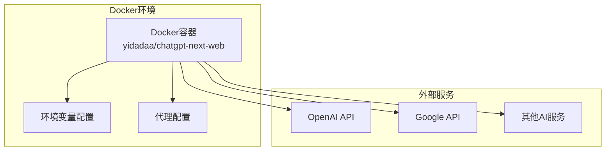
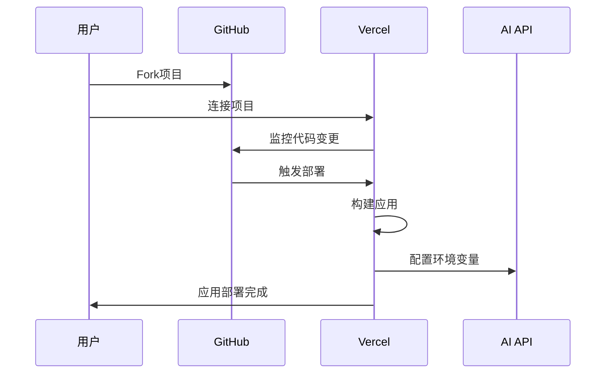
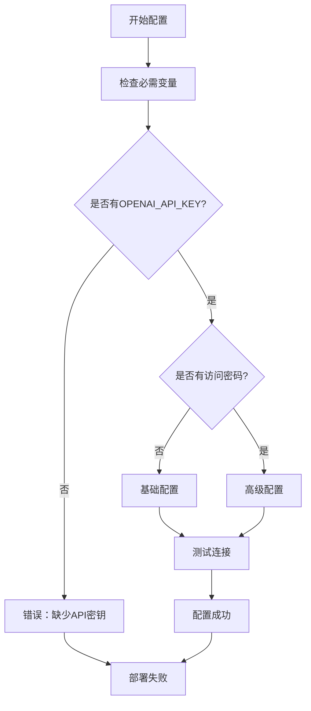
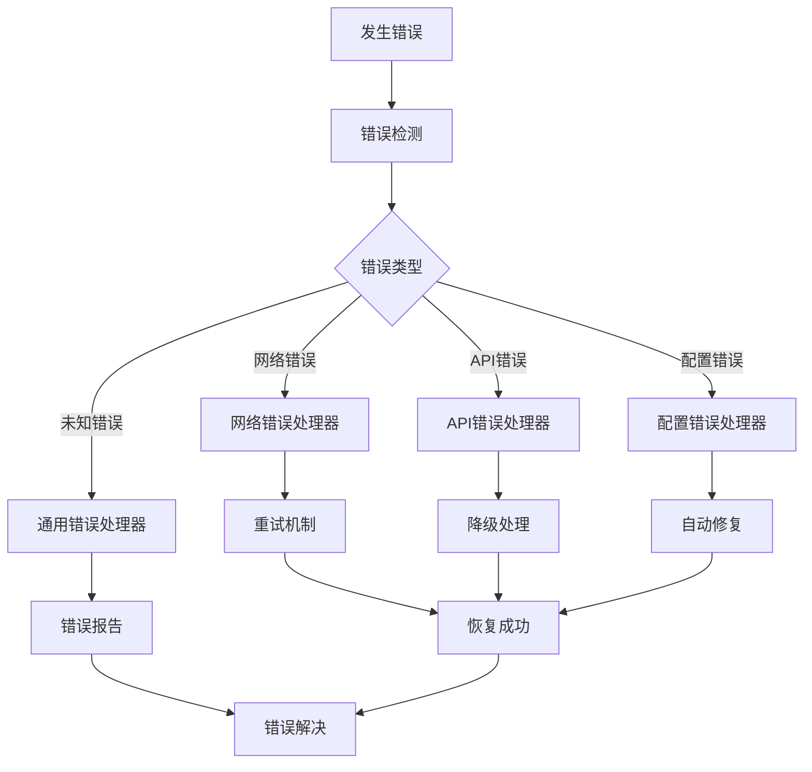

# 快速入门指南

<cite>
**本文档中引用的文件**
- [package.json](file://package.json)
- [README.md](file://README.md)
- [Dockerfile](file://Dockerfile)
- [docker-compose.yml](file://docker-compose.yml)
- [scripts/setup.sh](file://scripts/setup.sh)
- [vercel.json](file://vercel.json)
- [next.config.mjs](file://next.config.mjs)
- [app/constant.ts](file://app/constant.ts)
- [app/config/server.ts](file://app/config/server.ts)
- [app/config/build.ts](file://app/config/build.ts)
- [app/components/error.tsx](file://app/components/error.tsx)
</cite>

## 目录
1. [项目简介](#项目简介)
2. [环境准备](#环境准备)
3. [本地部署](#本地部署)
4. [Docker部署](#docker部署)
5. [Vercel云端部署](#vercel云端部署)
6. [配置环境变量](#配置环境变量)
7. [常见问题排查](#常见问题排查)
8. [总结](#总结)

## 项目简介

ChatGPT-Next-Web是一个轻量级、快速的AI助手应用，支持多种AI提供商，包括Claude、DeepSeek、GPT-4和Gemini Pro等。该项目采用现代化的技术栈构建，提供了丰富的功能特性，适合初学者快速上手和部署。

### 主要特性
- 支持多种AI提供商（OpenAI、Google、Anthropic等）
- 响应式设计，支持暗色模式和PWA
- Markdown支持（LaTeX、mermaid、代码高亮等）
- 隐私优先，所有数据存储在浏览器本地
- 多语言支持（英语、中文、日语、法语等）

## 环境准备

### 系统要求

在开始之前，请确保您的系统满足以下要求：

- **Node.js**: 版本 >= 18
- **Docker**: 版本 >= 20（用于Docker部署）
- **操作系统**: Windows、macOS或Linux

### 安装必要工具

#### 方法一：手动安装（推荐给初学者）

1. **安装Node.js**
   - 访问 [Node.js官网](https://nodejs.org/) 下载并安装LTS版本
   - 验证安装：打开终端输入 `node --version` 和 `npm --version`

2. **安装Yarn包管理器**
   ```bash
   npm install -g yarn
   ```

3. **验证安装**
   ```bash
   node --version
   yarn --version
   ```

#### 方法二：使用自动化脚本

项目提供了一个自动化的安装脚本，可以自动检测并安装所需的依赖：

```bash
bash <(curl -s https://raw.githubusercontent.com/Yidadaa/ChatGPT-Next-Web/main/scripts/setup.sh)
```

**注意**：该脚本仅支持Ubuntu、Debian、CentOS、Arch Linux和macOS系统。

## 本地部署

### 步骤1：克隆仓库

```bash
git clone https://github.com/ChatGPTNextWeb/ChatGPT-Next-Web.git
cd ChatGPT-Next-Web
```

### 步骤2：安装依赖

```bash
yarn install
```

### 步骤3：配置环境变量

创建一个名为 `.env.local` 的文件在项目根目录：

```bash
# 打开编辑器创建文件
touch .env.local
```

在文件中添加以下内容：

```bash
# 必需的环境变量
OPENAI_API_KEY=your_openai_api_key_here

# 可选的访问密码（多个密码用逗号分隔）
CODE=your_password_here

# 可选的基础URL（当无法直接访问OpenAI时使用）
# BASE_URL=https://api.openai.com
```

### 步骤4：启动开发服务器

```bash
yarn dev
```

默认情况下，应用将在 `http://localhost:3000` 启动。

### 开发模式功能

- **热重载**: 修改代码后自动刷新页面
- **实时编译**: TypeScript和SCSS文件自动编译
- **多模型支持**: 可以同时配置多个AI提供商的API密钥

**章节来源**
- [package.json](file://package.json#L5-L21)
- [scripts/setup.sh](file://scripts/setup.sh#L57-L69)

## Docker部署

### 使用预构建镜像

这是最简单的部署方式：

```bash
# 拉取官方镜像
docker pull yidadaa/chatgpt-next-web

# 运行容器（基本配置）
docker run -d -p 3000:3000 \
  -e OPENAI_API_KEY=sk-your-api-key \
  -e CODE=your-password \
  yidadaa/chatgpt-next-web
```

### 使用Docker Compose

创建 `docker-compose.yml` 文件：

```yaml
version: "3.9"
services:
  chatgpt-next-web:
    container_name: chatgpt-next-web
    image: yidadaa/chatgpt-next-web
    ports:
      - 3000:3000
    environment:
      - OPENAI_API_KEY=${OPENAI_API_KEY}
      - CODE=${CODE}
      - BASE_URL=${BASE_URL}
      - GOOGLE_API_KEY=${GOOGLE_API_KEY}
```

然后运行：

```bash
docker-compose up -d
```

### 高级配置选项

#### 代理配置

```bash
# 基本代理配置
docker run -d -p 3000:3000 \
  -e OPENAI_API_KEY=sk-your-api-key \
  -e PROXY_URL=http://localhost:7890 \
  yidadaa/chatgpt-next-web

# 带认证的代理配置
docker run -d -p 3000:3000 \
  -e OPENAI_API_KEY=sk-your-api-key \
  -e PROXY_URL="http://127.0.0.1:7890 user pass" \
  yidadaa/chatgpt-next-web
```

#### MCP功能启用

```bash
docker run -d -p 3000:3000 \
  -e OPENAI_API_KEY=sk-your-api-key \
  -e CODE=your-password \
  -e ENABLE_MCP=true \
  yidadaa/chatgpt-next-web
```

### Docker部署架构图



**图表来源**
- [Dockerfile](file://Dockerfile#L1-L69)
- [docker-compose.yml](file://docker-compose.yml#L1-L39)

**章节来源**
- [Dockerfile](file://Dockerfile#L1-L69)
- [docker-compose.yml](file://docker-compose.yml#L1-L39)

## Vercel云端部署

### 一键部署

点击下方按钮即可在Vercel上一键部署：

[](https://vercel.com/new/clone?repository-url=https%3A%2F%2Fgithub.com%2FYidadaa%2FChatGPT-Next-Web&env=OPENAI_API_KEY&env=CODE&project-name=chatgpt-next-web&repository-name=ChatGPT-Next-Web)

### 手动部署步骤

1. **Fork项目**
   - 访问 [GitHub仓库](https://github.com/ChatGPTNextWeb/ChatGPT-Next-Web)
   - 点击右上角的"Fork"按钮

2. **连接到Vercel**
   - 登录[Vercel](https://vercel.com/)
   - 点击"New Project"
   - 选择"Fork Project"，选择您刚刚fork的项目
   - 在"Environment Variables"部分添加必要的环境变量

3. **配置环境变量**
   - `OPENAI_API_KEY`: 您的OpenAI API密钥
   - `CODE`: 访问密码（可选）

### 自动更新配置

为了保持应用最新，建议启用自动更新：

1. 在GitHub上启用Actions工作流
2. 设置每小时自动同步上游更新
3. 查看[详细教程](./docs/vercel-cn.md)

### Vercel部署流程图



**图表来源**
- [vercel.json](file://vercel.json#L1-L6)
- [README.md](file://README.md#L128-L130)

**章节来源**
- [README.md](file://README.md#L128-L130)
- [vercel.json](file://vercel.json#L1-L6)

## 配置环境变量

### 必需的环境变量

| 变量名 | 描述 | 示例值 |
|--------|------|--------|
| `OPENAI_API_KEY` | OpenAI API密钥 | `sk-xxxxxxxxxxxxxxxxxxxxxxxxxxxxxxxxxxxxxxxx` |
| `CODE` | 访问密码（可选） | `password1,password2` |

### 可选的环境变量

| 变量名 | 描述 | 默认值 |
|--------|------|--------|
| `BASE_URL` | OpenAI API基础URL | `https://api.openai.com` |
| `GOOGLE_API_KEY` | Google Gemini API密钥 | - |
| `ANTHROPIC_API_KEY` | Anthropic Claude API密钥 | - |
| `AZURE_URL` | Azure OpenAI服务URL | - |
| `AZURE_API_KEY` | Azure API密钥 | - |
| `GOOGLE_API_KEY` | Google API密钥 | - |
| `GOOGLE_URL` | Google API URL | - |

### 高级配置选项

#### 模型控制

```bash
# 自定义模型列表
CUSTOM_MODELS="+llama,-gpt-3.5-turbo,gpt-4-1106-preview=gpt-4-turbo"

# 禁用特定模型
DISABLE_GPT4=1

# 启用余额查询
ENABLE_BALANCE_QUERY=1
```

#### 功能开关

```bash
# 禁用用户输入API密钥
HIDE_USER_API_KEY=1

# 禁用快速链接解析
DISABLE_FAST_LINK=1

# 视觉模型列表
VISION_MODELS="gpt-4-vision,claude-3-opus"
```

### 环境变量配置流程



**图表来源**
- [app/config/server.ts](file://app/config/server.ts#L5-L43)
- [app/constant.ts](file://app/constant.ts#L1-L200)

**章节来源**
- [README.md](file://README.md#L173-L378)
- [app/config/server.ts](file://app/config/server.ts#L5-L43)

## 常见问题排查

### 环境变量缺失问题

**问题症状**：
- 应用启动但无法连接AI服务
- 控制台出现API密钥相关的错误信息

**解决方案**：
1. 检查 `.env.local` 文件是否存在且格式正确
2. 确保环境变量名称拼写无误
3. 验证API密钥的有效性

```bash
# 检查环境变量是否加载
echo $OPENAI_API_KEY
```

### 端口冲突问题

**问题症状**：
- 应用启动失败，提示端口被占用
- 无法访问应用

**解决方案**：

1. **更改端口号**（本地开发）
   ```bash
   # 修改package.json中的dev脚本
   "dev": "concurrently -r \"yarn run mask:watch\" \"next dev -p 3001\""
   ```

2. **查找并终止占用端口的进程**
   ```bash
   # macOS/Linux
   lsof -ti:3000 | xargs kill -9
   
   # Windows
   netstat -ano | findstr :3000
   taskkill /PID <PID> /F
   ```

### 网络连接问题

**问题症状**：
- 应用可以启动但无法获取响应
- 请求超时错误

**解决方案**：

1. **检查网络连接**
   ```bash
   curl -I https://api.openai.com
   ```

2. **配置代理（如果需要）**
   ```bash
   # Docker部署时配置代理
   docker run -e PROXY_URL=http://proxy-server:port
   ```

3. **使用备用API端点**
   ```bash
   # 在.env.local中设置
   BASE_URL=https://alternative-endpoint.com
   ```

### 权限问题

**问题症状**：
- 应用无法正常运行
- 出现权限拒绝错误

**解决方案**：

1. **检查文件权限**
   ```bash
   chmod 644 .env.local
   chown $USER:$USER .
   ```

2. **以管理员权限运行（仅Windows）**
   ```cmd
   # 右键点击命令提示符，选择"以管理员身份运行"
   ```

### 错误处理机制

项目内置了完善的错误处理机制：



**图表来源**
- [app/components/error.tsx](file://app/components/error.tsx#L45-L74)

### 调试技巧

1. **启用详细日志**
   ```bash
   # 设置调试环境变量
   DEBUG=* yarn dev
   ```

2. **检查浏览器开发者工具**
   - 打开F12
   - 查看Console标签页
   - 检查Network请求

3. **查看应用日志**
   ```bash
   # Docker容器日志
   docker logs chatgpt-next-web
   ```

**章节来源**
- [app/components/error.tsx](file://app/components/error.tsx#L45-L74)
- [app/config/build.ts](file://app/config/build.ts#L1-L46)

## 总结

通过本快速入门指南，您已经学会了：

1. **环境准备**: 安装Node.js、Yarn和必要的系统工具
2. **本地部署**: 克隆代码、安装依赖、配置环境变量、启动应用
3. **Docker部署**: 使用预构建镜像或Docker Compose进行容器化部署
4. **云端部署**: 一键部署到Vercel并配置自动更新
5. **配置管理**: 设置各种环境变量和高级功能
6. **问题排查**: 解决常见的部署和运行问题

### 下一步建议

1. **探索功能**: 尝试不同的AI提供商和服务
2. **自定义配置**: 根据需求调整模型和功能设置
3. **学习扩展**: 了解插件系统和自定义功能
4. **社区参与**: 加入项目社区，贡献代码或反馈问题

### 获取帮助

- **官方文档**: 查看项目的完整文档
- **GitHub Issues**: 报告问题或请求新功能
- **社区讨论**: 参与用户社区交流
- **FAQ**: 查看常见问题解答

祝您在使用ChatGPT-Next-Web的过程中获得愉快的体验！