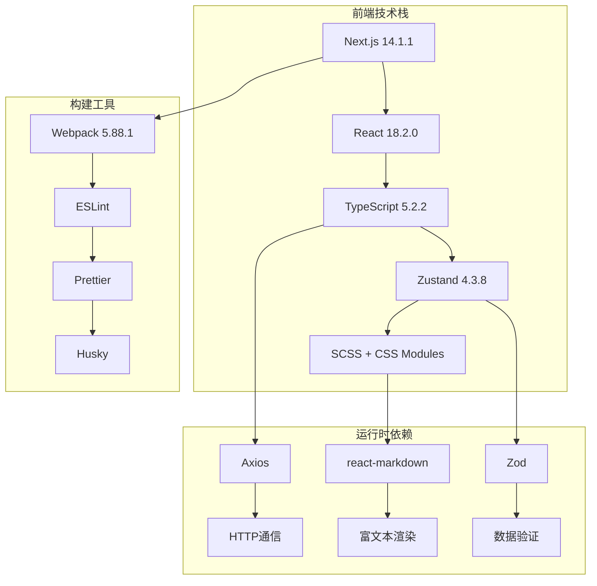
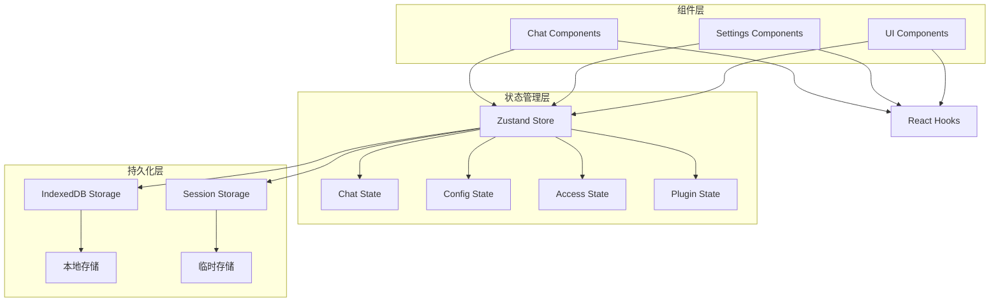

# 技术栈与依赖

<cite>
**本文档中引用的文件**
- [package.json](file://package.json)
- [next.config.mjs](file://next.config.mjs)
- [tsconfig.json](file://tsconfig.json)
- [jest.config.ts](file://jest.config.ts)
- [app/layout.tsx](file://app/layout.tsx)
- [app/store/index.ts](file://app/store/index.ts)
- [app/store/chat.ts](file://app/store/chat.ts)
- [app/utils/api.ts](file://app/utils/api.ts)
- [app/components/markdown.tsx](file://app/components/markdown.tsx)
- [app/config/client.ts](file://app/config/client.ts)
- [app/global.d.ts](file://app/global.d.ts)
- [app/client/api.ts](file://app/client/api.ts)
- [app/utils/store.ts](file://app/utils/store.ts)
- [app/constant.ts](file://app/constant.ts)
- [test/model-available.test.ts](file://test/model-available.test.ts)
</cite>

## 目录
1. [项目概述](#项目概述)
2. [核心技术栈](#核心技术栈)
3. [Next.js框架深度解析](#nextjs框架深度解析)
4. [TypeScript类型系统](#typescript类型系统)
5. [状态管理架构](#状态管理架构)
6. [关键依赖库详解](#关键依赖库详解)
7. [测试框架与质量保证](#测试框架与质量保证)
8. [依赖分类与工程考量](#依赖分类与工程考量)
9. [总结](#总结)

## 项目概述

ChatGPT-Next-Web是一个基于Next.js构建的现代化聊天界面应用，支持多种AI模型提供商，具备强大的富文本渲染能力和完善的测试体系。该项目采用了当前前端开发的最佳实践，展现了现代Web应用的技术架构精髓。

## 核心技术栈

### 前端框架层
- **Next.js 14.1.1**: React全栈框架，提供服务端渲染(SSR)和静态站点生成(SSG)能力
- **React 18.2.0**: 用户界面构建库，支持并发特性和更好的性能表现
- **TypeScript 5.2.2**: 强类型JavaScript超集，提供编译时类型检查和智能开发体验

### 状态管理层
- **Zustand 4.3.8**: 轻量级状态管理库，提供简洁的API和良好的性能表现
- **React Hooks**: 组件状态和生命周期管理的核心机制

### 渲染与样式层
- **SCSS**: CSS预处理器，提供变量、嵌套、混合等功能
- **CSS Modules**: 样式隔离方案，避免全局样式冲突
- **SVG处理**: 使用@svgr/webpack处理矢量图形资源

### 工具链与构建
- **Webpack 5.88.1**: 模块打包工具，支持代码分割和优化
- **ESLint + Prettier**: 代码质量和格式化工具
- **Husky + lint-staged**: Git钩子工具，确保提交代码质量



**图表来源**
- [package.json](file://package.json#L23-L58)
- [next.config.mjs](file://next.config.mjs#L1-L112)
- [tsconfig.json](file://tsconfig.json#L1-L29)

## Next.js框架深度解析

### 服务端渲染(SSR)与API路由

Next.js 14.1.1提供了强大的服务端渲染能力，项目充分利用了其特性：

#### API路由架构
项目采用文件系统路由的方式组织API接口，每个提供商都有独立的路由文件：
- `/app/api/[provider]/[...path]/route.ts`: 动态API路由
- `/app/api/openai/route.ts`: OpenAI特定接口
- `/app/api/anthropic/route.ts`: Anthropic特定接口

这种设计实现了：
- **自动路由发现**: 文件名即路由路径
- **类型安全**: TypeScript提供完整的类型推导
- **模块化组织**: 不同提供商的逻辑分离清晰

#### 服务端配置
通过`next.config.mjs`配置Next.js的行为：

```javascript
// 关键配置项
const nextConfig = {
  webpack(config) {
    // SVG处理配置
    config.module.rules.push({
      test: /\.svg$/,
      use: ["@svgr/webpack"],
    });
    
    // 构建优化配置
    if (disableChunk) {
      config.plugins.push(
        new webpack.optimize.LimitChunkCountPlugin({ maxChunks: 1 }),
      );
    }
    
    return config;
  },
  
  // 输出模式配置
  output: mode,
  
  // 图片优化配置
  images: {
    unoptimized: mode === "export",
  },
};
```

#### 客户端-服务端配置分离
项目实现了灵活的配置管理策略：

```typescript
// 客户端配置获取
export function getClientConfig() {
  if (typeof document !== "undefined") {
    return JSON.parse(queryMeta("config") || "{}") as BuildConfig;
  }
  
  if (typeof process !== "undefined") {
    return getBuildConfig();
  }
}
```

**章节来源**
- [next.config.mjs](file://next.config.mjs#L1-L112)
- [app/config/client.ts](file://app/config/client.ts#L1-L28)
- [app/layout.tsx](file://app/layout.tsx#L1-L73)

### 静态站点生成(SSG)与增量静态再生(ISR)

项目支持多种构建模式：
- **standalone**: 单体部署模式，包含所有依赖
- **export**: 静态导出模式，适合CDN部署
- **development**: 开发模式，支持热重载

### 中间件与重写规则

项目配置了丰富的API代理和重写规则，支持多平台API调用：

```javascript
// API代理重写规则示例
{
  source: "/api/proxy/azure/:resource_name/deployments/:deploy_name/:path*",
  destination: "https://:resource_name.openai.azure.com/openai/deployments/:deploy_name/:path*",
}
```

## TypeScript类型系统

### 类型定义架构

项目建立了完整的类型系统，涵盖以下方面：

#### 核心类型定义
```typescript
// 消息类型
export type ChatMessage = RequestMessage & {
  date: string;
  streaming?: boolean;
  isError?: boolean;
  id: string;
  model?: ModelType;
};

// 请求消息类型
export interface RequestMessage {
  role: MessageRole;
  content: string | MultimodalContent[];
}

// 模型配置类型
export interface ModelConfig {
  model: string;
  providerName?: string;
  temperature?: number;
  top_p?: number;
  stream?: boolean;
}
```

#### 类型安全的API调用
```typescript
// 安全的HTTP请求类型
export interface ChatOptions {
  messages: RequestMessage[];
  config: LLMConfig;
  
  onUpdate?: (message: string, chunk: string) => void;
  onFinish: (message: string, responseRes: Response) => void;
  onError?: (err: Error) => void;
}
```

#### 全局类型声明
项目在`global.d.ts`中定义了全局类型：

```typescript
declare interface Window {
  __TAURI__?: {
    writeText(text: string): Promise<void>;
    invoke(command: string, payload?: Record<string, unknown>): Promise<any>;
    // ... 其他Tauri API
  };
}
```

### 类型推导与IDE支持

TypeScript配置确保了：
- **严格模式**: 启用了所有严格类型检查选项
- **模块解析**: 支持路径映射和模块别名
- **JSX支持**: React组件的完整类型支持

**章节来源**
- [app/store/chat.ts](file://app/store/chat.ts#L57-L66)
- [app/client/api.ts](file://app/client/api.ts#L49-L52)
- [app/global.d.ts](file://app/global.d.ts#L1-L44)
- [tsconfig.json](file://tsconfig.json#L1-L29)

## 状态管理架构

### Zustand状态管理

项目采用Zustand作为主要的状态管理解决方案，实现了以下特点：

#### 状态持久化
```typescript
export function createPersistStore<T extends object, M>(
  state: T,
  methods: (
    set: SetStoreState<T & MakeUpdater<T>>,
    get: () => T & MakeUpdater<T>,
  ) => M,
  persistOptions: SecondParam<typeof persist<T & M & MakeUpdater<T>>>,
) {
  persistOptions.storage = createJSONStorage(() => indexedDBStorage);
  // ... 持久化逻辑
}
```

#### 多状态模块化
状态管理按功能模块划分：
- **chat.ts**: 聊天会话状态
- **config.ts**: 应用配置状态  
- **access.ts**: 访问控制状态
- **plugin.ts**: 插件状态
- **mask.ts**: 掩码状态

#### 实时状态同步
```typescript
// 状态更新监听
markUpdate() {
  set({ lastUpdateTime: Date.now() } as Partial<
    T & M & MakeUpdater<T>
  >);
},
update(updater) {
  const state = deepClone(get());
  updater(state);
  set({
    ...state,
    lastUpdateTime: Date.now(),
  });
}
```

### 状态流架构图



**图表来源**
- [app/utils/store.ts](file://app/utils/store.ts#L29-L79)
- [app/store/index.ts](file://app/store/index.ts#L1-L6)

**章节来源**
- [app/utils/store.ts](file://app/utils/store.ts#L1-L79)
- [app/store/chat.ts](file://app/store/chat.ts#L1-L800)

## 关键依赖库详解

### Axios - HTTP通信库

虽然项目中没有直接使用Axios，但通过`openapi-client-axios`间接利用了其功能：

#### 主要用途
- **API客户端**: 提供统一的API调用接口
- **错误处理**: 统一的HTTP错误处理机制
- **拦截器**: 请求和响应拦截器配置

#### 集成方式
```typescript
import { openapiClientAxios } from 'openapi-client-axios';
// 用于生成类型安全的API客户端
```

### react-markdown与rehype插件生态

项目使用了完整的Markdown渲染生态系统：

#### 核心组件架构
```typescript
function _MarkDownContent(props: { content: string }) {
  return (
    <ReactMarkdown
      remarkPlugins={[RemarkMath, RemarkGfm, RemarkBreaks]}
      rehypePlugins={[
        RehypeKatex,
        [RehypeHighlight, { detect: false, ignoreMissing: true }],
      ]}
      components={{
        pre: PreCode,
        code: CustomCode,
        p: (pProps) => <p {...pProps} dir="auto" />,
      }}
    >
      {escapedContent}
    </ReactMarkdown>
  );
}
```

#### 插件功能详解

| 插件名称 | 功能描述 | 使用场景 |
|---------|---------|---------|
| react-markdown | 基础Markdown解析 | 文本内容渲染 |
| remark-math | LaTeX数学公式支持 | 数学公式显示 |
| remark-gfm | GitHub Flavored Markdown | GitHub风格表格和任务列表 |
| remark-breaks | 自动换行支持 | 段落自动换行 |
| rehype-katex | KaTeX渲染引擎 | 数学公式LaTeX渲染 |
| rehype-highlight | 代码高亮 | 语法高亮显示 |

#### 自定义渲染组件
```typescript
// 代码块自定义渲染
function PreCode(props: { children: any }) {
  // 支持Mermaid图表渲染
  // 支持HTML预览功能
  // 支持代码折叠
}
```

### Zod - 数据验证

项目使用Zod进行运行时数据验证：

#### 主要用途
- **API响应验证**: 确保API返回数据的正确性
- **表单数据验证**: 用户输入数据的验证
- **配置数据验证**: 应用配置的类型检查

#### 验证示例
```typescript
import { z } from 'zod';

const ChatMessageSchema = z.object({
  id: z.string(),
  role: z.enum(['user', 'assistant']),
  content: z.union([z.string(), z.array(z.any())]),
  date: z.string(),
});
```

### 其他重要依赖

#### 性能优化库
- **use-debounce 9.0.4**: 防抖动Hook，优化用户输入响应
- **nanoid 5.0.3**: 高性能唯一ID生成器

#### 工具库
- **clsx 2.1.1**: 条件类名组合工具
- **lodash-es 4.17.21**: ES模块化的工具函数库
- **idb-keyval 6.2.1**: IndexedDB键值对存储

#### 多媒体处理
- **html-to-image 1.11.11**: HTML转图片功能
- **spark-md5 3.0.2**: MD5哈希计算
- **node-fetch 3.3.1**: Fetch API的Node.js实现

**章节来源**
- [app/components/markdown.tsx](file://app/components/markdown.tsx#L1-L353)
- [package.json](file://package.json#L31-L58)

## 测试框架与质量保证

### Jest测试框架配置

项目采用Jest作为主要测试框架，配置了完整的测试环境：

#### 测试配置架构
```typescript
const config: Config = {
  coverageProvider: "v8",
  testEnvironment: "jsdom",
  testMatch: ["**/*.test.js", "**/*.test.ts", "**/*.test.jsx", "**/*.test.tsx"],
  setupFilesAfterEnv: ["<rootDir>/jest.setup.ts"],
  moduleNameMapper: {
    "^@/(.*)$": "<rootDir>/$1",
  },
  extensionsToTreatAsEsm: [".ts", ".tsx"],
  injectGlobals: true,
};
```

#### 测试环境特点
- **jsdom**: 提供DOM环境模拟
- **ESM支持**: 支持ES模块测试
- **覆盖率报告**: 使用V8引擎生成覆盖率报告
- **模块别名**: 支持`@/`路径别名

### 测试策略与覆盖范围

#### 单元测试覆盖
项目包含了多个功能模块的单元测试：

```typescript
// 模型可用性测试
describe("isModelNotavailableInServer", () => {
  test("test model will return false, which means the model is available", () => {
    const result = isModelNotavailableInServer("", "gpt-4", "OpenAI");
    expect(result).toBe(false);
  });
  
  test("should respect DISABLE_GPT4 setting", () => {
    process.env.DISABLE_GPT4 = "1";
    const result = isModelNotavailableInServer("", "gpt-4", "OpenAI");
    expect(result).toBe(true);
  });
});
```

#### 测试模块分类

| 测试文件 | 测试目标 | 覆盖功能 |
|---------|---------|---------|
| model-available.test.ts | 模型可用性检查 | 模型黑名单、环境变量控制 |
| model-provider.test.ts | 模型提供商验证 | API调用、错误处理 |
| sum-module.test.ts | 辅助模块测试 | 工具函数、辅助方法 |
| vision-model-checker.test.ts | 视觉模型检测 | 视觉能力识别、模型匹配 |

### 代码质量保证

#### ESLint配置
项目使用了严格的ESLint配置：
- **eslint-config-next**: Next.js官方推荐配置
- **eslint-config-prettier**: 与Prettier集成
- **eslint-plugin-unused-imports**: 未使用导入检测

#### Git钩子集成
通过Husky和lint-staged实现：
- **pre-commit**: 代码格式化和类型检查
- **pre-push**: 完整的测试执行

**章节来源**
- [jest.config.ts](file://jest.config.ts#L1-L24)
- [test/model-available.test.ts](file://test/model-available.test.ts#L1-L81)
- [package.json](file://package.json#L77-L91)

## 依赖分类与工程考量

### 生产依赖分析

#### 核心框架依赖
```json
{
  "next": "^14.1.1",
  "react": "^18.2.0", 
  "react-dom": "^18.2.0",
  "typescript": "5.2.2"
}
```
**工程考量**:
- **Next.js 14.1.1**: 最新稳定版本，支持App Router和Server Components
- **React 18.2.0**: 并发特性支持，提升用户体验
- **TypeScript 5.2.2**: 最新类型系统特性

#### 状态管理与工具
```json
{
  "zustand": "^4.3.8",
  "clsx": "^2.1.1",
  "lodash-es": "^4.17.21",
  "nanoid": "^5.0.3"
}
```
**工程考量**:
- **Zustand**: 轻量级状态管理，减少框架耦合
- **clsx**: 条件类名组合，提高样式管理效率
- **lodash-es**: ES模块化工具库，按需加载
- **nanoid**: 高性能唯一ID生成，替代UUID

#### 渲染与多媒体
```json
{
  "react-markdown": "^8.0.7",
  "rehype-highlight": "^6.0.0",
  "rehype-katex": "^6.0.3",
  "remark-math": "^5.1.1",
  "mermaid": "^10.6.1"
}
```
**工程考量**:
- **react-markdown**: 类似GitHub的Markdown渲染
- **rehype系列**: 丰富的插件生态，支持数学公式和代码高亮
- **mermaid**: 支持图表渲染，增强文档表达能力

### 开发依赖分析

#### 构建与工具链
```json
{
  "@testing-library/jest-dom": "^6.6.3",
  "@testing-library/react": "^16.1.0",
  "jest": "^29.7.0",
  "eslint": "^8.49.0",
  "prettier": "^3.0.2",
  "husky": "^8.0.0"
}
```
**工程考量**:
- **Testing Library**: DOM测试工具，模拟真实用户交互
- **Jest**: 快速测试框架，支持快照测试和Mock
- **ESLint**: 代码质量保证，防止潜在错误
- **Prettier**: 代码格式化，统一团队编码风格
- **Husky**: Git钩子管理，自动化代码检查

#### 类型定义与开发体验
```json
{
  "@types/jest": "^29.5.14",
  "@types/react": "^18.2.70",
  "@types/node": "^20.11.30",
  "ts-node": "^10.9.2",
  "tsx": "^4.16.0"
}
```
**工程考量**:
- **类型定义**: 完整的第三方库类型支持
- **开发工具**: TSX提供TypeScript执行环境
- **热重载**: 提升开发效率

### 技术选型决策

#### 为什么选择Next.js
1. **全栈能力**: 服务端渲染+静态生成+API路由
2. **SEO友好**: 自动生成SEO友好的页面
3. **性能优化**: 自带代码分割和懒加载
4. **开发体验**: 热重载、类型安全、自动路由

#### 为什么选择Zustand
1. **轻量级**: 无框架耦合，易于迁移
2. **类型安全**: 与TypeScript完美集成
3. **学习成本低**: API简单易用
4. **性能优秀**: 最小化重新渲染

#### 为什么选择react-markdown
1. **生态完善**: 丰富的插件生态系统
2. **安全性**: XSS防护机制
3. **可扩展性**: 自定义渲染组件
4. **社区活跃**: 持续维护和更新

**章节来源**
- [package.json](file://package.json#L23-L91)
- [next.config.mjs](file://next.config.mjs#L1-L112)

## 总结

ChatGPT-Next-Web展现了一个现代前端项目的最佳实践集合。通过深入分析其技术栈和依赖，我们可以看到：

### 技术架构优势
- **全栈统一**: Next.js提供了完整的全栈解决方案
- **类型安全**: TypeScript确保了代码质量和开发体验
- **状态管理**: Zustand提供了简洁高效的状态管理方案
- **渲染能力**: react-markdown生态支持丰富的富文本展示

### 工程实践亮点
- **模块化设计**: 清晰的功能模块划分
- **测试驱动**: 完整的测试覆盖和质量保证
- **性能优化**: 多层次的性能优化策略
- **开发体验**: 优秀的开发工具链和工作流程

### 可借鉴的经验
1. **技术选型**: 选择成熟稳定的主流技术
2. **架构设计**: 注重模块化和可扩展性
3. **质量保证**: 建立完善的测试和检查机制
4. **用户体验**: 重视性能和开发体验

这个项目不仅是一个功能完善的聊天界面应用，更是现代前端开发技术栈的优秀实践案例，为类似项目的技术选型和架构设计提供了宝贵的参考价值。