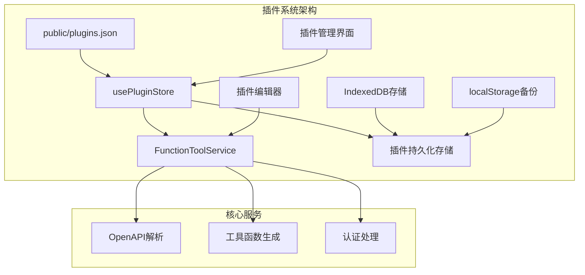
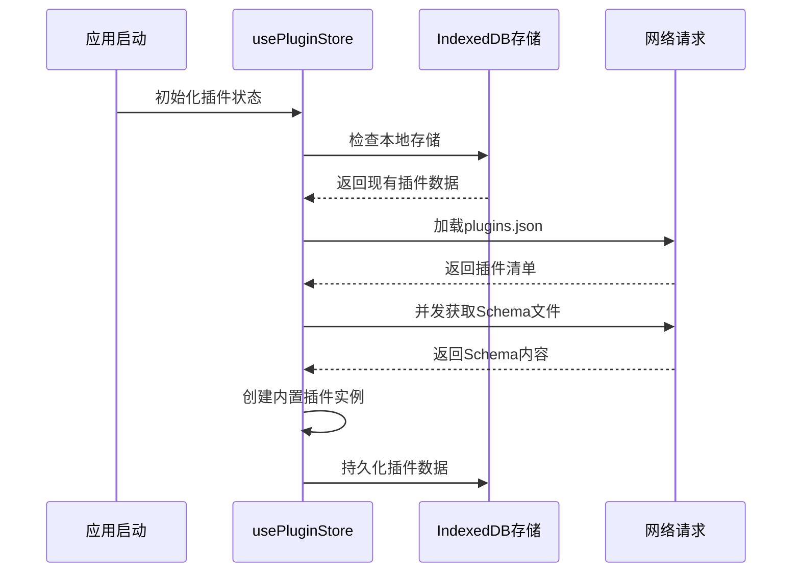
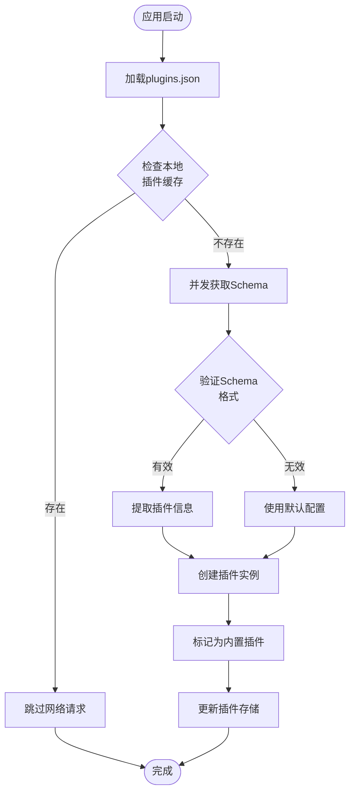
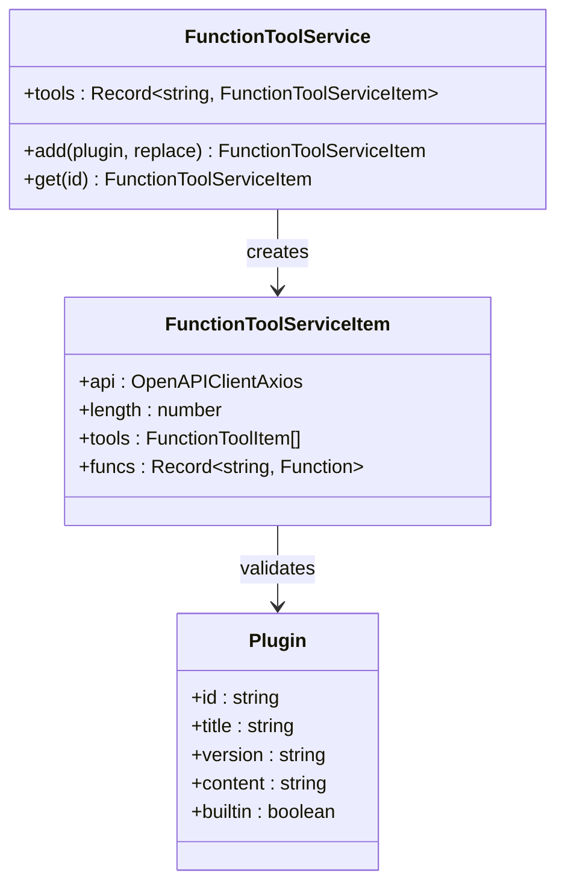
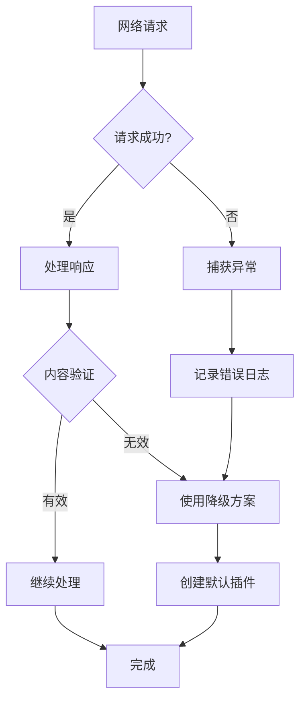
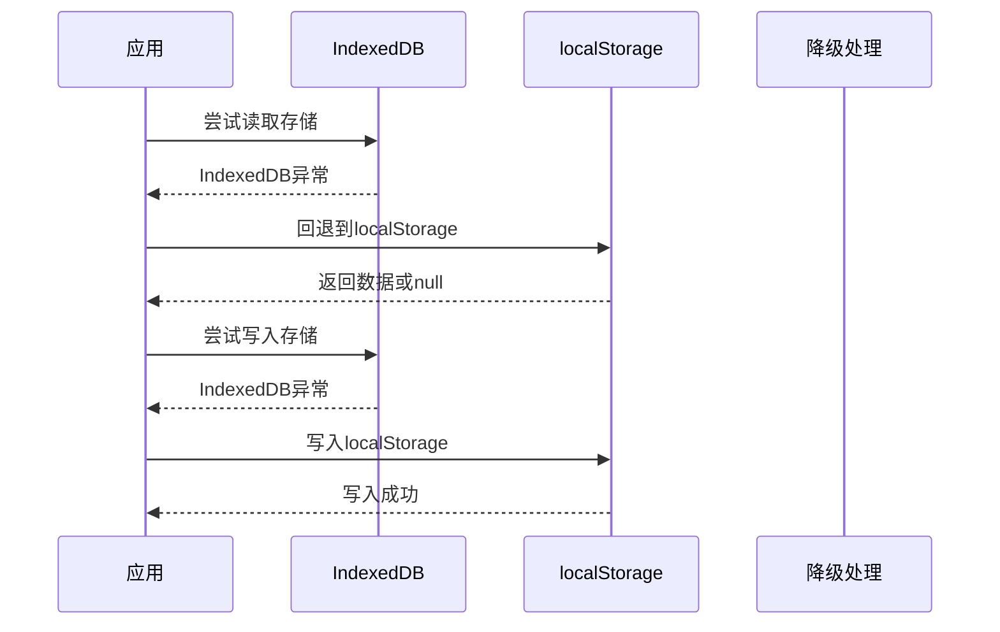
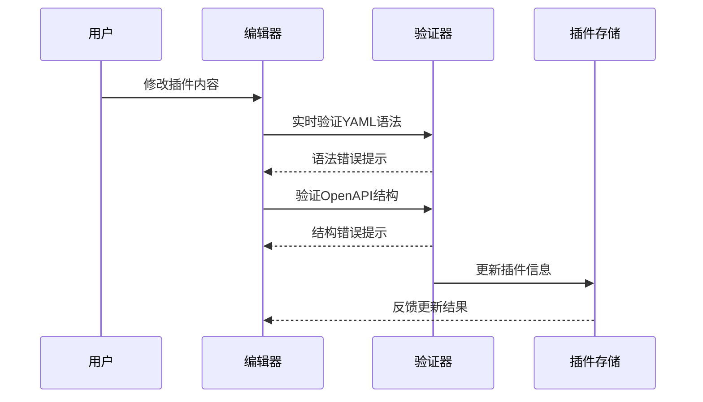

# 插件发现与注册机制

<cite>
**本文档中引用的文件**
- [public/plugins.json](file://public/plugins.json)
- [app/store/plugin.ts](file://app/store/plugin.ts)
- [app/components/plugin.tsx](file://app/components/plugin.tsx)
- [app/utils/store.ts](file://app/utils/store.ts)
- [app/utils/indexedDB-storage.ts](file://app/utils/indexedDB-storage.ts)
- [app/constant.ts](file://app/constant.ts)
</cite>

## 目录
1. [简介](#简介)
2. [项目结构概览](#项目结构概览)
3. [plugins.json文件结构设计](#pluginsjson文件结构设计)
4. [usePluginStore初始化与存储机制](#usepluginstore初始化与存储机制)
5. [内置插件自动发现流程](#内置插件自动发现流程)
6. [FunctionToolService验证与Schema处理](#functiontoolservice验证与schema处理)
7. [网络异常处理与降级策略](#网络异常处理与降级策略)
8. [插件管理界面](#插件管理界面)
9. [架构总结](#架构总结)

## 简介

ChatGPT-Next-Web采用了一套完整的插件发现与自动注册机制，支持从远程URL加载内置插件清单，并自动解析OpenAPI Schema内容。该系统具备强大的容错能力和降级策略，确保主应用在插件加载失败时仍能正常运行。

## 项目结构概览

插件系统的核心组件分布在以下关键文件中：

**图表来源**
- [app/store/plugin.ts](file://app/store/plugin.ts#L172-L271)
- [app/utils/store.ts](file://app/utils/store.ts#L29-L78)

## plugins.json文件结构设计

### 文件位置与作用

plugins.json位于public目录下，作为内置插件的清单文件，定义了所有可用的内置插件的基本信息。

### 结构设计详解

| 字段名 | 类型 | 必需 | 描述 | 示例值 |
|--------|------|------|------|--------|
| id | string | 是 | 插件唯一标识符 | "dalle3" |
| name | string | 是 | 插件显示名称 | "Dalle3" |
| schema | string | 是 | OpenAPI Schema文件的远程URL地址 | 完整的HTTPS URL |

### 字段用途说明

- **id字段**: 用于插件的唯一标识，在插件存储和检索过程中使用
- **name字段**: 用户界面中显示的插件名称
- **schema字段**: 指向包含OpenAPI规范的JSON或YAML文件的URL

**章节来源**
- [public/plugins.json](file://public/plugins.json#L1-L18)

## usePluginStore初始化与存储机制

### 存储初始化流程

**图表来源**
- [app/store/plugin.ts](file://app/store/plugin.ts#L233-L269)

### onRehydrateStorage钩子实现

onRehydrateStorage是插件存储初始化的核心钩子，负责从远程URL加载内置插件清单：

1. **环境检查**: 首先检查是否在浏览器环境中运行
2. **清单加载**: 从./plugins.json路径获取插件清单
3. **并发Schema获取**: 对每个插件并发获取其OpenAPI Schema内容
4. **插件创建**: 将有效插件添加到插件存储中
5. **信息提取**: 从Schema中提取插件标题和版本信息

### 存储机制特点

- **双层存储**: 使用IndexedDB作为主要存储，localStorage作为备份
- **持久化**: 插件数据在页面刷新后仍然保留
- **版本控制**: 支持存储格式的版本管理

**章节来源**
- [app/store/plugin.ts](file://app/store/plugin.ts#L233-L269)
- [app/utils/store.ts](file://app/utils/store.ts#L37-L42)

## 内置插件自动发现流程

### 发现机制详解

**图表来源**
- [app/store/plugin.ts](file://app/store/plugin.ts#L242-L267)

### 自动创建流程

1. **清单解析**: 解析plugins.json中的插件列表
2. **重复检查**: 检查本地是否已存在同ID的插件
3. **Schema获取**: 并发获取各插件的OpenAPI Schema内容
4. **插件实例化**: 调用state.create()创建插件对象
5. **信息填充**: 通过FunctionToolService提取插件元数据
6. **状态标记**: 设置builtin=true标识为内置插件

### 插件类型区分

- **内置插件**: 由系统预定义，builtin=true，不可删除
- **用户插件**: 由用户创建，builtin=false，可编辑删除

**章节来源**
- [app/store/plugin.ts](file://app/store/plugin.ts#L258-L267)

## FunctionToolService验证与Schema处理

### Schema验证机制

**图表来源**
- [app/store/plugin.ts](file://app/store/plugin.ts#L41-L155)

### Schema处理流程

1. **YAML解析**: 使用js-yaml解析插件内容
2. **OpenAPI客户端初始化**: 创建OpenAPIClientAxios实例
3. **操作提取**: 获取所有可用的操作（API端点）
4. **工具项生成**: 将每个操作转换为FunctionToolItem
5. **函数映射**: 生成可调用的函数映射表

### 认证处理

- **认证类型**: 支持Bearer Token、Basic Auth、自定义认证
- **认证位置**: 支持Header、Query参数、Body三种位置
- **令牌管理**: 自动处理令牌注入和刷新

### 错误处理

- **初始化失败**: api.initSync()的异常被静默处理
- **Schema无效**: 无效的Schema不会阻止插件加载
- **操作缺失**: 缺少必要字段时提供默认值

**章节来源**
- [app/store/plugin.ts](file://app/store/plugin.ts#L42-L151)

## 网络异常处理与降级策略

### 异常处理机制

**图表来源**
- [app/store/plugin.ts](file://app/store/plugin.ts#L247-L253)

### 降级策略实现

1. **网络请求失败**: 当Schema获取失败时，使用原始插件配置
2. **Schema解析失败**: 无效的Schema内容不会影响其他插件
3. **存储异常**: IndexedDB访问失败时回退到localStorage
4. **初始化失败**: 插件加载失败不影响应用主流程

### 存储降级机制

**图表来源**
- [app/utils/indexedDB-storage.ts](file://app/utils/indexedDB-storage.ts#L8-L47)

### 容错设计原则

- **最小影响**: 单个插件失败不影响整体功能
- **渐进式加载**: 插件按需加载，不阻塞应用启动
- **优雅降级**: 失败时提供基本功能而非完全崩溃
- **状态恢复**: 支持从失败状态中恢复

**章节来源**
- [app/utils/indexedDB-storage.ts](file://app/utils/indexedDB-storage.ts#L8-L47)

## 插件管理界面

### 界面功能特性

插件管理界面提供了完整的插件生命周期管理功能：

| 功能模块 | 描述 | 实现方式 |
|----------|------|----------|
| 插件列表 | 显示所有已安装的插件 | 基于usePluginStore的状态管理 |
| 搜索过滤 | 按名称搜索插件 | 实时文本匹配算法 |
| 插件编辑 | 编辑插件的OpenAPI内容 | 基于OpenAPIClientAxios的实时验证 |
| URL导入 | 从远程URL导入插件 | 支持代理模式的跨域请求 |
| 认证配置 | 配置插件认证信息 | 下拉菜单选择认证类型 |

### 编辑器验证机制

**图表来源**
- [app/components/plugin.tsx](file://app/components/plugin.tsx#L60-L86)

### 错误处理与用户体验

- **实时验证**: 使用useDebouncedCallback避免频繁验证
- **错误提示**: 通过showToast显示具体的错误信息
- **语法高亮**: 提供更好的编辑体验
- **格式化**: 自动格式化JSON/YAML内容

**章节来源**
- [app/components/plugin.tsx](file://app/components/plugin.tsx#L60-L117)

## 架构总结

### 核心设计理念

插件发现与注册机制采用了以下核心设计原则：

1. **模块化分离**: 插件清单、存储、验证、界面各司其职
2. **异步优先**: 所有网络操作采用异步处理，不阻塞主线程
3. **容错性强**: 多层次的异常处理和降级策略
4. **性能优化**: 并发处理多个插件，延迟加载非关键资源

### 技术栈特点

- **状态管理**: 基于zustand的轻量级状态管理
- **持久化**: IndexedDB + localStorage的双重保障
- **HTTP客户端**: OpenAPIClientAxios提供标准化的API调用
- **存储中间件**: 自定义的存储中间件支持版本控制和迁移

### 扩展性考虑

- **插件类型**: 支持多种认证方式和配置选项
- **Schema格式**: 兼容JSON和YAML格式的OpenAPI规范
- **网络协议**: 支持HTTP/HTTPS和代理模式
- **错误恢复**: 完善的错误处理和状态恢复机制

这套插件发现与注册机制为ChatGPT-Next-Web提供了强大而灵活的扩展能力，同时确保了系统的稳定性和用户体验。