# 插件管理

<cite>
**本文档中引用的文件**
- [app/store/plugin.ts](file://app/store/plugin.ts)
- [app/components/plugin.tsx](file://app/components/plugin.tsx)
- [public/plugins.json](file://public/plugins.json)
- [app/constant.ts](file://app/constant.ts)
- [app/utils/store.ts](file://app/utils/store.ts)
- [app/components/ui-lib.tsx](file://app/components/ui-lib.tsx)
</cite>

## 目录
1. [简介](#简介)
2. [项目结构](#项目结构)
3. [核心组件](#核心组件)
4. [架构概览](#架构概览)
5. [详细组件分析](#详细组件分析)
6. [依赖关系分析](#依赖关系分析)
7. [性能考虑](#性能考虑)
8. [故障排除指南](#故障排除指南)
9. [结论](#结论)

## 简介

插件管理系统是ChatGPT-Next-Web项目中的重要组成部分，它提供了完整的插件生命周期管理功能，包括插件的创建、更新、删除和查询操作。该系统采用基于OpenAPI规范的插件架构，支持多种认证方式，并通过状态管理器实现了数据的持久化存储。

系统的核心设计理念是模块化和可扩展性，通过Plugin类型定义统一的插件结构，支持内置插件和用户自定义插件的混合管理。同时，系统集成了丰富的UI组件，为用户提供直观的插件管理界面。

## 项目结构

插件管理模块在项目中的组织结构如下：

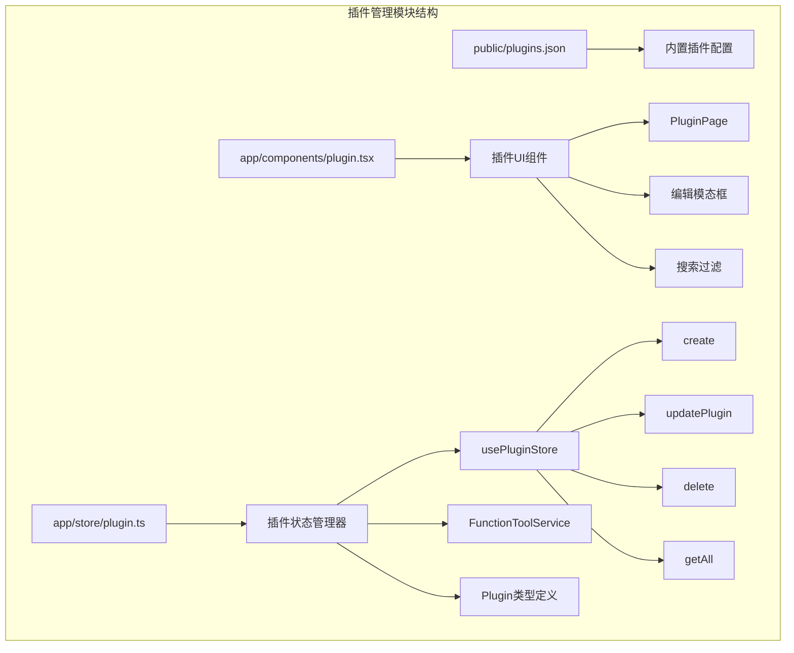

**图表来源**
- [app/store/plugin.ts](file://app/store/plugin.ts#L12-L23)
- [app/components/plugin.tsx](file://app/components/plugin.tsx#L33-L371)

**章节来源**
- [app/store/plugin.ts](file://app/store/plugin.ts#L1-L272)
- [app/components/plugin.tsx](file://app/components/plugin.tsx#L1-L371)

## 核心组件

### Plugin类型定义

插件系统的核心数据结构定义了插件的基本属性和配置选项：

| 字段名 | 类型 | 必需 | 描述 |
|--------|------|------|------|
| id | string | 是 | 插件唯一标识符，使用nanoid生成 |
| createdAt | number | 是 | 插件创建时间戳 |
| title | string | 是 | 插件显示名称 |
| version | string | 是 | 插件版本号，默认"1.0.0" |
| content | string | 是 | 插件内容，通常是OpenAPI规范的YAML格式 |
| builtin | boolean | 是 | 是否为内置插件标识 |
| authType | string | 否 | 认证类型：basic/bearer/custom |
| authLocation | string | 否 | 认证位置：header/query/body |
| authHeader | string | 否 | 自定义认证头名称 |
| authToken | string | 否 | 认证令牌 |

### usePluginStore状态管理器

状态管理器提供了完整的CRUD操作接口，采用Zustand库实现，支持数据持久化存储：

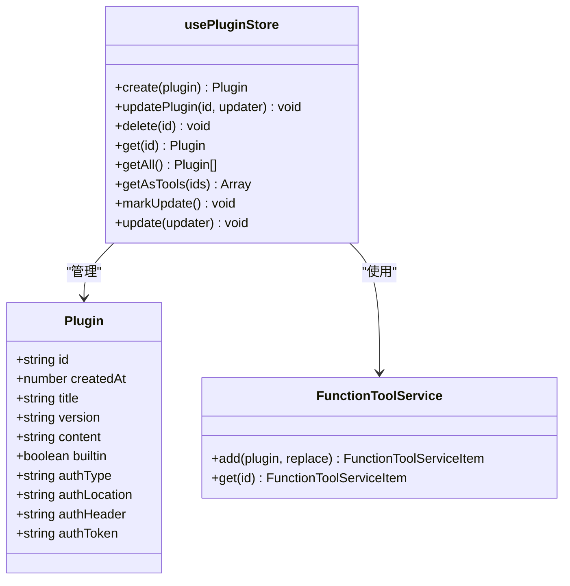

**图表来源**
- [app/store/plugin.ts](file://app/store/plugin.ts#L172-L272)
- [app/store/plugin.ts](file://app/store/plugin.ts#L12-L23)

**章节来源**
- [app/store/plugin.ts](file://app/store/plugin.ts#L12-L23)
- [app/store/plugin.ts](file://app/store/plugin.ts#L172-L272)

## 架构概览

插件管理系统采用分层架构设计，从底层到顶层依次为：

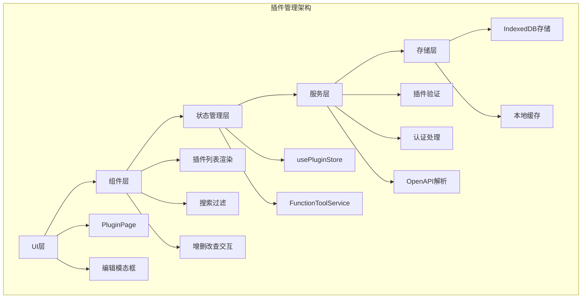

**图表来源**
- [app/components/plugin.tsx](file://app/components/plugin.tsx#L33-L371)
- [app/store/plugin.ts](file://app/store/plugin.ts#L172-L272)

## 详细组件分析

### 插件状态管理器实现

#### 创建插件(create)

插件创建过程包含以下关键步骤：

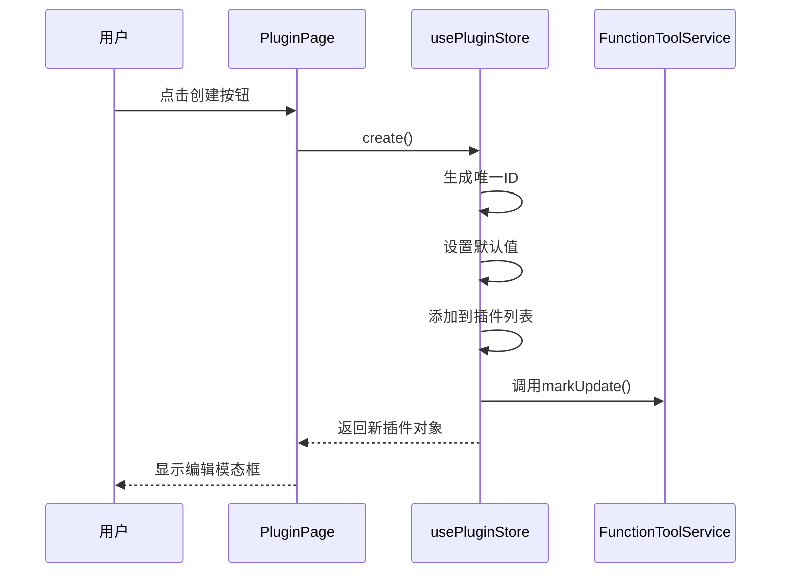

**图表来源**
- [app/store/plugin.ts](file://app/store/plugin.ts#L176-L190)

#### 更新插件(updatePlugin)

插件更新操作支持部分更新，确保数据一致性：

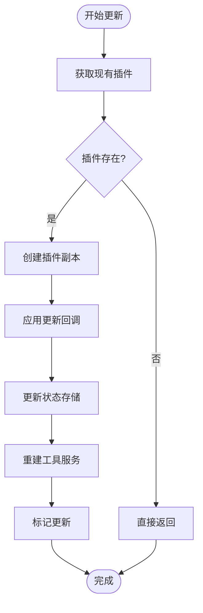

**图表来源**
- [app/store/plugin.ts](file://app/store/plugin.ts#L191-L201)

#### 删除插件(delete)

插件删除操作确保数据完整性：

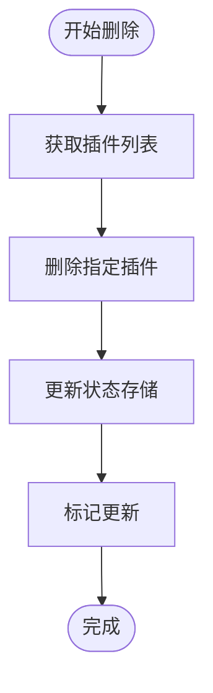

**图表来源**
- [app/store/plugin.ts](file://app/store/plugin.ts#L202-L207)

### FunctionToolService认证处理

系统支持多种认证方式，通过动态配置实现灵活的认证机制：

| 认证类型 | 处理方式 | 示例 |
|----------|----------|------|
| basic | Basic认证头 | `Basic base64(token)` |
| bearer | Bearer令牌 | `Bearer token` |
| custom | 自定义认证头 | 用户指定的头部名称 |
| 无认证 | 不添加认证头 | 直接请求 |

认证位置支持三种方式：
- **header**: 将认证信息放在HTTP头部
- **query**: 将认证信息作为查询参数
- **body**: 将认证信息放在请求体中

**章节来源**
- [app/store/plugin.ts](file://app/store/plugin.ts#L42-L156)

### UI组件实现

#### 插件列表渲染

插件列表组件提供完整的插件展示功能：

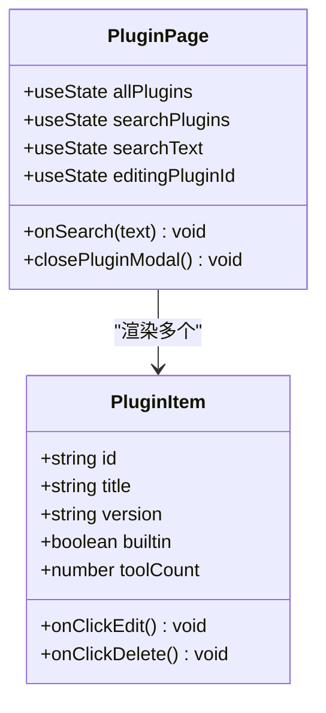

**图表来源**
- [app/components/plugin.tsx](file://app/components/plugin.tsx#L33-L371)

#### 搜索过滤功能

搜索功能实现实时过滤，提升用户体验：

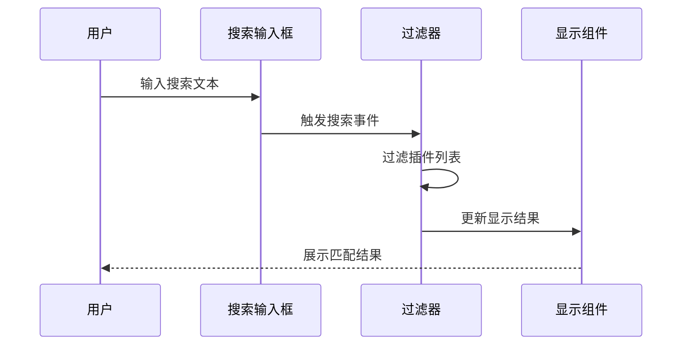

**图表来源**
- [app/components/plugin.tsx](file://app/components/plugin.tsx#L43-L53)

#### 编辑模态框

编辑模态框提供完整的插件配置界面：

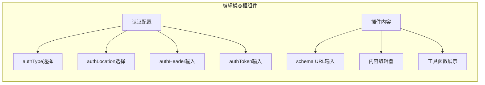

**图表来源**
- [app/components/plugin.tsx](file://app/components/plugin.tsx#L236-L371)

**章节来源**
- [app/components/plugin.tsx](file://app/components/plugin.tsx#L33-L371)

### 内置插件加载机制

系统启动时自动加载内置插件配置：

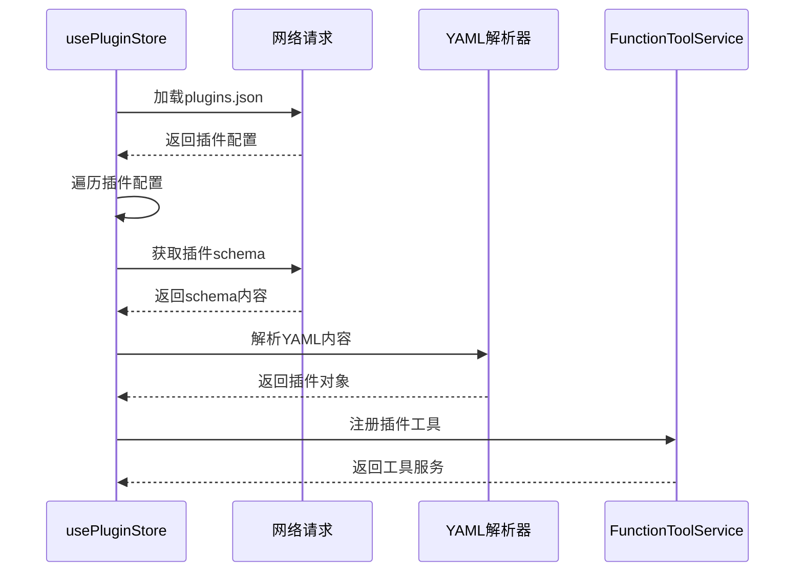

**图表来源**
- [app/store/plugin.ts](file://app/store/plugin.ts#L239-L269)

**章节来源**
- [app/store/plugin.ts](file://app/store/plugin.ts#L239-L269)
- [public/plugins.json](file://public/plugins.json#L1-L18)

## 依赖关系分析

插件管理系统的依赖关系图展示了各组件间的相互依赖：

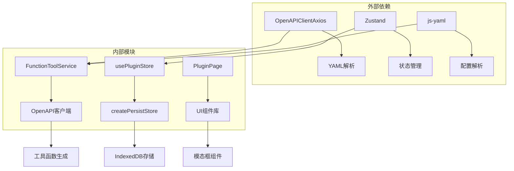

**图表来源**
- [app/store/plugin.ts](file://app/store/plugin.ts#L1-L10)
- [app/utils/store.ts](file://app/utils/store.ts#L1-L79)

**章节来源**
- [app/store/plugin.ts](file://app/store/plugin.ts#L1-L10)
- [app/utils/store.ts](file://app/utils/store.ts#L1-L79)

## 性能考虑

### 状态更新优化

系统采用防抖机制优化频繁的状态更新操作，特别是在插件内容编辑时：

- 使用`useDebouncedCallback`延迟内容验证
- 避免频繁的API调用和状态重绘
- 实现智能的缓存策略

### 数据持久化

采用IndexedDB进行本地存储，确保数据持久性和离线访问能力：

- 支持跨会话的数据恢复
- 提供自动备份和同步机制
- 实现增量更新优化

### 插件加载策略

内置插件采用异步加载模式，避免阻塞主界面渲染：

- 延迟加载非关键插件
- 实现插件预加载队列
- 提供加载进度指示

## 故障排除指南

### 常见问题及解决方案

#### 插件加载失败

**问题描述**: 插件内容无法正确加载或解析

**可能原因**:
1. OpenAPI规范格式错误
2. 网络连接问题
3. YAML语法错误

**解决方法**:
1. 验证插件内容的OpenAPI规范格式
2. 检查网络连接状态
3. 使用在线YAML验证工具检查语法

#### 认证配置无效

**问题描述**: 插件认证设置不生效

**可能原因**:
1. 认证类型配置错误
2. 认证位置设置不当
3. 令牌格式不正确

**解决方法**:
1. 确认认证类型的正确性
2. 检查认证位置与API要求的一致性
3. 验证令牌格式符合相应标准

#### 工具函数调用失败

**问题描述**: 插件工具函数无法正常执行

**可能原因**:
1. 参数验证失败
2. API端点不可达
3. 权限不足

**解决方法**:
1. 检查调用参数的完整性和正确性
2. 验证API端点的可用性
3. 确认必要的权限配置

**章节来源**
- [app/store/plugin.ts](file://app/store/plugin.ts#L64-L70)
- [app/components/plugin.tsx](file://app/components/plugin.tsx#L60-L86)

## 结论

插件管理系统是一个设计精良、功能完备的模块化架构系统。它成功地将状态管理、UI组件、数据持久化和业务逻辑有机结合，为用户提供了强大而易用的插件管理功能。

系统的主要优势包括：

1. **模块化设计**: 清晰的职责分离，便于维护和扩展
2. **类型安全**: 完整的TypeScript类型定义，提供良好的开发体验
3. **用户体验**: 直观的界面设计和流畅的操作流程
4. **可扩展性**: 支持多种认证方式和插件类型
5. **性能优化**: 智能的缓存策略和异步加载机制

该系统不仅满足了当前的功能需求，还为未来的功能扩展奠定了坚实的基础。通过持续的优化和完善，插件管理系统将继续为用户提供更加优秀的插件管理体验。