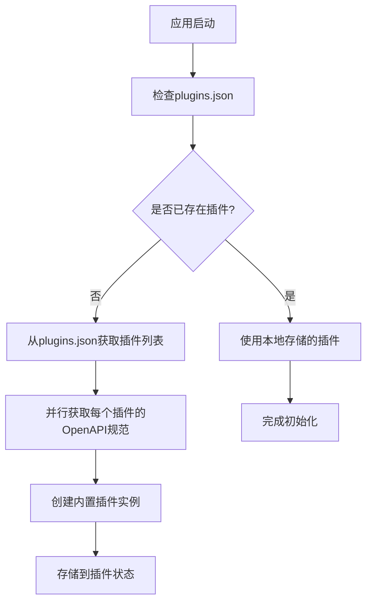
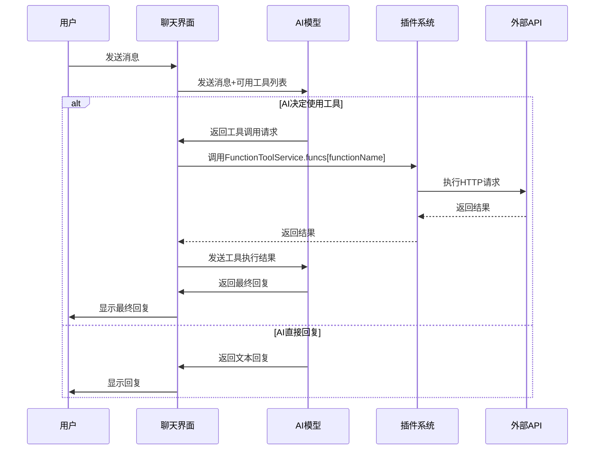

# 插件系统

<cite>
**本文档引用的文件**  
- [plugins.json](file://public/plugins.json)
- [plugin.ts](file://app/store/plugin.ts)
- [plugin.tsx](file://app/components/plugin.tsx)
- [constant.ts](file://app/constant.ts)
- [indexedDB-storage.ts](file://app/utils/indexedDB-storage.ts)
</cite>

## 目录
1. [引言](#引言)
2. [插件元数据注册与发现机制](#插件元数据注册与发现机制)
3. [插件状态管理模型](#插件状态管理模型)
4. [插件UI组件渲染与事件通信](#插件ui组件渲染与事件通信)
5. [插件API调用规范与上下文暴露](#插件api调用规范与上下文暴露)
6. [自定义插件开发指南](#自定义插件开发指南)
7. [结论](#结论)

## 引言

本项目中的插件系统为用户提供了一种扩展应用功能的机制。通过插件，用户可以集成外部服务，如DALL·E 3图像生成、ArXiv学术搜索和DuckDuckGo轻量搜索等。插件系统基于OpenAPI规范，允许开发者定义外部API的接口，并通过统一的界面进行管理。系统通过`plugins.json`文件进行插件的注册与发现，利用Zustand状态管理库维护插件状态，并通过React组件实现UI渲染和用户交互。插件的执行是安全的，主应用通过代理请求和认证机制与外部服务通信，避免了直接暴露敏感信息。

**Section sources**
- [plugin.ts](file://app/store/plugin.ts#L1-L272)
- [plugin.tsx](file://app/components/plugin.tsx#L1-L371)

## 插件元数据注册与发现机制

插件系统的元数据注册与发现机制基于`public/plugins.json`文件。该文件是一个JSON数组，每个元素代表一个预定义的插件，包含插件的ID、名称和OpenAPI规范的URL。当应用启动时，`usePluginStore`的持久化存储会在客户端重新水化（rehydration）过程中自动从`plugins.json`加载内置插件列表。



**Diagram sources**
- [plugin.ts](file://app/store/plugin.ts#L239-L268)

插件元数据的核心结构如下：
- `id`: 插件的唯一标识符，如"dalle3"。
- `name`: 插件的显示名称，如"Dalle3"。
- `schema`: 指向插件OpenAPI规范（YAML或JSON）的URL。系统会通过`fetch`请求获取该规范内容，并将其作为插件的`content`字段存储。

当用户首次访问应用时，系统会执行以下流程：
1. 从`./plugins.json`获取插件元数据列表。
2. 对于列表中的每个插件，检查本地状态是否已存在该插件。
3. 如果不存在，则通过`fetch(item.schema)`异步获取其OpenAPI规范内容。
4. 将获取到的内容与元数据合并，创建完整的插件对象。
5. 调用`state.create(item)`在状态管理中创建插件实例。
6. 使用`FunctionToolService.add(plugin, true)`解析OpenAPI规范，提取可用的工具函数。

此机制确保了插件的发现是动态的，且规范内容在运行时加载，减少了初始包的大小。

**Section sources**
- [plugins.json](file://public/plugins.json#L1-L18)
- [plugin.ts](file://app/store/plugin.ts#L239-L268)
- [constant.ts](file://app/constant.ts#L4)

## 插件状态管理模型

插件状态管理模型基于Zustand库实现，核心是`usePluginStore`。该状态存储了所有插件的集合，并提供了创建、更新、删除和查询插件的方法。状态被持久化到IndexedDB（通过`indexedDB-storage.ts`），确保了数据在页面刷新后依然存在。

```mermaid
classDiagram
class Plugin {
+id : string
+createdAt : number
+title : string
+version : string
+content : string
+builtin : boolean
+authType? : string
+authLocation? : string
+authHeader? : string
+authToken? : string
}
class FunctionToolService {
+tools : Record<string, FunctionToolServiceItem>
+add(plugin : Plugin, replace : boolean) : FunctionToolServiceItem
+get(id : string) : FunctionToolServiceItem
}
class FunctionToolServiceItem {
+api : OpenAPIClientAxios
+length : number
+tools : FunctionToolItem[]
+funcs : Record<string, Function>
}
class FunctionToolItem {
+type : string
+function : {
+name : string
+description? : string
+parameters : Object
}
}
class usePluginStore {
+plugins : Record<string, Plugin>
+create(plugin? : Partial<Plugin>) : Plugin
+updatePlugin(id : string, updater : (plugin : Plugin) => void) : void
+delete(id : string) : void
+getAsTools(ids : string[]) : [FunctionToolItem[], Record<string, Function>]
+getAll() : Plugin[]
}
usePluginStore --> Plugin : "管理"
FunctionToolService --> Plugin : "依赖"
usePluginStore --> FunctionToolService : "使用"
```

**Diagram sources**
- [plugin.ts](file://app/store/plugin.ts#L12-L156)

状态模型的关键组件包括：
- `Plugin`: 定义了插件的数据结构。`content`字段存储了完整的OpenAPI规范（YAML字符串），`builtin`字段标记插件是否为内置。
- `FunctionToolService`: 一个单例服务，负责将`Plugin`的`content`（OpenAPI规范）解析为可调用的工具。它使用`openapi-client-axios`库来解析规范，并生成一个包含`tools`（用于AI模型调用的函数描述）和`funcs`（实际的JavaScript函数）的对象。
- `usePluginStore`: 基于`createPersistStore`创建的持久化状态。它管理`plugins`对象，并在插件更新时自动调用`FunctionToolService.add`来同步工具列表。

当用户更新一个插件时，`updatePlugin`方法会先修改状态，然后立即调用`FunctionToolService.add(updatePlugin, true)`来重新解析其OpenAPI规范。这确保了状态和可用工具始终保持同步。

**Section sources**
- [plugin.ts](file://app/store/plugin.ts#L12-L272)
- [indexedDB-storage.ts](file://app/utils/indexedDB-storage.ts#L1-L48)

## 插件UI组件渲染与事件通信

插件UI组件的渲染逻辑由`PluginPage`组件（`plugin.tsx`）负责。该组件通过`usePluginStore`订阅插件状态，并在状态变化时自动重新渲染。UI采用列表形式展示所有插件，并支持搜索功能。

```mermaid
flowchart TD
A[PluginPage组件] --> B[useNavigate]
A --> C[usePluginStore]
C --> D[getAll()]
D --> E[获取所有插件]
E --> F[渲染插件列表]
F --> G[每个插件项]
G --> H[显示标题、版本和工具数量]
G --> I[编辑按钮]
I --> J[打开编辑模态框]
J --> K[显示认证配置]
K --> L[显示OpenAPI规范编辑器]
L --> M[实时解析并预览工具]
M --> N[onChangePlugin防抖处理]
N --> O[更新插件状态]
O --> P[自动重新解析工具]
P --> Q[更新UI]
```

**Diagram sources**
- [plugin.tsx](file://app/components/plugin.tsx#L33-L371)

事件通信机制如下：
- **搜索事件**: `onSearch`函数监听输入框的`onInput`事件，对插件列表进行过滤。
- **创建事件**: 点击“创建”按钮会调用`pluginStore.create()`，生成一个新插件并打开其编辑模态框。
- **编辑事件**: 点击“编辑”按钮会设置`editingPluginId`，触发模态框的显示。
- **内容变更事件**: OpenAPI规范的编辑器使用`contentEditable`属性，其`onBlur`事件触发`onChangePlugin`。该函数使用`useDebouncedCallback`进行防抖（100ms），以避免频繁解析。解析成功后，会更新插件的`title`和`version`。
- **加载URL事件**: 用户可以输入一个URL来加载OpenAPI规范。`loadFromUrl`函数会处理该请求，可能通过`/api/proxy`路由进行代理，以避免CORS问题。

整个UI的渲染和交互都是响应式的，任何对`usePluginStore`状态的修改都会立即反映在界面上。

**Section sources**
- [plugin.tsx](file://app/components/plugin.tsx#L33-L371)

## 插件API调用规范与上下文暴露

插件API的调用规范基于OpenAPI 3.0。主应用通过`FunctionToolService`将OpenAPI规范转换为AI模型可以理解的“工具”（tools）。当用户在聊天中启用一个插件时，其对应的工具描述会被发送给AI模型。如果AI决定使用该工具，它会返回一个包含工具名称和参数的请求，主应用再通过`FunctionToolService.funcs`中的实际函数来执行。



**Diagram sources**
- [plugin.ts](file://app/store/plugin.ts#L126-L148)
- [openai.ts](file://app/client/platforms/openai.ts#L209-L223)
- [google.ts](file://app/client/platforms/google.ts#L209-L223)

主应用向插件暴露的上下文信息主要体现在以下几个方面：
1. **认证信息**: 插件可以配置`authType`（如bearer、basic）、`authLocation`（header、query、body）和`authToken`。对于特殊的插件（如dalle3），系统会自动尝试使用`useAccessStore`中的`openaiApiKey`。
2. **网络代理**: 在非桌面应用（`!isApp`）中，所有插件请求都会通过`/api/proxy`路由进行代理。这通过设置`baseURL`为`/api/proxy`和`X-Base-URL`头部来实现，有效地绕过了浏览器的CORS限制。
3. **运行时环境**: 插件的执行依赖于`openapi-client-axios`，它会根据环境（Tauri桌面应用或Web）选择合适的适配器（adapter）。

在平台实现中（如`google.ts`和`anthropic.ts`），`getAsTools`方法被用来获取当前会话所选插件的工具列表和函数映射，并将它们传递给`stream`函数，以便在流式响应中处理工具调用。

**Section sources**
- [plugin.ts](file://app/store/plugin.ts#L43-L151)
- [openai.ts](file://app/client/platforms/openai.ts#L209-L223)
- [google.ts](file://app/client/platforms/google.ts#L209-L223)
- [anthropic.ts](file://app/client/platforms/anthropic.ts#L200-L219)

## 自定义插件开发指南

开发自定义插件需要遵循以下步骤：

### 目录结构
自定义插件无需在项目中创建特定目录。用户可以通过应用的插件管理界面直接创建和编辑插件。所有插件数据都存储在浏览器的IndexedDB中。

### 接口定义
1. **创建插件**: 在插件管理页面点击“创建”按钮。
2. **填写元数据**: 在编辑模态框中，系统会自动生成`id`和`createdAt`。用户需要提供`authType`等认证信息。
3. **定义OpenAPI规范**: 在“内容”区域，粘贴或编写符合OpenAPI 3.0规范的YAML或JSON。规范必须包含`servers`字段来指定API的基础URL。
4. **保存**: 内容变更后会自动保存（通过防抖机制）。

一个简单的插件OpenAPI规范示例如下：
```yaml
openapi: 3.0.0
info:
  title: 示例插件
  version: 1.0.0
servers:
  - url: https://api.example.com
paths:
  /search:
    get:
      summary: 搜索内容
      operationId: searchContent
      parameters:
        - name: query
          in: query
          required: true
          schema:
            type: string
      responses:
        '200':
          description: 成功响应
```

### 调试方法
1. **实时预览**: 在编辑OpenAPI规范时，UI会实时显示解析出的工具列表（函数名和描述）。如果规范有误，会显示错误提示。
2. **加载外部规范**: 可以通过输入URL来加载远程的OpenAPI规范进行测试。
3. **控制台日志**: 解析错误会输出到浏览器控制台（`console.error`）。
4. **集成测试**: 在聊天界面中启用该插件，并与AI对话，观察AI是否能正确生成工具调用请求。

**Section sources**
- [plugin.tsx](file://app/components/plugin.tsx#L60-L86)
- [plugin.ts](file://app/store/plugin.ts#L63-L81)

## 结论

本项目的插件系统设计精巧，通过`plugins.json`实现了插件的动态发现，利用Zustand和IndexedDB实现了可靠的状态管理，并通过React组件提供了直观的UI。系统安全地执行插件脚本，通过代理和认证机制保护用户隐私。开发者可以轻松创建自定义插件来扩展应用功能，而用户则可以通过简单的界面进行管理和使用。该系统为应用的可扩展性奠定了坚实的基础。