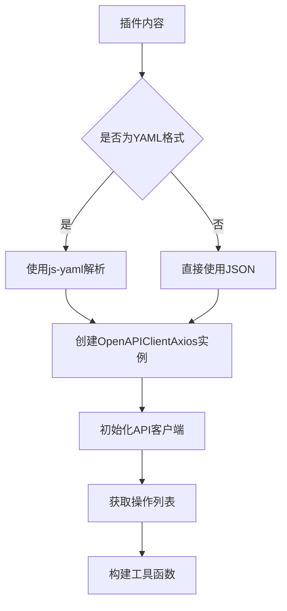
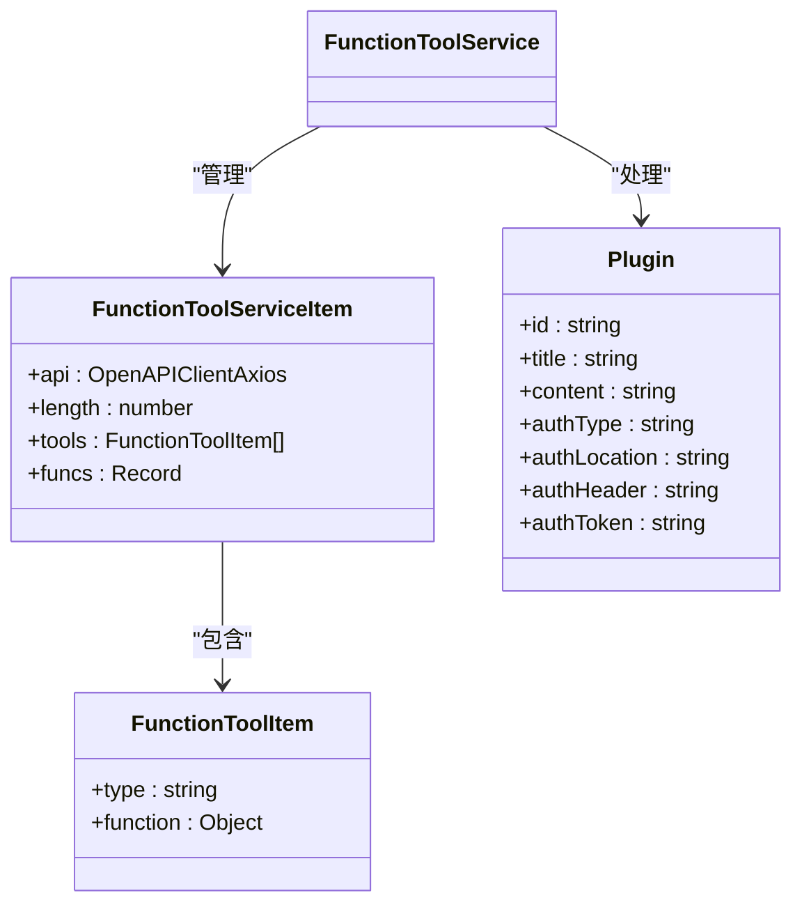
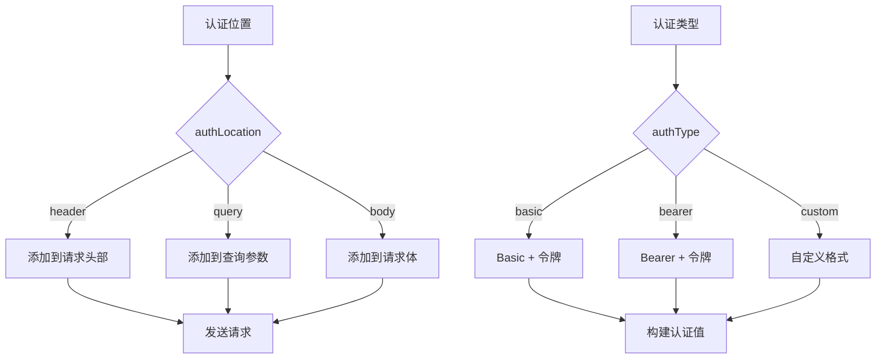
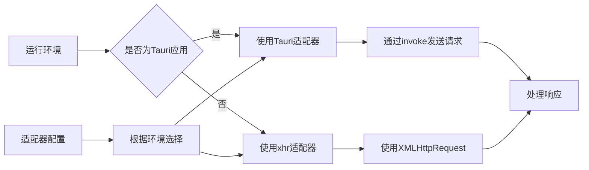

# 插件运行时环境

<cite>
**本文档引用的文件**
- [plugin.ts](file://app/store/plugin.ts)
- [utils.ts](file://app/utils/utils.ts)
- [plugins.json](file://public/plugins.json)
</cite>

## 目录
1. [插件运行时环境构建](#插件运行时环境构建)
2. [OpenAPI规范加载与解析](#openapi规范加载与解析)
3. [工具函数列表生成](#工具函数列表生成)
4. [函数调用封装机制](#函数调用封装机制)
5. [认证令牌注入方式](#认证令牌注入方式)
6. [客户端适配器配置](#客户端适配器配置)

## 插件运行时环境构建

插件运行时环境的核心是FunctionToolService，它负责管理插件的生命周期、API客户端实例的创建以及工具函数的生成。该服务通过OpenAPIClientAxios库加载插件的OpenAPI规范，解析生成可用的API客户端实例，并为每个插件创建相应的工具函数集合。

**Section sources**
- [plugin.ts](file://app/store/plugin.ts#L41-L156)

## OpenAPI规范加载与解析

FunctionToolService使用OpenAPIClientAxios库来加载和解析插件的OpenAPI规范。插件的OpenAPI定义以YAML或JSON格式存储在Plugin对象的content字段中。当添加新插件时，系统会使用js-yaml库将YAML格式的OpenAPI规范解析为JavaScript对象。

在Tauri应用环境中，系统会根据isApp配置决定使用本地服务器URL还是代理路径。对于非应用环境，请求通过/api/proxy端点进行代理，同时保留原始服务器URL在X-Base-URL头部中。

**Diagram sources**
- [plugin.ts](file://app/store/plugin.ts#L55-L80)

**Section sources**
- [plugin.ts](file://app/store/plugin.ts#L55-L80)

## 工具函数列表生成

工具函数列表（tools）的生成逻辑基于OpenAPI规范中的操作（operations）。系统通过getOperations()方法获取所有可用的API操作，并为每个操作创建对应的FunctionToolItem。

operationId的提取遵循以下规则：优先使用OpenAPI规范中定义的operationId，如果不存在，则根据HTTP方法和路径生成，格式为"METHOD_PATH"（例如"GET_users"）。参数模式的构建包括请求体参数和路径/查询参数的合并，其中请求体参数来自application/json内容类型的schema定义。

描述信息映射优先使用operation的description字段，如果不存在则使用summary字段作为回退。

**Diagram sources**
- [plugin.ts](file://app/store/plugin.ts#L86-L124)

**Section sources**
- [plugin.ts](file://app/store/plugin.ts#L86-L124)

## 函数调用封装机制

funcs对象中的实际调用函数通过reduce方法封装，为每个API操作创建一个可调用的函数。这些函数处理请求参数的路径、查询和请求体分离：

- 路径和查询参数从args中提取并放入parameters对象
- 剩余的参数作为请求体内容
- 根据operation的path和method属性调用相应的API端点

函数封装还处理了operationId为空的情况，此时使用路径和HTTP方法作为标识符。这种设计确保了即使OpenAPI规范中缺少operationId，系统仍能正确调用API。

**Section sources**
- [plugin.ts](file://app/store/plugin.ts#L125-L148)

## 认证令牌注入方式

认证令牌支持在不同位置注入，具体位置由插件的authLocation配置决定：

- **头部（header）**: 默认方式，在初始化API客户端时将认证信息添加到headers配置中
- **查询参数（query）**: 在函数调用时将认证信息添加到parameters对象中，作为查询参数发送
- **请求体（body）**: 在函数调用时将认证信息添加到args对象中，作为请求体的一部分

特殊情况下，如dalle3插件，系统会尝试使用OpenAI API密钥作为认证令牌。认证类型支持basic、bearer和自定义格式，其中自定义格式允许指定特定的头部名称。

**Diagram sources**
- [plugin.ts](file://app/store/plugin.ts#L45-L69)

**Section sources**
- [plugin.ts](file://app/store/plugin.ts#L45-L69)

## 客户端适配器配置

客户端适配器（adapter）在Tauri应用与Web环境中的配置存在差异化：

- **Tauri应用环境**: 使用window.__TAURI__存在性检测，采用自定义adapter处理请求
- **Web环境**: 使用默认的xhr适配器

适配器模式允许系统在不同运行环境中使用最适合的网络请求机制。在Tauri应用中，请求通过Tauri的invoke命令发送到Rust后端，实现更安全和高效的本地API调用。而在Web环境中，使用标准的XMLHttpRequest适配器。

getOperationId辅助函数用于生成操作的唯一标识符，确保operationId符合^[a-zA-Z0-9_-]+$模式要求。

**Diagram sources**
- [plugin.ts](file://app/store/plugin.ts#L74)
- [utils.ts](file://app/utils/utils.ts#L363-L375)

**Section sources**
- [plugin.ts](file://app/store/plugin.ts#L74)
- [utils.ts](file://app/utils/utils.ts#L363-L375)