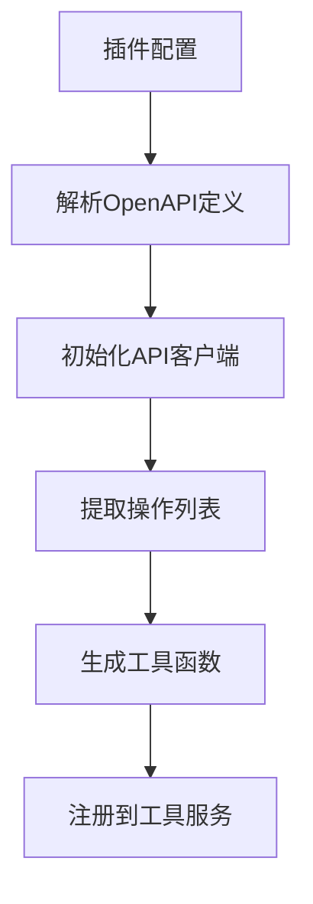
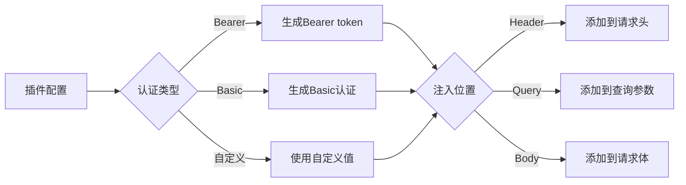

# 插件通信协议

<cite>
**本文档引用的文件**  
- [plugin.ts](file://app/store/plugin.ts)
- [plugin.tsx](file://app/components/plugin.tsx)
- [proxy.ts](file://app/api/proxy.ts)
- [stream.rs](file://src-tauri/src/stream.rs)
- [main.rs](file://src-tauri/src/main.rs)
- [stream.ts](file://app/utils/stream.ts)
- [chat.ts](file://app/utils/chat.ts)
- [plugins.json](file://public/plugins.json)
</cite>

## 目录
1. [插件通信协议概述](#插件通信协议概述)
2. [插件工具暴露机制](#插件工具暴露机制)
3. [代理转发逻辑](#代理转发逻辑)
4. [认证信息传递](#认证信息传递)
5. [安全边界控制](#安全边界控制)
6. [系统架构图](#系统架构图)

## 插件通信协议概述

本系统实现了基于OpenAPI规范的插件通信协议，通过标准化的接口定义和安全的通信机制，实现了主应用与插件之间的无缝集成。系统支持Web端和Tauri桌面端两种部署模式，针对不同环境采用了差异化的通信策略。

**Section sources**
- [plugin.ts](file://app/store/plugin.ts#L1-L272)
- [plugin.tsx](file://app/components/plugin.tsx#L1-L371)

## 插件工具暴露机制

插件通过`getAsTools`方法将自身暴露为工具集，该机制基于OpenAPI客户端库实现。当插件被加载时，系统会解析其OpenAPI定义文件，自动生成对应的工具函数集合。

核心实现位于`FunctionToolService.add`方法中，该方法接收插件配置，使用`openapi-client-axios`库初始化API客户端，并提取所有可用的操作（operations）转换为工具项。每个工具项包含函数名称、描述和参数定义，符合LLM调用的标准格式。



**Diagram sources**
- [plugin.ts](file://app/store/plugin.ts#L41-L156)

**Section sources**
- [plugin.ts](file://app/store/plugin.ts#L41-L156)
- [plugin.tsx](file://app/components/plugin.tsx#L19-L32)

## 代理转发逻辑

系统实现了智能的代理转发机制，根据部署环境选择不同的通信路径：

- **Web端**：通过`/api/proxy`路由进行代理转发，避免跨域问题
- **Tauri桌面端**：直接连接目标服务器，绕过浏览器限制

在Web端，`/api/proxy`路由接收请求，提取`X-Base-URL`头部中的目标地址，然后转发请求。该过程会过滤敏感头部，确保安全性。对于DALL·E 3插件等特殊情况，系统会自动注入OpenAI API密钥。

Tauri桌面端通过Rust后端直接发起网络请求，利用`stream_fetch`命令实现流式响应处理，提供了更好的性能和控制能力。

```mermaid
graph TB
subgraph "Web端"
A[前端请求] --> B[/api/proxy]
B --> C[目标API]
end
subgraph "Tauri桌面端"
D[前端请求] --> E[Tauri命令]
E --> F[Rust后端]
F --> G[目标API]
end
```

**Diagram sources**
- [proxy.ts](file://app/api/proxy.ts#L1-L90)
- [stream.rs](file://src-tauri/src/stream.rs#L34-L127)
- [main.rs](file://src-tauri/src/main.rs#L6-L12)

**Section sources**
- [proxy.ts](file://app/api/proxy.ts#L1-L90)
- [stream.rs](file://src-tauri/src/stream.rs#L34-L127)
- [main.rs](file://src-tauri/src/main.rs#L6-L12)

## 认证信息传递

系统实现了灵活的认证信息传递机制，支持多种认证类型和位置配置：

- **认证类型**：支持Bearer、Basic和自定义认证
- **注入位置**：支持在请求头、查询参数或请求体中注入认证信息
- **动态配置**：通过插件配置中的`authType`、`authLocation`和`authHeader`字段进行配置

认证信息的处理在`FunctionToolService.add`方法中实现。系统根据配置生成相应的认证值（如`Bearer token`），并根据`authLocation`策略将其注入到正确的位置。对于DALL·E 3插件，系统会自动使用主应用的OpenAI API密钥。



**Diagram sources**
- [plugin.ts](file://app/store/plugin.ts#L45-L148)
- [plugin.tsx](file://app/components/plugin.tsx#L252-L317)

**Section sources**
- [plugin.ts](file://app/store/plugin.ts#L45-L148)
- [plugin.tsx](file://app/components/plugin.tsx#L252-L317)

## 安全边界控制

系统实施了严格的安全边界控制，防止恶意插件访问敏感接口：

1. **请求过滤**：代理层会过滤`connection`、`host`、`origin`等敏感头部
2. **域名白名单**：通过`X-Base-URL`头部限制目标域名
3. **认证隔离**：插件认证信息与主应用认证信息分离
4. **模型访问控制**：对特定服务提供商的模型访问进行限制

在`/api/proxy`路由中，系统会检查请求头部，移除潜在的安全风险。同时，通过`skipHeaders`数组明确禁止传递某些敏感头部，确保不会泄露内部信息。

**Section sources**
- [proxy.ts](file://app/api/proxy.ts#L23-L35)
- [plugin.ts](file://app/store/plugin.ts#L10-L11)

## 系统架构图

```mermaid
graph TD
A[用户界面] --> B[插件管理]
B --> C[工具服务]
C --> D[API客户端]
D --> E{部署环境}
E --> |Web| F[/api/proxy]
E --> |Tauri| G[Tauri命令]
F --> H[目标API]
G --> I[Rust后端]
I --> H
J[插件配置] --> C
K[认证信息] --> C
C --> L[LLM集成]
```

**Diagram sources**
- [plugin.ts](file://app/store/plugin.ts#L41-L156)
- [proxy.ts](file://app/api/proxy.ts#L1-L90)
- [stream.rs](file://src-tauri/src/stream.rs#L34-L127)

**Section sources**
- [plugin.ts](file://app/store/plugin.ts#L1-L272)
- [proxy.ts](file://app/api/proxy.ts#L1-L90)
- [stream.rs](file://src-tauri/src/stream.rs#L1-L127)