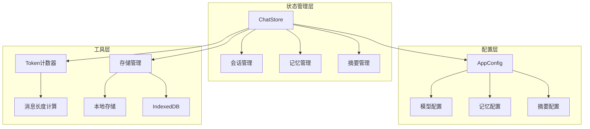
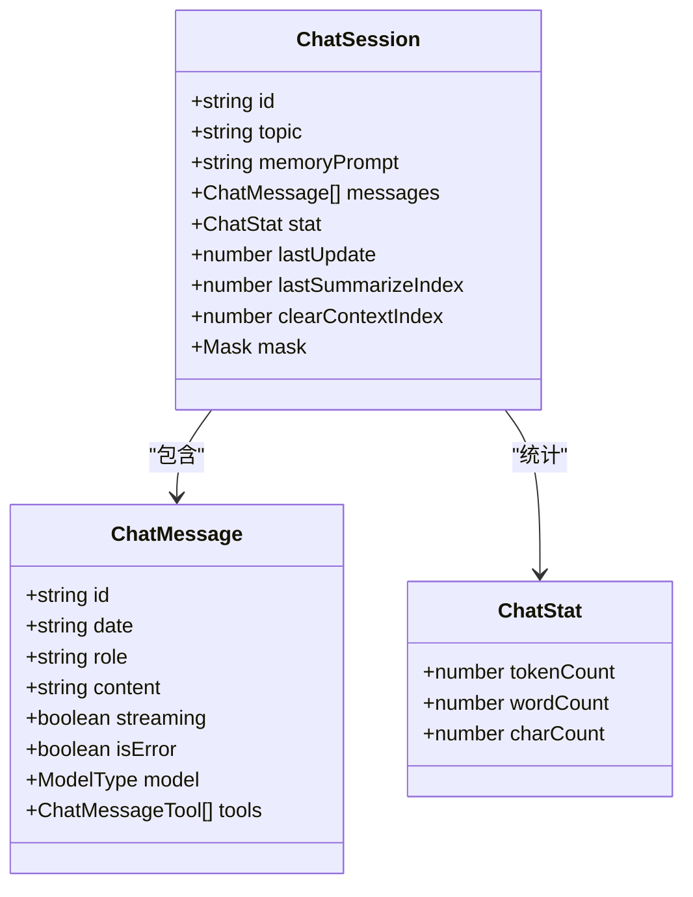
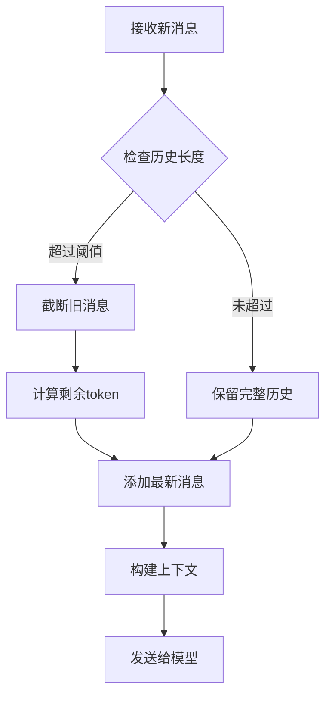
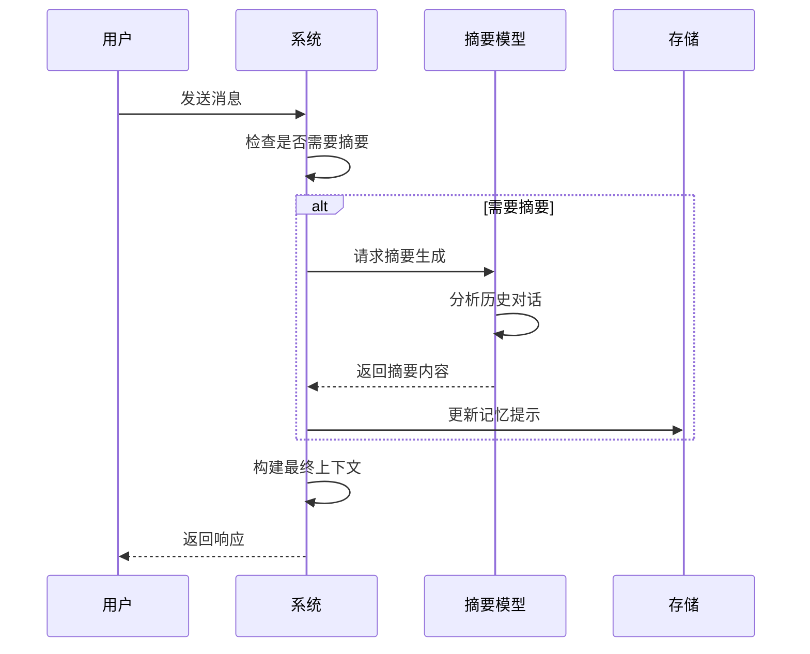
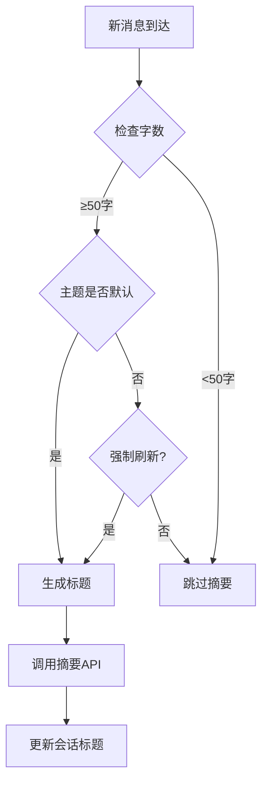
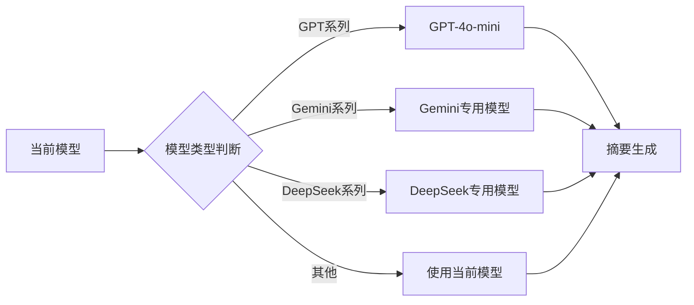
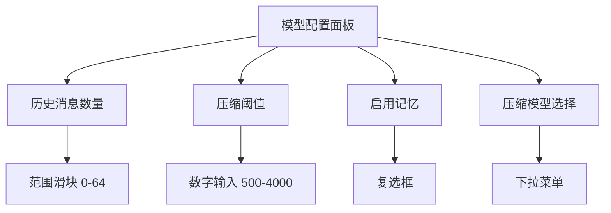
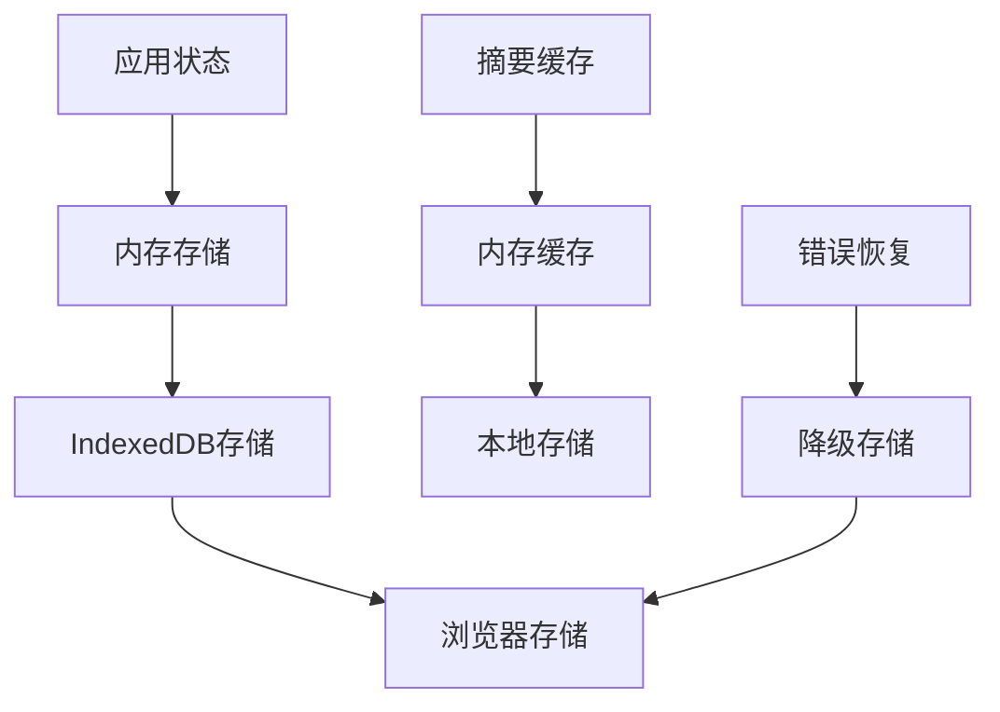
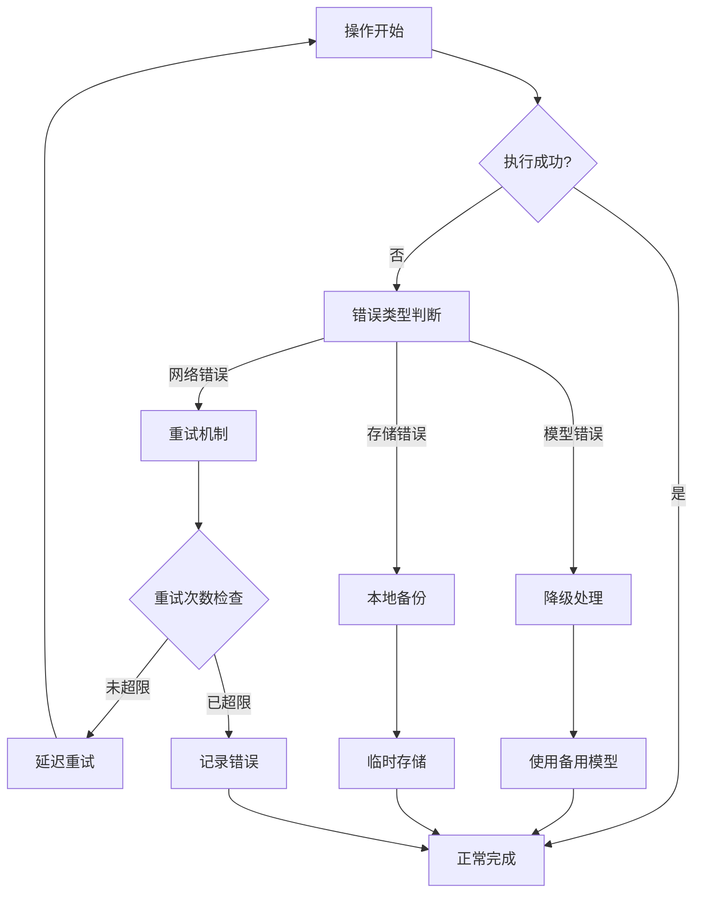
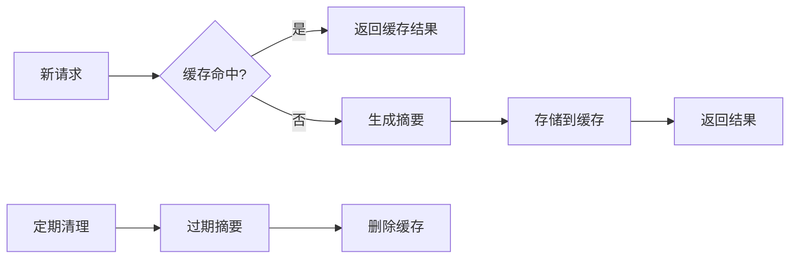

# 会话记忆与自动摘要

<cite>
**本文档中引用的文件**
- [chat.ts](file://app/store/chat.ts)
- [config.ts](file://app/store/config.ts)
- [model-config.tsx](file://app/components/model-config.tsx)
- [token.ts](file://app/utils/token.ts)
- [indexedDB-storage.ts](file://app/utils/indexedDB-storage.ts)
- [constant.ts](file://app/constant.ts)
- [en.ts](file://app/locales/en.ts)
- [store.ts](file://app/utils/store.ts)
- [utils.ts](file://app/utils.ts)
</cite>

## 目录
1. [引言](#引言)
2. [项目结构概览](#项目结构概览)
3. [核心数据结构](#核心数据结构)
4. [会话记忆机制](#会话记忆机制)
5. [自动摘要生成](#自动摘要生成)
6. [配置管理](#配置管理)
7. [UI 控制界面](#ui-控制界面)
8. [存储与缓存策略](#存储与缓存策略)
9. [错误处理与回退机制](#错误处理与回退机制)
10. [性能优化建议](#性能优化建议)
11. [总结](#总结)

## 引言

ChatGPT Next Web 实现了一套完整的会话记忆机制与自动摘要生成功能，旨在解决大型语言模型在有限上下文窗口内的长期对话记忆问题。该系统通过智能的记忆压缩、语义摘要和动态上下文管理，确保用户能够在长时间对话中保持上下文连贯性，同时避免超出模型的 token 限制。

## 项目结构概览

系统的核心架构围绕聊天状态管理展开，主要包含以下关键模块：

**图表来源**
- [chat.ts](file://app/store/chat.ts#L232-L825)
- [config.ts](file://app/store/config.ts#L41-L262)

## 核心数据结构

### 聊天会话结构

系统定义了完整的聊天会话数据结构，支持长期记忆的持久化存储：

**图表来源**
- [chat.ts](file://app/store/chat.ts#L84-L96)
- [chat.ts](file://app/store/chat.ts#L57-L66)

### 关键配置参数

系统提供了多个可配置的参数来控制记忆和摘要行为：

| 配置项 | 类型 | 默认值 | 描述 |
|--------|------|--------|------|
| `sendMemory` | boolean | true | 是否发送长期记忆到模型 |
| `historyMessageCount` | number | 4 | 历史消息数量限制 |
| `compressMessageLengthThreshold` | number | 1000 | 压缩阈值（token） |
| `compressModel` | string | "" | 压缩使用的模型 |
| `enableAutoGenerateTitle` | boolean | true | 是否自动生成标题 |

**节来源**
- [config.ts](file://app/store/config.ts#L66-L85)
- [chat.ts](file://app/store/chat.ts#L122-L151)

## 会话记忆机制

### 上下文截断策略

系统实现了智能的上下文截断机制，确保在有限的 token 限制内维持对话连贯性：

**图表来源**
- [chat.ts](file://app/store/chat.ts#L619-L639)

### 记忆压缩算法

系统采用分层记忆管理策略：

1. **短期记忆**：最近的交互记录，保存在内存中
2. **长期记忆**：经过摘要处理的历史信息，存储在 `memoryPrompt` 中
3. **混合检索**：根据需要组合短期和长期记忆

**图表来源**
- [chat.ts](file://app/store/chat.ts#L661-L796)

**节来源**
- [chat.ts](file://app/store/chat.ts#L661-L796)

## 自动摘要生成

### 触发条件

摘要生成遵循以下触发规则：

1. **字数阈值**：当对话超过 50 字时自动触发
2. **标题生成**：当主题仍为默认值且满足字数要求时
3. **手动刷新**：用户主动刷新摘要时

**图表来源**
- [chat.ts](file://app/store/chat.ts#L685-L725)

### 生成流程

摘要生成过程包含以下步骤：

1. **消息筛选**：过滤错误消息，只处理有效对话
2. **长度检查**：验证历史消息是否超过压缩阈值
3. **上下文构建**：组合系统提示、长期记忆和近期消息
4. **模型选择**：根据当前模型自动选择合适的摘要模型
5. **异步处理**：使用流式接口实时更新摘要内容

**节来源**
- [chat.ts](file://app/store/chat.ts#L661-L796)

### 关键信息提取逻辑

系统实现了智能的关键信息提取机制：

- **语义理解**：使用专门的摘要模型理解对话核心内容
- **上下文保持**：确保重要上下文信息不被丢失
- **格式标准化**：统一摘要输出格式，便于后续处理

**节来源**
- [chat.ts](file://app/store/chat.ts#L122-L151)

## 配置管理

### 模型配置

系统支持灵活的模型配置，包括摘要模型的选择：

**图表来源**
- [chat.ts](file://app/store/chat.ts#L122-L151)

### 配置迁移机制

系统实现了版本化的配置迁移，确保向后兼容性：

| 版本 | 变更内容 |
|------|----------|
| 3.4 | 添加 `sendMemory`、`historyMessageCount`、`compressMessageLengthThreshold` |
| 3.5 | 添加自定义模型支持 |
| 3.6 | 启用系统提示注入 |
| 3.7 | 启用自动标题生成 |
| 3.8 | 添加最后更新时间戳 |
| 3.9 | 改进模板配置 |
| 4.1 | 添加压缩模型配置 |

**节来源**
- [config.ts](file://app/store/config.ts#L214-L259)

## UI 控制界面

### 配置面板

用户可以通过设置面板调整记忆和摘要行为：

**图表来源**
- [model-config.tsx](file://app/components/model-config.tsx#L183-L262)

### 实时反馈

系统提供实时的配置效果反馈：

- **阈值监控**：显示当前消息长度与阈值的关系
- **摘要进度**：显示摘要生成的实时进度
- **性能指标**：展示 token 使用情况和处理时间

**节来源**
- [model-config.tsx](file://app/components/model-config.tsx#L183-L262)

## 存储与缓存策略

### 多层存储架构

系统采用多层存储策略确保数据可靠性：

**图表来源**
- [indexedDB-storage.ts](file://app/utils/indexedDB-storage.ts#L7-L47)

### 存储优化

1. **懒加载**：仅在需要时加载大量历史数据
2. **增量更新**：只保存变化的部分，减少存储开销
3. **压缩存储**：对历史数据进行压缩存储
4. **清理策略**：定期清理过期的摘要缓存

**节来源**
- [indexedDB-storage.ts](file://app/utils/indexedDB-storage.ts#L7-L47)
- [store.ts](file://app/utils/store.ts#L29-L51)

## 错误处理与回退机制

### 异常处理策略

系统实现了完善的错误处理机制：

### 数据完整性保护

1. **原子操作**：确保存储操作的原子性
2. **事务支持**：对相关操作使用事务处理
3. **校验机制**：定期验证数据完整性
4. **恢复程序**：提供数据恢复工具

**节来源**
- [indexedDB-storage.ts](file://app/utils/indexedDB-storage.ts#L7-L47)
- [utils.ts](file://app/utils.ts#L370-L466)

## 性能优化建议

### 减少冗余请求

1. **智能缓存**：基于内容哈希的摘要缓存
2. **批量处理**：合并多个小请求为大请求
3. **预加载策略**：提前加载可能需要的摘要
4. **去重机制**：避免重复处理相同内容

### 缓存摘要结果

### 用户手动编辑支持

系统支持用户手动编辑生成的摘要：

1. **编辑界面**：提供直观的摘要编辑工具
2. **版本控制**：保存编辑历史和原始摘要
3. **智能合并**：自动合并用户的修改与系统摘要
4. **撤销功能**：支持撤销到任意历史版本

### 性能监控指标

| 指标 | 目标值 | 监控方法 |
|------|--------|----------|
| 摘要生成时间 | <2秒 | 时间戳记录 |
| 内存使用率 | <50MB | 浏览器性能API |
| 存储空间占用 | <100MB | 定期扫描 |
| 错误率 | <1% | 异常计数器 |

## 总结

ChatGPT Next Web 的会话记忆与自动摘要系统通过以下关键技术实现了高效的长期对话管理：

1. **智能截断策略**：在有限上下文窗口内最大化信息保留
2. **分层记忆管理**：短期记忆与长期摘要的有机结合
3. **自适应摘要生成**：根据对话复杂度动态调整摘要策略
4. **完善错误处理**：确保系统的稳定性和数据完整性
5. **灵活配置选项**：满足不同用户和场景的需求

该系统不仅解决了技术挑战，还为用户提供了一个直观易用的记忆管理界面，真正实现了"记住对话"的用户体验目标。通过持续的优化和改进，这套机制能够适应各种复杂的对话场景，为用户提供高质量的AI交互体验。