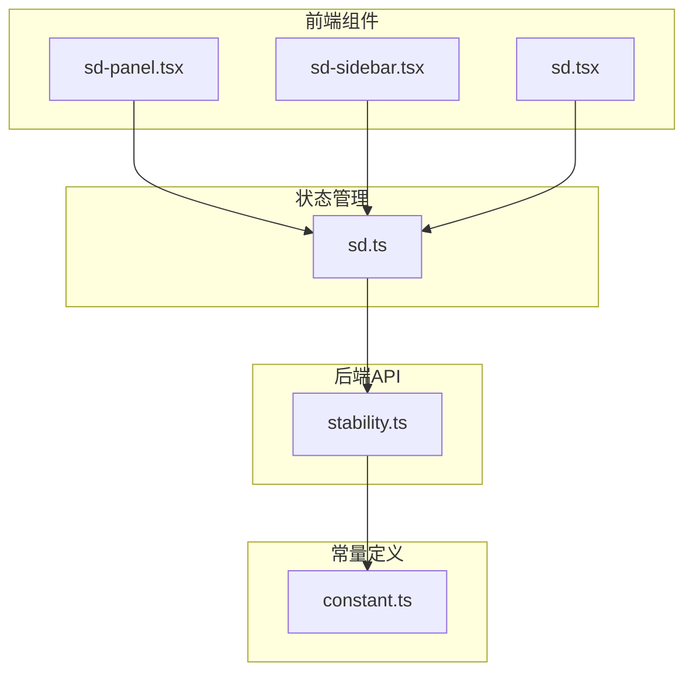
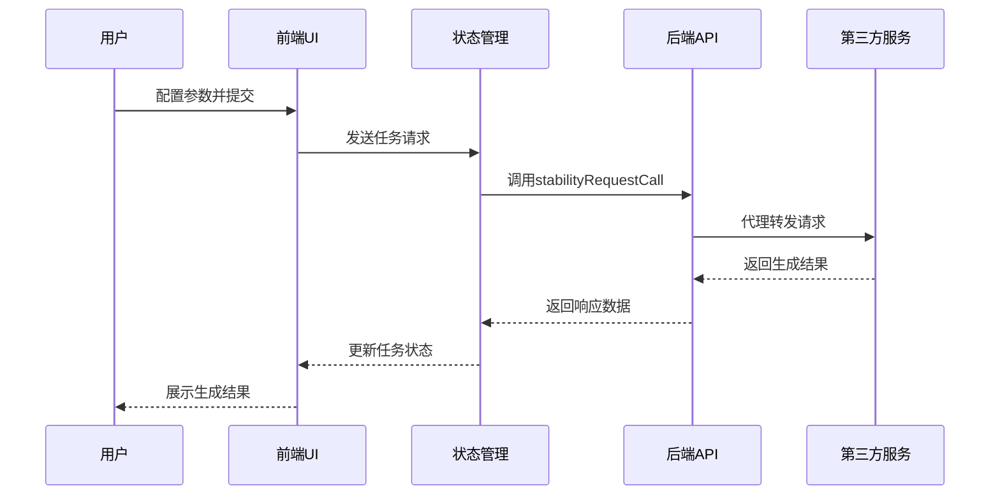
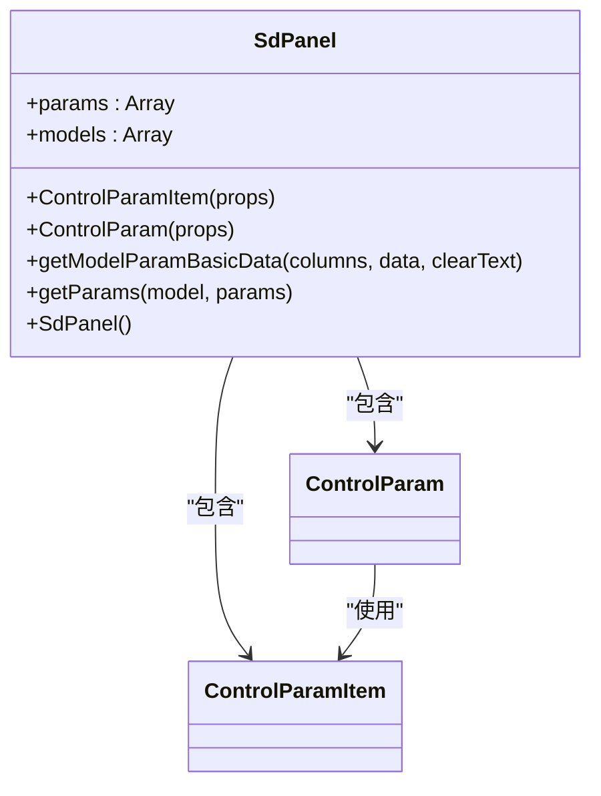
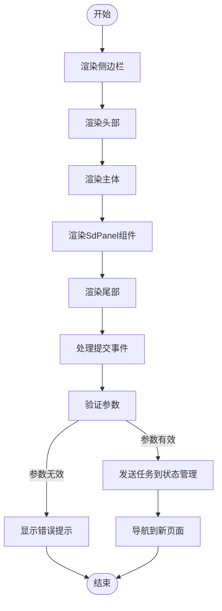
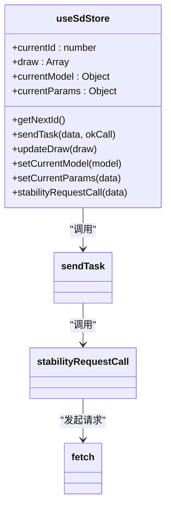
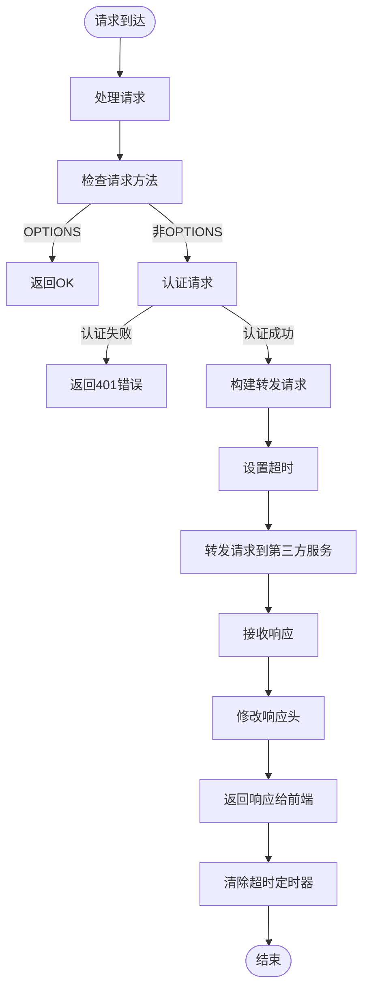
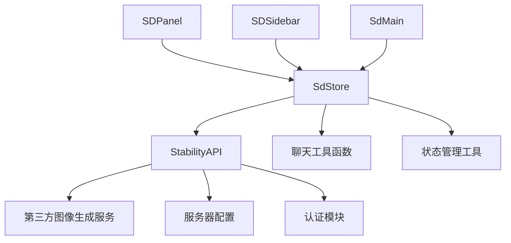

# 图像生成

<cite>
**本文档引用的文件**
- [sd-panel.tsx](file://app/components/sd/sd-panel.tsx)
- [sd-sidebar.tsx](file://app/components/sd/sd-sidebar.tsx)
- [sd.tsx](file://app/components/sd/sd.tsx)
- [sd.ts](file://app/store/sd.ts)
- [stability.ts](file://app/api/stability.ts)
- [constant.ts](file://app/constant.ts)
</cite>

## 目录
1. [简介](#简介)
2. [项目结构](#项目结构)
3. [核心组件](#核心组件)
4. [架构概述](#架构概述)
5. [详细组件分析](#详细组件分析)
6. [依赖分析](#依赖分析)
7. [性能考虑](#性能考虑)
8. [故障排除指南](#故障排除指南)
9. [结论](#结论)

## 简介
本文档系统化地描述了图像生成（Stable Diffusion）功能的全链路实现。涵盖了前端UI组件（sd-panel、sd-sidebar）的布局结构与用户交互逻辑，包括参数配置、提示词输入与生成结果展示。说明了状态管理模块（sd store）如何管理生成参数、任务队列与图像缓存。解析了后端API路由（/api/sd）的请求处理流程，包括参数校验、代理转发与响应封装。阐述了与第三方图像生成服务的集成方式，支持的模型格式与输出选项。提供了使用示例、常见问题排查（如超时、格式错误）与性能调优建议。

## 项目结构
图像生成功能的代码分布在多个目录中，主要包含前端组件、状态管理、API路由和常量定义。前端组件位于`app/components/sd/`目录下，状态管理位于`app/store/sd.ts`，API路由位于`app/api/stability.ts`，相关常量定义在`app/constant.ts`中。

**图源**
- [sd-panel.tsx](file://app/components/sd/sd-panel.tsx)
- [sd-sidebar.tsx](file://app/components/sd/sd-sidebar.tsx)
- [sd.tsx](file://app/components/sd/sd.tsx)
- [sd.ts](file://app/store/sd.ts)
- [stability.ts](file://app/api/stability.ts)
- [constant.ts](file://app/constant.ts)

**节源**
- [sd-panel.tsx](file://app/components/sd/sd-panel.tsx)
- [sd-sidebar.tsx](file://app/components/sd/sd-sidebar.tsx)
- [sd.tsx](file://app/components/sd/sd.tsx)
- [sd.ts](file://app/store/sd.ts)
- [stability.ts](file://app/api/stability.ts)
- [constant.ts](file://app/constant.ts)

## 核心组件
图像生成功能的核心组件包括前端UI组件（sd-panel、sd-sidebar）、状态管理模块（sd store）和后端API路由（/api/sd）。这些组件协同工作，实现了从用户交互到图像生成的完整流程。

**节源**
- [sd-panel.tsx](file://app/components/sd/sd-panel.tsx)
- [sd-sidebar.tsx](file://app/components/sd/sd-sidebar.tsx)
- [sd.tsx](file://app/components/sd/sd.tsx)
- [sd.ts](file://app/store/sd.ts)
- [stability.ts](file://app/api/stability.ts)

## 架构概述
图像生成功能采用前后端分离的架构设计。前端负责用户界面展示和交互，后端负责API请求的代理转发。状态管理模块作为中间层，协调前端和后端的数据流动。

**图源**
- [sd-panel.tsx](file://app/components/sd/sd-panel.tsx)
- [sd-sidebar.tsx](file://app/components/sd/sd-sidebar.tsx)
- [sd.ts](file://app/store/sd.ts)
- [stability.ts](file://app/api/stability.ts)

## 详细组件分析
### 前端UI组件分析
前端UI组件包括sd-panel和sd-sidebar，负责用户交互界面的展示和操作。

#### sd-panel组件
sd-panel组件提供了图像生成的主要参数配置界面，包括提示词、模型选择、图像风格等。

**图源**
- [sd-panel.tsx](file://app/components/sd/sd-panel.tsx)

**节源**
- [sd-panel.tsx](file://app/components/sd/sd-panel.tsx)

#### sd-sidebar组件
sd-sidebar组件提供了侧边栏界面，包含模型选择和提交按钮。

**图源**
- [sd-sidebar.tsx](file://app/components/sd/sd-sidebar.tsx)

**节源**
- [sd-sidebar.tsx](file://app/components/sd/sd-sidebar.tsx)

### 状态管理模块分析
状态管理模块（sd store）负责管理图像生成的全局状态，包括当前模型、参数配置、任务队列等。

**图源**
- [sd.ts](file://app/store/sd.ts)

**节源**
- [sd.ts](file://app/store/sd.ts)

### 后端API路由分析
后端API路由（/api/sd）负责处理前端的请求，代理转发到第三方图像生成服务。

**图源**
- [stability.ts](file://app/api/stability.ts)

**节源**
- [stability.ts](file://app/api/stability.ts)

## 依赖分析
图像生成功能依赖于多个外部服务和内部模块。主要依赖关系如下：

**图源**
- [sd-panel.tsx](file://app/components/sd/sd-panel.tsx)
- [sd-sidebar.tsx](file://app/components/sd/sd-sidebar.tsx)
- [sd.tsx](file://app/components/sd/sd.tsx)
- [sd.ts](file://app/store/sd.ts)
- [stability.ts](file://app/api/stability.ts)

**节源**
- [sd-panel.tsx](file://app/components/sd/sd-panel.tsx)
- [sd-sidebar.tsx](file://app/components/sd/sd-sidebar.tsx)
- [sd.tsx](file://app/components/sd/sd.tsx)
- [sd.ts](file://app/store/sd.ts)
- [stability.ts](file://app/api/stability.ts)

## 性能考虑
图像生成功能在性能方面需要考虑以下几个方面：
1. 请求超时设置：后端API设置了10分钟的超时时间，防止长时间挂起
2. 状态更新优化：使用状态管理store进行高效的状态更新
3. 图像缓存：生成的图像会被缓存，避免重复生成
4. 并行处理：支持多个生成任务并行处理

## 故障排除指南
### 常见问题及解决方案
1. **请求超时**：检查网络连接，确认第三方服务是否正常运行
2. **参数错误**：确保所有必填参数都已正确填写
3. **认证失败**：检查API密钥是否正确配置
4. **图像生成失败**：检查提示词是否符合要求，尝试调整参数

### 调试建议
1. 查看浏览器控制台日志
2. 检查网络请求的响应状态码
3. 确认服务器环境变量配置正确
4. 使用开发工具逐步调试

**节源**
- [stability.ts](file://app/api/stability.ts)
- [sd.ts](file://app/store/sd.ts)

## 结论
本文档详细描述了图像生成（Stable Diffusion）功能的全链路实现。从前端UI组件到状态管理，再到后端API路由，每个环节都有清晰的设计和实现。通过合理的架构设计和模块划分，实现了高效、稳定的图像生成功能。未来可以进一步优化用户体验，增加更多图像生成模型的支持，提升系统的可扩展性和性能。