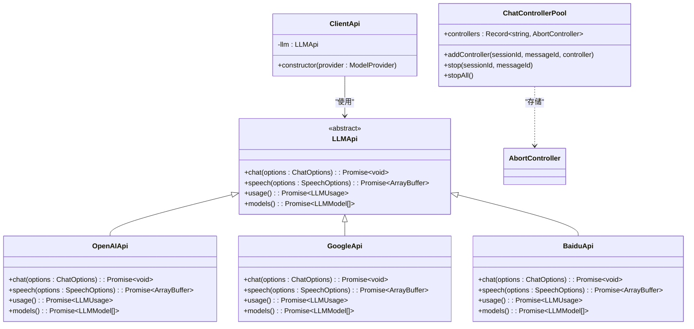
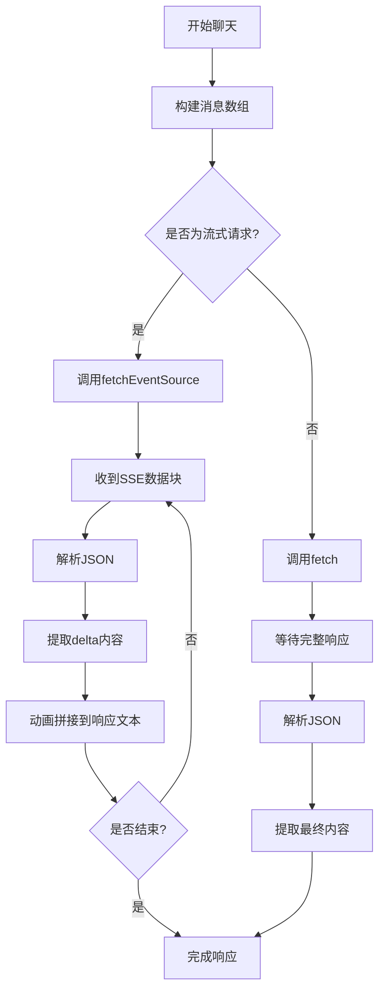
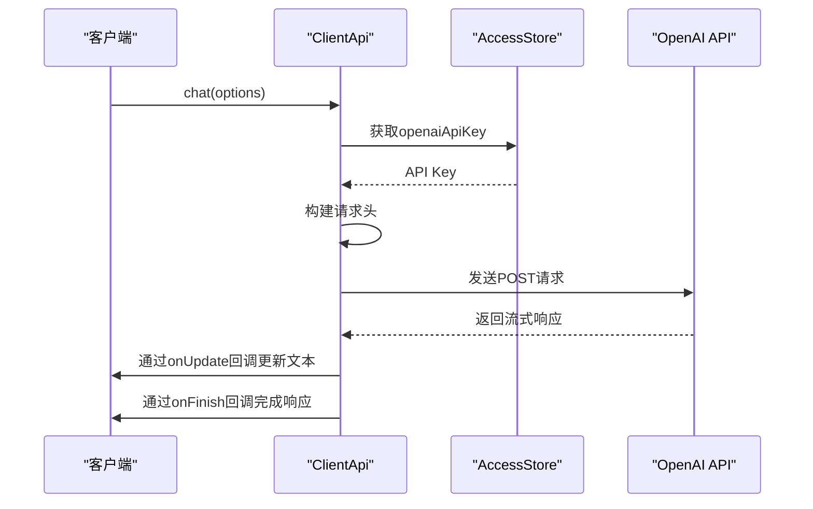

# 多AI模型支持

<cite>
**本文档引用的文件**   
- [app/client/api.ts](file://app/client/api.ts)
- [app/client/controller.ts](file://app/client/controller.ts)
- [app/client/platforms/openai.ts](file://app/client/platforms/openai.ts)
- [app/client/platforms/google.ts](file://app/client/platforms/google.ts)
- [app/client/platforms/anthropic.ts](file://app/client/platforms/anthropic.ts)
- [app/client/platforms/baidu.ts](file://app/client/platforms/baidu.ts)
- [app/client/platforms/alibaba.ts](file://app/client/platforms/alibaba.ts)
- [app/client/platforms/tencent.ts](file://app/client/platforms/tencent.ts)
- [app/client/platforms/moonshot.ts](file://app/client/platforms/moonshot.ts)
- [app/client/platforms/iflytek.ts](file://app/client/platforms/iflytek.ts)
- [app/client/platforms/deepseek.ts](file://app/client/platforms/deepseek.ts)
- [app/client/platforms/xai.ts](file://app/client/platforms/xai.ts)
- [app/client/platforms/glm.ts](file://app/client/platforms/glm.ts)
- [app/client/platforms/siliconflow.ts](file://app/client/platforms/siliconflow.ts)
- [app/client/platforms/ai302.ts](file://app/client/platforms/ai302.ts)
- [app/constant.ts](file://app/constant.ts)
- [app/api/common.ts](file://app/api/common.ts)
</cite>

## 目录
1. [简介](#简介)
2. [统一客户端适配层](#统一客户端适配层)
3. [核心设计模式](#核心设计模式)
4. [请求封装与响应解析](#请求封装与响应解析)
5. [认证方式与动态路由](#认证方式与动态路由)
6. [错误处理策略](#错误处理策略)
7. [扩展新模型提供商](#扩展新模型提供商)
8. [总结](#总结)

## 简介
ChatGPT-Next-Web 通过一个精心设计的统一客户端适配层（app/client），实现了对 OpenAI、Google、Anthropic、百度、阿里云、腾讯、月之暗面、讯飞、深度求索、XAI、智谱AI、硅基流动、302.AI 等众多主流 AI 服务提供商的支持。该系统的核心在于其模块化和可扩展的架构，它允许前端应用通过一致的接口与后端不同的 AI 模型进行交互，而无需关心底层服务提供商的具体实现细节。这种设计不仅极大地简化了客户端的开发工作，还为未来集成新的 AI 服务提供了清晰的路径。

**Section sources**
- [app/client/api.ts](file://app/client/api.ts#L1-L400)
- [app/constant.ts](file://app/constant.ts#L1-L934)

## 统一客户端适配层
统一客户端适配层是整个多AI模型支持系统的核心，它位于 `app/client` 目录下，主要由 `api.ts` 和 `controller.ts` 两个文件构成，并通过 `platforms` 子目录下的多个文件为各个具体的 AI 服务提供商提供实现。

`api.ts` 文件定义了所有 AI 服务必须遵循的抽象接口 `LLMApi`，该接口规定了 `chat`（聊天）、`speech`（语音合成）、`usage`（用量查询）和 `models`（模型列表）四个核心方法。任何新的 AI 服务提供商都必须实现这个接口，从而保证了上层调用的一致性。

`controller.ts` 文件则负责管理聊天过程中的控制器（AbortController），用于支持流式响应的中断和取消操作。它通过 `ChatControllerPool` 对象来存储和管理每个会话的控制器实例，使得用户可以随时停止正在进行的 AI 响应。

`platforms` 目录下的每个文件（如 `openai.ts`, `google.ts` 等）都对应一个具体的 AI 服务提供商，它们都实现了 `LLMApi` 接口。`ClientApi` 类作为客户端的总入口，根据用户选择的模型提供商，通过工厂模式动态地创建并返回相应的 `LLMApi` 实现实例。



**Diagram sources **
- [app/client/api.ts](file://app/client/api.ts#L108-L113)
- [app/client/controller.ts](file://app/client/controller.ts#L2-L37)
- [app/client/platforms/openai.ts](file://app/client/platforms/openai.ts#L82-L533)
- [app/client/platforms/google.ts](file://app/client/platforms/google.ts#L32-L317)
- [app/client/platforms/baidu.ts](file://app/client/platforms/baidu.ts#L47-L284)

**Section sources**
- [app/client/api.ts](file://app/client/api.ts#L1-L400)
- [app/client/controller.ts](file://app/client/controller.ts#L1-L38)
- [app/client/platforms](file://app/client/platforms)

## 核心设计模式
该系统的实现运用了多种经典的设计模式，确保了代码的可维护性和可扩展性。

**抽象工厂模式**：`ClientApi` 类是抽象工厂模式的典型应用。它根据传入的 `ModelProvider` 枚举值，决定实例化哪个具体的 `LLMApi` 实现（如 `ChatGPTApi`, `GeminiProApi`, `ErnieApi` 等）。这使得上层代码无需知道具体创建了哪个类，只需通过统一的 `llm` 属性进行调用即可。

**策略模式**：不同的 AI 服务提供商（如 OpenAI、Google、百度）被视为不同的“策略”。`ClientApi` 类在运行时选择并应用特定的策略（即具体的 API 实现）。当需要添加新的 AI 服务时，只需创建一个新的策略类并将其集成到工厂中，而无需修改现有代码。

**适配器模式**：`platforms` 目录下的每个文件都充当了适配器的角色。它们将各个 AI 服务提供商（这些服务可能拥有完全不同的 API 规范和数据格式）适配到统一的 `LLMApi` 接口上。例如，百度的 API 要求将 `system` 消息转换为 `user` 角色，而腾讯的 API 要求所有字段名首字母大写，这些差异都在各自的适配器中被处理。

```mermaid
classDiagram
class ClientApi {
+constructor(provider : ModelProvider)
-llm : LLMApi
}
class LLMApi {
<<interface>>
+chat()
+speech()
+usage()
+models()
}
class OpenAIApi {
+chat()
+speech()
+usage()
+models()
}
class GoogleApi {
+chat()
+speech()
+usage()
+models()
}
class BaiduApi {
+chat()
+speech()
+usage()
+models()
}
note right of ClientApi : 抽象工厂\n根据ModelProvider\n创建具体实现
note right of LLMApi : 策略接口\n定义统一行为
note right of OpenAIApi : 具体策略/适配器\n实现LLMApi接口
note right of GoogleApi : 具体策略/适配器\n实现LLMApi接口
note right of BaiduApi : 具体策略/适配器\n实现LLMApi接口
ClientApi --> LLMApi : "创建并持有"
LLMApi <|-- OpenAIApi
LLMApi <|-- GoogleApi
LLMApi <|-- BaiduApi
```

**Diagram sources **
- [app/client/api.ts](file://app/client/api.ts#L136-L182)
- [app/client/platforms/openai.ts](file://app/client/platforms/openai.ts#L82-L533)
- [app/client/platforms/google.ts](file://app/client/platforms/google.ts#L32-L317)
- [app/client/platforms/baidu.ts](file://app/client/platforms/baidu.ts#L47-L284)

**Section sources**
- [app/client/api.ts](file://app/client/api.ts#L136-L182)
- [app/client/platforms](file://app/client/platforms)

## 请求封装与响应解析
每个 AI 服务提供商的适配器都需要处理请求的封装和响应的解析，以确保与统一接口的兼容性。

**请求封装**：在发起请求前，适配器会根据目标服务的 API 规范对请求数据进行预处理。例如：
- **OpenAI**: 使用标准的 `messages` 数组，角色为 `system`, `user`, `assistant`。
- **Google**: 需要将角色 `system` 转换为 `user`，角色 `assistant` 转换为 `model`，并且需要将多模态内容（如图片）编码为 `inline_data` 格式。
- **百度**: 要求 `messages` 数组长度为奇数，且 `system` 消息只能在开头。如果不符合要求，适配器会自动插入空的 `user` 或 `assistant` 消息进行修正。
- **腾讯**: 要求所有 JSON 字段名首字母大写，适配器通过 `capitalizeKeys` 函数递归地转换整个请求对象。

**响应解析**：收到响应后，适配器需要从服务提供商特定的响应格式中提取出最终的文本内容。这通常通过 `extractMessage` 方法实现：
- **OpenAI**: 从 `res.choices[0].message.content` 中提取。
- **Google**: 从 `res.candidates[0].content.parts` 中提取文本。
- **百度**: 从 `res.result` 字段中提取。
- **腾讯**: 从 `res.Choices[0].Message.Content` 中提取。

对于流式响应（streaming），系统使用 `fetchEventSource` 库来处理 Server-Sent Events (SSE)。为了使响应看起来更平滑，系统还实现了动画效果，通过 `requestAnimationFrame` 逐步将接收到的文本片段拼接并显示给用户。



**Diagram sources **
- [app/client/platforms/openai.ts](file://app/client/platforms/openai.ts#L268-L425)
- [app/client/platforms/google.ts](file://app/client/platforms/google.ts#L188-L309)
- [app/client/platforms/baidu.ts](file://app/client/platforms/baidu.ts#L156-L267)
- [app/client/platforms/tencent.ts](file://app/client/platforms/tencent.ts#L145-L262)

**Section sources**
- [app/client/platforms/openai.ts](file://app/client/platforms/openai.ts#L268-L425)
- [app/client/platforms/google.ts](file://app/client/platforms/google.ts#L188-L309)
- [app/client/platforms/baidu.ts](file://app/client/platforms/baidu.ts#L156-L267)
- [app/client/platforms/tencent.ts](file://app/client/platforms/tencent.ts#L145-L262)

## 认证方式与动态路由
系统通过 `getHeaders` 函数统一处理不同服务提供商的认证方式。该函数会根据当前会话的配置，从全局状态（`useAccessStore`）中获取相应的 API Key 或 Token，并将其添加到请求头中。

不同的服务提供商使用不同的认证头：
- **OpenAI, Moonshot, DeepSeek, XAI, 302.AI, SiliconFlow**: 使用 `Authorization: Bearer <API_KEY>`。
- **Azure**: 使用 `api-key: <API_KEY>`。
- **Anthropic**: 使用 `x-api-key: <API_KEY>`。
- **Google**: 使用 `x-goog-api-key: <API_KEY>`。
- **讯飞 (Iflytek)**: 使用 `Authorization: <API_KEY>:<API_SECRET>`，将 Key 和 Secret 用冒号连接。

对于**动态路由**，系统允许用户通过配置自定义 API Base URL。在每个适配器的 `path` 方法中，会优先检查用户是否启用了自定义配置 (`useCustomConfig`)。如果启用，则使用用户指定的 URL；否则，使用默认的官方或代理地址。这使得用户可以将请求转发到自己的代理服务器或私有部署的实例。



**Diagram sources **
- [app/client/api.ts](file://app/client/api.ts#L231-L366)
- [app/client/platforms/openai.ts](file://app/client/platforms/openai.ts#L85-L122)
- [app/client/platforms/google.ts](file://app/client/platforms/google.ts#L33-L59)

**Section sources**
- [app/client/api.ts](file://app/client/api.ts#L231-L366)
- [app/client/platforms](file://app/client/platforms)

## 错误处理策略
系统实现了多层次的错误处理机制，以确保用户体验的健壮性。

**网络请求错误**：在 `fetch` 调用的 `catch` 块中捕获网络错误、超时或解析错误，并通过 `options.onError` 回调将错误信息传递给上层组件进行展示。

**API 响应错误**：对于非 200 的 HTTP 状态码或 API 返回的错误对象，系统会进行解析。例如：
- **401 Unauthorized**: 会提示用户“未授权”，通常意味着 API Key 无效。
- **百度/腾讯等**: 会解析响应体中的 `error_code` 和 `error_msg` 字段，并将其转换为用户友好的错误信息。
- **Google 安全拦截**: 如果请求被 Google 的安全策略拦截，会明确提示用户“消息因安全原因被阻止”。

**流式传输错误**：在使用 `fetchEventSource` 时，通过 `onerror` 和 `onclose` 回调来处理 SSE 连接过程中的各种错误，并确保 `AbortController` 能够正确清理。

**Section sources**
- [app/client/platforms/openai.ts](file://app/client/platforms/openai.ts#L426-L429)
- [app/client/platforms/google.ts](file://app/client/platforms/google.ts#L306-L308)
- [app/client/platforms/baidu.ts](file://app/client/platforms/baidu.ts#L254-L257)
- [app/client/platforms/tencent.ts](file://app/client/platforms/tencent.ts#L249-L252)

## 扩展新模型提供商
扩展一个新的 AI 模型提供商需要遵循以下步骤：

1.  **定义常量**：在 `app/constant.ts` 文件中，为新的服务提供商添加 `ServiceProvider` 枚举值、`ModelProvider` 枚举值、基础 URL 常量和 API 路径常量。
2.  **创建适配器**：在 `app/client/platforms/` 目录下创建一个新的 TypeScript 文件（如 `newprovider.ts`）。
3.  **实现 LLMApi 接口**：在新文件中创建一个类（如 `NewProviderApi`），并实现 `LLMApi` 接口的所有方法。
4.  **处理请求/响应**：在 `chat` 方法中，根据新提供商的 API 文档，正确地封装 `RequestPayload`，并实现 `extractMessage` 方法来解析响应。
5.  **处理认证**：在 `getHeaders` 函数中添加对该新提供商认证方式的支持。
6.  **注册到工厂**：在 `ClientApi` 的构造函数中，添加一个新的 `case` 语句，当 `provider` 为新的 `ModelProvider` 时，实例化并赋值 `this.llm` 为新的 `NewProviderApi` 实例。
7.  **测试验证**：编写单元测试（位于 `test/` 目录下），验证新适配器的 `chat`、`models` 等方法能够正确工作。

通过这种模块化的设计，添加一个新的 AI 服务提供商变得相对简单和标准化，主要工作集中在处理其 API 的特定细节上。

**Section sources**
- [app/constant.ts](file://app/constant.ts#L120-L164)
- [app/client/api.ts](file://app/client/api.ts#L139-L182)
- [app/client/api.ts](file://app/client/api.ts#L231-L366)

## 总结
ChatGPT-Next-Web 的多 AI 模型支持机制是一个设计精良、高度模块化的系统。它通过抽象接口、设计模式和统一的配置管理，成功地将众多异构的 AI 服务提供商整合到一个统一的前端应用中。其核心优势在于：
- **一致性**：为所有 AI 服务提供了统一的编程接口。
- **可扩展性**：通过清晰的适配器模式，可以轻松集成新的服务。
- **灵活性**：支持自定义 API 地址和多种认证方式。
- **健壮性**：实现了全面的错误处理和流式响应支持。

这一架构不仅满足了当前的需求，也为未来的功能扩展和维护奠定了坚实的基础。